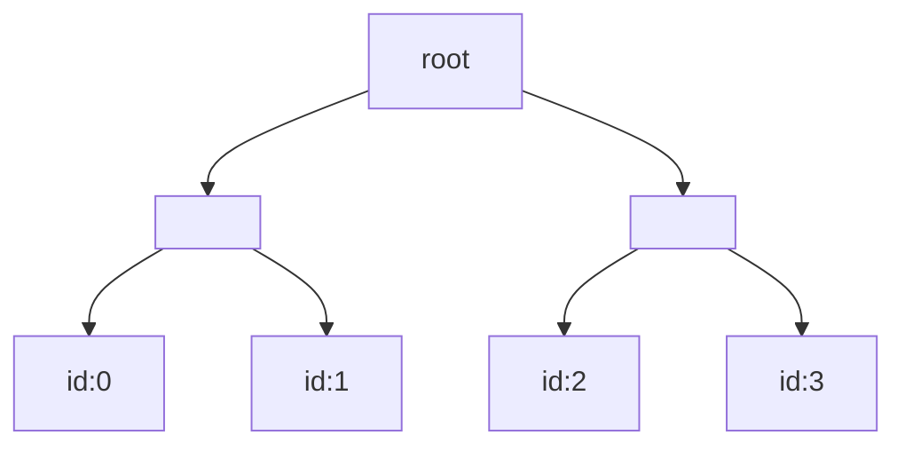
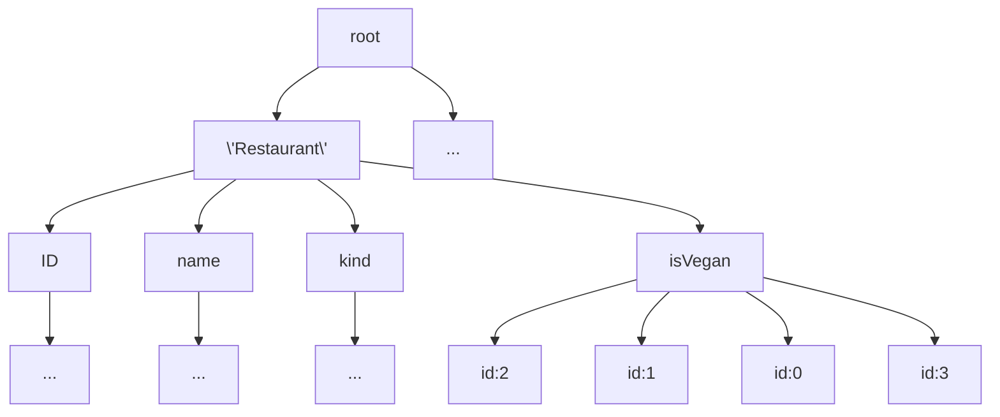

# GroveDB
*Hierarchical Authenticated Data Structure with Efficient Secondary Index Queries*

GroveDB is a database system designed specifically for efficient secondary index queries with proofs, as well as speed and reliability. It was built for use within [Dash Platform](https://dashplatform.readme.io/docs/introduction-what-is-dash-platform), but can be easily integrated into other applications for similar use.  
   
Secondary indices are crucial to any database management system. All previous solutions had certain tradeoffs depending on the problem they were trying to solve. 

## Motivation
Consider an authenticated data structure, like a Merkle tree built on a database of restaurants for example. Each restaurant has certain attributes, such as price and type:

```
struct Restaurant{
	ID uint32;
	name: String;
	type: String;
	isVegan: bool;
};
```

If we have say four restaurants, we might normally commit them to a Merkle tree as follows:




Querying by primary key is easy and efficient. If we have a query such as  ```SELECT * WHERE ID <= 2; ```, we can return the appropriate elements as well as construct an efficient range proof. However, querying by a secondary index is not efficient at all; it's likely that you will have to iterate over the entire structure. Consider the query ``` SELECT * WHERE isVegan=true;```. When sorted by primary key, the vegan restaurant won't be contiguous. Not only will the proof be nontrivial, but so will the time required to find these elements. 

GroveDB is a classic time-space tradeoff. It enables efficient querying on secondary indices by precomputing and committing them. A subtree of each possible queryable secondary index (up to a cap) is built and committed to our authenticated data structure. A tree of subtrees; a grove. For the same data, part of the analogous GroveDB structure might look like this:


From here, a query on the secondary index ```isVegan``` would traverse to the subtree built for this secondary index. The items are not necessarily replicated, but referenced to.
## Features
- **Efficient secondary index queries** - Built specifically for and tailored to secondary index queries.
- **Proofs** - Supports proofs of membership, proofs of non-membership, and range proofs.
- **Run anywhere** - Being written in Rust, it supports all compile targets. x86, Raspberry Pis (AArch64), and Wasm. There are Node.js bindings as well.

## Architecture
Insertion and deletion work as you might expect, updating the respective subtrees and returning appropriate proofs of membership/nonmembership.
### Tree structure(s)
Instead of disjoint authenticated data structures, we opt for a unified one; a hierarchical, authenticated data structure based off of [Database Outsourcing with Hierarchical Authenticated Data Structures](https://ia.cr/2015/351). Elements are the most atomic pieces and can be represented in a few ways. They can be items, item references, trees, trees with items, or even trees with item references. An element contains an item, a reference to an object, or a subtree.


The trees are based off of our fork of Merk, with custom patches applied for better use with GroveDB. Merk is unique in the fact that it's an AVL tree, so the intermediary nodes also contain a key/value pair. Each node contains a third hash, the ```kv_hash```, in addition to the hashes of its left and right children. The ```kv_hash``` is simply computed as ```kv_hash=H(key,value)```. The node hash is then computed as ```H(kv_hash,left_child_hash,right_child_hash)```. Merk uses Blake2B, and rs-merkle uses SHA256. 

### Storage
RocksDB is a key-value store, forked from LevelDB and built out by Facebook. We chose it because of its high performance, maturity, and its compatibility with our stack. Merk itself is built on top of RocksDB.

We have three types of storage: auxiliary, metadata, and tree root storage. Auxiliary storage is used to store plain key-value data which is not used in consensus.  Metadata is used to store things outside of the GroveDB usage scope. Is has no prefixes, and therefore has no relation to subtrees. It lives at a higher level. Tree root storage is used to store subtrees.

A database transaction in GroveDB is a wrapper around the ```OptimisticTransactionDB``` primitive from RocksDB. An optimistic transaction hopes on average there will be only a few conflicts, which are detected at the commit stage. This is as compared to the pessimistic model, which uses a lock. 

## Querying
To query GroveDB, a path and a query item have to be supplied.
The path specifies the subtree, and the query item determines which nodes are selected from the subtree.

GroveDB currently supports 10 query item types:
- Key(key_name)
- Range(start..end)
- RangeInclusive(start..=end)
- RangeFull(..)
- RangeFrom(start..)
- RangeTo(..end)
- RangeToInclusive(..=end)
- RangeAfter(prev..)
- RangeAfterTo(prev..end)
- RangeAfterToInclusive(prev..=end)

This describes a basic query system: select a subtree then select nodes from that subtree. The need to create more complex queries or add restrictions to the result set may arise, which leads us to the **PathQuery**.

### PathQuery
The ```PathQuery``` allows for more complex queries with optional restrictions on the result set, i.e. limits and offsets. 
```
    PathQuery
        path: [k1, k2, ..]
        sized_query: SizedQuery
            limit: Optional<number>
            offset: Optional<number>
            query: Query
                items: [query_item_1, query_item_2, ...],
                default_subquery_branch: SubqueryBranch
                    subquery_key: Optional<key>
                    subquery_value: Optional<Query>
                conditional_subquery_branches: Map<QueryItem, SubqueryBranch>
                        
```

A path is needed to define the starting context for the query.

#### SizedQuery
The ```sized_query``` determines how the result set would be restricted. It holds optional limits and offset values. 
The ```limit``` determines the maximum size of the result set and the ```offset``` specifies the number of elements to skip before adding to the result set. 

##### Query
The ```query``` object is a recursive structure - it specifies how to select nodes from the current subtree and has the option to recursively apply another query to the result set obtained from the previous query. 

##### Items
The ```items``` are a collection of query items that decide which nodes to select from the current context (this builds a result set).  

Before describing ```default_subquery_branch``` and ```conditional_subquery_branches```, we need to define their building blocks, subquery branches:

##### Subquery Branches
```
    subquery_key: Optional<Key>
    subquery_value: Optional<Query>
```
**Cases**  
- ```subquery_key: true```, ```subquery_value: false```  
The node with the subquery key is selected and returned as the result set.

- ```subquery_key: false```, ```subquery_value: true```  
The query held in subquery_value is applied directly to the subtree, and the result is returned as the result set.

- ```subquery_key: true```, ```subquery_value: true``` 
First the node with the subquery key is selected and set as new context.  
Then, the subquery value is applied to this new context, and the result is returned as the result set.

The subquery branch is used on a single node but can be applied to the result set of a previous query with the use of **default_subquery_branch** and **conditional_subquery_branches**:

##### default_subquery_branch
If this exists, the specified subquery branch is applied to every node in the result set of the previous query.

##### conditional_subquery_branch
Rather than applying a subquery branch to every node in the result set, you might want to apply it to a subset of the result set.  In such cases, we make use of a conditional subquery.  
  
The conditional subquery holds a map QueryItem to SubqueryBranch.  
```
    Map<QueryItem, SubqueryBranch>
```
For every node in the result set, we check if there is a query item that matches it. If there is, then the associated subquery branch is applied to that node.  Note that once a conditional subquery has been applied to a node, the default subquery does run on that node.

## Merging Path Queries
This section describes how GroveDB deals with the merging of path queries.

Mergeable path queries allow for the combination of separate path queries that do different things into a single equivalent path query.  
  
A path query can be represented as a set of keys (path to a subtree), and a query to apply to that subtree (query can have unknown depth):  

p<sub>i</sub> = [k<sub>1</sub>, k<sub>2</sub>, .., k<sub>n</sub>, Query]

Something very important to show is that a path query chain can be compressed at any point, i.e. you can turn a sequence of keys into a single query.  

Consider p<sub>1</sub> = [k<sub>1</sub>, k<sub>2</sub>, k<sub>3</sub>]. This reads as: 
- From the root tree, select node with key k1
- Change the context to k1, then select the node with key k2
- Change the context to k2 and finally select the node with key k3

We can create an equivalent query to represent this, which can look like this:
```
    Query
        query k1
        cond on k1
            query k2
            cond on k2
                query k3
                cond on k3
```
[k<sub>1</sub>, k<sub>2</sub>, k<sub>3</sub>] => [Q<sub>1</sub>],  where Q1 is equivalent to the path array.  

This can also be done at any point in the path array, so we can have:  

[k<sub>1</sub>, k<sub>2</sub>, k<sub>3</sub>] => [k<sub>1</sub>, Q<sub>2</sub>]  
[k<sub>1</sub>, k<sub>2</sub>, k<sub>3</sub>] => [K<sub>1</sub>, K<sub>2</sub> Q<sub>3</sub>]

The path merge algorithm becomes:
- Find the common path across the path queries
- Compress each path array to a query after the common path index
- Merge the compressed query into a single query
- Return new path query with common path as path and combined query as query

**Example:**  
p<sub>1</sub> =  [k<sub>1</sub>, k<sub>2</sub>, k<sub>3</sub>, Q<sub>a</sub>]  
p<sub>2</sub> =  [k<sub>1</sub>, k<sub>2</sub>, k<sub>4</sub>, Q<sub>b</sub>]

Common path = [k1, k2]  

Compress each path array after common path:  
p<sub>1</sub> = [k<sub>1</sub>, k<sub>2</sub>, Q<sub>c</sub>]  
p<sub>2</sub> = [k<sub>1</sub>, k<sub>2</sub>, Q<sub>d</sub>]  

Merge compressed queries:  
Q<sub>p</sub> = Q<sub>c</sub> + Q<sub>d</sub> 

Return final PathQuery:  
p<sub>f</sub> = [k<sub>1</sub>, k<sub>2</sub>, Q<sub>p</sub>]


## Usage
GroveDB is built for use with Dash Platform, but can be easily integrated into other applications for similar use. See its use in [rs-drive](https://github.com/dashevo/rs-drive) ([example](https://github.com/dashevo/rs-drive-example)). 

We currently also have bindings for Node.js. See [node-grove](https://github.com/dashevo/grovedb/tree/master/node-grove). 

## Building
First, install [rustup](https://www.rust-lang.org/tools/install) using your preferred method. 

Rust nightly is required to build, so ensure you are using the correct version.

```rustup install nightly```

Clone the repo and navigate to the main directory:

```git clone https://github.com/dashevo/grovedb.git && cd grovedb```

From here we can build: 

```cargo build```


## Performance

run with ```cargo test```
|CPU | Time |
|----|-----|
|Raspberry Pi 4 | 2m58.491s|
|R5 1600AF | 33.958s |
|R5 3600 | 25.658s |

