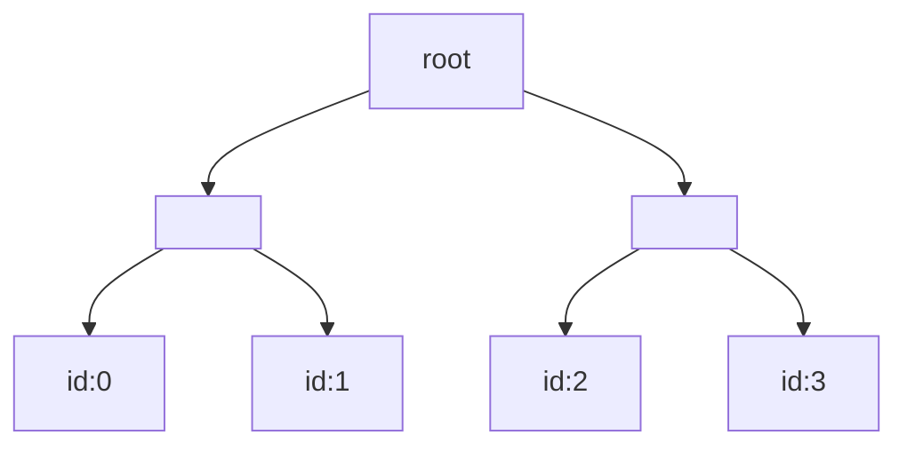
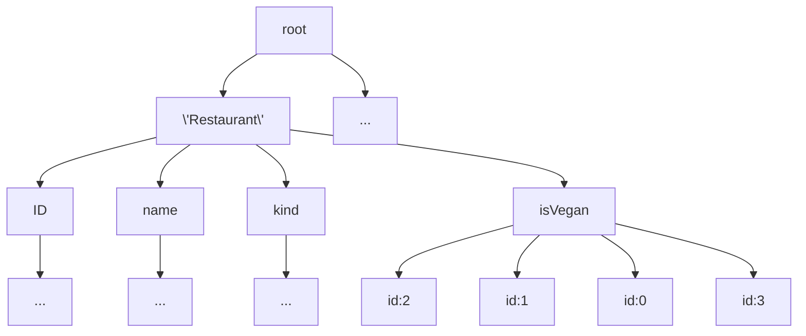

# GroveDB
*Hierarchical Authenticated Data Structure with Efficient Secondary Index Queries*
GroveDB is a database system designed specifically for efficient secondary index queries, proofs, speed, and reliability. It was built for use within [Dash Platform](https://dashplatform.readme.io/docs/introduction-what-is-dash-platform). Secondary indices are crucial to any database management system. All previous solutions had certain tradeoffs depending on the problem they were trying to solve. 

## Motivation
Consider a authenticated data structure, like a merkle tree built on a database of say, restaurants. Each restaurant has certain attributes, such as price, and type.

```
struct Restaurant{
	ID uint32;
	name: String;
	kind: String;
	isVegan: bool;
};
```

If we have say, four restaurants, we might normally would commit to them in a merkle tree as follows:




Querying by primary key is easy and efficient. If we have a query such as  ```SELECT * WHERE ID <= 2; ```. We can return the appropriate elements, as well as construct an efficient range proof. Querying by a secondary index is not efficient at all. It is likely you have to iterate over the entire structure. Consider the query ``` SELECT * WHERE isVegan=true;```. When sorted by primary key, the vegan restaurant wont be contiguous. Not only will the proof be nontrivial, but so will the time required to find these elements. 

GroveDB is a classic time-space tradeoff. It enables efficient querying on secondary indices by precomputing and committing to them. A subtree of each possible queryable secondary index (up to a cap) is built and committed to into our authenticated data structure. A tree of subtrees; a grove. For the same data, part of the analogous GroveDB structure might look like this:


From here, a query on the secondary index ```isVegan``` would traverse to the subtree built for this secondary index. The items are not necessarily replicated, just references.
## Features
- **efficient secondary index queries** - Built specifically for, and tailored to secondary index queries
- **Proofs** Supports proofs of membership, proofs of non-membership, and range proofs.
- **Run anywhere** being written in Rust, it supports all compile targets. x86, raspberry pis (aarch64), and wasm. There are nodejs bindings as well.

## Architecture
Insertion, deletion work as you might expect, updating the respective subtrees and returning appropriate proofs of membership/nonmembership. On 
### Tree structure(s)
Instead of disjoint authenticated data structures, we opt for one unified one; A hierarchical authenticated data structure, based off of [Database Outsourcing with Hierarchical Authenticated Data Structures](https://ia.cr/2015/351). Elements are the most atomic piece and can be represented in a few ways. They can be items, item references, trees, trees with items, or even trees with item references. an element contains an item, a reference to an object, and a subtree.


The main tree is a plain dense merkle tree. It is built with [rs-merkle](https://github.com/antouhou/rs-merkle), a high performance merkle tree library. Each node in the main tree is an element, usually a reference to a subtree.

The subtrees themselves are based off our fork of Merk with custom patches applied for better use with groveDB. Merk is unique in fact that it is an AVL tree, so the intermediary nodes also contain a key/value pair. Each node contains a third hash, the ```kv_hash``` in addition to the hashes of its left and right children.The ```kv_hash``` is simply computed as ```kv_hash=H(key,value)```. The node hash is then computed as ```H(kv_hash,left_child_hash,right_child_hash)```. Merk uses Blake2B, and rs-merkle uses SHA256. 

### Storage
RocksDB is a key-value storage built by facebook (based off of LevelDB). We chose it because of its performance. Merk is also built upon RocksDB. 

We have three types of storage, auxillary, metadata, and tree root storage. Auxillary storage is used to store plain key-value data which is not used in consensus.  Metadata has no prefixes. Prefixed things are related to subtrees, and metadata lives at a higher level. Its used to store things outside of the GroveDB usage scope. Tree root storage is used to store subtrees.

A database transaction in GroveDB is a wrapper around the ```OptimisticTransactionDB``` primitive from RocksDB. An optimistic transaction hopes on average there will be few conflicts, only detected at the commit stage. This is as compared to the pessemistic model, which uses a lock. 


## Usage
GroveDB is built for use with Dash Platform. See its use in [rs-drive](https://github.com/dashevo/rs-drive) ([example](https://github.com/dashevo/rs-drive-example)). 

We currently also have bindings for nodejs, see [node-grove](https://github.com/dashevo/grovedb/tree/master/node-grove). 

## Building
First, install [rustup](https://www.rust-lang.org/tools/install) using your preferred method. 


Rust nightly is required to build, so ensure you are using the correct version

```rustup install nightly```

Clone the repo and navigate to the main directory

```git clone https://github.com/dashevo/grovedb.git && cd grovedb```

From here we can build 

```cargo build```


## Performance

run with ```cargo test```
|CPU | Time |
|----|-----|
|Raspberry Pi 4 | 2m58.491s|
|R5 1600AF | 33.958s |
|R5 3600 | 25.658s |

