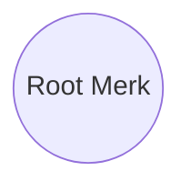
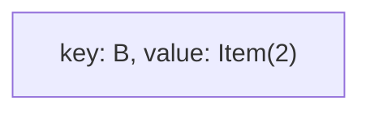
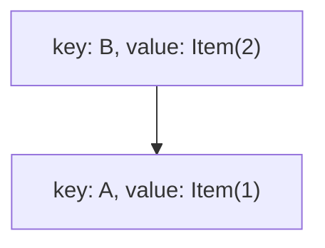
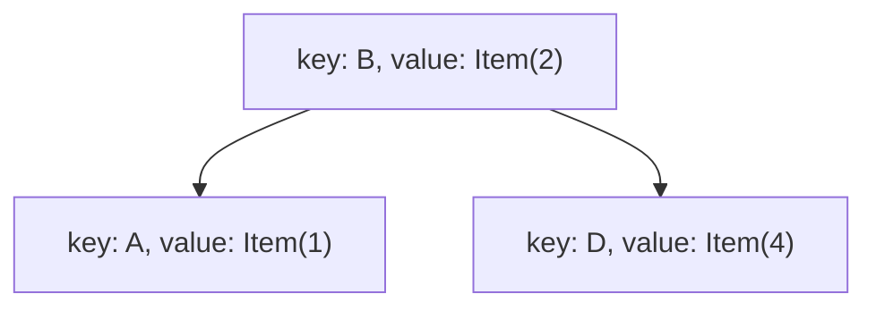
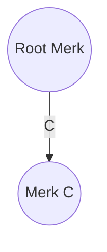
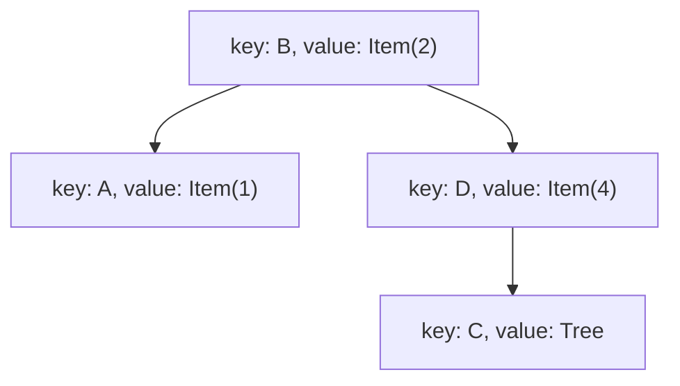
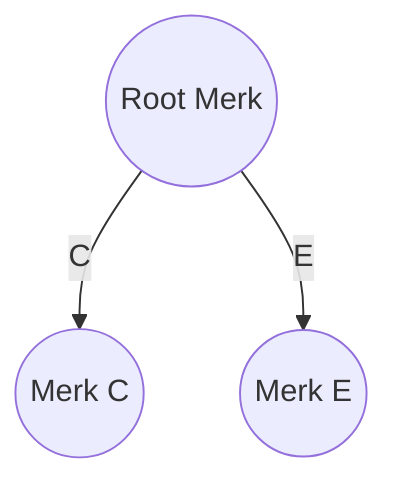
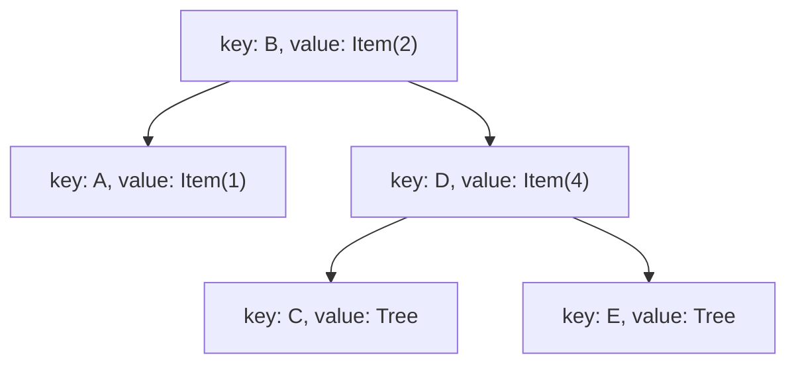
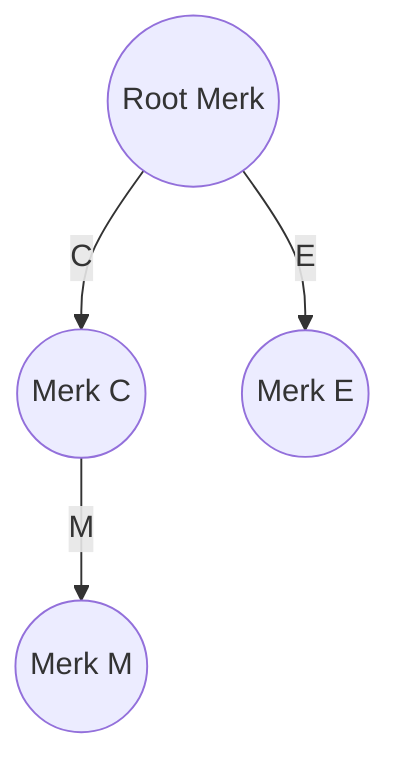

# GroveDB Structure

In this document we will provide an overview of grovedb’s structure. 

### Prerequisite Reading
[Merk Proofs](merk-proofs.md)

GroveDB consists of a hierarchy of Merk trees. Recall a Merk tree is a merklized AVL tree capable of storing and returning key values in a provable manner.

When initializing GroveDB, it begins with a single Merk tree referred to as the root tree. This serves as the entry point for accessing the database and the starting point for all subsequent insertions. 

Now, let’s explore the 5 different element types available in GroveDB:

- Item:
    - Items in GroveDB represent arbitrary bytes, allowing for the storage of any type of data within the database
- Reference
    - GroveDB supports references, which serve as pointers to other elements within the database
- Tree
    - Trees in GroveDB are used to represent sub-merk structures within the hierarchy. They provide a way to organize and group related elements together.
- SumItem
    - Similar to an item, a SumItem stores integer numbers exclusively. It is designed to store and retrieve numeric values for calculations or summarizations
- SumTree
    - A SumTree in GroveDB functions similarly to a tree but additionally computes the sum of every summable element beneath it. This includes SumItems or other SumTrees within its subtree. It facilitates efficient computation and retrieval of aggregated values.

## Element Insertion

Recall, at the start grovedb consists of a single empty merk tree known as the root tree, all element insertions starts from here.



To insert an element into GroveDB, you need to specify three essential components:

- The path to the Merk tree where you want to insert the element.
- The key at which you want to insert the element within the specified Merk tree.
- The actual element you intend to insert into GroveDB.

In the case of the root Merk tree, which is the starting point of GroveDB, the path to the root Merk is represented as an empty path: **`[]`**.

### Effect of Insertion on GroveDB Structure

When inserting an Item, Reference, or SumItem into GroveDB, the high-level structure of GroveDB remains unchanged. These elements are added within the root Merk tree without creating any additional Merks. Therefore, there are no structural side effects caused by inserting these elements.

However, when adding a Tree or SumTree element, the nodes are not only added to the root Merk tree but also new sub-Merks are created within the overall GroveDB structure.

To provide a clearer understanding, let's go through an example to illustrate this behavior.

### Insertion Example

Initial GroveDB structure:


Insert path = [], key = B, value = Item(”2”)

- we are inserting an Item element with the value "2" into the root Merk tree at key B.
- no subtree is created so the grovedb structure remains as above, what changes is the content of the root merk

GroveDB Structure: Unchanged

Root Merk Structure:



Insert path = [], key = A value = Item(”1”)

- insert Item element “1” into the root Merk tree at key A
- still no subtree is created, grovedb structure remains the same, root merk is updated.

GroveDB Structure: Unchanged

Root Merk Structure:



Insert path = [] key = D value = Item(”4”)

GroveDB Structure: Unchanged

Root Merk Structure:



Insert path = [] key = C, value = Tree

- Here, we are inserting a Tree element into the root Merk tree at key C. This insertion not only adds the Tree element to the root Merk but also creates a new sub-Merk within GroveDB.

GroveDB Structure:



Root Merk Structure:



Insert path = [] key = E, value = Tree

GroveDB Structure



Root Merk Structure:



After all insertion operations we now have 3 merks:

- The root merk (path - [])
- Merk C (path - [C])
- Merk E (path - [E])

### Root Hash Computation

From a high level, the root hash of the entire GroveDB structure is the root hash of the root merk. The root hash should represent a commitment to all data stored in GroveDB.

Hence we have to ensure that all provable information somehow contributes to the root hash value.

Recall merk root hash generation:

```rust
// the merk root hash is the node_hash of it's root node
node_hash = Hash(kv_hash || left_child_node_hash || right_child_node_hash)

// to compute that we need to compute the kv_hash
kv_hash = Hash(varint(key.len()) || key || value_hash)

// to compute the kv_hash we need to compute the value hash
// which is just the hash of the value
value_hash = Hash(serialized_element)
```

To ensure that all provable information contributes to the root hash value in GroveDB, it is important to modify the value_hash computation for Tree elements. 

Instead of simply hashing the value "serialized_tree_element" we should hash the concatenation of "serialized_tree_element" with the root hash of the sub-Merk associated with that Tree element.

Here's an updated version of the merk root hash generation:

```rust

// The merk root hash is the node_hash of its root node
node_hash = Hash(kv_hash || left_child_node_hash || right_child_node_hash)

// To compute the kv_hash, we need to compute the value_hash
// For Tree elements, we modify the value_hash computation
if element_type == Element::Tree {
    value_hash = Hash(serialized_tree_element + root_hash_of_sub_merk)
} else {
    // For other non-tree elements, we hash the value as usual
    value_hash = Hash(value)
}

// To compute the kv_hash, we hash the key with the modified value_hash
kv_hash = Hash(varint(key.len()) || key || value_hash)
```

This ensures that the relationship between the tree node and the underlying merk is committed to. 

### Root Hash Propagation

To maintain the integrity of the root hash in GroveDB, we need to update the root hash whenever a change is made to any path within the tree structure. This process involves propagating the updates from the modified Merk tree up to the root node.

When a change is made to a Merk tree, its root hash is recalculated to reflect the updated data. Subsequently, the Tree node representing that Merk tree in its parent Merk is also updated, triggering a change in the parent's Merk root hash. This update propagation continues upward, affecting each parent Merk along the path until reaching the root node.

This ensures that any modifications made within the GroveDB structure are reflected in the root hash, providing a consistent and provable representation of the entire database.

### Example

Given this GroveDB structure:



When Merk M is updated, its root hash is recalculated to reflect the changes.

Next, we update the value_hash of the Tree element in Merk C that corresponds to Merk M. This update modifies the root hash of Merk C.

Finally, we update the value_hash of the Tree element in the Root Merk that corresponds to Merk C.

This sequence of updates results in the recalculation of the root hash of the Root Merk, which represents the hash of the entire GroveDB structure.