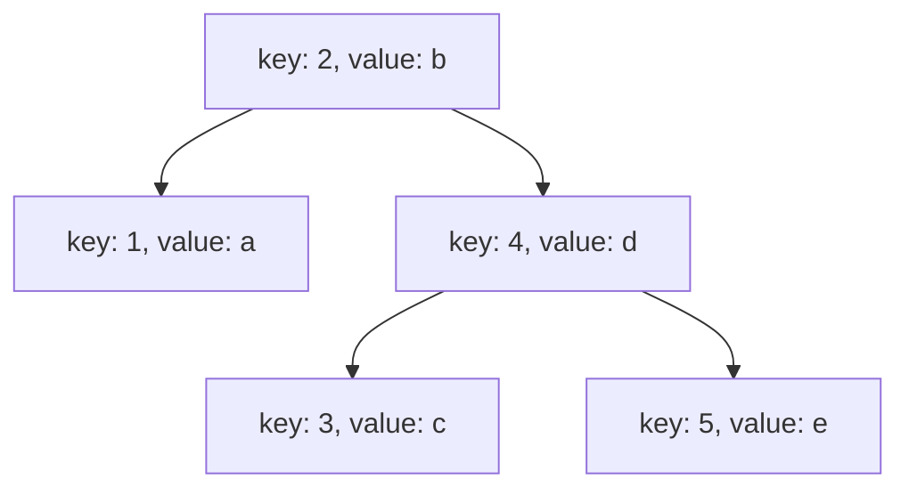
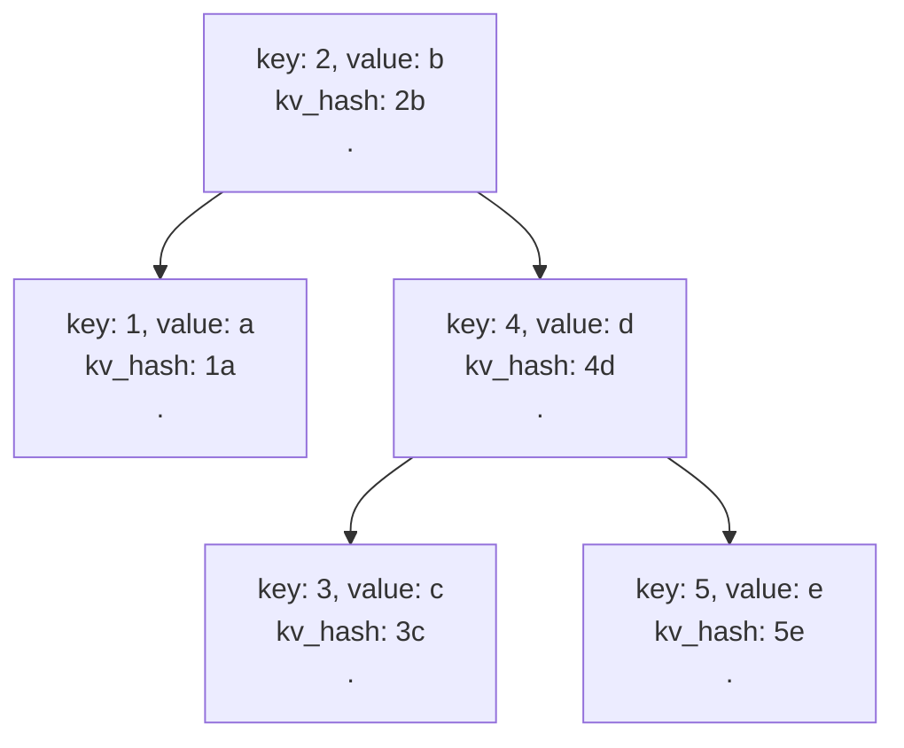
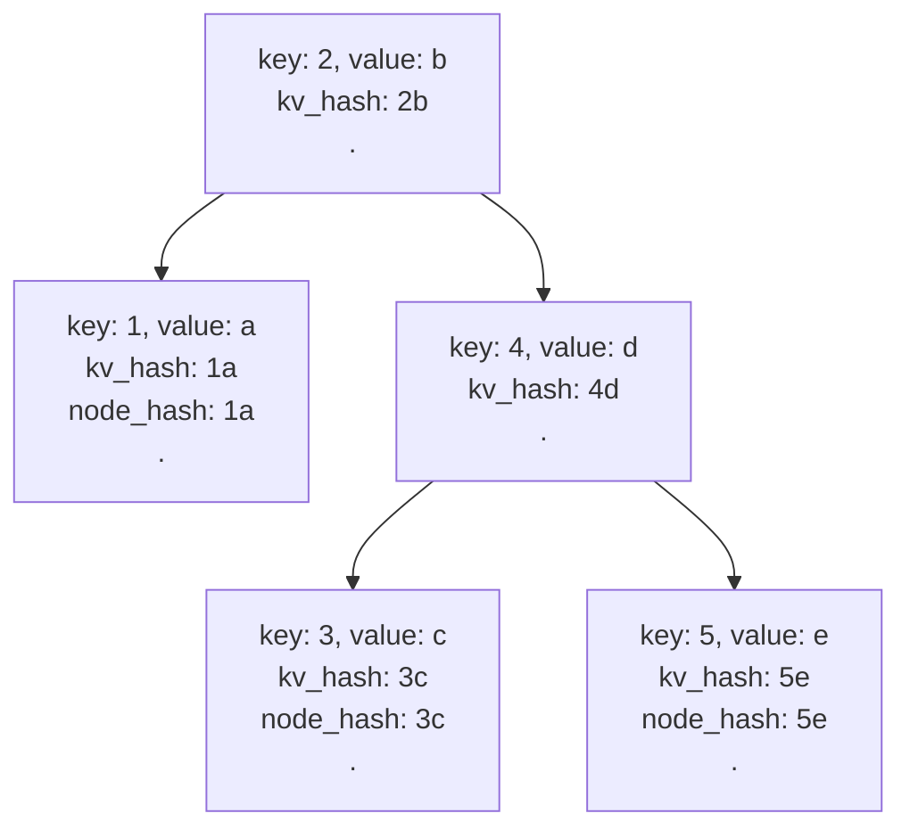
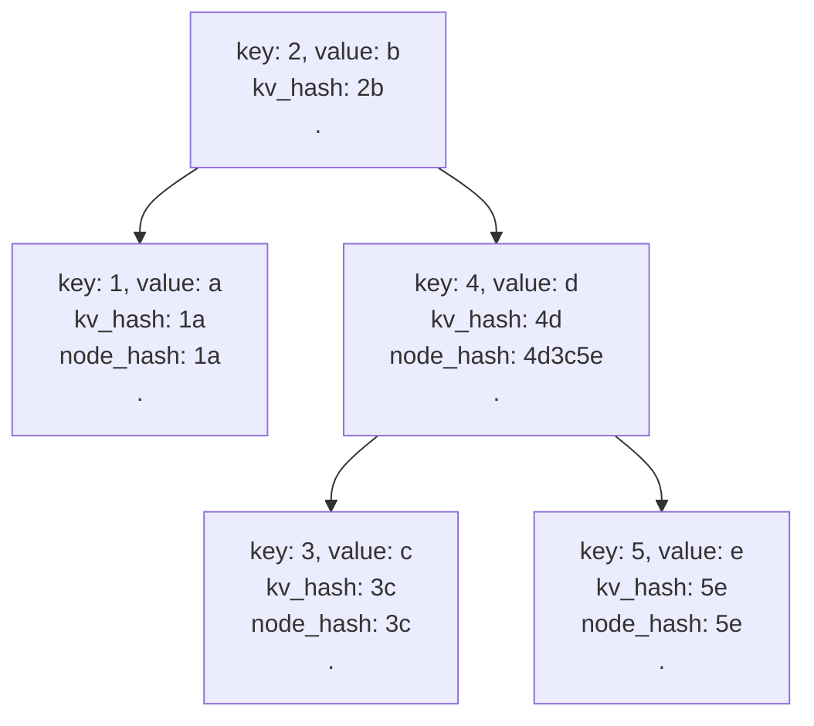
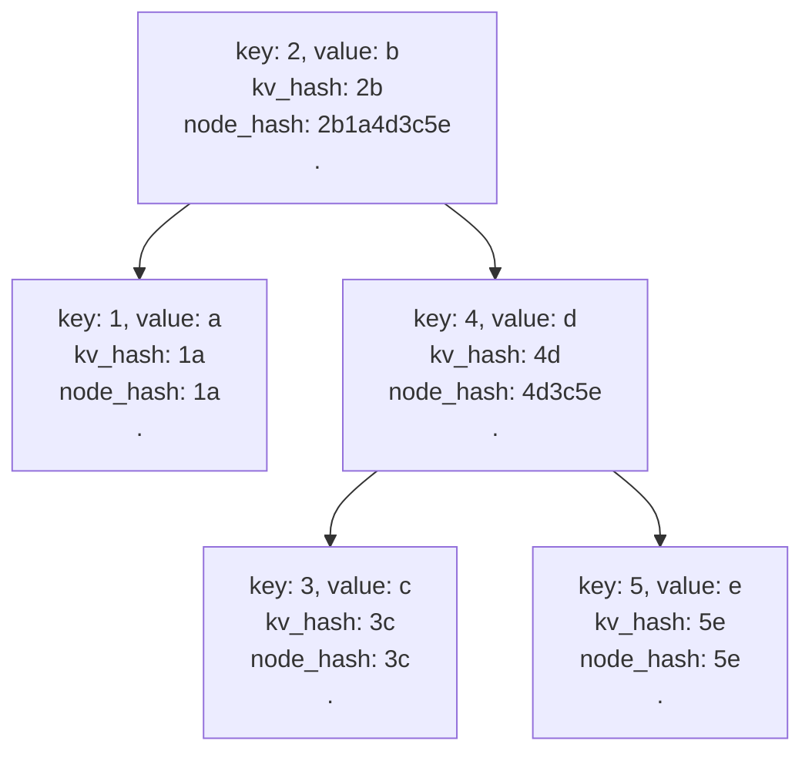
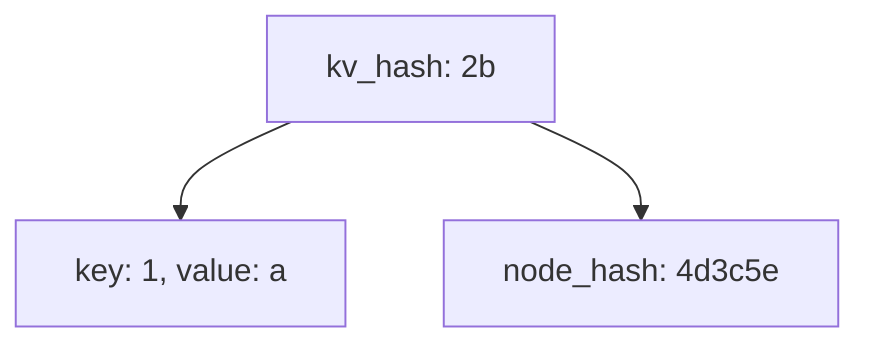
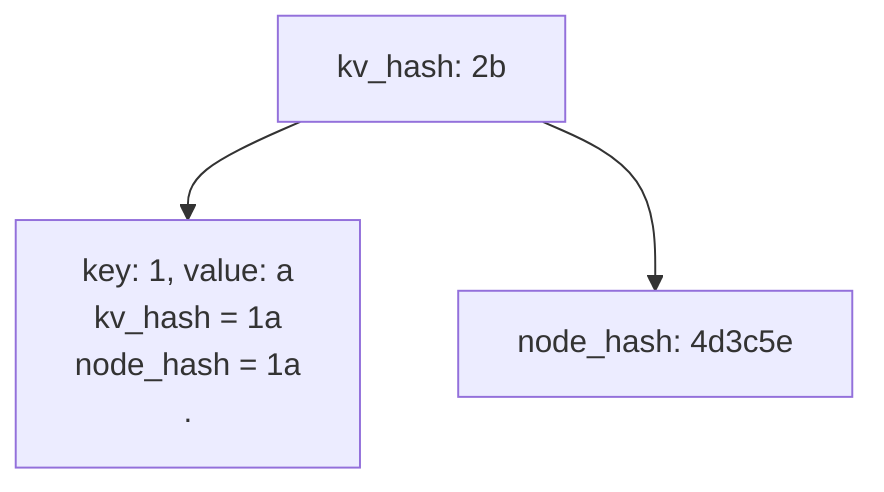

# Merk Proofs

Merk is a Merkle AVL tree ([https://en.wikipedia.org/wiki/AVL_tree](https://en.wikipedia.org/wiki/AVL_tree))

#### Structure

A node in a merk tree represents a key-value pair, each node can optionally have a left and right child node. 

Every node contains a value_hash, kv_hash and a node_hash.

```rust
value_hash = Hash(value)
kv_hash = Hash(key, value_hash)
node_hash = Hash(kv_hash, left_child_node_hash, right_child_node_hash)
```

The root hash of the merk structure is the node_hash of the root node. 

#### Encoding and Reconstructing a merk tree

A merk tree can be encoded into a set of operations for future reconstruction. 

#### Operation Types


- Op::Push(Node):
    - Push a node onto the stack
- Op::Parent
    - Pops the top stack item as the parent, then pops the next top stack item as the child
    - attaches the child as the left child of the parent
    - pushes the updated parent back to the stack
- Op::Child
    - pops the top stack item as the child, then pops the next top stack item as the parent
    - attaches the child to the right of the parent
    - pushes the updated parent back to the stack

#### Node Types

We have five node types relevant to proofs

- Node::KV - contains the key-value pair of the tree node
- Node::KVDigest - contains the key and value_hash of the tree node
- Node::KVValueHash - contains the key, value and value_hash of the tree node (a combination of Node::KV and Node::KVDigest)
- Node::KVHash - contains just the kv_hash of the tree node
- Node::Hash - contains the node_hash of the tree node

By combining the operation types and node types we can encode any tree or tree subset into a set of operations that can be later reconstructed to reproduce the same root hash.

#### Example

We can create a tree by inserting 5 elements with keys 1 to 5 and values a to e.

Resulting in the following dataset → [(1, a), (2, b), (3, c), (4, d), (5, e)]

After insertion, the final tree looks like this.

```rust
      2
    /   \
  1       4
         / \
        3   5
```

#### Encoding

To encode we do an in-order traversal, encoding every node as a Node::KV, and inserting the parent/child branch operation markers.

```rust
fn encode(node, ops) {
	// depth first search to the left
	if node.has_left {
		encode(node.left, ops)
	}

	ops.push(Op::Push(node.to_kv))

	if node.has_left {
		ops.push(op::Parent)
	}

	if node.has_right {
		encode(node.right, ops)
		ops.push(Op::Child)
	}

	return ops
}
```

Applying this algorithm to the generated tree we have

```rust
Op::Push(Node::KV(1, a))
Op::Push(Node::KV(2, b))
Op::Parent
Op::Push(Node::KV(3, c))
Op::Push(Node::KV(4, d))
Op::Parent
Op::Push(Node::KV(5, e))
Op::Child
Op::Child
```

#### Reconstruction

To reconstruct the tree from the set of operations, we start with an empty stack and just do what the operations tell us to do <link to a description of operation types here or bring it here, might be more relevant here>.  

Reconstruction will fail for two reasons

- if we try to pop something from an empty stack
- if at the end of reconstruction, we don’t have exactly one element in the stack

Let’s reconstruct the original tree from the generated set of operations.

Initial state

```rust
stack: []
```

Op::Push(Node::KV(1, a))

```rust
stack = [1]
```

Op::Push(Node::KV(2, b))

```rust
stack = [1, 2]
```

Op::Parent

```rust
stack = [1. 2]

// pop top stack item as the parent
parent = 2
stack = [1]

// pop top stack item as the child
child = 1
stack = []

// attach the child to the left of the parent
         2
        /
       1

// push the updated parent to the top of the stack
stack = [
         2
        /
       1
]
```

Op::Push(Node::KV(3, c))

```rust
stack = [
	3,
            2
           /
          1
]
```

Op::Push(Node::KV(4, d))

```rust
stack = [
	4,
	3,
            2
           /
          1
]
```

Op::Parent

```rust
stack = [
	4,
	3,
            2
           /
          1
]

// pop top stack item as the parent
parent = 4

// pop top stack item as the child
child = 3

// attach the child to the left of the parent
        4
       /
      3

// push the updated parent to the top of the stack
stack = [
        4
       /
      3,
        2
       /
      1
]
```

Op::Push(Node::KV(5, v5))

```rust
stack = [
	5,
            4
          /
        3,
            2
          /
        1
]
```

Op::Child

```rust
stack = [
	5,
            4
          /
        3,
             2
           /
        1
]

// pop top stack item as the child
child = 5

// pop top stack item as the parent
parent =    4
           /
          3

// attach the child to the right of the parent
        4
      /   \
     3     5

// push the updated parent to the top of the stack
stack = [
            4
          /   \
         3     5,
            2
           /
         1
]
```

Op::Child

```rust
stack = [
          4
        /   \
       3     5,
          2
         /
       1
]

// pop top stack item as the child
child  =              4
                    /   \
                   3     5

// pop top stack item as the parent
parent =        2
              /
            1

// attach the child to the right of the parent
        2
      /   \
     1     4
         /   \
        3     5

// push the updated parent to the top of the stack
stack = [
          2
        /   \
       1     4
            /  \
           3    5
]
```

No further operations, let us check the constraints

- at no point did we try to pop from an empty stack
- the stack contains exactly one element

Reconstruction completed successfully  ✅

#### Implementation Detail

In our implementation, we actually send Node::KVValueHash instead of Node::KV, this doesn’t change how reconstruction works but it’s an important detail for GroveDB *<link to grovedb explanation of tree linking>*

#### Calculating the root hash of the tree

Recall each node in the tree represents a key-value pair, described by this set:

- [(1, a), (2, b), (3, c), (4, d), (5, e)]

after insertion and tree balancing we ended up with a tree that looks like this



The root hash of the merk structure is node_hash of the root node, and the node_hash is calculated as follows

```

node_hash = Hash(kv_hash, left_child_node_hash, right_child_node_hash)

where:
kv_hash = Hash(key, value_hash)
```

In our merk implementation, the Hash function is the blake3 hashing algorithm see: [https://github.com/BLAKE3-team/BLAKE3/](https://github.com/BLAKE3-team/BLAKE3/)

#### Simplified Hashing Algorithm

For the rest of this document, we shall use a simplified hashing algorithm.

```
Hash(...) = concatenation of all inputs
e.g. 
Hash(a, b) = ab
Hash(1, 2, 3, 4) = 1234
Hash(a) = a
```

First we calculate the kv_hash of every node, which is just the Hash(key, value_hash)

- because of our simplified hashing algorithm, the value_hash is exactly equal to the value
- Hash(a) = a
- hence the kv_hash = Hash(key, value)



Next we need to calculate the node_hash for each node, we’d start with the leaf nodes 1, 3 and 5.

These nodes have no children so their node_hash is exactly equal to their kv_hash

```
node_hash = Hash(kv_hash, left_child_node_hash, right_child_node_hash)

since no left or right child

node_hash = Hash(kv_hash)

with our simplified hashing algorithm:

node_hash = kv_hash
```

The updated tree for those nodes looks like



Next up, we calculate the node_hash for node 4

node 4 has 2 child nodes, 3 and 5 with 3c and 5e as their respective node_hash values.

```
node_hash = Hash(kv_hash, left_child_node_hash, right_child_node_hash)

node_hash = Hash(4d, 3c, 5e)

node_hash = 4d3c5e
```

updated tree:



and finally, we calculate the node hash of node 2 (which doubles as the root hash)

node 2 has 2 child nodes, 1 and 4, with node_hash values 1a and 4d3c5e respectively

```
node_hash = Hash(kv_hash, left_child_node_hash, right_child_node_hash)

node_hash = Hash(2b, 1a, 4d3c5e)

node_hash = 2b1a4d3c5e
```

updated tree:



Root Hash → 2b1a4d3c5e

#### Encoding a subset of the tree state

We have described the technique for encoding and reconstructing the entire tree state, but sometimes you only care about a subset of the state. 

#### Rules for truncating the tree state

In order to encode a subset of the tree and still get the same root hash on reconstruction, we need to return sufficient information to preserve the root hash.

Essentially, we must be able to calculate the node_hash for every node in the reconstructed tree.

- Case 1 :
    - If we encounter a node we care about, we return a Node::KV
    - perform further analysis on its child nodes
    - we have its key and value → we can get the kv_hash
    - we have it’s left_child_hash and right_child_hash → we can get the node_hash
- Case 2:
    - if we encounter a node we don’t want but might want its descendant, push Node::KvHash
    - perform further analysis on its child nodes
    - we have its kv_hash
    - we have it’s left_child_hash and right_child_hash → we can get the node_hash
- Case 3:
    - if we encounter a node we don’t want and would not want any of its descendants, push Node::Hash
    - ignore its children
    - we already have the node_hash

#### Example

Given this tree: 


If we only cared about **node 1**, the subset tree would look like



and the encoding will look like

```rust
Op::Push(Node::KV(1, v1))
Op::Push(Node::KvHash(2b)) // kv hash of node 2
Op::Parent
Op::Push(Node::Hash(4d3c5e)) // node hash of node 4
Op::Child
```

#### Explanation

- We only care about node 1
- Starting at node 2, we realise we don’t need it’s key value, but something we care about (node 1) might be to the left of it. Return the Node::KvHash (case 2)
- At node 1, we care about its key and value so we return Node::KV (case 1)
- At node 4, we don’t care about its value and none of the nodes we care about are its descendants so return Node::Hash (case 3)

Let’s calculate the root hash of the truncated tree.

We start by calculating the kv_hash and node_hash for node 1. 

Since it’s a leaf node the node_hash is equal to its kv_hash.



Finally we calculate the node_hash for the root node (doubles as the root_hash of the structure)

```
kv_hash = 2b
left_node_hash = 1a
right_node_hash = 4d3c5e

node_hash = Hash(kv_hash, left_node_hash, right_node_hash)
node_hash = Hash(2b, 1a, 4d3c5e)
node_hash = 2b1a4d3c5e
```

Exactly the same as before!

In the next section, we specify a powerful system for describing the keys we want from a state tree.

#### Query System

A query is a set of query items that are used to describe keys in a tree. In merk we have 10 query item types. 

- Key(key_name)
    - selects a node with the given key name
- Range(start..end)
    - selects all nodes that fall in this range with the end non-inclusive
- RangeInclusive(start..=end)
    - selects all nodes whose key fall in this range with the end inclusive
- RangeFull(..)
    - selects all nodes in the tree
- RangeFrom(start..)
    - selects all nodes with keys greater than or equal to start
- RangeTo(..end)
    - selects all nodes with keys less than the end (the end is not inclusive)
- RangeToInclusive(..=end)
    - selects all nodes with keys less than or equal to the end (end inclusive)
- RangeAfter(prev..)
    - select all nodes with keys greater than the prev
- RangeAfterTo(prev..end)
    - selects all nodes with keys greater than prev but less than the end
- RangeAfterToInclusive(prev..=end)
    - selects all nodes with keys greater than prev but less than or equal to the end

We can then combine the query items above to build a query that selects non-contiguous keys e.g 

- query = [QueryItem::Key(2), QueryItem::RangeInclusive(4..=5)]
    - this selects 3 nodes with keys [2, 4, 5]

#### Query Constraints

- A query must have all its query items ordered by key
- Overlapping query items must be merged

#### Example

query = [QueryItem::Range(2..4), QueryItem::RangeInclusive(3..=5)]

QueryItem::Range(2..4) selects for [2, 3]

QueryItem::RangeInclusive(3..=5) selects for: [3. 4. 5]

an overlap exists, we merge the sets: [2, 3, 4, 5]

This is equivalent to QueryItem::RangeInclusive(2..=5), hence the query becomes

query = [QueryItem::RangeInclusive(2..=5)]

#### Proofs

#### Problem Statement

I build a query that describes the keys I am interested in, I send that to the prover and the prover sends me back a subset encoding with some guarantees:

- Complete (exact set, no element is added or removed)
- Correct (result set only contains data that was added to the state at some point in the past)
- Fresh (result set is based on the latest data)

Simply put, a Merk proof encodes a subset of the tree state that contains all the requested keys and the operations which, when performed, reconstruct a tree that produces the same root hash as the original tree.. 

Proof generation algorithm:

- Given a node and a set of keys to include in the proof:
    - if the query set is empty, append `Op::Push(Node::Hash(node_hash))` to the proof and return
        - since the query set is empty, it means the current node is not part of our requested keys and we also don’t care about any of it’s child nodes
        - this is why we push the node_hash, instead of the kv or kvhash as those give more information than we need for that node
        
    - if the query set is not empty, perform a binary search of the current node’s key on the query set
        - the goal is to find the query item that overlaps with the current node key
        - if the node’s key is found in the query set at index i:
            - get the query item at index i
                - if the query item is a key, partition the query set into left and right sub-sets at index i, excluding i
                    - say the query set is [1..=2, 3, 4..=5] and current node key is 3
                    - binary search finds overlapping query item at index 1
                    - query item is a key, so we split into left = [1..=2] and right = [4..=5]
                - if the query item is a range and the range starts before the node key
                    - include the query item in the left sub-batch else exclude it
                    - say the query set is [1, 2..=4, 5] and the current node key is 3
                    - binary search finds overlapping query item at index 1
                    - query item is a range and it’s start value is less than 3
                    - partition left = [1, 2..=4]
                - if the query item is a range and the range ends after the node key
                    - include the query item in the right sub-batch else exclude it
                    - say the query set is [1, 2..=4, 5] and the current node key is 3
                    - binary search finds overlapping query item at index 1
                    - query item is a range and it’s end value is greater than 3
                    - partition right = [2..=4, 5]
            - if the node’s key is not found in the query set, but could be inserted at index i
                - partition the query set into left and right sub-batches at index i
                    - say the query set is [1,2,4,5] and current node key is 3
                    - after performing the binary search, no overlap is detected but we notice the key can be inserted at index 2
                    - so we partition the set into left = [1, 2] and right = [4, 5]
                    - basically splitting the set into half at the given index.
            - at this point we should have both a left and right partition of the query set
            
        - Recurse_left:
            - if the left query set is empty and we have a left child, then append `Op::Push(Node::Hash(node_hash_left))`
                - same idea, we don’t care about the left node and any of it’s children, return the smallest info we need for rebuilding the root hash
            - if the left query set is empty and we have no left child, then append nothing
            - if the left query set is not empty and we have a left child, recurse with the left node and the left sub-batch
            - if the left query set is not empty and we have no left child, append nothing
                - we have queries but they can’t be satisfied because the state doesn’t have the node data
        - Handle current node:
            - if the current node found an overlapping query item, then append `Op::Push(Node::KV(node.key, node.value))`
                - we are pushing kv because the query requested for that node
            - if the current node was not requested in the proof
                - TODO: fix this section with correct explanation
        - if left proof exists, append `Op::Parent` to the proof
        - Recurse_right:
            - if the right query set is empty and we have a right child, then append `Op::Push(Node::Hash(node_hash_right))`
            - if the right query set is empty and we have no right child, then append nothing
            - if the right query set is not empty and we have a right child, recurse with the right node and the right sub-batch
            - if the right query set is not empty and we have no right child, append nothing
                - we have queries but they can’t be satisfied because the state doesn’t have the node data
        - if the right proof exists, append `Op::Child` to the proof
    

#### Proof Verification

Proof verification is not as simple as reconstructing the tree and verifying to root hash anymore, as we need to check the proof was constructed correctly based on the query we passed.

To do this, every time we encounter a push operation when reconstructing the tree, we need to perform a set of operations on that node, checking that certain constraints are held and updating local state for future checks.

Specifically we keep track of:

- last_push: last node we checked
- in_range (bool): set to true if the current query is a range and we have seen at least one node that falls in that range
    - e.g. if the current query item is 2..=4 and we have seen 2, then in_range is set to true
    - when in_range is set to true, it can only be set to false if we prove the upper bound of the range
        - i.e we see a node that is greater than or equal to the upper limit of that range
    - also, every node we see until the upper bound is proved must have a raw key value
        - this is because the only way to hide state information while retaining the root hash is by push a Node::KvHash or Node::Hash
        - we don’t want this, if some data that represents my query is in state, then it must be returned.
    

#### Verification Algorithm

- if the node is of type Node::KVHash or Node::Hash i.e the node doesn’t contain the raw key and in_range is set to true
    - return an error
    - we throw an error here because since in_range is set to true then we expect a a raw node
- else if the node is of type Node::KV we proceed:
    - get the current query_item from the query array
    - if this node’s key comes before the lower bound of the current query item
        - recurse this function with the next node
        - basically if we encounter a node that is smaller than our current query item, move to the next node and try again
        - e.g, if the query_item is 3..5 and the current node is 2, we move to the next pushed node
    - at this point, we have a node that overlaps with our current query item
    - if in_range is set to false
        - this is the first item we are seeing for this query item
        - we need to ensure that the lower bound was proven i.e this is indeed the first item in the state for this query item and no item was skipped
        - to prove the lower bound we:
        - check that the current node key is exactly equal to the lower bound of the current query item or
        - that the last_push was of type Node::KV
    - if the current node’s key is greater than or equal to the upper bound of the current query item
        - set in_range to false
        - we have proven the upper bound of the range
    - if the current query item contains the current node’s key
        - push the node to the result set
        - we have hit a node whose value we care about

#### Dealing with offsets

Offsets specify that you skip the first n values that match the query. 

If we encounter a node that matches the query and the offset value is non-zero, we return Node::KVDigest for that node and decrement the offset value.

- We use KVDigest here because during proof verification we want to be sure that we skipped the correct number of nodes.
- and that the nodes skipped have keys that match our query.

Once the offset value is at 0, we can start pushing Node::KV types.

#### Dealing with limits

The limit says I  only care about the first n items that match my query. 

To handle this, we just decrement the limit value every time we push a Node::KV, once the limit value hits 0 we stop pushing Node::KV values.

**Dealing with right-to-left proofs**

We can optionally pass a direction for proofs i.e left to right or right to left. 

If the state contains [1, 2, 3, 4, 5] and we ask for all items with a limit of 2. 

Since the default direction is left to right we get [1, 2] as the result set, but we might want it right to left, in that case, we get back [5, 4].

This is achieved by doing a depth-first search to the right of the tree as opposed to the left as in the default case.