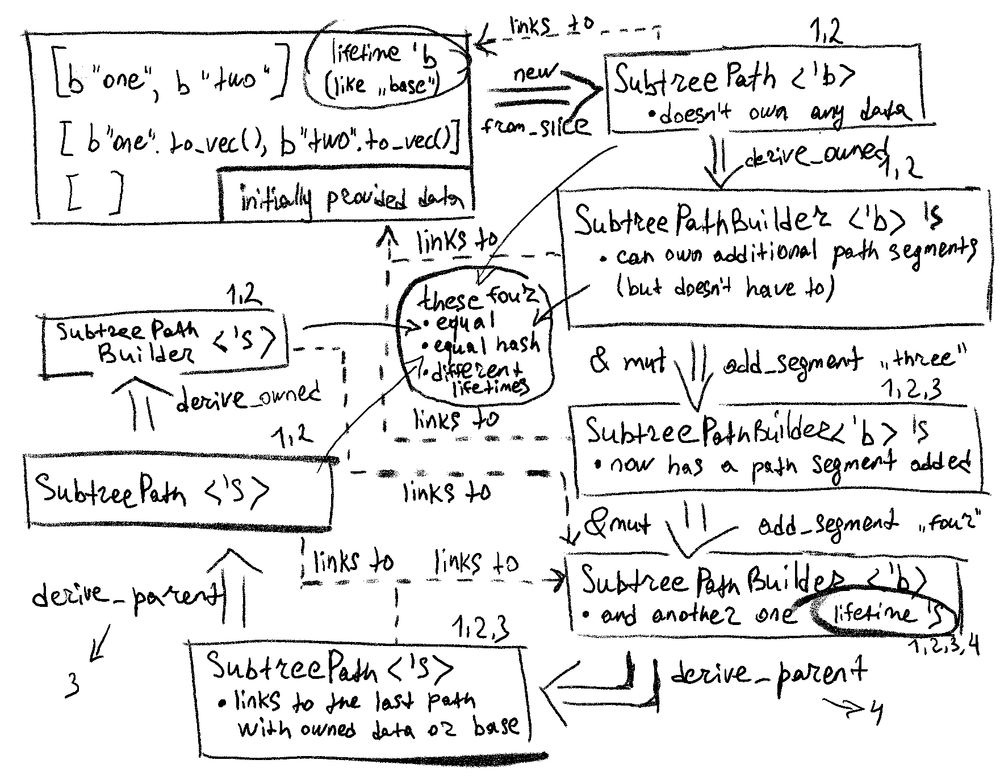

# Subtree path library

Introduction of `SubtreePath`, `SubtreePathBuilder`, and `SubtreePathIter` types for GroveDB's path
management.

## Context
In our interaction with GroveDB, we consistently provide paths or batches of paths. Previously,
managing these paths posed significant challenges due to the lack of a universal way to handle them
(generic iterators, slices of slices, slices of vectors), and deriving new paths from existing ones
was inefficient and cumbersome.

## Decision
To address these issues, we introduced three new constructs: `SubtreePath`, `SubtreePathBuilder`,
and `SubtreePathIter`.

### SubtreePath
`SubtreePath` provides an immutable representation of a path within the GroveDB. It supports efficient
derivations - the creation of new paths based on existing ones. As a result, it simplifies the
process of creating a path to a subtree and deriving a new path from an existing one, with a change
at the end (moving from the path to the path of its parent or descendant).

Takeaway: `SubtreePath` holds no path segments and is an immutable view into subtree path.

### SubtreePathBuilder
`SubtreePathBuilder` is designed to manage multiple owned path segments at once. It introduces an
alternative way of working with paths, offering more local representation of owned path data and is
also compatible with `SubtreePath` to combine into one path "chain". That said, a combination of
`SubtreePath` and `SubtreePathBuilder` in any amount and proportion yields a new `SubtreePath` with
it's lifetime limited to the last `SubtreePathBuilder` (or initial data coming into GroveDB function
call).

### SubtreePathIter
`SubtreePathIter` is a reverse iterator over borrowed path segments. It provides consistent results
for iterating over paths, regardless of the complexity of path derivations. It works seamlessly with
paths created from slices, `SubtreePathBuilder` with fully owned data, or a complex mix of derived
paths.

## Consequences
By implementing these changes, we've enhanced the ergonomics of GroveDB internals with a potential
for future optimizations and GroveDB decoupling. The overall change provides a robust and intuitive
foundation for path management in GroveDB.

## Schema

