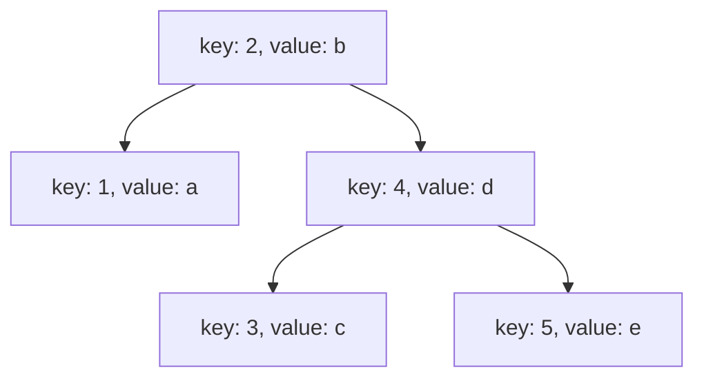
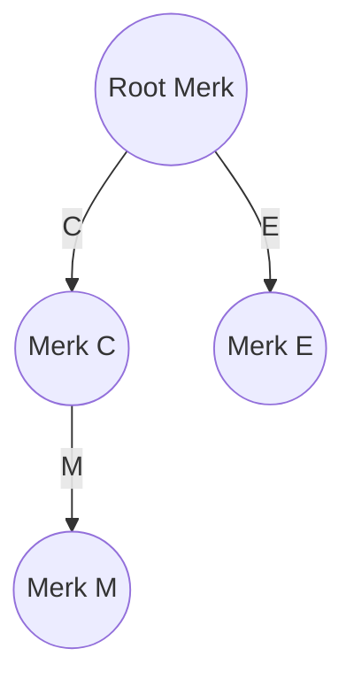
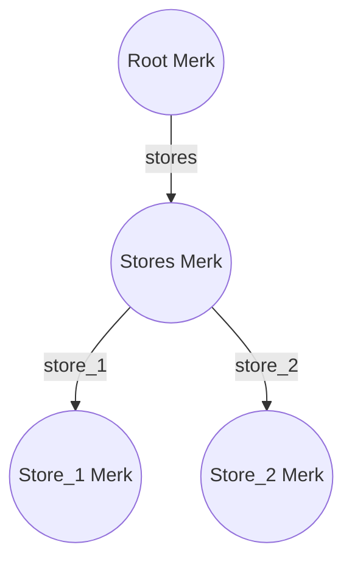
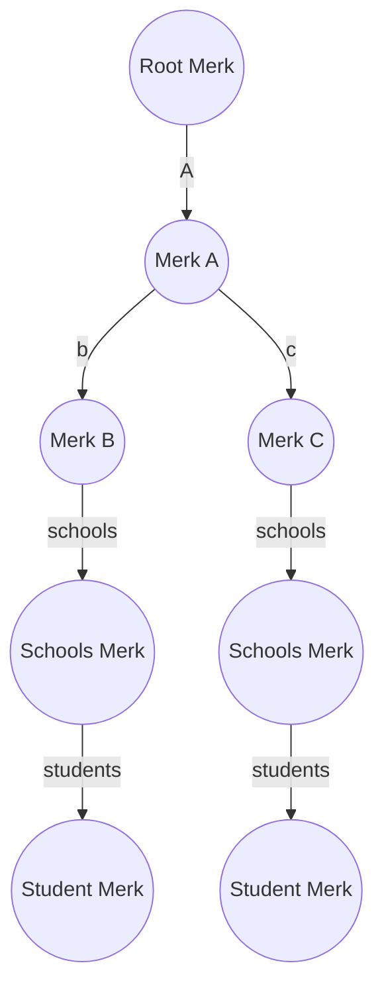

# Query System

This document provides an overview of the data retrieval methods for Merk and GroveDB

### Prerequisite Reading
[GroveDB Structure](grovedb-structure.md)

### Retrieving Merk Data

To retrieve information from a merk tree, we make use of one or more query items. Let’s introduce the query items within the context of an example to enhance clarity.

Merk Structure:



### Query Items

A query item is employed to define the set of contiguous keys for which you wish to obtain the corresponding values. In total, there are 10 types of query items available.

- **Key(start):**
    - selects the node with the specified key.
    - Example: Key(2) - returns node 2
- **Range(start..end):**
    - selects all nodes that fall in this range with the end non-inclusive
    - Example: Range(2..4) - returns nodes 2 and 3
- **RangeInclusive(start..=end):**
    - selects all nodes whose key fall in this range with the end inclusive
    - Example: RangeInclusive(2..=4) - returns nodes 2, 3, and 4
- **RangeFull(..):**
    - selects all nodes in the tree
    - Example: RangeFull(..) - returns all nodes [1, 2, 3, 4, 5]
- **RangeFrom(start..):**
    - selects all nodes with keys greater than or equal to start
    - Example: RangeFrom(3..) - returns nodes 3, 4, and 5
- **RangeTo(..end):**
    - selects all nodes with keys less than the end (the end is not inclusive)
    - Example: RangeTo(..4) - returns nodes 1, 2, and 3
- **RangeToInclusive(..=end):**
    - selects all nodes with keys less than or equal to the end (end inclusive)
    - Example: RangeToInclusive(..=4) - returns nodes 1, 2, 3, and 4
- **RangeAfter(prev..):**
    - select all nodes with keys greater than the prev
    - Example: RangeAfter(2..) - returns nodes 3, 4, 5, and 6
- **RangeAfterTo(prev..end):**
    - selects all nodes with keys greater than prev but less than the end
    - Example: RangeAfterTo(2..4) - returns nodes 3
- **RangeAfterToInclusive(prev..=end):**
    - selects all nodes with keys greater than prev but less than or equal to the end
    - Example: RangeAfterToInclusive(2..=4) - returns nodes 3 and 4

We can then combine the query items above to build a query that selects non-contiguous keys e.g 

- query = [QueryItem::Key(2), QueryItem::RangeInclusive(4..=5)]
    - this selects 3 nodes with keys [2, 4, 5]

**Query Constraints**

- A query must have all its query items ordered by key
- Overlapping query items must be merged

**Example**

query = [QueryItem::Range(2..4), QueryItem::RangeInclusive(3..=5)]

QueryItem::Range(2..4) selects for [2, 3]

QueryItem::RangeInclusive(3..=5) selects for: [3. 4. 5]

an overlap exists, we merge the sets: [2, 3, 4, 5]

This is equivalent to QueryItem::RangeInclusive(2..=5), hence the query becomes

query = [QueryItem::RangeInclusive(2..=5)]

### Limit

The limit parameter is used to set the maximum number of nodes returned as the result of a query. 

For example, let's consider a query using the RangeFull(..) query item on a collection [1, 2, 3, 4, 5]. Without applying a limit, the query would return all the elements [1, 2, 3, 4, 5]. However, if we apply a limit of 2, only the first two elements [1, 2] would be returned as the result.

### Offset

In addition to the "Limit" parameter, the query system also supports the "Offset" parameter, which is used to skip a certain number of nodes before starting to return the result.

The Offset parameter allows you to retrieve nodes starting from a specific position in the result set, excluding the preceding nodes. It is useful when you want to paginate through the data or retrieve results in chunks.

For example, let's consider a query using the RangeFull(..) query item on a collection [1, 2, 3, 4, 5]. If we apply an offset of 2 and a limit of 2, the query would return [3, 4], skipping the first two elements [1, 2].

Combining the "Limit" and "Offset" parameters enables even greater flexibility in constructing queries.

### Retrieving GroveDB data

When retrieving data from GroveDB, which is a tree of Merks, it is necessary to specify the path to a specific Merk along with the associated query items.

### Example



Get all element in Merk M

- Path: [C, M]
    - Starting from the root merk, navigate to Merk C, and then proceed to Merk M.
- Query: RangeFull(..)
    - Apply the "RangeFull" query item, which selects the entire range of keys in the specified Merk.

Get the second element in Merk E

- Path: [E]
    - Navigate directly to Merk E.
- Query: RangeFull(..), Offset = 1, Limit = 1
    - Apply the "RangeFull" query item to select the entire range of keys in Merk E.
    - Set the Offset parameter to 1, indicating that you want to skip the first element.
    - Set the Limit parameter to 1, specifying that you only want to retrieve one element.

### Subquery

A subquery enables you to perform additional queries on the result of a preceding query. It allows for nested querying within GroveDB, providing a way to refine and narrow down data retrieval.

To better illustrate its usefulness, let's consider a more complex example:

We have 2 book stores → [store1, store2]

and each store has a list of people that have come to visit

- store_1 → [Alice, Bob, Carlos]
- store_2 → [David, Eve, Frank]

Constructing the Tree:

- In the root tree we add a single tree element at key “stores”
    - insert path [] key = “stores” value = Tree
- In the stores tree, we add two tree elements for store_1 and store_2
    - insert path [”stores”] key = “store_1” value = Tree
    - insert path [”stores”] key = “store_2” value = Tree
- In store_1 we insert three item elements for each person that has come to visit
    - insert path [”stores”, “store_1”] key = “alice” element = Item(”alice”)
    - insert path [”stores”, “store_1”] key = “bob” element = Item(”bob”)
    - insert path [”stores”, “store_1”] key = “carlos” element = Item(”carlos”)
- In store_2 we insert three items as well for each person that has come to visit
    - insert path [”stores”, “store_2”] key = “david” element = Item(”david”)
    - insert path [”stores”, “store_2”] key = “eve” element = Item(”eve”)
    - insert path [”stores”, “store_2”] key = “frank” element = Item(”frank”)

GroveDB Structure:



Query Goal: Retrieve the names of every one that has visited a store.

Expected Result = [alice, bob, carlos, david, eve, frank]

Solution without subqueries:

- First we need to query [stores] to get the list of stores → [store_1, store_2]
    - path: [stores] query: RangeFull(..)
- Next we construct two path queries to get the result from each store
    - path: [stores, store_1] query: RangeFull(..) → [alice, bob, carlos]
    - path: [stores, store_2] query: RangeFull(..) → [david, eve, frank]
- This doesn’t scale, we could have thousands of stores

Solution with subqueries:

- path: [stores] query: RangeFull(..) subquery: RangeFull(..)
- after applying the first query we have → [store_1, store_2]
- next we apply the subquery to each result from the last step (RangeFull on both stores)
    - [alice, bob, carlos, david, eve, frank]
- the same query would work even as more stores are added.

A subquery can have it’s own subquery and that can have it’s own all the way down 🤯

### Subquery Path

A subquery path is a sequence of single key subqueries that are applied successively. It can be seen as a way to perform repeated subqueries on individual keys

The subquery path is particularly useful when you have a set of elements for which you want to apply a query, but instead of directly applying the query to those elements, you want to first translate them to another Merk (a different branch or subtree) and then perform the subquery on that translated Merk.

Example



Query Goal: Retrieve all the items in both student merks

Solution:
Path: [A]
Query: RangeFull(..)
Subquery Path: [schools, students]
Subquery Query: RangeFull(..)

Breakdown:

1. The path [A] selects Merk A.
2. The query RangeFull(..) is applied to Merk A, resulting in the selection of Merk B and Merk C.
3. The subquery path [schools, students] is used to perform key translation on all elements in the result set.
4. Merk B is translated to the Student Merk.
5. Merk C is also translated to the Student Merk.
6. The result set now consists of two Student Merks: [Student Merk, Student Merk].
7. The subquery RangeFull(..) is applied to both Student Merks, resulting in the retrieval of all students from both Merks.
8. The final result set is the collection of all students from the Student Merks.

### Path Query

The path query is a structured representation that combines the various components required for data retrieval in GroveDB. It provides a clear and concise way to specify the path to a specific Merk, along with the associated query items and subqueries.

```
PathQuery
        path: [k1, k2, ..]
        sized_query: SizedQuery
            limit: Optional<number>
            offset: Optional<number>
            query: Query
                items: [query_item_1, query_item_2, ...],
                default_subquery_branch: SubqueryBranch
                    subquery_path: Optional<[k1, k2]>
                    subquery_value: Optional<Query>
                conditional_subquery_branches: Map<QueryItem, SubqueryBranch>
```

### Subquery Branch

A subquery branch is a component of a path query that holds information about a subquery. It consists of two optional elements: the subquery path and the subquery value.

### Default Subquery Branch

The default subquery branch is a subquery branch that is applied to all elements in the result set of a path query, if it is set.

When the default subquery branch is specified, it is applied to each element in the result set individually, allowing for further filtering or transformation of the data. It acts as a default operation that is automatically applied to all elements unless overridden by conditional subquery branches.

By using the default subquery branch, you can apply a consistent set of subquery operations to every element in the result set

### Conditional Subquery Branch

The conditional subquery branch is used when you want to selectively apply a subquery branch to specific nodes in the result set of a path query. It allows you to define different subquery operations for different conditions.

The conditional subquery branch consists of a map that maps a QueryItem to a SubqueryBranch:

    `Map<QueryItem, SubqueryBranch>`

For each node in the result set, the conditional subquery branch checks if there is a query item that matches the node. If a match is found, the associated subquery branch is applied to that specific node. It provides a way to conditionally apply subquery operations based on specific criteria or conditions.

It is important to note that once a conditional subquery has been applied to a node, the default subquery branch is not executed on that node. This allows for fine-grained control over the application of subqueries to different nodes in the result set.

### Simplified Query Algorithm

1. Given a path query, find the merk specified by the given path.
    - If the specified merk is not found, return a "not found" error.
2. Apply the top-level query to the specified merk, taking into account the limit and offset parameters. Update the limit and offset values accordingly.
3. Loop over every element in the result set:
    - If the element is not a tree, add it to the final result set.
    - If the element is a tree, check if it has an associated subquery.
        - If the default subquery is not set and there is no conditional subquery branch, add the tree to the final result set.
        - If there is an associated subquery branch (either conditional or default), recursively perform step 2 using the subquery branch as the new top-level query.
4. Return the final result set obtained from the path query execution.

### Symbolic Intuition

The tools provided by the path query allow us to have fine-grained control over highlighting a specific subset of the entire GroveDB structure. By utilizing the path, query items, subquery branches, and other parameters, we can precisely define the criteria for selecting and retrieving data from GroveDB. This level of control enables us to focus on specific branches, nodes, or elements within the GroveDB tree and exclude others that are not of interest.
