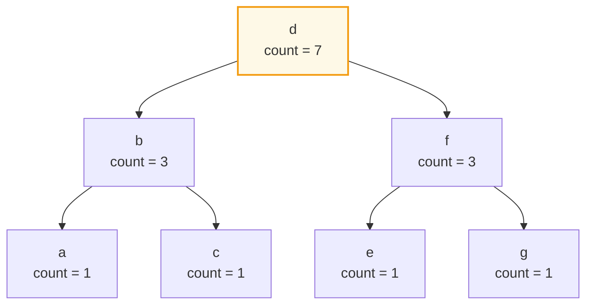
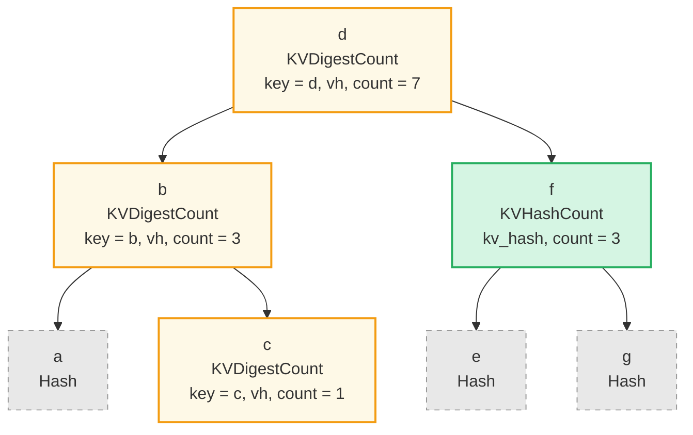
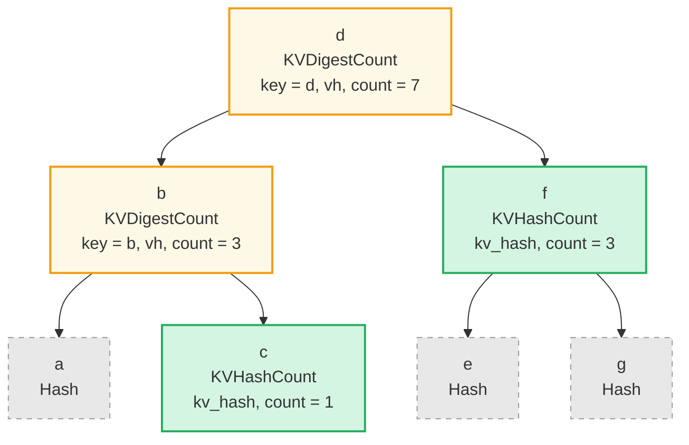
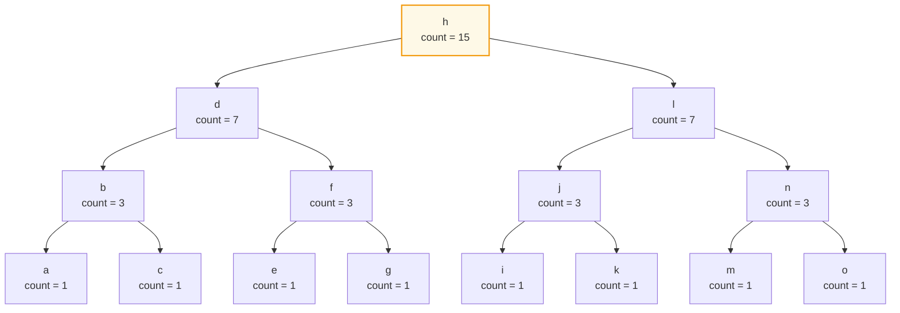
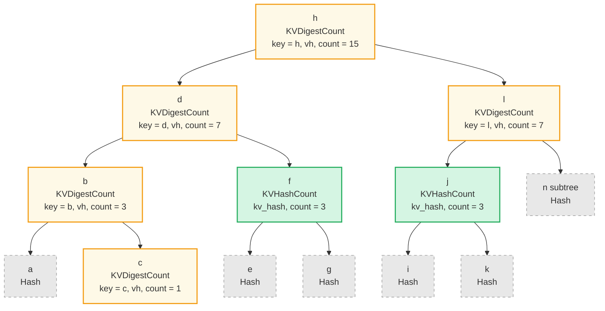

# Aggregate Count Queries

## Overview

An **Aggregate Count Query** lets a caller ask a single, very specific question:

> "How many elements in this subtree fall inside this key range?"

The answer comes back as a `u64`, and on a **ProvableCountTree** or
**ProvableCountSumTree** it can be returned together with a cryptographic proof
that anyone holding the tree's root hash can verify — without ever materializing
the elements themselves.

Where regular queries return key/value pairs and aggregate-sum queries return
running totals of `SumItem` values, an aggregate-count query returns only a
**count** and a proof of that count.

It is implemented as a new `QueryItem` variant:

```rust
pub enum QueryItem {
    Key(Vec<u8>),
    Range(Range<Vec<u8>>),
    // ... existing variants ...
    RangeAfterToInclusive(RangeInclusive<Vec<u8>>),

    /// Count the elements matched by the inner range, without returning them.
    /// Only valid on ProvableCountTree / ProvableCountSumTree (and their
    /// `NonCounted` wrapper variants).
    AggregateCountOnRange(Box<QueryItem>),
}
```

The wrapped `QueryItem` is the **range to count over** — it must be one of the
true range variants: `Range`, `RangeInclusive`, `RangeFrom`, `RangeTo`,
`RangeToInclusive`, `RangeAfter`, `RangeAfterTo`, `RangeAfterToInclusive`.
The single-key (`Key`), full-range (`RangeFull`), and self-nested
(`AggregateCountOnRange`) variants are all **rejected**.

> **Why are `Key` and `RangeFull` rejected?**
>
> - **`Key(k)`** would always return `0` or `1` — an existence test. Callers
>   should use the existing `GroveDb::has_raw` / `GroveDb::get_raw` (or their
>   provable variants) instead. Routing existence checks through this API
>   would force a count-shaped result type and proof shape on a question that
>   already has a much cheaper, narrower answer.
> - **`RangeFull`** has its answer already exposed by the parent's
>   `Element::ProvableCountTree(_, count, _)` /
>   `Element::ProvableCountSumTree(_, count, _, _)` bytes, which are
>   hash-verified by the parent Merk's proof. Going through
>   `AggregateCountOnRange(RangeFull)` would always produce a strictly heavier
>   proof for an answer the caller can read directly.
>
> In short, `AggregateCountOnRange` exists for the case the rest of the API
> can't already answer cheaply: counting a **bounded sub-range** of keys.

## Why this works only on Provable Count Trees

GroveDB has six tree types that track a count:

| Tree type                | Count tracked? | Count in node hash? | AggregateCountOnRange allowed? |
|--------------------------|:--------------:|:-------------------:|:-----------------------:|
| `CountTree`              | yes            | no                  | **no**                  |
| `CountSumTree`           | yes            | no                  | **no**                  |
| `ProvableCountTree`      | yes            | **yes**             | **yes**                 |
| `ProvableCountSumTree`   | yes            | **yes** (count only)| **yes**                 |
| `NonCountedProvableCountTree`    | yes (via wrapper) | yes (inner)    | **yes**                 |
| `NonCountedProvableCountSumTree` | yes (via wrapper) | yes (inner)    | **yes**                 |

Only the **provable** variants bake the count into the node hash via
`node_hash_with_count(kv_hash, left, right, count)`. Because every node's count
participates in the Merkle root, a verifier holding only the root hash can
reconstruct enough of the tree from a proof to **trust** the counts that appear
inside.

Plain `CountTree` and `CountSumTree` track counts in storage as a convenience
for the executing node, but those counts are not in the hash. A "proof" of
their count would be unverifiable, so we reject `AggregateCountOnRange` against them
at query-construction time.

The two `NonCounted*` wrapper variants are accepted because the wrapper only
tells the **parent** tree to skip this element when aggregating its own count;
the inner tree is still a fully-fledged provable count tree.

## Query-Level Constraints

`AggregateCountOnRange` is a **terminal** query item. When it appears, the surrounding
`Query` is reduced to a single, well-defined operation: "count, then return."

```rust
pub struct Query {
    pub items: Vec<QueryItem>,
    pub default_subquery_branch: SubqueryBranch,
    pub conditional_subquery_branches: Option<IndexMap<QueryItem, SubqueryBranch>>,
    pub left_to_right: bool,
    pub add_parent_tree_on_subquery: bool,
}
```

If any `QueryItem::AggregateCountOnRange(_)` appears in `items`, the query is only
well-formed when **all** of the following hold:

1. `items.len() == 1` — no other range items, no other counts, no mixing.
2. The inner `QueryItem` is **not** `Key` (use `has_raw` / `get_raw` for
   existence tests — see the note above).
3. The inner `QueryItem` is **not** `RangeFull` (use the parent element to read
   the unconditional total — see the note above).
4. The inner `QueryItem` is not itself another `AggregateCountOnRange`.
5. `default_subquery_branch.subquery.is_none()` and `subquery_path.is_none()`.
6. `conditional_subquery_branches.is_none()` (or empty).
7. The targeted subtree's `TreeType` is one of the four allowed variants above.
8. The enclosing `SizedQuery` does not set a `limit` or `offset`. Counting is an
   aggregate over the matched range — pagination would silently change the
   answer and is therefore rejected.
9. `left_to_right` is **ignored** (counting is direction-agnostic). It is not
   an error to set it, but it has no effect on the returned count or proof.

Violating constraints 1–8 returns `Error::InvalidQuery(...)` with a message
that names the offending field, before any I/O is performed.

## Result Type

A successful aggregate-count query returns:

```rust
pub struct AggregateCountQueryResult {
    /// Number of elements matched by the inner range.
    pub count: u64,
    /// Range that was actually counted (for caller convenience — copy of
    /// the inner QueryItem after normalization).
    pub counted_range: QueryItem,
}
```

When the query is run via the proof-generating path, the proof bytes are
returned alongside the result, exactly as for any other PathQuery. The
verifier path returns the same `AggregateCountQueryResult` together with
the verified root hash.

> **Note on `NonCounted` children:** the count returned reflects what the
> *provable count tree* records — i.e. the count of elements that contributed
> to the tree's running count. `NonCounted`-wrapped children are excluded by
> design (their parent's count was zeroed for them), so they are also excluded
> from `AggregateCountOnRange` results.

## How the Proof is Built

For a `ProvableCountTree`, every node hash already commits to the count of its
own subtree via `node_hash_with_count(kv_hash, left, right, count)`. The proof
generator's job is to produce just enough structure that the verifier can:

1. Reconstruct the **root hash** of the queried Merk and check it against the
   expected hash.
2. Compute the answer **count** from the count fields embedded along the way.

To do that, every proof node has a role; we use a small fixed vocabulary of
proof-node types from the existing proof system (see
[Proof System → ProvableCountTree node types](proof-system.md#provablecounttree-and-provablecountsumtree)):

| Role in proof          | Proof node type                                | What it carries                                      | Why we picked it                                                                       |
|------------------------|------------------------------------------------|------------------------------------------------------|----------------------------------------------------------------------------------------|
| **On-path / boundary** | `KVDigestCount(key, value_hash, count)`        | the node's key + value digest + subtree count        | the verifier needs the **key** to test "is it in the range?", and the count to recompute the parent hash |
| **Fully-inside root**  | `KVHashCount(kv_hash, count)`                  | precomputed `kv_hash(key, value_hash)` + count       | the verifier already knows every key under here is in-range, so the key itself is *not* needed; the count is added directly to the running total |
| **Fully-outside**      | `Hash(node_hash)`                              | one opaque node hash                                 | no key, no count — purely there to recompute the parent's hash                         |
| **Empty side**         | (the empty-tree sentinel, no `Push` needed)    | —                                                    | a missing child contributes hash = 0 and count = 0 to the parent                        |

> **Hash recomputation for `KVHashCount` subtrees:** because we don't descend
> into a fully-inside subtree, its left/right children appear in the proof as
> `Hash(child_node_hash)` so the verifier can still recompute
> `node_hash_with_count(kv_hash, left_hash, right_hash, count)` for the
> subtree's root. This costs two extra hashes per inside subtree (~64 bytes).
> An "Open Design Questions" item below considers a tighter encoding.

### Walking running example

We'll use this 7-key `ProvableCountTree` as the running example through every
diagram below. Counts shown next to each node are "size of the subtree rooted
here":



Below, each per-case diagram colours nodes by the role table above:

- 🟢 **green** = `KVHashCount` (fully-inside, contributes count, not descended)
- 🟡 **yellow** = `KVDigestCount` (on-path / boundary, key tested for in-range)
- ⚪ **gray**  = `Hash` (opaque, fully-outside or unneeded child of an inside subtree)

---

### Case 1 — Open ranges (one bound)

These are the variants with a single bound: `RangeFrom(a..)`, `RangeTo(..b)`,
`RangeToInclusive(..=b)`, `RangeAfter((a, ..))`. Conceptually we walk down to
that one bound, partitioning each subtree along the way into "fully on the
included side" or "fully on the excluded side".

#### Example — `RangeFrom("c"..)` → keys ≥ "c"

Expected: `{c, d, e, f, g}`, count = 5.



Why each role:

- **d, b, c** — boundary nodes on the walk to the lower bound `"c"`. Each is
  `KVDigestCount` because the verifier must test its key against `>= "c"`.
- **a** — left child of `b`; "a" < "c", so its entire subtree is excluded.
  Sent as a single `Hash` (no key, no count).
- **f** — right child of `d`; "d" < "f" and we're including everything ≥ "c",
  so the entire `f` subtree (including its descendants) is in-range.
  We don't need to descend — `f` is sent as `KVHashCount` and contributes its
  full subtree count of 3 directly.
- **e, g** — children of `f`; we don't need them as nodes, just opaque
  `Hash`es so the verifier can recompute `f.node_hash`.

Verifier total:

| Node | In range? | Contribution |
|------|-----------|--------------|
| d (KVDigestCount, key="d") | "d" ≥ "c"  | **+1** |
| b (KVDigestCount, key="b") | "b" < "c"  | +0 |
| c (KVDigestCount, key="c") | "c" ≥ "c"  | **+1** |
| f (KVHashCount, count=3)   | (whole subtree in range) | **+3** |

→ **count = 5** ✓

#### Example — `RangeAfter(("b", ..))` → keys > "b"

Same expected match set `{c, d, e, f, g}`, count = 5 — but the boundary
walk stops one level higher (at `b` instead of `c`), and the in-range test
flips from `>=` to `>`.



Why each role differs from the previous example:

- **b** is now the boundary's terminus, not `c`. It is still `KVDigestCount`
  because the verifier needs the key to apply the in-range test — but the
  test is now `> "b"`, so `b` itself **fails** and contributes 0.
- **c** is the right child of `b`. Every key in `c`'s subtree is `> "b"`
  (here, just the leaf `c` itself), so the whole subtree is in-range. We
  don't descend; `c` becomes `KVHashCount` (no key needed) and contributes
  its count of 1 directly. Compare to the previous example where `c` was a
  boundary node tested against `>= "c"`.
- **a, f, e, g** play the same roles as before — `a` is fully outside,
  `f` is fully inside (with `e`/`g` as opaque `Hash` children).

Verifier total:

| Node | In range? | Contribution |
|------|-----------|--------------|
| d (KVDigestCount, key="d") | "d" > "b"          | **+1** |
| b (KVDigestCount, key="b") | "b" > "b" → no     | +0 |
| c (KVHashCount, count=1)   | (whole subtree in range) | **+1** |
| f (KVHashCount, count=3)   | (whole subtree in range) | **+3** |

→ **count = 5** ✓

> **Take-away:** the *match set* is the same as `RangeFrom("c"..)`, but the
> *proof shape* is slightly cheaper — one fewer `KVDigestCount` and one extra
> `KVHashCount` — because the bound aligns with an internal node rather than
> a leaf. The generator picks the shape based on where the bound key lives
> in the tree, not on what the user wrote.

The same pattern, mirrored, applies to `RangeTo(..b)` and
`RangeToInclusive(..=b)` (upper-bound variants — boundary walk goes right,
fully-inside subtrees hang off the left of each step). The only differences
across all four open-range variants are which side of each split is
"fully-included" and whether the boundary key itself counts (`>=` vs `>`
for the lower side, `<` vs `<=` for the upper side).

---

### Case 2 — Closed ranges (both bounds)

These are the variants with both a lower and upper bound: `Range(a..b)`,
`RangeInclusive(a..=b)`, `RangeAfterTo((a, b))`, `RangeAfterToInclusive((a, ..=b))`.

The proof has **two** boundary walks meeting at the lowest common ancestor of
the two bounds. Subtrees fully between the two bounds appear as
`KVHashCount`; subtrees outside appear as `Hash`.

To make the structure interesting we'll use a slightly bigger example tree
than for Case 1 — 15 keys (`a` through `o`), 4 levels deep, balanced as a
perfect binary tree. Counts shown are subtree sizes:



#### Example — `RangeInclusive("c"..="l")` → keys ∈ [c, l]

Expected: `{c, d, e, f, g, h, i, j, k, l}`, count = 10.



Why each role:

- **h** — LCA of `"c"` and `"l"`. Sits above both walks, so it's a
  `KVDigestCount` and the verifier tests its key against `[c, l]`.
- **d** — on the left walk (down to lower bound `c`). `KVDigestCount`,
  key tested.
- **l** — on the right walk (down to upper bound `l`); also the upper bound
  itself. `KVDigestCount`, key tested (it passes — `l ≤ l`).
- **b** — on the left walk (`b < c`, so we have to descend further to find
  the lower bound). `KVDigestCount`, key tested (it fails — `b < c`).
- **c** — the lower bound itself. `KVDigestCount`, key tested (it passes —
  `c ≥ c`).
- **a** — left of `b`; "a" < "c", entire subtree outside. `Hash`.
- **n** — right of `l`; entire subtree has keys > "l". The whole `n`
  subtree (n, m, o) collapses to a single `Hash`.
- **f** — right child of `d`. Every key under `f` is `> "d"` and `≤ "g" < "l"`,
  so the entire subtree is in-range. We do not descend; `f` becomes
  `KVHashCount` and contributes its full count of 3 (e, f, g).
- **e, g** — children of `f`; needed only as opaque `Hash` so the verifier
  can recompute `f.node_hash`.
- **j** — left child of `l`. Every key under `j` is `≥ "i" > "c"` and
  `≤ "k" < "l"`, so the entire subtree is in-range. `KVHashCount`,
  contributes count = 3 (i, j, k).
- **i, k** — children of `j`; opaque `Hash` for `j.node_hash` recomputation.

> **Two layers' worth of work avoided:** because `f` and `j` each shave off
> two children plus their grandchildren-as-opaque-hashes (well, here
> grandchildren happen to be leaves), the proof for a 15-key range scan in a
> 4-level tree contains only **13 push ops** — barely more than the 7-key
> example in Case 1. This is what "O(log n) regardless of count" looks like
> in practice: deeper trees do not blow up the proof.

Verifier total:

| Node | In range? | Contribution |
|------|-----------|--------------|
| h (KVDigestCount, key="h") | "c" ≤ "h" ≤ "l" | **+1** |
| d (KVDigestCount, key="d") | "c" ≤ "d" ≤ "l" | **+1** |
| b (KVDigestCount, key="b") | "b" < "c" → no  | +0 |
| c (KVDigestCount, key="c") | "c" ≤ "c" ≤ "l" | **+1** |
| f (KVHashCount, count=3)   | (whole subtree in range) | **+3** |
| l (KVDigestCount, key="l") | "c" ≤ "l" ≤ "l" | **+1** |
| j (KVHashCount, count=3)   | (whole subtree in range) | **+3** |

→ **count = 10** ✓

#### Variant differences

The four closed-range variants differ only in **whether each boundary key
itself counts**, not in the proof shape:

| Variant                          | Lower test | Upper test |
|----------------------------------|------------|------------|
| `Range(a..b)`                    | key ≥ a    | key < b    |
| `RangeInclusive(a..=b)`          | key ≥ a    | key ≤ b    |
| `RangeAfterTo((a, b))`           | key > a    | key < b    |
| `RangeAfterToInclusive((a, ..=b))` | key > a  | key ≤ b    |

The verifier applies the relevant test at each boundary `KVDigestCount`. The
generator does not need to know which variant is in play — it always emits the
same shape, and the inclusivity flags travel with the query for the verifier.

---

### Empty subtrees

An aggregate-count query against an empty Merk returns `count = 0` with a
trivial proof (the empty-tree marker). Asking for `AggregateCountOnRange` on a
path that does not resolve to a tree at all is an error
(`Error::PathNotFound(...)`), the same as any other query.

### Why this is `O(log n)` regardless of count

Every diagram above has at most:

- One walk per bound (so 1 or 2 walks of depth `O(log n)`),
- A constant number of fully-inside subtree roots per level (the "right
  siblings" hanging off the left walk and "left siblings" hanging off the
  right walk).

Each of those is a single proof-node Push. Therefore the proof's node count is
`O(log n)`, and crucially does **not** depend on the answer's value. Counting
a billion-key range can be done with the same proof size as counting a
hundred-key range.

## Cost Model

`AggregateCountOnRange` queries are designed to be cheap and predictable:

- **Storage seeks:** `O(log n)`.
- **Hash calls:** one per node in the proof.
- **Proof bytes:** `O(log n) * (hash size + count varint size)`.

There is no per-element cost component, because no elements are read or
returned. This is the headline reason the API exists — a billion-element tree
can be counted in a few hundred bytes of proof.

The cost-tracking integration mirrors regular range queries, but with the
"loaded bytes" component dominated by the proof shape rather than element
payloads.

## API Sketch

```rust
use grovedb::{Element, GroveDb, PathQuery, Query, SizedQuery};
use grovedb_query::QueryItem;

// "How many votes have keys between block 1_000 and 2_000 (exclusive)?"
let mut q = Query::new();
q.insert_item(QueryItem::AggregateCountOnRange(Box::new(QueryItem::Range(
    1_000u64.to_be_bytes().to_vec()..2_000u64.to_be_bytes().to_vec(),
))));

let path_query = PathQuery::new_unsized(vec![b"votes".to_vec()], q);
let (proof_bytes, _root_hash) = db.prove_query(&path_query, None, grove_version)
    .unwrap()
    .expect("prove failed");

// Verifier side — only needs proof_bytes + the trusted root hash.
let (root, result) = GroveDb::verify_aggregate_count_query(
    &proof_bytes, &path_query, grove_version,
).expect("verify failed");

assert_eq!(root, expected_root_hash);
println!("votes in [1000, 2000): {}", result.count);
```

## Comparison Table

| Feature                          | Regular `Query`              | `AggregateSumQuery`              | `AggregateCountOnRange` (this doc)           |
|----------------------------------|------------------------------|----------------------------------|---------------------------------------|
| Returns                          | Elements / keys              | Sum + matched key/value pairs    | A single `u64` count                  |
| Stops on                         | Limit, end of range          | Sum limit and/or item limit      | Range bounds (whole match counted)    |
| Subqueries allowed               | Yes                          | No                               | **No**                                |
| Other items in same `Query`      | Yes                          | N/A (own struct)                 | **No** — must be the only item        |
| `limit` / `offset` honored       | Yes                          | Yes (item limit)                 | **No** — rejected at validation       |
| Required tree type               | Any                          | `SumTree`, `BigSumTree`, ...     | Provable count trees only             |
| Proof size relative to result    | O(result)                    | O(matched items)                 | **O(log n)** regardless of count      |

## Open Design Questions

These are intentionally noted for review before implementation lands:

1. **Multiple `AggregateCountOnRange` items per query.** The current design forbids
   `items: [AggregateCountOnRange(A), AggregateCountOnRange(B)]` because the result type
   would need to grow to a `Vec<u64>`. A future revision could lift this
   restriction by introducing a parallel result type, but the v1 design keeps
   the contract simple: one `AggregateCountOnRange` per `Query`, returning one `u64`.
2. **`add_parent_tree_on_subquery`.** Forbidden under the same logic as other
   subquery flags — `AggregateCountOnRange` is leaf-only.
3. **`SizedQuery` semantics.** Setting `limit` or `offset` at the
   `SizedQuery` level is rejected. We considered silently ignoring them, but
   that risks callers writing limit-paginated UIs against an endpoint that
   does not actually paginate — better to fail loudly.
4. **Cost-limit interaction.** Because the cost of an aggregate-count query
   is bounded by `O(log n)`, a `cost_limit` should rarely fire. The query
   still respects existing cost-limit machinery for parity with other paths.

---
