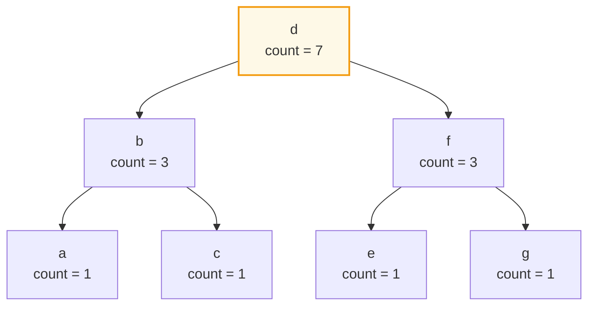
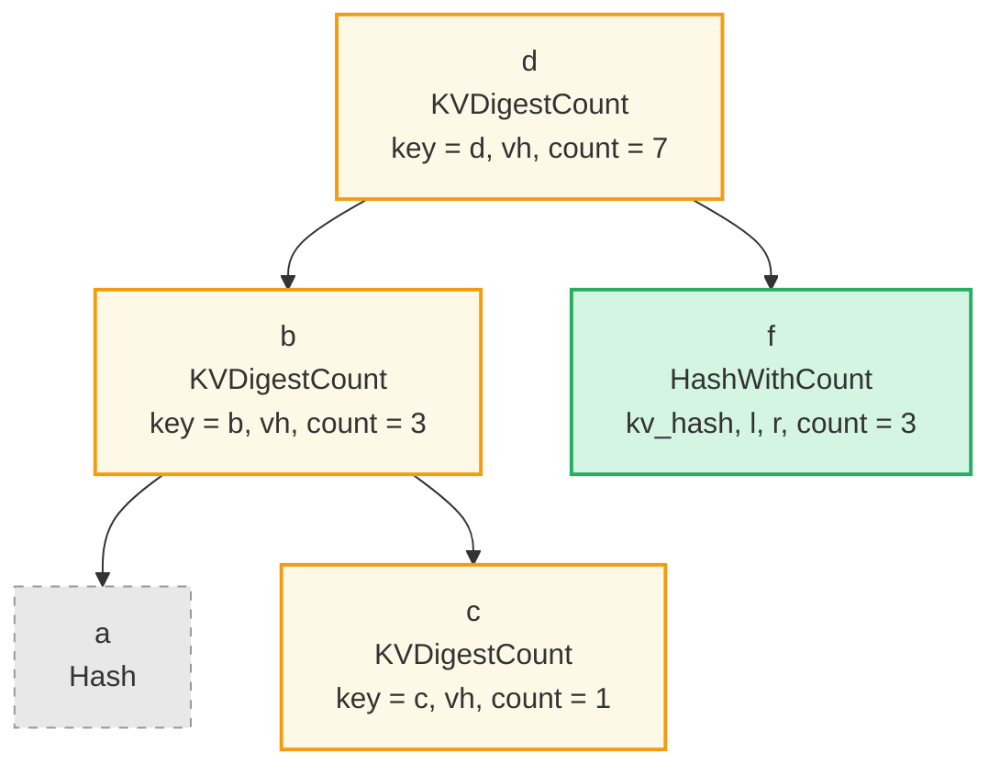
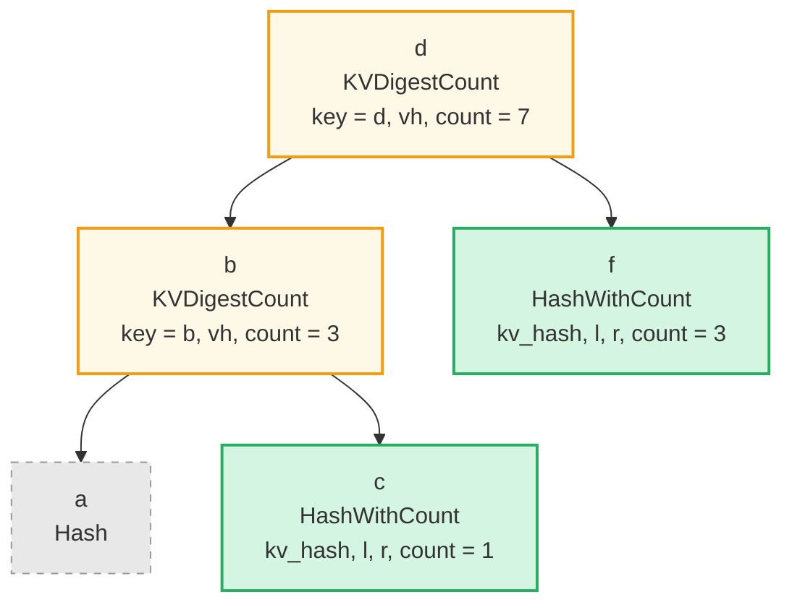
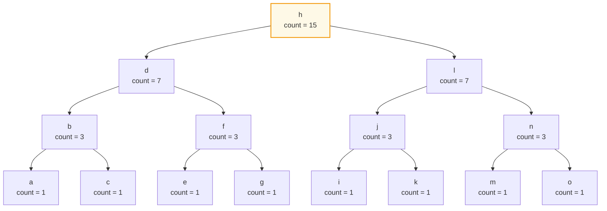
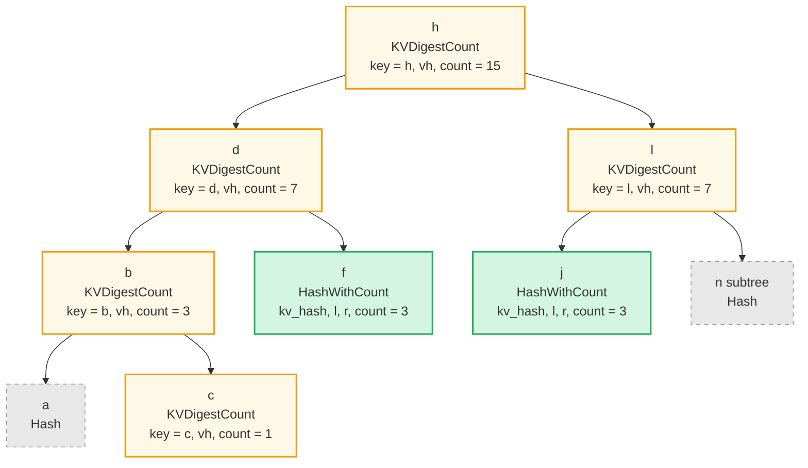

# Aggregate Count Queries

## Overview

An **Aggregate Count Query** lets a caller ask a single, very specific question:

> "How many elements in this subtree fall inside this key range?"

The answer comes back as a `u64`, and on a **ProvableCountTree** or
**ProvableCountSumTree** it can be returned together with a cryptographic proof
that anyone holding the tree's root hash can verify — without ever materializing
the elements themselves.

Where regular queries return key/value pairs and aggregate-sum queries return
running totals of `SumItem` values, an aggregate-count query returns only a
**count** and a proof of that count.

It is implemented as a new `QueryItem` variant:

```rust
pub enum QueryItem {
    Key(Vec<u8>),
    Range(Range<Vec<u8>>),
    // ... existing variants ...
    RangeAfterToInclusive(RangeInclusive<Vec<u8>>),

    /// Count the elements matched by the inner range, without returning them.
    /// Only valid on ProvableCountTree / ProvableCountSumTree (and their
    /// `NonCounted` wrapper variants).
    AggregateCountOnRange(Box<QueryItem>),
}
```

The wrapped `QueryItem` is the **range to count over** — it must be one of the
true range variants: `Range`, `RangeInclusive`, `RangeFrom`, `RangeTo`,
`RangeToInclusive`, `RangeAfter`, `RangeAfterTo`, `RangeAfterToInclusive`.
The single-key (`Key`), full-range (`RangeFull`), and self-nested
(`AggregateCountOnRange`) variants are all **rejected**.

> **Why are `Key` and `RangeFull` rejected?**
>
> - **`Key(k)`** would always return `0` or `1` — an existence test. Callers
>   should use the existing `GroveDb::has_raw` / `GroveDb::get_raw` (or their
>   provable variants) instead. Routing existence checks through this API
>   would force a count-shaped result type and proof shape on a question that
>   already has a much cheaper, narrower answer.
> - **`RangeFull`** has its answer already exposed by the parent's
>   `Element::ProvableCountTree(_, count, _)` /
>   `Element::ProvableCountSumTree(_, count, _, _)` bytes, which are
>   hash-verified by the parent Merk's proof. Going through
>   `AggregateCountOnRange(RangeFull)` would always produce a strictly heavier
>   proof for an answer the caller can read directly.
>
> In short, `AggregateCountOnRange` exists for the case the rest of the API
> can't already answer cheaply: counting a **bounded sub-range** of keys.

## Why this works only on Provable Count Trees

GroveDB has six tree types that track a count:

| Tree type                | Count tracked? | Count in node hash? | AggregateCountOnRange allowed? |
|--------------------------|:--------------:|:-------------------:|:-----------------------:|
| `CountTree`              | yes            | no                  | **no**                  |
| `CountSumTree`           | yes            | no                  | **no**                  |
| `ProvableCountTree`      | yes            | **yes**             | **yes**                 |
| `ProvableCountSumTree`   | yes            | **yes** (count only)| **yes**                 |
| `NonCountedProvableCountTree`    | yes (via wrapper) | yes (inner)    | **yes**                 |
| `NonCountedProvableCountSumTree` | yes (via wrapper) | yes (inner)    | **yes**                 |

Only the **provable** variants bake the count into the node hash via
`node_hash_with_count(kv_hash, left, right, count)`. Because every node's count
participates in the Merkle root, a verifier holding only the root hash can
reconstruct enough of the tree from a proof to **trust** the counts that appear
inside.

Plain `CountTree` and `CountSumTree` track counts in storage as a convenience
for the executing node, but those counts are not in the hash. A "proof" of
their count would be unverifiable, so we reject `AggregateCountOnRange` against them
at query-construction time.

The two `NonCounted*` wrapper variants are accepted because the wrapper only
tells the **parent** tree to skip this element when aggregating its own count;
the inner tree is still a fully-fledged provable count tree.

## Query-Level Constraints

`AggregateCountOnRange` is a **terminal** query item. When it appears, the surrounding
`Query` is reduced to a single, well-defined operation: "count, then return."

```rust
pub struct Query {
    pub items: Vec<QueryItem>,
    pub default_subquery_branch: SubqueryBranch,
    pub conditional_subquery_branches: Option<IndexMap<QueryItem, SubqueryBranch>>,
    pub left_to_right: bool,
    pub add_parent_tree_on_subquery: bool,
}
```

If any `QueryItem::AggregateCountOnRange(_)` appears in `items`, the query is only
well-formed when **all** of the following hold:

1. `items.len() == 1` — no other range items, no other counts, no mixing.
2. The inner `QueryItem` is **not** `Key` (use `has_raw` / `get_raw` for
   existence tests — see the note above).
3. The inner `QueryItem` is **not** `RangeFull` (use the parent element to read
   the unconditional total — see the note above).
4. The inner `QueryItem` is not itself another `AggregateCountOnRange`.
5. `default_subquery_branch.subquery.is_none()` and `subquery_path.is_none()`.
6. `conditional_subquery_branches.is_none()` (or empty).
7. The targeted subtree's `TreeType` is one of the four allowed variants above.
8. The enclosing `SizedQuery` does not set a `limit` or `offset`. Counting is an
   aggregate over the matched range — pagination would silently change the
   answer and is therefore rejected.
9. `left_to_right` is **ignored** (counting is direction-agnostic). It is not
   an error to set it, but it has no effect on the returned count or proof.

Violating constraints 1–8 returns `Error::InvalidQuery(...)` with a message
that names the offending field, before any I/O is performed.

## API surface

`AggregateCountOnRange` queries go through the **same** `prove_query` entry
point as every other `PathQuery` — only the verifier is dedicated:

```rust
// Prove side — unchanged from regular queries:
GroveDb::prove_query(&path_query, prove_options, grove_version)
    -> CostResult<Vec<u8>, Error>

// Verify side — dedicated, returns (root_hash, count):
GroveDb::verify_aggregate_count_query(proof, &path_query, grove_version)
    -> Result<(CryptoHash, u64), Error>
```

A bare tuple is used for the result rather than a wrapper struct because
the count is already a `u64` and the `path_query` itself echoes the inner
range — there is nothing else to return.

> **Note on `NonCounted` children.** `Element::NonCounted` wrappers tell
> the parent tree to skip the wrapped element when aggregating its own
> count. `AggregateCountOnRange` honors this: every node in a
> `ProvableCountTree` carries an own-count of 1 (normal) or 0
> (`NonCounted`-wrapped), and the verifier credits only the **own-count**
> to the in-range total when the boundary key falls in range. So
> `NonCounted` children are excluded from the result, matching the
> tree's own aggregate.
>
> Mechanically the verifier derives each boundary node's own-count from
> its committed aggregate as
> `aggregate − left_struct − right_struct` (see the "Verifier shape
> walk" section). For a `NonCounted` leaf, `aggregate = 0` and there are
> no children, so own-count = 0 and the key contributes nothing.

## How the Proof is Built

For a `ProvableCountTree`, every node hash already commits to the count of its
own subtree via `node_hash_with_count(kv_hash, left, right, count)`. The proof
generator's job is to produce just enough structure that the verifier can:

1. Reconstruct the **root hash** of the queried Merk and check it against the
   expected hash.
2. Compute the answer **count** from the count fields embedded along the way.

To do that, every proof node has a role; we use a small vocabulary of
proof-node types — three from the existing proof system, plus one new
self-verifying node added specifically for this proof shape:

| Role in proof              | Proof node type                                                              | What it carries                                                | Why we picked it                                                                                                         |
|----------------------------|------------------------------------------------------------------------------|----------------------------------------------------------------|--------------------------------------------------------------------------------------------------------------------------|
| **On-path / boundary**     | `KVDigestCount(key, value_hash, count)`                                       | key + value digest + subtree count                             | the verifier needs the **key** to test "is it in the range?", and the count is hash-bound via `node_hash_with_count` so it can also be used as the structural count of this subtree by ancestor own-count derivation |
| **Fully-inside root**      | `HashWithCount(kv_hash, left_child_hash, right_child_hash, count)`            | the four fields needed to recompute `node_hash_with_count`     | one op per collapsed subtree, **and self-verifying** — see security note below                                          |
| **Fully-outside**          | `HashWithCount(kv_hash, left_child_hash, right_child_hash, count)` (same)     | same shape as the inside variant                               | the structural count of an outside subtree is needed by the boundary parent's `own_count = aggregate − left − right` derivation; only `HashWithCount` carries a *hash-bound* count, so we use it for outside subtrees too. Plain `Hash(_)` would not bind a count and is therefore not used in count proofs. |
| **Empty side**             | (the empty-tree sentinel, no `Push` needed)                                   | —                                                              | a missing child contributes hash = 0 and count = 0 to the parent                                                          |

> **Why `HashWithCount` is self-verifying.** The `count` value carried by a
> `HashWithCount` op is *bound* to the parent merk's hash chain, not trusted
> on faith. The verifier computes
> `node_hash_with_count(kv_hash, left_child_hash, right_child_hash, count)`
> from the four committed fields and uses the result as the subtree's
> committed `node_hash` for the parent's hash recomputation. If the prover
> lied about `count`, the recomputed `node_hash` diverges from what the
> parent committed, and the parent's Merkle-root check fails. (An earlier
> draft of this design used `HashWithCount(node_hash, count)` only — that
> form was rejected during review because the count would have been
> trustlessly attached metadata, with no cryptographic binding. See the
> "Verifier shape walk" section below for the second half of the
> security story.)

### Walking running example

We'll use this 7-key `ProvableCountTree` as the running example through every
diagram below. Counts shown next to each node are "size of the subtree rooted
here":



Below, each per-case diagram colours nodes by the role table above:

- 🟢 **green** = `HashWithCount` (fully-inside, contributes count, not descended)
- 🟡 **yellow** = `KVDigestCount` (on-path / boundary, key tested for in-range)
- ⚪ **gray**  = `Hash` (opaque, fully-outside or unneeded child of an inside subtree)

---

### Case 1 — Open ranges (one bound)

These are the variants with a single bound: `RangeFrom(a..)`, `RangeTo(..b)`,
`RangeToInclusive(..=b)`, `RangeAfter((a, ..))`. Conceptually we walk down to
that one bound, partitioning each subtree along the way into "fully on the
included side" or "fully on the excluded side".

#### Example — `RangeFrom("c"..)` → keys ≥ "c"

Expected: `{c, d, e, f, g}`, count = 5.



Why each role:

- **d, b, c** — boundary nodes on the walk to the lower bound `"c"`. Each is
  `KVDigestCount` because the verifier must test its key against `>= "c"`.
- **a** — left child of `b`; "a" < "c", so its entire subtree is excluded.
  Sent as a single `Hash` (no key, no count).
- **f** — right child of `d`; "d" < "f" and we're including everything ≥ "c",
  so the entire `f` subtree (including its descendants) is in-range.
  We don't need to descend — `f` is sent as a single `HashWithCount` op
  whose `(kv_hash, left_child_hash, right_child_hash, count)` lets the
  verifier recompute `f.node_hash` self-contained, and contributes the full
  subtree count of 3 directly. **The original tree's `e` and `g` children
  do not appear as separate proof ops** — their hashes live inside the
  `HashWithCount`'s `left_child_hash` / `right_child_hash` fields.

Verifier total:

| Node | In range? | Contribution |
|------|-----------|--------------|
| d (KVDigestCount, key="d") | "d" ≥ "c"  | **+1** |
| b (KVDigestCount, key="b") | "b" < "c"  | +0 |
| c (KVDigestCount, key="c") | "c" ≥ "c"  | **+1** |
| f (HashWithCount, count=3)   | (whole subtree in range) | **+3** |

→ **count = 5** ✓

#### Example — `RangeAfter(("b", ..))` → keys > "b"

Same expected match set `{c, d, e, f, g}`, count = 5 — but the boundary
walk stops one level higher (at `b` instead of `c`), and the in-range test
flips from `>=` to `>`.



Why each role differs from the previous example:

- **b** is now the boundary's terminus, not `c`. It is still `KVDigestCount`
  because the verifier needs the key to apply the in-range test — but the
  test is now `> "b"`, so `b` itself **fails** and contributes 0.
- **c** is the right child of `b`. Every key in `c`'s subtree is `> "b"`
  (here, just the leaf `c` itself), so the whole subtree is in-range. We
  don't descend; `c` becomes `HashWithCount` (no key needed — its
  `(kv_hash, l, r, count)` self-contains everything the verifier needs)
  and contributes its count of 1 directly. Compare to the previous example
  where `c` was a boundary node tested against `>= "c"`.
- **a** plays the same role as before — fully outside, opaque `Hash`. **f's
  original-tree children (`e`, `g`) do not appear as separate proof ops**
  — they live inside `f`'s `HashWithCount` fields.

Verifier total:

| Node | In range? | Contribution |
|------|-----------|--------------|
| d (KVDigestCount, key="d") | "d" > "b"          | **+1** |
| b (KVDigestCount, key="b") | "b" > "b" → no     | +0 |
| c (HashWithCount, count=1)   | (whole subtree in range) | **+1** |
| f (HashWithCount, count=3)   | (whole subtree in range) | **+3** |

→ **count = 5** ✓

> **Take-away:** the *match set* is the same as `RangeFrom("c"..)`, but the
> *proof shape* is slightly cheaper — one fewer `KVDigestCount` and one extra
> `HashWithCount` — because the bound aligns with an internal node rather than
> a leaf. The generator picks the shape based on where the bound key lives
> in the tree, not on what the user wrote.

The same pattern, mirrored, applies to `RangeTo(..b)` and
`RangeToInclusive(..=b)` (upper-bound variants — boundary walk goes right,
fully-inside subtrees hang off the left of each step). The only differences
across all four open-range variants are which side of each split is
"fully-included" and whether the boundary key itself counts (`>=` vs `>`
for the lower side, `<` vs `<=` for the upper side).

---

### Case 2 — Closed ranges (both bounds)

These are the variants with both a lower and upper bound: `Range(a..b)`,
`RangeInclusive(a..=b)`, `RangeAfterTo((a, b))`, `RangeAfterToInclusive((a, ..=b))`.

The proof has **two** boundary walks meeting at the lowest common ancestor of
the two bounds. Subtrees fully between the two bounds appear as
`HashWithCount`; subtrees outside appear as `Hash`.

To make the structure interesting we'll use a slightly bigger example tree
than for Case 1 — 15 keys (`a` through `o`), 4 levels deep, balanced as a
perfect binary tree. Counts shown are subtree sizes:



#### Example — `RangeInclusive("c"..="l")` → keys ∈ [c, l]

Expected: `{c, d, e, f, g, h, i, j, k, l}`, count = 10.



Why each role:

- **h** — LCA of `"c"` and `"l"`. Sits above both walks, so it's a
  `KVDigestCount` and the verifier tests its key against `[c, l]`.
- **d** — on the left walk (down to lower bound `c`). `KVDigestCount`,
  key tested.
- **l** — on the right walk (down to upper bound `l`); also the upper bound
  itself. `KVDigestCount`, key tested (it passes — `l ≤ l`).
- **b** — on the left walk (`b < c`, so we have to descend further to find
  the lower bound). `KVDigestCount`, key tested (it fails — `b < c`).
- **c** — the lower bound itself. `KVDigestCount`, key tested (it passes —
  `c ≥ c`).
- **a** — left of `b`; "a" < "c", entire subtree outside. `Hash`.
- **n** — right of `l`; entire subtree has keys > "l". The whole `n`
  subtree (n, m, o) collapses to a single `Hash`.
- **f** — right child of `d`. Every key under `f` is `> "d"` and `≤ "g" < "l"`,
  so the entire subtree is in-range. We do not descend; `f` becomes a single
  `HashWithCount` op carrying `(kv_hash, left_child_hash, right_child_hash,
  count=3)` and contributes 3 directly. **Its original-tree children `e`
  and `g` do not appear as separate proof ops** — their hashes are inside
  `f`'s `HashWithCount` fields.
- **j** — left child of `l`. Same shape as `f`: every key under `j` is
  `≥ "i" > "c"` and `≤ "k" < "l"`, so the entire subtree is in-range.
  `HashWithCount`, contributes count = 3. `i` and `k` likewise live inside
  `j`'s embedded child hashes.

> **Each collapsed subtree is one Push op.** Because `HashWithCount`
> embeds its `(kv_hash, left_child_hash, right_child_hash, count)`
> directly, every fully-inside subtree contributes exactly **one** proof
> op regardless of its depth in the original tree. The proof for this
> 15-key range scan in a 4-level tree is just **9 push ops** (h, d, b, c,
> a, f, l, j, n) plus the structural Parent/Child ops — barely more than
> the 7-key example in Case 1. This is what "O(log n) regardless of
> count" looks like in practice: deeper trees do not blow up the proof.

Verifier total:

| Node | In range? | Contribution |
|------|-----------|--------------|
| h (KVDigestCount, key="h") | "c" ≤ "h" ≤ "l" | **+1** |
| d (KVDigestCount, key="d") | "c" ≤ "d" ≤ "l" | **+1** |
| b (KVDigestCount, key="b") | "b" < "c" → no  | +0 |
| c (KVDigestCount, key="c") | "c" ≤ "c" ≤ "l" | **+1** |
| f (HashWithCount, count=3)   | (whole subtree in range) | **+3** |
| l (KVDigestCount, key="l") | "c" ≤ "l" ≤ "l" | **+1** |
| j (HashWithCount, count=3)   | (whole subtree in range) | **+3** |

→ **count = 10** ✓

#### Variant differences

The four closed-range variants differ only in **whether each boundary key
itself counts**, not in the proof shape:

| Variant                          | Lower test | Upper test |
|----------------------------------|------------|------------|
| `Range(a..b)`                    | key ≥ a    | key < b    |
| `RangeInclusive(a..=b)`          | key ≥ a    | key ≤ b    |
| `RangeAfterTo((a, b))`           | key > a    | key < b    |
| `RangeAfterToInclusive((a, ..=b))` | key > a  | key ≤ b    |

The verifier applies the relevant test at each boundary `KVDigestCount`. The
generator does not need to know which variant is in play — it always emits the
same shape, and the inclusivity flags travel with the query for the verifier.

---

### Empty subtrees

An aggregate-count query against an empty Merk returns `count = 0` with a
trivial proof (the empty-tree marker). Asking for `AggregateCountOnRange` on a
path that does not resolve to a tree at all is an error
(`Error::PathNotFound(...)`), the same as any other query.

### Why this is `O(log n)` regardless of count

Every diagram above has at most:

- One walk per bound (so 1 or 2 walks of depth `O(log n)`),
- A constant number of fully-inside subtree roots per level (the "right
  siblings" hanging off the left walk and "left siblings" hanging off the
  right walk).

Each of those is a single proof-node Push. Therefore the proof's node count is
`O(log n)`, and crucially does **not** depend on the answer's value. Counting
a billion-key range can be done with the same proof size as counting a
hundred-key range.

## Verifier shape walk

The verifier is **two-phase**, not just a "count everything visible" pass.
Without this discipline a malicious prover could:

1. Send a single `Push(Hash(expected_root))` for a non-empty tree, and
   receive `(expected_root, 0)` for any range — root hash matches, count is
   trivially zero.
2. Replace an in-range collapsed subtree with a hash carrying the *same*
   `node_hash` but no count, undercounting by the missing subtree count.
3. Attach extra `KVDigestCount` children below a keyless leaf node.
   `Tree::hash()` for those node types is computed only from their
   embedded fields and ignores any reconstructed children, so the root
   hash stays valid — but a verifier that summed every visited node would
   credit the bogus children as `+1` each.
4. Lie about the structural count of an outside subtree to skew an
   ancestor boundary node's `own_count` derivation, over- or under-
   counting `NonCounted`-aware boundary contributions.

To rule out all four, the verifier:

1. **Phase 1** — decode the proof bytes into a `ProofTree` via
   `execute_with_options`. The visit-node closure performs only a coarse
   allowlist (`HashWithCount` / `KVDigestCount`; **plain `Hash` is not
   accepted in count proofs**) and **does not count anything**. (We
   disable the AVL balance check for this proof shape — count proofs
   intentionally collapse one side to height 1 while descending the
   other.)
2. **Phase 2** — walk the reconstructed tree with the same inherited
   exclusive subtree-key bounds the prover used (`(None, None)` at the
   root). At each position, call `classify_subtree(bounds, range)` and
   bind the proof-tree node type to the classification, returning the pair
   `(in_range_count, structural_count)` where `structural_count` is the
   merk-recorded aggregate count of this subtree (used by the parent's
   `own_count` derivation):

   | Classification | Required node                                                         | Children allowed?       | `(in_range, structural)`                                                                                  |
   |----------------|-----------------------------------------------------------------------|-------------------------|-----------------------------------------------------------------------------------------------------------|
   | `Disjoint`     | leaf `HashWithCount(_, _, _, count)`                                  | **no** (must be a leaf) | `(0, count)`                                                                                              |
   | `Contained`    | leaf `HashWithCount(_, _, _, count)`                                  | **no** (must be a leaf) | `(count, count)` — `count` is the merk's aggregate, which already excludes `NonCounted` entries (own = 0) |
   | `Boundary`     | `KVDigestCount(key, _, aggregate)` with `key` strictly inside `bounds` | yes — recurse           | `own_count = aggregate − left_struct − right_struct`; in-range = `left_in + right_in + (own_count if range.contains(key) else 0)`; structural = `aggregate` |

3. Counts are summed with `checked_add`; the boundary `own_count` uses
   `checked_sub` (so a malformed proof claiming children's structural
   counts that exceed the parent's aggregate is rejected, not silently
   saturated).

Because every leaf-shape position is forced to be a leaf, attack 3
(smuggled counted children under a keyless node) is rejected. Because every
`Contained` and `Disjoint` position must hold `HashWithCount` (and its
count is bound to the parent's hash via `node_hash_with_count`), attacks 2
and 4 are both rejected — outside subtrees can't lie about their
structural count any more than inside ones can. Because the root's
`(None, None)` bounds against any bounded inner range classify as
`Boundary` (requiring `KVDigestCount`), attack 1 is rejected.

The shape walk is independent of the chain-hash check: even a proof whose
reconstructed root happens to match the expected root will be rejected if
its shape diverges from what `classify_subtree` expects.

## Decode safety

`QueryItem::AggregateCountOnRange(Box<QueryItem>)` is the only recursive
variant in the enum. To prevent a small malicious payload of repeated
variant-10 bytes from exhausting the stack inside the bincode or serde
decoder before any validation runs:

- The bincode `Decode` / `BorrowDecode` impls dispatch through internal
  `decode_with_depth` helpers with `MAX_QUERY_ITEM_DECODE_DEPTH = 4` (the
  only legal nesting is one wrap, plus headroom). Exceeding the limit
  errors with `"QueryItem nesting depth exceeded maximum during
  deserialization"`.
- The serde `Deserialize` impl deserializes the inner item via a
  `NonAggregateInner` newtype wrapper whose `Field` enum **omits**
  `AggregateCountOnRange`, so a nested-aggregate payload is rejected by
  serde's enum dispatcher immediately, with no recursion through
  `QueryItem::deserialize`.
- Defense in depth: an inner `AggregateCountOnRange` is also rejected on
  decode (in addition to being rejected by
  `Query::validate_aggregate_count_on_range`).

## Cost Model

`AggregateCountOnRange` queries are designed to be cheap and predictable:

- **Storage seeks:** `O(log n)`.
- **Hash calls:** one per node in the proof.
- **Proof bytes:** `O(log n) * (hash size + count varint size)`.

There is no per-element cost component, because no elements are read or
returned. This is the headline reason the API exists — a billion-element tree
can be counted in a few hundred bytes of proof.

The cost-tracking integration mirrors regular range queries, but with the
"loaded bytes" component dominated by the proof shape rather than element
payloads.

## API Sketch

```rust
use grovedb::{Element, GroveDb, PathQuery, Query, SizedQuery};
use grovedb_query::QueryItem;

// "How many votes have keys between block 1_000 and 2_000 (exclusive)?"
// Use the helper constructor to skip the boilerplate of building the Query
// and SizedQuery by hand.
let path_query = PathQuery::new_aggregate_count_on_range(
    vec![b"votes".to_vec()],
    QueryItem::Range(1_000u64.to_be_bytes().to_vec()..2_000u64.to_be_bytes().to_vec()),
);

let proof_bytes = db
    .prove_query(&path_query, None, grove_version)
    .unwrap()
    .expect("prove failed");

// Verifier side — only needs the proof bytes + the trusted root hash.
let (root, count) = GroveDb::verify_aggregate_count_query(
    &proof_bytes, &path_query, grove_version,
).expect("verify failed");

assert_eq!(root, expected_root_hash);
println!("votes in [1000, 2000): {}", count);
```

## Comparison Table

| Feature                          | Regular `Query`              | `AggregateSumQuery`              | `AggregateCountOnRange` (this doc)           |
|----------------------------------|------------------------------|----------------------------------|---------------------------------------|
| Returns                          | Elements / keys              | Sum + matched key/value pairs    | A single `u64` count                  |
| Stops on                         | Limit, end of range          | Sum limit and/or item limit      | Range bounds (whole match counted)    |
| Subqueries allowed               | Yes                          | No                               | **No**                                |
| Other items in same `Query`      | Yes                          | N/A (own struct)                 | **No** — must be the only item        |
| `limit` / `offset` honored       | Yes                          | Yes (item limit)                 | **No** — rejected at validation       |
| Required tree type               | Any                          | `SumTree`, `BigSumTree`, ...     | Provable count trees only             |
| Proof size relative to result    | O(result)                    | O(matched items)                 | **O(log n)** regardless of count      |

---
