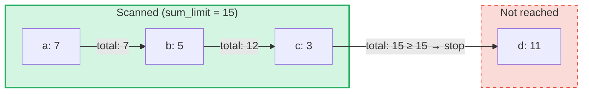

# Aggregate Sum Queries

## Overview

Aggregate Sum Queries are a specialized query type designed for **SumTrees** in GroveDB.
While regular queries retrieve elements by key or range, aggregate sum queries iterate
through elements and accumulate their sum values until a **sum limit** is reached.

This is useful for questions like:
- "Give me transactions until the running total exceeds 1000"
- "Which items contribute to the first 500 units of value in this tree?"
- "Collect sum items up to a budget of N"

## Core Concepts

### How It Differs from Regular Queries

| Feature | PathQuery | AggregateSumPathQuery |
|---------|-----------|----------------------|
| **Target** | Any element type | SumItem / ItemWithSumItem elements |
| **Stop condition** | Limit (count) or end of range | Sum limit (running total) **and/or** item limit |
| **Returns** | Elements or keys | Key-sum value pairs |
| **Subqueries** | Yes (descend into subtrees) | No (single tree level) |
| **References** | Resolved by GroveDB layer | Optionally followed or ignored |

### The AggregateSumQuery Structure

```rust
pub struct AggregateSumQuery {
    pub items: Vec<QueryItem>,              // Keys or ranges to scan
    pub left_to_right: bool,                // Iteration direction
    pub sum_limit: u64,                     // Stop when running total reaches this
    pub limit_of_items_to_check: Option<u16>, // Max number of matching items to return
}
```

The query is wrapped in an `AggregateSumPathQuery` to specify where in the grove to look:

```rust
pub struct AggregateSumPathQuery {
    pub path: Vec<Vec<u8>>,                 // Path to the SumTree
    pub aggregate_sum_query: AggregateSumQuery,
}
```

### Sum Limit — The Running Total

The `sum_limit` is the central concept. As elements are scanned, their sum values are
accumulated. Once the running total meets or exceeds the sum limit, iteration stops:



> **Result:** `[(a, 7), (b, 5), (c, 3)]` — iteration stops because 7 + 5 + 3 = 15 >= sum_limit

Negative sum values are supported. A negative value increases the remaining budget:

```text
sum_limit = 12, elements: a(10), b(-3), c(5)

a: total = 10, remaining = 2
b: total =  7, remaining = 5  ← negative value gave us more room
c: total = 12, remaining = 0  ← stop

Result: [(a, 10), (b, -3), (c, 5)]
```

## Query Options

The `AggregateSumQueryOptions` struct controls query behavior:

```rust
pub struct AggregateSumQueryOptions {
    pub allow_cache: bool,                              // Use cached reads (default: true)
    pub error_if_intermediate_path_tree_not_present: bool, // Error on missing path (default: true)
    pub error_if_non_sum_item_found: bool,              // Error on non-sum elements (default: true)
    pub ignore_references: bool,                        // Skip references (default: false)
}
```

### Handling Non-Sum Elements

SumTrees may contain a mix of element types: `SumItem`, `Item`, `Reference`, `ItemWithSumItem`,
and others. By default, encountering a non-sum, non-reference element produces an error.

When `error_if_non_sum_item_found` is set to `false`, non-sum elements are **silently skipped**
without consuming a user limit slot:

```text
Tree contents: a(SumItem=7), b(Item), c(SumItem=3)
Query: sum_limit=100, limit_of_items_to_check=2, error_if_non_sum_item_found=false

Scan: a(7) → returned, limit=1
      b(Item) → skipped, limit still 1
      c(3) → returned, limit=0 → stop

Result: [(a, 7), (c, 3)]
```

Note: `ItemWithSumItem` elements are **always** processed (never skipped), because they carry
a sum value.

### Reference Handling

By default, `Reference` elements are **followed** — the query resolves the reference chain
(up to 3 intermediate hops) to find the target element's sum value:

```text
Tree contents: a(SumItem=7), ref_b(Reference → a)
Query: sum_limit=100

ref_b is followed → resolves to a(SumItem=7)

Result: [(a, 7), (ref_b, 7)]
```

When `ignore_references` is `true`, references are silently skipped without consuming a limit
slot, similar to how non-sum elements are skipped.

Reference chains deeper than 3 intermediate hops produce a `ReferenceLimit` error.

## The Result Type

Queries return an `AggregateSumQueryResult`:

```rust
pub struct AggregateSumQueryResult {
    pub results: Vec<(Vec<u8>, i64)>,       // Key-sum value pairs
    pub hard_limit_reached: bool,           // True if system limit truncated results
}
```

The `hard_limit_reached` flag indicates whether the system's hard scan limit (default: 1024
elements) was reached before the query completed naturally. When `true`, more results may
exist beyond what was returned.

## Two Limit Systems

Aggregate sum queries have **three** stopping conditions:

| Limit | Source | What it counts | Effect when reached |
|-------|--------|---------------|-------------------|
| **sum_limit** | User (query) | Running total of sum values | Stops iteration |
| **limit_of_items_to_check** | User (query) | Matching items returned | Stops iteration |
| **Hard scan limit** | System (GroveVersion, default 1024) | All elements scanned (including skipped) | Stops iteration, sets `hard_limit_reached` |

The hard scan limit prevents unbounded iteration when no user limit is set. Skipped elements
(non-sum items with `error_if_non_sum_item_found=false`, or references with
`ignore_references=true`) count against the hard scan limit but **not** against the user's
`limit_of_items_to_check`.

## API Usage

### Simple Query

```rust
use grovedb::AggregateSumPathQuery;
use grovedb_merk::proofs::query::AggregateSumQuery;

// "Give me items from this SumTree until the total reaches 1000"
let query = AggregateSumQuery::new(1000, None);
let path_query = AggregateSumPathQuery {
    path: vec![b"my_tree".to_vec()],
    aggregate_sum_query: query,
};

let result = db.query_aggregate_sums(
    &path_query,
    true,   // allow_cache
    true,   // error_if_intermediate_path_tree_not_present
    None,   // transaction
    grove_version,
).unwrap().expect("query failed");

for (key, sum_value) in &result.results {
    println!("{}: {}", String::from_utf8_lossy(key), sum_value);
}
```

### Query with Options

```rust
use grovedb::{AggregateSumPathQuery, AggregateSumQueryOptions};
use grovedb_merk::proofs::query::AggregateSumQuery;

// Skip non-sum items and ignore references
let query = AggregateSumQuery::new(1000, Some(50));
let path_query = AggregateSumPathQuery {
    path: vec![b"mixed_tree".to_vec()],
    aggregate_sum_query: query,
};

let result = db.query_aggregate_sums_with_options(
    &path_query,
    AggregateSumQueryOptions {
        error_if_non_sum_item_found: false,  // skip Items, Trees, etc.
        ignore_references: true,              // skip References
        ..AggregateSumQueryOptions::default()
    },
    None,
    grove_version,
).unwrap().expect("query failed");

if result.hard_limit_reached {
    println!("Warning: results may be incomplete (hard limit reached)");
}
```

### Key-Based Queries

Instead of scanning a range, you can query specific keys:

```rust
// Check the sum value of specific keys
let query = AggregateSumQuery::new_with_keys(
    vec![b"alice".to_vec(), b"bob".to_vec(), b"carol".to_vec()],
    u64::MAX,  // no sum limit
    None,      // no item limit
);
```

### Descending Queries

Iterate from the highest key to the lowest:

```rust
let query = AggregateSumQuery::new_descending(500, Some(10));
// Or: query.left_to_right = false;
```

## Constructor Reference

| Constructor | Description |
|-------------|-------------|
| `new(sum_limit, limit)` | Full range, ascending |
| `new_descending(sum_limit, limit)` | Full range, descending |
| `new_single_key(key, sum_limit)` | Single key lookup |
| `new_with_keys(keys, sum_limit, limit)` | Multiple specific keys |
| `new_with_keys_reversed(keys, sum_limit, limit)` | Multiple keys, descending |
| `new_single_query_item(item, sum_limit, limit)` | Single QueryItem (key or range) |
| `new_with_query_items(items, sum_limit, limit)` | Multiple QueryItems |

---
