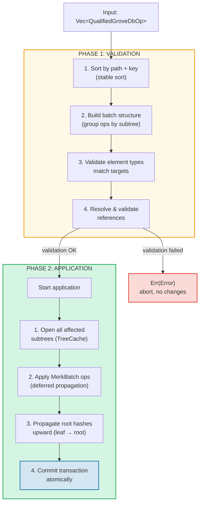
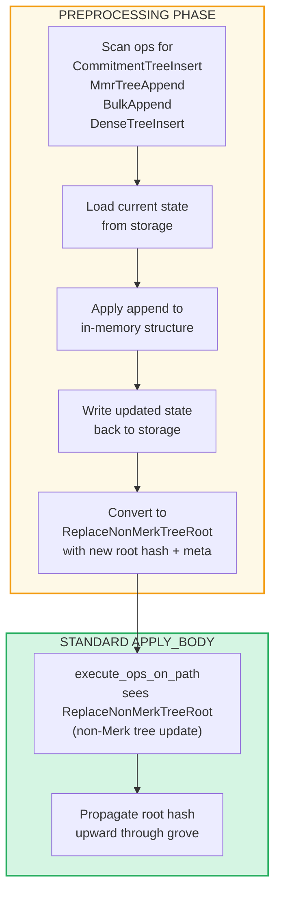

# Batch Operations at the Grove Level

## GroveOp Variants

At the GroveDB level, operations are represented as `GroveOp`:

```rust
pub enum GroveOp {
    // User-facing operations:
    InsertOnly { element: Element },
    InsertOrReplace { element: Element },
    Replace { element: Element },
    Patch { element: Element, change_in_bytes: i32 },
    RefreshReference { reference_path_type, max_reference_hop, flags, trust_refresh_reference },
    Delete,
    DeleteTree(TreeType),                          // Parameterized by tree type

    // Non-Merk tree append operations (user-facing):
    CommitmentTreeInsert { cmx: [u8; 32], payload: Vec<u8> },
    MmrTreeAppend { value: Vec<u8> },
    BulkAppend { value: Vec<u8> },
    DenseTreeInsert { value: Vec<u8> },

    // Internal operations (created by preprocessing/propagation, rejected by from_ops):
    ReplaceTreeRootKey { hash, root_key, aggregate_data },
    InsertTreeWithRootHash { hash, root_key, flags, aggregate_data },
    ReplaceNonMerkTreeRoot { hash: [u8; 32], meta: NonMerkTreeMeta },
    InsertNonMerkTree { hash, root_key, flags, aggregate_data, meta: NonMerkTreeMeta },
}
```

**NonMerkTreeMeta** carries tree-type-specific state through batch processing:

```rust
pub enum NonMerkTreeMeta {
    CommitmentTree { total_count: u64, chunk_power: u8 },
    MmrTree { mmr_size: u64 },
    BulkAppendTree { total_count: u64, chunk_power: u8 },
    DenseTree { count: u16, height: u8 },
}
```

Each operation is wrapped in a `QualifiedGroveDbOp` that includes the path:

```rust
pub struct QualifiedGroveDbOp {
    pub path: KeyInfoPath,           // Where in the grove
    pub key: Option<KeyInfo>,        // Which key (None for append-only tree ops)
    pub op: GroveOp,                 // What to do
}
```

> **Note:** The `key` field is `Option<KeyInfo>` — it is `None` for append-only tree
> operations (`CommitmentTreeInsert`, `MmrTreeAppend`, `BulkAppend`, `DenseTreeInsert`)
> where the tree key is the last segment of `path` instead.

## Two-Phase Processing

Batch operations are processed in two phases:



## TreeCache and Deferred Propagation

During batch application, GroveDB uses a **TreeCache** to defer root hash
propagation until all operations in a subtree are complete:

```mermaid
graph TD
    subgraph without["WITHOUT TreeCache (naive)"]
        w1["Op 1: Insert A in X"]
        w1p["Propagate X → parent → root"]
        w2["Op 2: Insert B in X"]
        w2p["Propagate X → parent → root"]
        w3["Op 3: Insert C in X"]
        w3p["Propagate X → parent → root"]
        w1 --> w1p --> w2 --> w2p --> w3 --> w3p
    end

    subgraph with_tc["WITH TreeCache (deferred)"]
        t1["Op 1: Insert A in X<br/>→ buffered"]
        t2["Op 2: Insert B in X<br/>→ buffered"]
        t3["Op 3: Insert C in X<br/>→ buffered"]
        tp["Propagate X → parent → root<br/>(walk up ONCE)"]
        t1 --> t2 --> t3 --> tp
    end

    style without fill:#fadbd8,stroke:#e74c3c,stroke-width:2px
    style with_tc fill:#d5f5e3,stroke:#27ae60,stroke-width:2px
    style w1p fill:#fadbd8,stroke:#e74c3c
    style w2p fill:#fadbd8,stroke:#e74c3c
    style w3p fill:#fadbd8,stroke:#e74c3c
    style tp fill:#d5f5e3,stroke:#27ae60,stroke-width:2px
```



> **3 propagations × O(depth)** vs **1 propagation × O(depth)** = 3x faster for this subtree.

This is a significant optimization when many operations target the same subtree.

## Atomic Cross-Subtree Operations

A key property of GroveDB batches is **atomicity across subtrees**. A single batch
can modify elements in multiple subtrees, and either all changes commit or none do:

```text
    Batch:
    1. Delete ["balances", "alice"]       (remove balance)
    2. Insert ["balances", "bob"] = 100   (add balance)
    3. Update ["identities", "bob", "rev"] = 2  (update revision)

    Three subtrees affected: balances, identities, identities/bob

    If ANY operation fails → ALL operations are rolled back
    If ALL succeed → ALL are committed atomically
```

The batch processor handles this by:
1. Collecting all affected paths
2. Opening all needed subtrees
3. Applying all operations
4. Propagating all root hashes in dependency order
5. Committing the entire transaction

## Batch Preprocessing for Non-Merk Trees

CommitmentTree, MmrTree, BulkAppendTree, and DenseAppendOnlyFixedSizeTree operations
require access to storage contexts outside the Merk, which is not available inside the
standard `execute_ops_on_path` method (it only has access to the Merk). These operations
use a **preprocessing pattern**: before the main `apply_body` phase, the entry
points scan for non-Merk tree ops and convert them to standard internal ops.

```rust
pub enum GroveOp {
    // ... standard ops ...

    // Non-Merk tree operations (user-facing):
    CommitmentTreeInsert { cmx: [u8; 32], payload: Vec<u8> },
    MmrTreeAppend { value: Vec<u8> },
    BulkAppend { value: Vec<u8> },
    DenseTreeInsert { value: Vec<u8> },

    // Internal ops (produced by preprocessing):
    ReplaceNonMerkTreeRoot { hash: [u8; 32], meta: NonMerkTreeMeta },
}
```



**Why preprocessing?** The `execute_ops_on_path` function operates on a single
Merk subtree and has no access to `self.db` or broader storage contexts.
Preprocessing in the entry points (`apply_batch_with_element_flags_update`,
`apply_partial_batch_with_element_flags_update`) has full access to the database,
so it can load/save data and then hand off a simple `ReplaceNonMerkTreeRoot`
to the standard batch machinery.

Each preprocessing method follows the same pattern:
1. **`preprocess_commitment_tree_ops`** — Loads frontier and BulkAppendTree from
   data storage, appends to both, saves back, converts to `ReplaceNonMerkTreeRoot`
   with updated combined root and `CommitmentTree { total_count, chunk_power }` meta
2. **`preprocess_mmr_tree_ops`** — Loads MMR from data storage, appends values,
   saves back, converts to `ReplaceNonMerkTreeRoot` with updated MMR root
   and `MmrTree { mmr_size }` meta
3. **`preprocess_bulk_append_ops`** — Loads BulkAppendTree from data storage,
   appends values (may trigger chunk compaction), saves back, converts to
   `ReplaceNonMerkTreeRoot` with updated state root and `BulkAppendTree { total_count, chunk_power }` meta
4. **`preprocess_dense_tree_ops`** — Loads DenseFixedSizedMerkleTree from data
   storage, inserts values sequentially, recomputes root hash, saves back,
   converts to `ReplaceNonMerkTreeRoot` with updated root hash and `DenseTree { count, height }` meta

The `ReplaceNonMerkTreeRoot` op carries the new root hash and a `NonMerkTreeMeta` enum
so the element can be fully reconstructed after processing.

---
