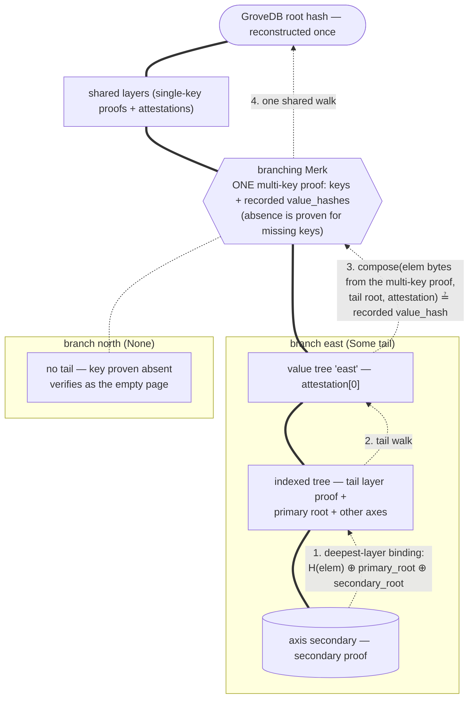

# Branched Indexed-Axis Proofs

One query over N sibling indexed trees, one envelope, one root hash.

## Motivation

A compound index lays one indexed tree per *prefix value*:

```text
…/region/         ← prefix property-name tree (a plain Merk)
    "east"/cls    ← indexed tree, own primary + per-axis secondaries
    "west"/cls    ← indexed tree, own primary + per-axis secondaries
    "north"/cls   ← indexed tree, own primary + per-axis secondaries
```

A query that pins one prefix value (`region == "east"`) reads one
indexed tree, and the single-path envelopes
(`IndexedAxisRangeProof` / `IndexedAxisPaginatedProof`) prove it. But a
query that pins *several* prefix values at once — `region IN ["east",
"west"]`, the shape Dash Platform's compound ranked indexes produce —
reads N sibling indexed trees whose paths differ at exactly one
segment: the **branching level**.

Proving each branch with its own envelope works, but it is wasteful and
awkward in a specific, structural way:

- every layer *above* the branching level — root, contract, document
  type, the prefix property-name tree — is proved N times, byte for
  byte;
- the caller receives N root hashes and must assert they are all equal
  before trusting the union;
- nothing in any single envelope says the N branches belong to one
  query against one state — that claim lives outside the proof system.

The branched envelopes move that claim *inside* the proof system.

## The shape

Two envelope types mirror the two single-path shapes:

- `IndexedAxisBranchedRangeProof` — one arbitrary secondary query (the
  same bounds and limit) executed over every branch.
- `IndexedAxisBranchedPaginatedProof` — one offset-paginated top-k walk
  (the same `k`, `offset`, direction) executed over every branch.

Both share the same layer structure:

| Field | What it carries |
|---|---|
| `shared_layer_proofs` | Single-key layer proofs for the path *prefix* (everything above the branching level), top-down — appearing **once**. |
| `shared_ancestor_attestations` | The per-layer chain-composition attestations for those shared layers. |
| `branching_layer_proof` | **One multi-key Merk proof** at the branching level, covering every branch key simultaneously — presence for branches that exist, authenticated absence for those that don't. |
| `branches` | `Vec<Option<BranchedProofBranch>>`, aligned with the caller's branch-key list. `Some` carries a branch's *tail*: its layers below the branch key, its primary-root and other-axes attestations, and its secondary proof. `None` marks an authenticated-absent branch. |
| echoes | The query parameters (`limit` / `k`, `offset`, direction), shared by every branch and re-checked by the verifier. |

## Chain of trust

Verification runs strictly upward, per branch first, then once for the
shared layers:



1. **Per branch**: the secondary proof verifies on its own and yields
   the branch's secondary root hash; the deepest tail layer binds that
   hash (and the primary root) into the indexed-tree element's recorded
   `value_hash` — the same H1-A composition every single-path envelope
   uses; the tail walk reconstructs the branch's value-tree root.
2. **The branching level**: the branch's value-tree root, composed with
   the element bytes *taken from the multi-key proof*, must equal the
   `value_hash` the multi-key proof recorded for the branch's own key.
   This is the binding step: a tail swapped between branches,
   duplicated, or grafted from another state reconstructs a different
   subtree root and fails here.
3. **Once**: the multi-key proof's own Merk root seeds a single
   ancestor walk through the shared layers to the GroveDB root hash.

The verifier takes the branch-key list from the *caller* (who derives
it from their own query), so an envelope carrying more, fewer, or
reordered branches fails structurally before any hashing happens.

## Authenticated absence

An `IN` element whose prefix subtree was never created is a legal
member of the union — it contributes the empty page, not an error. The
mechanism is the branching level's exact-key Merk proof, which
authenticates *both* outcomes: a queried key missing from the result
set is proven absent, exactly as Merk absence proofs have always
worked.

An absent branch therefore carries no tail (`None` in `branches`), and
the verifier cross-checks presence in both directions:

- an envelope claiming a **tail for an absent key** fails — the
  multi-key proof has no recorded `value_hash` to bind it to;
- an envelope claiming **absence for a present key** fails — the
  multi-key proof carries the key's element, and `None` contradicts it.

Presence is decided at the branching Merk itself. Deeper breakage under
a *present* key — a value tree that exists but is missing the expected
indexed tree below it — remains an error, because that is corrupted
state, not an empty result.

When every requested branch is absent, the shared layers are built from
the path prefix alone, so even the all-empty union chains to the root
hash.

## What the caller gets

- Range shape: `IndexedAxisBranchedQueryResult { root_hash, branches:
  Vec<AxisEntries> }` — per-branch entries aligned with the caller's
  branch keys, empty for absent branches.
- Paginated shape: `IndexedAxisBranchedPaginatedResult { root_hash,
  branches: Vec<(skipped, AxisEntries)> }` — per-branch pages with the
  same independently re-derived `skipped` semantics as the single-path
  paginated verifier; an absent branch attests a skip of zero.

Merging the branch pages into one ordered result is deliberately left
to the caller: the merged page is a deterministic function of the
verified branch pages, so no additional proof material is needed — any
entry that would precede a returned entry in the caller's merge order
is, within its own branch, preceded by fewer than `limit` entries and
therefore already in that branch's page.

## Reuse, not new machinery

No storage or hash-composition changes exist anywhere in this feature.
The prover reuses the single-path envelope builders per branch and
splits their output at the branching depth; the verifier reuses the
audited `verify_deepest_layer` and `walk_ancestor_chain` on the tail
and shared windows, plus one multi-key variant of the layer-proof
executor. The envelope types are new — per the proof system's rule that
new shapes get new envelope types — and everything else is composition.

## API

```rust,ignore
// Prove (feature = "minimal"):
db.prove_indexed_axis_query_branched(
    path_prefix, branch_keys, path_suffix,
    axis, secondary_query, limit, transaction, grove_version)
db.prove_indexed_axis_top_k_paginated_branched(
    path_prefix, branch_keys, path_suffix,
    axis, k, offset, descending, transaction, grove_version)

// Verify (verifier-only builds included):
GroveDb::verify_indexed_axis_query_branched(
    proof, path_prefix, branch_keys, path_suffix,
    axis, secondary_query, limit)
GroveDb::verify_indexed_axis_top_k_paginated_branched(
    proof, path_prefix, branch_keys, path_suffix,
    axis, k, offset, descending)
```

Branch keys must be at least two (one branch is the single-path
envelope's job) and pairwise distinct; both ends enforce this.

## Summary

- N sibling indexed trees, differing at one path segment, proved in
  **one envelope with one root hash**.
- Shared ancestor layers appear once; the branching level is one
  multi-key Merk proof; each branch carries only its tail.
- Branch tails are cryptographically bound to their branch keys — no
  swapping, duplicating, dropping, or grafting.
- Absent branches are authenticated as empty, so `IN` unions have real
  set semantics.
- Built entirely from existing, audited proof primitives.
