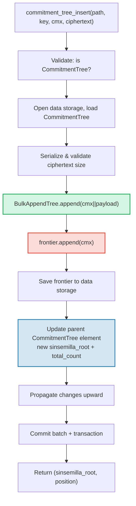

# The CommitmentTree — Sinsemilla Commitment Anchors

The **CommitmentTree** is GroveDB's bridge between authenticated storage and
zero-knowledge proof systems. It combines a **BulkAppendTree** (Chapter 14) for
efficient chunk-compacted data storage with a **Sinsemilla frontier** in the
data namespace for ZK-compatible anchors. Like MmrTree and BulkAppendTree, it
has **no child Merk** — the combined root hash flows as the Merk child hash.
Both the BulkAppendTree entries and the Sinsemilla frontier live in the **data
namespace**.

This chapter covers the Sinsemilla hash function and why it matters for
zero-knowledge circuits, the frontier data structure and its compact
serialization, the dual-namespace storage architecture, the GroveDB operations,
batch preprocessing, client-side witness generation, and how proofs work.

## Why a ZK-Friendly Tree?

GroveDB's standard trees use Blake3 hashing. Blake3 is fast in software, but
**expensive inside zero-knowledge circuits**. When a spender needs to prove
"I know a note at position P in the commitment tree" without revealing P, they
must evaluate the Merkle hash function 32 times (once per tree level) inside a
ZK circuit.

Sinsemilla (specified in ZIP-244 for the Zcash Orchard protocol) is designed
for exactly this use case — it provides **efficient in-circuit hashing** over
the Pallas elliptic curve, one half of the Pasta curve cycle used by the Halo 2
proof system.

| Property | Blake3 | Sinsemilla |
|----------|--------|------------|
| **Circuit cost** | ~25,000 constraints per hash | ~800 constraints per hash |
| **Software speed** | Very fast (~2 GB/s) | Slow (~10,000 hashes/s) |
| **Algebraic structure** | None (bitwise) | Pallas curve point operations |
| **Primary purpose** | General hashing, Merkle trees | In-circuit Merkle proofs |
| **Used by** | GroveDB Merk trees, MMR, Bulk | Orchard shielded protocol |
| **Output size** | 32 bytes | 32 bytes (Pallas field element) |

The CommitmentTree uses Sinsemilla for the Merkle tree that ZK circuits
reason about, while still using Blake3 for the GroveDB Merk hierarchy above it.
Items inserted into the tree are stored via a BulkAppendTree in the data
namespace (chunk-compacted, retrievable by position) and simultaneously appended
to the Sinsemilla frontier (producing a ZK-provable anchor).

## The Data-Namespace Architecture

The CommitmentTree stores **all data in the data namespace** at the same subtree
path. Like MmrTree and BulkAppendTree, it has **no child Merk** (no `root_key`
field — the type-specific root flows as the Merk child hash). The BulkAppendTree entries and the Sinsemilla frontier coexist
in the data namespace using distinct key prefixes:

```text
┌──────────────────────────────────────────────────────────────┐
│                       CommitmentTree                          │
│                                                               │
│  ┌─────────────────────────────────────────────────────────┐  │
│  │  Data Namespace                                         │  │
│  │                                                         │  │
│  │  BulkAppendTree storage (Chapter 14):                   │  │
│  │    Buffer entries → chunk blobs → chunk MMR             │  │
│  │    value = cmx (32 bytes) || ciphertext (216 bytes)     │  │
│  │                                                         │  │
│  │  Sinsemilla Frontier (~1KB):                            │  │
│  │    key: b"__ct_data__" (COMMITMENT_TREE_DATA_KEY)       │  │
│  │    Depth-32 incremental Merkle tree                     │  │
│  │    Stores only the rightmost path (leaf + ommers)       │  │
│  │    O(1) append, O(1) root computation                   │  │
│  │    Produces Orchard-compatible Anchor for ZK proofs     │  │
│  └─────────────────────────────────────────────────────────┘  │
│                                                               │
│  sinsemilla_root embedded in Element bytes                    │
│    → flows through Merk value_hash → GroveDB state root      │
└──────────────────────────────────────────────────────────────┘
```

**Why two structures?** The BulkAppendTree provides efficient, chunk-compacted
storage and retrieval for potentially millions of encrypted notes. The
Sinsemilla frontier provides ZK-compatible anchors that can be proved inside a
Halo 2 circuit. Both are updated in lockstep on every append.

Compare with the other non-standard tree types:

| | CommitmentTree | MmrTree | BulkAppendTree |
|---|---|---|---|
| **Child Merk** | No | No | No |
| **Data namespace** | BulkAppendTree entries + frontier | MMR nodes | Buffer + chunks + MMR |
| **Aux namespace** | — | — | — |
| **Items queryable** | Via V1 proofs | Via V1 proofs | Via V1 proofs |
| **Hash function** | Sinsemilla + Blake3 | Blake3 | Blake3 |

## The Sinsemilla Frontier

The frontier is a depth-32 incremental Merkle tree implemented by the
`incrementalmerkletree` crate's `Frontier<MerkleHashOrchard, 32>` type. Instead
of storing all 2^32 possible leaves, it stores only the information needed to
**append the next leaf and compute the current root**: the rightmost leaf and
its ommers (sibling hashes needed for root computation).

```text
                         root (level 32)
                        /               \
                      ...               ...
                     /                     \
                  (level 2)             (level 2)
                  /     \               /     \
              (level 1) (level 1)   (level 1)  ?
              /    \    /    \      /    \
             L0    L1  L2    L3   L4    ?     ← frontier stores L4
                                              + ommers at levels
                                              where left sibling exists
```

The frontier stores:
- **leaf**: the most recently appended value (a Pallas field element)
- **ommers**: the left-sibling hashes at each level where the frontier path
  goes right (at most 32 ommers for a depth-32 tree)
- **position**: the 0-indexed position of the leaf

Key properties:
- **O(1) append**: insert a new leaf, update ommers, recompute root
- **O(1) root**: traverse the stored ommers from leaf to root
- **~1KB constant size**: regardless of how many leaves have been appended
- **Deterministic**: two frontiers with the same sequence of appends produce
  the same root

The `EMPTY_SINSEMILLA_ROOT` constant is the root of an empty depth-32 tree,
precomputed as `MerkleHashOrchard::empty_root(Level::from(32)).to_bytes()`:

```text
0xae2935f1dfd8a24aed7c70df7de3a668eb7a49b1319880dde2bbd9031ae5d82f
```

## How Appending Works — The Ommer Cascade

When a new commitment is appended at position N, the number of ommers that must
be updated equals `trailing_ones(N)` — the number of trailing 1-bits in N's
binary representation. This is the same pattern as the MMR merge cascade
(§13.4), but operating on ommers rather than peaks.

**Worked example — appending 4 leaves:**

```text
Position 0 (binary: 0, trailing_ones: 0):
  frontier = { leaf: L0, ommers: [], position: 0 }
  Sinsemilla hashes: 32 (root computation) + 0 (no ommer merges) = 32

Position 1 (binary: 1, trailing_ones: 0 of PREVIOUS position 0):
  Before: position 0 has trailing_ones = 0
  frontier = { leaf: L1, ommers: [H(L0,L1) at level 1], position: 1 }
  Sinsemilla hashes: 32 + 0 = 32

Position 2 (binary: 10, trailing_ones: 0 of PREVIOUS position 1):
  Before: position 1 has trailing_ones = 1
  frontier = { leaf: L2, ommers: [level1_hash], position: 2 }
  Sinsemilla hashes: 32 + 1 = 33

Position 3 (binary: 11, trailing_ones: 0 of PREVIOUS position 2):
  Before: position 2 has trailing_ones = 0
  frontier = { leaf: L3, ommers: [level1_hash, level2_hash], position: 3 }
  Sinsemilla hashes: 32 + 0 = 32
```

The **total Sinsemilla hashes** per append is:

```text
32 (root computation always traverses all 32 levels)
+ trailing_ones(current_position)  (ommer cascade)
```

On average, `trailing_ones` is ~1 (geometric distribution), so the average
cost is **~33 Sinsemilla hashes per append**. The worst case (at position
2^32 - 1, where all bits are 1) is **64 hashes**.

## The Frontier Serialization Format

The frontier is stored in data storage at key `b"__ct_data__"`. The wire
format is:

```text
┌──────────────────────────────────────────────────────────────────┐
│ has_frontier: u8                                                  │
│   0x00 → empty tree (no more fields)                             │
│   0x01 → non-empty (fields follow)                               │
├──────────────────────────────────────────────────────────────────┤
│ position: u64 BE (8 bytes)      — 0-indexed leaf position        │
├──────────────────────────────────────────────────────────────────┤
│ leaf: [u8; 32]                  — Pallas field element bytes     │
├──────────────────────────────────────────────────────────────────┤
│ ommer_count: u8                 — number of ommers (0..=32)      │
├──────────────────────────────────────────────────────────────────┤
│ ommers: [ommer_count × 32 bytes] — Pallas field elements        │
└──────────────────────────────────────────────────────────────────┘
```

**Size analysis:**

| State | Size | Breakdown |
|-------|------|-----------|
| Empty | 1 byte | `0x00` flag only |
| 1 leaf, 0 ommers | 42 bytes | 1 + 8 + 32 + 1 |
| ~16 ommers (average) | 554 bytes | 1 + 8 + 32 + 1 + 16×32 |
| 32 ommers (maximum) | 1,066 bytes | 1 + 8 + 32 + 1 + 32×32 |

The frontier size is bounded by ~1.1KB regardless of how many millions of
commitments have been appended. This makes the load→modify→save cycle very
cheap (1 seek to read, 1 seek to write).

## Element Representation

```rust
CommitmentTree(
    u64,                  // total_count: number of appended items
    u8,                   // chunk_power: dense tree height for BulkAppendTree buffer
    Option<ElementFlags>, // flags: optional metadata
)
```

The `chunk_power` parameter controls the BulkAppendTree buffer's dense tree height;
`chunk_power` must be in the range 1..=16 (see §14.1 and §16).

**Type identifiers:**

| Identifier | Value |
|---|---|
| Element discriminant | 11 |
| `TreeType` | `CommitmentTree = 7` |
| `ElementType` | 11 |
| `COMMITMENT_TREE_COST_SIZE` | 12 bytes (8 total_count + 1 chunk_power + 1 discriminant + 2 overhead) |

The Sinsemilla root is NOT stored in the Element. It flows as the Merk child hash
through the `insert_subtree` mechanism. When the parent Merk computes its
`combined_value_hash`, the Sinsemilla-derived root is included as the child hash:

```text
combined_value_hash = blake3(value_hash || child_hash)
                                           ↑ sinsemilla/BulkAppendTree combined root
```

This means any change to the Sinsemilla frontier automatically propagates
through the GroveDB Merk hierarchy to the state root.

**Constructor methods:**

| Method | Creates |
|---|---|
| `Element::empty_commitment_tree(chunk_power)` | Empty tree, count=0, no flags |
| `Element::empty_commitment_tree_with_flags(chunk_power, flags)` | Empty tree with flags |
| `Element::new_commitment_tree(total_count, chunk_power, flags)` | All fields explicit |

## Storage Architecture

The CommitmentTree stores all its data in a single **data namespace** at the
subtree path. BulkAppendTree entries and the Sinsemilla frontier coexist in
the same column using distinct key prefixes. No aux namespace is used.

```text
┌──────────────────────────────────────────────────────────────────┐
│  Data Namespace (all CommitmentTree storage)                      │
│                                                                   │
│  BulkAppendTree storage keys (see §14.7):                         │
│    b"m" || pos (u64 BE)  → MMR node blobs                        │
│    b"b" || index (u64 BE)→ buffer entries (cmx || ciphertext)     │
│    b"e" || chunk (u64 BE)→ chunk blobs (compacted buffer)         │
│    b"M"                  → BulkAppendTree metadata                │
│                                                                   │
│  Sinsemilla frontier:                                             │
│    b"__ct_data__"        → serialized CommitmentFrontier (~1KB)   │
│                                                                   │
│  No Merk nodes — this is a non-Merk tree.                         │
│  Data authenticated via BulkAppendTree state_root (Blake3).       │
│  Sinsemilla root authenticates all cmx values via Pallas curve.   │
└──────────────────────────────────────────────────────────────────┘
```

**The load→modify→save pattern**: Every mutating operation loads the frontier
from data storage, modifies it in memory, and writes it back. Since the frontier
is at most ~1KB, this is an inexpensive pair of I/O operations (1 seek to read,
1 seek to write). Simultaneously, the BulkAppendTree is loaded, appended to,
and saved.

**Root hash propagation**: When an item is inserted, two things change:
1. The BulkAppendTree state changes (new entry in buffer or chunk compaction)
2. The Sinsemilla root changes (new commitment in the frontier)

Both are captured in the updated `CommitmentTree` element. The parent Merk node
hash becomes:

```text
combined_hash = combine_hash(
    value_hash(element_bytes),    ← includes total_count + chunk_power
    child_hash(combined_root)     ← sinsemilla/BulkAppendTree combined root
)
```

Like MmrTree and BulkAppendTree, the type-specific root flows as the Merk child
hash. All data authentication flows through this child hash binding.

**Non-Merk data storage implications**: Because the data namespace contains
BulkAppendTree keys (not Merk nodes), operations that iterate storage as
Merk elements — such as `find_subtrees`, `is_empty_tree`, and
`verify_merk_and_submerks` — must special-case CommitmentTree (and other
non-Merk tree types). The `uses_non_merk_data_storage()` helper on both
`Element` and `TreeType` identifies these tree types. Delete operations clear
the data namespace directly instead of iterating it, and verify_grovedb skips
sub-merk recursion for these types.

## GroveDB Operations

CommitmentTree provides four operations. The insert operation is generic over
`M: MemoSize` (from the `orchard` crate), which controls ciphertext payload
size validation. The default `M = DashMemo` gives a 216-byte payload
(32 epk + 104 enc + 80 out).

```rust
// Insert a commitment (typed) — returns (sinsemilla_root, position)
// M controls ciphertext size validation
db.commitment_tree_insert::<_, _, M>(path, key, cmx, ciphertext, tx, version)

// Insert a commitment (raw bytes) — validates payload.len() == ciphertext_payload_size::<DashMemo>()
db.commitment_tree_insert_raw(path, key, cmx, payload_vec, tx, version)

// Get the current Orchard Anchor
db.commitment_tree_anchor(path, key, tx, version)

// Retrieve a value by global position
db.commitment_tree_get_value(path, key, position, tx, version)

// Get the current item count
db.commitment_tree_count(path, key, tx, version)
```

The typed `commitment_tree_insert` accepts a `TransmittedNoteCiphertext<M>` and
serializes it internally. The raw `commitment_tree_insert_raw` (pub(crate))
accepts `Vec<u8>` and is used by batch preprocessing where payloads are already
serialized.

### commitment_tree_insert

The insert operation updates both the BulkAppendTree and the Sinsemilla
frontier in a single atomic operation:

```text
Step 1: Validate element at path/key is a CommitmentTree
        → extract total_count, chunk_power, flags

Step 2: Build ct_path = path ++ [key]

Step 3: Open data storage context at ct_path
        Load CommitmentTree (frontier + BulkAppendTree)
        Serialize ciphertext → validate payload size matches M
        Append cmx||ciphertext to BulkAppendTree
        Append cmx to Sinsemilla frontier → get new sinsemilla_root
        Track Blake3 + Sinsemilla hash costs

Step 4: Save updated frontier to data storage

Step 5: Open parent Merk at path
        Write updated CommitmentTree element:
          new total_count, same chunk_power, same flags
        Child hash = combined_root (sinsemilla + bulk state)

Step 6: Propagate changes from parent upward through Merk hierarchy

Step 7: Commit storage batch and local transaction
        Return (sinsemilla_root, position)
```



> **Red** = Sinsemilla operations. **Green** = BulkAppendTree operations.
> **Blue** = element update bridging both.

### commitment_tree_anchor

The anchor operation is a read-only query:

```text
Step 1: Validate element at path/key is a CommitmentTree
Step 2: Build ct_path = path ++ [key]
Step 3: Load frontier from data storage
Step 4: Return frontier.anchor() as orchard::tree::Anchor
```

The `Anchor` type is the Orchard-native representation of the Sinsemilla root,
suitable for passing directly to `orchard::builder::Builder` when constructing
spend authorization proofs.

### commitment_tree_get_value

Retrieves a stored value (cmx || payload) by its global position:

```text
Step 1: Validate element at path/key is a CommitmentTree
        → extract total_count, chunk_power
Step 2: Build ct_path = path ++ [key]
Step 3: Open data storage context, wrap in CachedBulkStore
Step 4: Load BulkAppendTree, call get_value(position)
Step 5: Return Option<Vec<u8>>
```

This follows the same pattern as `bulk_get_value` (§14.9) — the BulkAppendTree
transparently retrieves from the buffer or a compacted chunk blob depending on
where the position falls.

### commitment_tree_count

Returns the total number of items appended to the tree:

```text
Step 1: Read element at path/key
Step 2: Verify it is a CommitmentTree
Step 3: Return total_count from element fields
```

This is a simple element field read — no storage access beyond the parent Merk.

## Batch Operations

CommitmentTree supports batch inserts through the `GroveOp::CommitmentTreeInsert`
variant:

```rust
GroveOp::CommitmentTreeInsert {
    cmx: [u8; 32],      // extracted note commitment
    payload: Vec<u8>,    // serialized ciphertext (216 bytes for DashMemo)
}
```

Two constructors create this op:

```rust
// Raw constructor — caller serializes payload manually
QualifiedGroveDbOp::commitment_tree_insert_op(path, cmx, payload_vec)

// Typed constructor — serializes TransmittedNoteCiphertext<M> internally
QualifiedGroveDbOp::commitment_tree_insert_op_typed::<M>(path, cmx, &ciphertext)
```

Multiple inserts targeting the same tree are allowed in a single batch. Since
`execute_ops_on_path` doesn't have access to data storage, all CommitmentTree
ops must be preprocessed before `apply_body`.

**The preprocessing pipeline** (`preprocess_commitment_tree_ops`):

```text
Input: [CTInsert{cmx1}, Insert{...}, CTInsert{cmx2}, CTInsert{cmx3}]
                                       ↑ same (path,key) as cmx1

Step 1: Group CommitmentTreeInsert ops by (path, key)
        group_1: [cmx1, cmx2, cmx3]

Step 2: For each group:
        a. Read existing element → verify CommitmentTree, extract chunk_power
        b. Open transactional storage context at ct_path
        c. Load CommitmentTree from data storage (frontier + BulkAppendTree)
        d. For each (cmx, payload):
           - ct.append_raw(cmx, payload) — validates size, appends to both
        e. Save updated frontier to data storage

Step 3: Replace all CTInsert ops with one ReplaceNonMerkTreeRoot per group
        carrying: hash=bulk_state_root (combined root),
                  meta=NonMerkTreeMeta::CommitmentTree {
                      total_count: new_count,
                      chunk_power,
                  }

Output: [ReplaceNonMerkTreeRoot{...}, Insert{...}]
```

The first CommitmentTreeInsert op in each group is replaced by the
`ReplaceNonMerkTreeRoot`; subsequent ops for the same (path, key) are dropped.
The standard batch machinery then handles element update and root hash
propagation.

## MemoSize Generic and Ciphertext Handling

The `CommitmentTree<S, M>` struct is generic over `M: MemoSize` (from the
`orchard` crate). This controls the size of encrypted note ciphertexts stored
alongside each commitment.

```rust
pub struct CommitmentTree<S, M: MemoSize = DashMemo> {
    frontier: CommitmentFrontier,
    pub bulk_tree: BulkAppendTree<S>,
    _memo: PhantomData<M>,
}
```

The default `M = DashMemo` means existing code that doesn't care about memo
size (like `verify_grovedb`, `commitment_tree_anchor`, `commitment_tree_count`)
works without specifying `M`.

**Stored entry format**: Each entry in the BulkAppendTree is
`cmx (32 bytes) || ciphertext_payload`, where the payload layout is:

```text
epk_bytes (32) || enc_ciphertext (variable by M) || out_ciphertext (80)
```

For `DashMemo`: `32 + 104 + 80 = 216 bytes` payload, so each entry is
`32 + 216 = 248 bytes` total.

**Serialization helpers** (public free functions):

| Function | Description |
|----------|-------------|
| `ciphertext_payload_size::<M>()` | Expected payload size for a given `MemoSize` |
| `serialize_ciphertext::<M>(ct)` | Serialize `TransmittedNoteCiphertext<M>` to bytes |
| `deserialize_ciphertext::<M>(data)` | Deserialize bytes back to `TransmittedNoteCiphertext<M>` |

**Payload validation**: The `append_raw()` method validates that
`payload.len() == ciphertext_payload_size::<M>()` and returns
`CommitmentTreeError::InvalidPayloadSize` on mismatch. The typed `append()`
method serializes internally, so size is always correct by construction.

## Client-Side Witness Generation

The `grovedb-commitment-tree` crate provides a **client-side** tree for wallets
and test harnesses that need to generate Merkle witness paths for spending notes.
Enable the `client` feature to use it:

```toml
grovedb-commitment-tree = { version = "4", features = ["client"] }
```

```rust
pub struct ClientMemoryCommitmentTree {
    inner: ShardTree<MemoryShardStore<MerkleHashOrchard, u32>, 32, 4>,
}
```

The `ClientMemoryCommitmentTree` wraps `ShardTree` — a full commitment tree (not just
a frontier) that keeps complete history in memory. This allows generating
authentication paths for any marked leaf, which the frontier alone cannot do.

**API:**

| Method | Description |
|---|---|
| `new(max_checkpoints)` | Create empty tree with checkpoint retention limit |
| `append(cmx, retention)` | Append a commitment with retention policy |
| `checkpoint(id)` | Create a checkpoint at current state |
| `max_leaf_position()` | Position of most recently appended leaf |
| `witness(position, depth)` | Generate `MerklePath` for spending a note |
| `anchor()` | Current root as `orchard::tree::Anchor` |

**Retention policies** control which leaves can be witnessed later:

| Retention | Meaning |
|---|---|
| `Retention::Ephemeral` | Leaf cannot be witnessed (other people's notes) |
| `Retention::Marked` | Leaf can be witnessed (your own notes) |
| `Retention::Checkpoint { id, marking }` | Create a checkpoint, optionally mark |

**Server vs Client comparison:**

| | `CommitmentFrontier` (server) | `ClientMemoryCommitmentTree` (client) | `ClientPersistentCommitmentTree` (sqlite) |
|---|---|---|---|
| **Storage** | ~1KB frontier in data storage | Full tree in memory | Full tree in SQLite |
| **Can witness** | No | Yes (marked leaves only) | Yes (marked leaves only) |
| **Can compute anchor** | Yes | Yes | Yes |
| **Anchor matches** | Same sequence → same anchor | Same sequence → same anchor | Same sequence → same anchor |
| **Persists across restarts** | Yes (GroveDB data storage) | No (lost on drop) | Yes (SQLite database) |
| **Use case** | GroveDB server-side anchor tracking | Testing, ephemeral wallets | Production wallets |
| **Feature flag** | `server` | `client` | `sqlite` |

All three produce **identical anchors** for the same sequence of appends. This is
verified by the `test_frontier_and_client_same_root` test.

### Persistent Client — SQLite-Backed Witness Generation

The in-memory `ClientMemoryCommitmentTree` loses all state on drop. For
production wallets that must survive restarts without re-scanning the entire
blockchain, the crate provides `ClientPersistentCommitmentTree` backed by
SQLite. Enable the `sqlite` feature:

```toml
grovedb-commitment-tree = { version = "4", features = ["sqlite"] }
```

```rust
pub struct ClientPersistentCommitmentTree {
    inner: ShardTree<SqliteShardStore, 32, 4>,
}
```

**Three constructor modes:**

| Constructor | Description |
|---|---|
| `open(conn, max_checkpoints)` | Takes ownership of an existing `rusqlite::Connection` |
| `open_on_shared_connection(arc, max_checkpoints)` | Shares an `Arc<Mutex<Connection>>` with other components |
| `open_path(path, max_checkpoints)` | Convenience — opens/creates a SQLite DB at the given file path |

The bring-your-own-connection constructors (`open`, `open_on_shared_connection`)
allow the wallet to use its **existing database** for commitment tree storage.
The `SqliteShardStore` creates its tables with a `commitment_tree_` prefix, so
it coexists safely alongside other application tables.

**API** is identical to `ClientMemoryCommitmentTree`:

| Method | Description |
|---|---|
| `append(cmx, retention)` | Append a commitment with retention policy |
| `checkpoint(id)` | Create a checkpoint at current state |
| `max_leaf_position()` | Position of most recently appended leaf |
| `witness(position, depth)` | Generate `MerklePath` for spending a note |
| `anchor()` | Current root as `orchard::tree::Anchor` |

**SQLite schema** (4 tables, created automatically):

```sql
commitment_tree_shards                -- Shard data (serialized prunable trees)
commitment_tree_cap                   -- Tree cap (single-row, top of shard tree)
commitment_tree_checkpoints           -- Checkpoint metadata (position or empty)
commitment_tree_checkpoint_marks_removed  -- Marks removed per checkpoint
```

**Persistence example:**

```rust
use grovedb_commitment_tree::{ClientPersistentCommitmentTree, Retention, Position};

// First session: append notes and close
let mut tree = ClientPersistentCommitmentTree::open_path("wallet.db", 100)?;
tree.append(cmx_0, Retention::Marked)?;
tree.append(cmx_1, Retention::Ephemeral)?;
let anchor_before = tree.anchor()?;
drop(tree);

// Second session: reopen, state is preserved
let tree = ClientPersistentCommitmentTree::open_path("wallet.db", 100)?;
let anchor_after = tree.anchor()?;
assert_eq!(anchor_before, anchor_after);  // same anchor, no re-scan needed
```

**Shared connection example** (for wallets with an existing SQLite database):

```rust
use std::sync::{Arc, Mutex};
use grovedb_commitment_tree::rusqlite::Connection;

let conn = Arc::new(Mutex::new(Connection::open("wallet.db")?));
// conn is also used by other wallet components...
let mut tree = ClientPersistentCommitmentTree::open_on_shared_connection(
    conn.clone(), 100
)?;
```

The `grovedb-commitment-tree` crate re-exports `rusqlite` under the `sqlite`
feature flag, so downstream consumers do not need to add `rusqlite` as a
separate dependency.

**SqliteShardStore internals:**

The `SqliteShardStore` implements all 18 methods of the `ShardStore` trait.
Shard trees are serialized using a compact binary format:

```text
Nil:    [0x00]                                     — 1 byte
Leaf:   [0x01][hash: 32][flags: 1]                 — 34 bytes
Parent: [0x02][has_ann: 1][ann?: 32][left][right]  — recursive
```

`LocatedPrunableTree` adds an address prefix: `[level: 1][index: 8][tree_bytes]`.

The `ConnectionHolder` enum abstracts over owned vs shared connections:

```rust
enum ConnectionHolder {
    Owned(Connection),                    // exclusive access
    Shared(Arc<Mutex<Connection>>),       // shared with other components
}
```

All database operations acquire the connection through a `with_conn` helper that
transparently handles both modes, locking the mutex only when shared.

## Proof Integration

CommitmentTree supports two proof paths:

**1. Sinsemilla anchor proof (ZK path):**

```text
GroveDB root hash
  ↓ Merk proof (V0, standard)
Parent Merk node
  ↓ value_hash includes CommitmentTree element bytes
CommitmentTree element bytes
  ↓ contains sinsemilla_root field
Sinsemilla root (Orchard Anchor)
  ↓ ZK proof (Halo 2 circuit, off-chain)
Note commitment at position P
```

1. The parent Merk proof demonstrates that the `CommitmentTree` element exists
   at the claimed path/key, with specific bytes.
2. Those bytes include the `sinsemilla_root` field.
3. The client (wallet) independently constructs a Merkle witness in the
   Sinsemilla tree using `ClientMemoryCommitmentTree::witness()` (testing) or
   `ClientPersistentCommitmentTree::witness()` (production, SQLite-backed).
4. The ZK circuit verifies the witness against the anchor (sinsemilla_root).

**2. Item retrieval proof (V1 path):**

Individual items (cmx || payload) can be queried by position and proved using
V1 proofs (§9.6), the same mechanism used by standalone BulkAppendTree. The
V1 proof includes the BulkAppendTree authentication path for the requested
position, chained to the parent Merk proof for the CommitmentTree element.

## Cost Tracking

CommitmentTree introduces a dedicated cost field for Sinsemilla operations:

```rust
pub struct OperationCost {
    pub seek_count: u32,
    pub storage_cost: StorageCost,
    pub storage_loaded_bytes: u64,
    pub hash_node_calls: u32,
    pub sinsemilla_hash_calls: u32,   // ← new field for CommitmentTree
}
```

The `sinsemilla_hash_calls` field is separate from `hash_node_calls` because
Sinsemilla hashes are dramatically more expensive than Blake3 in both CPU time
and ZK circuit cost.

**Per-append cost breakdown:**

| Component | Average case | Worst case |
|---|---|---|
| Sinsemilla hashes | 33 (32 root + 1 ommer avg) | 64 (32 root + 32 ommers) |
| Frontier I/O seeks | 2 (get + put) | 2 |
| Frontier bytes loaded | 554 (~16 ommers) | 1,066 (32 ommers) |
| Frontier bytes written | 554 | 1,066 |
| BulkAppendTree hashes | ~5 Blake3 (amortized, see §14.15) | O(chunk_size) on compaction |
| BulkAppendTree I/O | 2-3 seeks (metadata + buffer) | +2 on chunk compaction |

**Cost estimation constants** (from `average_case_costs.rs` and
`worst_case_costs.rs`):

```rust
// Average case
const AVG_FRONTIER_SIZE: u32 = 554;    // ~16 ommers
const AVG_SINSEMILLA_HASHES: u32 = 33; // 32 root levels + 1 avg ommer

// Worst case
const MAX_FRONTIER_SIZE: u32 = 1066;   // 32 ommers (max depth)
const MAX_SINSEMILLA_HASHES: u32 = 64; // 32 root levels + 32 ommers
```

The BulkAppendTree component cost is tracked alongside the Sinsemilla cost,
combining both Blake3 hashes (from BulkAppendTree buffer/chunk operations) and
Sinsemilla hashes (from frontier append) into a single `OperationCost`.

## The Orchard Key Hierarchy and Re-exports

The `grovedb-commitment-tree` crate re-exports the full Orchard API needed to
construct and verify shielded transactions. This allows Platform code to import
everything from a single crate.

**Key management types:**

```text
SpendingKey
  ├── SpendAuthorizingKey → SpendValidatingKey
  └── FullViewingKey
        ├── IncomingViewingKey (decrypt received notes)
        ├── OutgoingViewingKey (decrypt sent notes)
        └── Address (= PaymentAddress, derive recipient addresses)
```

**Note types:**

| Type | Purpose |
|---|---|
| `Note` | Full note with value, recipient, randomness |
| `ExtractedNoteCommitment` | The `cmx` extracted from a note (32 bytes) |
| `Nullifier` | Unique tag that marks a note as spent |
| `Rho` | Nullifier derivation input (links spend to prior note) |
| `NoteValue` | 64-bit note value |
| `ValueCommitment` | Pedersen commitment to a note value |

**Proof and bundle types:**

| Type | Purpose |
|---|---|
| `ProvingKey` | Halo 2 proving key for Orchard circuits |
| `VerifyingKey` | Halo 2 verifying key for Orchard circuits |
| `BatchValidator` | Batch verification of multiple Orchard bundles |
| `Bundle<T, V>` | Collection of Actions forming a shielded transfer |
| `Action` | Single spend/output pair within a bundle |
| `Authorized` | Bundle authorization state (signatures + ZK proof) |
| `Flags` | Bundle flags (spends enabled, outputs enabled) |
| `Proof` | The Halo 2 proof within an authorized bundle |

**Builder types:**

| Type | Purpose |
|---|---|
| `Builder` | Constructs an Orchard bundle from spends and outputs |
| `BundleType` | Configures padding strategy for the bundle |

**Tree types:**

| Type | Purpose |
|---|---|
| `Anchor` | Sinsemilla root as an Orchard-native type |
| `MerkleHashOrchard` | Sinsemilla hash node in the commitment tree |
| `MerklePath` | 32-level authentication path for witness generation |

## Implementation Files

| File | Purpose |
|------|---------|
| `grovedb-commitment-tree/src/lib.rs` | `CommitmentFrontier` struct, serialization, `EMPTY_SINSEMILLA_ROOT`, re-exports |
| `grovedb-commitment-tree/src/commitment_tree/mod.rs` | `CommitmentTree<S, M>` struct, typed/raw append, ciphertext ser/de helpers |
| `grovedb-commitment-tree/src/commitment_frontier/mod.rs` | `CommitmentFrontier` (Sinsemilla frontier wrapping `Frontier`) |
| `grovedb-commitment-tree/src/error.rs` | `CommitmentTreeError` (including `InvalidPayloadSize`) |
| `grovedb-commitment-tree/src/client/mod.rs` | `ClientMemoryCommitmentTree`, in-memory witness generation |
| `grovedb-commitment-tree/src/client/sqlite_store.rs` | `SqliteShardStore`, `ShardStore` impl over SQLite, tree serialization |
| `grovedb-commitment-tree/src/client/client_persistent_commitment_tree.rs` | `ClientPersistentCommitmentTree`, SQLite-backed witness generation |
| `grovedb-commitment-tree/Cargo.toml` | Feature flags: `server`, `client`, `sqlite` |
| `grovedb-element/src/element/mod.rs` | `Element::CommitmentTree` variant (3 fields: `u64, u8, Option<ElementFlags>`) |
| `grovedb-element/src/element/constructor.rs` | `empty_commitment_tree(chunk_power)`, `new_commitment_tree_with_all()` |
| `grovedb-element/src/element/helpers.rs` | `uses_non_merk_data_storage()` helper |
| `merk/src/tree_type/costs.rs` | `COMMITMENT_TREE_COST_SIZE = 12` |
| `merk/src/tree_type/mod.rs` | `TreeType::CommitmentTree = 7`, `uses_non_merk_data_storage()` |
| `grovedb/src/operations/commitment_tree.rs` | GroveDB operations: typed insert, raw insert, anchor, get_value, count, batch preprocessing |
| `grovedb/src/operations/delete/mod.rs` | Non-Merk tree type delete handling |
| `grovedb/src/batch/mod.rs` | `GroveOp::CommitmentTreeInsert`, `commitment_tree_insert_op_typed` constructor |
| `grovedb/src/batch/estimated_costs/average_case_costs.rs` | Average case cost model |
| `grovedb/src/batch/estimated_costs/worst_case_costs.rs` | Worst case cost model |
| `grovedb/src/tests/commitment_tree_tests.rs` | 32 integration tests |

## Comparison with Other Tree Types

| | CommitmentTree | MmrTree | BulkAppendTree | DenseTree |
|---|---|---|---|---|
| **Element discriminant** | 11 | 12 | 13 | 14 |
| **TreeType** | 7 | 8 | 9 | 10 |
| **Has child Merk** | No | No | No | No |
| **Data namespace** | BulkAppendTree entries + Sinsemilla frontier | MMR nodes | Buffer + chunks + MMR | Values by position |
| **Hash function** | Sinsemilla + Blake3 | Blake3 | Blake3 | Blake3 |
| **Proof type** | V1 (Bulk) + ZK (Sinsemilla) | V1 (MMR proof) | V1 (Bulk proof) | V1 (DenseTree proof) |
| **Hashes per append** | ~33 Sinsemilla + ~5 Blake3 | ~2 Blake3 | ~5 Blake3 (amortized) | O(n) Blake3 |
| **Cost size** | 12 bytes | 11 bytes | 12 bytes | 6 bytes |
| **Capacity** | Unlimited | Unlimited | Unlimited | Fixed (2^h - 1) |
| **ZK-friendly** | Yes (Halo 2) | No | No | No |
| **Chunk compaction** | Yes (configurable chunk_power) | No | Yes | No |
| **Use case** | Shielded note commitments | Event/transaction logs | High-throughput bulk logs | Small bounded structures |

Choose CommitmentTree when you need ZK-provable anchors for shielded protocols
with efficient chunk-compacted storage. Choose MmrTree when you need a simple
append-only log with individual leaf proofs. Choose BulkAppendTree when you
need high-throughput range queries with chunk-based snapshots. Choose
DenseAppendOnlyFixedSizeTree when you need a compact, fixed-capacity structure
where every position stores a value and the root hash is always recomputed on
the fly.

---

