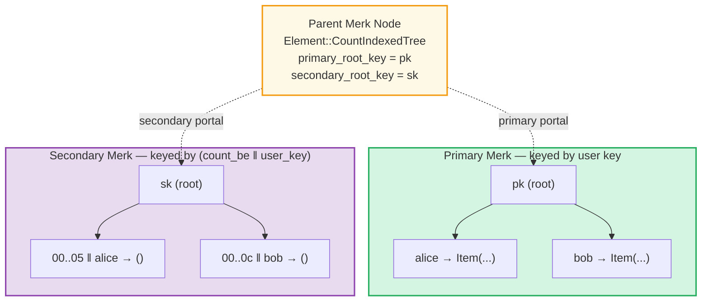
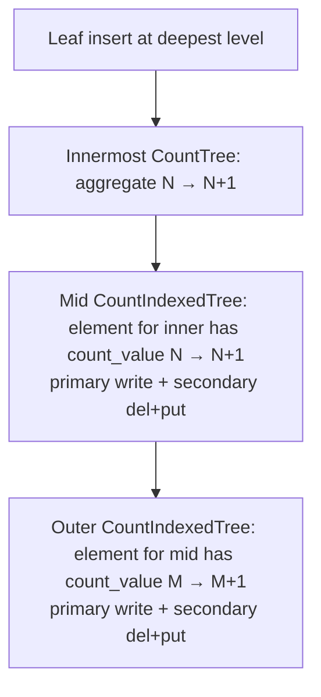
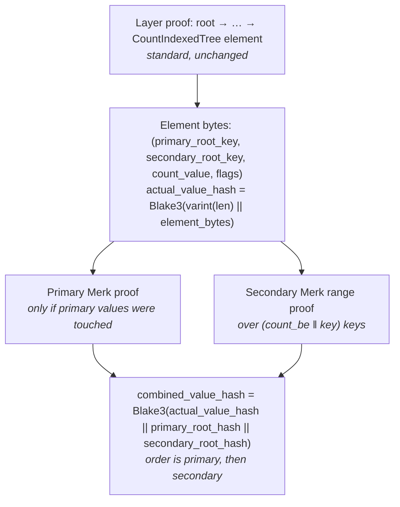

# The CountIndexedTree

> **Status:** implemented. All protocol-observable design points
> (element layout, hash composition, storage prefix derivation, query
> semantics, subquery handling) are finalized below. Two implementation-
> detail items (C1, W1) carry recommended defaults that may be revisited
> in follow-up work.

## Motivation

`CountTree` and `ProvableCountTree` both store a per-element **count value**
(`u64`) and aggregate the sum of those values up the tree. The aggregate is
useful for "how many?" questions, but the underlying Merk is keyed by the
user's key, not by the count. So a question like

> "Give me the ten elements with the highest count, with a proof"

requires scanning every element under the tree — `O(n)` work and an `O(n)`
proof — even though the answer is a tiny prefix of a count-sorted view.

A **CountIndexedTree** makes count-ordered access a first-class operation by
maintaining a **secondary, count-keyed** Merk alongside the primary
key-ordered Merk. Top-k-by-count becomes `O(log n + k)` with a standard Merk
range proof.

Two new element types are introduced:

| Element | Aggregation flavor |
|---|---|
| `CountIndexedTree` | Count aggregated through `CountedMerkNode` (count not in node hash) |
| `ProvableCountIndexedTree` | Count aggregated through `ProvableCountedMerkNode` (count baked into node hash) |

These mirror the existing pair `CountTree` / `ProvableCountTree` exactly —
the only addition is the secondary index. Existing `CountTree` /
`ProvableCountTree` behavior is unchanged.

Both element types ship together. They share virtually all
infrastructure — the only divergence is which feature type their primary
Merk nodes use (`CountedMerkNode` vs `ProvableCountedMerkNode`) and the
matching `node_hash` vs `node_hash_with_count` choice. No new grove
version is needed: GroveDB has not yet shipped, so this lands as part of
the current in-development version alongside the existing element types.

## What the index orders

The secondary index orders elements by their `count_value` field — the
same field used for `CountedMerkNode` / `ProvableCountedMerkNode`
aggregation in the primary Merk.

`count_value` carries different meanings depending on what's stored:

| Element being indexed | What `count_value` is |
|---|---|
| Leaf `Item` in a count-aware Merk | A per-element value (default 1 for plain inserts) |
| `Tree`, `CountTree`, `SumTree`, … (any subtree element) | The **aggregated descendant count** of that child subtree, propagated upward |
| `CountIndexedTree`, `ProvableCountIndexedTree` | The aggregated descendant count of the child's primary Merk |

The index does not distinguish these cases. It indexes whatever
`count_value` is, and it stays in sync with `count_value` because **every
write that mutates `count_value` also mutates the secondary entry for
that key**. This includes the case where `count_value` changes because
something *deeper in the grove* was updated — the existing GroveDB
aggregation propagation already rewrites the element at each ancestor
level for exactly that reason, and the CountIndexedTree handler just
observes that rewrite and emits the corresponding secondary del+put
alongside it.

So a `CountIndexedTree` whose children are themselves `CountTree` (or
any count-aggregating subtree) **does** support "which sub-bucket has
the most stuff?" queries, with the index always reflecting current
state. The cost of this is described in
[Cascading aggregation update](#cascading-aggregation-update) below.

## Element layout

```rust
// Conceptual; final field order follows existing convention.
Element::CountIndexedTree(
    primary_root_key:   Option<Vec<u8>>,
    secondary_root_key: Option<Vec<u8>>,
    count_value:        u64,                  // aggregated, like CountTree
    flags:              Option<ElementFlags>,
)

Element::ProvableCountIndexedTree(
    primary_root_key:   Option<Vec<u8>>,
    secondary_root_key: Option<Vec<u8>>,
    count_value:        u64,                  // aggregated, baked into node hash
    flags:              Option<ElementFlags>,
)
```

Discriminants are appended to the existing element-type list (next free
slots; see Appendix A). The `count_value` field has the same semantics as
in `CountTree` / `ProvableCountTree`: it is the aggregate count for this
subtree, used by the parent Merk's aggregation.

## Two Merks, one element

A CountIndexedTree element points at **two** physical Merk trees living at
**two** distinct storage prefixes:



> **Each Merk is unmodified.** They use the existing tree machinery, the
> existing aggregation, the existing proof system. The secondary index is a
> *use* of Merk, not an extension to it.

### Primary Merk

The primary Merk is exactly what a `CountTree` / `ProvableCountTree`
contains today. Its node feature type is:

| Element | Primary node feature type |
|---|---|
| `CountIndexedTree` | `CountedMerkNode(count_value)` |
| `ProvableCountIndexedTree` | `ProvableCountedMerkNode(count_value)` |

User reads-by-key are served entirely by the primary Merk. They are
indistinguishable in cost and proof shape from a query against a
`CountTree` / `ProvableCountTree` of the same size.

### Secondary Merk

The secondary Merk holds one entry per element in the primary, keyed by:

```text
secondary_key = count_be_bytes(8) ‖ original_key
secondary_val = ()        // empty; the original_key is encoded in the key
```

- **`count_be_bytes`** is the element's `count_value` encoded big-endian, 8
  bytes. Big-endian gives natural numeric order under lexicographic
  comparison, so right-to-left iteration yields highest-count-first.
- **`original_key`** is appended to break ties among elements with equal
  counts and to make each secondary key unique and reversible.

The secondary Merk uses node feature type `ProvableCountedMerkNode(1)` —
every entry contributes a count of `1`, so the aggregated count at the
secondary's root equals the total number of indexed entries (which also
equals the number of entries in the primary).

The reason the secondary is a *provable* count tree (rather than the
simpler `BasicMerkNode`) is that this lets the existing
`AggregateCountOnRange` infrastructure (see chapter "Aggregate Count
Queries") be applied **directly to the secondary**:

> "How many entries have `count_value` in `[a, b]`?"

is answered in `O(log n)` via a single `AggregateCountOnRange` proof
against the secondary, with no need to enumerate matching keys. The
trivial query "how many entries does this CountIndexedTree contain?"
collapses to a single hash-bound read of the secondary's root node.

The cost is one extra Blake3 invocation per secondary node (the
`node_hash_with_count` baking) — the same overhead `ProvableCountTree`
already pays today, applied to the secondary's keyspace.

## Storage prefix derivation

A regular subtree is addressed by a single 32-byte `SubtreePrefix` derived
from the path:

```text
prefix(path) = Blake3(path_body)
where path_body = concat(reversed_segments)
                  ‖ segment_count_native_endian
                  ‖ length_byte_per_segment
```

A CountIndexedTree needs two prefixes. The **primary** prefix is exactly
what a regular `Tree` at the same path would use — unchanged from the
current derivation. The **secondary** prefix is derived from the primary:

```text
primary_prefix(path)   = Blake3(path_body)
secondary_prefix(path, axis) = Blake3(primary_prefix ‖ axis_tag)
// axis_tag: 0x00 = count, 0x01 = sum, 0x02 = avg
```

This has three useful properties:

- **Primary parity with `Tree`.** A CountIndexedTree's primary Merk lives
  at exactly the prefix a `Tree` would have at the same path, so the
  storage layer's layout for the primary is indistinguishable from a
  normal subtree.
- **Domain-separated secondary.** The secondary prefix is a Blake3 of a
  fixed-length 33-byte input that no path-derived prefix can produce
  (path-derived prefixes hash a variable-length `path_body` that always
  ends with per-segment length bytes, never with a single trailing
  one-byte axis tag after a 32-byte prefix block). Collision resistance still
  rests on Blake3's preimage / 2nd-preimage assumptions, like every
  other prefix in the database.
- **Empty-path safety.** A root-level CountIndexedTree (unusual but
  legal) has `primary_prefix = 0x00..00` and
  `secondary_prefix = Blake3(0x00..00 ‖ axis_tag)`. Both well-defined.

The implication for the storage layer: when the engine encounters a
`CountIndexedTree` element while resolving a path, it materializes two
storage contexts (one per prefix), not one. Everything downstream
(iterators, batch ops, transactions) operates on each context
independently and unchanged.

## Hash composition

The element's serialized bytes — which are what the parent Merk hashes —
include **both root keys** and the element's `count_value` and flags,
just like any other element. The parent's KV-hash also has to incorporate
each child Merk's root hash. Today `Tree`, `SumTree`, … do this through a
single supplied child hash combined into the value hash:

```text
// Today, for Tree (one child):
combined_value_hash = combine_hash(actual_value_hash, child_root_hash)
                    = Blake3(actual_value_hash || child_root_hash)
```

For `CountIndexedTree` / `ProvableCountIndexedTree` there are two child
Merks, so the combine step takes two supplied hashes instead of one and
concatenates them in the same slot:

```text
// CountIndexedTree (two children):
combined_value_hash = combine_hash_three(
                          actual_value_hash,
                          primary_root_hash,
                          secondary_root_hash,
                      )
                    = Blake3(actual_value_hash
                          || primary_root_hash
                          || secondary_root_hash)
```

- **Order is `primary || secondary`**, and is normative.
- **No domain separator.** Element-type differentiation comes from the
  discriminant byte in the serialized element bytes (which feeds into
  `actual_value_hash`), exactly as it does for every other element type
  today. Adding a separator just here would be an inconsistency.
- **Empty children** plug `NULL_HASH` into their slot, the same way an
  empty `Tree`'s child hash is `NULL_HASH` today.
- **No new Merk feature type** is required. The change is localized to
  the helper that builds `combined_value_hash` for these two element
  types and to the corresponding verifier path.

A proof that touches only one of the two Merks must therefore carry the
*other* tree's root hash so the verifier can reconstruct
`combined_value_hash`. This is one extra 32-byte hash per query,
regardless of result size.

## Write semantics

Every user-visible write produces operations on **both** Merks atomically.
The existing GroveDB batch infrastructure already gives cross-subtree
atomicity, so the new ops compose with batches just like any other
`GroveDbOp`.

### Insert `(k, v, count = c)`

1. Primary: `put(k, serialize(v))` with feature type `CountedMerkNode(c)`
   (or `ProvableCountedMerkNode(c)`).
2. Secondary: `put(c_be ‖ k, ())` with feature type
   `ProvableCountedMerkNode(1)`.
3. Both ops emitted in the same batch; both root hashes change; the
   parent's `combined_value_hash` is recomputed once from the new
   `(actual_value_hash, primary_root_hash, secondary_root_hash)` triple.

### Update count `(k: c_old → c_new)`

1. Primary: `put(k, ...)` with new feature type carrying `c_new`.
2. Secondary: `del(c_old_be ‖ k)`, then `put(c_new_be ‖ k, ())`.
3. Single batch; single propagation up.

The caller must know `c_old` to emit the deletion. The engine reads the
old count from the primary (one extra Merk read per update) — analogous to
how a delete in any subtree reads the existing element.

### Delete `(k)`

1. Read the element from primary to discover `c_old`.
2. Primary: `del(k)`.
3. Secondary: `del(c_old_be ‖ k)`.
4. Single batch.

### Cascading aggregation update

When a write changes `count_value` on an element via GroveDB's existing
aggregation propagation — i.e. someone wrote into a deeper subtree and
the aggregate count of an ancestor subtree changed — the
CountIndexedTree handler at that ancestor level treats it as a
count-update and emits `del(old_count_be ‖ key) + put(new_count_be ‖ key)`
on its secondary, in the **same batch** as the primary rewrite that
aggregation already produces.



> Each layer that is a `CountIndexedTree` (or `ProvableCountIndexedTree`)
> emits one secondary del+put. Layers that are plain `CountTree` or
> `ProvableCountTree` only do the primary rewrite that aggregation
> already requires.

### Write amplification

Let `d` = number of GroveDB levels traversed by aggregation propagation
(i.e. nesting depth above the leaf), and `k` = number of those levels
that are `CountIndexedTree` / `ProvableCountIndexedTree`. Per
**single-leaf write** the cost is:

| Operation | Primary work (already paid by aggregation) | Extra secondary work | Total extra vs plain CountTree stack |
|---|---|---|---|
| Insert | `(d+1) · O(log n)` | `(k+1) · O(log n)` | one secondary write per CountIndexedTree level + one for the leaf's own level |
| Update count | `(d+1) · O(log n)` | `(k+1) · O(log n)` (del+put per affected level) | same |
| Update non-count | `O(log n)` | `0` | none |
| Delete | `(d+1) · O(log n)` | `(k+1) · O(log n)` | one secondary delete per CountIndexedTree level |

The takeaway: **each `CountIndexedTree` level on the path from leaf to
root adds one secondary del+put per leaf write**. There is no quadratic
or `n`-dependent term — it is linear in `k`, the number of indexed
levels you opted into.

For typical layouts (`d = 3..6`, `k = 1..3`) this is well within budget.
The user controls `k` directly: pick `CountIndexedTree` at the levels
where you actually want count-ordered queries, and plain `CountTree` at
intermediate levels where you don't.

## Batch path semantics

The level-by-level batch path (`apply_batch`, `apply_partial_batch`)
supports cidx primary mutations end-to-end. The bubble-up emits a
new internal op variant `GroveOp::ReplaceAggregateIndexedTreeRootKeys`
carrying both the primary's and secondary's new state, which the
parent merk handler consumes via H1-A
(`combine_hash_three`).

### Supported batch operations on cidx

| Op shape | Behaviour |
|---|---|
| `Insert` / `InsertOrReplace` / `Replace` / `Patch` of a leaf (`Item`, `SumItem`, `Reference`, …) at a path **inside** a cidx primary | Mirrors the count delta to the secondary inline, bubbles up via the new op so the cidx element on the parent merk recomputes its `value_hash` via H1-A. |
| `Delete` of a leaf inside a cidx primary | Same — the count goes to `None`, secondary entry is removed. |
| Deep `Insert` / `Delete` under a sub-tree of a cidx primary (e.g. `cidx / sub_count_tree / item`) | The cidx primary's bubble-up sees the sub-tree's new aggregate count as a `ReplaceTreeRootKey`, mirrors the count change to the secondary via the same pre/post-state capture as direct mutations. |
| `DeleteTree` of a cidx element (any `SubelementsDeletionBehavior`) | Cleans up **both** the primary's recursive subtree storage and every per-axis secondary storage namespace at `Blake3(primary_prefix ‖ axis_tag)`. The cleanup runs unconditionally (including for `DontCheckWithNoCleanup`) because the secondary lives in a different namespace not visible to `find_subtrees`. |

### Rejected batch operations on cidx

| Op shape | Reason |
|---|---|
| `InsertOrReplace` / `Replace` / `Patch` overwriting an existing cidx element with anything | Storage-pointer semantics are ambiguous: post-apply cleanup of the old cidx's prefixes shares the prefix space with where a new non-empty cidx would point. Use the [overwrite workaround](#cidx-overwrite-workaround) below. |

### Cidx overwrite workaround

To replace an existing cidx with a new state (or with a different
element type entirely):

1. **Batch 1:** `DeleteTree` the existing cidx. Both primary and
   secondary storage are cleared cleanly.
2. **Batch 2:** `InsertOrReplace` an empty cidx (or other element)
   at the same path.
3. **Batch 3:** populate the new cidx via batch ops on its primary,
   or via the dedicated `insert_into_count_indexed_tree` API.

This must be three batches because deeper-path ops execute before
shallower-path ops bubble up — a cidx creation and ops *inside* the
cidx primary can't share a single batch.

### Direct (non-batch) APIs

For single-cidx workflows the dedicated APIs are usually more
ergonomic and avoid the multi-batch dance:

```rust
// Insert / update / delete one item:
db.insert_into_count_indexed_tree(path, key, element, tx, grove_version)?;
db.delete_from_count_indexed_tree(path, key, tx, grove_version)?;

// Direct creation of an empty cidx + populate via direct insert:
db.insert(parent_path, cidx_key, Element::empty_provable_count_indexed_tree(), ..., tx, gv)?;
db.insert_into_count_indexed_tree(cidx_path, item_key, item_element, tx, gv)?;
```

`db.delete()` on a cidx element cleans up both namespaces (same
mechanism the batch path uses).

## Read semantics

### Lookup by user key

Identical to `CountTree` / `ProvableCountTree`: traverse the parent Merk
to the element, open the **primary** Merk, query as usual. The secondary
Merk is not touched. The verifier receives the primary's root hash plus a
*single* extra 32-byte secondary root hash (so it can reconstruct
`combined_value_hash`).

### Top-k by count

```rust
// Shipped API on `GroveDb`:
let entries: Vec<(u64, Vec<u8>)> = db
    .indexed_count_top_k(path, k, /* descending: */ true, transaction, grove_version)?
    .expect("top-k");

// Verifiable variant — proof + verification:
let proof_bytes = db
    .prove_indexed_count_top_k(path, k, /* descending: */ true, transaction, grove_version)?
    .expect("prove");
let result = GroveDb::verify_indexed_count_top_k(&proof_bytes, &path, k)?;
// result.entries: Vec<(u64, Vec<u8>)>, result.root_hash: [u8; 32]
```

The query returns `(count, key)` pairs. To resolve a primary value the
caller follows up with `db.get(path, key, ...)`; the dedicated proof
shape carries only the secondary range proof + a 32-byte attestation
of the primary's root hash. Workloads that don't need values
(leaderboards, ranking views) pay nothing for data they wouldn't read.

Internally:

1. Resolve path through parent Merks down to the `CountIndexedTree`
   element. Standard layer proofs.
2. Open the **secondary** Merk.
3. Run a **descending range query** with `limit = k` over the full
   secondary keyspace. This yields the k highest-count entries, with a
   standard Merk range proof.
4. *(only if `resolve_values: true`)* For each `(c_be ‖ k)` in the
   result, open the **primary** Merk and query for `k`. Each resolution
   is one extra Merk read with one extra Merk inclusion proof.

The default keeps the proof minimal: secondary range proof + a 32-byte
attestation of the primary's root hash. Workloads that don't need the
values (leaderboards, ranking views, "top N usernames") pay nothing for
data they wouldn't read.

### Range by count

```rust
let entries: Vec<(u64, Vec<u8>)> = db
    .indexed_count_range(
        path,
        min,                       // u64, inclusive
        max,                       // u64, inclusive
        /* descending: */ false,
        /* limit:      */ 100,
        transaction,
        grove_version,
    )?
    .expect("count range");
```

Internally builds a bounded `Query::insert_range(lo_be..upper)` against
the secondary (with `RangeFrom` for `max == u64::MAX`), so iteration
seeks directly to the encoded count bounds — no full secondary scan.

### Arbitrary count-indexed query

For predicates beyond top-k / count-range — e.g. "exact count = X",
"count >= X", multiple disjoint count windows — pass an arbitrary
`MerkQuery` over the secondary's keyspace (keys are
`count_value_be ‖ original_key`):

```rust
let mut q = MerkQuery::new();
q.insert_range(3u64.to_be_bytes().to_vec()..6u64.to_be_bytes().to_vec());
q.left_to_right = true;

let proof_bytes = db
    .prove_indexed_count_query(path, q.clone(), Some(limit), tx, grove_version)?
    .expect("prove");

// Verify with the SAME query (positional binding):
let result = GroveDb::verify_indexed_count_query(&proof_bytes, &path, q)?;
```

`prove_indexed_count_top_k` is just a thin wrapper around
`prove_indexed_count_query` with a full-range query and the requested
`descending` flag.

### How many entries have count in `[a, b]`?

Because the secondary is a `ProvableCountTree`, this is answered in
`O(log n + k)` via the existing range query against the secondary,
using the same `prove_indexed_count_query` /
`verify_indexed_count_query` shape as count-range reads — the
returned entry list's length is the count, and the proof binds it to
the GroveDB root hash. No per-entry enumeration is needed beyond
what the secondary Merk's range proof already encodes.

```rust
let mut q = MerkQuery::new();
q.insert_range(a.to_be_bytes().to_vec()..=b.to_be_bytes().to_vec());

let proof = db.prove_indexed_count_query(path, q.clone(), None, tx, grove_version)?;
let result = GroveDb::verify_indexed_count_query(&proof, &path, q)?;

let count = result.entries.len();
let root_hash = result.root_hash;
```

The verifier returns the matched entries (size = count) and the
GroveDB root hash. The trivial "total entries" query (`a = 0`,
`b = u64::MAX`) is also answered in `O(1)` via the parent's
`Element::CountIndexedTree` `count_value` field, which already commits
the size.

### Direction

The indexed read APIs support both ascending and descending iteration
through `left_to_right: bool`, mirroring the existing `Query` API. The
common case for top-k is `left_to_right: false` (highest counts first),
which is what `indexed_count_top_k(path, k, descending = true, ..)` produces.
Ascending traversal is also supported for "smallest counts first" /
"items with the lowest counts in [a, b]" patterns.

### Lookup of count for a key

`indexed_count_range_aggregate(path, lo, hi, ..)` returns the count without returning the
value. It can be answered by reading the primary node's feature type
(which carries `count_value`). No secondary lookup needed; one Merk read.

### Subqueries

Two routes are available depending on what you need:

**1. Generic V1 PathQuery → cidx subquery into the primary.** When you
build a standard `PathQuery` whose path or subquery descends into a
cidx element, the V1 proof system handles it: the proof carries a
fresh `ProofBytes::CountIndexedTree(secondary_root_hash ‖ primary_proof)`
variant, the verifier chains via `combine_hash_three` at that layer
instead of the standard `combine_hash`, and the subquery runs against
the cidx **primary** the same way it would against any other
count-bearing tree. The secondary is not visible to subqueries —
secondary keys are `(count_be ‖ key)`, an internal index. Use this
route when the cidx is just one of several layers in a larger query
shape and you don't need count-ordered output.

**2. Dedicated `prove_indexed_count_query` → arbitrary `MerkQuery`
over the secondary keyspace.** Use this when you do want
count-ordered output (top-k, count ranges, count-equality predicates).
Subquery composition with the dedicated proof shape is not exposed —
if you need a hybrid, compose the dedicated proof with a follow-up
`PathQuery`.

```rust
// Inside a PathQuery — any standard subquery shape works:
let mut path_query = PathQuery::new(parent_path, ...);
path_query.query.query.set_subquery(/* arbitrary inner query */);
let proof = db.prove_query(&path_query, opts, grove_version)?;
let (root_hash, results) = GroveDb::verify_query(&proof, &path_query, grove_version)?;
```

V0 generic prove/verify do **not** support cidx descent — V0 is a
frozen wire format. Callers on V0 paths must use the dedicated
`prove_indexed_count_top_k` / `prove_indexed_count_query` entry
points.

### Proof shape

A composite proof for a count-indexed query is structured exactly like
existing GroveDB layer proofs, with these additions:



Verifier obligations:

- Parent layer verifies the element bytes (carrying both root keys) up to
  the GroveDB root.
- Each Merk proof produces its own root hash (`primary_root_hash` and/or
  `secondary_root_hash`).
- The verifier reconstructs `combined_value_hash` from
  `actual_value_hash`, `primary_root_hash`, `secondary_root_hash` (in
  that order) and checks it matches the value hash committed in the
  parent layer.

Both root hashes must be made available to the verifier — when a query
touches only one of the two trees, the proof carries the *other* tree's
root hash as a 32-byte attestation (it is hashed but not traversed).

## When to use which element type

- **`CountTree`** — aggregate counts only; never need ordered access.
  Same cost as today.
- **`ProvableCountTree`** — same, but you also need the aggregate count
  bound into the proof.
- **`CountIndexedTree`** — you frequently ask "top-k by count" or
  "elements with count in `[a, b]`" and want sub-linear queries with
  proofs. Includes the case "which child subtree has the largest
  aggregated count?" — the cascading aggregation update keeps the
  index in sync automatically.
- **`ProvableCountIndexedTree`** — same, and the per-element count is
  itself a security-critical quantity (e.g. a stake weight, vote
  weight, fee priority) so it should be hashed into the primary Merk's
  nodes rather than just stored beside them.

The `Provable` flavor pays a small per-node hash cost for the count
binding; the non-provable flavor does not. Pick `Provable` when the
count is part of the protocol invariant; pick non-provable when the
count is metadata.

**Mixing levels.** Use `CountIndexedTree` at the levels where you
actually issue ordered queries; use plain `CountTree` at intermediate
levels where you only need aggregation. Each `CountIndexedTree` on the
path from a leaf to the root adds one secondary del+put per leaf write
(see [Write amplification](#write-amplification)).

## Interaction with `Element::NonCounted`

A `NonCounted` wrapper opts the wrapped element out of its parent's
count aggregation — its stored aggregate is `0`, and the parent reads
`count_value = 0` for that element. CountIndexedTree honors this
faithfully: a `NonCounted` child appears in the secondary at
`(0x00..00 ‖ key)` (the bottom of the count ordering) and contributes
`+1` to the secondary's aggregate (which is "number of indexed
entries", not "sum of counts").

NonCounted entries are **not excluded** from the secondary index —
sparse indexing is a non-goal. They are simply at the bottom of the
ordering. Top-k descending iteration encounters them last.

## Limitations and non-goals

- **State sync does not support indexed trees.** A database containing
  any indexed tree cannot be snapshot-synced: the restorer binds a
  restored subtree to its parent with the two-input `combine_hash`,
  which can never reproduce an indexed element's three-input binding,
  and subtree discovery never enumerates the derived per-axis secondary
  namespaces. Both the source (`fetch_chunk`) and target (subtree
  discovery) sides reject with `Error::NotSupported` before any chunk is
  produced or committed, so the failure is loud and early rather than a
  half-restored database — but note the rejection is **database-wide**:
  one indexed tree anywhere disables snapshot sync for the whole grove.
- **Generic writes into an indexed primary are rejected.** `db.insert`,
  `db.delete` and `clear_subtree` targeting an indexed primary return
  `Error::NotSupported`, because none of them can mirror the change into
  the secondary index. Use the dedicated `insert_into_*` /
  `delete_from_*` APIs, or a batch, which maintains the mirror itself.
  Writing *below* a child of an indexed primary is unaffected.
- **The axes schema is fixed at creation.** Adding or removing an axis
  on a populated indexed tree is rejected: there is no reindex path, and
  a new axis would index none of the existing rows.
- **No cross-tree count ordering.** A query orders elements *within*
  one indexed tree. To rank items across multiple sibling trees,
  the application must compose results manually.
- **No floating-point or signed counts.** `count_value` is `u64`.
  Big-endian encoding gives correct order only for unsigned magnitudes.
  Indexing signed quantities would require an offset-bias encoding and
  is out of scope.
- **Index reflects committed state only.** The secondary mirrors the
  primary atomically per batch; readers in transactions see consistent
  views. There is no "pending" or "snapshot" index lag.
- **No partial indexing.** Every primary entry has a corresponding
  secondary entry. Conditional or sparse indexing is not part of this
  feature.
- **Write cost scales with the number of `CountIndexedTree` levels on
  the path.** This is by design: each indexed level adds one secondary
  del+put per leaf write. If you cannot afford this at a given level,
  use plain `CountTree` there instead.
- **No in-place migration from `CountTree` / `ProvableCountTree`.** A
  `CountIndexedTree` element is created as such from the start; an
  existing non-indexed count tree cannot be promoted in place. To
  migrate, the application rebuilds the tree as a `CountIndexedTree`
  via standard batch operations.
- **No batch overwrite of an existing cidx element.** Storage-pointer
  semantics are ambiguous when the new element claims root keys that
  may or may not refer to the existing on-disk data. Use the
  [overwrite workaround](#cidx-overwrite-workaround) (delete via
  batch, recreate in a follow-up batch).
- **V0 generic prove/verify do not support cidx descents.** V0 is a
  frozen wire format. Use V1 generic proofs or the dedicated
  `prove_indexed_count_*` entry points.

## Implementation-detail items

The following are not protocol-observable. They were ratified during
implementation and are documented here for posterity.

| ID | Question | Resolution |
|---|---|---|
| C1 | Cost-tracking surface for double-Merk writes — one combined cost line item or two? | Two (one per Merk), aggregated at the element level. |
| W1 | Cascading secondary updates: route through standard batch ops, or specialized propagation handler? | Specialized propagation: `propagate_changes_with_transaction_with_initial_deferred` carries the seeded secondary state through the cidx-primary boundary; the level-by-level batch path detects indexed primaries via `is_indexed_primary()` and emits a dedicated `GroveOp::ReplaceAggregateIndexedTreeRootKeys` at the bubble-up. The standard batch ops handle nested cases without requiring callers to think about the secondary. |

## Summary

A `CountIndexedTree` is the existing `CountTree` plus a count-keyed
mirror Merk. The element points at two root keys, the parent's value
hash combines both root hashes (`Blake3(actual_value_hash ||
primary_root_hash || secondary_root_hash)`), and the secondary turns
"top-k by count" from `O(n)` into `O(log n + k)` while preserving
GroveDB's standard proof semantics. `ProvableCountIndexedTree` is the
same construction with the primary Merk's count baked into node hashes,
mirroring the existing `ProvableCountTree` / `CountTree` distinction.
