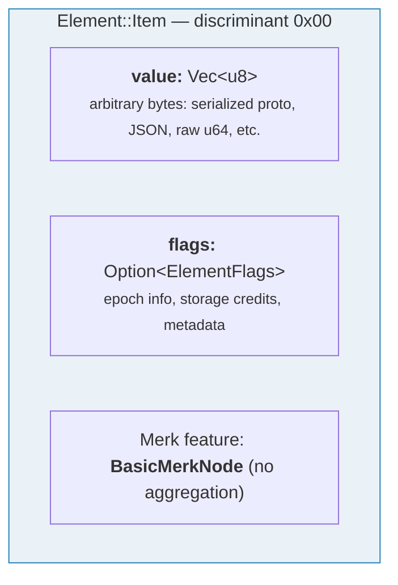
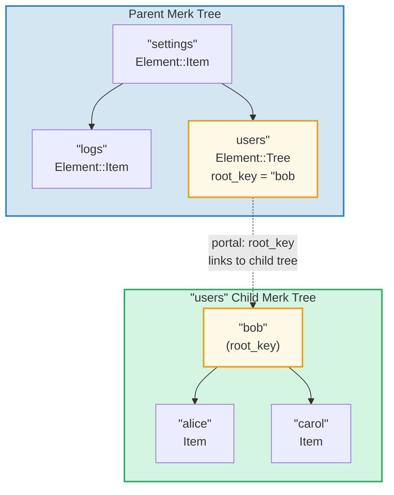
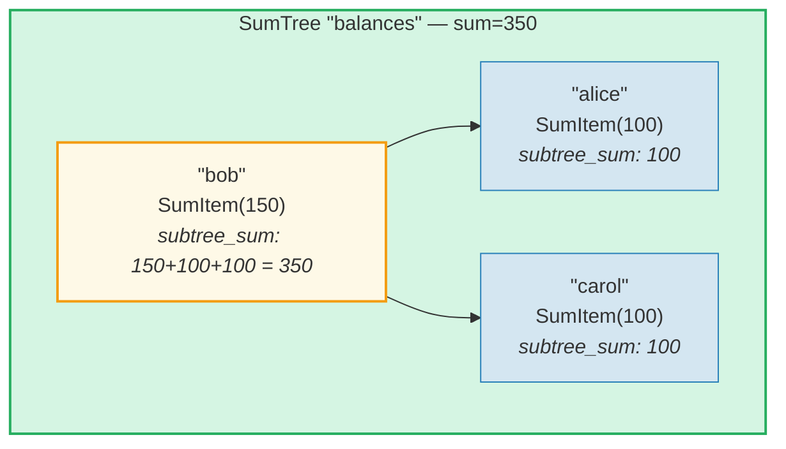
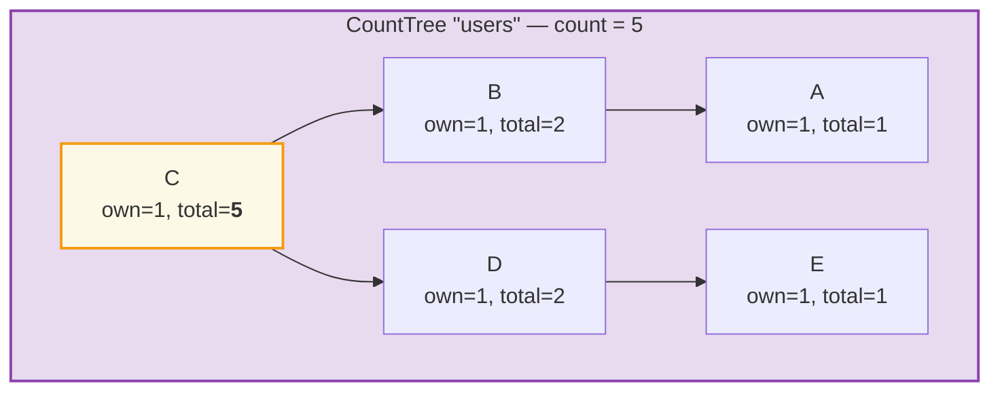
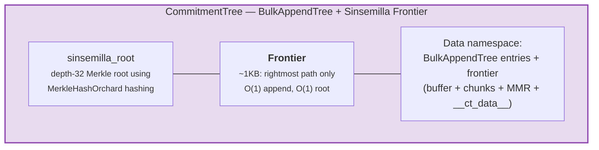

# The Element System

While Merk deals with raw key-value pairs, GroveDB operates at a higher level
using **Elements** — typed values that carry semantic meaning. Every value stored
in GroveDB is an Element.

## The Element Enum

```rust
// grovedb-element/src/element/mod.rs
pub enum Element {
    Item(Vec<u8>, Option<ElementFlags>),                                    // [0]
    Reference(ReferencePathType, MaxReferenceHop, Option<ElementFlags>),    // [1]
    Tree(Option<Vec<u8>>, Option<ElementFlags>),                           // [2]
    SumItem(SumValue, Option<ElementFlags>),                               // [3]
    SumTree(Option<Vec<u8>>, SumValue, Option<ElementFlags>),              // [4]
    BigSumTree(Option<Vec<u8>>, BigSumValue, Option<ElementFlags>),        // [5]
    CountTree(Option<Vec<u8>>, CountValue, Option<ElementFlags>),          // [6]
    CountSumTree(Option<Vec<u8>>, CountValue, SumValue, Option<ElementFlags>), // [7]
    ProvableCountTree(Option<Vec<u8>>, CountValue, Option<ElementFlags>),  // [8]
    ItemWithSumItem(Vec<u8>, SumValue, Option<ElementFlags>),              // [9]
    ProvableCountSumTree(Option<Vec<u8>>, CountValue, SumValue,
                         Option<ElementFlags>),                            // [10]
    CommitmentTree(u64, u8, Option<ElementFlags>),                         // [11]
    MmrTree(u64, Option<ElementFlags>),                                    // [12]
    BulkAppendTree(u64, u8, Option<ElementFlags>),                         // [13]
    DenseAppendOnlyFixedSizeTree(u16, u8, Option<ElementFlags>),           // [14]
}
```

The discriminant numbers (shown in brackets) are used during serialization.

Type aliases used throughout:

```rust
pub type ElementFlags = Vec<u8>;        // Arbitrary metadata per element
pub type MaxReferenceHop = Option<u8>;  // Optional hop limit for references
pub type SumValue = i64;                // 64-bit signed sum
pub type BigSumValue = i128;            // 128-bit signed sum
pub type CountValue = u64;              // 64-bit unsigned count
```

## Item — Basic Key-Value Storage

The simplest element. Stores arbitrary bytes:

```rust
Element::Item(value: Vec<u8>, flags: Option<ElementFlags>)
```



Constructors:

```rust
Element::new_item(b"hello world".to_vec())
Element::new_item_with_flags(b"data".to_vec(), Some(vec![0x01, 0x02]))
```

Items participate in sum aggregation: within a SumTree, an Item contributes a
default sum of 0. A SumItem contributes its explicit value.

## Tree — Containers for Subtrees

A Tree element is a **portal** to another Merk tree. It stores the root key of the
child tree (if any):

```rust
Element::Tree(root_key: Option<Vec<u8>>, flags: Option<ElementFlags>)
```



> The Tree element in the parent Merk stores the `root_key` of the child Merk tree. This creates a **portal** — a link from one Merk tree into another.

When a tree is empty, `root_key` is `None`. The constructor `Element::empty_tree()`
creates `Element::Tree(None, None)`.

## SumItem / SumTree — Aggregate Sums

A **SumTree** automatically maintains the sum of all its direct children's
sum-contributions:

```rust
Element::SumTree(root_key: Option<Vec<u8>>, sum: SumValue, flags: Option<ElementFlags>)
Element::SumItem(value: SumValue, flags: Option<ElementFlags>)
```



> **Aggregation formula:** `node_sum = own_value + left_child_sum + right_child_sum`
> Bob: 150 + 100 (alice) + 100 (carol) = **350**. The root sum (350) is stored in the parent's SumTree element.

The sum is maintained at the Merk level through the `TreeFeatureType::SummedMerkNode(i64)`
feature type. During tree propagation, each node's aggregate data is recomputed:

```text
aggregate_sum = own_sum + left_child_sum + right_child_sum
```

## CountTree, CountSumTree, BigSumTree

Additional aggregate tree types:

| Element Type | Merk Feature Type | Aggregates |
|---|---|---|
| `CountTree` | `CountedMerkNode(u64)` | Number of elements |
| `CountSumTree` | `CountedSummedMerkNode(u64, i64)` | Both count and sum |
| `BigSumTree` | `BigSummedMerkNode(i128)` | 128-bit sum for large values |
| `ProvableCountTree` | `ProvableCountedMerkNode(u64)` | Count baked into hash |
| `ProvableCountSumTree` | `ProvableCountedSummedMerkNode(u64, i64)` | Count in hash + sum |

**ProvableCountTree** is special: its count is included in the `node_hash`
computation (via `node_hash_with_count`), so a proof can verify the count without
revealing any values.

## Element Serialization

Elements are serialized using **bincode** with big-endian byte order:

```rust
pub fn serialize(&self, grove_version: &GroveVersion) -> Result<Vec<u8>, ElementError> {
    let config = config::standard().with_big_endian().with_no_limit();
    bincode::encode_to_vec(self, config)
}
```

The first byte is the **discriminant**, allowing O(1) type detection:

```rust
pub fn from_serialized_value(value: &[u8]) -> Option<ElementType> {
    match value.first()? {
        0 => Some(ElementType::Item),
        1 => Some(ElementType::Reference),
        2 => Some(ElementType::Tree),
        3 => Some(ElementType::SumItem),
        // ... etc
    }
}
```

## TreeFeatureType and Aggregate Data Flow

The `TreeFeatureType` enum bridges the gap between GroveDB Elements and Merk nodes:

```rust
pub enum TreeFeatureType {
    BasicMerkNode,                              // No aggregation
    SummedMerkNode(i64),                       // Sum aggregation
    BigSummedMerkNode(i128),                   // Large sum
    CountedMerkNode(u64),                      // Count
    CountedSummedMerkNode(u64, i64),           // Count + sum
    ProvableCountedMerkNode(u64),              // Count in hash
    ProvableCountedSummedMerkNode(u64, i64),   // Count in hash + sum
}
```

Aggregate data flows **upward** through the tree:



> **Aggregation table:** Each node's aggregate = own(1) + left_aggregate + right_aggregate
>
> | Node | own | left_agg | right_agg | total |
> |------|-----|----------|-----------|-------|
> | A | 1 | 0 | 0 | 1 |
> | B | 1 | 1 (A) | 0 | 2 |
> | E | 1 | 0 | 0 | 1 |
> | D | 1 | 0 | 1 (E) | 2 |
> | C | 1 | 2 (B) | 2 (D) | **5** (root) |

The count stored at each node represents the total count in the
subtree rooted at that node, including itself. The root node's count is the total
for the entire tree.

The `AggregateData` enum carries this through the Link system:

```rust
pub enum AggregateData {
    NoAggregateData,
    Sum(i64),
    BigSum(i128),
    Count(u64),
    CountAndSum(u64, i64),
    ProvableCount(u64),
    ProvableCountAndSum(u64, i64),
}
```

## CommitmentTree — Sinsemilla Commitment Tree

A **CommitmentTree** provides a depth-32 Sinsemilla Merkle tree for tracking
note commitment anchors, as used in Zcash's Orchard shielded protocol. It wraps
`incrementalmerkletree::Frontier<MerkleHashOrchard, 32>` for O(1) append and
root computation:

```rust
Element::CommitmentTree(
    total_count: u64,               // Number of commitments appended
    chunk_power: u8,                // BulkAppendTree compaction size (chunk_size = 2^chunk_power)
    flags: Option<ElementFlags>,
)                                   // discriminant [11]
```

> **Note:** The Sinsemilla frontier root hash is NOT stored in the Element.
> It is persisted in data storage and flows through the Merk child hash mechanism
> (`insert_subtree`'s `subtree_root_hash` parameter). Any change to the frontier
> automatically propagates up through the GroveDB Merk hierarchy.



**Architecture:**
- The *frontier* (rightmost path of the Merkle tree, ~1KB constant size) is
  stored in the **data namespace**, keyed by `COMMITMENT_TREE_DATA_KEY`
- The actual note data (`cmx || ciphertext`) is stored via a **BulkAppendTree**
  in the **data namespace** — chunk-compacted, retrievable by position
- Historical anchors are tracked by Platform in a separate provable tree
- The Sinsemilla root is NOT stored in the Element — it flows as the Merk child
  hash through the GroveDB hash hierarchy

**Operations:**
- `commitment_tree_insert(path, key, cmx, ciphertext, tx)` — Typed append
  accepting `TransmittedNoteCiphertext<M>`; returns `(new_root, position)`
- `commitment_tree_anchor(path, key, tx)` — Get current Orchard Anchor
- `commitment_tree_get_value(path, key, position, tx)` — Retrieve value by position
- `commitment_tree_count(path, key, tx)` — Get total item count

**MemoSize generic:** `CommitmentTree<S, M: MemoSize = DashMemo>` validates that
ciphertext payloads match the expected size for `M`. For Dash (36-byte memos):
`epk_bytes (32) + enc_ciphertext (104) + out_ciphertext (80) = 216 bytes`.

**Cost tracking:** Sinsemilla hash operations are tracked via
`cost.sinsemilla_hash_calls`. Root computation always traverses 32 levels.
Ommer merges cascade through `trailing_ones()` of the previous position.
BulkAppendTree operations add Blake3 hash costs.

## MmrTree — Merkle Mountain Range

An **MmrTree** stores data in an append-only Merkle Mountain Range (MMR) using
Blake3 hashing. MMR nodes are stored in the **data** column (same as Merk nodes),
not in a child Merk subtree. See **[Chapter 13](#chapter-13-the-mmr-tree--append-only-authenticated-logs)**
for a comprehensive deep-dive into how MMRs work, how they fill up, how proofs
are generated and verified, and how MmrTree integrates with GroveDB.

```rust
Element::MmrTree(
    mmr_size: u64,                  // Internal MMR size (nodes, not leaves)
    flags: Option<ElementFlags>,
)                                   // discriminant [12]
```

> **Note:** The MMR root hash is NOT stored in the Element. It flows as the Merk
> child hash via `insert_subtree`'s `subtree_root_hash` parameter.

**Operations:** `mmr_tree_append`, `mmr_tree_root_hash`, `mmr_tree_get_value`,
`mmr_tree_leaf_count`. **Proofs:** V1 proofs (see §9.6 and §13.9).

## BulkAppendTree — Two-Level Append-Only Structure

A **BulkAppendTree** combines a dense Merkle tree buffer with a chunk-level MMR
for efficient high-throughput appends with provable range queries. It is a
non-Merk tree — data lives in the **data** namespace, not in a child Merk subtree.
See **[Chapter 14](#chapter-14-the-bulkappendtree--high-throughput-append-only-storage)**
for a comprehensive deep-dive into the two-level architecture, chunk compaction,
proof generation, verification, and GroveDB integration.

```rust
Element::BulkAppendTree(
    total_count: u64,               // Total values appended
    chunk_power: u8,                // Dense tree height (buffer capacity = 2^chunk_power - 1)
    flags: Option<ElementFlags>,
)                                   // discriminant [13]
```

> **Note:** The state root (`blake3("bulk_state" || mmr_root || dense_tree_root)`)
> is NOT stored in the Element. It flows as the Merk child hash via
> `insert_subtree`'s `subtree_root_hash` parameter.

**Operations:** `bulk_append`, `bulk_get_value`, `bulk_get_chunk`,
`bulk_get_buffer`, `bulk_count`, `bulk_chunk_count`.
**Proofs:** V1 range proofs (see §9.6 and §14.10).

## DenseAppendOnlyFixedSizeTree — Dense Fixed-Capacity Storage

A **DenseAppendOnlyFixedSizeTree** is a complete binary tree of fixed height *h*
where every node (internal and leaf) stores a data value. Positions are filled
in level-order (BFS). The root hash is recomputed on the fly — no intermediate
hashes are persisted. See **[Chapter 16](#chapter-16-the-denseappendonlyfixedsizetree--dense-fixed-capacity-merkle-storage)**
for the full deep-dive.

```rust
Element::DenseAppendOnlyFixedSizeTree(
    count: u16,                     // Number of values stored (max 65,535)
    height: u8,                     // Tree height (1..=16, immutable), capacity = 2^h - 1
    flags: Option<ElementFlags>,
)                                   // discriminant [14]
```

> **Note:** The root hash is NOT stored in the Element — it is recomputed on
> the fly and flows as the Merk child hash. The `count` field is `u16` (not u64),
> limiting trees to 65,535 positions. Heights are restricted to 1..=16.

**Operations:** `dense_tree_insert`, `dense_tree_get`, `dense_tree_root_hash`,
`dense_tree_count`.
**Proofs:** Element-level only (no subquery proofs yet).

## Non-Merk Trees — Common Patterns

CommitmentTree, MmrTree, BulkAppendTree, and DenseAppendOnlyFixedSizeTree share a common architectural
pattern that distinguishes them from the Merk-based tree types (Tree, SumTree,
CountTree, etc.):

| Property | Merk-based trees | Non-Merk trees |
|----------|-----------------|-------------------|
| Child Merk subtree | Yes (`root_key = Some(...)`) | No (no root_key field) |
| Data storage | Merk key-value pairs | Data column blobs (non-Merk keys) |
| Root hash binding | `combine_hash(elem_hash, child_root_hash)` | `combine_hash(elem_hash, type_specific_root)` |
| Type-specific root | Maintained by Merk AVL | Flows as Merk child hash (NOT in element bytes) |
| Proof format | V0 (layer-by-layer Merk) | V1 (type-specific proof) |
| TreeFeatureType | BasicMerkNode (no aggregation) | BasicMerkNode |

> **Storage column note:** All four non-Merk tree types (MmrTree,
> CommitmentTree, BulkAppendTree, DenseAppendOnlyFixedSizeTree) store their
> data in the **data** column using non-Merk keys. CommitmentTree stores its
> Sinsemilla frontier alongside BulkAppendTree entries in the same **data**
> column (key `b"__ct_data__"`).

The type-specific root (sinsemilla root, MMR root, state root, or dense tree root hash) is
NOT stored in the Element. Instead, it flows as the Merk **child hash** via
`insert_subtree`'s `subtree_root_hash` parameter. The Merk combined_value_hash
becomes `combine_hash(value_hash(element_bytes), type_specific_root)`.
Any change to the type-specific root changes the child hash, which changes
the combined_value_hash, which propagates up through the GroveDB hash
hierarchy — maintaining cryptographic integrity.

---
