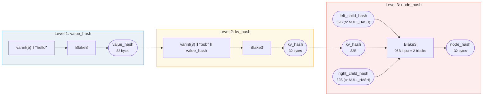
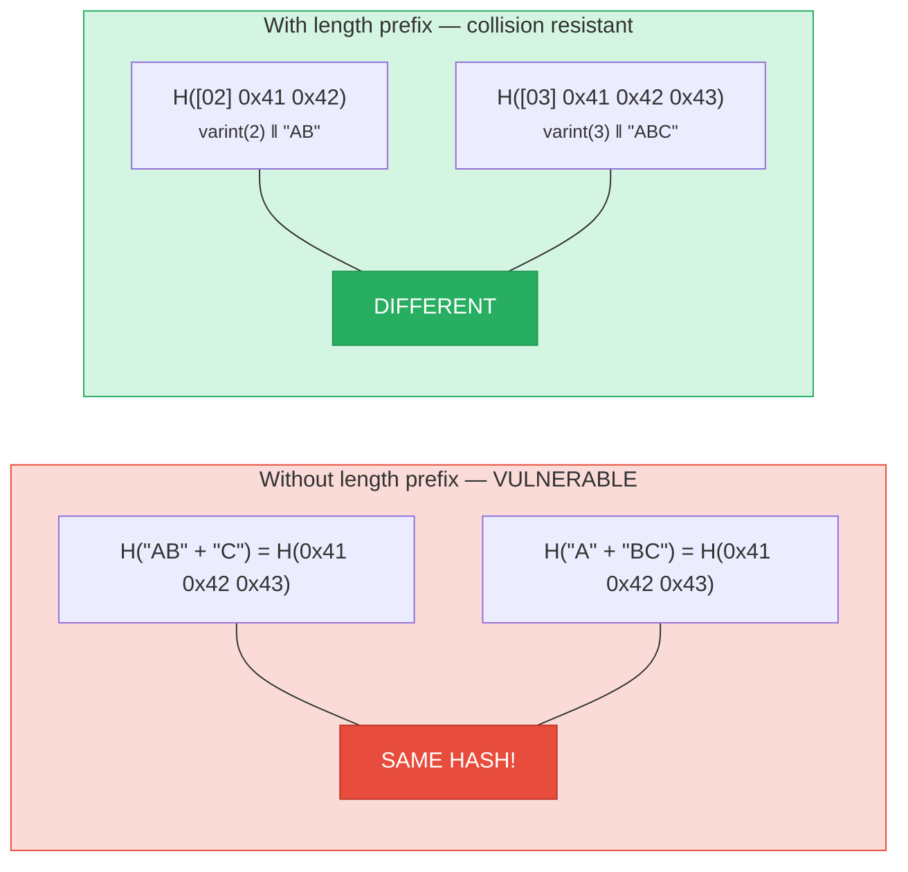
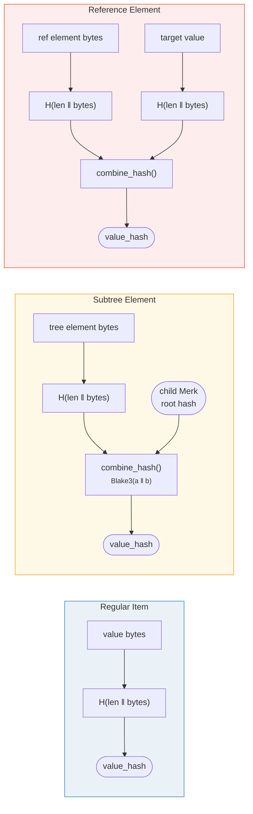

# Hashing — Cryptographic Integrity

Every node in a Merk tree is hashed to produce a **root hash** — a single 32-byte
value that authenticates the entire tree. Any change to any key, value, or
structural relationship will produce a different root hash.

## Three-Level Hash Hierarchy

Merk uses a three-level hashing scheme, from innermost to outermost:

Example: key = `"bob"` (3 bytes), value = `"hello"` (5 bytes):



> The ROOT of the tree = `node_hash` of the root node — authenticates **every** key, value, and structural relationship. Missing children use `NULL_HASH = [0x00; 32]`.

### Level 1: value_hash

```rust
// merk/src/tree/hash.rs
pub fn value_hash(value: &[u8]) -> CostContext<CryptoHash> {
    let mut hasher = blake3::Hasher::new();
    let val_length = value.len().encode_var_vec();  // Varint encoding
    hasher.update(val_length.as_slice());
    hasher.update(value);
    // ...
}
```

The value's length is **varint-encoded** and prepended. This is critical for
collision resistance — without it, `H("AB" ‖ "C")` would equal `H("A" ‖ "BC")`.

### Level 2: kv_hash

```rust
pub fn kv_hash(key: &[u8], value: &[u8]) -> CostContext<CryptoHash> {
    let mut hasher = blake3::Hasher::new();
    let key_length = key.len().encode_var_vec();
    hasher.update(key_length.as_slice());
    hasher.update(key);
    let vh = value_hash(value);
    hasher.update(vh.as_slice());  // Nested hash
    // ...
}
```

This binds the key to the value. For proof verification, there's also a variant
that takes a pre-computed value_hash:

```rust
pub fn kv_digest_to_kv_hash(key: &[u8], value_hash: &CryptoHash) -> CostContext<CryptoHash>
```

This is used when the verifier already has the value_hash (e.g., for subtrees
where value_hash is a combined hash).

### Level 3: node_hash

```rust
pub fn node_hash(
    kv: &CryptoHash,
    left: &CryptoHash,
    right: &CryptoHash,
) -> CostContext<CryptoHash> {
    let mut hasher = blake3::Hasher::new();
    hasher.update(kv);       // 32 bytes
    hasher.update(left);     // 32 bytes
    hasher.update(right);    // 32 bytes — total 96 bytes
    // Always exactly 2 hash operations (96 bytes / 64-byte block = 2)
}
```

If a child is absent, its hash is the **NULL_HASH** — 32 zero bytes:

```rust
pub const NULL_HASH: CryptoHash = [0; HASH_LENGTH];  // [0u8; 32]
```

## Blake3 as the Hash Function

GroveDB uses **Blake3** for all hashing. Key properties:

- **256-bit output** (32 bytes)
- **Block size**: 64 bytes
- **Speed**: ~3x faster than SHA-256 on modern hardware
- **Streaming**: Can incrementally feed data

The hash operation cost is calculated based on how many 64-byte blocks are
processed:

```rust
let hashes = 1 + (hasher.count() - 1) / 64;  // Number of hash operations
```

## Length-Prefix Encoding for Collision Resistance

Every variable-length input is prefixed with its length using **varint encoding**:



> **value_hash input**: `[varint(value.len)] [value bytes]`
> **kv_hash input**: `[varint(key.len)] [key bytes] [value_hash: 32 bytes]`

Without length prefixes, an attacker could craft different key-value pairs that
hash to the same digest. The length prefix makes this cryptographically
infeasible.

## Combined Hashing for Special Elements

For **subtrees** and **references**, the `value_hash` is not simply `H(value)`.
Instead, it's a **combined hash** that binds the element to its target:



> **Subtree:** binds the child Merk's root hash into the parent. **Reference:** binds both the reference path AND the target value. Changing either changes the root hash.

The `combine_hash` function:

```rust
pub fn combine_hash(hash_one: &CryptoHash, hash_two: &CryptoHash) -> CostContext<CryptoHash> {
    let mut hasher = blake3::Hasher::new();
    hasher.update(hash_one);   // 32 bytes
    hasher.update(hash_two);   // 32 bytes — total 64 bytes, exactly 1 hash op
    // ...
}
```

This is what allows GroveDB to authenticate the entire hierarchy through a single
root hash — each parent tree's value_hash for a subtree element includes the
child tree's root hash.

## Aggregate Hashing for ProvableCountTree

`ProvableCountTree` nodes include the aggregate count in the node hash:

```rust
pub fn node_hash_with_count(
    kv: &CryptoHash,
    left: &CryptoHash,
    right: &CryptoHash,
    count: u64,
) -> CostContext<CryptoHash> {
    let mut hasher = blake3::Hasher::new();
    hasher.update(kv);                        // 32 bytes
    hasher.update(left);                      // 32 bytes
    hasher.update(right);                     // 32 bytes
    hasher.update(&count.to_be_bytes());      // 8 bytes — total 104 bytes
    // Still exactly 2 hash ops (104 < 128 = 2 × 64)
}
```

This means a proof of count doesn't require revealing the actual data — the count
is baked into the cryptographic commitment.

---
