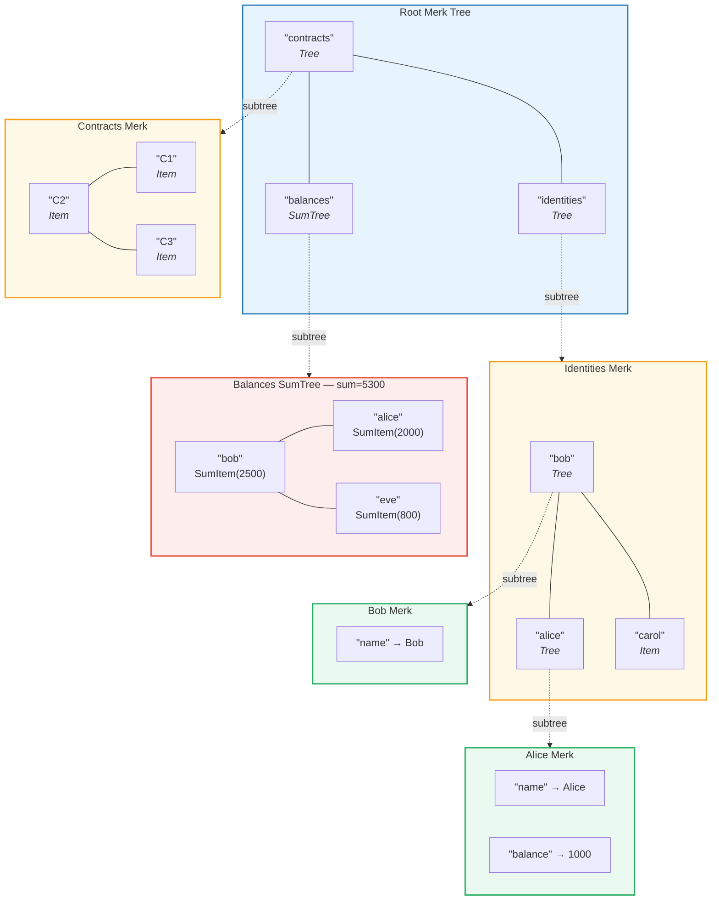
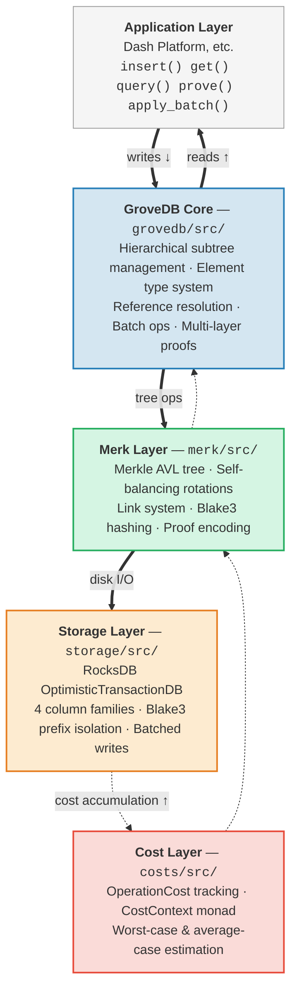

# Introduction — What is GroveDB?

## The Core Idea

GroveDB is a **hierarchical authenticated data structure** — essentially a *grove*
(tree of trees) built on Merkle AVL trees. Each node in the database is part of a
cryptographically authenticated tree, and each tree can contain other trees as
children, forming a deep hierarchy of verifiable state.

> Each colored box is a **separate Merk tree**. Dashed arrows show the subtree relationship — a Tree element in the parent contains the root key of the child Merk.

In a traditional database, you might store data in a flat key-value store with a
single Merkle tree on top for authentication. GroveDB takes a different approach:
it nests Merkle trees inside Merkle trees. This gives you:

1. **Efficient secondary indexes** — query by any path, not just primary key
2. **Compact cryptographic proofs** — prove the existence (or absence) of any data
3. **Aggregate data** — trees can automatically sum, count, or otherwise aggregate
   their children
4. **Atomic cross-tree operations** — batch operations span multiple subtrees

## Why GroveDB Exists

GroveDB was designed for **Dash Platform**, a decentralized application platform
where every piece of state must be:

- **Authenticated**: Any node can prove any piece of state to a light client
- **Deterministic**: Every node computes exactly the same state root
- **Efficient**: Operations must complete within block time constraints
- **Queryable**: Applications need rich queries, not just key lookups

Traditional approaches fall short:

| Approach | Problem |
|----------|---------|
| Plain Merkle Tree | Only supports key lookups, no range queries |
| Ethereum MPT | Expensive rebalancing, large proof sizes |
| Flat key-value + single tree | No hierarchical queries, single proof covers everything |
| B-tree | Not naturally Merklized, complex authentication |

GroveDB solves these by combining the **proven balance guarantees of AVL trees**
with **hierarchical nesting** and a **rich element type system**.

## Architecture Overview

GroveDB is organized into distinct layers, each with a clear responsibility:

Data flows **down** through these layers during writes and **up** during reads.
Every operation accumulates costs as it traverses the stack, enabling precise
resource accounting.

---
