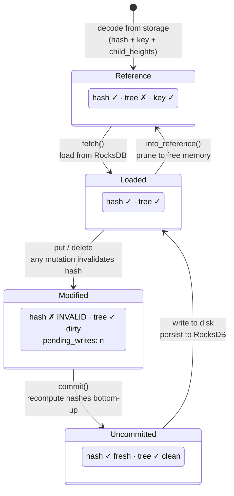
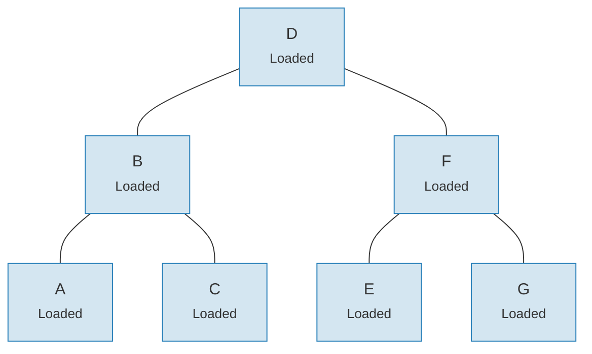
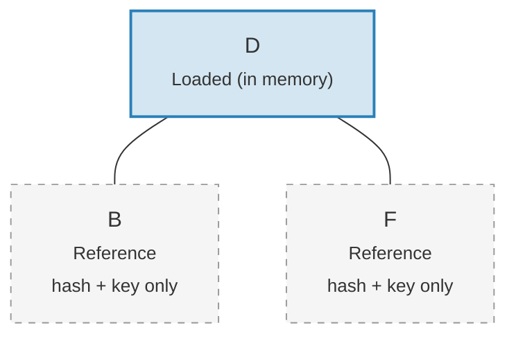

# The Link System — Lazy Loading Architecture

Loading an entire Merk tree into memory would be prohibitively expensive for large
trees. The Link system solves this by representing child connections in four
possible states, enabling **lazy loading** — children are fetched from storage only
when actually needed.

## Four Link States

```rust
// merk/src/tree/link.rs
pub enum Link {
    Reference {                    // Pruned: only metadata, no tree in memory
        hash: CryptoHash,
        child_heights: (u8, u8),
        key: Vec<u8>,
        aggregate_data: AggregateData,
    },
    Modified {                     // Recently changed, hash not yet computed
        pending_writes: usize,
        child_heights: (u8, u8),
        tree: TreeNode,
    },
    Uncommitted {                  // Hashed but not yet persisted to storage
        hash: CryptoHash,
        child_heights: (u8, u8),
        tree: TreeNode,
        aggregate_data: AggregateData,
    },
    Loaded {                       // Fully loaded from storage
        hash: CryptoHash,
        child_heights: (u8, u8),
        tree: TreeNode,
        aggregate_data: AggregateData,
    },
}
```

## State Transition Diagram



## What Each State Stores

| State | Hash? | Tree in Memory? | Purpose |
|-------|-------|-----------------|---------|
| **Reference** | Yes | No | Compact on-disk representation. Only stores key, hash, child heights, and aggregate data. |
| **Modified** | No | Yes | After any mutation. Tracks `pending_writes` count for batch optimization. |
| **Uncommitted** | Yes | Yes | After hash computation but before storage write. Intermediate state during commit. |
| **Loaded** | Yes | Yes | Fully materialized. Ready for reads or further modifications. |

The `pending_writes` field in `Modified` is noteworthy:

```rust
// Computed as: 1 + left_pending_writes + right_pending_writes
pending_writes: 1 + tree.child_pending_writes(true)
                  + tree.child_pending_writes(false),
```

This count helps the commit phase decide how to order writes for optimal
performance.

## The Fetch Callback Pattern

The Link system uses a **Fetch trait** to abstract over how child nodes are loaded:

```rust
pub trait Fetch {
    fn fetch(
        &self,
        link: &Link,
        value_defined_cost_fn: Option<&impl Fn(&[u8], &GroveVersion) -> Option<ValueDefinedCostType>>,
        grove_version: &GroveVersion,
    ) -> CostResult<TreeNode, Error>;
}
```

Different fetch implementations serve different purposes:

- **StorageFetch**: Loads from RocksDB (the normal path)
- **PanicSource**: Used in tests where fetching should never happen
- **MockSource**: Returns controlled test data

This pattern allows the tree operations to be **storage-agnostic** — the same
balancing and mutation logic works regardless of where the data comes from.

## The Walker Pattern

The `Walker` wraps a `TreeNode` with a `Fetch` source, providing safe tree
traversal with automatic lazy loading (`merk/src/tree/walk/mod.rs`):

```rust
pub struct Walker<S: Fetch + Sized + Clone> {
    tree: Owner<TreeNode>,
    source: S,
}
```

The Walker provides three key operations:

**walk()** — Detach a child, transform it, and reattach:

```rust
pub fn walk<F, T>(self, left: bool, f: F, ...) -> CostResult<Self, Error>
where
    F: FnOnce(Option<Self>) -> CostResult<Option<T>, Error>,
    T: Into<TreeNode>,
```

**detach()** — Remove a child, loading it from storage if necessary:

```rust
pub fn detach(self, left: bool, ...) -> CostResult<(Self, Option<Self>), Error>
```

If the child is a `Link::Reference` (pruned), detach will call `fetch()` to load
it first. If the child is already in memory (`Modified`, `Uncommitted`, `Loaded`),
it simply takes ownership.

**attach()** — Connect a child to a parent:

```rust
pub fn attach(self, left: bool, maybe_child: Option<Self>) -> Self
```

Attaching always creates a `Link::Modified` since the parent-child relationship
has changed.

## Memory Efficiency Through Pruning

After committing changes, the tree can **prune** loaded subtrees back to
`Link::Reference`, freeing memory while retaining the hash needed for proof
generation:

**Before pruning** — all 7 nodes in memory:



**After pruning** — only root in memory, children are `Link::Reference` (just hash + key):



> **Link::Loaded** holds `hash + child_heights + tree (TreeNode)`. **Link::Reference** holds only `hash + child_heights + key` — the TreeNode is released from memory.

The transformation is simple:

```rust
pub fn into_reference(self) -> Link {
    Link::Reference {
        hash: self.hash(),
        child_heights: self.child_heights(),
        key: self.key().to_vec(),
        aggregate_data: self.aggregate_data(),
    }
}
```

This is crucial for keeping memory usage bounded in large trees — only the nodes
actively being accessed need to be in memory.

---

