# The Merk Tree — A Merkle AVL Tree

The Merk tree is the fundamental building block of GroveDB. Every subtree in the
grove is a Merk tree — a self-balancing binary search tree where every node is
cryptographically hashed, producing a single root hash that authenticates the
entire tree's contents.

## What is a Merk Node?

Unlike many Merkle tree implementations where data lives only at the leaves, in a
Merk tree **every node stores a key-value pair**. This means there are no "empty"
internal nodes — the tree is both a search structure and a data store simultaneously.

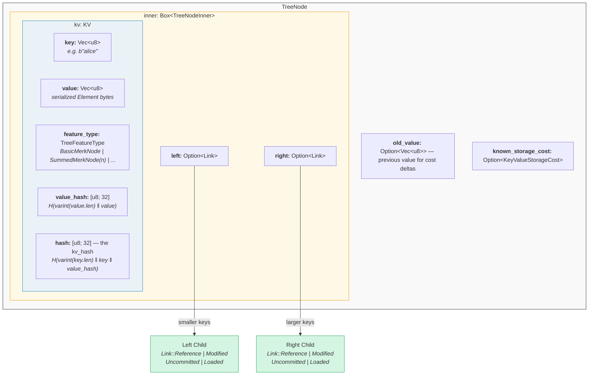

In code (`merk/src/tree/mod.rs`):

```rust
pub struct TreeNode {
    pub(crate) inner: Box<TreeNodeInner>,
    pub(crate) old_value: Option<Vec<u8>>,        // Previous value for cost tracking
    pub(crate) known_storage_cost: Option<KeyValueStorageCost>,
}

pub struct TreeNodeInner {
    pub(crate) left: Option<Link>,    // Left child (smaller keys)
    pub(crate) right: Option<Link>,   // Right child (larger keys)
    pub(crate) kv: KV,               // The key-value payload
}
```

The `Box<TreeNodeInner>` keeps the node on the heap, which is essential since child
links can recursively contain entire `TreeNode` instances.

## The KV Structure

The `KV` struct holds both the raw data and its cryptographic digests
(`merk/src/tree/kv.rs`):

```rust
pub struct KV {
    pub(super) key: Vec<u8>,                        // The lookup key
    pub(super) value: Vec<u8>,                      // The stored value
    pub(super) feature_type: TreeFeatureType,       // Aggregation behavior
    pub(crate) value_defined_cost: Option<ValueDefinedCostType>,
    pub(super) hash: CryptoHash,                    // kv_hash
    pub(super) value_hash: CryptoHash,              // H(value)
}
```

Two important points:

1. **Keys are not stored on disk as part of the encoded node.** They are stored as
   the RocksDB key. When a node is decoded from storage, the key is injected from
   the outside. This avoids duplicating key bytes.

2. **Two hash fields are maintained.** The `value_hash` is `H(value)` and the
   `hash` (kv_hash) is `H(key, value_hash)`. Keeping both allows the proof system
   to choose how much information to reveal.

## The Semi-Balanced Nature — How AVL "Wobbles"

A Merk tree is an **AVL tree** — the classic self-balancing binary search tree
invented by Adelson-Velsky and Landis. The key invariant is:

> For every node, the height difference between its left and right subtrees is
> at most 1.

This is expressed as the **balance factor**:

```text
balance_factor = right_height - left_height
```

Valid values: **{-1, 0, 1}**

```rust
// merk/src/tree/mod.rs
pub const fn balance_factor(&self) -> i8 {
    let left_height = self.child_height(true) as i8;
    let right_height = self.child_height(false) as i8;
    right_height - left_height
}
```

But here's the subtle point: while each individual node can only lean by one level,
these leanings can **compound** through the tree. This is why we call it
"semi-balanced" — the tree isn't perfectly balanced like a complete binary tree.

Consider a tree of 10 nodes. A perfectly balanced tree would have height 4
(⌈log₂(10+1)⌉). But an AVL tree might have height 5:

**Perfectly balanced (height 4)** — every level fully packed:

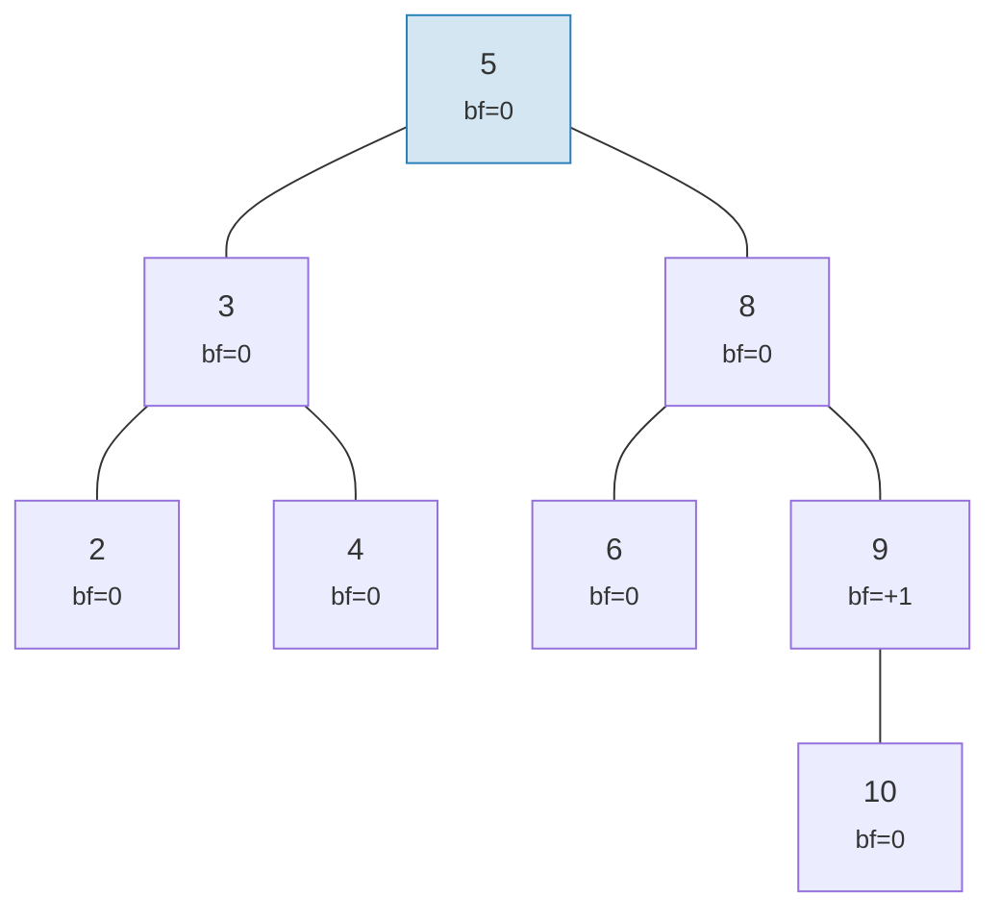

**AVL-valid "wobble" (height 5)** — each node leans at most 1, but it compounds:

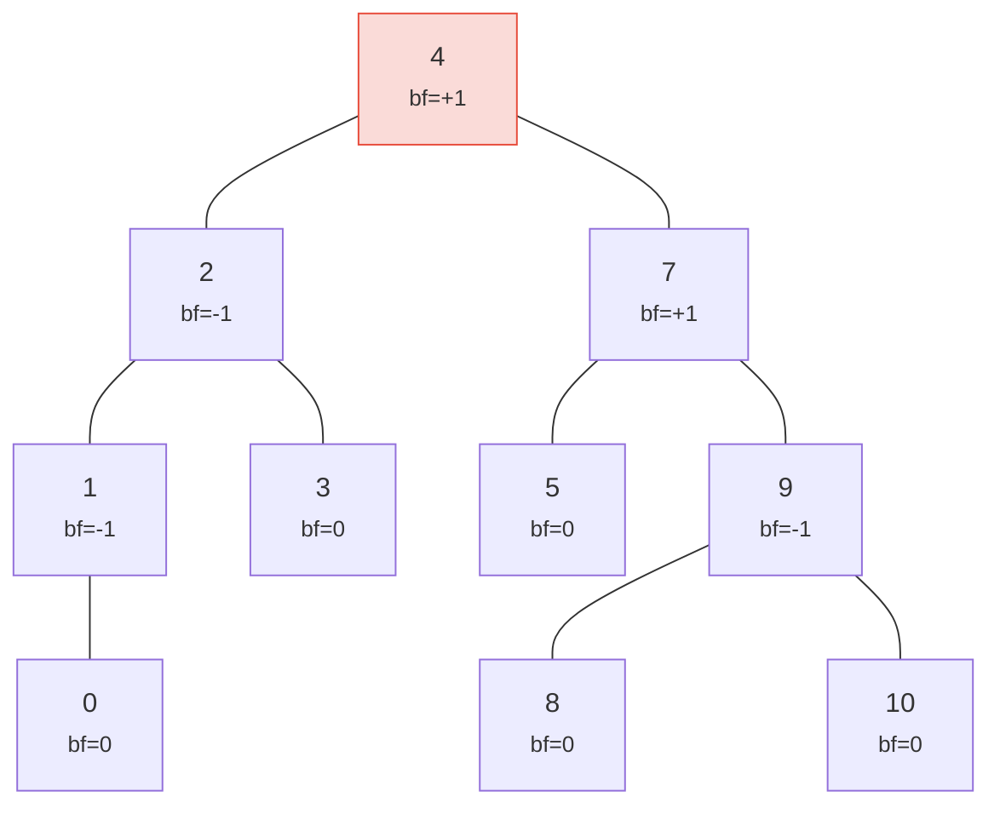

> Height 5 vs the perfect 4 — that's the "wobble". Worst case: h ≤ 1.44 × log₂(n+2).

Both trees are valid AVL trees! The worst-case height of an AVL tree is:

```text
h ≤ 1.4404 × log₂(n + 2) − 0.3277
```

So for **n = 1,000,000** nodes:
- Perfect balance: height 20
- AVL worst case: height ≈ 29

This ~44% overhead is the price of AVL's simple rotation rules. In practice, random
insertions produce trees much closer to perfectly balanced.

Here's what valid and invalid trees look like:

**VALID** — all balance factors in {-1, 0, +1}:

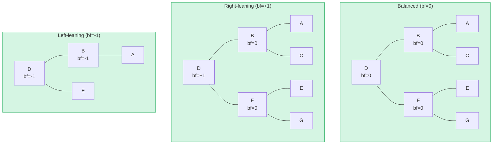

**INVALID** — balance factor = +2 (needs rotation!):

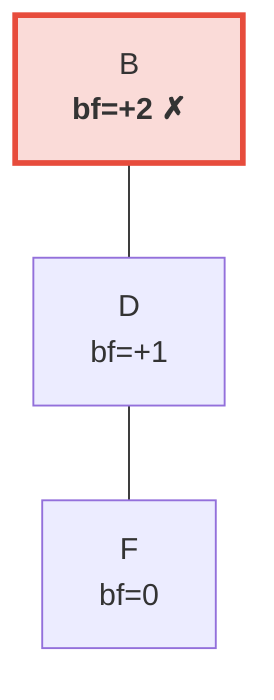

> The right subtree is 2 levels taller than the left (which is empty). This triggers a **left rotation** to restore the AVL invariant.

## Rotations — Restoring Balance

When an insertion or deletion causes a balance factor to reach ±2, the tree must
be **rotated** to restore the AVL invariant. There are four cases, reducible to
two fundamental operations.

### Single Left Rotation

Used when a node is **right-heavy** (bf = +2) and its right child is
**right-heavy or balanced** (bf ≥ 0):

**Before** (bf=+2):

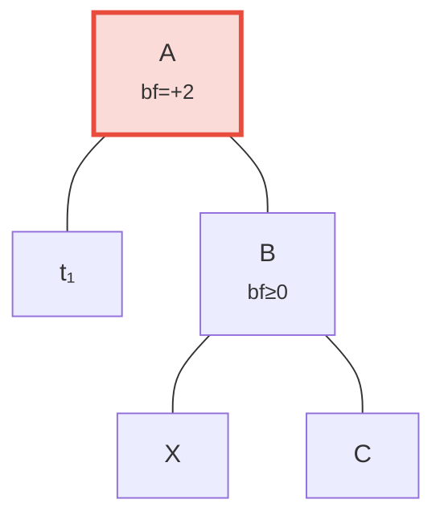

**After** left rotation — B promoted to root:

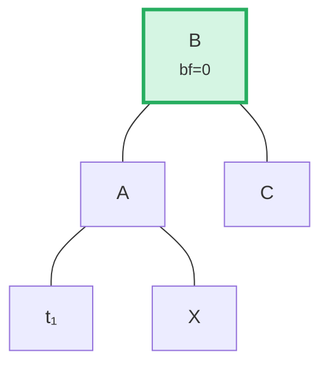

> **Steps:** (1) Detach B from A. (2) Detach X (B's left child). (3) Attach X as A's right child. (4) Attach A as B's left child. The subtree rooted at B is now balanced.

In code (`merk/src/tree/ops.rs`):

```rust
fn rotate<V>(self, left: bool, ...) -> CostResult<Self, Error> {
    // Detach child on the heavy side
    let (tree, child) = self.detach_expect(left, ...);
    // Detach grandchild from opposite side of child
    let (child, maybe_grandchild) = child.detach(!left, ...);

    // Attach grandchild to original root
    tree.attach(left, maybe_grandchild)
        .maybe_balance(...)
        .flat_map_ok(|tree| {
            // Attach original root as child of promoted node
            child.attach(!left, Some(tree))
                .maybe_balance(...)
        })
}
```

Note how `maybe_balance` is called recursively — the rotation itself might create
new imbalances that need further correction.

### Double Rotation (Left-Right)

Used when a node is **left-heavy** (bf = -2) but its left child is
**right-heavy** (bf > 0). A single rotation would not fix this:

**Step 0: Before** — C is left-heavy (bf=-2) but its left child A leans right (bf=+1). A single rotation won't fix this:

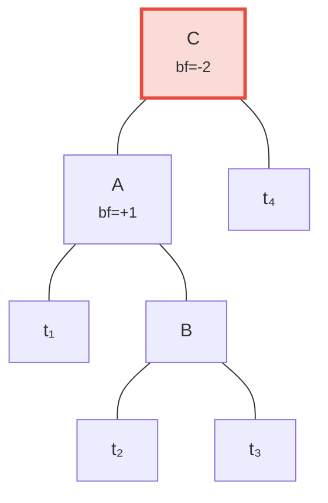

**Step 1: Left-rotate child A** — now both C and B lean left, fixable by a single rotation:

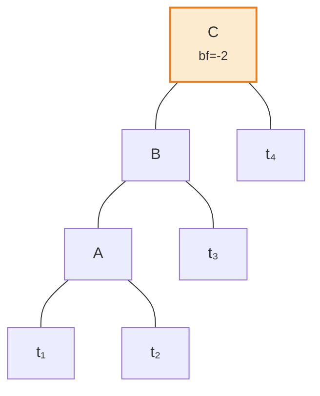

**Step 2: Right-rotate root C** — balanced!

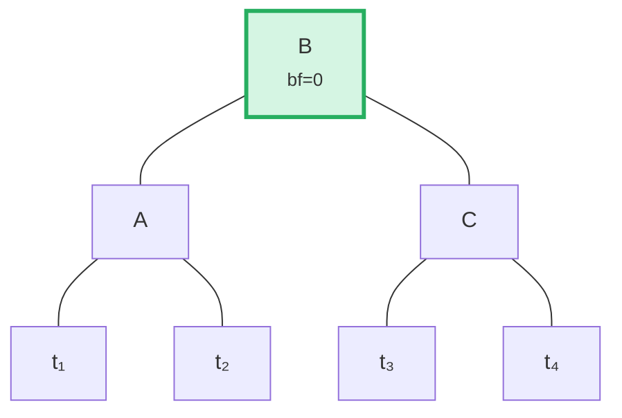

The algorithm detects this case by comparing the parent's lean direction with the
child's balance factor:

```rust
fn maybe_balance<V>(self, ...) -> CostResult<Self, Error> {
    let balance_factor = self.balance_factor();
    if balance_factor.abs() <= 1 {
        return Ok(self);  // Already balanced
    }

    let left = balance_factor < 0;  // true if left-heavy

    // Double rotation needed when child leans opposite to parent
    let tree = if left == (self.tree().link(left).unwrap().balance_factor() > 0) {
        // First rotation: rotate child in opposite direction
        self.walk_expect(left, |child|
            child.rotate(!left, ...).map_ok(Some), ...
        )
    } else {
        self
    };

    // Second (or only) rotation
    tree.rotate(left, ...)
}
```

## Batch Operations — Building and Applying

Rather than inserting elements one at a time, Merk supports batch operations that
apply multiple changes in a single pass. This is critical for efficiency: a batch
of N operations on a tree of M elements takes **O((M + N) log(M + N))** time,
versus O(N log M) for sequential inserts.

### The MerkBatch Type

```rust
type MerkBatch<K> = [(K, Op)];

enum Op {
    Put(Vec<u8>, TreeFeatureType),  // Insert or update with value and feature type
    PutWithSpecializedCost(...),     // Insert with predefined cost
    PutCombinedReference(...),       // Insert reference with combined hash
    Replace(Vec<u8>, TreeFeatureType),
    Patch { .. },                    // Partial value update
    Delete,                          // Remove key
    DeleteLayered,                   // Remove with layered cost
    DeleteMaybeSpecialized,          // Remove with optional specialized cost
}
```

### Strategy 1: build() — Building from Scratch

When the tree is empty, `build()` constructs a balanced tree directly from the
sorted batch using a **median-split** algorithm:

Input batch (sorted): `[A, B, C, D, E, F, G]` — pick middle (D) as root, recurse on each half:

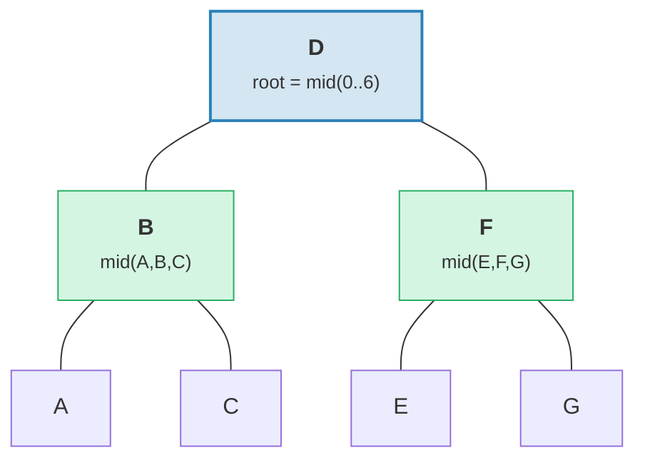

> Result: perfectly balanced tree with height = 3 = ⌈log₂(7)⌉.

```rust
fn build(batch: &MerkBatch<K>, ...) -> CostResult<Option<TreeNode>, Error> {
    let mid_index = batch.len() / 2;
    let (mid_key, mid_op) = &batch[mid_index];

    // Create root node from middle element
    let mid_tree = TreeNode::new(mid_key.clone(), value.clone(), None, feature_type)?;

    // Recursively build left and right subtrees
    let left = Self::build(&batch[..mid_index], ...);
    let right = Self::build(&batch[mid_index + 1..], ...);

    // Attach children
    mid_tree.attach(true, left).attach(false, right)
}
```

This produces a tree with height ⌈log₂(n)⌉ — perfectly balanced.

### Strategy 2: apply_sorted() — Merging into Existing Tree

When the tree already has data, `apply_sorted()` uses **binary search** to find
where each batch operation belongs, then recursively applies operations to the left
and right subtrees:

Existing tree with batch `[(B, Put), (F, Delete)]`:

Binary search: B < D (go left), F > D (go right).

**Before:**
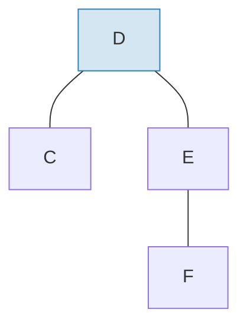

**After** applying batch and rebalancing:
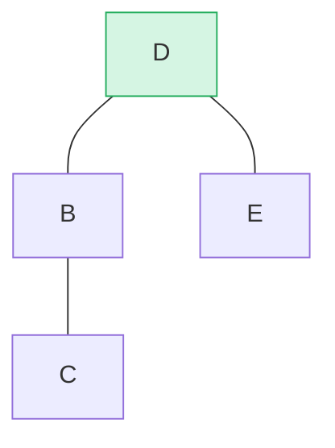

> B inserted as left subtree, F deleted from right subtree. `maybe_balance()` confirms bf(D) = 0.

```rust
fn apply_sorted(self, batch: &MerkBatch<K>, ...) -> CostResult<...> {
    let search = batch.binary_search_by(|(key, _)| key.cmp(self.tree().key()));

    match search {
        Ok(index) => {
            // Key matches this node — apply operation directly
            // (Put replaces value, Delete removes node)
        }
        Err(mid) => {
            // Key not found — mid is the split point
            // Recurse on left_batch[..mid] and right_batch[mid..]
        }
    }

    self.recurse(batch, mid, exclusive, ...)
}
```

The `recurse` method splits the batch and walks left and right:

```rust
fn recurse(self, batch: &MerkBatch<K>, mid: usize, ...) {
    let left_batch = &batch[..mid];
    let right_batch = &batch[mid..];  // or mid+1 if exclusive

    // Apply left batch to left subtree
    let tree = self.walk(true, |maybe_left| {
        Self::apply_to(maybe_left, left_batch, ...)
    });

    // Apply right batch to right subtree
    let tree = tree.walk(false, |maybe_right| {
        Self::apply_to(maybe_right, right_batch, ...)
    });

    // Re-balance after modifications
    tree.maybe_balance(...)
}
```

### Node Removal

When deleting a node with two children, Merk promotes the **edge node** from the
taller subtree. This minimizes the chance of needing additional rotations:

**Before** — deleting D (has two children, right subtree height ≥ left):

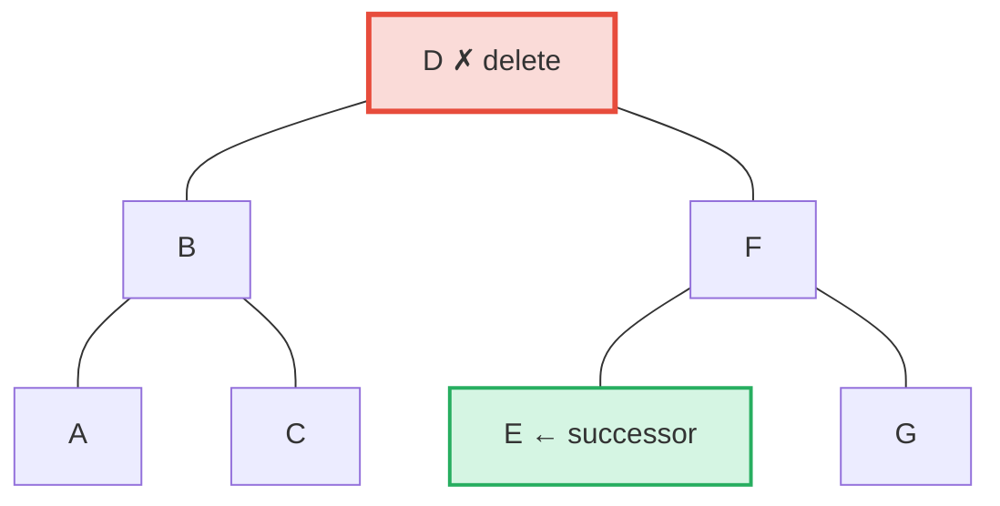

**After** — E (leftmost in right subtree = in-order successor) promoted to D's position:

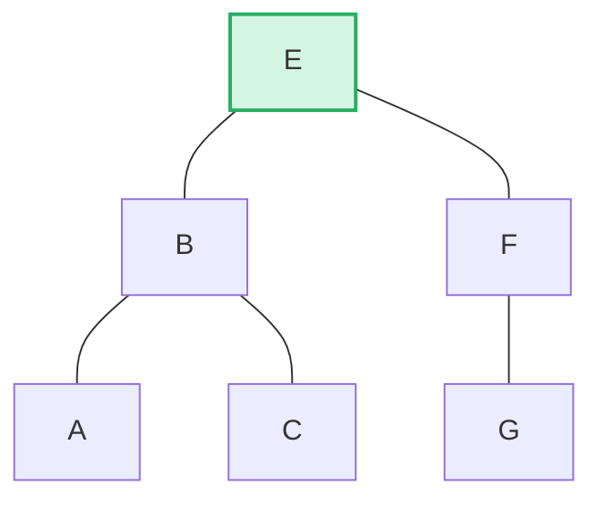

> **Rule:** If left height > right → promote right-edge of left subtree. If right height ≥ left → promote left-edge of right subtree. This minimizes post-deletion rebalancing.

```rust
pub fn remove(self, ...) -> CostResult<Option<Self>, Error> {
    let has_left = tree.link(true).is_some();
    let has_right = tree.link(false).is_some();
    let left = tree.child_height(true) > tree.child_height(false);

    if has_left && has_right {
        // Two children: promote edge of taller child
        let (tree, tall_child) = self.detach_expect(left, ...);
        let (_, short_child) = tree.detach_expect(!left, ...);
        tall_child.promote_edge(!left, short_child, ...)
    } else if has_left || has_right {
        // One child: promote it directly
        self.detach_expect(left, ...).1
    } else {
        // Leaf node: just remove
        None
    }
}
```

---
