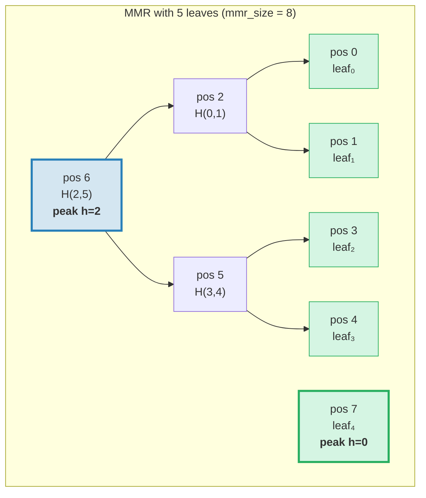
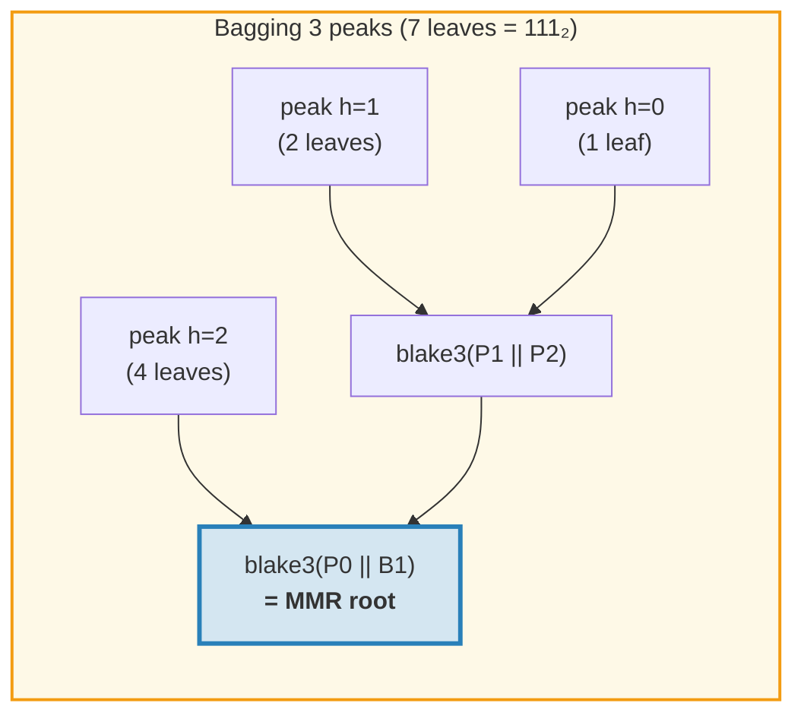
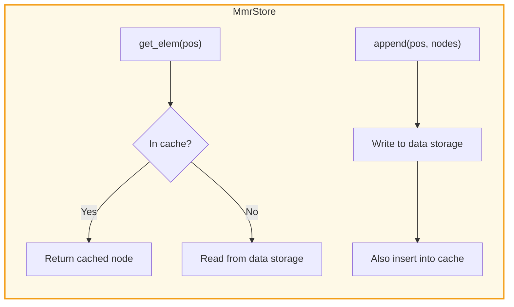
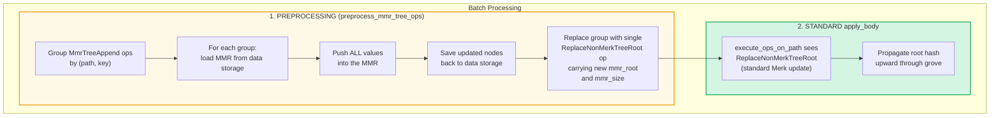
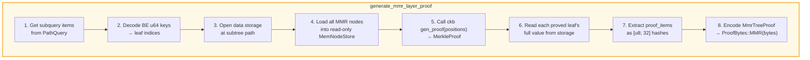
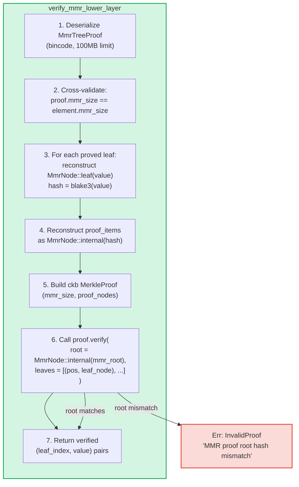

# The MMR Tree — Append-Only Authenticated Logs

The **MmrTree** is GroveDB's append-only authenticated data structure, built on
a Merkle Mountain Range (MMR) with Blake3 hashing. While Merk AVL trees
(Chapter 2) excel at random key-value operations with O(log N) updates, MMRs
are purpose-built for the append-only case: they offer zero rotations, O(1)
amortized hash cost per append, and sequential I/O patterns.

This chapter covers the MMR data structure in depth — how it grows, how nodes
are stored, how appends cascade, and how the proof system lets any third party
verify that a specific value was appended at a specific position.

## Why a Separate Tree Type?

GroveDB's standard Merk trees handle ordered key-value data well, but
append-only logs have different requirements:

| Property | Merk AVL Tree | MMR |
|----------|--------------|-----|
| Operations | Insert, update, delete | Append only |
| Rebalancing | O(log N) rotations per write | None |
| I/O pattern | Random (rebalancing touches many nodes) | Sequential (new nodes always at end) |
| Total hashes for N inserts | O(N log N) | O(N) |
| Structure | Determined by insertion order | Determined only by leaf count |
| Proofs | Path from root to leaf | Sibling + peak hashes |

For use cases like transaction logs, event streams, or any monotonically growing
data, the MMR is strictly better: simpler, faster, and more predictable.

## The MMR Data Structure

An MMR is a **forest of perfect binary trees** (called "peaks") that grows left
to right. Each peak is a complete binary tree of some height *h*, containing
exactly 2^h leaves.

The key insight: **the binary representation of the leaf count determines the
peak structure**. Each 1-bit in the binary form corresponds to one peak:

```text
Leaf count    Binary    Peaks
─────────     ──────    ─────
1             1         one peak h=0
2             10        one peak h=1
3             11        peaks h=1, h=0
4             100       one peak h=2
5             101       peaks h=2, h=0
6             110       peaks h=2, h=1
7             111       peaks h=2, h=1, h=0
8             1000      one peak h=3
```

This means the MMR structure is fully determined by a single number — the leaf
count. Two MMRs with the same number of leaves always have the same shape,
regardless of what values were appended.

## How the MMR Fills Up

Each node in the MMR has a **position** (0-indexed). Leaves and internal nodes
are interleaved in a specific pattern. Here is step-by-step growth:

**After 1 leaf (mmr_size = 1):**
```text
pos:  0
      leaf₀        ← one peak at height 0
```

**After 2 leaves (mmr_size = 3):**
```text
pos:     2          ← internal: blake3(leaf₀.hash || leaf₁.hash)
        / \
       0   1        ← leaves

One peak at height 1. Positions 0 and 1 are leaves, position 2 is internal.
```
When leaf₁ was appended, it created a height-0 peak. But there was already a
height-0 peak (leaf₀), so they **merged** into a height-1 peak.

**After 3 leaves (mmr_size = 4):**
```text
pos:     2     3    ← peak h=1, peak h=0
        / \
       0   1

Two peaks. No merge — heights 1 and 0 are different.
(Binary: 3 = 11₂ → one peak per 1-bit)
```

**After 4 leaves (mmr_size = 7):**
```text
pos:         6              ← internal: merge of nodes 2 and 5
           /   \
         2       5          ← internal nodes
        / \     / \
       0   1   3   4        ← leaves

One peak at height 2.
```
This is where it gets interesting. Appending leaf₃ (position 4) creates node₅
(merging positions 3 and 4). But now node₅ (height 1) and node₂ (height 1)
are equal-height adjacent peaks, so they merge into node₆. **A cascade of two
merges from a single append.**

**After 5 leaves (mmr_size = 8):**
```text
pos:         6         7    ← peak h=2, peak h=0
           /   \
         2       5
        / \     / \
       0   1   3   4

Two peaks. (Binary: 5 = 101₂)
```

**After 7 leaves (mmr_size = 11):**
```text
pos:         6         10    ← peak h=2, peak h=1, peak h=0
           /   \      / \
         2       5   8   9    7
        / \     / \
       0   1   3   4

Three peaks. (Binary: 7 = 111₂)
```

**After 8 leaves (mmr_size = 15):**
```text
pos:              14                     ← single peak h=3
               /      \
            6            13
          /   \        /    \
        2       5    9       12
       / \     / \  / \     / \
      0   1   3  4 7   8  10  11

One peak at height 3. Three cascading merges from appending leaf₇.
```



> **Blue** = peaks (roots of perfect binary subtrees). **Green** = leaf nodes.

## The Merge Cascade

When a new leaf is appended, it may trigger a chain of merges. The number of
merges equals the number of **trailing 1-bits** in the binary representation
of the current leaf count:

| Leaf count (before push) | Binary | trailing 1s | Merges | Total hashes |
|--------------------------|--------|-------------|--------|--------------|
| 0 | `0` | 0 | 0 | 1 (leaf only) |
| 1 | `1` | 1 | 1 | 2 |
| 2 | `10` | 0 | 0 | 1 |
| 3 | `11` | 2 | 2 | 3 |
| 4 | `100` | 0 | 0 | 1 |
| 5 | `101` | 1 | 1 | 2 |
| 6 | `110` | 0 | 0 | 1 |
| 7 | `111` | 3 | 3 | 4 |

**Total hashes per push** = `1 + trailing_ones(leaf_count)`:
- 1 hash for the leaf itself: `blake3(value)`
- N hashes for the merge cascade: `blake3(left.hash || right.hash)` for each
  merge

This is how GroveDB tracks hash costs for each append. The implementation:
```rust
pub fn hash_count_for_push(leaf_count: u64) -> u32 {
    1 + leaf_count.trailing_ones()
}
```

## MMR Size vs Leaf Count

The MMR stores both leaves and internal nodes in a flat position space, so
`mmr_size` is always larger than the leaf count. The exact relationship is:

```text
mmr_size = 2 * leaf_count - popcount(leaf_count)
```

where `popcount` is the number of 1-bits (i.e., the number of peaks). Each
internal node merges two subtrees, reducing the node count by one per merge.

The reverse computation — leaf count from mmr_size — uses the peak positions:

```rust
fn mmr_size_to_leaf_count(mmr_size: u64) -> u64 {
    // Each peak at height h contains 2^h leaves
    get_peaks(mmr_size).iter()
        .map(|&peak_pos| 1u64 << pos_height_in_tree(peak_pos))
        .sum()
}
```

| mmr_size | leaf_count | peaks |
|----------|-----------|-------|
| 0 | 0 | (empty) |
| 1 | 1 | h=0 |
| 3 | 2 | h=1 |
| 4 | 3 | h=1, h=0 |
| 7 | 4 | h=2 |
| 8 | 5 | h=2, h=0 |
| 10 | 6 | h=2, h=1 |
| 11 | 7 | h=2, h=1, h=0 |
| 15 | 8 | h=3 |

GroveDB stores `mmr_size` in the Element (not leaf count) because the ckb MMR
library uses positions internally. The `mmr_tree_leaf_count` operation derives
the leaf count on the fly.

## MMR Root Hash — Bagging the Peaks

An MMR has multiple peaks (one per 1-bit in the leaf count). To produce a
single 32-byte root hash, the peaks are **"bagged"** right-to-left:

```text
root = bag_rhs_peaks(peaks):
    start with rightmost peak
    fold leftward: blake3(left_peak || accumulated_right)
```

With 1 peak, the root is just that peak's hash. With 3 peaks:



> The root hash changes with **every** append, even when no merges occur,
> because the rightmost peak changes and bagging must be recomputed.

## Node Structure and Serialization

Each MMR node is an `MmrNode`:

```rust
struct MmrNode {
    hash: [u8; 32],           // Blake3 hash
    value: Option<Vec<u8>>,   // Some for leaves, None for internal nodes
}
```

**Leaf node:** `hash = blake3(value_bytes)`, `value = Some(value_bytes)`
**Internal node:** `hash = blake3(left.hash || right.hash)`, `value = None`

The merge function is straightforward — concatenate two 32-byte hashes and
Blake3 the result:

```rust
fn blake3_merge(left: &[u8; 32], right: &[u8; 32]) -> [u8; 32] {
    let mut input = [0u8; 64];
    input[..32].copy_from_slice(left);
    input[32..].copy_from_slice(right);
    *blake3::hash(&input).as_bytes()
}
```

> **Note on PartialEq:** `MmrNode` implements `PartialEq` by comparing **only
> the hash field**, not the value. This is critical for proof verification: the
> ckb verifier compares a reconstructed root (value = None) against the expected
> root. If PartialEq compared the value field, single-leaf MMR proofs would
> always fail because the leaf has `value: Some(...)` but the root reconstruction
> produces `value: None`.

**Serialization format:**
```text
Internal: [0x00] [hash: 32 bytes]                                = 33 bytes
Leaf:     [0x01] [hash: 32 bytes] [value_len: 4 BE] [value...]   = 37 + len bytes
```

The flag byte distinguishes internal nodes from leaves. Deserialization validates
exact length — no trailing bytes allowed.

## Storage Architecture

MmrTree stores its nodes in the **data** column (the same column family used
by Merk nodes), not in a child Merk subtree. The Element has no `root_key`
field — the MMR root hash flows as the Merk **child hash** via
`insert_subtree(subtree_root_hash)`, authenticating the MMR state.

**Storage keys** are position-based:
```text
key = 'm' || position_as_be_u64    (9 bytes: prefix + u64 BE)
```

So position 42 is stored at key `[0x6D, 0x00, 0x00, 0x00, 0x00, 0x00, 0x00,
0x00, 0x2A]`.

Looking up leaf *i* requires computing the MMR position first:
`pos = leaf_index_to_pos(i)`, then reading data key `m{pos}`.

**Write-through cache:** During appends, newly written nodes must be
immediately readable for subsequent merges in the same push. Because GroveDB's
transactional storage defers writes to a batch (they aren't visible to reads
until commit), an `MmrStore` adapter wraps the storage context with an
in-memory `HashMap` cache:



This ensures that when appending leaf₃ triggers a merge cascade (creating
internal nodes at positions 5 and 6), node₅ is immediately available when
computing node₆, even though node₅ hasn't been committed to RocksDB yet.

**Root hash propagation to the GroveDB state root:**

```text
combined_value_hash = blake3(
    blake3(varint(len) || element_bytes),   ← value_hash from serialized Element
    mmr_root_hash                           ← child_hash = type-specific root
)
```

The MMR root hash flows as the Merk child hash via `insert_subtree`. Any change
to the MMR state produces a different `combined_value_hash`, which propagates up
through the parent Merk hierarchy all the way to the GroveDB state root.

## GroveDB Operations

MmrTree provides four operations:

```rust
// Append a value — returns (new_mmr_root, leaf_index)
db.mmr_tree_append(path, key, value, tx, version)

// Read the current root hash (from Element, no storage access)
db.mmr_tree_root_hash(path, key, tx, version)

// Get a leaf value by 0-based index
db.mmr_tree_get_value(path, key, leaf_index, tx, version)

// Get the number of leaves appended
db.mmr_tree_leaf_count(path, key, tx, version)
```

### Append Flow

The append operation is the most complex, performing 8 steps:

```mermaid
graph TD
    subgraph append["mmr_tree_append(path, key, value, tx)"]
        A1["1. Read Element at path/key<br/>→ get mmr_size, flags"]
        A2["2. Open data storage at<br/>path/key subtree"]
        A3["3. Create MmrNode::leaf(value)<br/>hash = blake3(value)"]
        A4["4. Push leaf into ckb MMR<br/>→ cascading merges write<br/>new internal nodes"]
        A5["5. Commit → flush new<br/>nodes to storage"]
        A6["6. Bag peaks → new mmr_root"]
        A7["7. Update Element with<br/>new mmr_root and mmr_size"]
        A8["8. Propagate changes up<br/>through GroveDB Merk<br/>hierarchy + commit tx"]

        A1 --> A2 --> A3 --> A4 --> A5 --> A6 --> A7 --> A8
    end

    style append fill:#d5f5e3,stroke:#27ae60,stroke-width:2px
    style A6 fill:#d4e6f1,stroke:#2980b9,stroke-width:2px
```



Step 4 may write 1 node (leaf only) or 1 + N nodes (leaf + N internal merge
nodes). Step 5 calls `mmr.commit()` which flushes the ckb MemStore to the
MmrStore. Step 7 calls `insert_subtree` with the new MMR root as the child hash
(via `subtree_root_hash`), since MmrTree has no child Merk.

### Read Operations

`mmr_tree_root_hash` computes the root from MMR data in storage.
`mmr_tree_leaf_count` derives the leaf count from `mmr_size` in the Element.
No data storage access needed.

`mmr_tree_get_value` computes `pos = leaf_index_to_pos(leaf_index)`, reads
the single data storage entry at `m{pos}`, deserializes the `MmrNode`, and
returns `node.value`.

## Batch Operations

Multiple MMR appends can be batched using `GroveOp::MmrTreeAppend { value }`.
Because the standard batch `execute_ops_on_path` function only has access to
the Merk (not the MMR's storage context), MMR appends use a **preprocessing phase**:



Example: A batch with 3 appends to the same MMR:
```rust
vec![
    QualifiedGroveDbOp { path: p, key: k, op: MmrTreeAppend { value: v1 } },
    QualifiedGroveDbOp { path: p, key: k, op: MmrTreeAppend { value: v2 } },
    QualifiedGroveDbOp { path: p, key: k, op: MmrTreeAppend { value: v3 } },
]
```

Preprocessing loads the MMR once, pushes v1, v2, v3 (creating all intermediate
nodes), saves everything to data storage, then emits a single `ReplaceNonMerkTreeRoot`
with the final `mmr_root` and `mmr_size`. The standard batch machinery handles
the rest.

## Proof Generation

MMR proofs are **V1 proofs** — they use the `ProofBytes::MMR` variant in the
layered proof structure (see §9.6). The proof demonstrates that specific leaf
values exist at specific positions within the MMR, and that their hashes are
consistent with the `mmr_root` stored in the parent element.

### Query Encoding

Query keys encode positions as **big-endian u64 bytes**. This preserves
lexicographic sort order (since BE encoding is monotonic), allowing all standard
`QueryItem` variants to work:

```text
QueryItem::Key([0,0,0,0,0,0,0,5])            → leaf index 5
QueryItem::RangeInclusive([..2]..=[..7])      → leaf indices [2, 3, 4, 5, 6, 7]
QueryItem::RangeFrom([..10]..)                → leaf indices [10, 11, ..., N-1]
QueryItem::RangeFull                          → all leaves [0..leaf_count)
```

A safety cap of **10,000,000 indices** prevents memory exhaustion from
unbounded range queries. An empty MMR (zero leaves) returns an empty proof.

### The MmrTreeProof Structure

```rust
struct MmrTreeProof {
    mmr_size: u64,                 // MMR size at proof time
    leaves: Vec<(u64, Vec<u8>)>,   // (leaf_index, value) for each proved leaf
    proof_items: Vec<[u8; 32]>,    // Sibling/peak hashes for verification
}
```

The `proof_items` contain the minimal set of hashes needed to reconstruct
paths from the proved leaves up to the MMR root. These are the sibling nodes
at each level and the uninvolved peak hashes.

### Generation Flow



Step 4 uses a `MemNodeStore` — a read-only BTreeMap that pre-loads all MMR
nodes from data storage. The ckb proof generator needs random access, so all
nodes must be in memory.

Step 5 is where the ckb library does the heavy lifting: given the MMR size and
the positions to prove, it determines which sibling and peak hashes are needed.

### Worked Example

**Proving leaf 2 in a 5-leaf MMR (mmr_size = 8):**

```text
MMR structure:
pos:         6         7
           /   \
         2       5
        / \     / \
       0   1   3   4

Leaf index 2 → MMR position 3

To verify leaf at position 3:
  1. Hash the claimed value: leaf_hash = blake3(value)
  2. Sibling at position 4:  node₅ = blake3(leaf_hash || proof[pos 4])
  3. Sibling at position 2:  node₆ = blake3(proof[pos 2] || node₅)
  4. Peak at position 7:     root  = bag(node₆, proof[pos 7])
  5. Compare: root == expected mmr_root ✓

proof_items = [hash(pos 4), hash(pos 2), hash(pos 7)]
leaves = [(2, original_value_bytes)]
```

The proof size for this example is: 3 hashes (96 bytes) + 1 leaf value +
metadata. In general, proving K leaves from an N-leaf MMR requires
O(K * log N) sibling hashes.

## Proof Verification

Verification is **pure** — it requires no database access. The verifier needs
only the proof bytes and the expected MMR root hash (which it extracts from the
parent element proven in the Merk layer above).

### Verification Steps



The ckb `MerkleProof::verify` function reconstructs the root from the leaves
and proof items, then compares it (using `PartialEq`, which checks only the
hash) against the expected root.

### Chain of Trust

The full chain from GroveDB state root to a verified leaf value:

```text
GroveDB state_root (known/trusted)
│
├─ V0 Merk proof layer 0: proves subtree exists at root
│   └─ root_hash matches state_root ✓
│
├─ V0 Merk proof layer 1: proves MmrTree element at path/key
│   └─ KVValueHash node: element_bytes contain mmr_root
│   └─ combined_hash = combine_hash(H(element_bytes), mmr_root)
│   └─ root_hash matches parent layer ✓
│
└─ V1 MMR proof: proves leaf values are in the MMR
    └─ Reconstruct paths from leaves through siblings to peaks
    └─ Bag peaks → reconstructed root
    └─ reconstructed root == mmr_root from element_bytes ✓
    └─ Result: leaf₂ = [verified value bytes]
```

### Security Properties

- **mmr_size cross-validation:** The proof's `mmr_size` must match the
  element's `mmr_size`. A mismatch indicates the proof was generated against
  a different state and is rejected.
- **Bincode size limit:** Deserialization uses a 100MB limit to prevent crafted
  length headers from causing huge allocations.
- **Limit accounting:** Each proved leaf decrements the overall query limit by
  1 using `saturating_sub` to prevent underflow.
- **Child hash return:** The verifier returns the computed MMR root as the child
  hash for the combine_hash computation in the parent layer.
- **V0 rejection:** Attempting a subquery into an MmrTree with V0 proofs
  returns `Error::NotSupported`. Only V1 proofs can descend into non-Merk
  trees.

## Cost Tracking

MMR operations track costs with precision:

| Operation | Hash calls | Storage operations |
|-----------|-----------|-------------------|
| Append 1 leaf | `1 + trailing_ones(leaf_count)` | 1 leaf write + N internal writes |
| Root hash | 0 (cached in Element) | 1 Element read |
| Get value | 0 | 1 Element read + 1 data read |
| Leaf count | 0 | 1 Element read |

The hash count formula `1 + trailing_ones(N)` gives the exact number of Blake3
calls: 1 for the leaf hash, plus one merge hash per cascade level.

**Amortized analysis:** Over N appends, the total hash count is:

```text
Σ (1 + trailing_ones(i)) for i = 0..N-1
= N + Σ trailing_ones(i) for i = 0..N-1
= N + (N - popcount(N))
≈ 2N
```

So the amortized cost per append is approximately **2 Blake3 hash calls** —
constant and independent of the tree size. Compare this to Merk AVL trees where
each insert requires O(log N) hashes for the path plus potential rotation
hashes.

**Storage cost:** Each append writes 1 leaf node (37 + value_len bytes) plus
0 to log₂(N) internal nodes (33 bytes each). The amortized storage write per
append is approximately 33 + 37 + value_len bytes ≈ 70 + value_len bytes.

## Implementation Files

| File | Purpose |
|------|---------|
| `grovedb-mmr/src/node.rs` | `MmrNode` struct, Blake3 merge, serialization |
| `grovedb-mmr/src/grove_mmr.rs` | `GroveMmr` wrapper around ckb MMR |
| `grovedb-mmr/src/util.rs` | `mmr_node_key`, `hash_count_for_push`, `mmr_size_to_leaf_count` |
| `grovedb-mmr/src/proof.rs` | `MmrTreeProof` generation and verification |
| `grovedb-mmr/src/dense_merkle.rs` | Dense Merkle tree roots (used by BulkAppendTree) |
| `grovedb/src/operations/mmr_tree.rs` | GroveDB operations + `MmrStore` adapter + batch preprocessing |
| `grovedb/src/operations/proof/generate.rs` | V1 proof generation: `generate_mmr_layer_proof`, `query_items_to_leaf_indices` |
| `grovedb/src/operations/proof/verify.rs` | V1 proof verification: `verify_mmr_lower_layer` |
| `grovedb/src/tests/mmr_tree_tests.rs` | 28 integration tests |

## Comparison with Other Authenticated Structures

| | MMR (MmrTree) | Merk AVL (Tree) | Sinsemilla (CommitmentTree) |
|---|---|---|---|
| **Use case** | Append-only logs | Key-value store | ZK-friendly commitments |
| **Hash function** | Blake3 | Blake3 | Sinsemilla (Pallas curve) |
| **Operations** | Append, read by index | Insert, update, delete, query | Append, witness |
| **Amortized hash/write** | ~2 | O(log N) | ~33 (32 levels + ommers) |
| **Proof type** | V1 (MMR sibling hashes) | V0 (Merk path proof) | Witness (Merkle auth path) |
| **ZK-friendly** | No | No | Yes (Halo 2 circuits) |
| **Rebalancing** | None | AVL rotations | None |
| **Delete support** | No | Yes | No |

---
