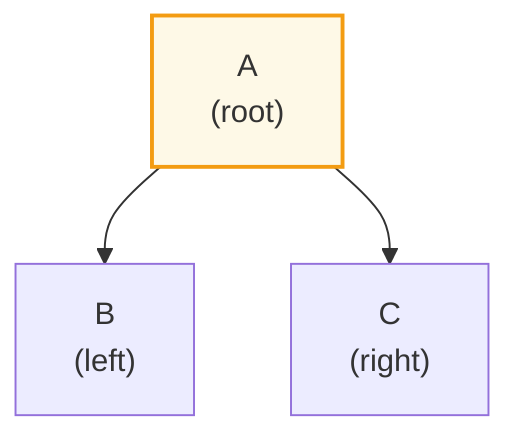
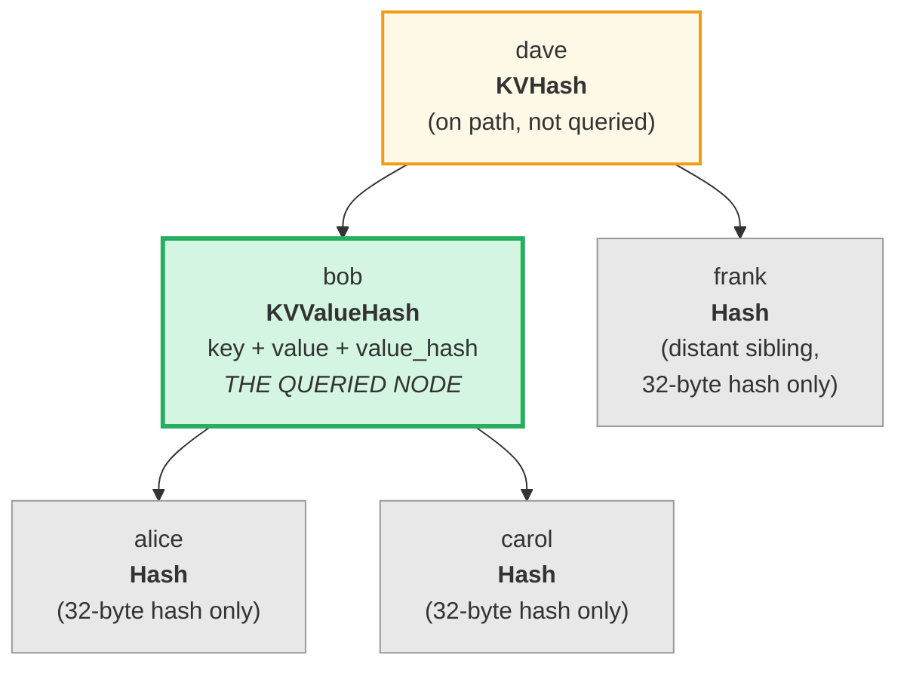
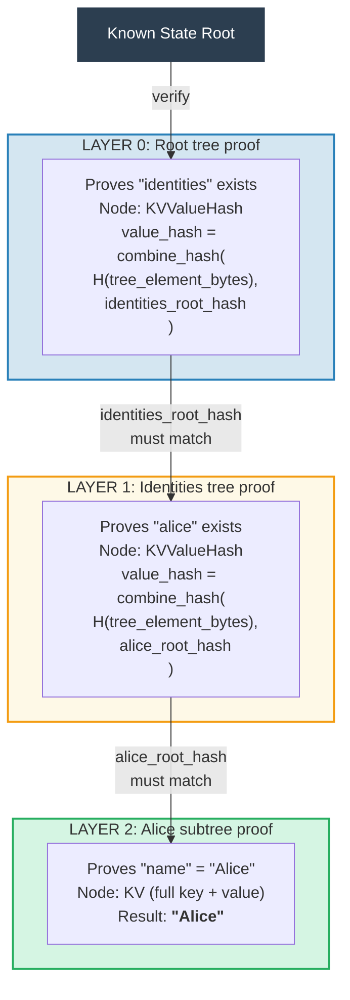
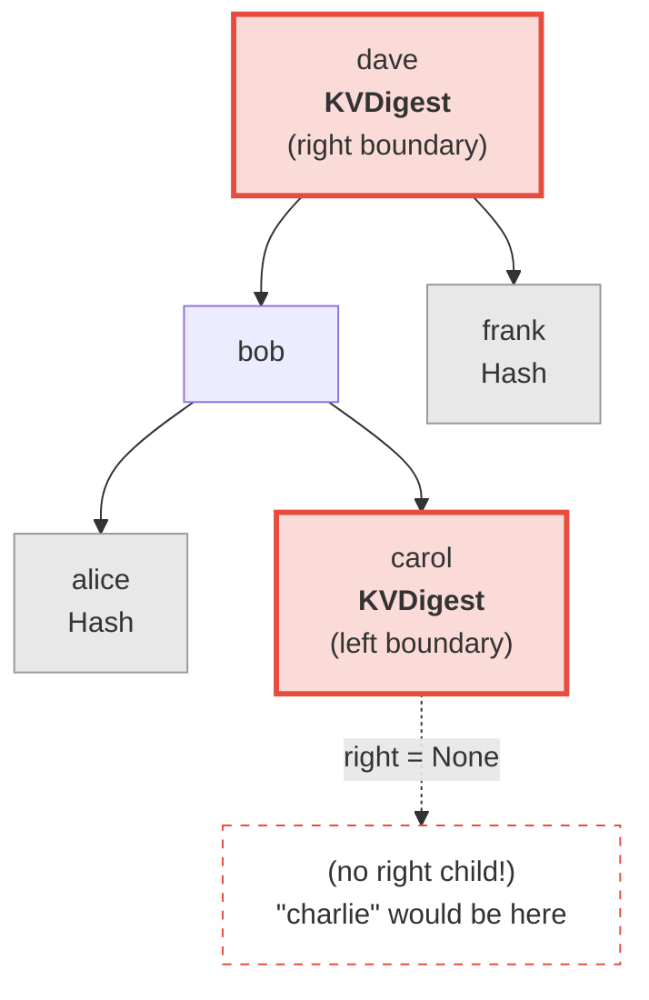
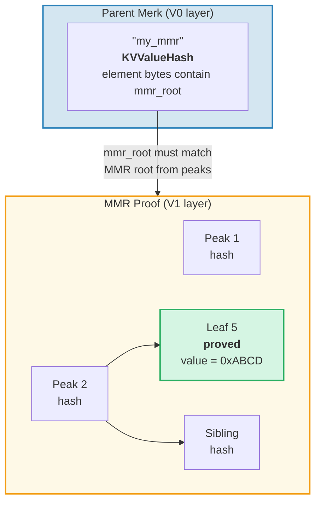
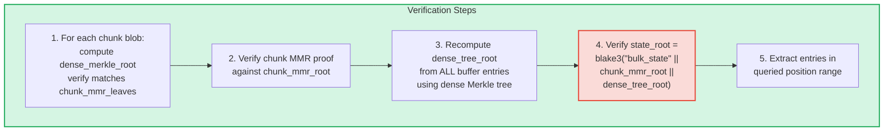
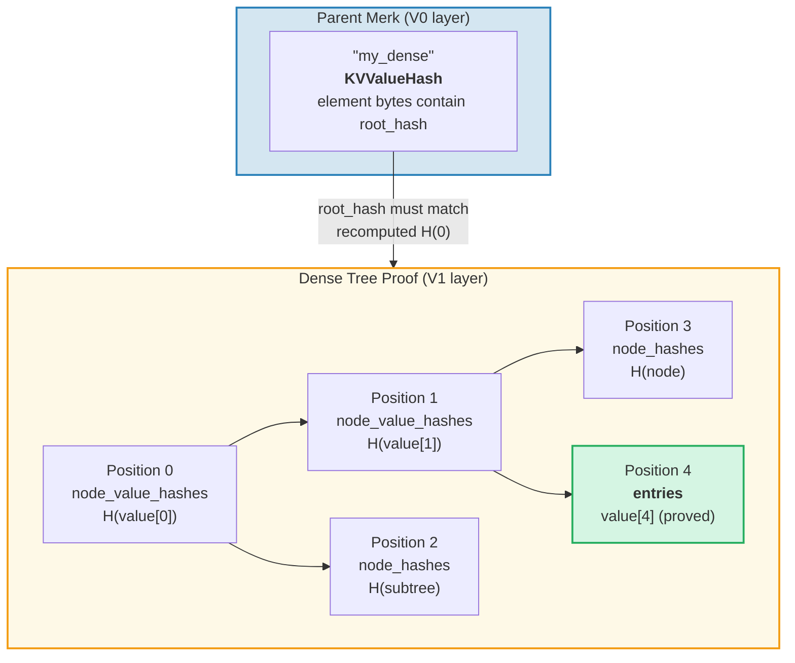

# The Proof System

GroveDB's proof system lets any party verify the correctness of query results
without having the full database. A proof is a compact representation of the
relevant tree structure that allows reconstruction of the root hash.

## Stack-Based Proof Operations

Proofs are encoded as a sequence of **operations** that reconstruct a partial tree
using a stack machine:

```rust
// merk/src/proofs/mod.rs
pub enum Op {
    Push(Node),        // Push a node onto the stack (ascending key order)
    PushInverted(Node),// Push a node (descending key order)
    Parent,            // Pop parent, pop child → attach child as LEFT of parent
    Child,             // Pop child, pop parent → attach child as RIGHT of parent
    ParentInverted,    // Pop parent, pop child → attach child as RIGHT of parent
    ChildInverted,     // Pop child, pop parent → attach child as LEFT of parent
}
```

Execution uses a stack:

Proof ops: `Push(B), Push(A), Parent, Push(C), Child`

| Step | Operation | Stack (top→right) | Action |
|------|-----------|-------------------|--------|
| 1 | Push(B) | [ B ] | Push B onto stack |
| 2 | Push(A) | [ B , A ] | Push A onto stack |
| 3 | Parent | [ A{left:B} ] | Pop A (parent), pop B (child), B → LEFT of A |
| 4 | Push(C) | [ A{left:B} , C ] | Push C onto stack |
| 5 | Child | [ A{left:B, right:C} ] | Pop C (child), pop A (parent), C → RIGHT of A |

Final result — one tree on the stack:



> The verifier computes `node_hash(A) = Blake3(kv_hash_A || node_hash_B || node_hash_C)` and checks it matches the expected root hash.

This is the `execute` function (`merk/src/proofs/tree.rs`):

```rust
pub fn execute<I, F>(ops: I, collapse: bool, mut visit_node: F) -> CostResult<Tree, Error>
where
    I: IntoIterator<Item = Result<Op, Error>>,
    F: FnMut(&Node) -> Result<(), Error>,
{
    let mut stack: Vec<Tree> = Vec::with_capacity(32);

    for op in ops {
        match op? {
            Op::Parent => {
                let (mut parent, child) = (try_pop(&mut stack), try_pop(&mut stack));
                parent.left = Some(Child { tree: Box::new(child), hash: child.hash() });
                stack.push(parent);
            }
            Op::Child => {
                let (child, mut parent) = (try_pop(&mut stack), try_pop(&mut stack));
                parent.right = Some(Child { tree: Box::new(child), hash: child.hash() });
                stack.push(parent);
            }
            Op::Push(node) => {
                visit_node(&node)?;
                stack.push(Tree::from(node));
            }
            // ... Inverted variants swap left/right
        }
    }
    // Final item on stack is the root
}
```

## Node Types in Proofs

Each `Push` carries a `Node` that contains just enough information for
verification:

```rust
pub enum Node {
    // Minimum info — just the hash. Used for distant siblings.
    Hash(CryptoHash),

    // KV hash for nodes on the path but not queried.
    KVHash(CryptoHash),

    // Full key-value for queried items.
    KV(Vec<u8>, Vec<u8>),

    // Key, value, and pre-computed value_hash.
    // Used for subtrees where value_hash = combine_hash(...)
    KVValueHash(Vec<u8>, Vec<u8>, CryptoHash),

    // KV with feature type — for ProvableCountTree or chunk restoration.
    KVValueHashFeatureType(Vec<u8>, Vec<u8>, CryptoHash, TreeFeatureType),

    // Reference: key, dereferenced value, hash of reference element.
    KVRefValueHash(Vec<u8>, Vec<u8>, CryptoHash),

    // For items in ProvableCountTree.
    KVCount(Vec<u8>, Vec<u8>, u64),

    // KV hash + count for non-queried ProvableCountTree nodes.
    KVHashCount(CryptoHash, u64),

    // Reference in ProvableCountTree.
    KVRefValueHashCount(Vec<u8>, Vec<u8>, CryptoHash, u64),

    // For boundary/absence proofs in ProvableCountTree.
    KVDigestCount(Vec<u8>, CryptoHash, u64),

    // Key + value_hash for absence proofs (regular trees).
    KVDigest(Vec<u8>, CryptoHash),
}
```

The choice of Node type determines what information the verifier needs:

**Query: "Get value for key 'bob'"**



> Green = queried node (full data revealed). Yellow = on the path (kv_hash only). Gray = siblings (just 32-byte node hashes).

Encoded as proof ops:

| # | Op | Effect |
|---|----|----|
| 1 | Push(Hash(alice_node_hash)) | Push alice hash |
| 2 | Push(KVValueHash("bob", value, value_hash)) | Push bob with full data |
| 3 | Parent | alice becomes left child of bob |
| 4 | Push(Hash(carol_node_hash)) | Push carol hash |
| 5 | Child | carol becomes right child of bob |
| 6 | Push(KVHash(dave_kv_hash)) | Push dave kv_hash |
| 7 | Parent | bob subtree becomes left of dave |
| 8 | Push(Hash(frank_node_hash)) | Push frank hash |
| 9 | Child | frank becomes right child of dave |

## Multi-Layer Proof Generation

Since GroveDB is a tree of trees, proofs span multiple layers. Each layer proves
the relevant portion of one Merk tree, and the layers are connected by the
combined value_hash mechanism:

**Query:** `Get ["identities", "alice", "name"]`



> **Chain of trust:** `known_state_root → verify Layer 0 → verify Layer 1 → verify Layer 2 → "Alice"`. Each layer's reconstructed root hash must match the value_hash from the layer above.

The verifier checks each layer, confirming that:
1. The layer proof reconstructs to the expected root hash
2. The root hash matches the value_hash from the parent layer
3. The top-level root hash matches the known state root

## Proof Verification

Verification follows the proof layers bottom-up or top-down, using the `execute`
function to reconstruct each layer's tree. The `Tree::hash()` method in the proof
tree computes the hash based on the node type:

```rust
impl Tree {
    pub fn hash(&self) -> CostContext<CryptoHash> {
        match &self.node {
            Node::Hash(hash) => *hash,  // Already a hash, return directly

            Node::KVHash(kv_hash) =>
                node_hash(kv_hash, &self.child_hash(true), &self.child_hash(false)),

            Node::KV(key, value) =>
                kv_hash(key, value)
                    .flat_map(|kv_hash| node_hash(&kv_hash, &left, &right)),

            Node::KVValueHash(key, _, value_hash) =>
                kv_digest_to_kv_hash(key, value_hash)
                    .flat_map(|kv_hash| node_hash(&kv_hash, &left, &right)),

            Node::KVValueHashFeatureType(key, _, value_hash, feature_type) => {
                let kv = kv_digest_to_kv_hash(key, value_hash);
                match feature_type {
                    ProvableCountedMerkNode(count) =>
                        node_hash_with_count(&kv, &left, &right, *count),
                    _ => node_hash(&kv, &left, &right),
                }
            }

            Node::KVRefValueHash(key, referenced_value, ref_element_hash) => {
                let ref_value_hash = value_hash(referenced_value);
                let combined = combine_hash(ref_element_hash, &ref_value_hash);
                let kv = kv_digest_to_kv_hash(key, &combined);
                node_hash(&kv, &left, &right)
            }
            // ... other variants
        }
    }
}
```

## Absence Proofs

GroveDB can prove that a key does **not** exist. This uses boundary nodes —
the nodes that would be adjacent to the missing key if it existed:

**Prove:** "charlie" does NOT exist



> **Binary search:** alice < bob < carol < **"charlie"** < dave < frank. "charlie" would be between carol and dave. Carol's right child is `None`, proving nothing exists between carol and dave. Therefore "charlie" cannot exist in this tree.

For range queries, absence proofs show that there are no keys within the queried
range that were not included in the result set.

## V1 Proofs — Non-Merk Trees

The V0 proof system works exclusively with Merk subtrees, descending layer by
layer through the grove hierarchy. However, **CommitmentTree**, **MmrTree**,
**BulkAppendTree**, and **DenseAppendOnlyFixedSizeTree** elements store their data
outside a child Merk tree. They have no child Merk to descend into — their
type-specific root hash flows as the Merk child hash instead.

The **V1 proof format** extends V0 to handle these non-Merk trees with
type-specific proof structures:

```rust
/// Which proof format a layer uses.
pub enum ProofBytes {
    Merk(Vec<u8>),            // Standard Merk proof ops
    MMR(Vec<u8>),             // MMR membership proof
    BulkAppendTree(Vec<u8>),  // BulkAppendTree range proof
    DenseTree(Vec<u8>),       // Dense tree inclusion proof
    CommitmentTree(Vec<u8>),  // Sinsemilla root (32 bytes) + BulkAppendTree proof
}

/// One layer of a V1 proof.
pub struct LayerProof {
    pub merk_proof: ProofBytes,
    pub lower_layers: BTreeMap<Vec<u8>, LayerProof>,
}
```

**V0/V1 selection rule:** If every layer in the proof is a standard Merk tree,
`prove_query` produces a `GroveDBProof::V0` (backward compatible). If any layer
involves an MmrTree, BulkAppendTree, or DenseAppendOnlyFixedSizeTree, it produces
`GroveDBProof::V1`.

### How Non-Merk Tree Proofs Bind to the Root Hash

The parent Merk tree proves the element's serialized bytes via a standard Merk
proof node (`KVValueHash`). The type-specific root (e.g., `mmr_root` or
`state_root`) flows as the Merk **child hash** — it is NOT embedded in the
element bytes:

```text
combined_value_hash = combine_hash(
    Blake3(varint(len) || element_bytes),   ← contains count, height, etc.
    type_specific_root                      ← mmr_root / state_root / dense_root
)
```

The type-specific proof then proves that the queried data is consistent with
the type-specific root that was used as the child hash.

### MMR Tree Proofs

An MMR proof demonstrates that specific leaves exist at known positions within
the MMR, and that the MMR's root hash matches the child hash stored in the
parent Merk node:

```rust
pub struct MmrProof {
    pub mmr_size: u64,
    pub proof: MerkleProof,  // ckb_merkle_mountain_range::MerkleProof
    pub leaves: Vec<MmrProofLeaf>,
}

pub struct MmrProofLeaf {
    pub position: u64,       // MMR position
    pub leaf_index: u64,     // Logical leaf index
    pub hash: [u8; 32],      // Leaf hash
    pub value: Vec<u8>,      // Leaf value bytes
}
```



**Query keys are positions:** Query items encode positions as big-endian u64
bytes (which preserves sort order). `QueryItem::RangeInclusive` with BE-encoded
start/end positions selects a contiguous range of MMR leaves.

**Verification:**
1. Reconstruct `MmrNode` leaves from the proof
2. Verify the ckb `MerkleProof` against the expected MMR root from the parent Merk child hash
3. Cross-validate that `proof.mmr_size` matches the element's stored size
4. Return the proved leaf values

### BulkAppendTree Proofs

BulkAppendTree proofs are more complex because data lives in two places: sealed
chunk blobs and the in-progress buffer. A range proof must return:

- **Full chunk blobs** for any completed chunk overlapping the query range
- **Individual buffer entries** for positions still in the buffer

```rust
pub struct BulkAppendTreeProof {
    pub chunk_power: u8,
    pub total_count: u64,
    pub chunk_blobs: Vec<(u64, Vec<u8>)>,       // (chunk_index, blob_bytes)
    pub chunk_mmr_size: u64,
    pub chunk_mmr_proof_items: Vec<[u8; 32]>,    // MMR sibling hashes
    pub chunk_mmr_leaves: Vec<(u64, [u8; 32])>,  // (mmr_pos, dense_merkle_root)
    pub buffer_entries: Vec<Vec<u8>>,             // ALL current buffer (dense tree) entries
    pub chunk_mmr_root: [u8; 32],
}
```



> **Why include ALL buffer entries?** The buffer is a dense Merkle tree whose root
> hash commits to every entry. To verify the `dense_tree_root`, the verifier must
> rebuild the tree from all entries. Since the buffer is bounded by `capacity`
> entries (at most 65,535), this is acceptable.

**Limit accounting:** Each individual value (within a chunk or the buffer) counts
toward the query limit, not each chunk blob as a whole. If a query has
`limit: 100` and a chunk contains 1024 entries with 500 overlapping the range,
all 500 entries count toward the limit.

### DenseAppendOnlyFixedSizeTree Proofs

A dense tree proof demonstrates that specific positions hold specific values,
authenticated against the tree's root hash (which flows as the Merk child hash).
All nodes use `blake3(H(value) || H(left) || H(right))`, so ancestor nodes on the
auth path only need their 32-byte **value hash** — not the full value.

```rust
pub struct DenseTreeProof {
    pub entries: Vec<(u16, Vec<u8>)>,            // proved (position, value)
    pub node_value_hashes: Vec<(u16, [u8; 32])>, // ancestor value hashes on auth path
    pub node_hashes: Vec<(u16, [u8; 32])>,       // precomputed sibling subtree hashes
}
```

> `height` and `count` come from the parent Element (authenticated by the Merk hierarchy), not the proof.



**Verification** is a pure function requiring no storage:
1. Build lookup maps from `entries`, `node_value_hashes`, and `node_hashes`
2. Recursively recompute the root hash from position 0:
   - Position has precomputed hash in `node_hashes` → use it directly
   - Position with value in `entries` → `blake3(blake3(value) || H(left) || H(right))`
   - Position with hash in `node_value_hashes` → `blake3(hash || H(left) || H(right))`
   - Position `>= count` or `>= capacity` → `[0u8; 32]`
3. Compare computed root with expected root hash from parent element
4. Return proved entries on success

**Multi-position proofs** merge overlapping auth paths: shared ancestors and their
values appear only once, making them more compact than independent proofs.

---

