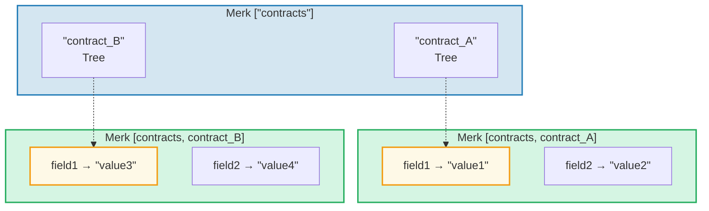
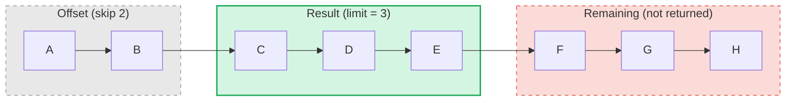

# The Query System

## PathQuery Structure

GroveDB queries use the `PathQuery` type, which combines a path (where to look)
with a query (what to select):

```rust
pub struct PathQuery {
    pub path: Vec<Vec<u8>>,         // Starting path in the grove
    pub query: SizedQuery,          // What to select
}

pub struct SizedQuery {
    pub query: Query,               // The selection criteria
    pub limit: Option<u16>,         // Maximum number of results
    pub offset: Option<u16>,        // Skip first N results
}
```

## The Query Type

```rust
pub struct Query {
    pub items: Vec<QueryItem>,              // What to match
    pub default_subquery_branch: SubqueryBranch,
    pub conditional_subquery_branches: Option<IndexMap<QueryItem, SubqueryBranch>>,
    pub left_to_right: bool,                // Iteration direction
    pub add_parent_tree_on_subquery: bool,  // Include parent tree element in results (v2)
}
```

> **`add_parent_tree_on_subquery`** (v2): When `true`, the parent tree element (e.g.,
> a CountTree or SumTree) is included in query results alongside its children's values.
> This lets you retrieve both aggregate values and individual elements in one query.

## QueryItems — What to Select

Each `QueryItem` specifies a key or range to match:

```rust
pub enum QueryItem {
    Key(Vec<u8>),                           // Exact key match
    Range(Range<Vec<u8>>),                  // Exclusive range [start..end)
    RangeInclusive(RangeInclusive<Vec<u8>>),// Inclusive range [start..=end]
    RangeFull(RangeFull),                   // All keys
    RangeFrom(RangeFrom<Vec<u8>>),          // [start..)
    RangeTo(RangeTo<Vec<u8>>),              // [..end)
    RangeToInclusive(RangeToInclusive<Vec<u8>>), // [..=end]
    RangeAfter(RangeFrom<Vec<u8>>),         // (start..) exclusive start
    RangeAfterTo(Range<Vec<u8>>),           // (start..end) exclusive both
    RangeAfterToInclusive(RangeInclusive<Vec<u8>>), // (start..=end]
}
```

Example queries:

Merk tree (sorted): `alice  bob  carol  dave  eve  frank`

| Query | Selection | Result |
|-------|-----------|--------|
| `Key("bob")` | alice **[bob]** carol dave eve frank | bob |
| `RangeInclusive("bob"..="dave")` | alice **[bob carol dave]** eve frank | bob, carol, dave |
| `RangeAfter("carol"..)` | alice bob carol **[dave eve frank]** | dave, eve, frank |
| `RangeFull`, limit=2 | **[alice bob]** carol dave eve frank *(stopped by limit)* | alice, bob |
| `RangeFull`, limit=2, right-to-left | alice bob carol dave **[eve frank]** *(stopped by limit)* | frank, eve |

## Subqueries and Conditional Branches

The real power of GroveDB queries is **subqueries** — when a query matches a Tree
element, the query can automatically descend into that subtree:



> **PathQuery:** `path: ["contracts"], query: RangeFull` with `default_subquery: Key("field1")`
>
> **Execution:**
> 1. `RangeFull` on ["contracts"] → matches contract_A, contract_B
> 2. Both are Tree elements → descend with subquery `Key("field1")`
> 3. contract_A → "value1", contract_B → "value3"
>
> **Result:** `["value1", "value3"]`

**Conditional subqueries** let you apply different subqueries based on which key
was matched:

```rust
conditional_subquery_branches: Some(indexmap! {
    QueryItem::Key(b"contract_A".to_vec()) => SubqueryBranch {
        subquery: Some(Query { items: vec![Key(b"field1".to_vec())] }),
        ..
    },
    QueryItem::Key(b"contract_B".to_vec()) => SubqueryBranch {
        subquery: Some(Query { items: vec![Key(b"field2".to_vec())] }),
        ..
    },
})
```

This would get `field1` from `contract_A` but `field2` from `contract_B`.

## Sized Queries — Limit and Offset

The `SizedQuery` wrapper adds pagination:



> `SizedQuery { query: RangeFull, limit: Some(3), offset: Some(2) }` → Result: **[C, D, E]**

When combined with `left_to_right: false`, the iteration is reversed:

```text
    SizedQuery {
        query: Query { items: [RangeFull], left_to_right: false, .. },
        limit: Some(3),
        offset: None
    }

    Result: [H, G, F]
```

## Query Merging

Multiple PathQueries can be merged into a single query for efficiency. The merge
algorithm finds common path prefixes and combines query items:

```text
    Query A: path=["users"], query=Key("alice")
    Query B: path=["users"], query=Key("bob")

    Merged:  path=["users"], query=items=[Key("alice"), Key("bob")]
```

---
