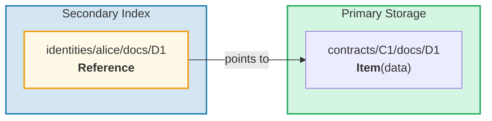
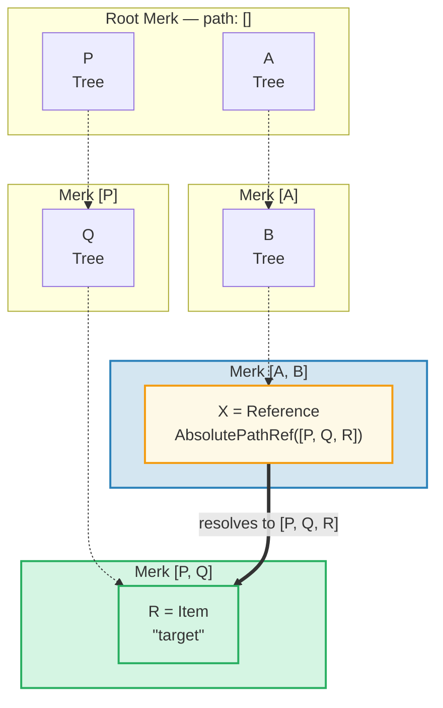
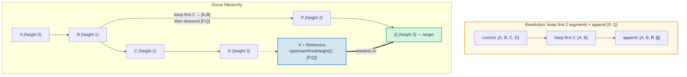
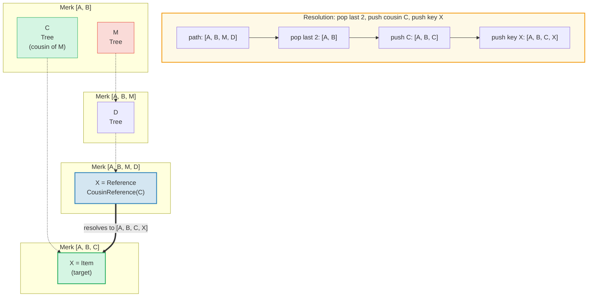
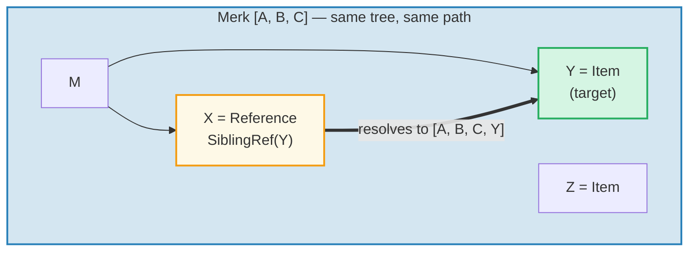
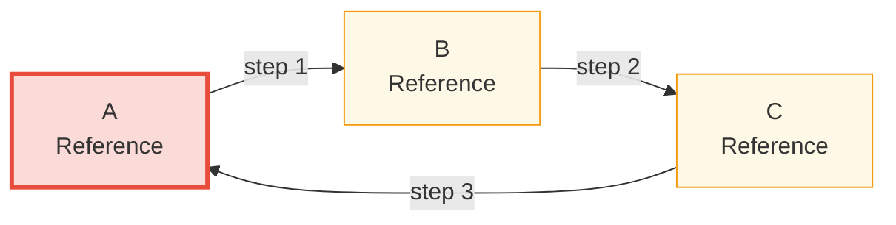

# The Reference System

## Why References Exist

In a hierarchical database, you often need the same data accessible from multiple
paths. For example, documents might be stored under their contract but also
queryable by owner identity. **References** are GroveDB's answer — they are
pointers from one location to another, similar to symbolic links in a filesystem.



Key properties:
- References are **authenticated** — the reference's value_hash includes both the
  reference itself and the referenced element
- References can be **chained** — a reference can point to another reference
- Cycle detection prevents infinite loops
- A configurable hop limit prevents resource exhaustion

## The Seven Reference Types

```rust
// grovedb-element/src/reference_path/mod.rs
pub enum ReferencePathType {
    AbsolutePathReference(Vec<Vec<u8>>),
    UpstreamRootHeightReference(u8, Vec<Vec<u8>>),
    UpstreamRootHeightWithParentPathAdditionReference(u8, Vec<Vec<u8>>),
    UpstreamFromElementHeightReference(u8, Vec<Vec<u8>>),
    CousinReference(Vec<u8>),
    RemovedCousinReference(Vec<Vec<u8>>),
    SiblingReference(Vec<u8>),
}
```

Let's walk through each with diagrams.

### AbsolutePathReference

The simplest type. Stores the full path to the target:



> X stores the full absolute path `[P, Q, R]`. No matter where X is located, it always resolves to the same target.

### UpstreamRootHeightReference

Keeps the first N segments of the current path, then appends a new path:



### UpstreamRootHeightWithParentPathAdditionReference

Like UpstreamRootHeight, but re-appends the last segment of the current path:

```text
    Reference at path [A, B, C, D, E] key=X
    UpstreamRootHeightWithParentPathAdditionReference(2, [P, Q])

    Current path:    [A, B, C, D, E]
    Keep first 2:    [A, B]
    Append [P, Q]:   [A, B, P, Q]
    Re-append last:  [A, B, P, Q, E]   ← "E" from original path added back

    Useful for: indexes where the parent key should be preserved
```

### UpstreamFromElementHeightReference

Discards the last N segments, then appends:

```text
    Reference at path [A, B, C, D] key=X
    UpstreamFromElementHeightReference(1, [P, Q])

    Current path:     [A, B, C, D]
    Discard last 1:   [A, B, C]
    Append [P, Q]:    [A, B, C, P, Q]
```

### CousinReference

Replaces only the immediate parent with a new key:



> The "cousin" is a sibling subtree of the reference's grandparent. The reference navigates up two levels, then descends into the cousin subtree.

### RemovedCousinReference

Like CousinReference but replaces the parent with a multi-segment path:

```text
    Reference at path [A, B, C, D] key=X
    RemovedCousinReference([M, N])

    Current path:  [A, B, C, D]
    Pop parent C:  [A, B]
    Append [M, N]: [A, B, M, N]
    Push key X:    [A, B, M, N, X]
```

### SiblingReference

The simplest relative reference — just changes the key within the same parent:



> The simplest reference type. X and Y are siblings in the same Merk tree — the resolution just changes the key while keeping the same path.

## Reference Following and the Hop Limit

When GroveDB encounters a Reference element, it must **follow** it to find the
actual value. Since references can point to other references, this involves a loop:

```rust
// grovedb/src/reference_path.rs
pub const MAX_REFERENCE_HOPS: usize = 10;

pub fn follow_reference(...) -> CostResult<ResolvedReference, Error> {
    let mut hops_left = MAX_REFERENCE_HOPS;
    let mut visited = HashSet::new();

    while hops_left > 0 {
        // Resolve reference path to absolute path
        let target_path = current_ref.absolute_qualified_path(...);

        // Check for cycles
        if !visited.insert(target_path.clone()) {
            return Err(Error::CyclicReference);
        }

        // Fetch element at target
        let element = Element::get(target_path);

        match element {
            Element::Reference(next_ref, ..) => {
                // Still a reference — keep following
                current_ref = next_ref;
                hops_left -= 1;
            }
            other => {
                // Found the actual element!
                return Ok(ResolvedReference { element: other, ... });
            }
        }
    }

    Err(Error::ReferenceLimit)  // Exceeded 10 hops
}
```

## Cycle Detection

The `visited` HashSet tracks all paths we've seen. If we encounter a path we've
already visited, we have a cycle:



> **Cycle detection trace:**
>
> | Step | Follow | visited set | Result |
> |------|--------|-------------|--------|
> | 1 | Start at A | { A } | A is Ref → follow |
> | 2 | A → B | { A, B } | B is Ref → follow |
> | 3 | B → C | { A, B, C } | C is Ref → follow |
> | 4 | C → A | A already in visited! | **Error::CyclicRef** |
>
> Without cycle detection, this would loop forever. `MAX_REFERENCE_HOPS = 10` also caps traversal depth for long chains.

## References in Merk — Combined Value Hashes

When a Reference is stored in a Merk tree, its `value_hash` must authenticate
both the reference structure and the referenced data:

```rust
// merk/src/tree/kv.rs
pub fn update_hashes_using_reference_value_hash(
    mut self,
    reference_value_hash: CryptoHash,
) -> CostContext<Self> {
    // Hash the reference element's own bytes
    let actual_value_hash = value_hash(self.value_as_slice());

    // Combine: H(reference_bytes) ⊕ H(referenced_data)
    let combined = combine_hash(&actual_value_hash, &reference_value_hash);

    self.value_hash = combined;
    self.hash = kv_digest_to_kv_hash(self.key(), self.value_hash());
    // ...
}
```

This means changing either the reference itself OR the data it points to will
change the root hash — both are cryptographically bound.

---

