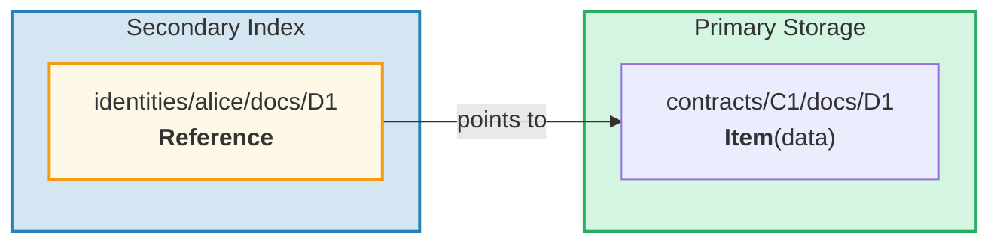
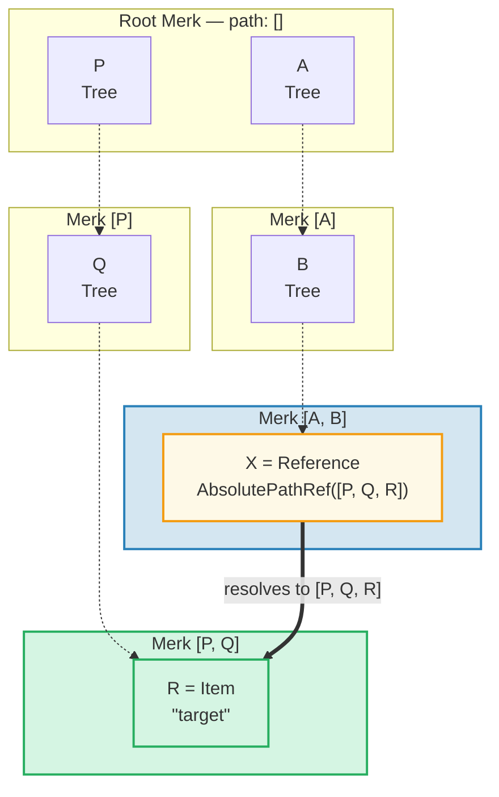
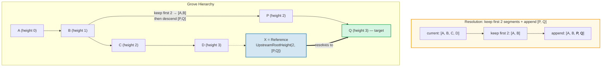
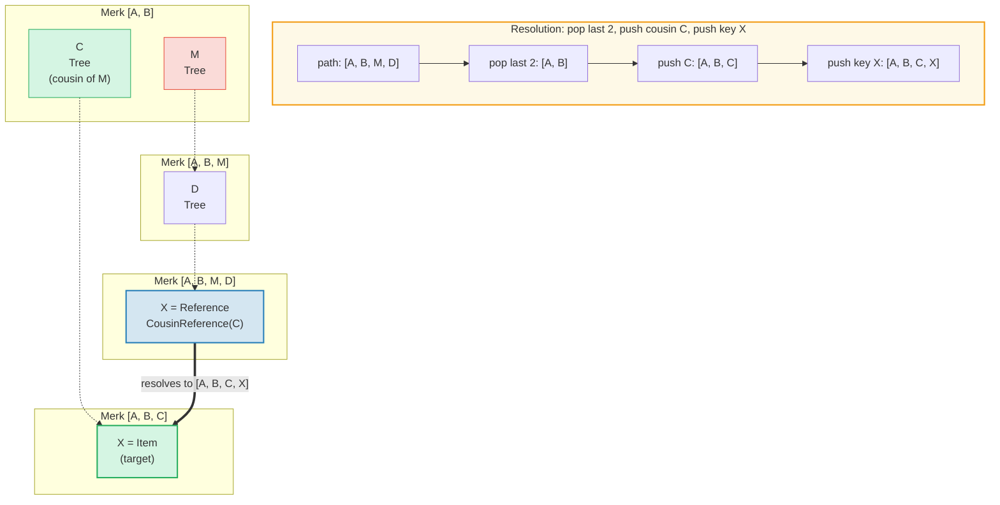
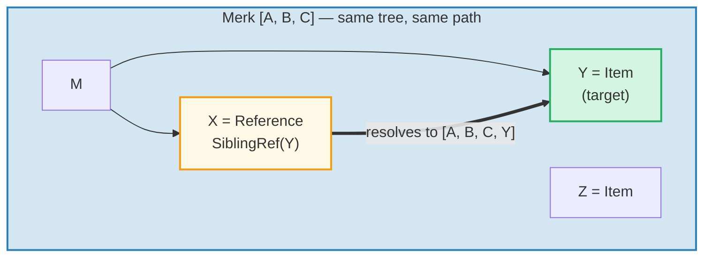
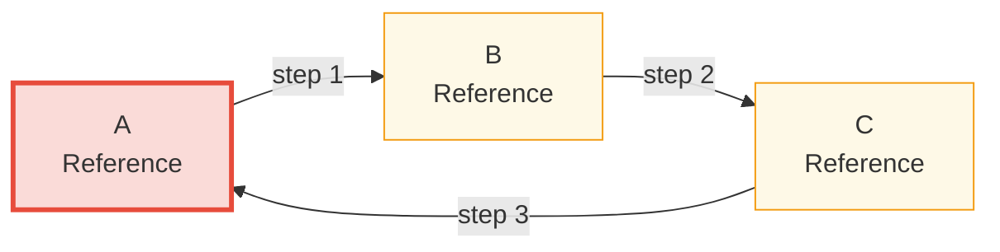

# The Reference System

## Why References Exist

In a hierarchical database, you often need the same data accessible from multiple
paths. For example, documents might be stored under their contract but also
queryable by owner identity. **References** are GroveDB's answer — they are
pointers from one location to another, similar to symbolic links in a filesystem.


```mermaid
graph LR
    subgraph primary["Primary Storage"]
        item["contracts/C1/docs/D1<br/><b>Item</b>(data)"]
    end
    subgraph secondary["Secondary Index"]
        ref["identities/alice/docs/D1<br/><b>Reference</b>"]
    end
    ref -->|"points to"| item

    style primary fill:#d5f5e3,stroke:#27ae60,stroke-width:2px
    style secondary fill:#d4e6f1,stroke:#2980b9,stroke-width:2px
    style ref fill:#fef9e7,stroke:#f39c12,stroke-width:2px
```

Key properties:
- References are **authenticated** — the reference's value_hash includes both the
  reference itself and the referenced element
- References can be **chained** — a reference can point to another reference
- Cycle detection prevents infinite loops
- A configurable hop limit prevents resource exhaustion

## The Seven Reference Types

```rust
// grovedb-element/src/reference_path/mod.rs
pub enum ReferencePathType {
    AbsolutePathReference(Vec<Vec<u8>>),
    UpstreamRootHeightReference(u8, Vec<Vec<u8>>),
    UpstreamRootHeightWithParentPathAdditionReference(u8, Vec<Vec<u8>>),
    UpstreamFromElementHeightReference(u8, Vec<Vec<u8>>),
    CousinReference(Vec<u8>),
    RemovedCousinReference(Vec<Vec<u8>>),
    SiblingReference(Vec<u8>),
}
```

Let's walk through each with diagrams.

### AbsolutePathReference

The simplest type. Stores the full path to the target:


```mermaid
graph TD
    subgraph root["Root Merk — path: []"]
        A["A<br/>Tree"]
        P["P<br/>Tree"]
    end

    subgraph merkA["Merk [A]"]
        B["B<br/>Tree"]
    end

    subgraph merkP["Merk [P]"]
        Q["Q<br/>Tree"]
    end

    subgraph merkAB["Merk [A, B]"]
        X["X = Reference<br/>AbsolutePathRef([P, Q, R])"]
    end

    subgraph merkPQ["Merk [P, Q]"]
        R["R = Item<br/>&quot;target&quot;"]
    end

    A -.-> B
    P -.-> Q
    B -.-> X
    Q -.-> R
    X ==>|"resolves to [P, Q, R]"| R

    style merkAB fill:#d4e6f1,stroke:#2980b9,stroke-width:2px
    style merkPQ fill:#d5f5e3,stroke:#27ae60,stroke-width:2px
    style X fill:#fef9e7,stroke:#f39c12,stroke-width:2px
    style R fill:#d5f5e3,stroke:#27ae60,stroke-width:2px
```

> X stores the full absolute path `[P, Q, R]`. No matter where X is located, it always resolves to the same target.

### UpstreamRootHeightReference

Keeps the first N segments of the current path, then appends a new path:


```mermaid
graph TD
    subgraph resolve["Resolution: keep first 2 segments + append [P, Q]"]
        direction LR
        curr["current: [A, B, C, D]"] --> keep["keep first 2: [A, B]"] --> append["append: [A, B, <b>P, Q</b>]"]
    end

    subgraph grove["Grove Hierarchy"]
        gA["A (height 0)"]
        gB["B (height 1)"]
        gC["C (height 2)"]
        gD["D (height 3)"]
        gX["X = Reference<br/>UpstreamRootHeight(2, [P,Q])"]
        gP["P (height 2)"]
        gQ["Q (height 3) — target"]

        gA --> gB
        gB --> gC
        gB -->|"keep first 2 → [A,B]<br/>then descend [P,Q]"| gP
        gC --> gD
        gD -.-> gX
        gP --> gQ
    end

    gX ==>|"resolves to"| gQ

    style resolve fill:#fef9e7,stroke:#f39c12,stroke-width:2px
    style gX fill:#d4e6f1,stroke:#2980b9,stroke-width:2px
    style gQ fill:#d5f5e3,stroke:#27ae60,stroke-width:2px
```

### UpstreamRootHeightWithParentPathAdditionReference

Like UpstreamRootHeight, but re-appends the last segment of the current path:

```text
    Reference at path [A, B, C, D, E] key=X
    UpstreamRootHeightWithParentPathAdditionReference(2, [P, Q])

    Current path:    [A, B, C, D, E]
    Keep first 2:    [A, B]
    Append [P, Q]:   [A, B, P, Q]
    Re-append last:  [A, B, P, Q, E]   ← "E" from original path added back

    Useful for: indexes where the parent key should be preserved
```

### UpstreamFromElementHeightReference

Discards the last N segments, then appends:

```text
    Reference at path [A, B, C, D] key=X
    UpstreamFromElementHeightReference(1, [P, Q])

    Current path:     [A, B, C, D]
    Discard last 1:   [A, B, C]
    Append [P, Q]:    [A, B, C, P, Q]
```

### CousinReference

Replaces only the immediate parent with a new key:


```mermaid
graph TD
    subgraph resolve["Resolution: pop last 2, push cousin C, push key X"]
        direction LR
        r1["path: [A, B, M, D]"] --> r2["pop last 2: [A, B]"] --> r3["push C: [A, B, C]"] --> r4["push key X: [A, B, C, X]"]
    end

    subgraph merkAB["Merk [A, B]"]
        M["M<br/>Tree"]
        C["C<br/>Tree<br/>(cousin of M)"]
    end

    subgraph merkABM["Merk [A, B, M]"]
        D["D<br/>Tree"]
    end

    subgraph merkABMD["Merk [A, B, M, D]"]
        Xref["X = Reference<br/>CousinReference(C)"]
    end

    subgraph merkABC["Merk [A, B, C]"]
        Xtarget["X = Item<br/>(target)"]
    end

    M -.-> D
    D -.-> Xref
    C -.-> Xtarget
    Xref ==>|"resolves to [A, B, C, X]"| Xtarget

    style resolve fill:#fef9e7,stroke:#f39c12,stroke-width:2px
    style Xref fill:#d4e6f1,stroke:#2980b9,stroke-width:2px
    style Xtarget fill:#d5f5e3,stroke:#27ae60,stroke-width:2px
    style M fill:#fadbd8,stroke:#e74c3c
    style C fill:#d5f5e3,stroke:#27ae60
```

> The "cousin" is a sibling subtree of the reference's grandparent. The reference navigates up two levels, then descends into the cousin subtree.

### RemovedCousinReference

Like CousinReference but replaces the parent with a multi-segment path:

```text
    Reference at path [A, B, C, D] key=X
    RemovedCousinReference([M, N])

    Current path:  [A, B, C, D]
    Pop parent C:  [A, B]
    Append [M, N]: [A, B, M, N]
    Push key X:    [A, B, M, N, X]
```

### SiblingReference

The simplest relative reference — just changes the key within the same parent:


```mermaid
graph TD
    subgraph merk["Merk [A, B, C] — same tree, same path"]
        M_sib["M"]
        X_sib["X = Reference<br/>SiblingRef(Y)"]
        Y_sib["Y = Item<br/>(target)"]
        Z_sib["Z = Item"]
        M_sib --> X_sib
        M_sib --> Y_sib
    end

    X_sib ==>|"resolves to [A, B, C, Y]"| Y_sib

    style merk fill:#d4e6f1,stroke:#2980b9,stroke-width:2px
    style X_sib fill:#fef9e7,stroke:#f39c12,stroke-width:2px
    style Y_sib fill:#d5f5e3,stroke:#27ae60,stroke-width:2px
```

> The simplest reference type. X and Y are siblings in the same Merk tree — the resolution just changes the key while keeping the same path.

## Reference Following and the Hop Limit

When GroveDB encounters a Reference element, it must **follow** it to find the
actual value. Since references can point to other references, this involves a loop:

```rust
// grovedb/src/reference_path.rs
pub const MAX_REFERENCE_HOPS: usize = 10;

pub fn follow_reference(...) -> CostResult<ResolvedReference, Error> {
    let mut hops_left = MAX_REFERENCE_HOPS;
    let mut visited = HashSet::new();

    while hops_left > 0 {
        // Resolve reference path to absolute path
        let target_path = current_ref.absolute_qualified_path(...);

        // Check for cycles
        if !visited.insert(target_path.clone()) {
            return Err(Error::CyclicReference);
        }

        // Fetch element at target
        let element = Element::get(target_path);

        match element {
            Element::Reference(next_ref, ..) => {
                // Still a reference — keep following
                current_ref = next_ref;
                hops_left -= 1;
            }
            other => {
                // Found the actual element!
                return Ok(ResolvedReference { element: other, ... });
            }
        }
    }

    Err(Error::ReferenceLimit)  // Exceeded 10 hops
}
```

### Presentation vs. commitment

GroveDB exposes two resolvers over the same loop:

- `follow_reference` — the **presentation** read used by `get` and queries. The
  terminal is returned looked-through: a `NonCounted`-wrapped item comes back as
  the inner item.
- `follow_reference_as_stored` — the **commitment-preserving** read. The terminal
  is returned exactly as stored, wrapper included. Wrappers are still looked
  through to decide whether to keep hopping (a `NonCounted(Reference)` is
  followed), but they are never stripped from the terminal.

The distinction matters because a reference node's `value_hash` combines the
hash of the reference's own bytes with the hash of the terminal's **stored**
bytes (see below). Direct insert on `GROVE_V4`+ and the batch reference resolver
use the stored form, so a reference written directly and the same reference
applied in a batch commit the same root and verify with the same proof.

References written directly before `GROVE_V4` committed to the unwrapped
terminal instead. Those existing commitments remain valid: the V1 prover
(including paginated proofs) and `verify_grovedb` select the unwrapped terminal
only if its combined hash matches the reference node's stored commitment.
Otherwise they use the stored terminal. This works for mixed write histories
and after an upgrade without rewriting data or changing roots. A changed
terminal that matches neither representation still fails verification.

### A reference must terminate at a value

The terminal of a reference chain must be an item (`Item`, `SumItem`,
`ItemWithSumItem`, optionally `NonCounted`-wrapped). A tree element cannot be a
terminal: the reference would only bind `H(tree element bytes)`, which says
nothing about the subtree behind it, so the subtree could change without
disturbing the reference's commitment or `verify_grovedb`, and the row could
not be proved (the V1 verifier expects a lower layer for a non-empty tree).
The batch reference resolver has always rejected such a reference with
`InvalidBatchOperation("references can not point to trees being updated")`.
Direct insert on `GROVE_V4`+ rejects it too, with
`InvalidInput("references can not point to trees")`; `GROVE_V3` direct inserts
keep the legacy behaviour of accepting it.

## Cycle Detection

The `visited` HashSet tracks all paths we've seen. If we encounter a path we've
already visited, we have a cycle:


```mermaid
graph LR
    A["A<br/>Reference"] -->|"step 1"| B["B<br/>Reference"]
    B -->|"step 2"| C["C<br/>Reference"]
    C -->|"step 3"| A

    style A fill:#fadbd8,stroke:#e74c3c,stroke-width:3px
    style B fill:#fef9e7,stroke:#f39c12
    style C fill:#fef9e7,stroke:#f39c12
```

> **Cycle detection trace:**
>
> | Step | Follow | visited set | Result |
> |------|--------|-------------|--------|
> | 1 | Start at A | { A } | A is Ref → follow |
> | 2 | A → B | { A, B } | B is Ref → follow |
> | 3 | B → C | { A, B, C } | C is Ref → follow |
> | 4 | C → A | A already in visited! | **Error::CyclicRef** |
>
> Without cycle detection, this would loop forever. `MAX_REFERENCE_HOPS = 10` also caps traversal depth for long chains.

### Cycles are refused at write time

Reads detect a cycle only once it exists, and once one is committed every
`get`, proof and `verify_grovedb` that touches a key on it fails. Writes
therefore refuse the reference that would close one. A reference is resolved
to its terminal when it is written, and that walk treats the position being
written as already visited: storage still holds the element that position had
before — an item, say — so a chain resolved from the target alone would read
that stale element and look acyclic. Overwriting `B` in `A → B(item)` with a
reference back to `A` is the canonical case.

- `apply_batch` has always refused it: the batch resolver sees the overwriting
  op in the batch and follows the new reference instead of the stored item.
- Direct `insert` refuses it from `GROVE_V4` (`add_element_on_transaction: 2`)
  by seeding the stored-terminal walk with the referrer's own path. `GROVE_V3`
  is live and keeps accepting the overwrite, so that outcome is preserved for
  replay.

## References in Merk — Combined Value Hashes

When a Reference is stored in a Merk tree, its `value_hash` must authenticate
both the reference structure and the referenced data:

```rust
// merk/src/tree/kv.rs
pub fn update_hashes_using_reference_value_hash(
    mut self,
    reference_value_hash: CryptoHash,
) -> CostContext<Self> {
    // Hash the reference element's own bytes
    let actual_value_hash = value_hash(self.value_as_slice());

    // Combine: H(reference_bytes) ⊕ H(referenced_data)
    let combined = combine_hash(&actual_value_hash, &reference_value_hash);

    self.value_hash = combined;
    self.hash = kv_digest_to_kv_hash(self.key(), self.value_hash());
    // ...
}
```

This means changing either the reference itself OR the data it points to will
change the root hash — both are cryptographically bound.

---
