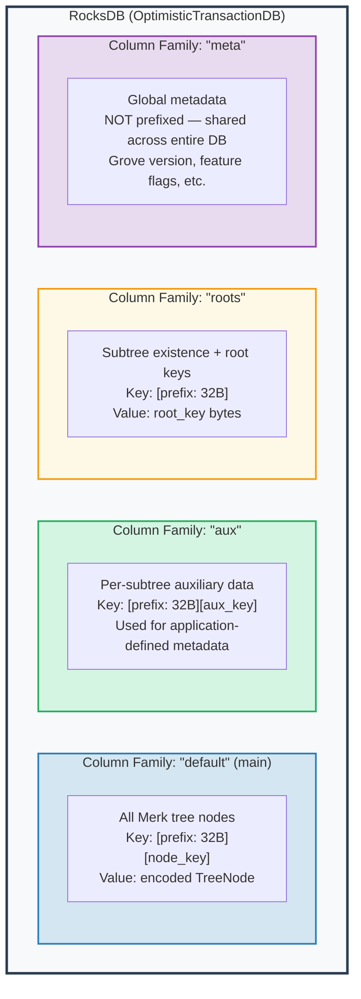
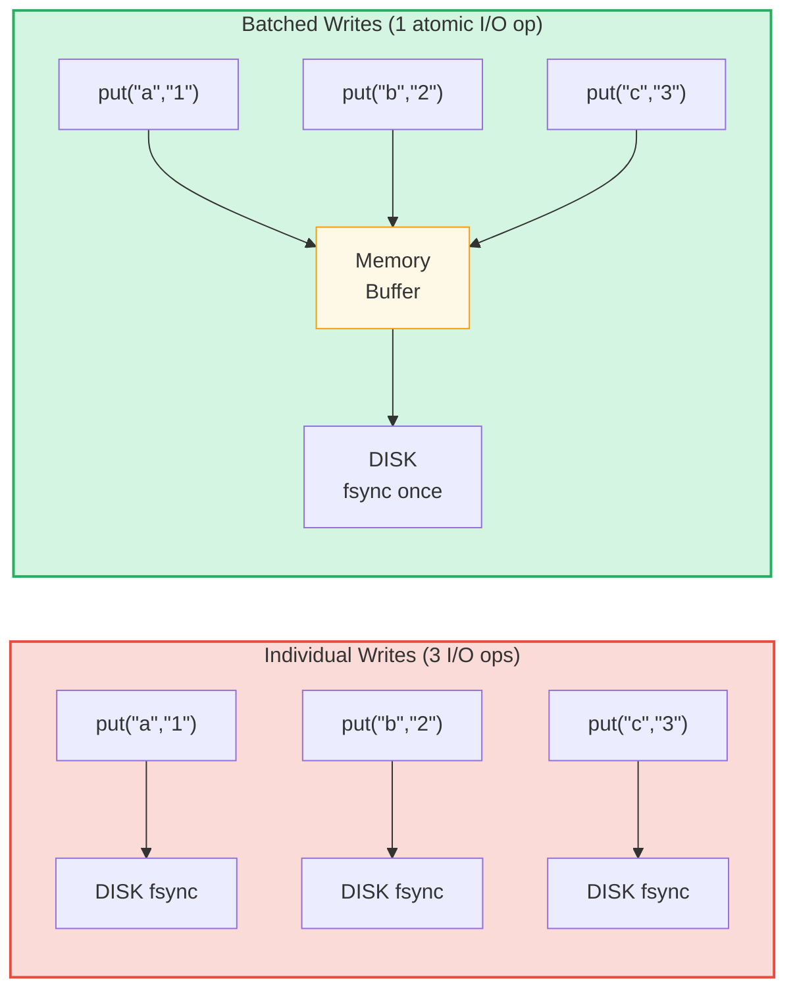

# The Storage Layer

## RocksDB with OptimisticTransactionDB

GroveDB uses **RocksDB** as its storage backend, specifically the
`OptimisticTransactionDB` variant that supports transactions:

```rust
// storage/src/rocksdb_storage/storage.rs
pub(crate) type Db = OptimisticTransactionDB;
pub(crate) type Tx<'db> = Transaction<'db, Db>;

pub struct RocksDbStorage {
    db: OptimisticTransactionDB,
}
```

**Optimistic transactions** work by assuming there won't be conflicts. If two
transactions modify the same data, the second one to commit will fail and can be
retried. This is more efficient than pessimistic locking for workloads where
conflicts are rare.

RocksDB options are tuned for GroveDB's workload:

```rust
lazy_static! {
    static ref DEFAULT_OPTS: rocksdb::Options = {
        let mut opts = rocksdb::Options::default();
        opts.create_if_missing(true);
        opts.increase_parallelism(num_cpus::get() as i32);
        opts.set_allow_mmap_writes(true);
        opts.set_allow_mmap_reads(true);
        opts.create_missing_column_families(true);
        opts.set_atomic_flush(true);
        opts
    };
}
```

## Four Column Families

RocksDB column families act like separate key-value namespaces within a single
database. GroveDB uses four:



> **Example:** Key `[ab3fc2...][6e616d65]` in the "default" CF maps to `TreeNode{key:"name", val:"Al"}`, where `ab3fc2...` is `Blake3(path)` and `6e616d65` is `"name"` in bytes.

```rust
pub(crate) const AUX_CF_NAME: &str = "aux";
pub(crate) const ROOTS_CF_NAME: &str = "roots";
pub(crate) const META_CF_NAME: &str = "meta";
// Main data uses the default column family
```

## Prefixed Storage Contexts

Each subtree gets its own **prefixed storage context** — a wrapper that
automatically prepends the 32-byte Blake3 prefix to all keys:

```text
    Subtree path: ["identities", "alice"]
    Prefix: Blake3(path) = [0xab, 0x3f, 0xc2, ...]  (32 bytes)

    When subtree stores key "name" with value "Alice":

    RocksDB key:   [0xab 0x3f 0xc2 ... (32 bytes) | 0x6e 0x61 0x6d 0x65]
                    \_________prefix________/       \_____"name"_____/

    RocksDB value: [encoded TreeNode with value "Alice"]
```

The context types:

```text
    Without transaction:
    PrefixedRocksDbImmediateStorageContext
    └── Reads/writes directly to DB with prefix

    With transaction:
    PrefixedRocksDbTransactionContext
    └── Reads/writes through a Transaction with prefix
```

Both implement the `StorageContext` trait:

```rust
pub trait StorageContext<'db> {
    fn get(&self, key: &[u8]) -> CostResult<Option<Vec<u8>>, Error>;
    fn get_aux(&self, key: &[u8]) -> CostResult<Option<Vec<u8>>, Error>;
    fn get_root(&self, key: &[u8]) -> CostResult<Option<Vec<u8>>, Error>;
    fn get_meta(&self, key: &[u8]) -> CostResult<Option<Vec<u8>>, Error>;
    fn put(&self, key: &[u8], value: &[u8], ...) -> CostResult<(), Error>;
    fn put_aux(&self, key: &[u8], value: &[u8], ...) -> CostResult<(), Error>;
    fn put_root(&self, key: &[u8], value: &[u8], ...) -> CostResult<(), Error>;
    fn put_meta(&self, key: &[u8], value: &[u8], ...) -> CostResult<(), Error>;
    fn delete(&self, key: &[u8], ...) -> CostResult<(), Error>;
    // ...
}
```

## Write Batches and Transaction Model

For performance, GroveDB accumulates writes into batches:



> 3 disk syncs vs 1 disk sync = ~3x faster. Batched writes are also **atomic** (all-or-nothing).

The `StorageBatch` accumulates operations that are flushed together:

```rust
pub struct StorageBatch {
    operations: RefCell<Vec<AbstractBatchOperation>>,
}
```

## The Critical commit_local() Pattern

When using transactions, there's a critical pattern that must be followed. Writes
within a transaction are buffered — they're not visible until committed:

```rust
// CORRECT pattern:
{
    let tx = db.start_transaction();
    let storage_ctx = db.get_transactional_storage_context(path, &tx);

    storage_ctx.put(key, value);  // Writes to transaction buffer

    drop(storage_ctx);            // Release borrow on tx
    tx.commit_local();            // Flush transaction to DB
}

// INCORRECT — data is lost:
{
    let tx = db.start_transaction();
    let storage_ctx = db.get_transactional_storage_context(path, &tx);

    storage_ctx.put(key, value);  // Writes to transaction buffer

    // tx drops here without commit_local()!
    // All writes are ROLLED BACK!
}
```

This is especially important because the `storage_ctx` borrows the transaction.
You must `drop(storage_ctx)` before you can call `tx.commit_local()`.

---

