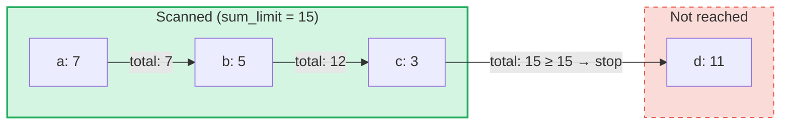

# استعلامات المجموع التجميعي

## نظرة عامة

استعلامات المجموع التجميعي هي نوع متخصص من الاستعلامات مصمم لأشجار **SumTree** في GroveDB.
بينما تسترجع الاستعلامات العادية العناصر حسب المفتاح أو النطاق، تقوم استعلامات المجموع التجميعي
بالتكرار عبر العناصر وتجميع قيم المجموع حتى يتم الوصول إلى **حد المجموع**.

هذا مفيد لأسئلة مثل:
- "أعطني المعاملات حتى يتجاوز الإجمالي التراكمي 1000"
- "ما العناصر التي تساهم في أول 500 وحدة من القيمة في هذه الشجرة؟"
- "اجمع عناصر المجموع حتى ميزانية قدرها N"

## المفاهيم الأساسية

### كيف يختلف عن الاستعلامات العادية

| الميزة | PathQuery | AggregateSumPathQuery |
|---------|-----------|----------------------|
| **الهدف** | أي نوع عنصر | عناصر SumItem / ItemWithSumItem |
| **شرط التوقف** | حد (عدد) أو نهاية النطاق | حد المجموع (الإجمالي التراكمي) **و/أو** حد العناصر |
| **القيم المُرجعة** | عناصر أو مفاتيح | أزواج مفتاح-قيمة مجموع |
| **الاستعلامات الفرعية** | نعم (النزول في الأشجار الفرعية) | لا (مستوى شجرة واحد) |
| **المراجع** | يتم حلها بواسطة طبقة GroveDB | يتم تتبعها اختياريًا أو تجاهلها |

### هيكل AggregateSumQuery

```rust
pub struct AggregateSumQuery {
    pub items: Vec<QueryItem>,              // Keys or ranges to scan
    pub left_to_right: bool,                // Iteration direction
    pub sum_limit: u64,                     // Stop when running total reaches this
    pub limit_of_items_to_check: Option<u16>, // Max number of matching items to return
}
```

يتم تغليف الاستعلام في `AggregateSumPathQuery` لتحديد المكان في البستان الذي سيتم البحث فيه:

```rust
pub struct AggregateSumPathQuery {
    pub path: Vec<Vec<u8>>,                 // Path to the SumTree
    pub aggregate_sum_query: AggregateSumQuery,
}
```

### حد المجموع — الإجمالي التراكمي

`sum_limit` هو المفهوم المركزي. أثناء فحص العناصر، يتم تجميع قيم المجموع الخاصة بها.
بمجرد أن يصل الإجمالي التراكمي إلى حد المجموع أو يتجاوزه، يتوقف التكرار:



> **النتيجة:** `[(a, 7), (b, 5), (c, 3)]` — يتوقف التكرار لأن 7 + 5 + 3 = 15 >= sum_limit

قيم المجموع السالبة مدعومة. القيمة السالبة تزيد الميزانية المتبقية:

```text
sum_limit = 12, elements: a(10), b(-3), c(5)

a: total = 10, remaining = 2
b: total =  7, remaining = 5  ← negative value gave us more room
c: total = 12, remaining = 0  ← stop

Result: [(a, 10), (b, -3), (c, 5)]
```

## خيارات الاستعلام

يتحكم هيكل `AggregateSumQueryOptions` في سلوك الاستعلام:

```rust
pub struct AggregateSumQueryOptions {
    pub allow_cache: bool,                              // Use cached reads (default: true)
    pub error_if_intermediate_path_tree_not_present: bool, // Error on missing path (default: true)
    pub error_if_non_sum_item_found: bool,              // Error on non-sum elements (default: true)
    pub ignore_references: bool,                        // Skip references (default: false)
}
```

### التعامل مع العناصر غير المجموعية

قد تحتوي أشجار SumTree على مزيج من أنواع العناصر: `SumItem`، `Item`، `Reference`، `ItemWithSumItem`،
وغيرها. بشكل افتراضي، مصادفة عنصر غير مجموعي وغير مرجعي ينتج خطأ.

عند تعيين `error_if_non_sum_item_found` إلى `false`، يتم **تخطي** العناصر غير المجموعية بصمت
دون استهلاك خانة من حد المستخدم:

```text
Tree contents: a(SumItem=7), b(Item), c(SumItem=3)
Query: sum_limit=100, limit_of_items_to_check=2, error_if_non_sum_item_found=false

Scan: a(7) → returned, limit=1
      b(Item) → skipped, limit still 1
      c(3) → returned, limit=0 → stop

Result: [(a, 7), (c, 3)]
```

ملاحظة: عناصر `ItemWithSumItem` يتم معالجتها **دائمًا** (لا يتم تخطيها أبدًا)، لأنها تحمل
قيمة مجموع.

### التعامل مع المراجع

بشكل افتراضي، يتم **تتبع** عناصر `Reference` — يقوم الاستعلام بحل سلسلة المراجع
(حتى 3 قفزات وسيطة) للعثور على قيمة مجموع العنصر المستهدف:

```text
Tree contents: a(SumItem=7), ref_b(Reference → a)
Query: sum_limit=100

ref_b is followed → resolves to a(SumItem=7)

Result: [(a, 7), (ref_b, 7)]
```

عند تعيين `ignore_references` إلى `true`، يتم تخطي المراجع بصمت دون استهلاك خانة من الحد،
بشكل مشابه لكيفية تخطي العناصر غير المجموعية.

سلاسل المراجع الأعمق من 3 قفزات وسيطة تنتج خطأ `ReferenceLimit`.

## نوع النتيجة

تُرجع الاستعلامات `AggregateSumQueryResult`:

```rust
pub struct AggregateSumQueryResult {
    pub results: Vec<(Vec<u8>, i64)>,       // Key-sum value pairs
    pub hard_limit_reached: bool,           // True if system limit truncated results
}
```

يشير علم `hard_limit_reached` إلى ما إذا كان حد الفحص الصلب للنظام (الافتراضي: 1024
عنصرًا) قد تم الوصول إليه قبل اكتمال الاستعلام بشكل طبيعي. عندما يكون `true`، قد توجد
نتائج إضافية تتجاوز ما تم إرجاعه.

## ثلاثة أنظمة للحدود

تمتلك استعلامات المجموع التجميعي **ثلاثة** شروط توقف:

| الحد | المصدر | ما يعدّه | التأثير عند الوصول |
|-------|--------|---------------|-------------------|
| **sum_limit** | المستخدم (الاستعلام) | الإجمالي التراكمي لقيم المجموع | إيقاف التكرار |
| **limit_of_items_to_check** | المستخدم (الاستعلام) | العناصر المطابقة المُرجعة | إيقاف التكرار |
| **حد الفحص الصلب** | النظام (GroveVersion، الافتراضي 1024) | جميع العناصر المفحوصة (بما في ذلك المتخطاة) | إيقاف التكرار، تعيين `hard_limit_reached` |

يمنع حد الفحص الصلب التكرار غير المحدود عندما لا يتم تعيين حد من المستخدم. العناصر المتخطاة
(العناصر غير المجموعية مع `error_if_non_sum_item_found=false`، أو المراجع مع
`ignore_references=true`) تُحسب ضمن حد الفحص الصلب ولكن **ليس** ضمن
`limit_of_items_to_check` الخاص بالمستخدم.

## استخدام واجهة البرمجة

### استعلام بسيط

```rust
use grovedb::AggregateSumPathQuery;
use grovedb_merk::proofs::query::AggregateSumQuery;

// "Give me items from this SumTree until the total reaches 1000"
let query = AggregateSumQuery::new(1000, None);
let path_query = AggregateSumPathQuery {
    path: vec![b"my_tree".to_vec()],
    aggregate_sum_query: query,
};

let result = db.query_aggregate_sums(
    &path_query,
    true,   // allow_cache
    true,   // error_if_intermediate_path_tree_not_present
    None,   // transaction
    grove_version,
).unwrap().expect("query failed");

for (key, sum_value) in &result.results {
    println!("{}: {}", String::from_utf8_lossy(key), sum_value);
}
```

### استعلام مع خيارات

```rust
use grovedb::{AggregateSumPathQuery, AggregateSumQueryOptions};
use grovedb_merk::proofs::query::AggregateSumQuery;

// Skip non-sum items and ignore references
let query = AggregateSumQuery::new(1000, Some(50));
let path_query = AggregateSumPathQuery {
    path: vec![b"mixed_tree".to_vec()],
    aggregate_sum_query: query,
};

let result = db.query_aggregate_sums_with_options(
    &path_query,
    AggregateSumQueryOptions {
        error_if_non_sum_item_found: false,  // skip Items, Trees, etc.
        ignore_references: true,              // skip References
        ..AggregateSumQueryOptions::default()
    },
    None,
    grove_version,
).unwrap().expect("query failed");

if result.hard_limit_reached {
    println!("Warning: results may be incomplete (hard limit reached)");
}
```

### استعلامات قائمة على المفاتيح

بدلًا من فحص نطاق، يمكنك الاستعلام عن مفاتيح محددة:

```rust
// Check the sum value of specific keys
let query = AggregateSumQuery::new_with_keys(
    vec![b"alice".to_vec(), b"bob".to_vec(), b"carol".to_vec()],
    u64::MAX,  // no sum limit
    None,      // no item limit
);
```

### استعلامات تنازلية

التكرار من أعلى مفتاح إلى أدنى مفتاح:

```rust
let query = AggregateSumQuery::new_descending(500, Some(10));
// Or: query.left_to_right = false;
```

## مرجع المُنشئات

| المُنشئ | الوصف |
|-------------|-------------|
| `new(sum_limit, limit)` | النطاق الكامل، تصاعديًا |
| `new_descending(sum_limit, limit)` | النطاق الكامل، تنازليًا |
| `new_single_key(key, sum_limit)` | بحث بمفتاح واحد |
| `new_with_keys(keys, sum_limit, limit)` | مفاتيح محددة متعددة |
| `new_with_keys_reversed(keys, sum_limit, limit)` | مفاتيح متعددة، تنازليًا |
| `new_single_query_item(item, sum_limit, limit)` | QueryItem واحد (مفتاح أو نطاق) |
| `new_with_query_items(items, sum_limit, limit)` | عناصر QueryItem متعددة |

---
