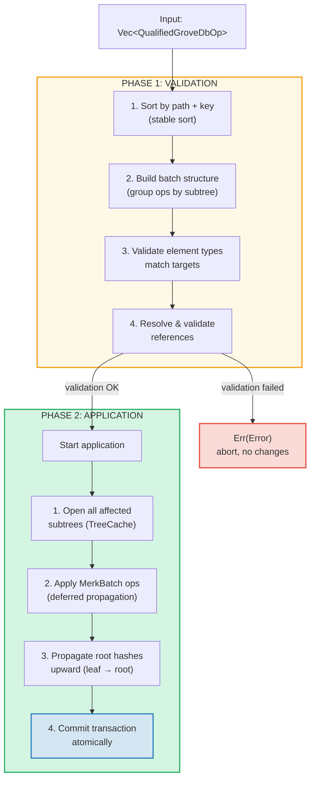
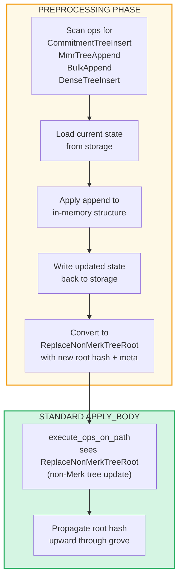

# العمليات الدفعية على مستوى البستان

## متغيرات GroveOp

على مستوى GroveDB، تُمثَّل العمليات كـ `GroveOp`:

```rust
pub enum GroveOp {
    // User-facing operations:
    InsertOnly { element: Element },
    InsertOrReplace { element: Element },
    Replace { element: Element },
    Patch { element: Element, change_in_bytes: i32 },
    RefreshReference { reference_path_type, max_reference_hop, flags, trust_refresh_reference },
    Delete,
    DeleteTree(TreeType),                          // Parameterized by tree type

    // Non-Merk tree append operations (user-facing):
    CommitmentTreeInsert { cmx: [u8; 32], payload: Vec<u8> },
    MmrTreeAppend { value: Vec<u8> },
    BulkAppend { value: Vec<u8> },
    DenseTreeInsert { value: Vec<u8> },

    // Internal operations (created by preprocessing/propagation, rejected by from_ops):
    ReplaceTreeRootKey { hash, root_key, aggregate_data },
    InsertTreeWithRootHash { hash, root_key, flags, aggregate_data },
    ReplaceNonMerkTreeRoot { hash: [u8; 32], meta: NonMerkTreeMeta },
    InsertNonMerkTree { hash, root_key, flags, aggregate_data, meta: NonMerkTreeMeta },
}
```

**NonMerkTreeMeta** يحمل الحالة الخاصة بنوع الشجرة عبر معالجة الدفعة:

```rust
pub enum NonMerkTreeMeta {
    CommitmentTree { total_count: u64, chunk_power: u8 },
    MmrTree { mmr_size: u64 },
    BulkAppendTree { total_count: u64, chunk_power: u8 },
    DenseTree { count: u16, height: u8 },
}
```

كل عملية تُغلَّف في `QualifiedGroveDbOp` يتضمن المسار:

```rust
pub struct QualifiedGroveDbOp {
    pub path: KeyInfoPath,           // Where in the grove
    pub key: Option<KeyInfo>,        // Which key (None for append-only tree ops)
    pub op: GroveOp,                 // What to do
}
```

> **ملاحظة:** حقل `key` هو `Option<KeyInfo>` — يكون `None` لعمليات
> أشجار الإلحاق فقط (`CommitmentTreeInsert`، `MmrTreeAppend`، `BulkAppend`، `DenseTreeInsert`)
> حيث يكون مفتاح الشجرة هو المقطع الأخير من `path` بدلاً من ذلك.

## المعالجة على مرحلتين

تُعالَج العمليات الدفعية في مرحلتين:



## TreeCache والانتشار المؤجَّل

أثناء تطبيق الدفعة، يستخدم GroveDB **TreeCache** لتأجيل انتشار تجزئة
الجذر حتى اكتمال جميع العمليات في شجرة فرعية:

```mermaid
graph TD
    subgraph without["WITHOUT TreeCache (naive)"]
        w1["Op 1: Insert A in X"]
        w1p["Propagate X → parent → root"]
        w2["Op 2: Insert B in X"]
        w2p["Propagate X → parent → root"]
        w3["Op 3: Insert C in X"]
        w3p["Propagate X → parent → root"]
        w1 --> w1p --> w2 --> w2p --> w3 --> w3p
    end

    subgraph with_tc["WITH TreeCache (deferred)"]
        t1["Op 1: Insert A in X<br/>→ buffered"]
        t2["Op 2: Insert B in X<br/>→ buffered"]
        t3["Op 3: Insert C in X<br/>→ buffered"]
        tp["Propagate X → parent → root<br/>(walk up ONCE)"]
        t1 --> t2 --> t3 --> tp
    end

    style without fill:#fadbd8,stroke:#e74c3c,stroke-width:2px
    style with_tc fill:#d5f5e3,stroke:#27ae60,stroke-width:2px
    style w1p fill:#fadbd8,stroke:#e74c3c
    style w2p fill:#fadbd8,stroke:#e74c3c
    style w3p fill:#fadbd8,stroke:#e74c3c
    style tp fill:#d5f5e3,stroke:#27ae60,stroke-width:2px
```



> **3 انتشارات x O(العمق)** مقابل **انتشار واحد x O(العمق)** = أسرع 3 مرات لهذه الشجرة الفرعية.

هذا تحسين كبير عندما تستهدف عمليات كثيرة نفس الشجرة الفرعية.

## العمليات الذرية عبر الأشجار الفرعية

خاصية أساسية في دفعات GroveDB هي **الذرية عبر الأشجار الفرعية**. دفعة واحدة
يمكنها تعديل عناصر في أشجار فرعية متعددة، وإما أن تُلتزَم جميع التغييرات أو لا شيء:

```text
    Batch:
    1. Delete ["balances", "alice"]       (remove balance)
    2. Insert ["balances", "bob"] = 100   (add balance)
    3. Update ["identities", "bob", "rev"] = 2  (update revision)

    Three subtrees affected: balances, identities, identities/bob

    If ANY operation fails → ALL operations are rolled back
    If ALL succeed → ALL are committed atomically
```

يتعامل معالج الدفعة مع هذا عبر:
1. جمع جميع المسارات المتأثرة
2. فتح جميع الأشجار الفرعية المطلوبة
3. تطبيق جميع العمليات
4. نشر جميع تجزئات الجذر بترتيب التبعية
5. التزام المعاملة بالكامل

## المعالجة المسبقة للدفعات لأشجار غير-Merk

تتطلب عمليات CommitmentTree وMmrTree وBulkAppendTree وDenseAppendOnlyFixedSizeTree
الوصول إلى سياقات تخزين خارج Merk، وهو غير متاح داخل
دالة `execute_ops_on_path` القياسية (التي لديها فقط وصول إلى Merk). هذه العمليات
تستخدم **نمط المعالجة المسبقة**: قبل مرحلة `apply_body` الرئيسية، تفحص نقاط
الدخول عمليات أشجار غير-Merk وتحوّلها إلى عمليات داخلية قياسية.

```rust
pub enum GroveOp {
    // ... standard ops ...

    // Non-Merk tree operations (user-facing):
    CommitmentTreeInsert { cmx: [u8; 32], payload: Vec<u8> },
    MmrTreeAppend { value: Vec<u8> },
    BulkAppend { value: Vec<u8> },
    DenseTreeInsert { value: Vec<u8> },

    // Internal ops (produced by preprocessing):
    ReplaceNonMerkTreeRoot { hash: [u8; 32], meta: NonMerkTreeMeta },
}
```



**لماذا المعالجة المسبقة؟** دالة `execute_ops_on_path` تعمل على شجرة Merk
فرعية واحدة وليس لديها وصول إلى `self.db` أو سياقات تخزين أوسع.
المعالجة المسبقة في نقاط الدخول (`apply_batch_with_element_flags_update`،
`apply_partial_batch_with_element_flags_update`) لديها وصول كامل لقاعدة البيانات،
لذا يمكنها تحميل/حفظ البيانات ثم تسليم `ReplaceNonMerkTreeRoot` بسيط
لآلية الدفعة القياسية.

كل دالة معالجة مسبقة تتبع نفس النمط:
1. **`preprocess_commitment_tree_ops`** — تُحمّل الواجهة وBulkAppendTree من
   تخزين البيانات، تُلحق بكليهما، تحفظ، تحوّل إلى `ReplaceNonMerkTreeRoot`
   مع الجذر المُركَّب المُحدَّث وبيانات `CommitmentTree { total_count, chunk_power }` الوصفية
2. **`preprocess_mmr_tree_ops`** — تُحمّل MMR من تخزين البيانات، تُلحق القيم،
   تحفظ، تحوّل إلى `ReplaceNonMerkTreeRoot` مع جذر MMR المُحدَّث
   وبيانات `MmrTree { mmr_size }` الوصفية
3. **`preprocess_bulk_append_ops`** — تُحمّل BulkAppendTree من تخزين البيانات،
   تُلحق القيم (قد تُفعّل ضغط الشرائح)، تحفظ، تحوّل إلى
   `ReplaceNonMerkTreeRoot` مع جذر الحالة المُحدَّث وبيانات `BulkAppendTree { total_count, chunk_power }` الوصفية
4. **`preprocess_dense_tree_ops`** — تُحمّل DenseFixedSizedMerkleTree من تخزين
   البيانات، تُدرج القيم تتابعياً، تُعيد حساب تجزئة الجذر، تحفظ،
   تحوّل إلى `ReplaceNonMerkTreeRoot` مع تجزئة الجذر المُحدَّثة وبيانات `DenseTree { count, height }` الوصفية

عملية `ReplaceNonMerkTreeRoot` تحمل تجزئة الجذر الجديدة وتعداد `NonMerkTreeMeta`
بحيث يمكن إعادة بناء العنصر بالكامل بعد المعالجة.

---
