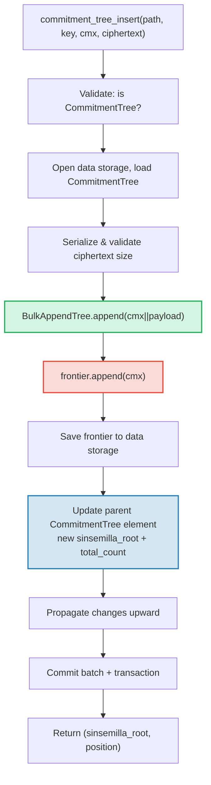

# شجرة CommitmentTree — مراسي التزام Sinsemilla

**CommitmentTree** (شجرة الالتزام) هي جسر GroveDB بين التخزين الموثَّق
وأنظمة براهين المعرفة الصفرية (zero-knowledge proof systems). تجمع بين **BulkAppendTree** (الفصل 14) لتخزين
البيانات المُضغوطة بالشرائح الفعّال و**واجهة Sinsemilla الأمامية** (frontier) في
فضاء اسم البيانات (data namespace) لمراسي متوافقة مع ZK. مثل MmrTree وBulkAppendTree،
لا تملك **شجرة Merk فرعية** — تجزئة الجذر المُركَّبة تتدفق كتجزئة Merk الفرعية.
كلٌّ من مدخلات BulkAppendTree وواجهة Sinsemilla الأمامية تعيش في **فضاء اسم
البيانات**.

يتناول هذا الفصل دالة تجزئة Sinsemilla وأهميتها لدوائر المعرفة الصفرية،
وبنية بيانات الواجهة الأمامية (frontier) وترميزها التسلسلي المُحكَم، وبنية
التخزين ثنائية فضاء الاسم، وعمليات GroveDB، والمعالجة المسبقة للدفعات،
وتوليد الشهادات من جانب العميل، وكيفية عمل البراهين.

## لماذا شجرة صديقة لبراهين المعرفة الصفرية (ZK)؟

أشجار GroveDB القياسية تستخدم تجزئة Blake3. إن Blake3 سريعة في البرمجيات، لكنها
**مُكلفة داخل دوائر المعرفة الصفرية**. عندما يحتاج المُنفق لإثبات
"أعرف ملاحظة (note) في الموقع P في شجرة الالتزام" دون الكشف عن P، يجب عليه
تقييم دالة تجزئة ميركل 32 مرة (مرة لكل مستوى من الشجرة) داخل
دائرة ZK.

Sinsemilla (المُحدَّدة في ZIP-244 لبروتوكول Zcash Orchard) مُصمَّمة
لهذا الاستخدام بالضبط — توفر **تجزئة فعّالة داخل الدائرة** على
منحنى Pallas الإهليلجي (elliptic curve)، أحد نصفَي دورة منحنى Pasta المُستخدمة في نظام إثبات
Halo 2.

| الخاصية | Blake3 | Sinsemilla |
|----------|--------|------------|
| **تكلفة الدائرة** | ~25,000 قيد (constraint) لكل تجزئة | ~800 قيد لكل تجزئة |
| **سرعة البرمجيات** | سريعة جداً (~2 جيجابايت/ث) | بطيئة (~10,000 تجزئة/ث) |
| **البنية الجبرية** | لا شيء (عمليات بتّية) | عمليات نقاط على منحنى Pallas |
| **الغرض الأساسي** | تجزئة عامة، أشجار ميركل | براهين ميركل داخل الدائرة |
| **يُستخدم بواسطة** | أشجار Merk في GroveDB، MMR، Bulk | بروتوكول Orchard المحمي |
| **حجم المخرجات** | 32 بايت | 32 بايت (عنصر حقل Pallas) |

تستخدم CommitmentTree دالة Sinsemilla لشجرة ميركل التي تستدل عليها دوائر ZK،
بينما لا تزال تستخدم Blake3 لتسلسل Merk الهرمي في GroveDB فوقها.
العناصر المُدرجة في الشجرة تُخزَّن عبر BulkAppendTree في فضاء اسم البيانات
(مضغوطة بالشرائح، قابلة للاسترجاع حسب الموقع) وفي نفس الوقت تُلحق
بواجهة Sinsemilla الأمامية (مُنتِجةً مرساة قابلة للإثبات بـ ZK).

## بنية فضاء اسم البيانات

تُخزِّن CommitmentTree **جميع البيانات في فضاء اسم البيانات** عند نفس مسار
الشجرة الفرعية (subtree path). مثل MmrTree وBulkAppendTree، لا تملك **شجرة Merk فرعية** (لا حقل `root_key`
— الجذر الخاص بالنوع يتدفق كتجزئة Merk الفرعية). تتعايش مدخلات BulkAppendTree وواجهة Sinsemilla الأمامية
في فضاء اسم البيانات باستخدام بادئات مفاتيح (key prefixes) مميزة:

```text
┌──────────────────────────────────────────────────────────────┐
│                       CommitmentTree                          │
│                                                               │
│  ┌─────────────────────────────────────────────────────────┐  │
│  │  Data Namespace                                         │  │
│  │                                                         │  │
│  │  BulkAppendTree storage (Chapter 14):                   │  │
│  │    Buffer entries → chunk blobs → chunk MMR             │  │
│  │    value = cmx (32 bytes) || ciphertext (216 bytes)     │  │
│  │                                                         │  │
│  │  Sinsemilla Frontier (~1KB):                            │  │
│  │    key: b"__ct_data__" (COMMITMENT_TREE_DATA_KEY)       │  │
│  │    Depth-32 incremental Merkle tree                     │  │
│  │    Stores only the rightmost path (leaf + ommers)       │  │
│  │    O(1) append, O(1) root computation                   │  │
│  │    Produces Orchard-compatible Anchor for ZK proofs     │  │
│  └─────────────────────────────────────────────────────────┘  │
│                                                               │
│  sinsemilla_root embedded in Element bytes                    │
│    → flows through Merk value_hash → GroveDB state root      │
└──────────────────────────────────────────────────────────────┘
```

**لماذا بنيتان؟** توفر BulkAppendTree تخزيناً واسترجاعاً فعّالاً ومضغوطاً بالشرائح
لملايين الملاحظات المُشفَّرة المُحتملة. توفر واجهة Sinsemilla الأمامية
مراسي متوافقة مع ZK يمكن إثباتها داخل دائرة Halo 2. كلتاهما تُحدَّثان
بالتزامن عند كل إلحاق.

قارن مع أنواع الأشجار غير القياسية الأخرى:

| | CommitmentTree | MmrTree | BulkAppendTree |
|---|---|---|---|
| **Merk فرعية** | لا | لا | لا |
| **فضاء اسم البيانات** | مدخلات BulkAppendTree + الواجهة الأمامية | عُقد MMR | مخزن مؤقت + شرائح + MMR |
| **فضاء الاسم المساعد** | — | — | — |
| **العناصر قابلة للاستعلام** | عبر براهين V1 | عبر براهين V1 | عبر براهين V1 |
| **دالة التجزئة** | Sinsemilla + Blake3 | Blake3 | Blake3 |

## واجهة Sinsemilla الأمامية

الواجهة الأمامية (frontier) هي شجرة ميركل تزايدية (incremental Merkle tree) بعمق 32 مُنفَّذة بنوع
`Frontier<MerkleHashOrchard, 32>` من صندوق `incrementalmerkletree`. بدلاً من
تخزين جميع الأوراق الممكنة البالغ عددها 2^32، تُخزِّن فقط المعلومات اللازمة
**لإلحاق الورقة التالية وحساب الجذر الحالي**: الورقة الأكثر يميناً
وأومراتها (ommer hashes — تجزئات الأشقاء اللازمة لحساب الجذر).

```text
                         root (level 32)
                        /               \
                      ...               ...
                     /                     \
                  (level 2)             (level 2)
                  /     \               /     \
              (level 1) (level 1)   (level 1)  ?
              /    \    /    \      /    \
             L0    L1  L2    L3   L4    ?     ← frontier stores L4
                                              + ommers at levels
                                              where left sibling exists
```

تُخزِّن الواجهة الأمامية:
- **الورقة** (leaf): القيمة المُلحقة الأحدث (عنصر حقل Pallas)
- **الأومرات** (ommers): تجزئات الأشقاء اليسرى عند كل مستوى تسلكه الواجهة الأمامية
  يميناً (بحد أقصى 32 أومراً لشجرة بعمق 32)
- **الموقع** (position): فهرس الورقة المبدوء من الصفر

الخصائص الأساسية:
- **إلحاق O(1)**: إدراج ورقة جديدة، تحديث الأومرات، إعادة حساب الجذر
- **جذر O(1)**: عبور الأومرات المُخزَّنة من الورقة إلى الجذر
- **حجم ثابت ~1 كيلوبايت**: بغض النظر عن عدد الأوراق المُلحقة
- **حتمية** (deterministic): واجهتان أماميتان بنفس تسلسل الإلحاقات تُنتجان
  نفس الجذر

ثابت `EMPTY_SINSEMILLA_ROOT` هو جذر شجرة فارغة بعمق 32،
مُحسوب مسبقاً كـ `MerkleHashOrchard::empty_root(Level::from(32)).to_bytes()`:

```text
0xae2935f1dfd8a24aed7c70df7de3a668eb7a49b1319880dde2bbd9031ae5d82f
```

## كيف يعمل الإلحاق — تتابع الأومرات

عند إلحاق التزام جديد عند الموقع N، عدد الأومرات التي يجب
تحديثها يساوي `trailing_ones(N)` — عدد البتات الواحدية المُتتالية في نهاية
التمثيل الثنائي لـ N. هذا نفس نمط تتابع دمج MMR
(§13.4)، لكنه يعمل على الأومرات بدلاً من القمم (peaks).

**مثال عملي — إلحاق 4 أوراق:**

```text
Position 0 (binary: 0, trailing_ones: 0):
  frontier = { leaf: L0, ommers: [], position: 0 }
  Sinsemilla hashes: 32 (root computation) + 0 (no ommer merges) = 32

Position 1 (binary: 1, trailing_ones: 0 of PREVIOUS position 0):
  Before: position 0 has trailing_ones = 0
  frontier = { leaf: L1, ommers: [H(L0,L1) at level 1], position: 1 }
  Sinsemilla hashes: 32 + 0 = 32

Position 2 (binary: 10, trailing_ones: 0 of PREVIOUS position 1):
  Before: position 1 has trailing_ones = 1
  frontier = { leaf: L2, ommers: [level1_hash], position: 2 }
  Sinsemilla hashes: 32 + 1 = 33

Position 3 (binary: 11, trailing_ones: 0 of PREVIOUS position 2):
  Before: position 2 has trailing_ones = 0
  frontier = { leaf: L3, ommers: [level1_hash, level2_hash], position: 3 }
  Sinsemilla hashes: 32 + 0 = 32
```

**إجمالي تجزئات Sinsemilla** لكل إلحاق هو:

```text
32 (root computation always traverses all 32 levels)
+ trailing_ones(current_position)  (ommer cascade)
```

في المتوسط، `trailing_ones` تساوي ~1 (توزيع هندسي)، لذا التكلفة المتوسطة
هي **~33 تجزئة Sinsemilla لكل إلحاق**. أسوأ حالة (عند الموقع
2^32 - 1، حيث جميع البتات هي 1) هي **64 تجزئة**.

## صيغة ترميز الواجهة الأمامية التسلسلي

تُخزَّن الواجهة الأمامية في تخزين البيانات عند المفتاح `b"__ct_data__"`. صيغة
التمثيل السلكي (wire format) هي:

```text
┌──────────────────────────────────────────────────────────────────┐
│ has_frontier: u8                                                  │
│   0x00 → empty tree (no more fields)                             │
│   0x01 → non-empty (fields follow)                               │
├──────────────────────────────────────────────────────────────────┤
│ position: u64 BE (8 bytes)      — 0-indexed leaf position        │
├──────────────────────────────────────────────────────────────────┤
│ leaf: [u8; 32]                  — Pallas field element bytes     │
├──────────────────────────────────────────────────────────────────┤
│ ommer_count: u8                 — number of ommers (0..=32)      │
├──────────────────────────────────────────────────────────────────┤
│ ommers: [ommer_count × 32 bytes] — Pallas field elements        │
└──────────────────────────────────────────────────────────────────┘
```

**تحليل الحجم:**

| الحالة | الحجم | التفصيل |
|--------|-------|---------|
| فارغة | 1 بايت | علامة `0x00` فقط |
| ورقة واحدة، 0 أومر | 42 بايت | 1 + 8 + 32 + 1 |
| ~16 أومراً (المتوسط) | 554 بايت | 1 + 8 + 32 + 1 + 16×32 |
| 32 أومراً (الحد الأقصى) | 1,066 بايت | 1 + 8 + 32 + 1 + 32×32 |

حجم الواجهة الأمامية محدود بـ ~1.1 كيلوبايت بغض النظر عن عدد الملايين من
الالتزامات المُلحقة. هذا يجعل دورة التحميل→التعديل→الحفظ رخيصة جداً
(عملية بحث واحدة للقراءة، عملية بحث واحدة للكتابة).

## تمثيل العنصر

```rust
CommitmentTree(
    u64,                  // total_count: number of appended items
    u8,                   // chunk_power: dense tree height for BulkAppendTree buffer
    Option<ElementFlags>, // flags: optional metadata
)
```

معامل `chunk_power` يتحكم في ارتفاع الشجرة الكثيفة لمخزن BulkAppendTree المؤقت؛
يجب أن يكون `chunk_power` في النطاق 1..=16 (انظر §14.1 و§16).

**مُعرِّفات الأنواع:**

| المُعرِّف | القيمة |
|---|---|
| مُميِّز العنصر (Element discriminant) | 11 |
| `TreeType` | `CommitmentTree = 7` |
| `ElementType` | 11 |
| `COMMITMENT_TREE_COST_SIZE` | 12 بايت (8 total_count + 1 chunk_power + 1 مُميِّز + 2 حمل إضافي) |

جذر Sinsemilla لا يُخزَّن في العنصر. يتدفق كتجزئة Merk الفرعية
عبر آلية `insert_subtree`. عندما تحسب Merk الأب
`combined_value_hash` الخاص بها، يُضمَّن الجذر المشتق من Sinsemilla كتجزئة فرعية:

```text
combined_value_hash = blake3(value_hash || child_hash)
                                           ↑ sinsemilla/BulkAppendTree combined root
```

هذا يعني أن أي تغيير في واجهة Sinsemilla الأمامية ينتشر تلقائياً
عبر تسلسل Merk الهرمي في GroveDB إلى جذر الحالة.

**دوال الإنشاء:**

| الدالة | تُنشئ |
|---|---|
| `Element::empty_commitment_tree(chunk_power)` | شجرة فارغة، العدد=0، بدون أعلام |
| `Element::empty_commitment_tree_with_flags(chunk_power, flags)` | شجرة فارغة مع أعلام |
| `Element::new_commitment_tree(total_count, chunk_power, flags)` | جميع الحقول صريحة |

## بنية التخزين

تُخزِّن CommitmentTree جميع بياناتها في **فضاء اسم بيانات** واحد عند
مسار الشجرة الفرعية. تتعايش مدخلات BulkAppendTree وواجهة Sinsemilla الأمامية في
نفس العمود باستخدام بادئات مفاتيح مميزة. لا يُستخدم فضاء الاسم المساعد (aux namespace).

```text
┌──────────────────────────────────────────────────────────────────┐
│  Data Namespace (all CommitmentTree storage)                      │
│                                                                   │
│  BulkAppendTree storage keys (see §14.7):                         │
│    b"m" || pos (u64 BE)  → MMR node blobs                        │
│    b"b" || index (u64 BE)→ buffer entries (cmx || ciphertext)     │
│    b"e" || chunk (u64 BE)→ chunk blobs (compacted buffer)         │
│    b"M"                  → BulkAppendTree metadata                │
│                                                                   │
│  Sinsemilla frontier:                                             │
│    b"__ct_data__"        → serialized CommitmentFrontier (~1KB)   │
│                                                                   │
│  No Merk nodes — this is a non-Merk tree.                         │
│  Data authenticated via BulkAppendTree state_root (Blake3).       │
│  Sinsemilla root authenticates all cmx values via Pallas curve.   │
└──────────────────────────────────────────────────────────────────┘
```

**نمط التحميل→التعديل→الحفظ**: كل عملية تعديل تُحمِّل الواجهة الأمامية
من تخزين البيانات، تُعدِّلها في الذاكرة، وتكتبها مرة أخرى. بما أن حجم الواجهة الأمامية
لا يتجاوز ~1 كيلوبايت، فهذا زوج غير مُكلف من عمليات الإدخال/الإخراج (عملية بحث واحدة للقراءة،
عملية بحث واحدة للكتابة). في نفس الوقت، تُحمَّل BulkAppendTree، تُلحق إليها البيانات،
وتُحفظ.

**انتشار تجزئة الجذر**: عند إدراج عنصر، يتغير شيئان:
1. تتغير حالة BulkAppendTree (مدخل جديد في المخزن المؤقت أو ضغط شريحة)
2. يتغير جذر Sinsemilla (التزام جديد في الواجهة الأمامية)

كلاهما يُلتقط في عنصر `CommitmentTree` المُحدَّث. تجزئة عقدة Merk الأب
تصبح:

```text
combined_hash = combine_hash(
    value_hash(element_bytes),    ← includes total_count + chunk_power
    child_hash(combined_root)     ← sinsemilla/BulkAppendTree combined root
)
```

مثل MmrTree وBulkAppendTree، يتدفق الجذر الخاص بالنوع كتجزئة Merk الفرعية.
جميع عمليات مصادقة البيانات تمر عبر ربط التجزئة الفرعية هذا.

**تبعات تخزين البيانات غير Merk**: لأن فضاء اسم البيانات يحتوي على
مفاتيح BulkAppendTree (وليس عقد Merk)، فإن العمليات التي تُكرِّر التخزين
كعناصر Merk — مثل `find_subtrees` و`is_empty_tree` و
`verify_merk_and_submerks` — يجب أن تتعامل مع CommitmentTree بشكل خاص (وأنواع
الأشجار غير Merk الأخرى). دالة `uses_non_merk_data_storage()` المساعدة على كلٍّ من
`Element` و`TreeType` تحدد أنواع الأشجار هذه. عمليات الحذف تُفرِّغ
فضاء اسم البيانات مباشرة بدلاً من تكراره، وverify_grovedb تتخطى
التكرار على الأشجار الفرعية (sub-merk) لهذه الأنواع.

## عمليات GroveDB

توفر CommitmentTree أربع عمليات. عملية الإدراج عامة (generic) على
`M: MemoSize` (من صندوق `orchard`)، الذي يتحكم في التحقق من حجم حمولة
النص المُشفَّر (ciphertext). القيمة الافتراضية `M = DashMemo` تعطي حمولة بحجم 216 بايت
(32 epk + 104 enc + 80 out).

```rust
// Insert a commitment (typed) — returns (sinsemilla_root, position)
// M controls ciphertext size validation
db.commitment_tree_insert::<_, _, M>(path, key, cmx, ciphertext, tx, version)

// Insert a commitment (raw bytes) — validates payload.len() == ciphertext_payload_size::<DashMemo>()
db.commitment_tree_insert_raw(path, key, cmx, payload_vec, tx, version)

// Get the current Orchard Anchor
db.commitment_tree_anchor(path, key, tx, version)

// Retrieve a value by global position
db.commitment_tree_get_value(path, key, position, tx, version)

// Get the current item count
db.commitment_tree_count(path, key, tx, version)
```

دالة `commitment_tree_insert` المُنمَّطة تقبل `TransmittedNoteCiphertext<M>` وتُرمِّزها
تسلسلياً داخلياً. أما دالة `commitment_tree_insert_raw` الخام (pub(crate))
فتقبل `Vec<u8>` وتُستخدم بواسطة المعالجة المسبقة للدفعات حيث تكون الحمولات مُرمَّزة
تسلسلياً بالفعل.

### commitment_tree_insert

عملية الإدراج تُحدِّث كلاً من BulkAppendTree وواجهة Sinsemilla
الأمامية في عملية ذرّية (atomic) واحدة:

```text
Step 1: Validate element at path/key is a CommitmentTree
        → extract total_count, chunk_power, flags

Step 2: Build ct_path = path ++ [key]

Step 3: Open data storage context at ct_path
        Load CommitmentTree (frontier + BulkAppendTree)
        Serialize ciphertext → validate payload size matches M
        Append cmx||ciphertext to BulkAppendTree
        Append cmx to Sinsemilla frontier → get new sinsemilla_root
        Track Blake3 + Sinsemilla hash costs

Step 4: Save updated frontier to data storage

Step 5: Open parent Merk at path
        Write updated CommitmentTree element:
          new total_count, same chunk_power, same flags
        Child hash = combined_root (sinsemilla + bulk state)

Step 6: Propagate changes from parent upward through Merk hierarchy

Step 7: Commit storage batch and local transaction
        Return (sinsemilla_root, position)
```



> **الأحمر** = عمليات Sinsemilla. **الأخضر** = عمليات BulkAppendTree.
> **الأزرق** = تحديث العنصر الذي يربط كليهما.

### commitment_tree_anchor

عملية المرساة هي استعلام للقراءة فقط:

```text
Step 1: Validate element at path/key is a CommitmentTree
Step 2: Build ct_path = path ++ [key]
Step 3: Load frontier from data storage
Step 4: Return frontier.anchor() as orchard::tree::Anchor
```

نوع `Anchor` هو تمثيل Orchard الأصلي لجذر Sinsemilla،
مناسب للتمرير مباشرة إلى `orchard::builder::Builder` عند إنشاء
براهين تفويض الإنفاق (spend authorization proofs).

### commitment_tree_get_value

يسترجع قيمة مُخزَّنة (cmx || payload) حسب موقعها العام:

```text
Step 1: Validate element at path/key is a CommitmentTree
        → extract total_count, chunk_power
Step 2: Build ct_path = path ++ [key]
Step 3: Open data storage context, wrap in CachedBulkStore
Step 4: Load BulkAppendTree, call get_value(position)
Step 5: Return Option<Vec<u8>>
```

يتبع هذا نفس نمط `bulk_get_value` (§14.9) — تسترجع BulkAppendTree
بشفافية من المخزن المؤقت أو كتلة شريحة مضغوطة حسب
مكان وقوع الموقع.

### commitment_tree_count

تُرجع العدد الإجمالي للعناصر المُلحقة بالشجرة:

```text
Step 1: Read element at path/key
Step 2: Verify it is a CommitmentTree
Step 3: Return total_count from element fields
```

هذه عملية قراءة بسيطة لحقل العنصر — لا حاجة للوصول إلى التخزين ما عدا Merk الأب.

## العمليات الدفعية

تدعم CommitmentTree الإدراجات الدفعية عبر متغير `GroveOp::CommitmentTreeInsert`:

```rust
GroveOp::CommitmentTreeInsert {
    cmx: [u8; 32],      // extracted note commitment
    payload: Vec<u8>,    // serialized ciphertext (216 bytes for DashMemo)
}
```

مُنشئان يُنشئان هذه العملية:

```rust
// Raw constructor — caller serializes payload manually
QualifiedGroveDbOp::commitment_tree_insert_op(path, cmx, payload_vec)

// Typed constructor — serializes TransmittedNoteCiphertext<M> internally
QualifiedGroveDbOp::commitment_tree_insert_op_typed::<M>(path, cmx, &ciphertext)
```

يُسمح بإدراجات متعددة تستهدف نفس الشجرة في دفعة واحدة. بما أن
`execute_ops_on_path` لا يملك وصولاً لتخزين البيانات، يجب معالجة جميع عمليات
CommitmentTree مسبقاً قبل `apply_body`.

**خط أنابيب المعالجة المسبقة** (`preprocess_commitment_tree_ops`):

```text
Input: [CTInsert{cmx1}, Insert{...}, CTInsert{cmx2}, CTInsert{cmx3}]
                                       ↑ same (path,key) as cmx1

Step 1: Group CommitmentTreeInsert ops by (path, key)
        group_1: [cmx1, cmx2, cmx3]

Step 2: For each group:
        a. Read existing element → verify CommitmentTree, extract chunk_power
        b. Open transactional storage context at ct_path
        c. Load CommitmentTree from data storage (frontier + BulkAppendTree)
        d. For each (cmx, payload):
           - ct.append_raw(cmx, payload) — validates size, appends to both
        e. Save updated frontier to data storage

Step 3: Replace all CTInsert ops with one ReplaceNonMerkTreeRoot per group
        carrying: hash=bulk_state_root (combined root),
                  meta=NonMerkTreeMeta::CommitmentTree {
                      total_count: new_count,
                      chunk_power,
                  }

Output: [ReplaceNonMerkTreeRoot{...}, Insert{...}]
```

أول عملية CommitmentTreeInsert في كل مجموعة تُستبدل بـ
`ReplaceNonMerkTreeRoot`؛ العمليات اللاحقة لنفس (path, key) تُحذف.
آلية الدفعات القياسية تتولى بعد ذلك تحديث العنصر وانتشار تجزئة
الجذر.

## النوع العام MemoSize ومعالجة النص المُشفَّر

بنية `CommitmentTree<S, M>` عامة على `M: MemoSize` (من صندوق
`orchard`). يتحكم هذا في حجم نصوص الملاحظات المُشفَّرة المُخزَّنة
بجانب كل التزام.

```rust
pub struct CommitmentTree<S, M: MemoSize = DashMemo> {
    frontier: CommitmentFrontier,
    pub bulk_tree: BulkAppendTree<S>,
    _memo: PhantomData<M>,
}
```

القيمة الافتراضية `M = DashMemo` تعني أن الكود الحالي الذي لا يهتم بحجم المذكرة
(مثل `verify_grovedb`، `commitment_tree_anchor`، `commitment_tree_count`)
يعمل بدون تحديد `M`.

**صيغة المدخل المُخزَّن**: كل مدخل في BulkAppendTree هو
`cmx (32 بايت) || ciphertext_payload`، حيث تخطيط الحمولة هو:

```text
epk_bytes (32) || enc_ciphertext (variable by M) || out_ciphertext (80)
```

لـ `DashMemo`: `32 + 104 + 80 = 216 بايت` حمولة، فكل مدخل يبلغ
`32 + 216 = 248 بايت` إجمالاً.

**دوال الترميز التسلسلي المساعدة** (دوال عامة حرة):

| الدالة | الوصف |
|--------|-------|
| `ciphertext_payload_size::<M>()` | حجم الحمولة المتوقع لـ `MemoSize` معين |
| `serialize_ciphertext::<M>(ct)` | ترميز `TransmittedNoteCiphertext<M>` إلى بايتات |
| `deserialize_ciphertext::<M>(data)` | فك ترميز بايتات إلى `TransmittedNoteCiphertext<M>` |

**التحقق من الحمولة**: دالة `append_raw()` تتحقق من أن
`payload.len() == ciphertext_payload_size::<M>()` وتُرجع
`CommitmentTreeError::InvalidPayloadSize` عند عدم التطابق. دالة `append()`
المُنمَّطة تُرمِّز داخلياً، لذا الحجم صحيح دائماً بالتصميم.

## توليد الشهادات من جانب العميل

يوفر صندوق `grovedb-commitment-tree` شجرة **من جانب العميل** للمحافظ
ومنصات الاختبار التي تحتاج لتوليد مسارات شهادة ميركل (Merkle witness paths) لإنفاق الملاحظات.
فعِّل ميزة `client` لاستخدامها:

```toml
grovedb-commitment-tree = { version = "4", features = ["client"] }
```

```rust
pub struct ClientMemoryCommitmentTree {
    inner: ShardTree<MemoryShardStore<MerkleHashOrchard, u32>, 32, 4>,
}
```

`ClientMemoryCommitmentTree` يلتف حول `ShardTree` — شجرة التزام كاملة (وليست مجرد
واجهة أمامية) تحتفظ بالسجل الكامل في الذاكرة. هذا يسمح بتوليد
مسارات مصادقة لأي ورقة مُعلَّمة، وهو ما لا تستطيع الواجهة الأمامية وحدها فعله.

**واجهة البرمجة (API):**

| الدالة | الوصف |
|---|---|
| `new(max_checkpoints)` | إنشاء شجرة فارغة بحد لاحتفاظ نقاط التحقق |
| `append(cmx, retention)` | إلحاق التزام مع سياسة احتفاظ |
| `checkpoint(id)` | إنشاء نقطة تحقق عند الحالة الحالية |
| `max_leaf_position()` | موقع آخر ورقة مُلحقة |
| `witness(position, depth)` | توليد `MerklePath` لإنفاق ملاحظة |
| `anchor()` | الجذر الحالي كـ `orchard::tree::Anchor` |

**سياسات الاحتفاظ** (retention policies) تتحكم في أي الأوراق يمكن إصدار شهادة لها لاحقاً:

| الاحتفاظ | المعنى |
|---|---|
| `Retention::Ephemeral` | لا يمكن إصدار شهادة للورقة (ملاحظات الآخرين) |
| `Retention::Marked` | يمكن إصدار شهادة للورقة (ملاحظاتك الخاصة) |
| `Retention::Checkpoint { id, marking }` | إنشاء نقطة تحقق، مع تعليم اختياري |

**مقارنة الخادم مقابل العميل:**

| | `CommitmentFrontier` (الخادم) | `ClientMemoryCommitmentTree` (العميل) | `ClientPersistentCommitmentTree` (SQLite) |
|---|---|---|---|
| **التخزين** | واجهة أمامية بحجم ~1 كيلوبايت في تخزين البيانات | شجرة كاملة في الذاكرة | شجرة كاملة في SQLite |
| **يمكن إصدار شهادة** | لا | نعم (الأوراق المُعلَّمة فقط) | نعم (الأوراق المُعلَّمة فقط) |
| **يمكن حساب المرساة** | نعم | نعم | نعم |
| **تطابق المرساة** | نفس التسلسل ← نفس المرساة | نفس التسلسل ← نفس المرساة | نفس التسلسل ← نفس المرساة |
| **يبقى بعد إعادة التشغيل** | نعم (تخزين بيانات GroveDB) | لا (يُفقد عند الإسقاط) | نعم (قاعدة بيانات SQLite) |
| **حالة الاستخدام** | تتبع المراسي من جانب الخادم | الاختبار، المحافظ المؤقتة | محافظ الإنتاج |
| **علامة الميزة** | `server` | `client` | `sqlite` |

الثلاثة تُنتج **مراسي متطابقة** لنفس تسلسل الإلحاقات. هذا مُتحقَّق منه
بواسطة اختبار `test_frontier_and_client_same_root`.

### العميل المستمر — توليد شهادات مدعوم بـ SQLite

`ClientMemoryCommitmentTree` في الذاكرة يفقد كل حالته عند الإسقاط (drop). لمحافظ
الإنتاج التي يجب أن تنجو من إعادة التشغيل دون إعادة مسح سلسلة الكتل
بالكامل، يوفر الصندوق `ClientPersistentCommitmentTree` المدعوم بـ
SQLite. فعِّل ميزة `sqlite`:

```toml
grovedb-commitment-tree = { version = "4", features = ["sqlite"] }
```

```rust
pub struct ClientPersistentCommitmentTree {
    inner: ShardTree<SqliteShardStore, 32, 4>,
}
```

**ثلاثة أوضاع إنشاء:**

| المُنشئ | الوصف |
|---|---|
| `open(conn, max_checkpoints)` | يأخذ ملكية اتصال `rusqlite::Connection` موجود |
| `open_on_shared_connection(arc, max_checkpoints)` | يتشارك `Arc<Mutex<Connection>>` مع مكونات أخرى |
| `open_path(path, max_checkpoints)` | ملائم — يفتح/يُنشئ قاعدة بيانات SQLite في مسار الملف المعطى |

مُنشئات "أحضر اتصالك الخاص" (`open`، `open_on_shared_connection`)
تسمح للمحفظة باستخدام **قاعدة بياناتها الموجودة** لتخزين شجرة الالتزام.
يُنشئ `SqliteShardStore` جداوله ببادئة `commitment_tree_`، لذا
يتعايش بأمان مع جداول التطبيق الأخرى.

**واجهة البرمجة** مطابقة لـ `ClientMemoryCommitmentTree`:

| الدالة | الوصف |
|---|---|
| `append(cmx, retention)` | إلحاق التزام مع سياسة احتفاظ |
| `checkpoint(id)` | إنشاء نقطة تحقق عند الحالة الحالية |
| `max_leaf_position()` | موقع آخر ورقة مُلحقة |
| `witness(position, depth)` | توليد `MerklePath` لإنفاق ملاحظة |
| `anchor()` | الجذر الحالي كـ `orchard::tree::Anchor` |

**مخطط SQLite** (4 جداول، تُنشأ تلقائياً):

```sql
commitment_tree_shards                -- Shard data (serialized prunable trees)
commitment_tree_cap                   -- Tree cap (single-row, top of shard tree)
commitment_tree_checkpoints           -- Checkpoint metadata (position or empty)
commitment_tree_checkpoint_marks_removed  -- Marks removed per checkpoint
```

**مثال على الاستمرارية:**

```rust
use grovedb_commitment_tree::{ClientPersistentCommitmentTree, Retention, Position};

// First session: append notes and close
let mut tree = ClientPersistentCommitmentTree::open_path("wallet.db", 100)?;
tree.append(cmx_0, Retention::Marked)?;
tree.append(cmx_1, Retention::Ephemeral)?;
let anchor_before = tree.anchor()?;
drop(tree);

// Second session: reopen, state is preserved
let tree = ClientPersistentCommitmentTree::open_path("wallet.db", 100)?;
let anchor_after = tree.anchor()?;
assert_eq!(anchor_before, anchor_after);  // same anchor, no re-scan needed
```

**مثال على الاتصال المشترك** (للمحافظ التي لديها قاعدة بيانات SQLite موجودة):

```rust
use std::sync::{Arc, Mutex};
use grovedb_commitment_tree::rusqlite::Connection;

let conn = Arc::new(Mutex::new(Connection::open("wallet.db")?));
// conn is also used by other wallet components...
let mut tree = ClientPersistentCommitmentTree::open_on_shared_connection(
    conn.clone(), 100
)?;
```

صندوق `grovedb-commitment-tree` يُعيد تصدير `rusqlite` تحت علامة ميزة
`sqlite`، لذا لا يحتاج المستهلكون النهائيون لإضافة `rusqlite` كاعتمادية
منفصلة.

**التفاصيل الداخلية لـ SqliteShardStore:**

يُنفِّذ `SqliteShardStore` جميع الدوال الـ 18 لسمة `ShardStore`.
تُرمَّز أشجار الشظايا (shard trees) تسلسلياً باستخدام صيغة ثنائية مُحكَمة:

```text
Nil:    [0x00]                                     — 1 byte
Leaf:   [0x01][hash: 32][flags: 1]                 — 34 bytes
Parent: [0x02][has_ann: 1][ann?: 32][left][right]  — recursive
```

`LocatedPrunableTree` يُضيف بادئة عنوان: `[level: 1][index: 8][tree_bytes]`.

تعداد `ConnectionHolder` يُجرِّد الاتصالات المملوكة مقابل المشتركة:

```rust
enum ConnectionHolder {
    Owned(Connection),                    // exclusive access
    Shared(Arc<Mutex<Connection>>),       // shared with other components
}
```

جميع عمليات قاعدة البيانات تحصل على الاتصال عبر دالة مساعدة `with_conn` تتعامل
بشفافية مع كلا الوضعين، وتقفل mutex فقط عند المشاركة.

## تكامل البراهين

تدعم CommitmentTree مسارَي برهان:

**1. برهان مرساة Sinsemilla (مسار ZK):**

```text
GroveDB root hash
  ↓ Merk proof (V0, standard)
Parent Merk node
  ↓ value_hash includes CommitmentTree element bytes
CommitmentTree element bytes
  ↓ contains sinsemilla_root field
Sinsemilla root (Orchard Anchor)
  ↓ ZK proof (Halo 2 circuit, off-chain)
Note commitment at position P
```

1. برهان Merk الأب يُثبت أن عنصر `CommitmentTree` موجود
   في المسار/المفتاح المُدَّعى، مع بايتات محددة.
2. تلك البايتات تتضمن حقل `sinsemilla_root`.
3. العميل (المحفظة) يبني بشكل مستقل شهادة ميركل في
   شجرة Sinsemilla باستخدام `ClientMemoryCommitmentTree::witness()` (للاختبار) أو
   `ClientPersistentCommitmentTree::witness()` (للإنتاج، مدعومة بـ SQLite).
4. دائرة ZK تتحقق من الشهادة مقابل المرساة (sinsemilla_root).

**2. برهان استرجاع العناصر (مسار V1):**

يمكن استعلام العناصر الفردية (cmx || payload) حسب الموقع وإثباتها باستخدام
براهين V1 (§9.6)، نفس الآلية المُستخدمة بواسطة BulkAppendTree المستقلة. يتضمن
برهان V1 مسار مصادقة BulkAppendTree للموقع المطلوب،
مُسلسَلاً مع برهان Merk الأب لعنصر CommitmentTree.

## تتبع التكاليف

تُقدِّم CommitmentTree حقل تكلفة مُخصصاً لعمليات Sinsemilla:

```rust
pub struct OperationCost {
    pub seek_count: u32,
    pub storage_cost: StorageCost,
    pub storage_loaded_bytes: u64,
    pub hash_node_calls: u32,
    pub sinsemilla_hash_calls: u32,   // ← new field for CommitmentTree
}
```

حقل `sinsemilla_hash_calls` منفصل عن `hash_node_calls` لأن
تجزئات Sinsemilla أغلى بشكل كبير من Blake3 في كل من وقت المعالج
وتكلفة دائرة ZK.

**تفصيل تكلفة كل إلحاق:**

| المكوِّن | الحالة المتوسطة | أسوأ حالة |
|---|---|---|
| تجزئات Sinsemilla | 33 (32 جذر + 1 أومر متوسط) | 64 (32 جذر + 32 أومر) |
| عمليات بحث إدخال/إخراج الواجهة الأمامية | 2 (قراءة + كتابة) | 2 |
| بايتات الواجهة الأمامية المُحمَّلة | 554 (~16 أومراً) | 1,066 (32 أومراً) |
| بايتات الواجهة الأمامية المكتوبة | 554 | 1,066 |
| تجزئات BulkAppendTree | ~5 Blake3 (مُطفأة، انظر §14.15) | O(حجم_الشريحة) عند الضغط |
| إدخال/إخراج BulkAppendTree | 2-3 عمليات بحث (بيانات وصفية + مخزن مؤقت) | +2 عند ضغط الشرائح |

**ثوابت تقدير التكاليف** (من `average_case_costs.rs` و
`worst_case_costs.rs`):

```rust
// Average case
const AVG_FRONTIER_SIZE: u32 = 554;    // ~16 ommers
const AVG_SINSEMILLA_HASHES: u32 = 33; // 32 root levels + 1 avg ommer

// Worst case
const MAX_FRONTIER_SIZE: u32 = 1066;   // 32 ommers (max depth)
const MAX_SINSEMILLA_HASHES: u32 = 64; // 32 root levels + 32 ommers
```

يُتتبَّع مكوِّن تكلفة BulkAppendTree بجانب تكلفة Sinsemilla،
مُجمِّعاً كلاً من تجزئات Blake3 (من عمليات المخزن المؤقت/الشرائح في BulkAppendTree)
وتجزئات Sinsemilla (من إلحاق الواجهة الأمامية) في `OperationCost` واحد.

## التسلسل الهرمي لمفاتيح Orchard وإعادة التصدير

يُعيد صندوق `grovedb-commitment-tree` تصدير واجهة Orchard الكاملة اللازمة
لإنشاء المعاملات المحمية والتحقق منها. يسمح هذا لكود Platform باستيراد
كل شيء من صندوق واحد.

**أنواع إدارة المفاتيح:**

```text
SpendingKey
  ├── SpendAuthorizingKey → SpendValidatingKey
  └── FullViewingKey
        ├── IncomingViewingKey (decrypt received notes)
        ├── OutgoingViewingKey (decrypt sent notes)
        └── Address (= PaymentAddress, derive recipient addresses)
```

**أنواع الملاحظات:**

| النوع | الغرض |
|---|---|
| `Note` | ملاحظة كاملة بقيمة، مستلم، عشوائية |
| `ExtractedNoteCommitment` | الـ `cmx` المُستخلص من ملاحظة (32 بايت) |
| `Nullifier` | وسم فريد يُعلِّم الملاحظة كمُنفقة |
| `Rho` | مُدخل اشتقاق Nullifier (يربط الإنفاق بملاحظة سابقة) |
| `NoteValue` | قيمة ملاحظة 64-بت |
| `ValueCommitment` | التزام Pedersen بقيمة ملاحظة |

**أنواع البراهين والحِزم:**

| النوع | الغرض |
|---|---|
| `ProvingKey` | مفتاح إثبات Halo 2 لدوائر Orchard |
| `VerifyingKey` | مفتاح تحقق Halo 2 لدوائر Orchard |
| `BatchValidator` | تحقق دفعي من حِزم Orchard متعددة |
| `Bundle<T, V>` | مجموعة إجراءات (Actions) تُشكِّل تحويلاً محمياً |
| `Action` | زوج إنفاق/مخرج واحد داخل حزمة |
| `Authorized` | حالة تفويض الحزمة (توقيعات + برهان ZK) |
| `Flags` | أعلام الحزمة (الإنفاق مُفعَّل، المخرجات مُفعَّلة) |
| `Proof` | برهان Halo 2 داخل حزمة مُفوَّضة |

**أنواع البناء:**

| النوع | الغرض |
|---|---|
| `Builder` | يبني حزمة Orchard من عمليات إنفاق ومخرجات |
| `BundleType` | يُهيِّئ استراتيجية الحشو (padding) للحزمة |

**أنواع الشجرة:**

| النوع | الغرض |
|---|---|
| `Anchor` | جذر Sinsemilla كنوع Orchard أصلي |
| `MerkleHashOrchard` | عقدة تجزئة Sinsemilla في شجرة الالتزام |
| `MerklePath` | مسار مصادقة من 32 مستوى لتوليد الشهادات |

## ملفات التنفيذ

| الملف | الغرض |
|-------|-------|
| `grovedb-commitment-tree/src/lib.rs` | بنية `CommitmentFrontier`، الترميز التسلسلي، `EMPTY_SINSEMILLA_ROOT`، إعادة التصدير |
| `grovedb-commitment-tree/src/commitment_tree/mod.rs` | بنية `CommitmentTree<S, M>`، إلحاق مُنمَّط/خام، دوال مساعدة لترميز النص المُشفَّر |
| `grovedb-commitment-tree/src/commitment_frontier/mod.rs` | `CommitmentFrontier` (واجهة Sinsemilla الأمامية التي تلتف حول `Frontier`) |
| `grovedb-commitment-tree/src/error.rs` | `CommitmentTreeError` (بما في ذلك `InvalidPayloadSize`) |
| `grovedb-commitment-tree/src/client/mod.rs` | `ClientMemoryCommitmentTree`، توليد شهادات في الذاكرة |
| `grovedb-commitment-tree/src/client/sqlite_store.rs` | `SqliteShardStore`، تنفيذ `ShardStore` عبر SQLite، ترميز الشجرة تسلسلياً |
| `grovedb-commitment-tree/src/client/client_persistent_commitment_tree.rs` | `ClientPersistentCommitmentTree`، توليد شهادات مدعوم بـ SQLite |
| `grovedb-commitment-tree/Cargo.toml` | علامات الميزات: `server`، `client`، `sqlite` |
| `grovedb-element/src/element/mod.rs` | متغير `Element::CommitmentTree` (3 حقول: `u64, u8, Option<ElementFlags>`) |
| `grovedb-element/src/element/constructor.rs` | `empty_commitment_tree(chunk_power)`، `new_commitment_tree_with_all()` |
| `grovedb-element/src/element/helpers.rs` | دالة `uses_non_merk_data_storage()` المساعدة |
| `merk/src/tree_type/costs.rs` | `COMMITMENT_TREE_COST_SIZE = 12` |
| `merk/src/tree_type/mod.rs` | `TreeType::CommitmentTree = 7`، `uses_non_merk_data_storage()` |
| `grovedb/src/operations/commitment_tree.rs` | عمليات GroveDB: إدراج مُنمَّط، إدراج خام، مرساة، استرجاع قيمة، عدّ، معالجة دفعات مسبقة |
| `grovedb/src/operations/delete/mod.rs` | معالجة حذف أنواع الأشجار غير Merk |
| `grovedb/src/batch/mod.rs` | `GroveOp::CommitmentTreeInsert`، مُنشئ `commitment_tree_insert_op_typed` |
| `grovedb/src/batch/estimated_costs/average_case_costs.rs` | نموذج تكلفة الحالة المتوسطة |
| `grovedb/src/batch/estimated_costs/worst_case_costs.rs` | نموذج تكلفة أسوأ حالة |
| `grovedb/src/tests/commitment_tree_tests.rs` | 32 اختبار تكامل |

## مقارنة مع أنواع الأشجار الأخرى

| | CommitmentTree | MmrTree | BulkAppendTree | DenseTree |
|---|---|---|---|---|
| **مُميِّز العنصر** | 11 | 12 | 13 | 14 |
| **TreeType** | 7 | 8 | 9 | 10 |
| **لها Merk فرعية** | لا | لا | لا | لا |
| **فضاء اسم البيانات** | مدخلات BulkAppendTree + واجهة Sinsemilla الأمامية | عُقد MMR | مخزن مؤقت + شرائح + MMR | قيم حسب الموقع |
| **دالة التجزئة** | Sinsemilla + Blake3 | Blake3 | Blake3 | Blake3 |
| **نوع البرهان** | V1 (Bulk) + ZK (Sinsemilla) | V1 (برهان MMR) | V1 (برهان Bulk) | V1 (برهان DenseTree) |
| **تجزئات لكل إلحاق** | ~33 Sinsemilla + ~5 Blake3 | ~2 Blake3 | ~5 Blake3 (مُطفأة) | O(n) Blake3 |
| **حجم التكلفة** | 12 بايت | 11 بايت | 12 بايت | 6 بايت |
| **السعة** | غير محدودة | غير محدودة | غير محدودة | ثابتة (2^h - 1) |
| **صديقة لـ ZK** | نعم (Halo 2) | لا | لا | لا |
| **ضغط الشرائح** | نعم (chunk_power قابل للتهيئة) | لا | نعم | لا |
| **حالة الاستخدام** | التزامات ملاحظات محمية | سجلات أحداث/معاملات | سجلات جماعية عالية الإنتاجية | بنى صغيرة محدودة |

اختر CommitmentTree عندما تحتاج مراسي قابلة للإثبات بـ ZK لبروتوكولات محمية
مع تخزين مضغوط بالشرائح فعّال. اختر MmrTree عندما تحتاج سجل
إلحاق فقط بسيط مع براهين أوراق فردية. اختر BulkAppendTree عندما تحتاج
استعلامات نطاق عالية الإنتاجية مع لقطات مبنية على الشرائح. اختر
DenseAppendOnlyFixedSizeTree عندما تحتاج بنية مُحكَمة محدودة السعة
حيث يُخزِّن كل موقع قيمة ويُعاد حساب تجزئة الجذر دائماً
أثناء التنفيذ.

---
