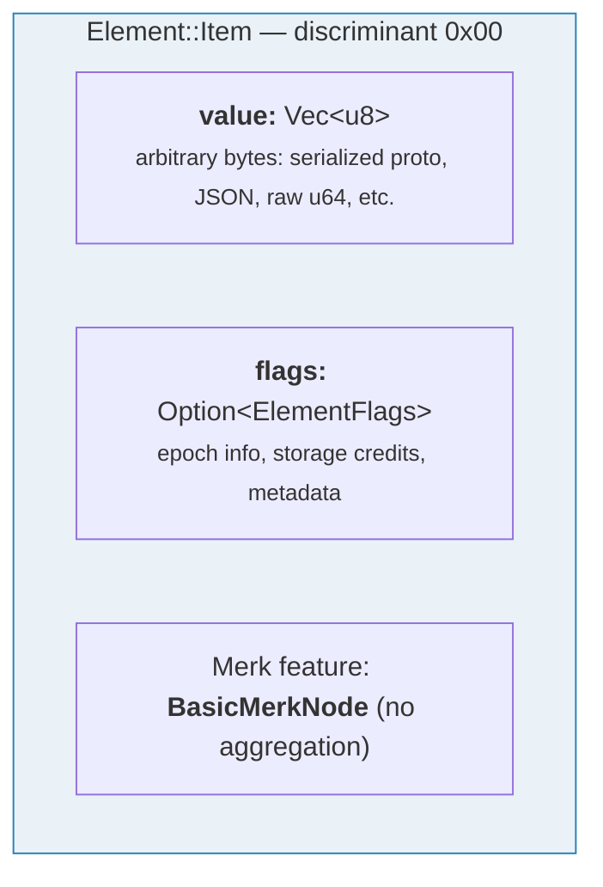
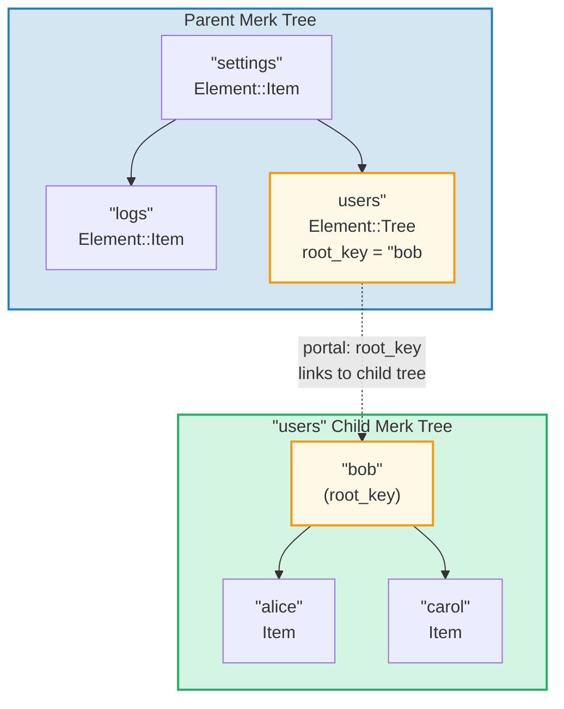
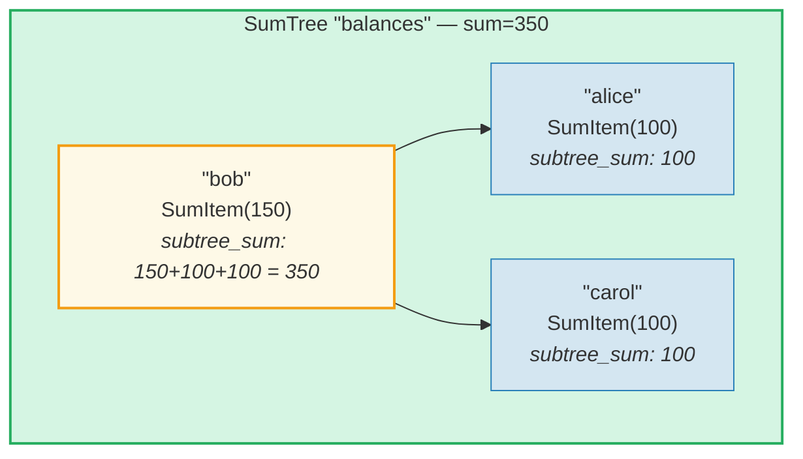
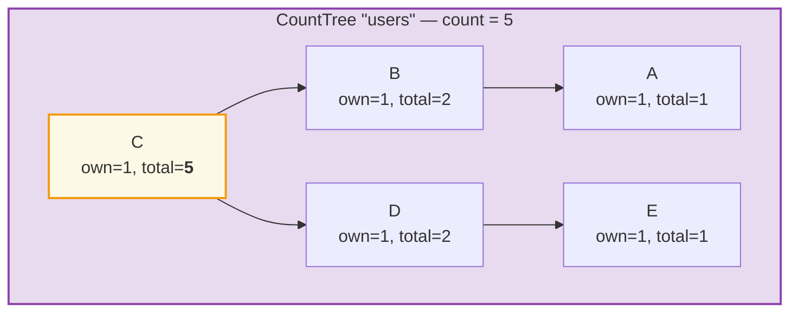
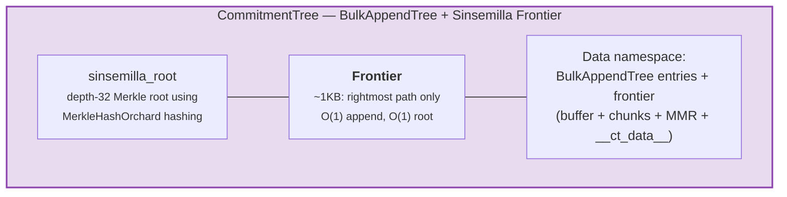

# نظام العناصر

بينما يتعامل Merk مع أزواج مفتاح-قيمة خام، يعمل GroveDB على مستوى أعلى
باستخدام **العناصر** (Elements) — قيم مُنمَّطة تحمل دلالة معنوية. كل قيمة مُخزَّنة
في GroveDB هي عنصر.

## تعداد Element

```rust
// grovedb-element/src/element/mod.rs
pub enum Element {
    Item(Vec<u8>, Option<ElementFlags>),                                    // [0]
    Reference(ReferencePathType, MaxReferenceHop, Option<ElementFlags>),    // [1]
    Tree(Option<Vec<u8>>, Option<ElementFlags>),                           // [2]
    SumItem(SumValue, Option<ElementFlags>),                               // [3]
    SumTree(Option<Vec<u8>>, SumValue, Option<ElementFlags>),              // [4]
    BigSumTree(Option<Vec<u8>>, BigSumValue, Option<ElementFlags>),        // [5]
    CountTree(Option<Vec<u8>>, CountValue, Option<ElementFlags>),          // [6]
    CountSumTree(Option<Vec<u8>>, CountValue, SumValue, Option<ElementFlags>), // [7]
    ProvableCountTree(Option<Vec<u8>>, CountValue, Option<ElementFlags>),  // [8]
    ItemWithSumItem(Vec<u8>, SumValue, Option<ElementFlags>),              // [9]
    ProvableCountSumTree(Option<Vec<u8>>, CountValue, SumValue,
                         Option<ElementFlags>),                            // [10]
    CommitmentTree(u64, u8, Option<ElementFlags>),                         // [11]
    MmrTree(u64, Option<ElementFlags>),                                    // [12]
    BulkAppendTree(u64, u8, Option<ElementFlags>),                         // [13]
    DenseAppendOnlyFixedSizeTree(u16, u8, Option<ElementFlags>),           // [14]
}
```

أرقام المُميِّزات (discriminants) المعروضة بين أقواس تُستخدم أثناء الترميز التسلسلي (serialization).

الأسماء المستعارة للأنواع المُستخدمة في جميع أنحاء الشيفرة:

```rust
pub type ElementFlags = Vec<u8>;        // Arbitrary metadata per element
pub type MaxReferenceHop = Option<u8>;  // Optional hop limit for references
pub type SumValue = i64;                // 64-bit signed sum
pub type BigSumValue = i128;            // 128-bit signed sum
pub type CountValue = u64;              // 64-bit unsigned count
```

## Item — تخزين مفتاح-قيمة أساسي

أبسط عنصر. يُخزّن بايتات عشوائية:

```rust
Element::Item(value: Vec<u8>, flags: Option<ElementFlags>)
```



المُنشئات:

```rust
Element::new_item(b"hello world".to_vec())
Element::new_item_with_flags(b"data".to_vec(), Some(vec![0x01, 0x02]))
```

تشارك العناصر في التجميع الجمعي: داخل SumTree، يساهم Item بقيمة
افتراضية قدرها 0. أما SumItem فيساهم بقيمته الصريحة.

## Tree — حاويات للأشجار الفرعية

عنصر Tree هو **بوابة** إلى شجرة Merk أخرى. يُخزّن مفتاح الجذر لشجرة
الابن (إن وُجد):

```rust
Element::Tree(root_key: Option<Vec<u8>>, flags: Option<ElementFlags>)
```



> عنصر Tree في شجرة Merk الأب يُخزّن `root_key` لشجرة Merk الابن. هذا يُنشئ **بوابة** — رابط من شجرة Merk إلى أخرى.

عندما تكون الشجرة فارغة، `root_key` يكون `None`. المُنشئ `Element::empty_tree()`
يُنشئ `Element::Tree(None, None)`.

## SumItem / SumTree — المجاميع التجميعية

**SumTree** (شجرة المجموع) تُحافظ تلقائياً على مجموع مساهمات المجموع لجميع أبنائها
المباشرين:

```rust
Element::SumTree(root_key: Option<Vec<u8>>, sum: SumValue, flags: Option<ElementFlags>)
Element::SumItem(value: SumValue, flags: Option<ElementFlags>)
```



> **صيغة التجميع:** `node_sum = own_value + left_child_sum + right_child_sum`
> بوب: 150 + 100 (أليس) + 100 (كارول) = **350**. مجموع الجذر (350) مُخزَّن في عنصر SumTree للأب.

يتم الحفاظ على المجموع على مستوى Merk من خلال نوع الميزة `TreeFeatureType::SummedMerkNode(i64)`.
أثناء انتشار التغييرات في الشجرة، يتم إعادة حساب البيانات التجميعية لكل عقدة:

```text
aggregate_sum = own_sum + left_child_sum + right_child_sum
```

## CountTree وCountSumTree وBigSumTree

أنواع أشجار تجميعية إضافية:

| نوع العنصر | نوع ميزة Merk | ماذا يُجمّع |
|---|---|---|
| `CountTree` | `CountedMerkNode(u64)` | عدد العناصر |
| `CountSumTree` | `CountedSummedMerkNode(u64, i64)` | كلا العدد والمجموع |
| `BigSumTree` | `BigSummedMerkNode(i128)` | مجموع 128 بت للقيم الكبيرة |
| `ProvableCountTree` | `ProvableCountedMerkNode(u64)` | العدد مُدمج في التجزئة |
| `ProvableCountSumTree` | `ProvableCountedSummedMerkNode(u64, i64)` | العدد في التجزئة + المجموع |

**ProvableCountTree** مميز: عدده مُضمَّن في حساب `node_hash`
(عبر `node_hash_with_count`)، لذا يمكن للبرهان التحقق من العدد بدون
الكشف عن أي قيم.

## ترميز العناصر تسلسلياً

يتم ترميز العناصر تسلسلياً باستخدام **bincode** بترتيب بايتات الطرف الأكبر (big-endian):

```rust
pub fn serialize(&self, grove_version: &GroveVersion) -> Result<Vec<u8>, ElementError> {
    let config = config::standard().with_big_endian().with_no_limit();
    bincode::encode_to_vec(self, config)
}
```

البايت الأول هو **المُميِّز** (discriminant)، مما يسمح بالكشف عن النوع بتعقيد O(1):

```rust
pub fn from_serialized_value(value: &[u8]) -> Option<ElementType> {
    match value.first()? {
        0 => Some(ElementType::Item),
        1 => Some(ElementType::Reference),
        2 => Some(ElementType::Tree),
        3 => Some(ElementType::SumItem),
        // ... etc
    }
}
```

## TreeFeatureType وتدفق البيانات التجميعية

تعداد `TreeFeatureType` يُجسّر الفجوة بين عناصر GroveDB وعقد Merk:

```rust
pub enum TreeFeatureType {
    BasicMerkNode,                              // No aggregation
    SummedMerkNode(i64),                       // Sum aggregation
    BigSummedMerkNode(i128),                   // Large sum
    CountedMerkNode(u64),                      // Count
    CountedSummedMerkNode(u64, i64),           // Count + sum
    ProvableCountedMerkNode(u64),              // Count in hash
    ProvableCountedSummedMerkNode(u64, i64),   // Count in hash + sum
}
```

البيانات التجميعية تتدفق **صعوداً** عبر الشجرة:



> **جدول التجميع:** تجميع كل عقدة = ذاتي(1) + تجميع_اليسار + تجميع_اليمين
>
> | العقدة | ذاتي | تجميع_يسار | تجميع_يمين | المجموع |
> |--------|------|------------|------------|---------|
> | A | 1 | 0 | 0 | 1 |
> | B | 1 | 1 (A) | 0 | 2 |
> | E | 1 | 0 | 0 | 1 |
> | D | 1 | 0 | 1 (E) | 2 |
> | C | 1 | 2 (B) | 2 (D) | **5** (الجذر) |

العدد المُخزَّن في كل عقدة يمثل العدد الإجمالي في الشجرة
الفرعية ذات الجذر عند تلك العقدة، بما في ذلك نفسها. عدد عقدة الجذر هو المجموع
للشجرة بأكملها.

تعداد `AggregateData` ينقل هذا عبر نظام الروابط:

```rust
pub enum AggregateData {
    NoAggregateData,
    Sum(i64),
    BigSum(i128),
    Count(u64),
    CountAndSum(u64, i64),
    ProvableCount(u64),
    ProvableCountAndSum(u64, i64),
}
```

## CommitmentTree — شجرة التزام Sinsemilla

**CommitmentTree** (شجرة الالتزام) توفر شجرة ميركل Sinsemilla بعمق 32 لتتبع
مراسي التزام الملاحظات، كما تُستخدم في بروتوكول Orchard المحمي في Zcash. تُغلّف
`incrementalmerkletree::Frontier<MerkleHashOrchard, 32>` لعمليات إلحاق وحساب
جذر بتعقيد O(1):

```rust
Element::CommitmentTree(
    total_count: u64,               // Number of commitments appended
    chunk_power: u8,                // BulkAppendTree compaction size (chunk_size = 2^chunk_power)
    flags: Option<ElementFlags>,
)                                   // discriminant [11]
```

> **ملاحظة:** تجزئة جذر واجهة Sinsemilla لا تُخزَّن في العنصر.
> بل تُحفظ في تخزين البيانات وتتدفق عبر آلية تجزئة Merk الابن
> (معامل `subtree_root_hash` في `insert_subtree`). أي تغيير في الواجهة
> ينتشر تلقائياً صعوداً عبر تسلسل Merk في GroveDB.



**البنية:**
- *الواجهة* (المسار الأيمن لشجرة ميركل، بحجم ثابت ~1 كيلوبايت) مُخزَّنة
  في **فضاء اسم البيانات**، بالمفتاح `COMMITMENT_TREE_DATA_KEY`
- بيانات الملاحظات الفعلية (`cmx || ciphertext`) مُخزَّنة عبر **BulkAppendTree**
  في **فضاء اسم البيانات** — مُضغوطة في شرائح، قابلة للاسترجاع بالموقع
- المراسي التاريخية يتتبعها Platform في شجرة قابلة للإثبات منفصلة
- جذر Sinsemilla لا يُخزَّن في العنصر — يتدفق كتجزئة Merk الابن
  عبر تسلسل تجزئة GroveDB

**العمليات:**
- `commitment_tree_insert(path, key, cmx, ciphertext, tx)` — إلحاق مُنمَّط
  يقبل `TransmittedNoteCiphertext<M>`؛ يُرجع `(new_root, position)`
- `commitment_tree_anchor(path, key, tx)` — الحصول على مرساة Orchard الحالية
- `commitment_tree_get_value(path, key, position, tx)` — استرجاع قيمة بالموقع
- `commitment_tree_count(path, key, tx)` — الحصول على العدد الإجمالي للعناصر

**معامل MemoSize العام:** `CommitmentTree<S, M: MemoSize = DashMemo>` يتحقق من أن
حمولات النص المشفر تتطابق مع الحجم المتوقع لـ `M`. لـ Dash (مذكرات 36 بايت):
`epk_bytes (32) + enc_ciphertext (104) + out_ciphertext (80) = 216 بايت`.

**تتبع التكاليف:** يتم تتبع عمليات تجزئة Sinsemilla عبر
`cost.sinsemilla_hash_calls`. حساب الجذر يعبر دائماً 32 مستوى.
عمليات دمج الأومرات تتتالى عبر `trailing_ones()` للموقع السابق.
عمليات BulkAppendTree تُضيف تكاليف تجزئة Blake3.

## MmrTree — نطاق جبل ميركل

**MmrTree** يُخزّن البيانات في نطاق جبل ميركل (Merkle Mountain Range أو MMR) للإلحاق فقط
باستخدام تجزئة Blake3. عقد MMR تُخزَّن في عمود **البيانات** (نفس مجموعة أعمدة عقد Merk)،
وليس في شجرة Merk فرعية ابن. انظر **[الفصل 13](#chapter-13-the-mmr-tree--append-only-authenticated-logs)**
للتعمق الشامل في كيفية عمل MMR وكيفية امتلائها وكيفية توليد
البراهين والتحقق منها وكيفية تكامل MmrTree مع GroveDB.

```rust
Element::MmrTree(
    mmr_size: u64,                  // Internal MMR size (nodes, not leaves)
    flags: Option<ElementFlags>,
)                                   // discriminant [12]
```

> **ملاحظة:** تجزئة جذر MMR لا تُخزَّن في العنصر. تتدفق كتجزئة Merk
> الابن عبر معامل `subtree_root_hash` في `insert_subtree`.

**العمليات:** `mmr_tree_append`، `mmr_tree_root_hash`، `mmr_tree_get_value`،
`mmr_tree_leaf_count`. **البراهين:** براهين V1 (انظر §9.6 و§13.9).

## BulkAppendTree — بنية إلحاق فقط ذات مستويين

**BulkAppendTree** يجمع بين مخزن مؤقت لشجرة ميركل كثيفة ونطاق MMR على مستوى الشرائح
لعمليات إلحاق عالية الإنتاجية مع استعلامات نطاق قابلة للإثبات. وهو
شجرة غير-Merk — البيانات تعيش في فضاء اسم **البيانات**، وليس في شجرة Merk فرعية ابن.
انظر **[الفصل 14](#chapter-14-the-bulkappendtree--high-throughput-append-only-storage)**
للتعمق الشامل في البنية ذات المستويين وضغط الشرائح
وتوليد البراهين والتحقق والتكامل مع GroveDB.

```rust
Element::BulkAppendTree(
    total_count: u64,               // Total values appended
    chunk_power: u8,                // Dense tree height (buffer capacity = 2^chunk_power - 1)
    flags: Option<ElementFlags>,
)                                   // discriminant [13]
```

> **ملاحظة:** جذر الحالة (`blake3("bulk_state" || mmr_root || dense_tree_root)`)
> لا يُخزَّن في العنصر. يتدفق كتجزئة Merk الابن عبر
> معامل `subtree_root_hash` في `insert_subtree`.

**العمليات:** `bulk_append`، `bulk_get_value`، `bulk_get_chunk`،
`bulk_get_buffer`، `bulk_count`، `bulk_chunk_count`.
**البراهين:** براهين نطاق V1 (انظر §9.6 و§14.10).

## DenseAppendOnlyFixedSizeTree — تخزين كثيف ثابت السعة

**DenseAppendOnlyFixedSizeTree** (شجرة إلحاق كثيفة ثابتة الحجم) هي شجرة ثنائية كاملة بارتفاع ثابت *h*
حيث كل عقدة (داخلية وورقة) تُخزّن قيمة بيانات. تُملأ المواقع
بترتيب المستويات (BFS). يتم إعادة حساب تجزئة الجذر أثناء التشغيل — لا تُحفظ
تجزئات وسيطة. انظر **[الفصل 16](#chapter-16-the-denseappendonlyfixedsizetree--dense-fixed-capacity-merkle-storage)**
للتعمق الكامل.

```rust
Element::DenseAppendOnlyFixedSizeTree(
    count: u16,                     // Number of values stored (max 65,535)
    height: u8,                     // Tree height (1..=16, immutable), capacity = 2^h - 1
    flags: Option<ElementFlags>,
)                                   // discriminant [14]
```

> **ملاحظة:** تجزئة الجذر لا تُخزَّن في العنصر — يتم إعادة حسابها أثناء
> التشغيل وتتدفق كتجزئة Merk الابن. حقل `count` هو `u16` (وليس u64)،
> مما يحدّ الأشجار بـ 65,535 موقعاً. الارتفاعات محصورة بين 1 و16.

**العمليات:** `dense_tree_insert`، `dense_tree_get`، `dense_tree_root_hash`،
`dense_tree_count`.
**البراهين:** على مستوى العنصر فقط (لا توجد براهين استعلامات فرعية بعد).

## الأشجار غير-Merk — أنماط مشتركة

CommitmentTree وMmrTree وBulkAppendTree وDenseAppendOnlyFixedSizeTree يتشاركون نمطاً معمارياً مشتركاً
يُميّزهم عن أنواع الأشجار المبنية على Merk (Tree، SumTree،
CountTree، إلخ.):

| الخاصية | أشجار Merk | أشجار غير-Merk |
|---------|------------|----------------|
| شجرة Merk فرعية ابن | نعم (`root_key = Some(...)`) | لا (بدون حقل root_key) |
| تخزين البيانات | أزواج مفتاح-قيمة Merk | كتل بيانات في عمود البيانات (مفاتيح غير-Merk) |
| ربط تجزئة الجذر | `combine_hash(elem_hash, child_root_hash)` | `combine_hash(elem_hash, type_specific_root)` |
| الجذر الخاص بالنوع | تُحافظ عليه شجرة Merk AVL | يتدفق كتجزئة Merk الابن (ليس في بايتات العنصر) |
| صيغة البرهان | V0 (طبقة تلو طبقة Merk) | V1 (برهان خاص بالنوع) |
| TreeFeatureType | BasicMerkNode (بدون تجميع) | BasicMerkNode |

> **ملاحظة حول عمود التخزين:** جميع أنواع الأشجار الأربعة غير-Merk (MmrTree،
> CommitmentTree، BulkAppendTree، DenseAppendOnlyFixedSizeTree) تُخزّن
> بياناتها في عمود **البيانات** باستخدام مفاتيح غير-Merk. CommitmentTree يُخزّن
> واجهة Sinsemilla إلى جانب مدخلات BulkAppendTree في نفس عمود **البيانات**
> (المفتاح `b"__ct_data__"`).

الجذر الخاص بالنوع (جذر Sinsemilla، جذر MMR، جذر الحالة، أو تجزئة جذر الشجرة الكثيفة) لا
يُخزَّن في العنصر. بدلاً من ذلك، يتدفق كـ **تجزئة ابن** Merk عبر
معامل `subtree_root_hash` في `insert_subtree`. تصبح combined_value_hash في Merk
`combine_hash(value_hash(element_bytes), type_specific_root)`.
أي تغيير في الجذر الخاص بالنوع يُغيّر تجزئة الابن، مما يُغيّر
combined_value_hash، مما ينتشر صعوداً عبر تسلسل تجزئة GroveDB
— مع الحفاظ على السلامة التشفيرية.

---
