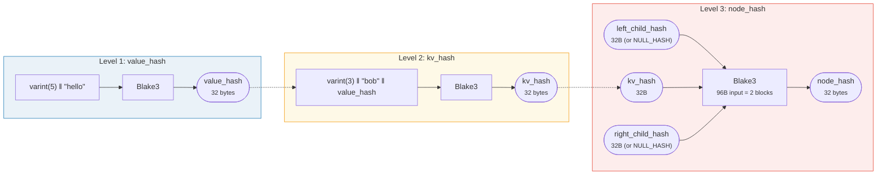

# التجزئة — السلامة التشفيرية

كل عقدة في شجرة Merk تُجزَّأ لإنتاج **تجزئة جذر** (root hash) — قيمة واحدة من 32 بايت
توثّق الشجرة بأكملها. أي تغيير في أي مفتاح أو قيمة أو
علاقة هيكلية سينتج تجزئة جذر مختلفة.

## التسلسل الهرمي للتجزئة من ثلاث مستويات

يستخدم Merk مخططاً للتجزئة من ثلاث مستويات، من الأعمق إلى الأبعد:

مثال: key = `"bob"` (3 بايت)، value = `"hello"` (5 بايت):



> جذر الشجرة = `node_hash` لعقدة الجذر — يوثّق **كل** مفتاح وقيمة وعلاقة هيكلية. الأبناء المفقودون يستخدمون `NULL_HASH = [0x00; 32]`.

### المستوى 1: value_hash

```rust
// merk/src/tree/hash.rs
pub fn value_hash(value: &[u8]) -> CostContext<CryptoHash> {
    let mut hasher = blake3::Hasher::new();
    let val_length = value.len().encode_var_vec();  // Varint encoding
    hasher.update(val_length.as_slice());
    hasher.update(value);
    // ...
}
```

طول القيمة يتم **ترميزه كمتغير عدد صحيح** (varint) ويُلحق في المقدمة. هذا حاسم لمقاومة
التصادم — بدونه، `H("AB" ‖ "C")` سيُساوي `H("A" ‖ "BC")`.

### المستوى 2: kv_hash

```rust
pub fn kv_hash(key: &[u8], value: &[u8]) -> CostContext<CryptoHash> {
    let mut hasher = blake3::Hasher::new();
    let key_length = key.len().encode_var_vec();
    hasher.update(key_length.as_slice());
    hasher.update(key);
    let vh = value_hash(value);
    hasher.update(vh.as_slice());  // Nested hash
    // ...
}
```

هذا يربط المفتاح بالقيمة. للتحقق من البراهين، هناك أيضاً متغير
يأخذ value_hash محسوبة مسبقاً:

```rust
pub fn kv_digest_to_kv_hash(key: &[u8], value_hash: &CryptoHash) -> CostContext<CryptoHash>
```

يُستخدم هذا عندما يمتلك المُحقّق value_hash بالفعل (مثلاً، للأشجار الفرعية
حيث value_hash هي تجزئة مُركَّبة).

### المستوى 3: node_hash

```rust
pub fn node_hash(
    kv: &CryptoHash,
    left: &CryptoHash,
    right: &CryptoHash,
) -> CostContext<CryptoHash> {
    let mut hasher = blake3::Hasher::new();
    hasher.update(kv);       // 32 bytes
    hasher.update(left);     // 32 bytes
    hasher.update(right);    // 32 bytes — total 96 bytes
    // Always exactly 2 hash operations (96 bytes / 64-byte block = 2)
}
```

إذا كان أحد الأبناء غائباً، تجزئته هي **NULL_HASH** — 32 بايت صفرية:

```rust
pub const NULL_HASH: CryptoHash = [0; HASH_LENGTH];  // [0u8; 32]
```

## Blake3 كدالة التجزئة

يستخدم GroveDB **Blake3** لجميع عمليات التجزئة. الخصائص الرئيسية:

- **مخرجات 256 بت** (32 بايت)
- **حجم الكتلة**: 64 بايت
- **السرعة**: أسرع بنحو 3 مرات من SHA-256 على الأجهزة الحديثة
- **تدفقية**: يمكن تغذية البيانات بشكل تزايدي

تُحسب تكلفة عملية التجزئة بناءً على عدد كتل 64 بايت التي تمت
معالجتها:

```rust
let hashes = 1 + (hasher.count() - 1) / 64;  // Number of hash operations
```

## ترميز بادئة الطول لمقاومة التصادم

كل مُدخل متغير الطول يُسبَق بطوله باستخدام **ترميز varint**:


> **مُدخل value_hash**: `[varint(value.len)] [value bytes]`
> **مُدخل kv_hash**: `[varint(key.len)] [key bytes] [value_hash: 32 bytes]`

بدون بادئات الطول، يمكن للمهاجم صياغة أزواج مفتاح-قيمة مختلفة تُنتج
نفس الملخص. بادئة الطول تجعل هذا مستحيلاً تشفيرياً.

## التجزئة المُركَّبة للعناصر الخاصة

للـ **أشجار الفرعية** و**المراجع**، `value_hash` ليست ببساطة `H(value)`.
بدلاً من ذلك، هي **تجزئة مُركَّبة** تربط العنصر بهدفه:


> **الشجرة الفرعية:** تربط تجزئة جذر شجرة Merk الابن في الأب. **المرجع:** يربط كلاً من مسار المرجع والقيمة الهدف. تغيير أي منهما يُغيّر تجزئة الجذر.

دالة `combine_hash`:

```rust
pub fn combine_hash(hash_one: &CryptoHash, hash_two: &CryptoHash) -> CostContext<CryptoHash> {
    let mut hasher = blake3::Hasher::new();
    hasher.update(hash_one);   // 32 bytes
    hasher.update(hash_two);   // 32 bytes — total 64 bytes, exactly 1 hash op
    // ...
}
```

هذا ما يسمح لـ GroveDB بتوثيق التسلسل الهرمي بالكامل من خلال تجزئة
جذر واحدة — كل value_hash لشجرة أب لعنصر شجرة فرعية تتضمن
تجزئة جذر الشجرة الابن.

## التجزئة التجميعية لـ ProvableCountTree

عقد `ProvableCountTree` تُضمّن العدد التجميعي في تجزئة العقدة:

```rust
pub fn node_hash_with_count(
    kv: &CryptoHash,
    left: &CryptoHash,
    right: &CryptoHash,
    count: u64,
) -> CostContext<CryptoHash> {
    let mut hasher = blake3::Hasher::new();
    hasher.update(kv);                        // 32 bytes
    hasher.update(left);                      // 32 bytes
    hasher.update(right);                     // 32 bytes
    hasher.update(&count.to_be_bytes());      // 8 bytes — total 104 bytes
    // Still exactly 2 hash ops (104 < 128 = 2 × 64)
}
```

هذا يعني أن برهان العدد لا يتطلب كشف البيانات الفعلية — العدد
مُدمج في الالتزام التشفيري.

---
