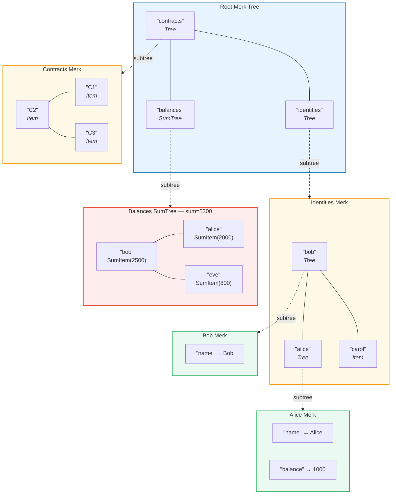
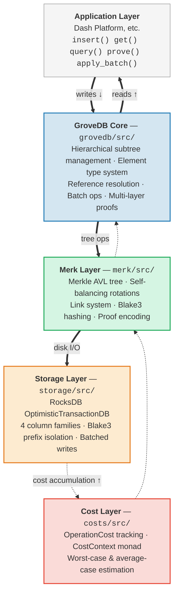

# مقدمة — ما هو GroveDB؟

## الفكرة الأساسية

GroveDB هو **بنية بيانات هرمية موثّقة تشفيرياً** — وهو في جوهره *بستان*
(شجرة من الأشجار) مبني على أشجار Merkle AVL (شجرة ميركل إيه في إل). كل عقدة في قاعدة البيانات هي جزء من شجرة
موثّقة تشفيرياً، وكل شجرة يمكن أن تحتوي على أشجار أخرى كأبناء،
مما يشكّل تسلسلاً هرمياً عميقاً من الحالة القابلة للتحقق.

> كل مربع ملون هو **شجرة Merk منفصلة**. الأسهم المتقطعة تُظهر علاقة الأشجار الفرعية — عنصر Tree في الأب يحتوي على مفتاح الجذر لشجرة Merk الابن.

في قاعدة بيانات تقليدية، قد تُخزَّن البيانات في مخزن مفتاح-قيمة مسطح مع
شجرة Merkle (شجرة ميركل) واحدة في الأعلى للتوثيق. يتبع GroveDB نهجاً مختلفاً:
فهو يُعشّش أشجار ميركل داخل أشجار ميركل. هذا يمنحك:

1. **فهارس ثانوية فعّالة** — الاستعلام بأي مسار، وليس فقط بالمفتاح الأساسي
2. **براهين تشفيرية مدمجة** — إثبات وجود (أو غياب) أي بيانات
3. **بيانات تجميعية** — يمكن للأشجار تلقائياً جمع أو عدّ أو تجميع
   أبنائها بطرق أخرى
4. **عمليات ذرية عبر الأشجار** — العمليات الدفعية تمتد عبر أشجار فرعية متعددة

## لماذا وُجد GroveDB

صُمّم GroveDB لمنصة **Dash Platform**، وهي منصة تطبيقات لامركزية
حيث يجب أن تكون كل جزء من الحالة:

- **موثّقاً**: أي عقدة يمكنها إثبات أي جزء من الحالة لعميل خفيف
- **حتمياً**: كل عقدة تحسب نفس جذر الحالة بالضبط
- **فعّالاً**: يجب أن تكتمل العمليات ضمن قيود وقت الكتلة
- **قابلاً للاستعلام**: التطبيقات تحتاج استعلامات غنية، وليس فقط بحث بالمفتاح

النهج التقليدية تقصر عن ذلك:

| النهج | المشكلة |
|-------|---------|
| شجرة ميركل عادية | تدعم فقط البحث بالمفتاح، بدون استعلامات نطاق |
| Ethereum MPT | إعادة موازنة مكلفة، أحجام براهين كبيرة |
| مفتاح-قيمة مسطح + شجرة واحدة | بدون استعلامات هرمية، برهان واحد يغطي كل شيء |
| شجرة B-tree | غير مُمركَلة بطبيعتها، توثيق معقد |

يحل GroveDB هذه المشاكل بدمج **ضمانات التوازن المثبتة لأشجار AVL**
مع **التعشيش الهرمي** و**نظام أنواع عناصر غني**.

## نظرة عامة على البنية

GroveDB منظّم في طبقات مميزة، كل منها بمسؤولية واضحة:

تتدفق البيانات **نزولاً** عبر هذه الطبقات أثناء الكتابة و**صعوداً** أثناء القراءة.
كل عملية تُراكم التكاليف أثناء عبورها للمكدس، مما يتيح محاسبة دقيقة
للموارد.

---
