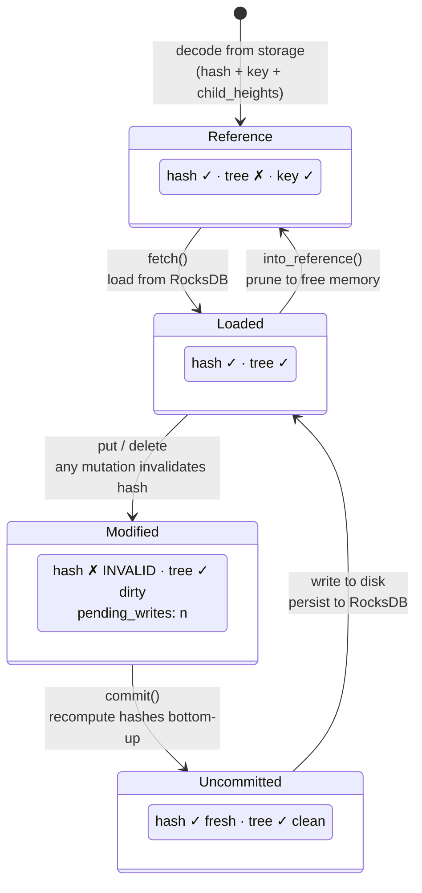
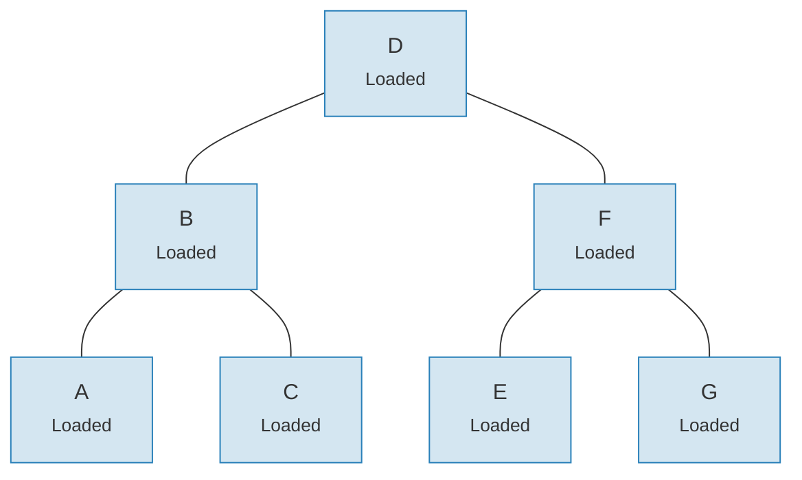
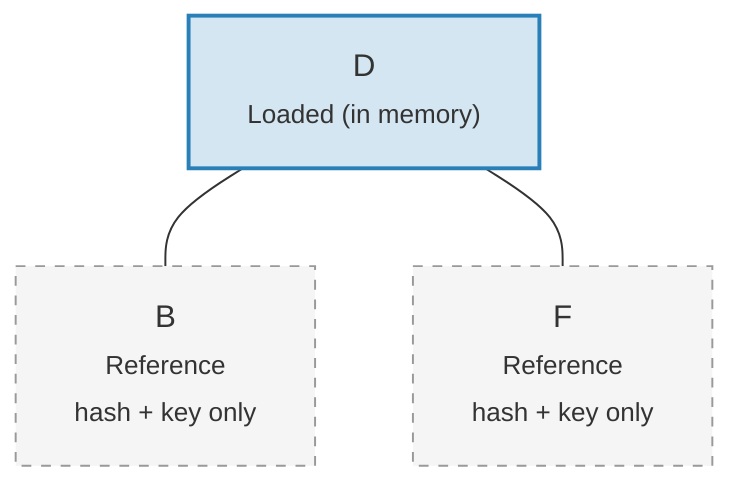

# نظام الروابط — بنية التحميل الكسول

تحميل شجرة Merk كاملة في الذاكرة سيكون مُكلفاً بشكل مفرط للأشجار الكبيرة.
يحل نظام الروابط (Link system) هذه المشكلة بتمثيل اتصالات الأبناء في أربع
حالات ممكنة، مما يُتيح **التحميل الكسول** (lazy loading) — يتم جلب الأبناء من التخزين فقط
عند الحاجة الفعلية إليهم.

## حالات الرابط الأربع

```rust
// merk/src/tree/link.rs
pub enum Link {
    Reference {                    // Pruned: only metadata, no tree in memory
        hash: CryptoHash,
        child_heights: (u8, u8),
        key: Vec<u8>,
        aggregate_data: AggregateData,
    },
    Modified {                     // Recently changed, hash not yet computed
        pending_writes: usize,
        child_heights: (u8, u8),
        tree: TreeNode,
    },
    Uncommitted {                  // Hashed but not yet persisted to storage
        hash: CryptoHash,
        child_heights: (u8, u8),
        tree: TreeNode,
        aggregate_data: AggregateData,
    },
    Loaded {                       // Fully loaded from storage
        hash: CryptoHash,
        child_heights: (u8, u8),
        tree: TreeNode,
        aggregate_data: AggregateData,
    },
}
```

## مخطط انتقال الحالات



## ما تُخزّنه كل حالة

| الحالة | تجزئة؟ | شجرة في الذاكرة؟ | الغرض |
|--------|--------|-------------------|-------|
| **Reference** | نعم | لا | تمثيل مدمج على القرص. يُخزّن فقط المفتاح والتجزئة وارتفاعات الأبناء والبيانات التجميعية. |
| **Modified** | لا | نعم | بعد أي تعديل. يتتبع عدد `pending_writes` لتحسين العمليات الدفعية. |
| **Uncommitted** | نعم | نعم | بعد حساب التجزئة ولكن قبل الكتابة للتخزين. حالة وسيطة أثناء الالتزام. |
| **Loaded** | نعم | نعم | مُجسَّد بالكامل. جاهز للقراءات أو تعديلات أخرى. |

حقل `pending_writes` في `Modified` جدير بالملاحظة:

```rust
// Computed as: 1 + left_pending_writes + right_pending_writes
pending_writes: 1 + tree.child_pending_writes(true)
                  + tree.child_pending_writes(false),
```

هذا العدّ يساعد مرحلة الالتزام في تحديد ترتيب الكتابات لتحقيق الأداء
الأمثل.

## نمط رد النداء Fetch

يستخدم نظام الروابط **سمة Fetch** (واجهة Fetch) للتجريد عن كيفية تحميل العقد الأبناء:

```rust
pub trait Fetch {
    fn fetch(
        &self,
        link: &Link,
        value_defined_cost_fn: Option<&impl Fn(&[u8], &GroveVersion) -> Option<ValueDefinedCostType>>,
        grove_version: &GroveVersion,
    ) -> CostResult<TreeNode, Error>;
}
```

تطبيقات Fetch المختلفة تخدم أغراضاً مختلفة:

- **StorageFetch**: التحميل من RocksDB (المسار العادي)
- **PanicSource**: يُستخدم في الاختبارات حيث لا يجب أن يحدث الجلب أبداً
- **MockSource**: يُرجع بيانات اختبار محكومة

هذا النمط يسمح لعمليات الشجرة بأن تكون **مستقلة عن التخزين** — نفس
منطق التوازن والتعديل يعمل بغض النظر عن مصدر البيانات.

## نمط Walker

`Walker` يُغلّف `TreeNode` مع مصدر `Fetch`، مما يوفر تنقلاً آمناً في الشجرة
مع تحميل كسول تلقائي (`merk/src/tree/walk/mod.rs`):

```rust
pub struct Walker<S: Fetch + Sized + Clone> {
    tree: Owner<TreeNode>,
    source: S,
}
```

يوفر Walker ثلاث عمليات أساسية:

**walk()** — فصل ابن، تحويله، وإعادة ربطه:

```rust
pub fn walk<F, T>(self, left: bool, f: F, ...) -> CostResult<Self, Error>
where
    F: FnOnce(Option<Self>) -> CostResult<Option<T>, Error>,
    T: Into<TreeNode>,
```

**detach()** — إزالة ابن، مع تحميله من التخزين إذا لزم الأمر:

```rust
pub fn detach(self, left: bool, ...) -> CostResult<(Self, Option<Self>), Error>
```

إذا كان الابن `Link::Reference` (مُقلَّم)، فإن detach سيستدعي `fetch()` لتحميله
أولاً. إذا كان الابن موجوداً في الذاكرة بالفعل (`Modified`، `Uncommitted`، `Loaded`)،
فإنه يأخذ الملكية ببساطة.

**attach()** — ربط ابن بأب:

```rust
pub fn attach(self, left: bool, maybe_child: Option<Self>) -> Self
```

الربط يُنشئ دائماً `Link::Modified` لأن علاقة الأب-الابن
قد تغيّرت.

## كفاءة الذاكرة من خلال التقليم

بعد التزام التغييرات، يمكن للشجرة **تقليم** الأشجار الفرعية المُحمَّلة وإرجاعها إلى
`Link::Reference`، مما يُحرّر الذاكرة مع الاحتفاظ بالتجزئة المطلوبة لتوليد
البراهين:

**قبل التقليم** — جميع العقد السبع في الذاكرة:



**بعد التقليم** — الجذر فقط في الذاكرة، الأبناء `Link::Reference` (تجزئة + مفتاح فقط):



> **Link::Loaded** يحتوي `hash + child_heights + tree (TreeNode)`. **Link::Reference** يحتوي فقط `hash + child_heights + key` — يتم تحرير TreeNode من الذاكرة.

التحويل بسيط:

```rust
pub fn into_reference(self) -> Link {
    Link::Reference {
        hash: self.hash(),
        child_heights: self.child_heights(),
        key: self.key().to_vec(),
        aggregate_data: self.aggregate_data(),
    }
}
```

هذا حاسم للحفاظ على استخدام ذاكرة محدود في الأشجار الكبيرة — فقط العقد
التي يتم الوصول إليها نشطاً تحتاج أن تكون في الذاكرة.

---
