# شجرة Merk — شجرة Merkle AVL

شجرة Merk هي الوحدة البنائية الأساسية في GroveDB. كل شجرة فرعية في
البستان هي شجرة Merk — شجرة بحث ثنائية ذاتية التوازن حيث يتم تجزئة كل عقدة
تشفيرياً، مما ينتج تجزئة جذر واحدة توثّق
محتويات الشجرة بالكامل.

## ما هي عقدة Merk؟

على عكس العديد من تطبيقات شجرة ميركل حيث تعيش البيانات فقط في الأوراق، في شجرة
Merk **كل عقدة تُخزّن زوج مفتاح-قيمة**. هذا يعني أنه لا توجد عقد داخلية "فارغة"
— الشجرة هي بنية بحث ومخزن بيانات في آن واحد.

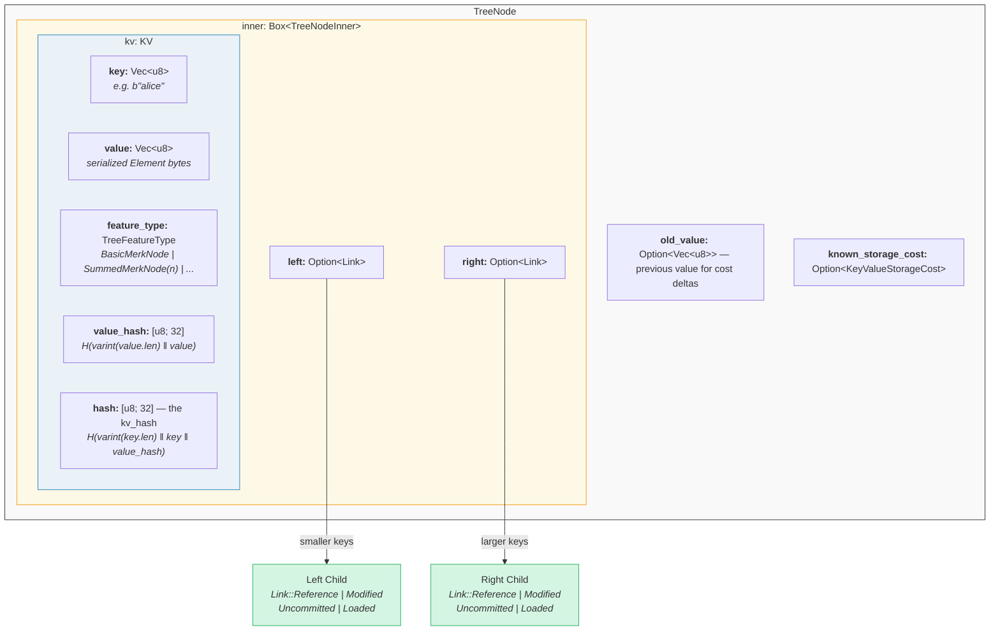

في الشيفرة (`merk/src/tree/mod.rs`):

```rust
pub struct TreeNode {
    pub(crate) inner: Box<TreeNodeInner>,
    pub(crate) old_value: Option<Vec<u8>>,        // Previous value for cost tracking
    pub(crate) known_storage_cost: Option<KeyValueStorageCost>,
}

pub struct TreeNodeInner {
    pub(crate) left: Option<Link>,    // Left child (smaller keys)
    pub(crate) right: Option<Link>,   // Right child (larger keys)
    pub(crate) kv: KV,               // The key-value payload
}
```

`Box<TreeNodeInner>` يُبقي العقدة على الكومة (heap)، وهو أمر ضروري لأن روابط الأبناء
يمكن أن تحتوي بشكل تكراري على نسخ `TreeNode` كاملة.

## بنية KV

بنية `KV` تحمل كلاً من البيانات الخام وملخصاتها التشفيرية
(`merk/src/tree/kv.rs`):

```rust
pub struct KV {
    pub(super) key: Vec<u8>,                        // The lookup key
    pub(super) value: Vec<u8>,                      // The stored value
    pub(super) feature_type: TreeFeatureType,       // Aggregation behavior
    pub(crate) value_defined_cost: Option<ValueDefinedCostType>,
    pub(super) hash: CryptoHash,                    // kv_hash
    pub(super) value_hash: CryptoHash,              // H(value)
}
```

نقطتان مهمتان:

1. **المفاتيح لا تُخزَّن على القرص كجزء من العقدة المُرمَّزة.** بل تُخزَّن كمفتاح
   RocksDB. عند فك ترميز عقدة من التخزين، يتم حقن المفتاح من
   الخارج. هذا يتجنب تكرار بايتات المفتاح.

2. **يتم الحفاظ على حقلَي تجزئة.** `value_hash` هو `H(value)` و
   `hash` (أي kv_hash) هو `H(key, value_hash)`. الاحتفاظ بكليهما يسمح لنظام البراهين
   باختيار مقدار المعلومات المكشوفة.

## الطبيعة شبه المتوازنة — كيف "تتذبذب" شجرة AVL

شجرة Merk هي **شجرة AVL** — شجرة البحث الثنائية الذاتية التوازن الكلاسيكية
التي اخترعها أديلسون-فيلسكي ولانديس. الثابت الأساسي هو:

> لكل عقدة، فرق الارتفاع بين شجرتيها الفرعيتين اليسرى واليمنى
> لا يتجاوز 1.

يُعبَّر عن هذا بـ **عامل التوازن** (balance factor):

```text
balance_factor = right_height - left_height
```

القيم الصالحة: **{-1, 0, 1}**

```rust
// merk/src/tree/mod.rs
pub const fn balance_factor(&self) -> i8 {
    let left_height = self.child_height(true) as i8;
    let right_height = self.child_height(false) as i8;
    right_height - left_height
}
```

لكن هنا النقطة الدقيقة: بينما كل عقدة فردية يمكن أن تميل بمستوى واحد فقط،
هذه الميلانات يمكن أن **تتراكم** عبر الشجرة. لهذا نسميها
"شبه متوازنة" — الشجرة ليست متوازنة تماماً مثل شجرة ثنائية كاملة.

خذ بعين الاعتبار شجرة من 10 عقد. شجرة متوازنة تماماً سيكون ارتفاعها 4
(⌈log₂(10+1)⌉). لكن شجرة AVL قد يكون ارتفاعها 5:

**متوازنة تماماً (ارتفاع 4)** — كل مستوى ممتلئ بالكامل:

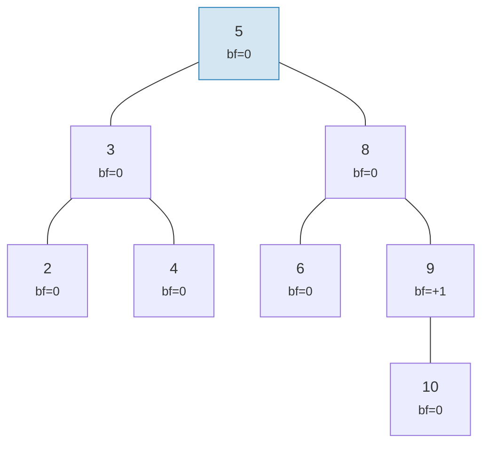

**"تذبذب" صالح لـ AVL (ارتفاع 5)** — كل عقدة تميل بواحد على الأكثر، لكن التراكم يحصل:

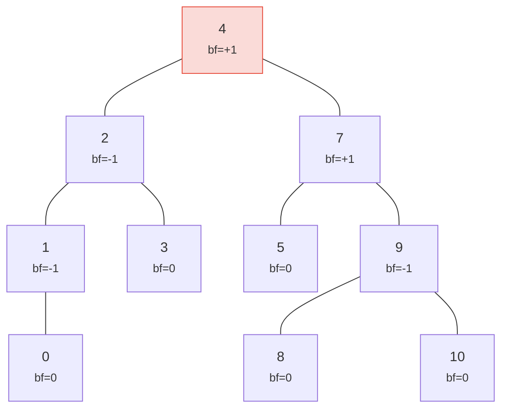

> ارتفاع 5 مقابل 4 المثالي — هذا هو "التذبذب". أسوأ حالة: h ≤ 1.44 × log₂(n+2).

كلتا الشجرتين شجرتا AVL صالحتان! أسوأ ارتفاع لشجرة AVL هو:

```text
h ≤ 1.4404 × log₂(n + 2) − 0.3277
```

إذاً لـ **n = 1,000,000** عقدة:
- توازن مثالي: ارتفاع 20
- أسوأ حالة AVL: ارتفاع ≈ 29

هذا الزيادة بنسبة ~44% هو ثمن قواعد الدوران البسيطة لـ AVL. عملياً، الإدراجات
العشوائية تنتج أشجاراً أقرب بكثير للتوازن المثالي.

إليك كيف تبدو الأشجار الصالحة وغير الصالحة:

**صالحة** — جميع عوامل التوازن في {-1, 0, +1}:

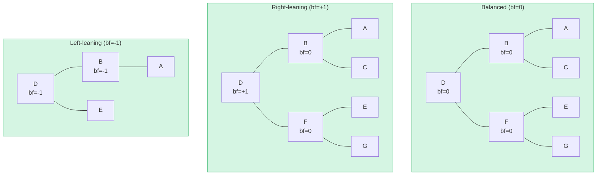

**غير صالحة** — عامل التوازن = +2 (يحتاج دوراناً!):

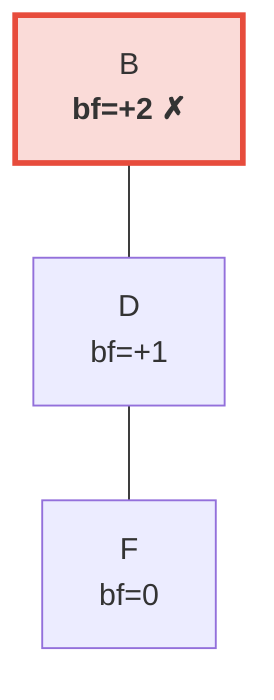

> الشجرة الفرعية اليمنى أطول بمستويين من اليسرى (الفارغة). هذا يُفعّل **دوراناً يسارياً** لاستعادة ثابت AVL.

## الدورانات — استعادة التوازن

عندما يتسبب إدراج أو حذف في وصول عامل التوازن إلى ±2، يجب أن تُدوَّر الشجرة
لاستعادة ثابت AVL. هناك أربع حالات، قابلة للاختزال إلى
عمليتين أساسيتين.

### دوران يساري مفرد

يُستخدم عندما تكون العقدة **ثقيلة يميناً** (bf = +2) وابنها الأيمن
**ثقيل يميناً أو متوازن** (bf ≥ 0):

**قبل** (bf=+2):

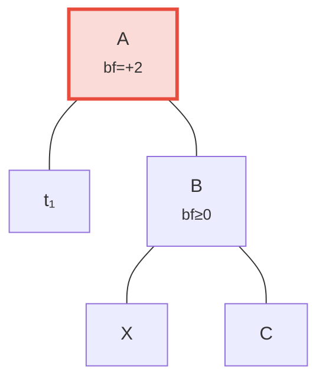

**بعد** الدوران اليساري — B يُرقَّى إلى الجذر:

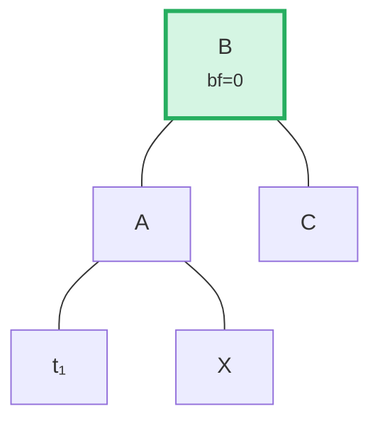

> **الخطوات:** (1) فصل B عن A. (2) فصل X (ابن B الأيسر). (3) ربط X كابن أيمن لـ A. (4) ربط A كابن أيسر لـ B. الشجرة الفرعية ذات الجذر B أصبحت الآن متوازنة.

في الشيفرة (`merk/src/tree/ops.rs`):

```rust
fn rotate<V>(self, left: bool, ...) -> CostResult<Self, Error> {
    // Detach child on the heavy side
    let (tree, child) = self.detach_expect(left, ...);
    // Detach grandchild from opposite side of child
    let (child, maybe_grandchild) = child.detach(!left, ...);

    // Attach grandchild to original root
    tree.attach(left, maybe_grandchild)
        .maybe_balance(...)
        .flat_map_ok(|tree| {
            // Attach original root as child of promoted node
            child.attach(!left, Some(tree))
                .maybe_balance(...)
        })
}
```

لاحظ كيف يتم استدعاء `maybe_balance` بشكل تكراري — الدوران نفسه قد يُنشئ
اختلالات جديدة تحتاج تصحيحاً إضافياً.

### دوران مزدوج (يسار-يمين)

يُستخدم عندما تكون العقدة **ثقيلة يساراً** (bf = -2) لكن ابنها الأيسر
**ثقيل يميناً** (bf > 0). دوران مفرد لن يُصلح هذا:

**الخطوة 0: قبل** — C ثقيلة يساراً (bf=-2) لكن ابنها الأيسر A يميل يميناً (bf=+1). دوران مفرد لن يُصلح هذا:

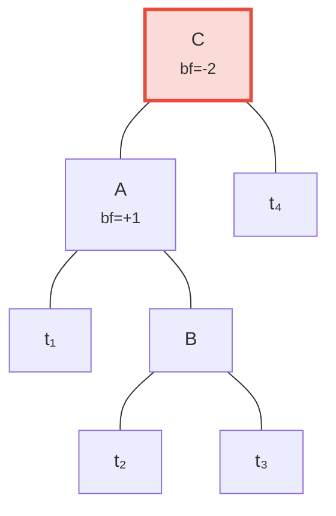

**الخطوة 1: دوران يساري للابن A** — الآن كلا C وB يميلان يساراً، قابل للإصلاح بدوران مفرد:

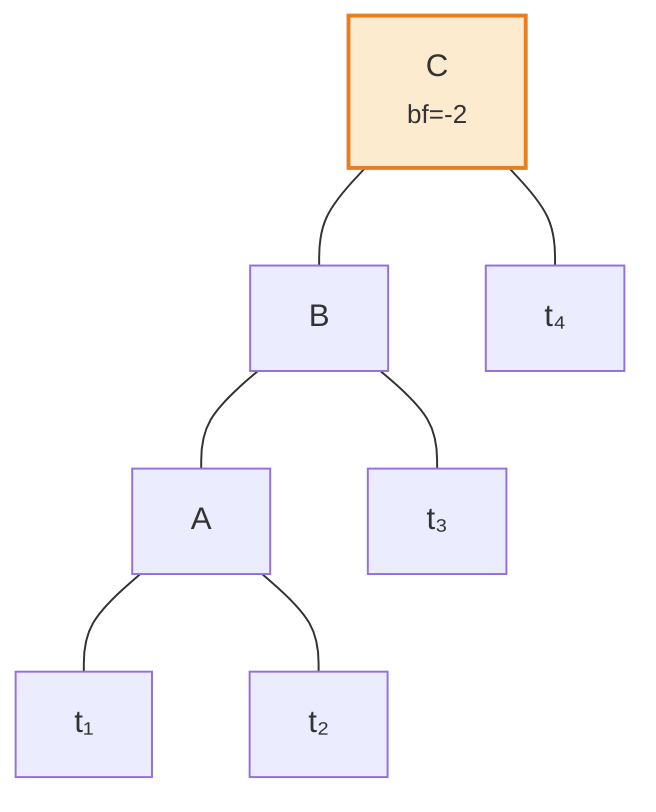

**الخطوة 2: دوران يميني للجذر C** — متوازن!

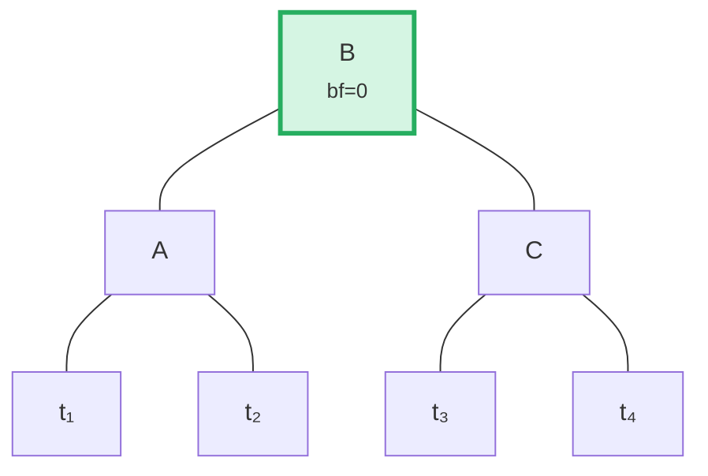

تكتشف الخوارزمية هذه الحالة بمقارنة اتجاه ميلان الأب مع
عامل توازن الابن:

```rust
fn maybe_balance<V>(self, ...) -> CostResult<Self, Error> {
    let balance_factor = self.balance_factor();
    if balance_factor.abs() <= 1 {
        return Ok(self);  // Already balanced
    }

    let left = balance_factor < 0;  // true if left-heavy

    // Double rotation needed when child leans opposite to parent
    let tree = if left == (self.tree().link(left).unwrap().balance_factor() > 0) {
        // First rotation: rotate child in opposite direction
        self.walk_expect(left, |child|
            child.rotate(!left, ...).map_ok(Some), ...
        )
    } else {
        self
    };

    // Second (or only) rotation
    tree.rotate(left, ...)
}
```

## العمليات الدفعية — البناء والتطبيق

بدلاً من إدراج العناصر واحداً تلو الآخر، يدعم Merk العمليات الدفعية التي
تُطبّق تغييرات متعددة في تمريرة واحدة. هذا حاسم للكفاءة: دفعة
من N عملية على شجرة من M عنصر تستغرق **O((M + N) log(M + N))** وقتاً،
مقابل O(N log M) للإدراجات المتتابعة.

### نوع MerkBatch

```rust
type MerkBatch<K> = [(K, Op)];

enum Op {
    Put(Vec<u8>, TreeFeatureType),  // Insert or update with value and feature type
    PutWithSpecializedCost(...),     // Insert with predefined cost
    PutCombinedReference(...),       // Insert reference with combined hash
    Replace(Vec<u8>, TreeFeatureType),
    Patch { .. },                    // Partial value update
    Delete,                          // Remove key
    DeleteLayered,                   // Remove with layered cost
    DeleteMaybeSpecialized,          // Remove with optional specialized cost
}
```

### الاستراتيجية 1: build() — البناء من الصفر

عندما تكون الشجرة فارغة، `build()` تُنشئ شجرة متوازنة مباشرة من
الدفعة المرتبة باستخدام خوارزمية **تقسيم الوسيط**:

الدفعة المُدخلة (مرتبة): `[A, B, C, D, E, F, G]` — اختر الوسط (D) كجذر، كرر لكل نصف:

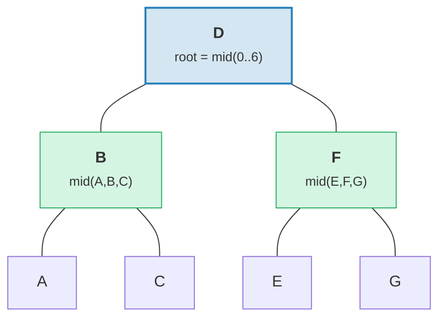

> النتيجة: شجرة متوازنة تماماً بارتفاع = 3 = ⌈log₂(7)⌉.

```rust
fn build(batch: &MerkBatch<K>, ...) -> CostResult<Option<TreeNode>, Error> {
    let mid_index = batch.len() / 2;
    let (mid_key, mid_op) = &batch[mid_index];

    // Create root node from middle element
    let mid_tree = TreeNode::new(mid_key.clone(), value.clone(), None, feature_type)?;

    // Recursively build left and right subtrees
    let left = Self::build(&batch[..mid_index], ...);
    let right = Self::build(&batch[mid_index + 1..], ...);

    // Attach children
    mid_tree.attach(true, left).attach(false, right)
}
```

ينتج هذا شجرة بارتفاع ⌈log₂(n)⌉ — متوازنة تماماً.

### الاستراتيجية 2: apply_sorted() — الدمج في شجرة موجودة

عندما تحتوي الشجرة على بيانات بالفعل، `apply_sorted()` يستخدم **البحث الثنائي** لإيجاد
مكان كل عملية دفعية، ثم يُطبّق العمليات بشكل تكراري على الشجر الفرعية
اليسرى واليمنى:

شجرة موجودة مع الدفعة `[(B, Put), (F, Delete)]`:

بحث ثنائي: B < D (اذهب يساراً)، F > D (اذهب يميناً).

**قبل:**
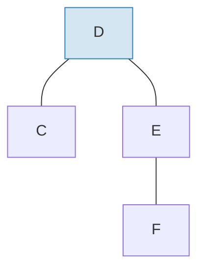

**بعد** تطبيق الدفعة وإعادة التوازن:
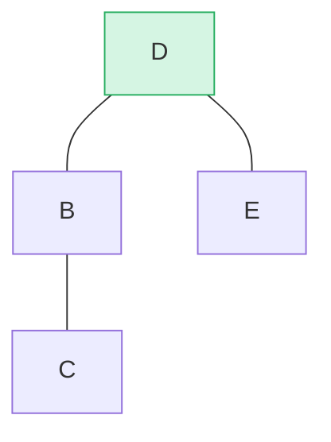

> أُدرج B كشجرة فرعية يسرى، وحُذف F من الشجرة الفرعية اليمنى. `maybe_balance()` يُؤكد bf(D) = 0.

```rust
fn apply_sorted(self, batch: &MerkBatch<K>, ...) -> CostResult<...> {
    let search = batch.binary_search_by(|(key, _)| key.cmp(self.tree().key()));

    match search {
        Ok(index) => {
            // Key matches this node — apply operation directly
            // (Put replaces value, Delete removes node)
        }
        Err(mid) => {
            // Key not found — mid is the split point
            // Recurse on left_batch[..mid] and right_batch[mid..]
        }
    }

    self.recurse(batch, mid, exclusive, ...)
}
```

دالة `recurse` تُقسّم الدفعة وتمشي يساراً ويميناً:

```rust
fn recurse(self, batch: &MerkBatch<K>, mid: usize, ...) {
    let left_batch = &batch[..mid];
    let right_batch = &batch[mid..];  // or mid+1 if exclusive

    // Apply left batch to left subtree
    let tree = self.walk(true, |maybe_left| {
        Self::apply_to(maybe_left, left_batch, ...)
    });

    // Apply right batch to right subtree
    let tree = tree.walk(false, |maybe_right| {
        Self::apply_to(maybe_right, right_batch, ...)
    });

    // Re-balance after modifications
    tree.maybe_balance(...)
}
```

### حذف العقد

عند حذف عقدة ذات ابنين، يُرقّي Merk **عقدة الحافة** من
الشجرة الفرعية الأطول. هذا يُقلّل من احتمال الحاجة لدورانات إضافية:

**قبل** — حذف D (لديها ابنان، ارتفاع الشجرة الفرعية اليمنى ≥ اليسرى):

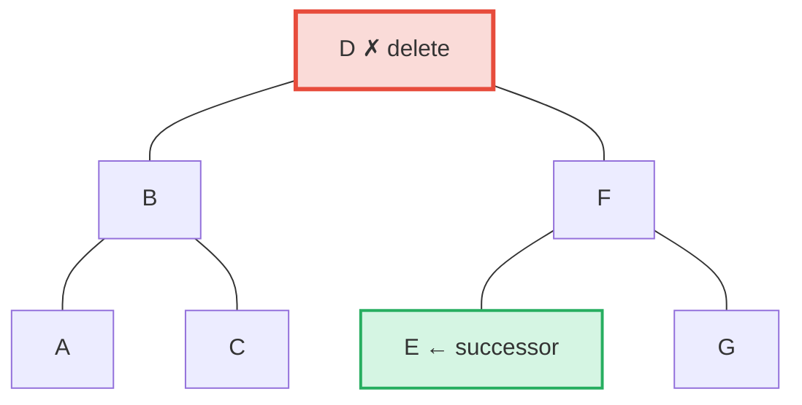

**بعد** — E (الأقصى يساراً في الشجرة الفرعية اليمنى = الخلف بالترتيب) يُرقَّى لموقع D:

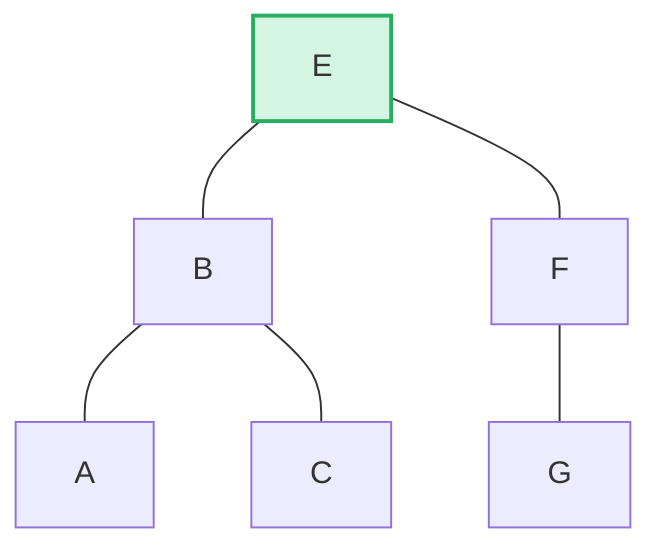

> **القاعدة:** إذا كان ارتفاع اليسار > اليمين → رقّي حافة اليمين من الشجرة الفرعية اليسرى. إذا كان ارتفاع اليمين ≥ اليسار → رقّي حافة اليسار من الشجرة الفرعية اليمنى. هذا يُقلّل إعادة التوازن بعد الحذف.

```rust
pub fn remove(self, ...) -> CostResult<Option<Self>, Error> {
    let has_left = tree.link(true).is_some();
    let has_right = tree.link(false).is_some();
    let left = tree.child_height(true) > tree.child_height(false);

    if has_left && has_right {
        // Two children: promote edge of taller child
        let (tree, tall_child) = self.detach_expect(left, ...);
        let (_, short_child) = tree.detach_expect(!left, ...);
        tall_child.promote_edge(!left, short_child, ...)
    } else if has_left || has_right {
        // One child: promote it directly
        self.detach_expect(left, ...).1
    } else {
        // Leaf node: just remove
        None
    }
}
```

---
