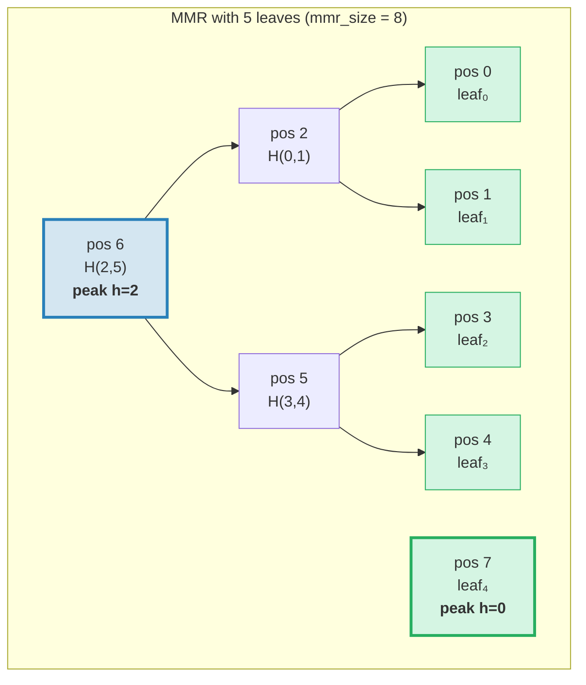
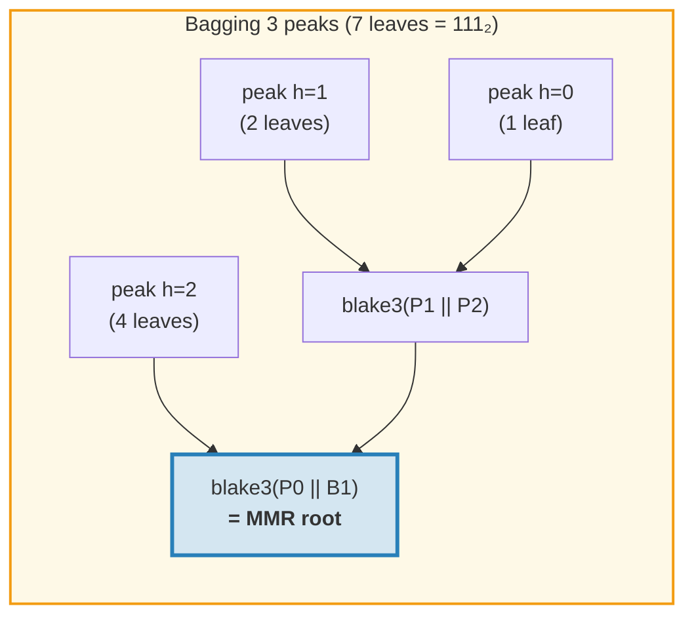
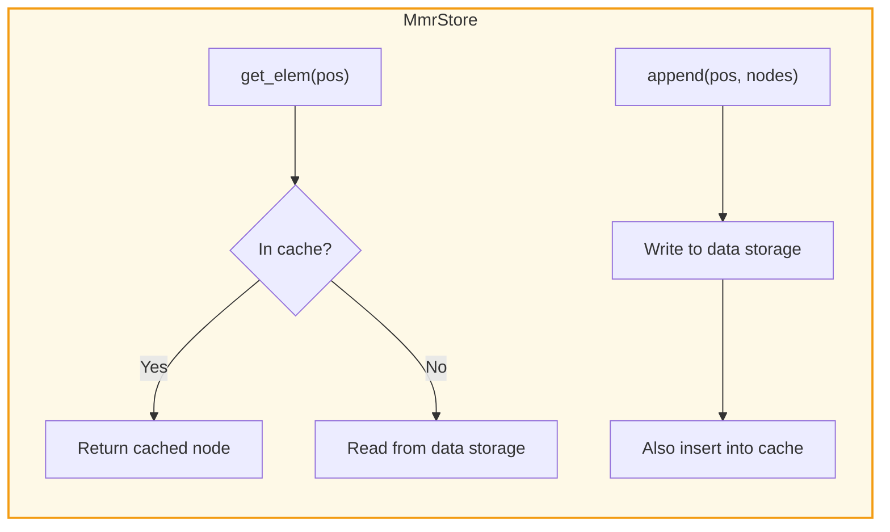
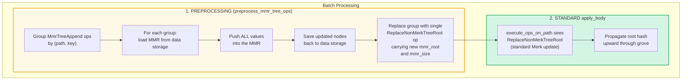
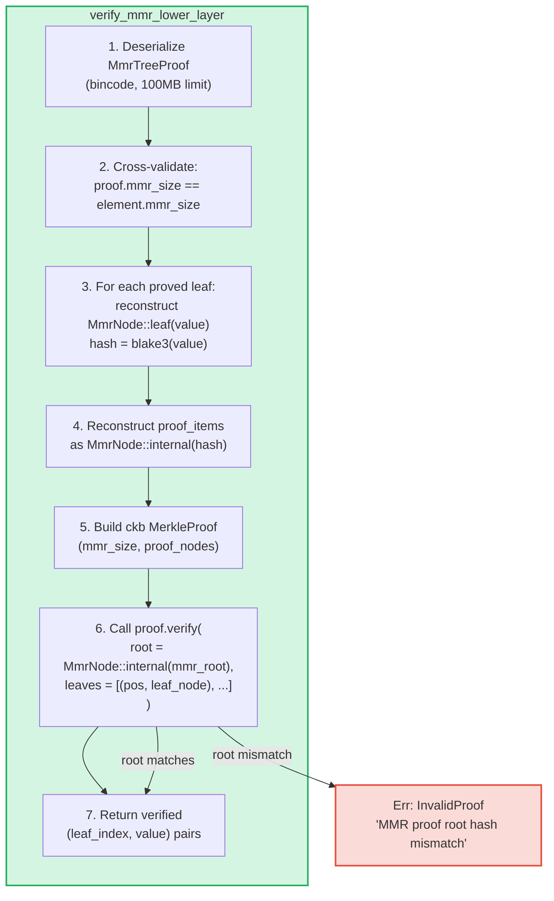

# شجرة MMR — سجلات موثّقة للإلحاق فقط

**MmrTree** هي بنية بيانات موثّقة للإلحاق فقط في GroveDB، مبنية على
نطاق جبل ميركل (Merkle Mountain Range أو MMR) مع تجزئة Blake3. بينما تتفوق أشجار Merk AVL
(الفصل 2) في عمليات مفتاح-قيمة العشوائية بتحديثات O(log N)، فإن MMR
مُصمَّم خصيصاً لحالة الإلحاق فقط: لا دورانات، تكلفة تجزئة O(1)
مُطفأة لكل إلحاق، وأنماط إدخال/إخراج تتابعية.

يغطي هذا الفصل بنية بيانات MMR بعمق — كيف تنمو، وكيف تُخزَّن العقد،
وكيف تتتالى عمليات الإلحاق، وكيف يتيح نظام البراهين لأي طرف ثالث
التحقق من أن قيمة محددة أُلحقت في موقع محدد.

## لماذا نوع شجرة منفصل؟

أشجار Merk القياسية في GroveDB تتعامل جيداً مع بيانات المفتاح-القيمة المُرتّبة، لكن
سجلات الإلحاق فقط لها متطلبات مختلفة:

| الخاصية | شجرة Merk AVL | MMR |
|---------|---------------|-----|
| العمليات | إدراج، تحديث، حذف | إلحاق فقط |
| إعادة التوازن | دورانات O(log N) لكل كتابة | لا شيء |
| نمط الإدخال/الإخراج | عشوائي (إعادة التوازن تلمس عقد كثيرة) | تتابعي (العقد الجديدة دائماً في النهاية) |
| إجمالي التجزئات لـ N إدراج | O(N log N) | O(N) |
| البنية | محددة بترتيب الإدراج | محددة فقط بعدد الأوراق |
| البراهين | مسار من الجذر إلى الورقة | تجزئات الأشقاء + القمم |

لحالات الاستخدام مثل سجلات المعاملات أو تدفقات الأحداث أو أي بيانات
متنامية بشكل رتيب، MMR أفضل بشكل مطلق: أبسط وأسرع وأكثر قابلية للتنبؤ.

## بنية بيانات MMR

MMR هي **غابة من أشجار ثنائية كاملة** (تُسمى "قمماً") تنمو من اليسار
إلى اليمين. كل قمة هي شجرة ثنائية كاملة بارتفاع *h* ما، تحتوي
بالضبط 2^h ورقة.

الرؤية الأساسية: **التمثيل الثنائي لعدد الأوراق يُحدّد بنية
القمم**. كل بت 1 في الشكل الثنائي يتوافق مع قمة واحدة:

```text
Leaf count    Binary    Peaks
─────────     ──────    ─────
1             1         one peak h=0
2             10        one peak h=1
3             11        peaks h=1, h=0
4             100       one peak h=2
5             101       peaks h=2, h=0
6             110       peaks h=2, h=1
7             111       peaks h=2, h=1, h=0
8             1000      one peak h=3
```

هذا يعني أن بنية MMR محددة بالكامل برقم واحد — عدد
الأوراق. اثنتان من MMR بنفس عدد الأوراق لهما دائماً نفس الشكل،
بغض النظر عن القيم المُلحقة.

## كيف تمتلئ MMR

كل عقدة في MMR لها **موقع** (بفهرسة من 0). الأوراق والعقد الداخلية
متشابكة بنمط محدد. هنا النمو خطوة بخطوة:

**بعد ورقة واحدة (mmr_size = 1):**
```text
pos:  0
      leaf₀        ← one peak at height 0
```

**بعد ورقتين (mmr_size = 3):**
```text
pos:     2          ← internal: blake3(leaf₀.hash || leaf₁.hash)
        / \
       0   1        ← leaves

One peak at height 1. Positions 0 and 1 are leaves, position 2 is internal.
```
عند إلحاق leaf₁، أنشأت قمة بارتفاع 0. لكن كانت هناك بالفعل
قمة بارتفاع 0 (leaf₀)، فـ **دُمجتا** في قمة بارتفاع 1.

**بعد 3 أوراق (mmr_size = 4):**
```text
pos:     2     3    ← peak h=1, peak h=0
        / \
       0   1

Two peaks. No merge — heights 1 and 0 are different.
(Binary: 3 = 11₂ → one peak per 1-bit)
```

**بعد 4 أوراق (mmr_size = 7):**
```text
pos:         6              ← internal: merge of nodes 2 and 5
           /   \
         2       5          ← internal nodes
        / \     / \
       0   1   3   4        ← leaves

One peak at height 2.
```
هنا يصبح الأمر مثيراً. إلحاق leaf₃ (الموقع 4) يُنشئ node₅
(دمج الموقعين 3 و4). لكن الآن node₅ (ارتفاع 1) وnode₂ (ارتفاع 1)
قمتان متجاورتان بنفس الارتفاع، فتندمجان في node₆. **تتالي دمجين
من إلحاق واحد.**

**بعد 5 أوراق (mmr_size = 8):**
```text
pos:         6         7    ← peak h=2, peak h=0
           /   \
         2       5
        / \     / \
       0   1   3   4

Two peaks. (Binary: 5 = 101₂)
```

**بعد 7 أوراق (mmr_size = 11):**
```text
pos:         6         10    ← peak h=2, peak h=1, peak h=0
           /   \      / \
         2       5   8   9    7
        / \     / \
       0   1   3   4

Three peaks. (Binary: 7 = 111₂)
```

**بعد 8 أوراق (mmr_size = 15):**
```text
pos:              14                     ← single peak h=3
               /      \
            6            13
          /   \        /    \
        2       5    9       12
       / \     / \  / \     / \
      0   1   3  4 7   8  10  11

One peak at height 3. Three cascading merges from appending leaf₇.
```



> **الأزرق** = القمم (جذور الأشجار الثنائية الفرعية الكاملة). **الأخضر** = العقد الورقية.

## تتالي الدمج

عند إلحاق ورقة جديدة، قد يُفعّل سلسلة من عمليات الدمج. عدد
عمليات الدمج يساوي عدد **البتات 1 اللاحقة** في التمثيل الثنائي
لعدد الأوراق الحالي:

| عدد الأوراق (قبل الدفع) | ثنائي | بتات 1 لاحقة | عمليات الدمج | إجمالي التجزئات |
|--------------------------|-------|---------------|--------------|----------------|
| 0 | `0` | 0 | 0 | 1 (ورقة فقط) |
| 1 | `1` | 1 | 1 | 2 |
| 2 | `10` | 0 | 0 | 1 |
| 3 | `11` | 2 | 2 | 3 |
| 4 | `100` | 0 | 0 | 1 |
| 5 | `101` | 1 | 1 | 2 |
| 6 | `110` | 0 | 0 | 1 |
| 7 | `111` | 3 | 3 | 4 |

**إجمالي التجزئات لكل دفع** = `1 + trailing_ones(leaf_count)`:
- تجزئة واحدة للورقة نفسها: `blake3(value)`
- N تجزئة لتتالي الدمج: `blake3(left.hash || right.hash)` لكل
  دمج

هكذا يتتبع GroveDB تكاليف التجزئة لكل إلحاق. التنفيذ:
```rust
pub fn hash_count_for_push(leaf_count: u64) -> u32 {
    1 + leaf_count.trailing_ones()
}
```

## حجم MMR مقابل عدد الأوراق

تُخزّن MMR كلاً من الأوراق والعقد الداخلية في فضاء مواقع مسطح، لذا
`mmr_size` دائماً أكبر من عدد الأوراق. العلاقة الدقيقة هي:

```text
mmr_size = 2 * leaf_count - popcount(leaf_count)
```

حيث `popcount` هو عدد البتات 1 (أي عدد القمم). كل
عقدة داخلية تدمج شجرتين فرعيتين، مما يُقلّل عدد العقد بواحد لكل دمج.

| mmr_size | leaf_count | القمم |
|----------|-----------|-------|
| 0 | 0 | (فارغ) |
| 1 | 1 | h=0 |
| 3 | 2 | h=1 |
| 4 | 3 | h=1, h=0 |
| 7 | 4 | h=2 |
| 8 | 5 | h=2, h=0 |
| 10 | 6 | h=2, h=1 |
| 11 | 7 | h=2, h=1, h=0 |
| 15 | 8 | h=3 |

يُخزّن GroveDB `mmr_size` في العنصر (وليس عدد الأوراق) لأن مكتبة ckb MMR
تستخدم المواقع داخلياً. عملية `mmr_tree_leaf_count` تشتق
عدد الأوراق أثناء التشغيل.

## تجزئة جذر MMR — تجميع القمم

لـ MMR قمم متعددة (واحدة لكل بت 1 في عدد الأوراق). لإنتاج
تجزئة جذر واحدة من 32 بايت، يتم **"تجميع"** القمم من اليمين لليسار:

```text
root = bag_rhs_peaks(peaks):
    start with rightmost peak
    fold leftward: blake3(left_peak || accumulated_right)
```

مع قمة واحدة، الجذر هو تجزئة تلك القمة. مع 3 قمم:



> تجزئة الجذر تتغير مع **كل** إلحاق، حتى عندما لا تحدث عمليات دمج،
> لأن القمة اليمنى تتغير ويجب إعادة حساب التجميع.

## بنية العقدة والترميز التسلسلي

كل عقدة MMR هي `MmrNode`:

```rust
struct MmrNode {
    hash: [u8; 32],           // Blake3 hash
    value: Option<Vec<u8>>,   // Some for leaves, None for internal nodes
}
```

**عقدة ورقية:** `hash = blake3(value_bytes)`، `value = Some(value_bytes)`
**عقدة داخلية:** `hash = blake3(left.hash || right.hash)`، `value = None`

دالة الدمج مباشرة — ربط تجزئتين من 32 بايت ثم تجزئتهما بـ Blake3:

```rust
fn blake3_merge(left: &[u8; 32], right: &[u8; 32]) -> [u8; 32] {
    let mut input = [0u8; 64];
    input[..32].copy_from_slice(left);
    input[32..].copy_from_slice(right);
    *blake3::hash(&input).as_bytes()
}
```

**صيغة الترميز التسلسلي:**
```text
Internal: [0x00] [hash: 32 bytes]                                = 33 bytes
Leaf:     [0x01] [hash: 32 bytes] [value_len: 4 BE] [value...]   = 37 + len bytes
```

## بنية التخزين

تُخزّن MmrTree عقدها في عمود **البيانات** (نفس عائلة الأعمدة المُستخدمة
لعقد Merk)، وليس في شجرة Merk فرعية ابن. العنصر لا يحتوي حقل `root_key`
— تجزئة جذر MMR تتدفق كـ **تجزئة ابن** Merk عبر
`insert_subtree(subtree_root_hash)`، موثّقة حالة MMR.

**مفاتيح التخزين** مبنية على المواقع:
```text
key = 'm' || position_as_be_u64    (9 bytes: prefix + u64 BE)
```

**ذاكرة مؤقتة للكتابة الفورية:** أثناء الإلحاق، يجب أن تكون العقد المكتوبة حديثاً
قابلة للقراءة فوراً لعمليات الدمج التالية في نفس الدفع.



**انتشار تجزئة الجذر إلى جذر حالة GroveDB:**

```text
combined_value_hash = blake3(
    blake3(varint(len) || element_bytes),   ← value_hash from serialized Element
    mmr_root_hash                           ← child_hash = type-specific root
)
```

## عمليات GroveDB

توفر MmrTree أربع عمليات:

```rust
// Append a value — returns (new_mmr_root, leaf_index)
db.mmr_tree_append(path, key, value, tx, version)

// Read the current root hash (from Element, no storage access)
db.mmr_tree_root_hash(path, key, tx, version)

// Get a leaf value by 0-based index
db.mmr_tree_get_value(path, key, leaf_index, tx, version)

// Get the number of leaves appended
db.mmr_tree_leaf_count(path, key, tx, version)
```

### تدفق الإلحاق

```mermaid
graph TD
    subgraph append["mmr_tree_append(path, key, value, tx)"]
        A1["1. Read Element at path/key<br/>→ get mmr_size, flags"]
        A2["2. Open data storage at<br/>path/key subtree"]
        A3["3. Create MmrNode::leaf(value)<br/>hash = blake3(value)"]
        A4["4. Push leaf into ckb MMR<br/>→ cascading merges write<br/>new internal nodes"]
        A5["5. Commit → flush new<br/>nodes to storage"]
        A6["6. Bag peaks → new mmr_root"]
        A7["7. Update Element with<br/>new mmr_root and mmr_size"]
        A8["8. Propagate changes up<br/>through GroveDB Merk<br/>hierarchy + commit tx"]

        A1 --> A2 --> A3 --> A4 --> A5 --> A6 --> A7 --> A8
    end

    style append fill:#d5f5e3,stroke:#27ae60,stroke-width:2px
    style A6 fill:#d4e6f1,stroke:#2980b9,stroke-width:2px
```



## العمليات الدفعية

يمكن تجميع عمليات إلحاق MMR متعددة باستخدام `GroveOp::MmrTreeAppend { value }`.
لأن دالة `execute_ops_on_path` القياسية لا تصل إلا إلى Merk (وليس سياق تخزين MMR)، تستخدم عمليات إلحاق MMR **مرحلة معالجة مسبقة**:



## توليد البراهين

براهين MMR هي **براهين V1** — تستخدم متغير `ProofBytes::MMR` في بنية
البراهين المتعددة الطبقات (انظر §9.6).

### بنية MmrTreeProof

```rust
struct MmrTreeProof {
    mmr_size: u64,                 // MMR size at proof time
    leaves: Vec<(u64, Vec<u8>)>,   // (leaf_index, value) for each proved leaf
    proof_items: Vec<[u8; 32]>,    // Sibling/peak hashes for verification
}
```

## التحقق من البراهين

التحقق هو عملية **صافية** — لا يتطلب أي وصول لقاعدة البيانات.



### سلسلة الثقة

```text
GroveDB state_root (known/trusted)
│
├─ V0 Merk proof layer 0: proves subtree exists at root
│   └─ root_hash matches state_root ✓
│
├─ V0 Merk proof layer 1: proves MmrTree element at path/key
│   └─ KVValueHash node: element_bytes contain mmr_root
│   └─ combined_hash = combine_hash(H(element_bytes), mmr_root)
│   └─ root_hash matches parent layer ✓
│
└─ V1 MMR proof: proves leaf values are in the MMR
    └─ Reconstruct paths from leaves through siblings to peaks
    └─ Bag peaks → reconstructed root
    └─ reconstructed root == mmr_root from element_bytes ✓
    └─ Result: leaf₂ = [verified value bytes]
```

## تتبع التكاليف

| العملية | استدعاءات التجزئة | عمليات التخزين |
|---------|-------------------|----------------|
| إلحاق ورقة واحدة | `1 + trailing_ones(leaf_count)` | كتابة ورقة واحدة + N كتابة داخلية |
| تجزئة الجذر | 0 (مُخزَّنة مؤقتاً في العنصر) | قراءة عنصر واحد |
| الحصول على قيمة | 0 | قراءة عنصر + قراءة بيانات واحدة |
| عدد الأوراق | 0 | قراءة عنصر واحد |

**تحليل مُطفأ:** على N إلحاق، إجمالي التجزئات هو ≈ 2N.
التكلفة المُطفأة لكل إلحاق هي تقريباً **استدعاءان لتجزئة Blake3** —
ثابتة ومستقلة عن حجم الشجرة.

## مقارنة مع البنى الموثّقة الأخرى

| | MMR (MmrTree) | Merk AVL (Tree) | Sinsemilla (CommitmentTree) |
|---|---|---|---|
| **حالة الاستخدام** | سجلات إلحاق فقط | مخزن مفتاح-قيمة | التزامات صديقة للـ ZK |
| **دالة التجزئة** | Blake3 | Blake3 | Sinsemilla (منحنى Pallas) |
| **العمليات** | إلحاق، قراءة بالفهرس | إدراج، تحديث، حذف، استعلام | إلحاق، شاهد |
| **تجزئة مُطفأة/كتابة** | ~2 | O(log N) | ~33 (32 مستوى + أومرات) |
| **نوع البرهان** | V1 (تجزئات أشقاء MMR) | V0 (برهان مسار Merk) | شاهد (مسار توثيق ميركل) |
| **صديقة للـ ZK** | لا | لا | نعم (دوائر Halo 2) |
| **إعادة التوازن** | لا شيء | دورانات AVL | لا شيء |
| **دعم الحذف** | لا | نعم | لا |

---
