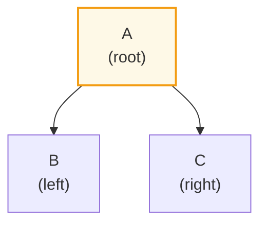
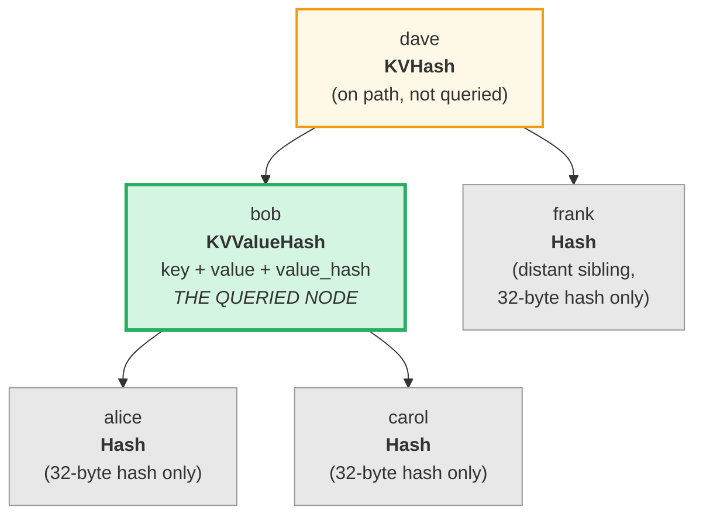
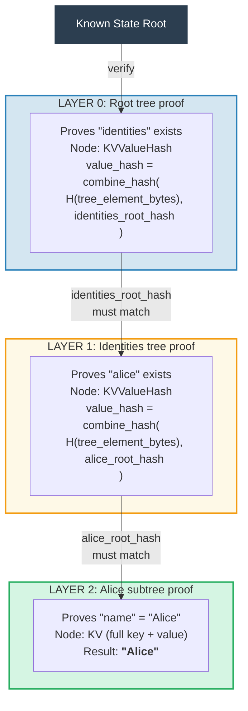
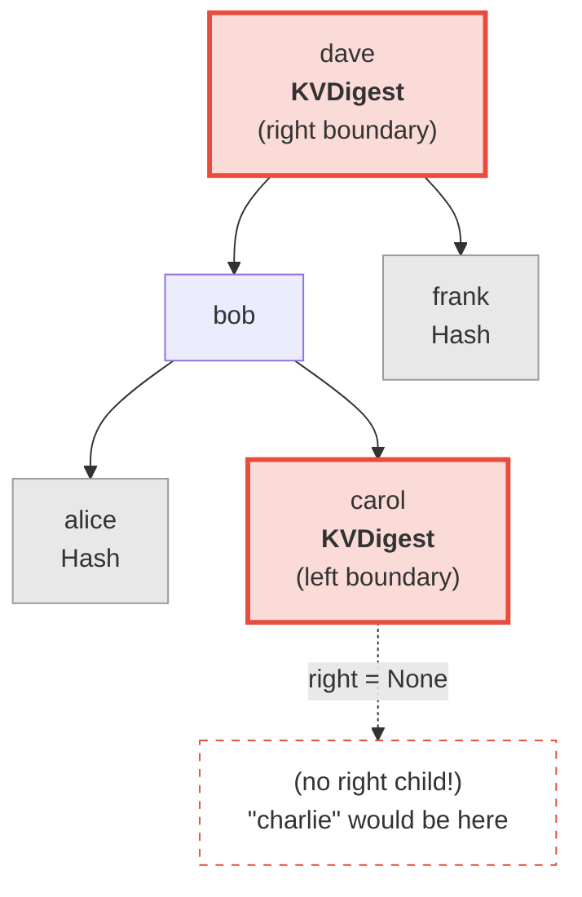
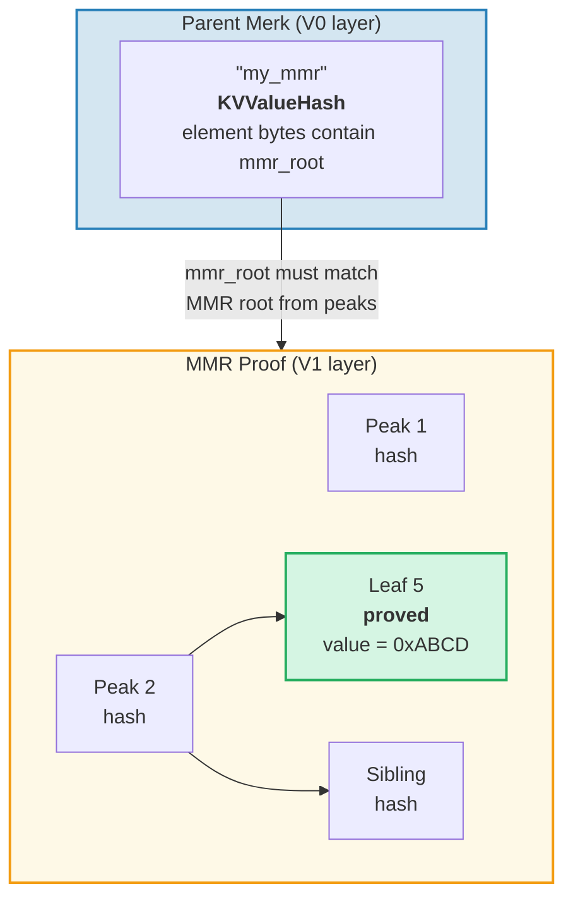
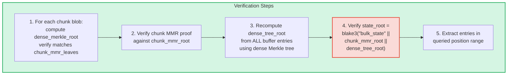
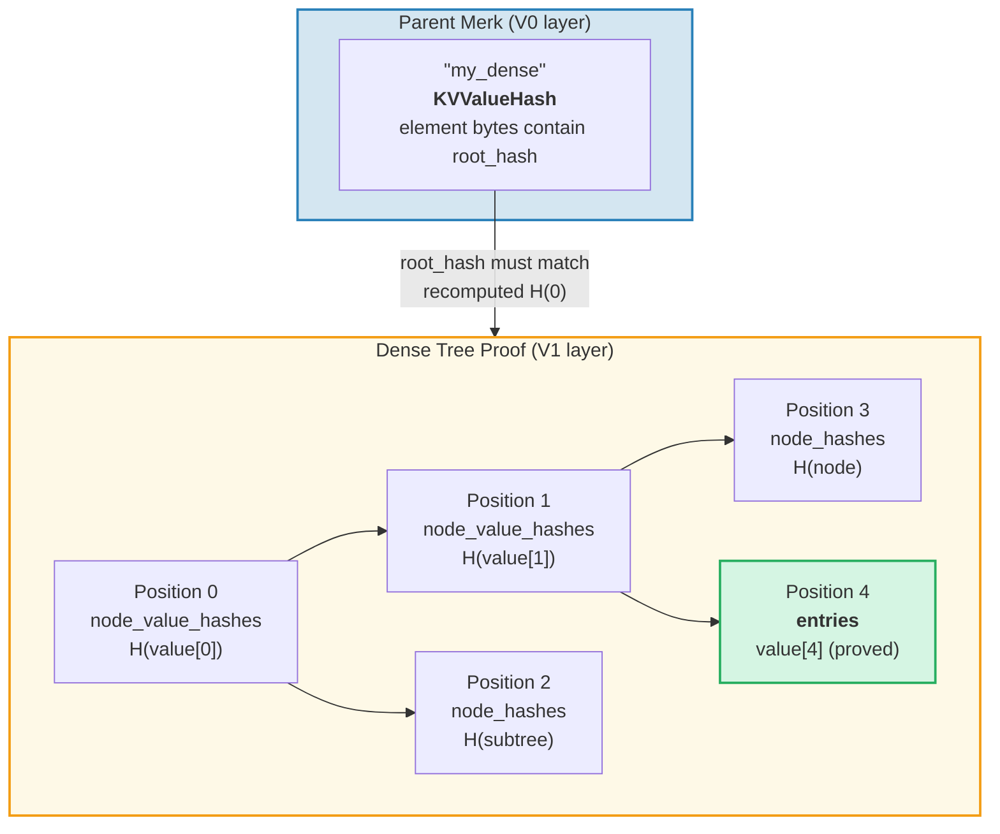

# نظام البراهين

نظام البراهين في GroveDB يسمح لأي طرف بالتحقق من صحة نتائج الاستعلام
بدون امتلاك قاعدة البيانات الكاملة. البرهان هو تمثيل مدمج لبنية
الشجرة ذات الصلة يسمح بإعادة بناء تجزئة الجذر.

## عمليات البرهان المبنية على المكدس

تُرمَّز البراهين كسلسلة من **العمليات** التي تُعيد بناء شجرة جزئية
باستخدام آلة مكدس (stack machine):

```rust
// merk/src/proofs/mod.rs
pub enum Op {
    Push(Node),        // Push a node onto the stack (ascending key order)
    PushInverted(Node),// Push a node (descending key order)
    Parent,            // Pop parent, pop child → attach child as LEFT of parent
    Child,             // Pop child, pop parent → attach child as RIGHT of parent
    ParentInverted,    // Pop parent, pop child → attach child as RIGHT of parent
    ChildInverted,     // Pop child, pop parent → attach child as LEFT of parent
}
```

التنفيذ يستخدم مكدساً:

عمليات البرهان: `Push(B), Push(A), Parent, Push(C), Child`

| الخطوة | العملية | المكدس (القمة->اليمين) | الإجراء |
|--------|---------|------------------------|---------|
| 1 | Push(B) | [ B ] | ادفع B على المكدس |
| 2 | Push(A) | [ B , A ] | ادفع A على المكدس |
| 3 | Parent | [ A{left:B} ] | أخرج A (أب)، أخرج B (ابن)، B -> يسار A |
| 4 | Push(C) | [ A{left:B} , C ] | ادفع C على المكدس |
| 5 | Child | [ A{left:B, right:C} ] | أخرج C (ابن)، أخرج A (أب)، C -> يمين A |

النتيجة النهائية — شجرة واحدة على المكدس:



> المُحقّق يحسب `node_hash(A) = Blake3(kv_hash_A || node_hash_B || node_hash_C)` ويتحقق من تطابقها مع تجزئة الجذر المتوقعة.

هذه هي دالة `execute` (`merk/src/proofs/tree.rs`):

```rust
pub fn execute<I, F>(ops: I, collapse: bool, mut visit_node: F) -> CostResult<Tree, Error>
where
    I: IntoIterator<Item = Result<Op, Error>>,
    F: FnMut(&Node) -> Result<(), Error>,
{
    let mut stack: Vec<Tree> = Vec::with_capacity(32);

    for op in ops {
        match op? {
            Op::Parent => {
                let (mut parent, child) = (try_pop(&mut stack), try_pop(&mut stack));
                parent.left = Some(Child { tree: Box::new(child), hash: child.hash() });
                stack.push(parent);
            }
            Op::Child => {
                let (child, mut parent) = (try_pop(&mut stack), try_pop(&mut stack));
                parent.right = Some(Child { tree: Box::new(child), hash: child.hash() });
                stack.push(parent);
            }
            Op::Push(node) => {
                visit_node(&node)?;
                stack.push(Tree::from(node));
            }
            // ... Inverted variants swap left/right
        }
    }
    // Final item on stack is the root
}
```

## أنواع العقد في البراهين

كل `Push` يحمل `Node` يحتوي على المعلومات الكافية فقط للتحقق:

```rust
pub enum Node {
    // Minimum info — just the hash. Used for distant siblings.
    Hash(CryptoHash),

    // KV hash for nodes on the path but not queried.
    KVHash(CryptoHash),

    // Full key-value for queried items.
    KV(Vec<u8>, Vec<u8>),

    // Key, value, and pre-computed value_hash.
    // Used for subtrees where value_hash = combine_hash(...)
    KVValueHash(Vec<u8>, Vec<u8>, CryptoHash),

    // KV with feature type — for ProvableCountTree or chunk restoration.
    KVValueHashFeatureType(Vec<u8>, Vec<u8>, CryptoHash, TreeFeatureType),

    // Reference: key, dereferenced value, hash of reference element.
    KVRefValueHash(Vec<u8>, Vec<u8>, CryptoHash),

    // For items in ProvableCountTree.
    KVCount(Vec<u8>, Vec<u8>, u64),

    // KV hash + count for non-queried ProvableCountTree nodes.
    KVHashCount(CryptoHash, u64),

    // Reference in ProvableCountTree.
    KVRefValueHashCount(Vec<u8>, Vec<u8>, CryptoHash, u64),

    // For boundary/absence proofs in ProvableCountTree.
    KVDigestCount(Vec<u8>, CryptoHash, u64),

    // Key + value_hash for absence proofs (regular trees).
    KVDigest(Vec<u8>, CryptoHash),
}
```

اختيار نوع Node يُحدّد المعلومات التي يحتاجها المُحقّق:

**استعلام: "احصل على القيمة للمفتاح 'bob'"**



> الأخضر = العقدة المُستعلَمة (البيانات الكاملة مكشوفة). الأصفر = على المسار (kv_hash فقط). الرمادي = الأشقاء (تجزئات 32 بايت فقط).

مُرمَّزة كعمليات برهان:

| # | العملية | التأثير |
|---|---------|---------|
| 1 | Push(Hash(alice_node_hash)) | ادفع تجزئة أليس |
| 2 | Push(KVValueHash("bob", value, value_hash)) | ادفع بوب مع البيانات الكاملة |
| 3 | Parent | أليس تصبح ابناً أيسر لبوب |
| 4 | Push(Hash(carol_node_hash)) | ادفع تجزئة كارول |
| 5 | Child | كارول تصبح ابناً أيمن لبوب |
| 6 | Push(KVHash(dave_kv_hash)) | ادفع kv_hash لديف |
| 7 | Parent | شجرة بوب الفرعية تصبح يسار ديف |
| 8 | Push(Hash(frank_node_hash)) | ادفع تجزئة فرانك |
| 9 | Child | فرانك يصبح ابناً أيمن لديف |

## توليد البراهين متعددة الطبقات

بما أن GroveDB هو شجرة من الأشجار، فالبراهين تمتد عبر طبقات متعددة. كل طبقة تُثبت
الجزء ذا الصلة من شجرة Merk واحدة، والطبقات مرتبطة بآلية
combined value_hash:

**استعلام:** `Get ["identities", "alice", "name"]`



> **سلسلة الثقة:** `known_state_root -> التحقق من الطبقة 0 -> التحقق من الطبقة 1 -> التحقق من الطبقة 2 -> "Alice"`. تجزئة الجذر المُعاد بناؤها لكل طبقة يجب أن تتطابق مع value_hash من الطبقة الأعلى.

يتحقق المُحقّق من كل طبقة، مؤكداً أن:
1. برهان الطبقة يُعيد بناء تجزئة الجذر المتوقعة
2. تجزئة الجذر تتطابق مع value_hash من الطبقة الأب
3. تجزئة الجذر العليا تتطابق مع جذر الحالة المعروف

## التحقق من البراهين

التحقق يتبع طبقات البرهان من الأسفل للأعلى أو من الأعلى للأسفل، مستخدماً دالة `execute`
لإعادة بناء شجرة كل طبقة. طريقة `Tree::hash()` في شجرة البرهان
تحسب التجزئة بناءً على نوع العقدة:

```rust
impl Tree {
    pub fn hash(&self) -> CostContext<CryptoHash> {
        match &self.node {
            Node::Hash(hash) => *hash,  // Already a hash, return directly

            Node::KVHash(kv_hash) =>
                node_hash(kv_hash, &self.child_hash(true), &self.child_hash(false)),

            Node::KV(key, value) =>
                kv_hash(key, value)
                    .flat_map(|kv_hash| node_hash(&kv_hash, &left, &right)),

            Node::KVValueHash(key, _, value_hash) =>
                kv_digest_to_kv_hash(key, value_hash)
                    .flat_map(|kv_hash| node_hash(&kv_hash, &left, &right)),

            Node::KVValueHashFeatureType(key, _, value_hash, feature_type) => {
                let kv = kv_digest_to_kv_hash(key, value_hash);
                match feature_type {
                    ProvableCountedMerkNode(count) =>
                        node_hash_with_count(&kv, &left, &right, *count),
                    _ => node_hash(&kv, &left, &right),
                }
            }

            Node::KVRefValueHash(key, referenced_value, ref_element_hash) => {
                let ref_value_hash = value_hash(referenced_value);
                let combined = combine_hash(ref_element_hash, &ref_value_hash);
                let kv = kv_digest_to_kv_hash(key, &combined);
                node_hash(&kv, &left, &right)
            }
            // ... other variants
        }
    }
}
```

## براهين الغياب

يمكن لـ GroveDB إثبات أن مفتاحاً **لا يوجد**. يستخدم هذا عقد الحدود —
العقد التي ستكون مجاورة للمفتاح المفقود لو كان موجوداً:

**إثبات:** "charlie" لا يوجد



> **بحث ثنائي:** alice < bob < carol < **"charlie"** < dave < frank. "charlie" سيكون بين carol وdave. ابن carol الأيمن هو `None`، مما يُثبت عدم وجود شيء بين carol وdave. لذلك "charlie" لا يمكن أن يوجد في هذه الشجرة.

لاستعلامات النطاق، براهين الغياب تُظهر عدم وجود مفاتيح ضمن نطاق الاستعلام
لم تُضمَّن في مجموعة النتائج.

## براهين V1 — الأشجار غير-Merk

نظام براهين V0 يعمل حصرياً مع أشجار Merk الفرعية، نازلاً طبقة تلو
طبقة عبر تسلسل البستان. ومع ذلك، عناصر **CommitmentTree** و**MmrTree**
و**BulkAppendTree** و**DenseAppendOnlyFixedSizeTree** تُخزّن بياناتها
خارج شجرة Merk ابن. ليس لديها Merk ابن للنزول إليه — تجزئة
الجذر الخاصة بنوعها تتدفق كتجزئة Merk الابن بدلاً من ذلك.

**صيغة براهين V1** تُوسّع V0 للتعامل مع هذه الأشجار غير-Merk ببنى
براهين خاصة بالنوع:

```rust
/// Which proof format a layer uses.
pub enum ProofBytes {
    Merk(Vec<u8>),            // Standard Merk proof ops
    MMR(Vec<u8>),             // MMR membership proof
    BulkAppendTree(Vec<u8>),  // BulkAppendTree range proof
    DenseTree(Vec<u8>),       // Dense tree inclusion proof
    CommitmentTree(Vec<u8>),  // Sinsemilla root (32 bytes) + BulkAppendTree proof
}

/// One layer of a V1 proof.
pub struct LayerProof {
    pub merk_proof: ProofBytes,
    pub lower_layers: BTreeMap<Vec<u8>, LayerProof>,
}
```

**قاعدة اختيار V0/V1:** إذا كانت كل طبقة في البرهان شجرة Merk قياسية،
`prove_query` تُنتج `GroveDBProof::V0` (متوافق مع الإصدارات السابقة). إذا كانت أي طبقة
تتضمن MmrTree أو BulkAppendTree أو DenseAppendOnlyFixedSizeTree، فتُنتج
`GroveDBProof::V1`.

### كيف ترتبط براهين الأشجار غير-Merk بتجزئة الجذر

شجرة Merk الأب تُثبت بايتات العنصر المُرمَّزة عبر عقدة برهان Merk قياسية
(`KVValueHash`). الجذر الخاص بالنوع (مثل `mmr_root` أو
`state_root`) يتدفق كـ **تجزئة ابن** Merk — وليس مُضمَّناً في
بايتات العنصر:

```text
combined_value_hash = combine_hash(
    Blake3(varint(len) || element_bytes),   ← contains count, height, etc.
    type_specific_root                      ← mmr_root / state_root / dense_root
)
```

البرهان الخاص بالنوع يُثبت بعد ذلك أن البيانات المُستعلمة متسقة مع
الجذر الخاص بالنوع المُستخدم كتجزئة الابن.

### براهين MmrTree

برهان MMR يُثبت أن أوراقاً محددة موجودة في مواقع معروفة داخل
MMR، وأن تجزئة جذر MMR تتطابق مع تجزئة الابن المُخزَّنة في
عقدة Merk الأب:

```rust
pub struct MmrProof {
    pub mmr_size: u64,
    pub proof: MerkleProof,  // ckb_merkle_mountain_range::MerkleProof
    pub leaves: Vec<MmrProofLeaf>,
}

pub struct MmrProofLeaf {
    pub position: u64,       // MMR position
    pub leaf_index: u64,     // Logical leaf index
    pub hash: [u8; 32],      // Leaf hash
    pub value: Vec<u8>,      // Leaf value bytes
}
```



**مفاتيح الاستعلام هي مواقع:** عناصر الاستعلام تُرمّز المواقع كبايتات u64 بترتيب
الطرف الأكبر (big-endian) (مما يحافظ على ترتيب الفرز). `QueryItem::RangeInclusive` بمواقع
بداية/نهاية مُرمَّزة بـ BE تختار نطاقاً متصلاً من أوراق MMR.

**التحقق:**
1. إعادة بناء أوراق `MmrNode` من البرهان
2. التحقق من `MerkleProof` الخاص بـ ckb مقابل جذر MMR المتوقع من تجزئة Merk الأب الابن
3. التحقق المتبادل أن `proof.mmr_size` يتطابق مع حجم العنصر المُخزَّن
4. إرجاع قيم الأوراق المُثبتة

### براهين BulkAppendTree

براهين BulkAppendTree أكثر تعقيداً لأن البيانات تعيش في مكانين: كتل
الشرائح المُختومة والمخزن المؤقت الجاري. برهان النطاق يجب أن يُرجع:

- **كتل شرائح كاملة** لأي شريحة مكتملة تتداخل مع نطاق الاستعلام
- **مدخلات مخزن مؤقت فردية** للمواقع التي لا تزال في المخزن المؤقت

```rust
pub struct BulkAppendTreeProof {
    pub chunk_power: u8,
    pub total_count: u64,
    pub chunk_blobs: Vec<(u64, Vec<u8>)>,       // (chunk_index, blob_bytes)
    pub chunk_mmr_size: u64,
    pub chunk_mmr_proof_items: Vec<[u8; 32]>,    // MMR sibling hashes
    pub chunk_mmr_leaves: Vec<(u64, [u8; 32])>,  // (mmr_pos, dense_merkle_root)
    pub buffer_entries: Vec<Vec<u8>>,             // ALL current buffer (dense tree) entries
    pub chunk_mmr_root: [u8; 32],
}
```



> **لماذا نُضمّن جميع مدخلات المخزن المؤقت؟** المخزن المؤقت هو شجرة ميركل كثيفة تلتزم تجزئة جذرها
> بكل مدخل. للتحقق من `dense_tree_root`، يجب على المُحقّق
> إعادة بناء الشجرة من جميع المدخلات. بما أن المخزن المؤقت محدود بمدخلات `capacity`
> (65,535 على الأكثر)، فهذا مقبول.

**حساب الحد:** كل قيمة فردية (داخل شريحة أو المخزن المؤقت) تُحسب
ضمن حد الاستعلام، وليس كل كتلة شريحة ككل. إذا كان للاستعلام
`limit: 100` وشريحة تحتوي 1024 مدخلاً مع 500 تتداخل مع النطاق،
جميع المدخلات الـ 500 تُحسب ضمن الحد.

### براهين DenseAppendOnlyFixedSizeTree

برهان الشجرة الكثيفة يُثبت أن مواقع محددة تحمل قيماً محددة،
موثّقة مقابل تجزئة جذر الشجرة (التي تتدفق كتجزئة Merk الابن).
جميع العقد تستخدم `blake3(H(value) || H(left) || H(right))`، لذا عقد السلف على مسار
التوثيق تحتاج فقط **تجزئة القيمة** من 32 بايت — وليس القيمة الكاملة.

```rust
pub struct DenseTreeProof {
    pub entries: Vec<(u16, Vec<u8>)>,            // proved (position, value)
    pub node_value_hashes: Vec<(u16, [u8; 32])>, // ancestor value hashes on auth path
    pub node_hashes: Vec<(u16, [u8; 32])>,       // precomputed sibling subtree hashes
}
```

> `height` و`count` يأتيان من عنصر الأب (موثّقان بتسلسل Merk)، وليس من البرهان.



**التحقق** هو دالة صافية لا تتطلب تخزيناً:
1. بناء خرائط بحث من `entries` و`node_value_hashes` و`node_hashes`
2. إعادة حساب تجزئة الجذر تكرارياً من الموقع 0:
   - الموقع له تجزئة محسوبة مسبقاً في `node_hashes` -> استخدمها مباشرة
   - الموقع له قيمة في `entries` -> `blake3(blake3(value) || H(left) || H(right))`
   - الموقع له تجزئة في `node_value_hashes` -> `blake3(hash || H(left) || H(right))`
   - الموقع `>= count` أو `>= capacity` -> `[0u8; 32]`
3. مقارنة الجذر المحسوب مع تجزئة الجذر المتوقعة من عنصر الأب
4. إرجاع المدخلات المُثبتة عند النجاح

**براهين المواقع المتعددة** تدمج مسارات التوثيق المتداخلة: الأسلاف المشتركة وقيمهم
تظهر مرة واحدة فقط، مما يجعلها أكثر اختصاراً من البراهين المستقلة.

---
