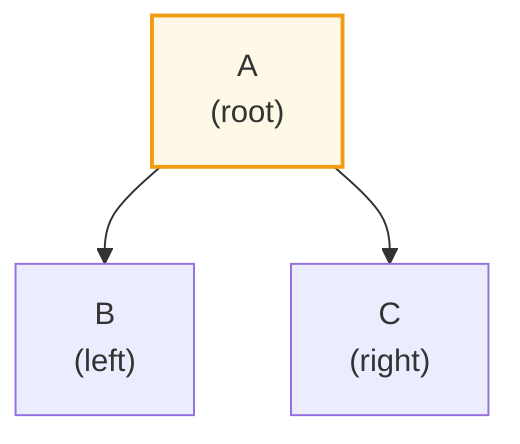
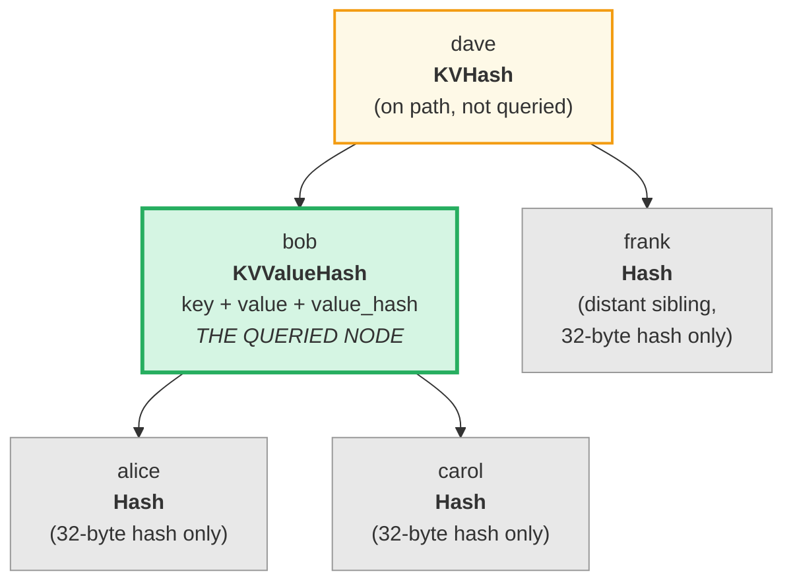
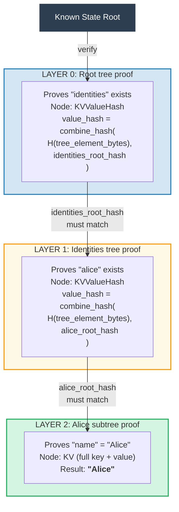
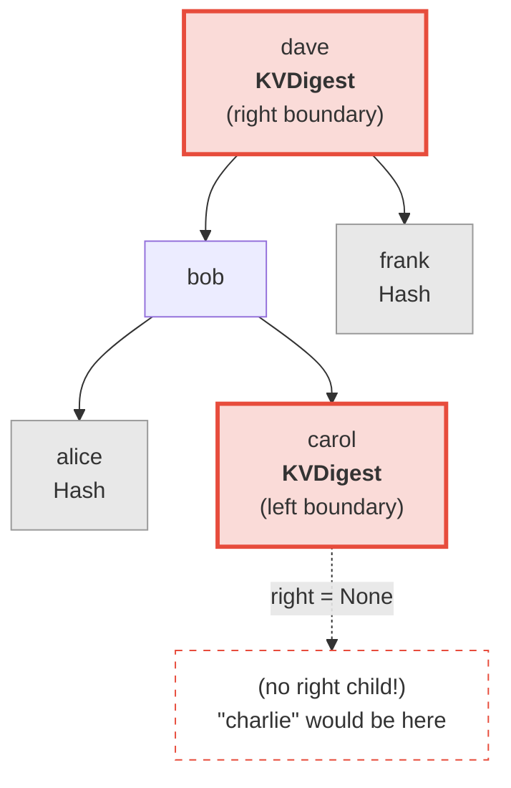
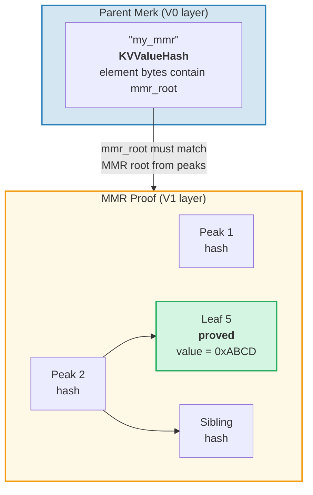
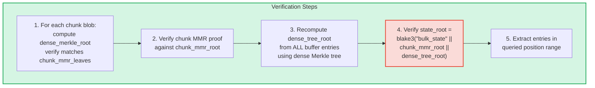
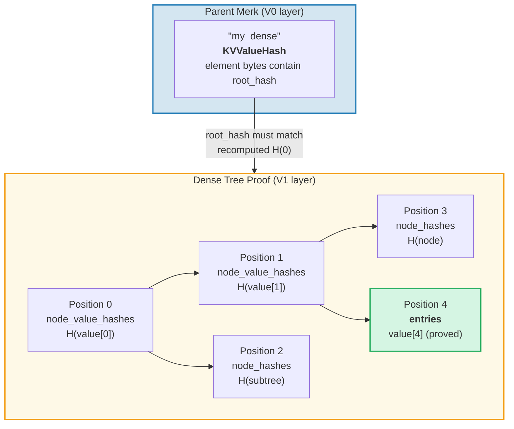

# نظام البراهين

نظام البراهين في GroveDB يسمح لأي طرف بالتحقق من صحة نتائج الاستعلام
بدون امتلاك قاعدة البيانات الكاملة. البرهان هو تمثيل مدمج لبنية
الشجرة ذات الصلة يسمح بإعادة بناء تجزئة الجذر.

## عمليات البرهان المبنية على المكدس

تُرمَّز البراهين كسلسلة من **العمليات** التي تُعيد بناء شجرة جزئية
باستخدام آلة مكدس (stack machine):

```rust
// merk/src/proofs/mod.rs
pub enum Op {
    Push(Node),        // Push a node onto the stack (ascending key order)
    PushInverted(Node),// Push a node (descending key order)
    Parent,            // Pop parent, pop child → attach child as LEFT of parent
    Child,             // Pop child, pop parent → attach child as RIGHT of parent
    ParentInverted,    // Pop parent, pop child → attach child as RIGHT of parent
    ChildInverted,     // Pop child, pop parent → attach child as LEFT of parent
}
```

التنفيذ يستخدم مكدساً:

عمليات البرهان: `Push(B), Push(A), Parent, Push(C), Child`

| الخطوة | العملية | المكدس (القمة->اليمين) | الإجراء |
|--------|---------|------------------------|---------|
| 1 | Push(B) | [ B ] | ادفع B على المكدس |
| 2 | Push(A) | [ B , A ] | ادفع A على المكدس |
| 3 | Parent | [ A{left:B} ] | أخرج A (أب)، أخرج B (ابن)، B -> يسار A |
| 4 | Push(C) | [ A{left:B} , C ] | ادفع C على المكدس |
| 5 | Child | [ A{left:B, right:C} ] | أخرج C (ابن)، أخرج A (أب)، C -> يمين A |

النتيجة النهائية — شجرة واحدة على المكدس:


```mermaid
graph TD
    A_proof["A<br/>(root)"]
    B_proof["B<br/>(left)"]
    C_proof["C<br/>(right)"]
    A_proof --> B_proof
    A_proof --> C_proof

    style A_proof fill:#fef9e7,stroke:#f39c12,stroke-width:2px
```

> المُحقّق يحسب `node_hash(A) = Blake3(kv_hash_A || node_hash_B || node_hash_C)` ويتحقق من تطابقها مع تجزئة الجذر المتوقعة.

هذه هي دالة `execute` (`merk/src/proofs/tree.rs`):

```rust
pub fn execute<I, F>(ops: I, collapse: bool, mut visit_node: F) -> CostResult<Tree, Error>
where
    I: IntoIterator<Item = Result<Op, Error>>,
    F: FnMut(&Node) -> Result<(), Error>,
{
    let mut stack: Vec<Tree> = Vec::with_capacity(32);

    for op in ops {
        match op? {
            Op::Parent => {
                let (mut parent, child) = (try_pop(&mut stack), try_pop(&mut stack));
                parent.left = Some(Child { tree: Box::new(child), hash: child.hash() });
                stack.push(parent);
            }
            Op::Child => {
                let (child, mut parent) = (try_pop(&mut stack), try_pop(&mut stack));
                parent.right = Some(Child { tree: Box::new(child), hash: child.hash() });
                stack.push(parent);
            }
            Op::Push(node) => {
                visit_node(&node)?;
                stack.push(Tree::from(node));
            }
            // ... Inverted variants swap left/right
        }
    }
    // Final item on stack is the root
}
```

## أنواع العقد في البراهين

كل `Push` يحمل `Node` يحتوي على المعلومات الكافية فقط للتحقق:

```rust
pub enum Node {
    // Minimum info — just the hash. Used for distant siblings.
    Hash(CryptoHash),

    // KV hash for nodes on the path but not queried.
    KVHash(CryptoHash),

    // Full key-value for queried items.
    KV(Vec<u8>, Vec<u8>),

    // Key, value, and pre-computed value_hash.
    // Used for subtrees where value_hash = combine_hash(...)
    KVValueHash(Vec<u8>, Vec<u8>, CryptoHash),

    // KV with feature type — for ProvableCountTree or chunk restoration.
    KVValueHashFeatureType(Vec<u8>, Vec<u8>, CryptoHash, TreeFeatureType),

    // Reference: key, dereferenced value, hash of reference element.
    KVRefValueHash(Vec<u8>, Vec<u8>, CryptoHash),

    // For items in ProvableCountTree.
    KVCount(Vec<u8>, Vec<u8>, u64),

    // KV hash + count for non-queried ProvableCountTree nodes.
    KVHashCount(CryptoHash, u64),

    // Reference in ProvableCountTree.
    KVRefValueHashCount(Vec<u8>, Vec<u8>, CryptoHash, u64),

    // For boundary/absence proofs in ProvableCountTree.
    KVDigestCount(Vec<u8>, CryptoHash, u64),

    // Key + value_hash for absence proofs (regular trees).
    KVDigest(Vec<u8>, CryptoHash),
}
```

اختيار نوع Node يُحدّد المعلومات التي يحتاجها المُحقّق:

**استعلام: "احصل على القيمة للمفتاح 'bob'"**


```mermaid
graph TD
    dave["dave<br/><b>KVHash</b><br/>(on path, not queried)"]
    bob["bob<br/><b>KVValueHash</b><br/>key + value + value_hash<br/><i>THE QUERIED NODE</i>"]
    frank["frank<br/><b>Hash</b><br/>(distant sibling,<br/>32-byte hash only)"]
    alice["alice<br/><b>Hash</b><br/>(32-byte hash only)"]
    carol["carol<br/><b>Hash</b><br/>(32-byte hash only)"]

    dave --> bob
    dave --> frank
    bob --> alice
    bob --> carol

    style bob fill:#d5f5e3,stroke:#27ae60,stroke-width:3px
    style dave fill:#fef9e7,stroke:#f39c12,stroke-width:2px
    style frank fill:#e8e8e8,stroke:#999
    style alice fill:#e8e8e8,stroke:#999
    style carol fill:#e8e8e8,stroke:#999
```

> الأخضر = العقدة المُستعلَمة (البيانات الكاملة مكشوفة). الأصفر = على المسار (kv_hash فقط). الرمادي = الأشقاء (تجزئات 32 بايت فقط).

مُرمَّزة كعمليات برهان:

| # | العملية | التأثير |
|---|---------|---------|
| 1 | Push(Hash(alice_node_hash)) | ادفع تجزئة أليس |
| 2 | Push(KVValueHash("bob", value, value_hash)) | ادفع بوب مع البيانات الكاملة |
| 3 | Parent | أليس تصبح ابناً أيسر لبوب |
| 4 | Push(Hash(carol_node_hash)) | ادفع تجزئة كارول |
| 5 | Child | كارول تصبح ابناً أيمن لبوب |
| 6 | Push(KVHash(dave_kv_hash)) | ادفع kv_hash لديف |
| 7 | Parent | شجرة بوب الفرعية تصبح يسار ديف |
| 8 | Push(Hash(frank_node_hash)) | ادفع تجزئة فرانك |
| 9 | Child | فرانك يصبح ابناً أيمن لديف |

## أنواع عقد البرهان حسب نوع الشجرة

كل نوع شجرة في GroveDB يستخدم مجموعة محددة من أنواع عقد البرهان بناءً على
**دور** العقدة في البرهان. هناك أربعة أدوار:

| الدور | الوصف |
|-------|-------|
| **مُستعلَمة** | العقدة تطابق الاستعلام — المفتاح والقيمة الكاملان مكشوفان |
| **على المسار** | العقدة سلف للعقد المُستعلَمة — فقط kv_hash مطلوب |
| **حدّية** | مجاورة لمفتاح مفقود — تُثبت الغياب |
| **بعيدة** | شجرة فرعية شقيقة ليست على مسار البرهان — فقط node_hash مطلوب |

### الأشجار العادية (Tree، SumTree، BigSumTree، CountTree، CountSumTree)

جميع هذه الأنواع الخمسة من الأشجار تستخدم أنواع عقد برهان متطابقة ونفس دالة
التجزئة: `compute_hash` (= `node_hash(kv_hash, left, right)`). **لا يوجد فرق**
في كيفية إثباتها على مستوى merk.

كل عقدة merk تحمل `feature_type` داخلياً (BasicMerkNode،
SummedMerkNode، BigSummedMerkNode، CountedMerkNode، CountedSummedMerkNode)، لكن
هذا **غير مُدرج في التجزئة** و**غير مُدرج في البرهان**. البيانات
التجميعية (المجموع، العدد) لهذه الأنواع من الأشجار تعيش في بايتات
Element **الأب** المُرمَّزة، والتي يتم التحقق من تجزئتها عبر برهان الشجرة الأب:

| نوع الشجرة | ما يُخزّنه Element | feature_type في Merk (غير مُجزَّأ) |
|------------|-------------------|----------------------------------|
| Tree | `Element::Tree(root_key, flags)` | `BasicMerkNode` |
| SumTree | `Element::SumTree(root_key, sum, flags)` | `SummedMerkNode(sum)` |
| BigSumTree | `Element::BigSumTree(root_key, sum, flags)` | `BigSummedMerkNode(sum)` |
| CountTree | `Element::CountTree(root_key, count, flags)` | `CountedMerkNode(count)` |
| CountSumTree | `Element::CountSumTree(root_key, count, sum, flags)` | `CountedSummedMerkNode(count, sum)` |

> **من أين يأتي المجموع/العدد؟** عندما يعالج المُحقّق برهاناً
> لـ `[root, my_sum_tree]`، برهان الشجرة الأب يتضمن عقدة
> `KVValueHash` للمفتاح `my_sum_tree`. حقل `value` يحتوي على
> `Element::SumTree(root_key, 42, flags)` المُرمَّز. بما أن هذه القيمة
> مُتحقق من تجزئتها (تجزئتها ملتزمة بجذر ميركل الأب)، فإن
> المجموع `42` موثوق. الـ feature_type على مستوى merk غير ذي صلة.

| الدور | نوع العقدة V0 | نوع العقدة V1 | دالة التجزئة |
|-------|--------------|--------------|-------------|
| عنصر مُستعلَم | `KV` | `KV` | `node_hash(kv_hash(key, H(value)), left, right)` |
| شجرة غير فارغة مُستعلَمة (بدون استعلام فرعي) | `KVValueHash` | `KVValueHashFeatureTypeWithChildHash` | `node_hash(kv_hash(key, value_hash), left, right)` |
| شجرة فارغة مُستعلَمة | `KVValueHash` | `KVValueHash` | `node_hash(kv_hash(key, value_hash), left, right)` |
| مرجع مُستعلَم | `KVRefValueHash` | `KVRefValueHash` | `node_hash(kv_hash(key, combine_hash(ref_hash, H(deref_value))), left, right)` |
| على المسار | `KVHash` | `KVHash` | `node_hash(kv_hash, left, right)` |
| حدّية | `KVDigest` | `KVDigest` | `node_hash(kv_hash(key, value_hash), left, right)` |
| بعيدة | `Hash` | `Hash` | تُستخدم مباشرة |

> **الأشجار غير الفارغة مع استعلام فرعي** تنزل إلى طبقة الابن — عقدة الشجرة
> تظهر كـ `KVValueHash` في برهان الطبقة الأب وطبقة الابن لها برهانها الخاص.

> **لماذا `KVValueHash` للأشجار الفرعية؟** value_hash للشجرة الفرعية هو
> `combine_hash(H(element_bytes), child_root_hash)` — المُحقّق لا يمكنه
> إعادة حسابه من بايتات element وحدها (سيحتاج إلى تجزئة جذر الابن). لذا
> يوفر المُثبِت value_hash المحسوب مسبقاً.
>
> **لماذا `KV` للعناصر؟** value_hash للعنصر هو ببساطة `H(value)`، والذي يمكن
> للمُحقّق إعادة حسابه. استخدام `KV` آمن ضد التلاعب: إذا غيّر المُثبِت
> القيمة، فلن تتطابق التجزئة.

**تحسين V1 — `KVValueHashFeatureTypeWithChildHash`:** في براهين V1، عندما تكون
الشجرة غير الفارغة المُستعلَمة بدون استعلام فرعي (الاستعلام يتوقف عند هذه الشجرة —
عنصر الشجرة نفسه هو النتيجة)، تقوم طبقة GroveDB بترقية عقدة merk إلى
`KVValueHashFeatureTypeWithChildHash(key, value, value_hash, feature_type,
child_hash)`. هذا يسمح للمُحقّق بفحص `combine_hash(H(value), child_hash)
== value_hash`، مما يمنع المهاجم من تبديل بايتات element مع إعادة استخدام
value_hash الأصلي. الأشجار الفارغة لا تُرقّى لأنها لا تملك merk ابن
لتوفير تجزئة جذر.

> **ملاحظة أمنية حول feature_type:** للأشجار العادية (غير القابلة للإثبات)، حقل
> `feature_type` في `KVValueHashFeatureType` و
> `KVValueHashFeatureTypeWithChildHash` يتم فك ترميزه لكنه **لا يُستخدم** لحساب
> التجزئة أو يُعاد للمستدعين. نوع الشجرة الأصلي موجود في بايتات Element
> المُتحقق من تجزئتها. هذا الحقل مهم فقط لـ ProvableCountTree
> (انظر أدناه)، حيث يحمل العدد المطلوب لـ `node_hash_with_count`.

### ProvableCountTree وProvableCountSumTree

هذه الأنواع من الأشجار تستخدم `node_hash_with_count(kv_hash, left, right, count)` بدلاً
من `node_hash`. **العدد** مُدرج في التجزئة، لذا يحتاج المُحقّق
إلى العدد لكل عقدة لإعادة حساب جذر ميركل.

| الدور | نوع العقدة V0 | نوع العقدة V1 | دالة التجزئة |
|-------|--------------|--------------|-------------|
| عنصر مُستعلَم | `KVCount` | `KVCount` | `node_hash_with_count(kv_hash(key, H(value)), left, right, count)` |
| شجرة غير فارغة مُستعلَمة (بدون استعلام فرعي) | `KVValueHashFeatureType` | `KVValueHashFeatureTypeWithChildHash` | `node_hash_with_count(kv_hash(key, value_hash), left, right, feature_type.count())` |
| شجرة فارغة مُستعلَمة | `KVValueHashFeatureType` | `KVValueHashFeatureType` | `node_hash_with_count(kv_hash(key, value_hash), left, right, feature_type.count())` |
| مرجع مُستعلَم | `KVRefValueHashCount` | `KVRefValueHashCount` | `node_hash_with_count(kv_hash(key, combine_hash(...)), left, right, count)` |
| على المسار | `KVHashCount` | `KVHashCount` | `node_hash_with_count(kv_hash, left, right, count)` |
| حدّية | `KVDigestCount` | `KVDigestCount` | `node_hash_with_count(kv_hash(key, value_hash), left, right, count)` |
| بعيدة | `Hash` | `Hash` | تُستخدم مباشرة |

> **الأشجار غير الفارغة مع استعلام فرعي** تنزل إلى طبقة الابن، كما في
> الأشجار العادية.

> **لماذا تحمل كل عقدة عدداً؟** لأن `node_hash_with_count` تُستخدم بدلاً
> من `node_hash`. بدون العدد، لا يمكن للمُحقّق إعادة بناء أي تجزئة وسيطة
> على المسار إلى الجذر — حتى للعقد غير المُستعلَمة.

**تحسين V1:** نفس الأشجار العادية — الأشجار غير الفارغة المُستعلَمة بدون
استعلامات فرعية تُرقّى إلى `KVValueHashFeatureTypeWithChildHash` للتحقق
من `combine_hash`.

> **ملاحظة حول ProvableCountSumTree:** فقط **العدد** مُدرج في التجزئة. المجموع
> محمول في feature_type (`ProvableCountedSummedMerkNode(count,
> sum)`) لكنه **غير مُجزَّأ**. كما في أنواع الأشجار العادية أعلاه، قيمة
> المجموع الأصلية موجودة في بايتات Element الأب المُرمَّزة (مثلاً
> `Element::ProvableCountSumTree(root_key, count, sum, flags)`)، والتي يتم
> التحقق من تجزئتها في برهان الشجرة الأب.

### ملخص: مصفوفة نوع العقدة → نوع الشجرة

| نوع العقدة | الأشجار العادية | أشجار ProvableCount |
|-----------|:--------------:|:------------------:|
| `KV` | عناصر مُستعلَمة | — |
| `KVCount` | — | عناصر مُستعلَمة |
| `KVValueHash` | أشجار فرعية مُستعلَمة | — |
| `KVValueHashFeatureType` | — | أشجار فرعية مُستعلَمة |
| `KVRefValueHash` | مراجع مُستعلَمة | — |
| `KVRefValueHashCount` | — | مراجع مُستعلَمة |
| `KVHash` | على المسار | — |
| `KVHashCount` | — | على المسار |
| `KVDigest` | حدّية/غياب | — |
| `KVDigestCount` | — | حدّية/غياب |
| `Hash` | أشقاء بعيدون | أشقاء بعيدون |
| `KVValueHashFeatureTypeWithChildHash` | — | أشجار غير فارغة بدون استعلام فرعي |

## توليد البراهين متعددة الطبقات

بما أن GroveDB هو شجرة من الأشجار، فالبراهين تمتد عبر طبقات متعددة. كل طبقة تُثبت
الجزء ذا الصلة من شجرة Merk واحدة، والطبقات مرتبطة بآلية
combined value_hash:

**استعلام:** `Get ["identities", "alice", "name"]`


```mermaid
graph TD
    subgraph layer0["LAYER 0: Root tree proof"]
        L0["Proves &quot;identities&quot; exists<br/>Node: KVValueHash<br/>value_hash = combine_hash(<br/>  H(tree_element_bytes),<br/>  identities_root_hash<br/>)"]
    end

    subgraph layer1["LAYER 1: Identities tree proof"]
        L1["Proves &quot;alice&quot; exists<br/>Node: KVValueHash<br/>value_hash = combine_hash(<br/>  H(tree_element_bytes),<br/>  alice_root_hash<br/>)"]
    end

    subgraph layer2["LAYER 2: Alice subtree proof"]
        L2["Proves &quot;name&quot; = &quot;Alice&quot;<br/>Node: KV (full key + value)<br/>Result: <b>&quot;Alice&quot;</b>"]
    end

    state_root["Known State Root"] -->|"verify"| L0
    L0 -->|"identities_root_hash<br/>must match"| L1
    L1 -->|"alice_root_hash<br/>must match"| L2

    style layer0 fill:#d4e6f1,stroke:#2980b9,stroke-width:2px
    style layer1 fill:#fef9e7,stroke:#f39c12,stroke-width:2px
    style layer2 fill:#d5f5e3,stroke:#27ae60,stroke-width:2px
    style state_root fill:#2c3e50,stroke:#2c3e50,color:#fff
```

> **سلسلة الثقة:** `known_state_root -> التحقق من الطبقة 0 -> التحقق من الطبقة 1 -> التحقق من الطبقة 2 -> "Alice"`. تجزئة الجذر المُعاد بناؤها لكل طبقة يجب أن تتطابق مع value_hash من الطبقة الأعلى.

يتحقق المُحقّق من كل طبقة، مؤكداً أن:
1. برهان الطبقة يُعيد بناء تجزئة الجذر المتوقعة
2. تجزئة الجذر تتطابق مع value_hash من الطبقة الأب
3. تجزئة الجذر العليا تتطابق مع جذر الحالة المعروف

## التحقق من البراهين

التحقق يتبع طبقات البرهان من الأسفل للأعلى أو من الأعلى للأسفل، مستخدماً دالة `execute`
لإعادة بناء شجرة كل طبقة. طريقة `Tree::hash()` في شجرة البرهان
تحسب التجزئة بناءً على نوع العقدة:

```rust
impl Tree {
    pub fn hash(&self) -> CostContext<CryptoHash> {
        match &self.node {
            Node::Hash(hash) => *hash,  // Already a hash, return directly

            Node::KVHash(kv_hash) =>
                node_hash(kv_hash, &self.child_hash(true), &self.child_hash(false)),

            Node::KV(key, value) =>
                kv_hash(key, value)
                    .flat_map(|kv_hash| node_hash(&kv_hash, &left, &right)),

            Node::KVValueHash(key, _, value_hash) =>
                kv_digest_to_kv_hash(key, value_hash)
                    .flat_map(|kv_hash| node_hash(&kv_hash, &left, &right)),

            Node::KVValueHashFeatureType(key, _, value_hash, feature_type) => {
                let kv = kv_digest_to_kv_hash(key, value_hash);
                match feature_type {
                    ProvableCountedMerkNode(count) =>
                        node_hash_with_count(&kv, &left, &right, *count),
                    _ => node_hash(&kv, &left, &right),
                }
            }

            Node::KVRefValueHash(key, referenced_value, ref_element_hash) => {
                let ref_value_hash = value_hash(referenced_value);
                let combined = combine_hash(ref_element_hash, &ref_value_hash);
                let kv = kv_digest_to_kv_hash(key, &combined);
                node_hash(&kv, &left, &right)
            }
            // ... other variants
        }
    }
}
```

## براهين الغياب

يمكن لـ GroveDB إثبات أن مفتاحاً **لا يوجد**. يستخدم هذا عقد الحدود —
العقد التي ستكون مجاورة للمفتاح المفقود لو كان موجوداً:

**إثبات:** "charlie" لا يوجد


```mermaid
graph TD
    dave_abs["dave<br/><b>KVDigest</b><br/>(right boundary)"]
    bob_abs["bob"]
    frank_abs["frank<br/>Hash"]
    alice_abs["alice<br/>Hash"]
    carol_abs["carol<br/><b>KVDigest</b><br/>(left boundary)"]
    missing["(no right child!)<br/>&quot;charlie&quot; would be here"]

    dave_abs --> bob_abs
    dave_abs --> frank_abs
    bob_abs --> alice_abs
    bob_abs --> carol_abs
    carol_abs -.->|"right = None"| missing

    style carol_abs fill:#fadbd8,stroke:#e74c3c,stroke-width:3px
    style dave_abs fill:#fadbd8,stroke:#e74c3c,stroke-width:3px
    style missing fill:none,stroke:#e74c3c,stroke-dasharray:5 5
    style alice_abs fill:#e8e8e8,stroke:#999
    style frank_abs fill:#e8e8e8,stroke:#999
```

> **بحث ثنائي:** alice < bob < carol < **"charlie"** < dave < frank. "charlie" سيكون بين carol وdave. ابن carol الأيمن هو `None`، مما يُثبت عدم وجود شيء بين carol وdave. لذلك "charlie" لا يمكن أن يوجد في هذه الشجرة.

لاستعلامات النطاق، براهين الغياب تُظهر عدم وجود مفاتيح ضمن نطاق الاستعلام
لم تُضمَّن في مجموعة النتائج.

## كشف مفاتيح الحدود

عند التحقق من برهان ناتج عن استعلام نطاق حصري، قد تحتاج إلى التأكد
من أن مفاتيح محددة موجودة كـ**عناصر حدّية** — مفاتيح تُرسي النطاق
لكنها ليست جزءاً من مجموعة النتائج.

على سبيل المثال، مع `RangeAfter(10)` (جميع المفاتيح بعد 10 حصرياً)، يتضمن البرهان
المفتاح 10 كعقدة `KVDigest`. هذا يُثبت أن المفتاح 10 موجود في الشجرة
ويُرسي بداية النطاق، لكن المفتاح 10 لا يُعاد في النتائج.

### متى تظهر عقد الحدود

تظهر عقد `KVDigest` (أو `KVDigestCount` لـ ProvableCountTree) الحدّية في
البراهين لأنواع استعلامات النطاق الحصرية:

| نوع الاستعلام | مفتاح الحدّ | ما يُثبته |
|------------|-------------|----------------|
| `RangeAfter(start..)` | `start` | البداية الحصرية موجودة في الشجرة |
| `RangeAfterTo(start..end)` | `start` | البداية الحصرية موجودة في الشجرة |
| `RangeAfterToInclusive(start..=end)` | `start` | البداية الحصرية موجودة في الشجرة |

تظهر عقد الحدود أيضاً في براهين الغياب، حيث تُثبت المفاتيح المجاورة
وجود فجوة (انظر [براهين الغياب](#براهين-الغياب) أعلاه).

### استرجاع جميع مفاتيح الحدود

بعد التحقق من البرهان، استدعِ `boundaries` على `GroveDBProof` المُفكَّك
للحصول على جميع مفاتيح الحدود في مسار معين:

```rust
// Decode and verify the proof
let (grovedb_proof, _): (GroveDBProof, _) =
    bincode::decode_from_slice(&proof_bytes, config)?;
let (root_hash, results) = grovedb_proof.verify(&path_query, grove_version)?;

// Get all boundary keys at this path
let boundary_keys: Vec<Vec<u8>> = grovedb_proof
    .boundaries(&[b"documents", b"notes"])?;
```

وسيط `path` يُحدد أي طبقة من البرهان يجب فحصها (يتطابق مع
مسار الشجرة الفرعية في GroveDB حيث تم تنفيذ استعلام النطاق).

### التحقق من مفتاح حدّي واحد

إذا كنت تحتاج فقط للتحقق مما إذا كان مفتاح محدد حدّياً، استخدم
`key_exists_as_boundary`:

```rust
let cursor_exists = grovedb_proof
    .key_exists_as_boundary(&[b"documents", b"notes"], &cursor_key)?;
```

### الاستخدام العملي: التحقق من الترقيم الصفحي

هذا مفيد بشكل خاص لـ**الترقيم الصفحي**. عندما يطلب عميل "المستندات
المائة التالية بعد المستند X"، يكون الاستعلام `RangeAfter(document_X_id)`. يُعيد
البرهان المستندات 101-200، لكن العميل قد يريد أيضاً التأكد من أن
المستند X (مؤشر الترقيم الصفحي) لا يزال موجوداً في الشجرة:

- إذا ظهر مفتاح المؤشر في `boundaries()`، فالمؤشر صالح — يمكن للعميل
  الوثوق بأن الترقيم الصفحي مُرتكز على مستند حقيقي.
- إذا لم يظهر، فقد يكون مستند المؤشر قد حُذف بين الصفحات،
  ويجب على العميل النظر في إعادة بدء الترقيم الصفحي.

> **مهم:** كل من `boundaries()` و`key_exists_as_boundary` يقومان بمسح
> نحوي لعقد `KVDigest`/`KVDigestCount` في البرهان. لا يوفران
> أي ضمان تشفيري بمفردهما — تحقق دائماً من البرهان مقابل تجزئة جذر
> موثوقة أولاً. نفس أنواع العقد تظهر أيضاً في براهين الغياب،
> لذا يجب على المُستدعي تفسير النتائج في سياق الاستعلام الذي أنتج البرهان.

على مستوى merk، نفس عمليات التحقق متاحة عبر
`boundaries_in_proof(proof_bytes)` و
`key_exists_as_boundary_in_proof(proof_bytes, key)` للعمل مباشرة مع
بايتات برهان merk الخام.

## براهين V1 — الأشجار غير-Merk

نظام براهين V0 يعمل حصرياً مع أشجار Merk الفرعية، نازلاً طبقة تلو
طبقة عبر تسلسل البستان. ومع ذلك، عناصر **CommitmentTree** و**MmrTree**
و**BulkAppendTree** و**DenseAppendOnlyFixedSizeTree** تُخزّن بياناتها
خارج شجرة Merk ابن. ليس لديها Merk ابن للنزول إليه — تجزئة
الجذر الخاصة بنوعها تتدفق كتجزئة Merk الابن بدلاً من ذلك.

**صيغة براهين V1** تُوسّع V0 للتعامل مع هذه الأشجار غير-Merk ببنى
براهين خاصة بالنوع:

```rust
/// Which proof format a layer uses.
pub enum ProofBytes {
    Merk(Vec<u8>),            // Standard Merk proof ops
    MMR(Vec<u8>),             // MMR membership proof
    BulkAppendTree(Vec<u8>),  // BulkAppendTree range proof
    DenseTree(Vec<u8>),       // Dense tree inclusion proof
    CommitmentTree(Vec<u8>),  // Sinsemilla root (32 bytes) + BulkAppendTree proof
}

/// One layer of a V1 proof.
pub struct LayerProof {
    pub merk_proof: ProofBytes,
    pub lower_layers: BTreeMap<Vec<u8>, LayerProof>,
}
```

**قاعدة اختيار V0/V1:** إذا كانت كل طبقة في البرهان شجرة Merk قياسية،
`prove_query` تُنتج `GroveDBProof::V0` (متوافق مع الإصدارات السابقة). إذا كانت أي طبقة
تتضمن MmrTree أو BulkAppendTree أو DenseAppendOnlyFixedSizeTree، فتُنتج
`GroveDBProof::V1`.

### كيف ترتبط براهين الأشجار غير-Merk بتجزئة الجذر

شجرة Merk الأب تُثبت بايتات العنصر المُرمَّزة عبر عقدة برهان Merk قياسية
(`KVValueHash`). الجذر الخاص بالنوع (مثل `mmr_root` أو
`state_root`) يتدفق كـ **تجزئة ابن** Merk — وليس مُضمَّناً في
بايتات العنصر:

```text
combined_value_hash = combine_hash(
    Blake3(varint(len) || element_bytes),   ← contains count, height, etc.
    type_specific_root                      ← mmr_root / state_root / dense_root
)
```

البرهان الخاص بالنوع يُثبت بعد ذلك أن البيانات المُستعلمة متسقة مع
الجذر الخاص بالنوع المُستخدم كتجزئة الابن.

### براهين MmrTree

برهان MMR يُثبت أن أوراقاً محددة موجودة في مواقع معروفة داخل
MMR، وأن تجزئة جذر MMR تتطابق مع تجزئة الابن المُخزَّنة في
عقدة Merk الأب:

```rust
pub struct MmrProof {
    pub mmr_size: u64,
    pub proof: MerkleProof,  // ckb_merkle_mountain_range::MerkleProof
    pub leaves: Vec<MmrProofLeaf>,
}

pub struct MmrProofLeaf {
    pub position: u64,       // MMR position
    pub leaf_index: u64,     // Logical leaf index
    pub hash: [u8; 32],      // Leaf hash
    pub value: Vec<u8>,      // Leaf value bytes
}
```


```mermaid
graph TD
    subgraph parent_merk["Parent Merk (V0 layer)"]
        elem["&quot;my_mmr&quot;<br/><b>KVValueHash</b><br/>element bytes contain mmr_root"]
    end

    subgraph mmr_proof["MMR Proof (V1 layer)"]
        peak1["Peak 1<br/>hash"]
        peak2["Peak 2<br/>hash"]
        leaf_a["Leaf 5<br/><b>proved</b><br/>value = 0xABCD"]
        sibling["Sibling<br/>hash"]
        peak2 --> leaf_a
        peak2 --> sibling
    end

    elem -->|"mmr_root must match<br/>MMR root from peaks"| mmr_proof

    style parent_merk fill:#d4e6f1,stroke:#2980b9,stroke-width:2px
    style mmr_proof fill:#fef9e7,stroke:#f39c12,stroke-width:2px
    style leaf_a fill:#d5f5e3,stroke:#27ae60,stroke-width:2px
```

**مفاتيح الاستعلام هي مواقع:** عناصر الاستعلام تُرمّز المواقع كبايتات u64 بترتيب
الطرف الأكبر (big-endian) (مما يحافظ على ترتيب الفرز). `QueryItem::RangeInclusive` بمواقع
بداية/نهاية مُرمَّزة بـ BE تختار نطاقاً متصلاً من أوراق MMR.

**التحقق:**
1. إعادة بناء أوراق `MmrNode` من البرهان
2. التحقق من `MerkleProof` الخاص بـ ckb مقابل جذر MMR المتوقع من تجزئة Merk الأب الابن
3. التحقق المتبادل أن `proof.mmr_size` يتطابق مع حجم العنصر المُخزَّن
4. إرجاع قيم الأوراق المُثبتة

### براهين BulkAppendTree

براهين BulkAppendTree أكثر تعقيداً لأن البيانات تعيش في مكانين: كتل
الشرائح المُختومة والمخزن المؤقت الجاري. برهان النطاق يجب أن يُرجع:

- **كتل شرائح كاملة** لأي شريحة مكتملة تتداخل مع نطاق الاستعلام
- **مدخلات مخزن مؤقت فردية** للمواقع التي لا تزال في المخزن المؤقت

```rust
pub struct BulkAppendTreeProof {
    pub chunk_power: u8,
    pub total_count: u64,
    pub chunk_blobs: Vec<(u64, Vec<u8>)>,       // (chunk_index, blob_bytes)
    pub chunk_mmr_size: u64,
    pub chunk_mmr_proof_items: Vec<[u8; 32]>,    // MMR sibling hashes
    pub chunk_mmr_leaves: Vec<(u64, [u8; 32])>,  // (mmr_pos, dense_merkle_root)
    pub buffer_entries: Vec<Vec<u8>>,             // ALL current buffer (dense tree) entries
    pub chunk_mmr_root: [u8; 32],
}
```


```mermaid
graph TD
    subgraph verify["Verification Steps"]
        step1["1. For each chunk blob:<br/>compute dense_merkle_root<br/>verify matches chunk_mmr_leaves"]
        step2["2. Verify chunk MMR proof<br/>against chunk_mmr_root"]
        step3["3. Recompute dense_tree_root<br/>from ALL buffer entries<br/>using dense Merkle tree"]
        step4["4. Verify state_root =<br/>blake3(&quot;bulk_state&quot; ||<br/>chunk_mmr_root ||<br/>dense_tree_root)"]
        step5["5. Extract entries in<br/>queried position range"]

        step1 --> step2 --> step3 --> step4 --> step5
    end

    style verify fill:#d5f5e3,stroke:#27ae60,stroke-width:2px
    style step4 fill:#fadbd8,stroke:#e74c3c,stroke-width:2px
```

> **لماذا نُضمّن جميع مدخلات المخزن المؤقت؟** المخزن المؤقت هو شجرة ميركل كثيفة تلتزم تجزئة جذرها
> بكل مدخل. للتحقق من `dense_tree_root`، يجب على المُحقّق
> إعادة بناء الشجرة من جميع المدخلات. بما أن المخزن المؤقت محدود بمدخلات `capacity`
> (65,535 على الأكثر)، فهذا مقبول.

**حساب الحد:** كل قيمة فردية (داخل شريحة أو المخزن المؤقت) تُحسب
ضمن حد الاستعلام، وليس كل كتلة شريحة ككل. إذا كان للاستعلام
`limit: 100` وشريحة تحتوي 1024 مدخلاً مع 500 تتداخل مع النطاق،
جميع المدخلات الـ 500 تُحسب ضمن الحد.

### براهين DenseAppendOnlyFixedSizeTree

برهان الشجرة الكثيفة يُثبت أن مواقع محددة تحمل قيماً محددة،
موثّقة مقابل تجزئة جذر الشجرة (التي تتدفق كتجزئة Merk الابن).
جميع العقد تستخدم `blake3(H(value) || H(left) || H(right))`، لذا عقد السلف على مسار
التوثيق تحتاج فقط **تجزئة القيمة** من 32 بايت — وليس القيمة الكاملة.

```rust
pub struct DenseTreeProof {
    pub entries: Vec<(u16, Vec<u8>)>,            // proved (position, value)
    pub node_value_hashes: Vec<(u16, [u8; 32])>, // ancestor value hashes on auth path
    pub node_hashes: Vec<(u16, [u8; 32])>,       // precomputed sibling subtree hashes
}
```

> `height` و`count` يأتيان من عنصر الأب (موثّقان بتسلسل Merk)، وليس من البرهان.


```mermaid
graph TD
    subgraph parent_merk["Parent Merk (V0 layer)"]
        elem["&quot;my_dense&quot;<br/><b>KVValueHash</b><br/>element bytes contain root_hash"]
    end

    subgraph dense_proof["Dense Tree Proof (V1 layer)"]
        root["Position 0<br/>node_value_hashes<br/>H(value[0])"]
        node1["Position 1<br/>node_value_hashes<br/>H(value[1])"]
        hash2["Position 2<br/>node_hashes<br/>H(subtree)"]
        hash3["Position 3<br/>node_hashes<br/>H(node)"]
        leaf4["Position 4<br/><b>entries</b><br/>value[4] (proved)"]
        root --> node1
        root --> hash2
        node1 --> hash3
        node1 --> leaf4
    end

    elem -->|"root_hash must match<br/>recomputed H(0)"| dense_proof

    style parent_merk fill:#d4e6f1,stroke:#2980b9,stroke-width:2px
    style dense_proof fill:#fef9e7,stroke:#f39c12,stroke-width:2px
    style leaf4 fill:#d5f5e3,stroke:#27ae60,stroke-width:2px
```

**التحقق** هو دالة صافية لا تتطلب تخزيناً:
1. بناء خرائط بحث من `entries` و`node_value_hashes` و`node_hashes`
2. إعادة حساب تجزئة الجذر تكرارياً من الموقع 0:
   - الموقع له تجزئة محسوبة مسبقاً في `node_hashes` -> استخدمها مباشرة
   - الموقع له قيمة في `entries` -> `blake3(blake3(value) || H(left) || H(right))`
   - الموقع له تجزئة في `node_value_hashes` -> `blake3(hash || H(left) || H(right))`
   - الموقع `>= count` أو `>= capacity` -> `[0u8; 32]`
3. مقارنة الجذر المحسوب مع تجزئة الجذر المتوقعة من عنصر الأب
4. إرجاع المدخلات المُثبتة عند النجاح

**براهين المواقع المتعددة** تدمج مسارات التوثيق المتداخلة: الأسلاف المشتركة وقيمهم
تظهر مرة واحدة فقط، مما يجعلها أكثر اختصاراً من البراهين المستقلة.

---
