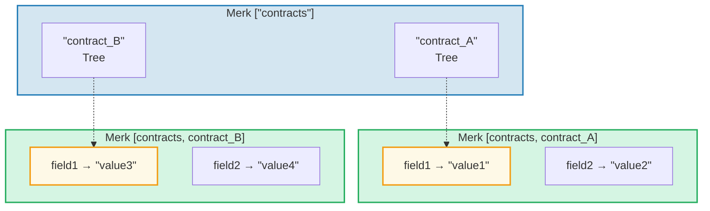
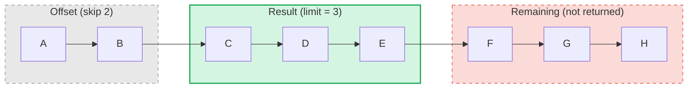

# نظام الاستعلامات

## بنية PathQuery

استعلامات GroveDB تستخدم نوع `PathQuery`، الذي يجمع بين مسار (أين ننظر)
واستعلام (ماذا نختار):

```rust
pub struct PathQuery {
    pub path: Vec<Vec<u8>>,         // Starting path in the grove
    pub query: SizedQuery,          // What to select
}

pub struct SizedQuery {
    pub query: Query,               // The selection criteria
    pub limit: Option<u16>,         // Maximum number of results
    pub offset: Option<u16>,        // Skip first N results
}
```

## نوع Query

```rust
pub struct Query {
    pub items: Vec<QueryItem>,              // What to match
    pub default_subquery_branch: SubqueryBranch,
    pub conditional_subquery_branches: Option<IndexMap<QueryItem, SubqueryBranch>>,
    pub left_to_right: bool,                // Iteration direction
    pub add_parent_tree_on_subquery: bool,  // Include parent tree element in results (v2)
}
```

> **`add_parent_tree_on_subquery`** (الإصدار 2): عندما يكون `true`، يُضمَّن عنصر شجرة الأب (مثل
> CountTree أو SumTree) في نتائج الاستعلام إلى جانب قيم أبنائه.
> هذا يتيح لك استرجاع كلٍّ من القيم التجميعية والعناصر الفردية في استعلام واحد.

## QueryItems — ماذا نختار

كل `QueryItem` يُحدّد مفتاحاً أو نطاقاً للمطابقة:

```rust
pub enum QueryItem {
    Key(Vec<u8>),                           // Exact key match
    Range(Range<Vec<u8>>),                  // Exclusive range [start..end)
    RangeInclusive(RangeInclusive<Vec<u8>>),// Inclusive range [start..=end]
    RangeFull(RangeFull),                   // All keys
    RangeFrom(RangeFrom<Vec<u8>>),          // [start..)
    RangeTo(RangeTo<Vec<u8>>),              // [..end)
    RangeToInclusive(RangeToInclusive<Vec<u8>>), // [..=end]
    RangeAfter(RangeFrom<Vec<u8>>),         // (start..) exclusive start
    RangeAfterTo(Range<Vec<u8>>),           // (start..end) exclusive both
    RangeAfterToInclusive(RangeInclusive<Vec<u8>>), // (start..=end]
}
```

أمثلة على الاستعلامات:

شجرة Merk (مرتبة): `alice  bob  carol  dave  eve  frank`

| الاستعلام | الاختيار | النتيجة |
|-----------|----------|---------|
| `Key("bob")` | alice **[bob]** carol dave eve frank | bob |
| `RangeInclusive("bob"..="dave")` | alice **[bob carol dave]** eve frank | bob, carol, dave |
| `RangeAfter("carol"..)` | alice bob carol **[dave eve frank]** | dave, eve, frank |
| `RangeFull`, limit=2 | **[alice bob]** carol dave eve frank *(أُوقف بالحد)* | alice, bob |
| `RangeFull`, limit=2, من اليمين لليسار | alice bob carol dave **[eve frank]** *(أُوقف بالحد)* | frank, eve |

## الاستعلامات الفرعية والفروع الشرطية

القوة الحقيقية لاستعلامات GroveDB هي **الاستعلامات الفرعية** (subqueries) — عندما يُطابق استعلام عنصر Tree،
يمكن للاستعلام النزول تلقائياً إلى تلك الشجرة الفرعية:



> **PathQuery:** `path: ["contracts"], query: RangeFull` مع `default_subquery: Key("field1")`
>
> **التنفيذ:**
> 1. `RangeFull` على ["contracts"] -> يطابق contract_A, contract_B
> 2. كلاهما عناصر Tree -> انزل مع الاستعلام الفرعي `Key("field1")`
> 3. contract_A -> "value1", contract_B -> "value3"
>
> **النتيجة:** `["value1", "value3"]`

**الاستعلامات الفرعية الشرطية** تتيح لك تطبيق استعلامات فرعية مختلفة بناءً على المفتاح
الذي تمت مطابقته:

```rust
conditional_subquery_branches: Some(indexmap! {
    QueryItem::Key(b"contract_A".to_vec()) => SubqueryBranch {
        subquery: Some(Query { items: vec![Key(b"field1".to_vec())] }),
        ..
    },
    QueryItem::Key(b"contract_B".to_vec()) => SubqueryBranch {
        subquery: Some(Query { items: vec![Key(b"field2".to_vec())] }),
        ..
    },
})
```

هذا سيحصل على `field1` من `contract_A` لكن `field2` من `contract_B`.

## الاستعلامات المُحجَّمة — الحد والإزاحة

مُغلّف `SizedQuery` يُضيف ترقيم الصفحات:



> `SizedQuery { query: RangeFull, limit: Some(3), offset: Some(2) }` -> النتيجة: **[C, D, E]**

عند الدمج مع `left_to_right: false`، يُعكَس التكرار:

```text
    SizedQuery {
        query: Query { items: [RangeFull], left_to_right: false, .. },
        limit: Some(3),
        offset: None
    }

    Result: [H, G, F]
```

## دمج الاستعلامات

يمكن دمج عدة PathQuery في استعلام واحد لتحسين الكفاءة. خوارزمية الدمج
تجد بادئات المسار المشتركة وتجمع عناصر الاستعلام:

```text
    Query A: path=["users"], query=Key("alice")
    Query B: path=["users"], query=Key("bob")

    Merged:  path=["users"], query=items=[Key("alice"), Key("bob")]
```

---
