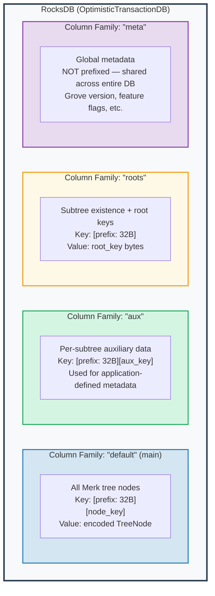
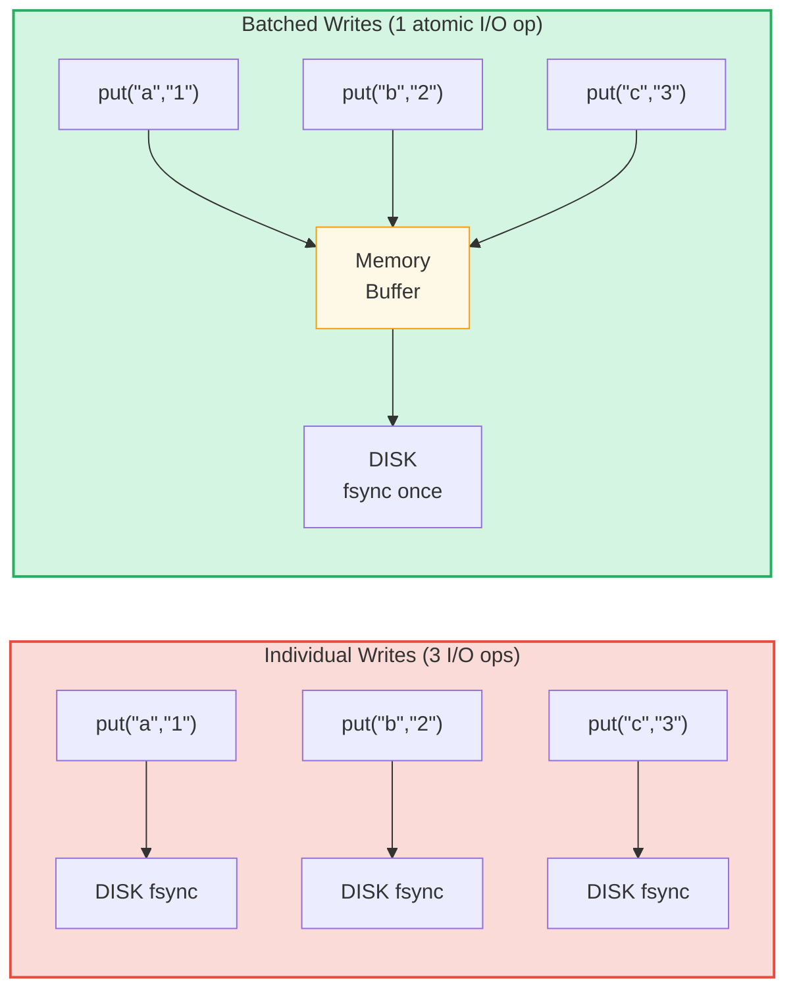

# طبقة التخزين

## RocksDB مع OptimisticTransactionDB

يستخدم GroveDB **RocksDB** كخلفية تخزين، تحديداً نوع
`OptimisticTransactionDB` الذي يدعم المعاملات:

```rust
// storage/src/rocksdb_storage/storage.rs
pub(crate) type Db = OptimisticTransactionDB;
pub(crate) type Tx<'db> = Transaction<'db, Db>;

pub struct RocksDbStorage {
    db: OptimisticTransactionDB,
}
```

**المعاملات المتفائلة** (Optimistic transactions) تعمل بافتراض عدم وجود تعارضات. إذا عدّلت
معاملتان نفس البيانات، فالثانية التي تلتزم ستفشل ويمكن
إعادة المحاولة. هذا أكثر كفاءة من القفل المتشائم لأعباء العمل حيث
تكون التعارضات نادرة.

خيارات RocksDB مُعدَّلة لعبء عمل GroveDB:

```rust
lazy_static! {
    static ref DEFAULT_OPTS: rocksdb::Options = {
        let mut opts = rocksdb::Options::default();
        opts.create_if_missing(true);
        opts.increase_parallelism(num_cpus::get() as i32);
        opts.set_allow_mmap_writes(true);
        opts.set_allow_mmap_reads(true);
        opts.create_missing_column_families(true);
        opts.set_atomic_flush(true);
        opts
    };
}
```

## أربع عائلات أعمدة

عائلات أعمدة RocksDB (Column Families) تعمل كفضاءات أسماء مفتاح-قيمة منفصلة داخل
قاعدة بيانات واحدة. يستخدم GroveDB أربعاً منها:



> **مثال:** المفتاح `[ab3fc2...][6e616d65]` في عائلة عمود "default" يُعيَّن إلى `TreeNode{key:"name", val:"Al"}`، حيث `ab3fc2...` هو `Blake3(path)` و`6e616d65` هو `"name"` بالبايتات.

```rust
pub(crate) const AUX_CF_NAME: &str = "aux";
pub(crate) const ROOTS_CF_NAME: &str = "roots";
pub(crate) const META_CF_NAME: &str = "meta";
// Main data uses the default column family
```

## سياقات التخزين ذات البادئة

كل شجرة فرعية تحصل على **سياق تخزين مسبوق ببادئة** — مُغلِّف يُضيف
تلقائياً بادئة Blake3 من 32 بايت لجميع المفاتيح:

```text
    Subtree path: ["identities", "alice"]
    Prefix: Blake3(path) = [0xab, 0x3f, 0xc2, ...]  (32 bytes)

    When subtree stores key "name" with value "Alice":

    RocksDB key:   [0xab 0x3f 0xc2 ... (32 bytes) | 0x6e 0x61 0x6d 0x65]
                    \_________prefix________/       \_____"name"_____/

    RocksDB value: [encoded TreeNode with value "Alice"]
```

أنواع السياقات:

```text
    Without transaction:
    PrefixedRocksDbImmediateStorageContext
    └── Reads/writes directly to DB with prefix

    With transaction:
    PrefixedRocksDbTransactionContext
    └── Reads/writes through a Transaction with prefix
```

كلاهما يُنفّذ سمة `StorageContext`:

```rust
pub trait StorageContext<'db> {
    fn get(&self, key: &[u8]) -> CostResult<Option<Vec<u8>>, Error>;
    fn get_aux(&self, key: &[u8]) -> CostResult<Option<Vec<u8>>, Error>;
    fn get_root(&self, key: &[u8]) -> CostResult<Option<Vec<u8>>, Error>;
    fn get_meta(&self, key: &[u8]) -> CostResult<Option<Vec<u8>>, Error>;
    fn put(&self, key: &[u8], value: &[u8], ...) -> CostResult<(), Error>;
    fn put_aux(&self, key: &[u8], value: &[u8], ...) -> CostResult<(), Error>;
    fn put_root(&self, key: &[u8], value: &[u8], ...) -> CostResult<(), Error>;
    fn put_meta(&self, key: &[u8], value: &[u8], ...) -> CostResult<(), Error>;
    fn delete(&self, key: &[u8], ...) -> CostResult<(), Error>;
    // ...
}
```

## دفعات الكتابة ونموذج المعاملات

لتحسين الأداء، يُراكم GroveDB الكتابات في دفعات:



> 3 مزامنات قرص مقابل 1 مزامنة قرص = أسرع بنحو 3 مرات. الكتابات الدفعية أيضاً **ذرية** (الكل أو لا شيء).

`StorageBatch` يُراكم العمليات التي يتم تفريغها معاً:

```rust
pub struct StorageBatch {
    operations: RefCell<Vec<AbstractBatchOperation>>,
}
```

## نمط commit_local() الحرج

عند استخدام المعاملات، هناك نمط حرج يجب اتباعه. الكتابات
داخل معاملة تكون مُخزَّنة مؤقتاً — لا تكون مرئية حتى الالتزام:

```rust
// CORRECT pattern:
{
    let tx = db.start_transaction();
    let storage_ctx = db.get_transactional_storage_context(path, &tx);

    storage_ctx.put(key, value);  // Writes to transaction buffer

    drop(storage_ctx);            // Release borrow on tx
    tx.commit_local();            // Flush transaction to DB
}

// INCORRECT — data is lost:
{
    let tx = db.start_transaction();
    let storage_ctx = db.get_transactional_storage_context(path, &tx);

    storage_ctx.put(key, value);  // Writes to transaction buffer

    // tx drops here without commit_local()!
    // All writes are ROLLED BACK!
}
```

هذا مهم بشكل خاص لأن `storage_ctx` يستعير المعاملة.
يجب عليك `drop(storage_ctx)` قبل أن تتمكن من استدعاء `tx.commit_local()`.

---
