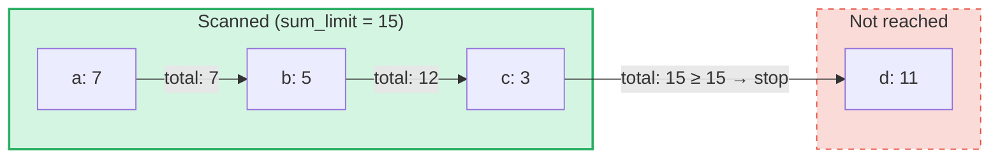

# Agregatni soucetove dotazy

## Prehled

Agregatni soucetove dotazy jsou specializovany typ dotazu urceny pro **SumTrees** v GroveDB.
Zatimco bezne dotazy vyhledavaji elementy podle klice nebo rozsahu, agregatni soucetove dotazy
iteruji pres elementy a kumuluji jejich soucetove hodnoty, dokud neni dosazeno **limitu souctu**.

To je uzitecne pro otazky typu:
- "Dej mi transakce, dokud bezici soucet neprekroci 1000"
- "Ktere polozky prispivaji k prvnim 500 jednotkam hodnoty v tomto strome?"
- "Shromazduj soucetove polozky az do rozpoctu N"

## Zakladni koncepty

### Jak se lisi od beznych dotazu

| Vlastnost | PathQuery | AggregateSumPathQuery |
|-----------|-----------|----------------------|
| **Cil** | Jakykoli typ elementu | SumItem / ItemWithSumItem elementy |
| **Podminka zastaveni** | Limit (pocet) nebo konec rozsahu | Limit souctu (bezici soucet) **a/nebo** limit polozek |
| **Vraci** | Elementy nebo klice | Pary klic-soucetova hodnota |
| **Poddotazy** | Ano (sestup do podstromu) | Ne (jedna uroven stromu) |
| **Reference** | Reseny vrstvou GroveDB | Volitelne nasledovany nebo ignorovany |

### Struktura AggregateSumQuery

```rust
pub struct AggregateSumQuery {
    pub items: Vec<QueryItem>,              // Keys or ranges to scan
    pub left_to_right: bool,                // Iteration direction
    pub sum_limit: u64,                     // Stop when running total reaches this
    pub limit_of_items_to_check: Option<u16>, // Max number of matching items to return
}
```

Dotaz je zabalen do `AggregateSumPathQuery`, ktery urcuje, kde v haji hledat:

```rust
pub struct AggregateSumPathQuery {
    pub path: Vec<Vec<u8>>,                 // Path to the SumTree
    pub aggregate_sum_query: AggregateSumQuery,
}
```

### Limit souctu — Bezici soucet

`sum_limit` je klicovy koncept. Jak jsou elementy prochazeny, jejich soucetove hodnoty se
kumuluji. Jakmile bezici soucet dosahne nebo prekroci limit souctu, iterace se zastavi:



> **Vysledek:** `[(a, 7), (b, 5), (c, 3)]` — iterace se zastavi, protoze 7 + 5 + 3 = 15 >= sum_limit

Zaporne soucetove hodnoty jsou podporovany. Zaporna hodnota zvysuje zbyvajici rozpocet:

```text
sum_limit = 12, elements: a(10), b(-3), c(5)

a: total = 10, remaining = 2
b: total =  7, remaining = 5  ← negative value gave us more room
c: total = 12, remaining = 0  ← stop

Result: [(a, 10), (b, -3), (c, 5)]
```

## Moznosti dotazu

Struktura `AggregateSumQueryOptions` ridi chovani dotazu:

```rust
pub struct AggregateSumQueryOptions {
    pub allow_cache: bool,                              // Use cached reads (default: true)
    pub error_if_intermediate_path_tree_not_present: bool, // Error on missing path (default: true)
    pub error_if_non_sum_item_found: bool,              // Error on non-sum elements (default: true)
    pub ignore_references: bool,                        // Skip references (default: false)
}
```

### Zpracovani nesoucetovych elementu

SumTrees mohou obsahovat smes typu elementu: `SumItem`, `Item`, `Reference`, `ItemWithSumItem`
a dalsi. Ve vychozim nastaveni vyvolava nalezení nesoucetoveho, nereferencniho elementu chybu.

Pokud je `error_if_non_sum_item_found` nastaveno na `false`, nesoucetove elementy jsou **ticho
preskakovany** bez spotreby slotu uzivatelskeho limitu:

```text
Tree contents: a(SumItem=7), b(Item), c(SumItem=3)
Query: sum_limit=100, limit_of_items_to_check=2, error_if_non_sum_item_found=false

Scan: a(7) → returned, limit=1
      b(Item) → skipped, limit still 1
      c(3) → returned, limit=0 → stop

Result: [(a, 7), (c, 3)]
```

Poznamka: `ItemWithSumItem` elementy jsou **vzdy** zpracovany (nikdy preskakovany), protoze nesou
soucetovou hodnotu.

### Zpracovani referenci

Ve vychozim nastaveni jsou `Reference` elementy **nasledovany** — dotaz resolvuje retezec referenci
(az do 3 mezilehych skoku) pro nalezeni soucetove hodnoty ciloveho elementu:

```text
Tree contents: a(SumItem=7), ref_b(Reference → a)
Query: sum_limit=100

ref_b is followed → resolves to a(SumItem=7)

Result: [(a, 7), (ref_b, 7)]
```

Pokud je `ignore_references` nastaveno na `true`, reference jsou ticho preskakovany bez spotreby
slotu limitu, podobne jako jsou preskakovany nesoucetove elementy.

Retezce referenci hlubsi nez 3 mezilehle skoky zpusobi chybu `ReferenceLimit`.

## Typ vysledku

Dotazy vraceji `AggregateSumQueryResult`:

```rust
pub struct AggregateSumQueryResult {
    pub results: Vec<(Vec<u8>, i64)>,       // Key-sum value pairs
    pub hard_limit_reached: bool,           // True if system limit truncated results
}
```

Priznak `hard_limit_reached` ukazuje, zda bylo dosaženo systemoveho pevneho limitu skenovani
(vychozi: 1024 elementu) pred prirozonym dokoncenim dotazu. Pokud je `true`, mohou existovat
dalsi vysledky za temi, ktere byly vraceny.

## Tri systemy limitu

Agregatni soucetove dotazy maji **tri** podminky zastaveni:

| Limit | Zdroj | Co pocita | Ucinky pri dosazeni |
|-------|-------|-----------|---------------------|
| **sum_limit** | Uzivatel (dotaz) | Bezici soucet soucetovych hodnot | Zastavi iteraci |
| **limit_of_items_to_check** | Uzivatel (dotaz) | Odpovidajici vracene polozky | Zastavi iteraci |
| **Pevny limit skenovani** | System (GroveVersion, vychozi 1024) | Vsechny prohledane elementy (vcetne preskocenych) | Zastavi iteraci, nastavi `hard_limit_reached` |

Pevny limit skenovani zabranuje neomezenemu prochazeni, kdyz neni nastaven zadny uzivatelsky
limit. Preskocene elementy (nesoucetove polozky s `error_if_non_sum_item_found=false` nebo
reference s `ignore_references=true`) se pocitaji do pevneho limitu skenovani, ale **ne** do
uzivatelskeho `limit_of_items_to_check`.

## Pouziti API

### Jednoduchy dotaz

```rust
use grovedb::AggregateSumPathQuery;
use grovedb_merk::proofs::query::AggregateSumQuery;

// "Give me items from this SumTree until the total reaches 1000"
let query = AggregateSumQuery::new(1000, None);
let path_query = AggregateSumPathQuery {
    path: vec![b"my_tree".to_vec()],
    aggregate_sum_query: query,
};

let result = db.query_aggregate_sums(
    &path_query,
    true,   // allow_cache
    true,   // error_if_intermediate_path_tree_not_present
    None,   // transaction
    grove_version,
).unwrap().expect("query failed");

for (key, sum_value) in &result.results {
    println!("{}: {}", String::from_utf8_lossy(key), sum_value);
}
```

### Dotaz s moznostmi

```rust
use grovedb::{AggregateSumPathQuery, AggregateSumQueryOptions};
use grovedb_merk::proofs::query::AggregateSumQuery;

// Skip non-sum items and ignore references
let query = AggregateSumQuery::new(1000, Some(50));
let path_query = AggregateSumPathQuery {
    path: vec![b"mixed_tree".to_vec()],
    aggregate_sum_query: query,
};

let result = db.query_aggregate_sums_with_options(
    &path_query,
    AggregateSumQueryOptions {
        error_if_non_sum_item_found: false,  // skip Items, Trees, etc.
        ignore_references: true,              // skip References
        ..AggregateSumQueryOptions::default()
    },
    None,
    grove_version,
).unwrap().expect("query failed");

if result.hard_limit_reached {
    println!("Warning: results may be incomplete (hard limit reached)");
}
```

### Dotazy podle klicu

Namisto skenovani rozsahu muzete dotazovat konkretni klice:

```rust
// Check the sum value of specific keys
let query = AggregateSumQuery::new_with_keys(
    vec![b"alice".to_vec(), b"bob".to_vec(), b"carol".to_vec()],
    u64::MAX,  // no sum limit
    None,      // no item limit
);
```

### Sestupne dotazy

Iterace od nejvyssiho klice k nejnizsimu:

```rust
let query = AggregateSumQuery::new_descending(500, Some(10));
// Or: query.left_to_right = false;
```

## Prehled konstruktoru

| Konstruktor | Popis |
|-------------|-------|
| `new(sum_limit, limit)` | Cely rozsah, vzestupne |
| `new_descending(sum_limit, limit)` | Cely rozsah, sestupne |
| `new_single_key(key, sum_limit)` | Vyhledani jednoho klice |
| `new_with_keys(keys, sum_limit, limit)` | Vice konkrétních klicu |
| `new_with_keys_reversed(keys, sum_limit, limit)` | Vice klicu, sestupne |
| `new_single_query_item(item, sum_limit, limit)` | Jediny QueryItem (klic nebo rozsah) |
| `new_with_query_items(items, sum_limit, limit)` | Vice QueryItems |

---
