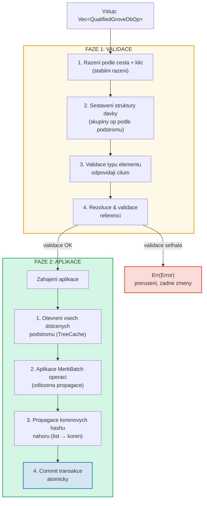
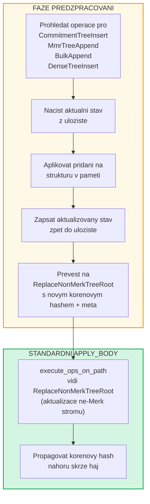

# Davkove operace na urovni haje

## Varianty GroveOp

Na urovni GroveDB jsou operace reprezentovany jako `GroveOp`:

```rust
pub enum GroveOp {
    // Operace orientovane na uzivatele:
    InsertOnly { element: Element },
    InsertOrReplace { element: Element },
    Replace { element: Element },
    Patch { element: Element, change_in_bytes: i32 },
    RefreshReference { reference_path_type, max_reference_hop, flags, trust_refresh_reference },
    Delete,
    DeleteTree(TreeType),                          // Parametrizovano typem stromu

    // Operace pridavani ne-Merk stromu (orientovane na uzivatele):
    CommitmentTreeInsert { cmx: [u8; 32], payload: Vec<u8> },
    MmrTreeAppend { value: Vec<u8> },
    BulkAppend { value: Vec<u8> },
    DenseTreeInsert { value: Vec<u8> },

    // Interni operace (vytvorene predzpracovanim/propagaci, odmitnute z from_ops):
    ReplaceTreeRootKey { hash, root_key, aggregate_data },
    InsertTreeWithRootHash { hash, root_key, flags, aggregate_data },
    ReplaceNonMerkTreeRoot { hash: [u8; 32], meta: NonMerkTreeMeta },
    InsertNonMerkTree { hash, root_key, flags, aggregate_data, meta: NonMerkTreeMeta },
}
```

**NonMerkTreeMeta** prenasi typove specificky stav stromu skrze davkove zpracovani:

```rust
pub enum NonMerkTreeMeta {
    CommitmentTree { total_count: u64, chunk_power: u8 },
    MmrTree { mmr_size: u64 },
    BulkAppendTree { total_count: u64, chunk_power: u8 },
    DenseTree { count: u16, height: u8 },
}
```

Kazda operace je obalena v `QualifiedGroveDbOp`, ktery zahrnuje cestu:

```rust
pub struct QualifiedGroveDbOp {
    pub path: KeyInfoPath,           // Kde v haji
    pub key: Option<KeyInfo>,        // Ktery klic (None pro operace append-only stromu)
    pub op: GroveOp,                 // Co delat
}
```

> **Poznamka:** Pole `key` je `Option<KeyInfo>` -- je `None` pro operace
> append-only stromu (`CommitmentTreeInsert`, `MmrTreeAppend`, `BulkAppend`, `DenseTreeInsert`),
> kde je klic stromu poslednim segmentem `path`.

## Dvoufazove zpracovani

Davkove operace se zpracovavaji ve dvou fazich:



## TreeCache a odlozena propagace

Behem aplikace davky GroveDB pouziva **TreeCache** pro odlozeni propagace
korenoveho hashe, dokud nejsou vsechny operace v podstromu dokonceny:

```mermaid
graph TD
    subgraph without["BEZ TreeCache (naivni)"]
        w1["Op 1: Vlozit A do X"]
        w1p["Propagovat X → rodic → koren"]
        w2["Op 2: Vlozit B do X"]
        w2p["Propagovat X → rodic → koren"]
        w3["Op 3: Vlozit C do X"]
        w3p["Propagovat X → rodic → koren"]
        w1 --> w1p --> w2 --> w2p --> w3 --> w3p
    end

    subgraph with_tc["S TreeCache (odlozene)"]
        t1["Op 1: Vlozit A do X<br/>→ bufferovano"]
        t2["Op 2: Vlozit B do X<br/>→ bufferovano"]
        t3["Op 3: Vlozit C do X<br/>→ bufferovano"]
        tp["Propagovat X → rodic → koren<br/>(projit nahoru JEDNOU)"]
        t1 --> t2 --> t3 --> tp
    end

    style without fill:#fadbd8,stroke:#e74c3c,stroke-width:2px
    style with_tc fill:#d5f5e3,stroke:#27ae60,stroke-width:2px
    style w1p fill:#fadbd8,stroke:#e74c3c
    style w2p fill:#fadbd8,stroke:#e74c3c
    style w3p fill:#fadbd8,stroke:#e74c3c
    style tp fill:#d5f5e3,stroke:#27ae60,stroke-width:2px
```



> **3 propagace * O(hloubka)** vs. **1 propagace * O(hloubka)** = 3x rychlejsi pro tento podstrom.

Toto je vyznamna optimalizace, kdyz mnoho operaci cili na stejny podstrom.

## Atomicke operace napric podstromy

Klicovou vlastnosti davek GroveDB je **atomicita napric podstromy**. Jedna davka
muze modifikovat elementy ve vice podstromech a bud se vse commitne, nebo nic:

```text
    Davka:
    1. Smazat ["balances", "alice"]       (odebrat zustatek)
    2. Vlozit ["balances", "bob"] = 100   (pridat zustatek)
    3. Aktualizovat ["identities", "bob", "rev"] = 2  (aktualizovat revizi)

    Tri dotcene podstromy: balances, identities, identities/bob

    Pokud JAKAKOLIV operace selze → VSECHNY operace jsou zruseny
    Pokud VSECHNY uspeji → VSECHNY jsou commitnuty atomicky
```

Zpracovatel davek to ridi tak, ze:
1. Shromazdi vsechny dotcene cesty
2. Otevira vsechny potrebne podstromy
3. Aplikuje vsechny operace
4. Propaguje vsechny korenove hashe v poradi zavislosti
5. Commitne celou transakci

## Predzpracovani davek pro ne-Merk stromy

Operace CommitmentTree, MmrTree, BulkAppendTree a DenseAppendOnlyFixedSizeTree
vyzaduji pristup ke kontextum uloziste mimo Merk, ktery neni dostupny uvnitr
standardni metody `execute_ops_on_path` (ta ma pristup pouze k Merk). Tyto operace
pouzivaji **vzor predzpracovani**: pred hlavni fazi `apply_body` vstupni body
prohledaji ne-Merk stromove operace a prevedou je na standardni interni operace.

```rust
pub enum GroveOp {
    // ... standardni operace ...

    // Operace ne-Merk stromu (orientovane na uzivatele):
    CommitmentTreeInsert { cmx: [u8; 32], payload: Vec<u8> },
    MmrTreeAppend { value: Vec<u8> },
    BulkAppend { value: Vec<u8> },
    DenseTreeInsert { value: Vec<u8> },

    // Interni operace (produkovane predzpracovanim):
    ReplaceNonMerkTreeRoot { hash: [u8; 32], meta: NonMerkTreeMeta },
}
```



**Proc predzpracovani?** Funkce `execute_ops_on_path` operuje na jednom
podstromu Merk a nema pristup k `self.db` ani sirsim kontextum uloziste.
Predzpracovani ve vstupnich bodech (`apply_batch_with_element_flags_update`,
`apply_partial_batch_with_element_flags_update`) ma plny pristup k databazi,
takze muze nacist/ulozit data a predat jednoduchy `ReplaceNonMerkTreeRoot`
standardnimu strojovemu zpracovani davek.

Kazda metoda predzpracovani nasleduje stejny vzor:
1. **`preprocess_commitment_tree_ops`** -- Nacte frontieni a BulkAppendTree z
   datoveho uloziste, pripoji k oboji, ulozi zpet, prevede na `ReplaceNonMerkTreeRoot`
   s aktualizovanym kombinovanym korenem a `CommitmentTree { total_count, chunk_power }` meta
2. **`preprocess_mmr_tree_ops`** -- Nacte MMR z datoveho uloziste, pripoji hodnoty,
   ulozi zpet, prevede na `ReplaceNonMerkTreeRoot` s aktualizovanym korenem MMR
   a `MmrTree { mmr_size }` meta
3. **`preprocess_bulk_append_ops`** -- Nacte BulkAppendTree z datoveho uloziste,
   pripoji hodnoty (muze spustit kompaktaci chunku), ulozi zpet, prevede na
   `ReplaceNonMerkTreeRoot` s aktualizovanym korenovym hashem stavu a `BulkAppendTree { total_count, chunk_power }` meta
4. **`preprocess_dense_tree_ops`** -- Nacte DenseFixedSizedMerkleTree z datoveho
   uloziste, vklada hodnoty sekvencne, prepocita korenovy hash, ulozi zpet,
   prevede na `ReplaceNonMerkTreeRoot` s aktualizovanym korenovym hashem a `DenseTree { count, height }` meta

Operace `ReplaceNonMerkTreeRoot` nese novy korenovy hash a vycet `NonMerkTreeMeta`,
takze element muze byt plne rekonstruovan po zpracovani.

---
