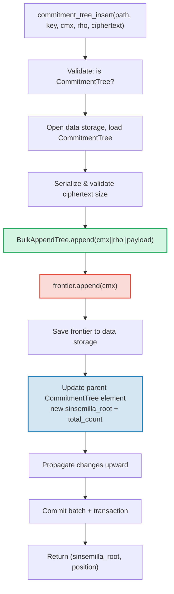

# CommitmentTree -- Kotvici body zavazku Sinsemilla

**CommitmentTree** je mostem GroveDB mezi autentizovanym ulozistem a systemy
dukazu s nulovymi znalostmi (zero-knowledge proof). Kombinuje **BulkAppendTree**
(Kapitola 14) pro efektivni chunk-kompaktovane datove uloziste s **frontierou
Sinsemilla** v datovem prostoru jmen pro ZK-kompatibilni kotvici body (anchors).
Stejne jako MmrTree a BulkAppendTree **nema detsky Merk** -- kombinovany
korenovy hash proudi jako Merk child hash. Zaznamy BulkAppendTree i frontiera
Sinsemilla ziji v **datovem prostoru jmen**.

Tato kapitola pokryva hashovaci funkci Sinsemilla a proc je dulezita pro
obvody s nulovymi znalostmi, datovou strukturu frontiery a jeji kompaktni
serializaci, dvoujmennou architekturu uloziste, operace GroveDB, davkove
predzpracovani, generovani svedku na strane klienta a jak funguji dukazy.

## Proc strom pritelize ZK?

Standardni stromy GroveDB pouzivaji hashovani Blake3. Blake3 je rychly v softwaru,
ale **drahy uvnitr obvodu s nulovymi znalostmi**. Kdyz utracejici potrebuje dokazat
"Znam poznamku na pozici P ve stromu zavazku" aniz by odhalil P, musi vyhodnotit
Merklovskou hashovaci funkci 32krat (jednou na uroven stromu) uvnitr ZK obvodu.

Sinsemilla (specifikovana v ZIP-244 pro protokol Zcash Orchard) je navrzena presne
pro tento pripad pouziti -- poskytuje **efektivni hashovani v obvodu** nad
eliptickou krivkou Pallas, jednou z polovin cyklu krivek Pasta pouzivaneho
systemem dukazu Halo 2.

| Vlastnost | Blake3 | Sinsemilla |
|----------|--------|------------|
| **Naklady v obvodu** | ~25 000 podminek na hash | ~800 podminek na hash |
| **Rychlost v softwaru** | Velmi rychly (~2 GB/s) | Pomaly (~10 000 hashu/s) |
| **Algebraicka struktura** | Zadna (bitova) | Operace bodu krivky Pallas |
| **Primarni ucel** | Obecne hashovani, Merklovy stromy | Merklovy dukazy v obvodu |
| **Pouziva** | Stromy Merk GroveDB, MMR, Bulk | Chraneny protokol Orchard |
| **Velikost vystupu** | 32 bajtu | 32 bajtu (prvek tela Pallas) |

CommitmentTree pouziva Sinsemilla pro Merkluv strom, o kterem ZK obvody
uvazuji, zatimco stale pouziva Blake3 pro hierarchii Merk GroveDB nad nim.
Polozky vlozene do stromu jsou ulozeny prostrednictvim BulkAppendTree v datovem
prostoru jmen (chunk-kompaktovane, ziskatelne podle pozice) a soucasne pripojeny
k frontiere Sinsemilla (produkujici ZK-prokazatelny kotvici bod).

## Architektura datoveho prostoru jmen

CommitmentTree uklada **vsechna data v datovem prostoru jmen** na stejne ceste
podstromu. Stejne jako MmrTree a BulkAppendTree **nema detsky Merk** (zadne pole
`root_key` -- typove specificky koren proudi jako Merk child hash). Zaznamy
BulkAppendTree a frontiera Sinsemilla koexistuji v datovem prostoru jmen
s odlisnymi prefixy klicu:

```text
┌──────────────────────────────────────────────────────────────┐
│                       CommitmentTree                          │
│                                                               │
│  ┌─────────────────────────────────────────────────────────┐  │
│  │  Data Namespace                                         │  │
│  │                                                         │  │
│  │  BulkAppendTree storage (Chapter 14):                   │  │
│  │    Buffer entries → chunk blobs → chunk MMR             │  │
│  │    value = cmx (32) || rho (32) || ciphertext (216)     │  │
│  │                                                         │  │
│  │  Sinsemilla Frontier (~1KB):                            │  │
│  │    key: b"__ct_data__" (COMMITMENT_TREE_DATA_KEY)       │  │
│  │    Depth-32 incremental Merkle tree                     │  │
│  │    Stores only the rightmost path (leaf + ommers)       │  │
│  │    O(1) append, O(1) root computation                   │  │
│  │    Produces Orchard-compatible Anchor for ZK proofs     │  │
│  └─────────────────────────────────────────────────────────┘  │
│                                                               │
│  sinsemilla_root embedded in Element bytes                    │
│    → flows through Merk value_hash → GroveDB state root      │
└──────────────────────────────────────────────────────────────┘
```

**Proc dve struktury?** BulkAppendTree poskytuje efektivni, chunk-kompaktovane
uloziste a ziskavani dat pro potencialne miliony zasifrovanych poznamek. Frontiera
Sinsemilla poskytuje ZK-kompatibilni kotvici body, ktere mohou byt dokazovany
uvnitr obvodu Halo 2. Obe se aktualizuji synchronne pri kazdem pripojeni.

Srovnejte s ostatnimi nestandardnimi typy stromu:

| | CommitmentTree | MmrTree | BulkAppendTree |
|---|---|---|---|
| **Detsky Merk** | Ne | Ne | Ne |
| **Datovy prostor jmen** | Zaznamy BulkAppendTree + frontiera | MMR uzly | Buffer + chunky + MMR |
| **Auxiliarni prostor jmen** | -- | -- | -- |
| **Polozky dotazovatelne** | Pres V1 dukazy | Pres V1 dukazy | Pres V1 dukazy |
| **Hashovaci funkce** | Sinsemilla + Blake3 | Blake3 | Blake3 |

## Frontiera Sinsemilla

Frontiera je inkrementalni Merkluv strom hloubky 32 implementovany typem
`Frontier<MerkleHashOrchard, 32>` z cratu `incrementalmerkletree`. Misto
ukladani vsech 2^32 moznych listu uklada pouze informace potrebne k
**pripojeni dalsiho listu a vypoctu aktualniho korene**: nejpravejsi list
a jeho ommery (sourozenecke hashe potrebne pro vypocet korene).

```text
                         root (level 32)
                        /               \
                      ...               ...
                     /                     \
                  (level 2)             (level 2)
                  /     \               /     \
              (level 1) (level 1)   (level 1)  ?
              /    \    /    \      /    \
             L0    L1  L2    L3   L4    ?     ← frontier stores L4
                                              + ommers at levels
                                              where left sibling exists
```

Frontiera uklada:
- **list**: naposledy pripojenou hodnotu (prvek tela Pallas)
- **ommery**: levy-sourozenecke hashe na kazde urovni, kde cesta frontiery
  jde doprava (maximalne 32 ommeru pro strom hloubky 32)
- **pozici**: 0-indexovanou pozici listu

Klicove vlastnosti:
- **O(1) pripojeni**: vlozit novy list, aktualizovat ommery, prepocitat koren
- **O(1) koren**: projit ulozene ommery od listu ke koreni
- **~1KB konstantni velikost**: bez ohledu na to, kolik listu bylo pripojeno
- **Deterministicke**: dve frontiery se stejnou sekvenci pripojeni produkovji
  stejny koren

Konstanta `EMPTY_SINSEMILLA_ROOT` je koren prazdneho stromu hloubky 32,
predpocitana jako `MerkleHashOrchard::empty_root(Level::from(32)).to_bytes()`:

```text
0xae2935f1dfd8a24aed7c70df7de3a668eb7a49b1319880dde2bbd9031ae5d82f
```

## Jak funguje pripojeni -- Kaskada ommeru

Kdyz je novy zavazek pripojen na pozici N, pocet ommeru, ktere musi byt
aktualizovany, se rovna `trailing_ones(N)` -- poctu koncovych 1-bitu
v binarni reprezentaci N. Toto je stejny vzor jako kaskada slucovani MMR
(§13.4), ale operujici na ommerech misto na vrcolicich.

**Proverecny priklad -- pripojeni 4 listu:**

```text
Position 0 (binary: 0, trailing_ones: 0):
  frontier = { leaf: L0, ommers: [], position: 0 }
  Sinsemilla hashes: 32 (root computation) + 0 (no ommer merges) = 32

Position 1 (binary: 1, trailing_ones: 0 of PREVIOUS position 0):
  Before: position 0 has trailing_ones = 0
  frontier = { leaf: L1, ommers: [H(L0,L1) at level 1], position: 1 }
  Sinsemilla hashes: 32 + 0 = 32

Position 2 (binary: 10, trailing_ones: 0 of PREVIOUS position 1):
  Before: position 1 has trailing_ones = 1
  frontier = { leaf: L2, ommers: [level1_hash], position: 2 }
  Sinsemilla hashes: 32 + 1 = 33

Position 3 (binary: 11, trailing_ones: 0 of PREVIOUS position 2):
  Before: position 2 has trailing_ones = 0
  frontier = { leaf: L3, ommers: [level1_hash, level2_hash], position: 3 }
  Sinsemilla hashes: 32 + 0 = 32
```

**Celkovy pocet hashu Sinsemilla** na pripojeni je:

```text
32 (root computation always traverses all 32 levels)
+ trailing_ones(current_position)  (ommer cascade)
```

Prumerne `trailing_ones` je ~1 (geometricke rozdeleni), takze prumerne
naklady jsou **~33 hashu Sinsemilla na pripojeni**. Nejhorsi pripad (na
pozici 2^32 - 1, kde vsechny bity jsou 1) je **64 hashu**.

## Format serializace frontiery

Frontiera je ulozena v datovem ulozisti na klici `b"__ct_data__"`. Dratovy
format je:

```text
┌──────────────────────────────────────────────────────────────────┐
│ has_frontier: u8                                                  │
│   0x00 → empty tree (no more fields)                             │
│   0x01 → non-empty (fields follow)                               │
├──────────────────────────────────────────────────────────────────┤
│ position: u64 BE (8 bytes)      — 0-indexed leaf position        │
├──────────────────────────────────────────────────────────────────┤
│ leaf: [u8; 32]                  — Pallas field element bytes     │
├──────────────────────────────────────────────────────────────────┤
│ ommer_count: u8                 — number of ommers (0..=32)      │
├──────────────────────────────────────────────────────────────────┤
│ ommers: [ommer_count × 32 bytes] — Pallas field elements        │
└──────────────────────────────────────────────────────────────────┘
```

**Analyza velikosti:**

| Stav | Velikost | Rozklad |
|-------|------|-----------|
| Prazdna | 1 bajt | pouze priznak `0x00` |
| 1 list, 0 ommeru | 42 bajtu | 1 + 8 + 32 + 1 |
| ~16 ommeru (prumer) | 554 bajtu | 1 + 8 + 32 + 1 + 16×32 |
| 32 ommeru (maximum) | 1 066 bajtu | 1 + 8 + 32 + 1 + 32×32 |

Velikost frontiery je ohranicena ~1,1KB bez ohledu na to, kolik milionu
zavazku bylo pripojeno. To cini cyklus nacti→zmen→uloz velmi levnym
(1 seek pro cteni, 1 seek pro zapis).

## Reprezentace elementu

```rust
CommitmentTree(
    u64,                  // total_count: number of appended items
    u8,                   // chunk_power: dense tree height for BulkAppendTree buffer
    Option<ElementFlags>, // flags: optional metadata
)
```

Parametr `chunk_power` ridi vysku husteho stromu bufferu BulkAppendTree;
`chunk_power` musi byt v rozsahu 1..=16 (viz §14.1 a §16).

**Typove identifikatory:**

| Identifikator | Hodnota |
|---|---|
| Diskriminant elementu | 11 |
| `TreeType` | `CommitmentTree = 7` |
| `ElementType` | 11 |
| `COMMITMENT_TREE_COST_SIZE` | 12 bajtu (8 total_count + 1 chunk_power + 1 diskriminant + 2 rezijni) |

Sinsemilla koren NENI ulozen v Elementu. Proudi jako Merk child hash
prostrednictvim mechanismu `insert_subtree`. Kdyz rodicovsky Merk pocita svuj
`combined_value_hash`, koren odvozeny ze Sinsemilla je zahrnut jako child hash:

```text
combined_value_hash = blake3(value_hash || child_hash)
                                           ↑ sinsemilla/BulkAppendTree combined root
```

To znamena, ze jakakoliv zmena frontiery Sinsemilla se automaticky propaguje
pres hierarchii Merk GroveDB ke korenovemu stavu.

**Konstruktory:**

| Metoda | Vytvori |
|---|---|
| `Element::empty_commitment_tree(chunk_power)` | Prazdny strom, count=0, bez priznaku |
| `Element::empty_commitment_tree_with_flags(chunk_power, flags)` | Prazdny strom s priznaky |
| `Element::new_commitment_tree(total_count, chunk_power, flags)` | Vsechna pole explicitne |

## Architektura uloziste

CommitmentTree uklada vsechna svá data v jedinem **datovem prostoru jmen** na
ceste podstromu. Zaznamy BulkAppendTree a frontiera Sinsemilla koexistuji ve
stejnem sloupci s odlisnymi prefixy klicu. Zadny auxiliarni prostor jmen se
nepouziva.

```text
┌──────────────────────────────────────────────────────────────────┐
│  Data Namespace (all CommitmentTree storage)                      │
│                                                                   │
│  BulkAppendTree storage keys (see §14.7):                         │
│    b"m" || pos (u64 BE)  → MMR node blobs                        │
│    b"b" || index (u64 BE)→ buffer entries (cmx || rho || ciphertext) │
│    b"e" || chunk (u64 BE)→ chunk blobs (compacted buffer)         │
│    b"M"                  → BulkAppendTree metadata                │
│                                                                   │
│  Sinsemilla frontier:                                             │
│    b"__ct_data__"        → serialized CommitmentFrontier (~1KB)   │
│                                                                   │
│  No Merk nodes — this is a non-Merk tree.                         │
│  Data authenticated via BulkAppendTree state_root (Blake3).       │
│  Sinsemilla root authenticates all cmx values via Pallas curve.   │
└──────────────────────────────────────────────────────────────────┘
```

**Vzor nacti→zmen→uloz**: Kazda mutujici operace nacte frontieru z datoveho
uloziste, modifikuje ji v pameti a zapise zpet. Protoze frontiera ma maximalne
~1KB, jde o levny par I/O operaci (1 seek pro cteni, 1 seek pro zapis).
Soucasne je BulkAppendTree nacten, pripojen a ulozen.

**Propagace korenoveho hashe**: Kdyz je polozka vlozena, dve veci se zmeni:
1. Stav BulkAppendTree se zmeni (novy zaznam v bufferu nebo kompaktace chunku)
2. Sinsemilla koren se zmeni (novy zavazek ve frontiere)

Obe jsou zachyceny v aktualizovanem elementu `CommitmentTree`. Hash
rodicovskeho uzlu Merk se stava:

```text
combined_hash = combine_hash(
    value_hash(element_bytes),    ← includes total_count + chunk_power
    child_hash(combined_root)     ← sinsemilla/BulkAppendTree combined root
)
```

Stejne jako MmrTree a BulkAppendTree, typove specificky koren proudi jako
Merk child hash. Veskera autentizace dat proudi pres tuto vazbu child hashe.

**Dùsledky ne-Merk datoveho uloziste**: Protoze datovy prostor jmen obsahuje
klice BulkAppendTree (ne uzly Merk), operace iterujici uloziste jako Merk
elementy -- napriklad `find_subtrees`, `is_empty_tree` a
`verify_merk_and_submerks` -- musi specialne osetrovat CommitmentTree (a dalsi
ne-Merk typy stromu). Pomocnik `uses_non_merk_data_storage()` na `Element` i
`TreeType` identifikuje tyto typy stromu. Operace mazani vymazavaji datovy
prostor jmen primo misto iterace a verify_grovedb preskakuje rekurzi
pod-merku pro tyto typy.

## Operace GroveDB

CommitmentTree poskytuje ctyri operace. Operace vkladani je genericka nad
`M: MemoSize` (z cratu `orchard`), ktery ridi validaci velikosti sifrovaneho
textu. Vychozi `M = DashMemo` dava 216-bajtovy payload
(32 epk + 104 enc + 80 out).

```rust
// Insert a commitment (typed) — returns (sinsemilla_root, position)
// M controls ciphertext size validation
db.commitment_tree_insert::<_, _, M>(path, key, cmx, rho, ciphertext, tx, version)

// Insert a commitment (raw bytes) — validates payload.len() == ciphertext_payload_size::<DashMemo>()
db.commitment_tree_insert_raw(path, key, cmx, rho, payload_vec, tx, version)

// Get the current Orchard Anchor
db.commitment_tree_anchor(path, key, tx, version)

// Retrieve a value by global position
db.commitment_tree_get_value(path, key, position, tx, version)

// Get the current item count
db.commitment_tree_count(path, key, tx, version)
```

Typovana metoda `commitment_tree_insert` prijima `TransmittedNoteCiphertext<M>` a
serializuje ji interne. Surova `commitment_tree_insert_raw` (pub(crate)) prijima
`Vec<u8>` a pouziva se pri davkovem predzpracovani, kde jsou payloady jiz
serializovane.

### commitment_tree_insert

Operace vkladani aktualizuje jak BulkAppendTree, tak frontieru Sinsemilla
v jedine atomicke operaci:

```text
Step 1: Validate element at path/key is a CommitmentTree
        → extract total_count, chunk_power, flags

Step 2: Build ct_path = path ++ [key]

Step 3: Open data storage context at ct_path
        Load CommitmentTree (frontier + BulkAppendTree)
        Serialize ciphertext → validate payload size matches M
        Append cmx||rho||ciphertext to BulkAppendTree
        Append cmx to Sinsemilla frontier → get new sinsemilla_root
        Track Blake3 + Sinsemilla hash costs

Step 4: Save updated frontier to data storage

Step 5: Open parent Merk at path
        Write updated CommitmentTree element:
          new total_count, same chunk_power, same flags
        Child hash = combined_root (sinsemilla + bulk state)

Step 6: Propagate changes from parent upward through Merk hierarchy

Step 7: Commit storage batch and local transaction
        Return (sinsemilla_root, position)
```



> **Cervena** = operace Sinsemilla. **Zelena** = operace BulkAppendTree.
> **Modra** = aktualizace elementu premostujici obe.

### commitment_tree_anchor

Operace anchor je dotaz pouze pro cteni:

```text
Step 1: Validate element at path/key is a CommitmentTree
Step 2: Build ct_path = path ++ [key]
Step 3: Load frontier from data storage
Step 4: Return frontier.anchor() as orchard::tree::Anchor
```

Typ `Anchor` je nativni Orchard reprezentace Sinsemilla korene, vhodna
pro prime predani do `orchard::builder::Builder` pri konstrukci
dukazu autorizace utraceni.

### commitment_tree_get_value

Ziskava ulozenou hodnotu (cmx || rho || payload) podle jeji globalni pozice:

```text
Step 1: Validate element at path/key is a CommitmentTree
        → extract total_count, chunk_power
Step 2: Build ct_path = path ++ [key]
Step 3: Open data storage context, wrap in CachedBulkStore
Step 4: Load BulkAppendTree, call get_value(position)
Step 5: Return Option<Vec<u8>>
```

Toto nasleduje stejny vzor jako `bulk_get_value` (§14.9) -- BulkAppendTree
transparentne ziskava z bufferu nebo kompaktovaneho chunk blobu v zavislosti
na tom, kam pozice pada.

### commitment_tree_count

Vraci celkovy pocet polozek pripojenych ke stromu:

```text
Step 1: Read element at path/key
Step 2: Verify it is a CommitmentTree
Step 3: Return total_count from element fields
```

Toto je jednoduche cteni pole elementu -- zadny pristup k ulozisti mimo
rodicovsky Merk.

## Davkove operace

CommitmentTree podporuje davkove vkladani prostrednictvim varianty
`GroveOp::CommitmentTreeInsert`:

```rust
GroveOp::CommitmentTreeInsert {
    cmx: [u8; 32],      // extracted note commitment
    rho: [u8; 32],      // nullifier of the spent note
    payload: Vec<u8>,    // serialized ciphertext (216 bytes for DashMemo)
}
```

Dva konstruktory vytvaraji tuto operaci:

```rust
// Raw constructor — caller serializes payload manually
QualifiedGroveDbOp::commitment_tree_insert_op(path, cmx, rho, payload_vec)

// Typed constructor — serializes TransmittedNoteCiphertext<M> internally
QualifiedGroveDbOp::commitment_tree_insert_op_typed::<M>(path, cmx, rho, &ciphertext)
```

Vice vkladani cilicich na stejny strom je povoleno v jedine davce. Protoze
`execute_ops_on_path` nema pristup k datovemu ulozisti, vsechny operace
CommitmentTree musi byt predzpracovany pred `apply_body`.

**Potrubi predzpracovani** (`preprocess_commitment_tree_ops`):

```text
Input: [CTInsert{cmx1}, Insert{...}, CTInsert{cmx2}, CTInsert{cmx3}]
                                       ↑ same (path,key) as cmx1

Step 1: Group CommitmentTreeInsert ops by (path, key)
        group_1: [cmx1, cmx2, cmx3]

Step 2: For each group:
        a. Read existing element → verify CommitmentTree, extract chunk_power
        b. Open transactional storage context at ct_path
        c. Load CommitmentTree from data storage (frontier + BulkAppendTree)
        d. For each (cmx, rho, payload):
           - ct.append_raw(cmx, rho, payload) — validates size, appends to both
        e. Save updated frontier to data storage

Step 3: Replace all CTInsert ops with one ReplaceNonMerkTreeRoot per group
        carrying: hash=bulk_state_root (combined root),
                  meta=NonMerkTreeMeta::CommitmentTree {
                      total_count: new_count,
                      chunk_power,
                  }

Output: [ReplaceNonMerkTreeRoot{...}, Insert{...}]
```

Prvni operace CommitmentTreeInsert v kazde skupine je nahrazena operaci
`ReplaceNonMerkTreeRoot`; nasledujici operace pro stejny (path, key) jsou
zahozeny. Standardni davkovy stroj pak zpracovava aktualizaci elementu
a propagaci korenoveho hashe.

## Generikum MemoSize a zpracovani sifrovaneho textu

Struktura `CommitmentTree<S, M>` je genericka nad `M: MemoSize` (z cratu
`orchard`). Toto ridi velikost zasifrovanych poznamkovych sifrovanych textu
ulozenych vedle kazdeho zavazku.

```rust
pub struct CommitmentTree<S, M: MemoSize = DashMemo> {
    frontier: CommitmentFrontier,
    pub bulk_tree: BulkAppendTree<S>,
    _memo: PhantomData<M>,
}
```

Vychozi `M = DashMemo` znamena, ze existujici kod, ktery se nestara
o velikost memo (jako `verify_grovedb`, `commitment_tree_anchor`,
`commitment_tree_count`), funguje bez specifikace `M`.

**Pomocne funkce serializace** (verejne volne funkce):

| Funkce | Popis |
|----------|-------------|
| `ciphertext_payload_size::<M>()` | Ocekavana velikost payloadu pro dany `MemoSize` |
| `serialize_ciphertext::<M>(ct)` | Serializace `TransmittedNoteCiphertext<M>` do bajtu |
| `deserialize_ciphertext::<M>(data)` | Deserializace bajtu zpet na `TransmittedNoteCiphertext<M>` |

**Validace payloadu**: Metoda `append_raw()` validuje, ze
`payload.len() == ciphertext_payload_size::<M>()` a vraci
`CommitmentTreeError::InvalidPayloadSize` pri nesouladu. Typovana metoda
`append()` serializuje interne, takze velikost je vzdy korektni dle konstrukce.

### Rozlozeni ulozeneho zaznamu (280 bajtu pro DashMemo)

Kazdy zaznam v BulkAppendTree uklada kompletni zasifrovany zaznam poznamky.
Uplne rozlozeni, zahrnujici kazdy bajt:

```text
┌─────────────────────────────────────────────────────────────────────┐
│  Offset   Size   Field                                              │
├─────────────────────────────────────────────────────────────────────┤
│  0        32     cmx — extracted note commitment (Pallas base field)│
│  32       32     rho — nullifier of the spent note                  │
│  64       32     epk_bytes — ephemeral public key (Pallas point)    │
│  96       104    enc_ciphertext — encrypted note plaintext + MAC    │
│  200      80     out_ciphertext — encrypted outgoing data + MAC     │
├─────────────────────────────────────────────────────────────────────┤
│  Total:   280 bytes                                                 │
└─────────────────────────────────────────────────────────────────────┘
```

Prvni dve pole (`cmx` a `rho`) jsou **nezasifrovana pole protokolu** —
jsou verejna z navrhu. Zbyvajici tri pole (`epk_bytes`,
`enc_ciphertext`, `out_ciphertext`) tvori `TransmittedNoteCiphertext` a
jsou zasifrovany payload.

### Rozklad pole po poli

**cmx (32 bajtu)** — Extrahovany zavazek poznamky, prvek bazoveho tela Pallas.
Toto je hodnota listu pripojovana k frontiere Sinsemilla. Zavazuje se
ke vsem polim poznamky (prijemce, hodnota, nahodnost) aniz by je odhalovala.
cmx je to, co cini poznamku "nalezitelnou" ve stromu zavazku.

**rho (32 bajtu)** — Nullifier poznamky utracene v teto akci.
Nullifiery jsou jiz verejne na blockchainu (musi byt, aby se zabranilo
dvojitemu utraceni). Ukladani `rho` vedle zavazku umoznuje light klientum
provadejicim zkusebni desifrovani overit `esk = PRF(rseed, rho)` a potvrdit
`epk' == epk` bez oddeleneho vyhledavani nullifiera. Toto pole lezi mezi
`cmx` a sifrovym textem jako nezasifrovane proviazani na urovni protokolu.

**epk_bytes (32 bajtu)** — Efemerni verejny klic, serializovany bod
krivky Pallas. Deterministicky odvozen z `rseed` poznamky pres:

```text
rseed → esk = ToScalar(PRF^expand(rseed, [4] || rho))
esk   → epk = [esk] * g_d     (scalar multiplication on Pallas)
epk   → epk_bytes = Serialize(epk)
```

kde `g_d = DiversifyHash(d)` je diverzifikovany bazovy bod pro
diverzifikator prijemce. `epk` umoznuje prijemci vypocitat sdileny
tajny klic pro desifrovani: `shared_secret = [ivk] * epk`. Je prenaseny
otevrene, protoze nic neodhaluje o odesilateli ci prijemci bez znalosti
`esk` nebo `ivk`.

**enc_ciphertext (104 bajtu pro DashMemo)** — Zasifrovany otevreny text poznamky,
produkovany AEAD sifovanim ChaCha20-Poly1305:

```text
enc_ciphertext = ChaCha20-Poly1305.Encrypt(key, nonce=[0;12], aad=[], plaintext)
               = ciphertext (88 bytes) || MAC tag (16 bytes) = 104 bytes
```

Symetricky klic je odvozen pres ECDH:
`key = BLAKE2b-256("Zcash_OrchardKDF", shared_secret || epk_bytes)`.

Po desifrovani prijemcem (pomoci `ivk`) **otevreny text poznamky**
(88 bajtu pro DashMemo) obsahuje:

| Offset | Velikost | Pole | Popis |
|--------|------|-------|-------------|
| 0 | 1 | version | Vzdy `0x02` (Orchard, post-ZIP-212) |
| 1 | 11 | diversifier (d) | Diverzifikator prijemce, odvozuje bazovy bod `g_d` |
| 12 | 8 | value (v) | 64-bitova hodnota poznamky little-endian v duff |
| 20 | 32 | rseed | Nahodne semeno pro deterministicke odvozeni `rcm`, `psi`, `esk` |
| 52 | 36 | memo | Data memo aplikacni vrstvy (DashMemo: 36 bajtu) |
| **Celkem** | **88** | | |

Prvnich 52 bajtu (version + diversifier + value + rseed) je **kompaktni
poznamka** — light klienti mohou zkusebne desifrovat pouze tuto cast pomoci
proudoveho sifru ChaCha20 (bez overovani MAC), aby zkontrolovali, zda poznamka
patri jim. Pokud ano, desifruji celych 88 bajtu a overi MAC.

**out_ciphertext (80 bajtu)** — Zasifrovana odchozi data, umoznujici
**odesilateli** ziskat poznamku zpetne. Zasifrovano Odchozim Sifrovacim
Klicem:

```text
ock = BLAKE2b-256("Zcash_Orchardock", ovk || cv_net || cmx || epk)
out_ciphertext = ChaCha20-Poly1305.Encrypt(ock, nonce=[0;12], aad=[], plaintext)
               = ciphertext (64 bytes) || MAC tag (16 bytes) = 80 bytes
```

Po desifrovani odesilatelem (pomoci `ovk`) **odchozi otevreny text**
(64 bajtu) obsahuje:

| Offset | Velikost | Pole | Popis |
|--------|------|-------|-------------|
| 0 | 32 | pk_d | Diverzifikovany prenosovy klic (verejny klic prijemce) |
| 32 | 32 | esk | Efemerni tajny klic (skalar Pallas) |
| **Celkem** | **64** | | |

S `pk_d` a `esk` muze odesilatel rekonstruovat sdileny tajny klic, desifrovat
`enc_ciphertext` a ziskat celou poznamku. Pokud odesilatel nastavi `ovk = null`,
odchozi otevreny text je vyplnen nahodnymi bajty pred sifovanim, coz
znemozni obnovu i pro odesilatele (neobnovitelny vystup).

### Schema sifrovani: ChaCha20-Poly1305

Jak `enc_ciphertext`, tak `out_ciphertext` pouzivaji ChaCha20-Poly1305 AEAD (RFC 8439):

| Parametr | Hodnota |
|-----------|-------|
| Velikost klice | 256 bitu (32 bajtu) |
| Nonce | `[0u8; 12]` (bezpecne protoze kazdy klic se pouzije presne jednou) |
| AAD | Prazdne |
| MAC znacka | 16 bajtu (Poly1305) |

Nulovy nonce je bezpecny, protoze symetricky klic je odvozen z nove
Diffieho-Hellmanovy vymeny per poznamka — kazdy klic sifruje presne jednu zpravu.

### Srovnani velikosti DashMemo a ZcashMemo

| Komponenta | DashMemo | ZcashMemo | Poznamky |
|-----------|----------|-----------|-------|
| Pole memo | 36 bajtu | 512 bajtu | Data aplikace |
| Otevreny text poznamky | 88 bajtu | 564 bajtu | 52 pevnych + memo |
| enc_ciphertext | 104 bajtu | 580 bajtu | otevreny text + 16 MAC |
| Payload sifroveho textu (epk+enc+out) | 216 bajtu | 692 bajtu | Prenaseno per poznamka |
| Uplny ulozeny zaznam (cmx+rho+payload) | **280 bajtu** | **756 bajtu** | Zaznam BulkAppendTree |

Mensi memo DashMemo (36 vs 512 bajtu) redukuje kazdy ulozeny zaznam o
476 bajtu — vyznamne pri ukladani milionu poznamek.

### Prubeh zkusebniho desifrovani (Light Client)

Light klient skenujici sve vlastni poznamky provadi tuto sekvenci pro kazdy
ulozeny zaznam:

```text
1. Read record: cmx (32) || rho (32) || epk (32) || enc_ciphertext (104) || out_ciphertext (80)

2. Compute shared_secret = [ivk] * epk     (ECDH with incoming viewing key)

3. Derive key = BLAKE2b-256("Zcash_OrchardKDF", shared_secret || epk)

4. Trial-decrypt compact note (first 52 bytes of enc_ciphertext):
   → version (1) || diversifier (11) || value (8) || rseed (32)

5. Reconstruct esk = PRF(rseed, rho)    ← rho is needed here!
   Verify: [esk] * g_d == epk           ← confirms this is our note

6. If match: decrypt full enc_ciphertext (88 bytes + 16 MAC):
   → compact_note (52) || memo (36)
   Verify MAC tag for authenticity

7. Reconstruct full Note from (diversifier, value, rseed, rho)
   This note can later be spent by proving knowledge of it in ZK
```

Krok 5 je duvodem, proc musi byt `rho` ulozeno vedle sifroveho textu —
bez nej light klient nemuze overit vazbu efemernich klicu behem zkusebniho
desifrovani.

## Generovani svedku na strane klienta

Crat `grovedb-commitment-tree` poskytuje **klientsky** strom pro penezenky
a testovaci prostredi, ktere potrebuji generovat Merklovy cesty svedku pro
utraceni poznamek. Povolte funkci `client` pro pouziti:

```toml
grovedb-commitment-tree = { version = "4", features = ["client"] }
```

```rust
pub struct ClientMemoryCommitmentTree {
    inner: ShardTree<MemoryShardStore<MerkleHashOrchard, u32>, 32, 4>,
}
```

`ClientMemoryCommitmentTree` obaluje `ShardTree` -- uplny strom zavazku (ne pouze
frontieru), ktery uchovava kompletni historii v pameti. To umoznuje generovani
autentizacnich cest pro jakekoliv oznaceny list, coz samotna frontiera nemuze.

**API:**

| Metoda | Popis |
|---|---|
| `new(max_checkpoints)` | Vytvoreni prazdneho stromu s limitem udrzovani kontrolnich bodu |
| `append(cmx, retention)` | Pripojeni zavazku s politikou udrzovani |
| `checkpoint(id)` | Vytvoreni kontrolniho bodu v aktualnim stavu |
| `max_leaf_position()` | Pozice naposledy pripojeneho listu |
| `witness(position, depth)` | Generovani `MerklePath` pro utraceni poznamky |
| `anchor()` | Aktualni koren jako `orchard::tree::Anchor` |

**Politiky udrzovani** ridi, ktere listy mohou byt pozdeji dosvědceny:

| Udrzovani | Vyznam |
|---|---|
| `Retention::Ephemeral` | List nemuze byt dosvědcen (poznamky jinych lidi) |
| `Retention::Marked` | List muze byt dosvědcen (vase vlastni poznamky) |
| `Retention::Checkpoint { id, marking }` | Vytvoreni kontrolniho bodu, volitelne oznaceni |

**Srovnani serveru a klienta:**

| | `CommitmentFrontier` (server) | `ClientMemoryCommitmentTree` (klient) | `ClientPersistentCommitmentTree` (sqlite) |
|---|---|---|---|
| **Uloziste** | ~1KB frontiera v datovem ulozisti | Uplny strom v pameti | Uplny strom v SQLite |
| **Muze dosvědcit** | Ne | Ano (pouze oznacene listy) | Ano (pouze oznacene listy) |
| **Muze pocitat anchor** | Ano | Ano | Ano |
| **Anchor odpovida** | Stejna sekvence → stejny anchor | Stejna sekvence → stejny anchor | Stejna sekvence → stejny anchor |
| **Pretrvava pres restarty** | Ano (datove uloziste GroveDB) | Ne (ztraceno pri drop) | Ano (SQLite databaze) |
| **Pripad pouziti** | Serverove sledovani anchorů GroveDB | Testovani, efemerni penezenky | Produkcni penezenky |
| **Priznak funkce** | `server` | `client` | `sqlite` |

Vsechny tri produkovji **identicke anchory** pro stejnou sekvenci pripojeni. Toto je
overeno testem `test_frontier_and_client_same_root`.

### Perzistentni klient -- Generovani svedku s podporou SQLite

Pametovy `ClientMemoryCommitmentTree` ztrati veskerý stav pri drop. Pro
produkcni penezenky, ktere musi prezit restarty bez opetovneho skenovani
celeho blockchainu, crat poskytuje `ClientPersistentCommitmentTree` s podporou
SQLite. Povolte funkci `sqlite`:

```toml
grovedb-commitment-tree = { version = "4", features = ["sqlite"] }
```

```rust
pub struct ClientPersistentCommitmentTree {
    inner: ShardTree<SqliteShardStore, 32, 4>,
}
```

**Tri rezimy konstruktoru:**

| Konstruktor | Popis |
|---|---|
| `open(conn, max_checkpoints)` | Prebira vlastnictvi existujiciho `rusqlite::Connection` |
| `open_on_shared_connection(arc, max_checkpoints)` | Sdili `Arc<Mutex<Connection>>` s dalsimi komponentami |
| `open_path(path, max_checkpoints)` | Pohodli -- otevira/vytvari SQLite DB na dane ceste k souboru |

Konstruktory s vlastnim pripojenim (`open`, `open_on_shared_connection`)
umoznuji penezence pouzit svou **existujici databazi** pro uloziste stromu
zavazku. `SqliteShardStore` vytvari sve tabulky s prefixem `commitment_tree_`,
takze bezpecne koexistuje vedle dalsich aplikacnich tabulek.

**API** je identicke s `ClientMemoryCommitmentTree`:

| Metoda | Popis |
|---|---|
| `append(cmx, retention)` | Pripojeni zavazku s politikou udrzovani |
| `checkpoint(id)` | Vytvoreni kontrolniho bodu v aktualnim stavu |
| `max_leaf_position()` | Pozice naposledy pripojeneho listu |
| `witness(position, depth)` | Generovani `MerklePath` pro utraceni poznamky |
| `anchor()` | Aktualni koren jako `orchard::tree::Anchor` |

**Schema SQLite** (4 tabulky, vytvorene automaticky):

```sql
commitment_tree_shards                -- Shard data (serialized prunable trees)
commitment_tree_cap                   -- Tree cap (single-row, top of shard tree)
commitment_tree_checkpoints           -- Checkpoint metadata (position or empty)
commitment_tree_checkpoint_marks_removed  -- Marks removed per checkpoint
```

**Priklad persistence:**

```rust
use grovedb_commitment_tree::{ClientPersistentCommitmentTree, Retention, Position};

// First session: append notes and close
let mut tree = ClientPersistentCommitmentTree::open_path("wallet.db", 100)?;
tree.append(cmx_0, Retention::Marked)?;
tree.append(cmx_1, Retention::Ephemeral)?;
let anchor_before = tree.anchor()?;
drop(tree);

// Second session: reopen, state is preserved
let tree = ClientPersistentCommitmentTree::open_path("wallet.db", 100)?;
let anchor_after = tree.anchor()?;
assert_eq!(anchor_before, anchor_after);  // same anchor, no re-scan needed
```

**Priklad sdileneho pripojeni** (pro penezenky s existujici SQLite databazi):

```rust
use std::sync::{Arc, Mutex};
use grovedb_commitment_tree::rusqlite::Connection;

let conn = Arc::new(Mutex::new(Connection::open("wallet.db")?));
// conn is also used by other wallet components...
let mut tree = ClientPersistentCommitmentTree::open_on_shared_connection(
    conn.clone(), 100
)?;
```

Crat `grovedb-commitment-tree` re-exportuje `rusqlite` pod priznakem funkce
`sqlite`, takze downstream konzumenti nepotrebuji pridavat `rusqlite` jako
separatni zavislost.

**Interni SqliteShardStore:**

`SqliteShardStore` implementuje vsech 18 metod traitu `ShardStore`.
Shard stromy jsou serializovany pomoci kompaktniho binarniho formatu:

```text
Nil:    [0x00]                                     — 1 byte
Leaf:   [0x01][hash: 32][flags: 1]                 — 34 bytes
Parent: [0x02][has_ann: 1][ann?: 32][left][right]  — recursive
```

`LocatedPrunableTree` pridava prefix adresy: `[level: 1][index: 8][tree_bytes]`.

Vycet `ConnectionHolder` abstrahuje nad vlastnenym vs sdilenym pripojenim:

```rust
enum ConnectionHolder {
    Owned(Connection),                    // exclusive access
    Shared(Arc<Mutex<Connection>>),       // shared with other components
}
```

Vsechny databazove operace ziskavaji pripojeni pres pomocnik `with_conn`,
ktery transparentne zpracovava oba rezimy a zamyka mutex pouze pri sdileni.

## Integrace dukazu

CommitmentTree podporuje dve cesty dukazu:

**1. Dukaz anchoru Sinsemilla (ZK cesta):**

```text
GroveDB root hash
  ↓ Merk proof (V0, standard)
Parent Merk node
  ↓ value_hash includes CommitmentTree element bytes
CommitmentTree element bytes
  ↓ contains sinsemilla_root field
Sinsemilla root (Orchard Anchor)
  ↓ ZK proof (Halo 2 circuit, off-chain)
Note commitment at position P
```

1. Rodicovsky Merk dukaz dokazuje, ze element `CommitmentTree` existuje
   na tvrene ceste/klici se specifickymi bajty.
2. Tyto bajty zahrnutji pole `sinsemilla_root`.
3. Klient (penezenka) nezavisle konstruuje Merkluv svedek ve stromu
   Sinsemilla pomoci `ClientMemoryCommitmentTree::witness()` (testovani)
   nebo `ClientPersistentCommitmentTree::witness()` (produkce, s podporou SQLite).
4. ZK obvod overuje svedka vuci anchoru (sinsemilla_root).

**2. Dukaz ziskani polozky (V1 cesta):**

Jednotlive polozky (cmx || rho || payload) mohou byt dotazovany podle pozice
a dokazovany pomoci V1 dukazu (§9.6), stejneho mechanismu pouzivaneho
samostatnym BulkAppendTree. V1 dukaz zahrnuje autentizacni cestu
BulkAppendTree pro pozadovanou pozici, zretezenou s rodicovskym Merk
dukazem pro element CommitmentTree.

## Sledovani nakladu

CommitmentTree zavädi dedicovane pole nakladu pro operace Sinsemilla:

```rust
pub struct OperationCost {
    pub seek_count: u32,
    pub storage_cost: StorageCost,
    pub storage_loaded_bytes: u64,
    pub hash_node_calls: u32,
    pub sinsemilla_hash_calls: u32,   // ← new field for CommitmentTree
}
```

Pole `sinsemilla_hash_calls` je oddelene od `hash_node_calls`, protoze
hashe Sinsemilla jsou dramaticky drazsí nez Blake3 jak v case CPU,
tak v nakladech ZK obvodu.

**Rozklad nakladu na pripojeni:**

| Komponenta | Prumerny pripad | Nejhorsi pripad |
|---|---|---|
| Hashe Sinsemilla | 33 (32 koren + 1 ommer prumer) | 64 (32 koren + 32 ommeru) |
| I/O seeku frontiery | 2 (get + put) | 2 |
| Nactenych bajtu frontiery | 554 (~16 ommeru) | 1 066 (32 ommeru) |
| Zapsanych bajtu frontiery | 554 | 1 066 |
| Hashe BulkAppendTree | ~5 Blake3 (amortizovane, viz §14.15) | O(chunk_size) pri kompaktaci |
| I/O BulkAppendTree | 2-3 seeku (metadata + buffer) | +2 pri kompaktaci chunku |

**Konstanty odhadu nakladu** (z `average_case_costs.rs` a
`worst_case_costs.rs`):

```rust
// Average case
const AVG_FRONTIER_SIZE: u32 = 554;    // ~16 ommers
const AVG_SINSEMILLA_HASHES: u32 = 33; // 32 root levels + 1 avg ommer

// Worst case
const MAX_FRONTIER_SIZE: u32 = 1066;   // 32 ommers (max depth)
const MAX_SINSEMILLA_HASHES: u32 = 64; // 32 root levels + 32 ommers
```

Naklady komponenty BulkAppendTree jsou sledovany vedle nakladu Sinsemilla,
kombinujici jak hashe Blake3 (z operaci bufferu/chunku BulkAppendTree), tak
hashe Sinsemilla (z pripojeni frontiery) do jednoho `OperationCost`.

## Hierarchie klicu Orchard a re-exporty

Crat `grovedb-commitment-tree` re-exportuje uplne API Orchard potrebne ke
konstrukci a overovani chranenych transakci. To umoznuje kodu Platformy
importovat vse z jednoho cratu.

**Typy spravy klicu:**

```text
SpendingKey
  ├── SpendAuthorizingKey → SpendValidatingKey
  └── FullViewingKey
        ├── IncomingViewingKey (decrypt received notes)
        ├── OutgoingViewingKey (decrypt sent notes)
        └── Address (= PaymentAddress, derive recipient addresses)
```

**Typy poznamek:**

| Typ | Ucel |
|---|---|
| `Note` | Uplna poznamka s hodnotou, prijedmcem, nahodnosti |
| `ExtractedNoteCommitment` | `cmx` extrahovany z poznamky (32 bajtu) |
| `Nullifier` | Jedinecna znacka oznacujici poznamku jako utracenou |
| `Rho` | Vstup odezeni nullifieru (spojuje utraceni s predchozi poznamkou) |
| `NoteValue` | 64-bitova hodnota poznamky |
| `ValueCommitment` | Pedersenùv zavazek k hodnote poznamky |

**Typy dukazu a bundlu:**

| Typ | Ucel |
|---|---|
| `ProvingKey` | Prováděcí klic Halo 2 pro obvody Orchard |
| `VerifyingKey` | Overovaci klic Halo 2 pro obvody Orchard |
| `BatchValidator` | Davkove overovani vice bundlu Orchard |
| `Bundle<T, V>` | Kolekce akci tvoricich chraneny prevod |
| `Action` | Jediny par utraceni/vystup v ramci bundlu |
| `Authorized` | Stav autorizace bundlu (podpisy + ZK dukaz) |
| `Flags` | Priznaky bundlu (utraceni povoleno, vystupy povoleny) |
| `Proof` | Dukaz Halo 2 v ramci autorizovaneho bundlu |

**Typy builderu:**

| Typ | Ucel |
|---|---|
| `Builder` | Konstruuje Orchard bundle z utraceni a vystupu |
| `BundleType` | Konfiguruje strategii paddingu pro bundle |

**Typy stromu:**

| Typ | Ucel |
|---|---|
| `Anchor` | Sinsemilla koren jako nativni typ Orchard |
| `MerkleHashOrchard` | Hashovy uzel Sinsemilla ve stromu zavazku |
| `MerklePath` | 32-urovnova autentizacni cesta pro generovani svedku |

## Implementacni soubory

| Soubor | Ucel |
|------|---------|
| `grovedb-commitment-tree/src/lib.rs` | Struktura `CommitmentFrontier`, serializace, `EMPTY_SINSEMILLA_ROOT`, re-exporty |
| `grovedb-commitment-tree/src/commitment_tree/mod.rs` | Struktura `CommitmentTree<S, M>`, typovane/surove pripojeni, pomocne funkce sifrovaneho textu |
| `grovedb-commitment-tree/src/commitment_frontier/mod.rs` | `CommitmentFrontier` (frontiera Sinsemilla obalujici `Frontier`) |
| `grovedb-commitment-tree/src/error.rs` | `CommitmentTreeError` (vcetne `InvalidPayloadSize`) |
| `grovedb-commitment-tree/src/client/mod.rs` | `ClientMemoryCommitmentTree`, generovani svedku v pameti |
| `grovedb-commitment-tree/src/client/sqlite_store.rs` | `SqliteShardStore`, implementace `ShardStore` nad SQLite, serializace stromu |
| `grovedb-commitment-tree/src/client/client_persistent_commitment_tree.rs` | `ClientPersistentCommitmentTree`, generovani svedku s podporou SQLite |
| `grovedb-commitment-tree/Cargo.toml` | Priznaky funkci: `server`, `client`, `sqlite` |
| `grovedb-element/src/element/mod.rs` | Varianta `Element::CommitmentTree` (3 pole: `u64, u8, Option<ElementFlags>`) |
| `grovedb-element/src/element/constructor.rs` | `empty_commitment_tree(chunk_power)`, `new_commitment_tree_with_all()` |
| `grovedb-element/src/element/helpers.rs` | Pomocnik `uses_non_merk_data_storage()` |
| `merk/src/tree_type/costs.rs` | `COMMITMENT_TREE_COST_SIZE = 12` |
| `merk/src/tree_type/mod.rs` | `TreeType::CommitmentTree = 7`, `uses_non_merk_data_storage()` |
| `grovedb/src/operations/commitment_tree.rs` | Operace GroveDB: typovane vkladani, surove vkladani, anchor, get_value, count, davkove predzpracovani |
| `grovedb/src/operations/delete/mod.rs` | Zpracovani mazani ne-Merk typu stromu |
| `grovedb/src/batch/mod.rs` | `GroveOp::CommitmentTreeInsert`, konstruktor `commitment_tree_insert_op_typed` |
| `grovedb/src/batch/estimated_costs/average_case_costs.rs` | Model prumernych nakladu |
| `grovedb/src/batch/estimated_costs/worst_case_costs.rs` | Model nejhorsich nakladu |
| `grovedb/src/tests/commitment_tree_tests.rs` | 32 integracnich testu |

## Srovnani s ostatnimi typy stromu

| | CommitmentTree | MmrTree | BulkAppendTree | DenseTree |
|---|---|---|---|---|
| **Diskriminant elementu** | 11 | 12 | 13 | 14 |
| **TreeType** | 7 | 8 | 9 | 10 |
| **Ma detsky Merk** | Ne | Ne | Ne | Ne |
| **Datovy prostor jmen** | Zaznamy BulkAppendTree + frontiera Sinsemilla | MMR uzly | Buffer + chunky + MMR | Hodnoty podle pozice |
| **Hashovaci funkce** | Sinsemilla + Blake3 | Blake3 | Blake3 | Blake3 |
| **Typ dukazu** | V1 (Bulk) + ZK (Sinsemilla) | V1 (MMR dukaz) | V1 (Bulk dukaz) | V1 (DenseTree dukaz) |
| **Hashu na pripojeni** | ~33 Sinsemilla + ~5 Blake3 | ~2 Blake3 | ~5 Blake3 (amortizovane) | O(n) Blake3 |
| **Velikost nakladu** | 12 bajtu | 11 bajtu | 12 bajtu | 6 bajtu |
| **Kapacita** | Neomezena | Neomezena | Neomezena | Pevna (2^h - 1) |
| **Pritelize ZK** | Ano (Halo 2) | Ne | Ne | Ne |
| **Kompaktace chunku** | Ano (konfigurovatelny chunk_power) | Ne | Ano | Ne |
| **Pripad pouziti** | Chranene zavazky poznamek | Logy udalosti/transakci | Vysoko-propustne hromadne logy | Male ohranicene struktury |

Zvolte CommitmentTree, kdyz potrebujete ZK-prokazatelne anchory pro chranene
protokoly s efektivnim chunk-kompaktovanym ulozistem. Zvolte MmrTree, kdyz
potrebujete jednoduchy append-only log s jednotlivymi dukazy listu. Zvolte
BulkAppendTree, kdyz potrebujete vysoko-propustne rozsahove dotazy s chunkovymi
snimky. Zvolte DenseAppendOnlyFixedSizeTree, kdyz potrebujete kompaktni strukturu
s pevnou kapacitou, kde kazda pozice uklada hodnotu a korenovy hash je vzdy
prepocitavan za behu.

---
