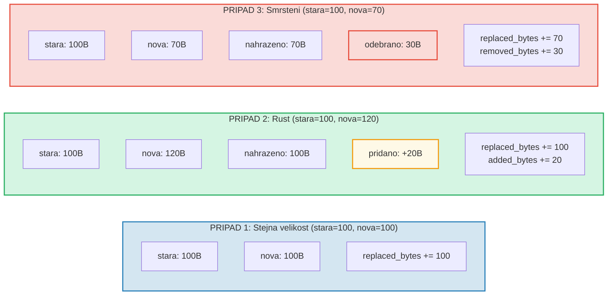

# Sledovani nakladu

## Struktura OperationCost

Kazda operace v GroveDB akumuluje naklady merene ve vypocetnich zdrojich:

```rust
// costs/src/lib.rs
pub struct OperationCost {
    pub seek_count: u32,              // Pocet vyhledavani v ulozisti
    pub storage_cost: StorageCost,    // Pridane/nahrazene/odebrane bajty
    pub storage_loaded_bytes: u64,    // Bajty prectene z disku
    pub hash_node_calls: u32,         // Pocet hashovacich operaci Blake3
    pub sinsemilla_hash_calls: u32,   // Pocet hashovacich operaci Sinsemilla (EC operace)
}
```

> **Volani hashu Sinsemilla** sleduje hashovaci operace nad eliptickymi krivkami pro
> kotvici body CommitmentTree. Ty jsou vyrazne nakladnejsi nez hashe Blake3 uzlu.

Naklady uloziste se dale cleni:

```rust
// costs/src/storage_cost/mod.rs
pub struct StorageCost {
    pub added_bytes: u32,                   // Nově zapsana data
    pub replaced_bytes: u32,                // Prepsana existujici data
    pub removed_bytes: StorageRemovedBytes, // Uvolnena data
}
```

## Vzor CostContext

Vsechny operace vraceji svuj vysledek obaleny v `CostContext`:

```rust
pub struct CostContext<T> {
    pub value: T,               // Vysledek operace
    pub cost: OperationCost,    // Spotrebovane zdroje
}

pub type CostResult<T, E> = CostContext<Result<T, E>>;
```

To vytvari **monadicky** vzor sledovani nakladu -- naklady automaticky proudi
skrze retezce operaci:

```rust
// Rozbalit vysledek, pridat jeho naklady k akumulatoru
let result = expensive_operation().unwrap_add_cost(&mut total_cost);

// Retezneni operaci s akumulaci nakladu
let final_result = op1()
    .flat_map(|x| op2(x))      // Naklady z op1 + op2
    .flat_map(|y| op3(y));      // + naklady z op3
```

## Makro cost_return_on_error!

Nejcastejsim vzorem v kodu GroveDB je makro `cost_return_on_error!`,
ktere funguje jako `?`, ale zachovava naklady pri casnem navratu:

```rust
macro_rules! cost_return_on_error {
    ( &mut $cost:ident, $($body:tt)+ ) => {
        {
            let result_with_cost = { $($body)+ };
            let result = result_with_cost.unwrap_add_cost(&mut $cost);
            match result {
                Ok(x) => x,
                Err(e) => return Err(e).wrap_with_cost($cost),
            }
        }
    };
}
```

V praxi:

```rust
fn insert_element(&self, path: &[&[u8]], key: &[u8], element: Element) -> CostResult<(), Error> {
    let mut cost = OperationCost::default();

    // Kazde volani makra pridava naklady operace k `cost`
    // a vraci Ok hodnotu (nebo casne vraci s akumulovanymi naklady pri Err)
    let merk = cost_return_on_error!(&mut cost, self.open_merk(path));
    cost_return_on_error!(&mut cost, merk.insert(key, element));
    cost_return_on_error!(&mut cost, self.propagate_changes(path));

    Ok(()).wrap_with_cost(cost)
    // `cost` nyni obsahuje soucet nakladu vsech tri operaci
}
```

## Rozklad nakladu uloziste

Kdyz je hodnota aktualizovana, naklady zavisi na tom, zda je nova hodnota
vetsi, mensi nebo stejne velka:



## Naklady hashovacich operaci

Naklady hashu se meří v "volanich hashu uzlu" -- poctu blokovych kompresi Blake3:

| Operace | Velikost vstupu | Volani hashu |
|---------|----------------|--------------|
| `value_hash(maly)` | < 64 bajtu | 1 |
| `value_hash(stredni)` | 64-127 bajtu | 2 |
| `kv_hash` | klic + value_hash | promenlive |
| `node_hash` | 96 bajtu (3 * 32) | 2 (vzdy) |
| `combine_hash` | 64 bajtu (2 * 32) | 1 (vzdy) |
| `node_hash_with_count` | 104 bajtu (3 * 32 + 8) | 2 (vzdy) |
| Sinsemilla (CommitmentTree) | EC operace krivky Pallas | sledovano samostatne pres `sinsemilla_hash_calls` |

Obecny vzorec pro Blake3:

```text
hash_calls = 1 + (vstupni_bajty - 1) / 64
```

## Odhad nejhorsiho a prumerneho pripadu

GroveDB poskytuje funkce pro **odhad** nakladu operaci pred jejich provedenim.
To je klicove pro vypocet poplatku na blockchainu -- potrebujete znat naklady
pred tim, nez se zarete k jejich zaplaceni.

```rust
// Nejhorsi naklady cteni uzlu
pub fn add_worst_case_get_merk_node(
    cost: &mut OperationCost,
    not_prefixed_key_len: u32,
    max_element_size: u32,
    node_type: NodeType,
) {
    cost.seek_count += 1;  // Jedno diskove vyhledavani
    cost.storage_loaded_bytes +=
        TreeNode::worst_case_encoded_tree_size(
            not_prefixed_key_len, max_element_size, node_type
        ) as u64;
}

// Nejhorsi naklady propagace
pub fn add_worst_case_merk_propagate(
    cost: &mut OperationCost,
    input: &WorstCaseLayerInformation,
) {
    let levels = match input {
        MaxElementsNumber(n) => ((*n + 1) as f32).log2().ceil() as u32,
        NumberOfLevels(n) => *n,
    };
    let mut nodes_updated = levels;

    // AVL rotace mohou aktualizovat dalsi uzly
    if levels > 2 {
        nodes_updated += 2;  // Maximalne 2 dalsi uzly pro rotace
    }

    cost.storage_cost.replaced_bytes += nodes_updated * MERK_BIGGEST_VALUE_SIZE;
    cost.storage_loaded_bytes +=
        nodes_updated as u64 * (MERK_BIGGEST_VALUE_SIZE + MERK_BIGGEST_KEY_SIZE) as u64;
    cost.seek_count += nodes_updated;
    cost.hash_node_calls += nodes_updated * 2;
}
```

Pouzivane konstanty:

```rust
pub const MERK_BIGGEST_VALUE_SIZE: u32 = u16::MAX as u32;  // 65535
pub const MERK_BIGGEST_KEY_SIZE: u32 = 256;
```

---
