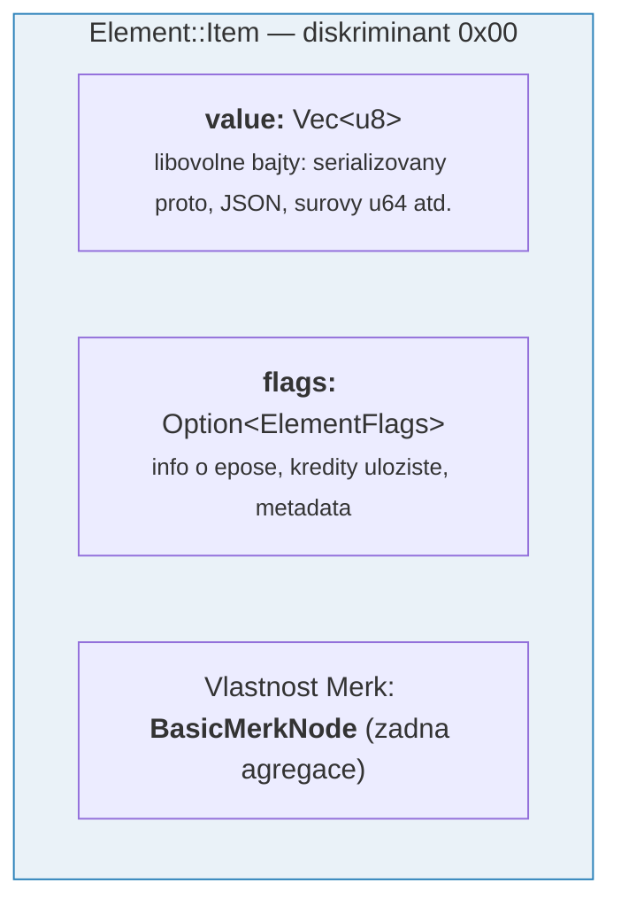
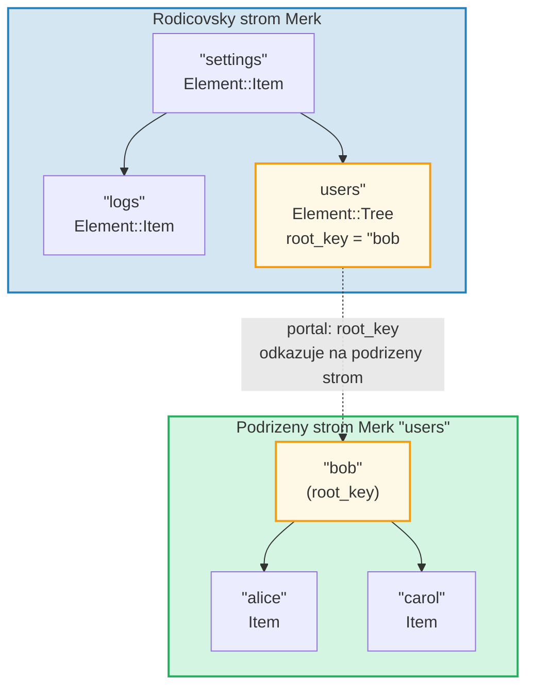
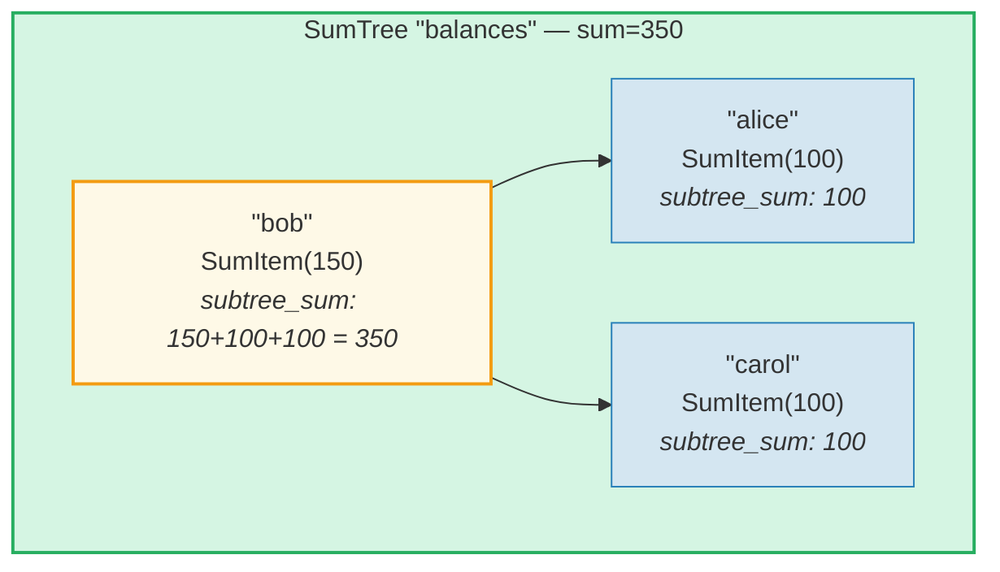
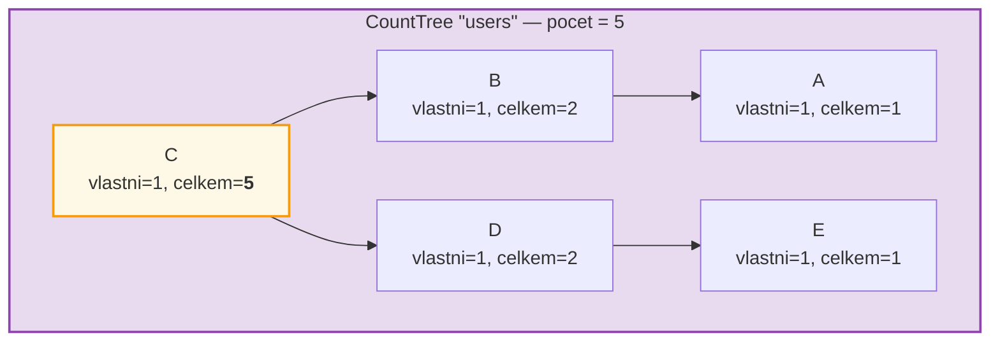
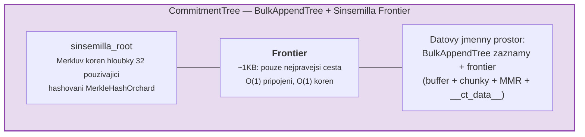

# System elementu

Zatimco Merk pracuje se surovymi pary klicu a hodnot, GroveDB operuje na vyssi
urovni pomoci **elementu** -- typovanych hodnot, ktere nesou semanticky vyznam.
Kazda hodnota ulozena v GroveDB je Element.

## Vycet Element

```rust
// grovedb-element/src/element/mod.rs
pub enum Element {
    Item(Vec<u8>, Option<ElementFlags>),                                    // [0]
    Reference(ReferencePathType, MaxReferenceHop, Option<ElementFlags>),    // [1]
    Tree(Option<Vec<u8>>, Option<ElementFlags>),                           // [2]
    SumItem(SumValue, Option<ElementFlags>),                               // [3]
    SumTree(Option<Vec<u8>>, SumValue, Option<ElementFlags>),              // [4]
    BigSumTree(Option<Vec<u8>>, BigSumValue, Option<ElementFlags>),        // [5]
    CountTree(Option<Vec<u8>>, CountValue, Option<ElementFlags>),          // [6]
    CountSumTree(Option<Vec<u8>>, CountValue, SumValue, Option<ElementFlags>), // [7]
    ProvableCountTree(Option<Vec<u8>>, CountValue, Option<ElementFlags>),  // [8]
    ItemWithSumItem(Vec<u8>, SumValue, Option<ElementFlags>),              // [9]
    ProvableCountSumTree(Option<Vec<u8>>, CountValue, SumValue,
                         Option<ElementFlags>),                            // [10]
    CommitmentTree(u64, u8, Option<ElementFlags>),                         // [11]
    MmrTree(u64, Option<ElementFlags>),                                    // [12]
    BulkAppendTree(u64, u8, Option<ElementFlags>),                         // [13]
    DenseAppendOnlyFixedSizeTree(u16, u8, Option<ElementFlags>),           // [14]
}
```

Cisla diskriminantu (zobrazena v hranatych zavorkach) se pouzivaji pri serializaci.

Typove aliasy pouzivane v celem systemu:

```rust
pub type ElementFlags = Vec<u8>;        // Libovolna metadata na element
pub type MaxReferenceHop = Option<u8>;  // Volitelny limit skoku pro reference
pub type SumValue = i64;                // 64-bitovy znamenkovy soucet
pub type BigSumValue = i128;            // 128-bitovy znamenkovy soucet
pub type CountValue = u64;              // 64-bitovy bezznamenkovy pocet
```

## Item -- Zakladni uloziste klicu a hodnot

Nejjednodussi element. Uklada libovolne bajty:

```rust
Element::Item(value: Vec<u8>, flags: Option<ElementFlags>)
```



Konstruktory:

```rust
Element::new_item(b"hello world".to_vec())
Element::new_item_with_flags(b"data".to_vec(), Some(vec![0x01, 0x02]))
```

Polozky (Item) se ucastni sumarni agregace: uvnitr SumTree prispiva Item
vychozi hodnotou souctu 0. SumItem prispiva svou explicitni hodnotou.

## Tree -- Kontejnery pro podstromy

Element Tree je **portal** do dalsiho stromu Merk. Uklada korenovy klic
podrizeneho stromu (pokud existuje):

```rust
Element::Tree(root_key: Option<Vec<u8>>, flags: Option<ElementFlags>)
```



> Element Tree v rodicovskem Merk uklada `root_key` podrizeneho stromu Merk. Toto vytvari **portal** -- spojeni z jednoho stromu Merk do druheho.

Kdyz je strom prazdny, `root_key` je `None`. Konstruktor `Element::empty_tree()`
vytvari `Element::Tree(None, None)`.

## SumItem / SumTree -- Agregatni soucty

**SumTree** automaticky udrzuje soucet prispevku vsech svych primych potomku:

```rust
Element::SumTree(root_key: Option<Vec<u8>>, sum: SumValue, flags: Option<ElementFlags>)
Element::SumItem(value: SumValue, flags: Option<ElementFlags>)
```



> **Vzorec agregace:** `soucet_uzlu = vlastni_hodnota + soucet_leveho_potomka + soucet_praveho_potomka`
> Bob: 150 + 100 (alice) + 100 (carol) = **350**. Korenovy soucet (350) je ulozen v elementu SumTree rodice.

Soucet je udrzovan na urovni Merk prostrednictvim typu vlastnosti
`TreeFeatureType::SummedMerkNode(i64)`. Behem propagace stromu je agregatni
data kazdeho uzlu prepocitana:

```text
agregatni_soucet = vlastni_soucet + soucet_leveho_potomka + soucet_praveho_potomka
```

## CountTree, CountSumTree, BigSumTree

Dalsi typy agregatnich stromu:

| Typ elementu | Typ vlastnosti Merk | Agreguje |
|---|---|---|
| `CountTree` | `CountedMerkNode(u64)` | Pocet elementu |
| `CountSumTree` | `CountedSummedMerkNode(u64, i64)` | Pocet i soucet |
| `BigSumTree` | `BigSummedMerkNode(i128)` | 128-bitovy soucet pro velke hodnoty |
| `ProvableCountTree` | `ProvableCountedMerkNode(u64)` | Pocet zapeceny do hashe |
| `ProvableCountSumTree` | `ProvableCountedSummedMerkNode(u64, i64)` | Pocet v hashi + soucet |

**ProvableCountTree** je specialni: jeho pocet je zahrnut do vypoctu `node_hash`
(prostrednictvim `node_hash_with_count`), takze dukaz muze overit pocet bez
odhaleni jakychkoli hodnot.

## Serializace elementu

Elementy jsou serializovany pomoci **bincode** s poradim bajtu big-endian:

```rust
pub fn serialize(&self, grove_version: &GroveVersion) -> Result<Vec<u8>, ElementError> {
    let config = config::standard().with_big_endian().with_no_limit();
    bincode::encode_to_vec(self, config)
}
```

Prvni bajt je **diskriminant**, umoznujici detekci typu v O(1):

```rust
pub fn from_serialized_value(value: &[u8]) -> Option<ElementType> {
    match value.first()? {
        0 => Some(ElementType::Item),
        1 => Some(ElementType::Reference),
        2 => Some(ElementType::Tree),
        3 => Some(ElementType::SumItem),
        // ... atd
    }
}
```

## TreeFeatureType a tok agregatnich dat

Vycet `TreeFeatureType` premostuje mezeru mezi elementy GroveDB a uzly Merk:

```rust
pub enum TreeFeatureType {
    BasicMerkNode,                              // Zadna agregace
    SummedMerkNode(i64),                       // Sumarni agregace
    BigSummedMerkNode(i128),                   // Velky soucet
    CountedMerkNode(u64),                      // Pocet
    CountedSummedMerkNode(u64, i64),           // Pocet + soucet
    ProvableCountedMerkNode(u64),              // Pocet v hashi
    ProvableCountedSummedMerkNode(u64, i64),   // Pocet v hashi + soucet
}
```

Agregatni data proudi **smerem nahoru** skrze strom:



> **Tabulka agregace:** Agregat kazdeho uzlu = vlastni(1) + levy_agregat + pravy_agregat
>
> | Uzel | vlastni | levy_agr | pravy_agr | celkem |
> |------|---------|----------|-----------|--------|
> | A | 1 | 0 | 0 | 1 |
> | B | 1 | 1 (A) | 0 | 2 |
> | E | 1 | 0 | 0 | 1 |
> | D | 1 | 0 | 1 (E) | 2 |
> | C | 1 | 2 (B) | 2 (D) | **5** (koren) |

Pocet ulozeny v kazdem uzlu predstavuje celkovy pocet v podstromu
zakorezenem v danem uzlu vcetne sebe. Pocet korenoveho uzlu je celkovy
pocet pro cely strom.

Vycet `AggregateData` to prenasi skrze system linku:

```rust
pub enum AggregateData {
    NoAggregateData,
    Sum(i64),
    BigSum(i128),
    Count(u64),
    CountAndSum(u64, i64),
    ProvableCount(u64),
    ProvableCountAndSum(u64, i64),
}
```

## CommitmentTree -- Strom zavazku Sinsemilla

**CommitmentTree** poskytuje Sinsemilla Merkluv strom hloubky 32 pro sledovani
kotvicich bodu (anchor) zavazku poznamek, jak se pouziva v tikovem protokolu Orchard
platformy Zcash. Obaluje
`incrementalmerkletree::Frontier<MerkleHashOrchard, 32>` pro pripojeni v O(1)
a vypocet korene:

```rust
Element::CommitmentTree(
    total_count: u64,               // Pocet pripojenych zavazku
    chunk_power: u8,                // Velikost kompaktace BulkAppendTree (chunk_size = 2^chunk_power)
    flags: Option<ElementFlags>,
)                                   // diskriminant [11]
```

> **Poznamka:** Korenovy hash frontieni Sinsemilla NENI ulozen v elementu.
> Je ulozen v datovem ulozisti a prochazi mechanismem Merk child hash
> (parametr `subtree_root_hash` funkce `insert_subtree`). Jakakoliv zmena frontieni
> se automaticky propaguje skrze hierarchii GroveDB Merk.



**Architektura:**
- *Frontier* (nejpravejsi cesta Merklova stromu, ~1KB konstantni velikost) je
  ulozena v **datovem jmennem prostoru** pod klicem `COMMITMENT_TREE_DATA_KEY`
- Vlastni data poznamek (`cmx || sifrovany text`) jsou ulozena prostrednictvim **BulkAppendTree**
  v **datovem jmennem prostoru** -- kompaktovana do chunku, vyhledatelna podle pozice
- Historicke kotvici body sleduje Platform v samostatnem prokazatelnem stromu
- Korenovy hash Sinsemilla NENI ulozen v elementu -- prochazi jako Merk child hash
  skrze hierarchii hashu GroveDB

**Operace:**
- `commitment_tree_insert(path, key, cmx, ciphertext, tx)` -- Typovane pripojeni
  prijimajici `TransmittedNoteCiphertext<M>`; vraci `(novy_koren, pozice)`
- `commitment_tree_anchor(path, key, tx)` -- Ziskani aktualniho kotviciho bodu Orchard (Anchor)
- `commitment_tree_get_value(path, key, position, tx)` -- Nacteni hodnoty podle pozice
- `commitment_tree_count(path, key, tx)` -- Ziskani celkoveho poctu polozek

**Generikum MemoSize:** `CommitmentTree<S, M: MemoSize = DashMemo>` validuje, ze
datova cast sifrovaneho textu odpovida ocekavane velikosti pro `M`. Pro Dash (36-bajtove memo):
`epk_bytes (32) + enc_ciphertext (104) + out_ciphertext (80) = 216 bajtu`.

**Sledovani nakladu:** Hashovaci operace Sinsemilla jsou sledovany prostrednictvim
`cost.sinsemilla_hash_calls`. Vypocet korene vzdy prochazi 32 uroven.
Slucovani ommeru kaskaduje skrze `trailing_ones()` predchozi pozice.
Operace BulkAppendTree pridavaji naklady hashu Blake3.

## MmrTree -- Merkle Mountain Range

**MmrTree** uklada data v prikladovem (append-only) Merkle Mountain Range (MMR)
pouzivajicim hashovani Blake3. Uzly MMR jsou ulozeny ve **sloupci data** (stejnem
jako uzly Merk), nikoli v podstromu Merk. Podrobny rozbor viz **[Kapitola 13](#chapter-13-the-mmr-tree--append-only-authenticated-logs)**.

```rust
Element::MmrTree(
    mmr_size: u64,                  // Interni velikost MMR (uzly, ne listy)
    flags: Option<ElementFlags>,
)                                   // diskriminant [12]
```

> **Poznamka:** Korenovy hash MMR NENI ulozen v elementu. Prochazi jako Merk
> child hash prostrednictvim parametru `subtree_root_hash` funkce `insert_subtree`.

**Operace:** `mmr_tree_append`, `mmr_tree_root_hash`, `mmr_tree_get_value`,
`mmr_tree_leaf_count`. **Dukazy:** V1 dukazy (viz kap. 9.6 a 13.9).

## BulkAppendTree -- Dvouurovnova prikladova struktura

**BulkAppendTree** kombinuje buffer hustehe Merklova stromu s MMR na urovni chunku
pro efektivni vysokorychlostni prikladani s prokazatelnymi rozsahovymi dotazy. Je to
ne-Merk strom -- data ziji v **datovem jmennem prostoru**, nikoli v podstromu Merk.
Podrobny rozbor viz **[Kapitola 14](#chapter-14-the-bulkappendtree--high-throughput-append-only-storage)**.

```rust
Element::BulkAppendTree(
    total_count: u64,               // Celkovy pocet prilozenych hodnot
    chunk_power: u8,                // Vyska husteho stromu (kapacita bufferu = 2^chunk_power - 1)
    flags: Option<ElementFlags>,
)                                   // diskriminant [13]
```

> **Poznamka:** Korenovy hash stavu (`blake3("bulk_state" || mmr_root || dense_tree_root)`)
> NENI ulozen v elementu. Prochazi jako Merk child hash prostrednictvim
> parametru `subtree_root_hash` funkce `insert_subtree`.

**Operace:** `bulk_append`, `bulk_get_value`, `bulk_get_chunk`,
`bulk_get_buffer`, `bulk_count`, `bulk_chunk_count`.
**Dukazy:** V1 rozsahove dukazy (viz kap. 9.6 a 14.10).

## DenseAppendOnlyFixedSizeTree -- Huste uloziste s fixni kapacitou

**DenseAppendOnlyFixedSizeTree** je uplny binarni strom fixni vysky *h*,
kde kazdy uzel (vnitrni i listovy) uklada datovou hodnotu. Pozice jsou plneny
v poradi po urovnich (BFS). Korenovy hash je prepocitavan za behu -- zadne
mezilehle hashe nejsou uchovavany. Podrobny rozbor viz **[Kapitola 16](#chapter-16-the-denseappendonlyfixedsizetree--dense-fixed-capacity-merkle-storage)**.

```rust
Element::DenseAppendOnlyFixedSizeTree(
    count: u16,                     // Pocet ulozenych hodnot (max 65 535)
    height: u8,                     // Vyska stromu (1..=16, nemenitelna), kapacita = 2^h - 1
    flags: Option<ElementFlags>,
)                                   // diskriminant [14]
```

> **Poznamka:** Korenovy hash NENI ulozen v elementu -- je prepocitavan za behu
> a prochazi jako Merk child hash. Pole `count` je `u16` (nikoli u64),
> cimz se stromy omezuji na 65 535 pozic. Vysky jsou omezeny na 1..=16.

**Operace:** `dense_tree_insert`, `dense_tree_get`, `dense_tree_root_hash`,
`dense_tree_count`.
**Dukazy:** Pouze na urovni elementu (zatim zadne dukazy poddotazu).

## Ne-Merk stromy -- Spolecne vzory

CommitmentTree, MmrTree, BulkAppendTree a DenseAppendOnlyFixedSizeTree sdileji
spolecny architekturalni vzor, ktery je odlisuje od stromovych typu zalozenych
na Merk (Tree, SumTree, CountTree atd.):

| Vlastnost | Stromy zalozene na Merk | Ne-Merk stromy |
|----------|-----------------|-------------------|
| Podrizeny podstrom Merk | Ano (`root_key = Some(...)`) | Ne (zadne pole root_key) |
| Uloziste dat | Pary klic-hodnota Merk | Bloby datoveho sloupce (ne-Merk klice) |
| Vazba korenoveho hashe | `combine_hash(elem_hash, child_root_hash)` | `combine_hash(elem_hash, typove_specificky_koren)` |
| Typove specificky koren | Udrzovany AVL Merk | Prochazi jako Merk child hash (NENI v bajtech elementu) |
| Format dukazu | V0 (vrstvene Merk) | V1 (typove specificky dukaz) |
| TreeFeatureType | BasicMerkNode (zadna agregace) | BasicMerkNode |

> **Poznamka k sloupci uloziste:** Vsechny ctyri ne-Merk typy stromu (MmrTree,
> CommitmentTree, BulkAppendTree, DenseAppendOnlyFixedSizeTree) ukladaji svá
> data ve sloupci **data** pouzivajicim ne-Merk klice. CommitmentTree uklada
> svou Sinsemilla frontieni spolu se zaznamy BulkAppendTree ve stejnem sloupci
> **data** (klic `b"__ct_data__"`).

Typove specificky koren (sinsemilla koren, MMR koren, stavovy koren nebo korenovy hash husteho stromu) NENI
ulozen v elementu. Misto toho prochazi jako Merk **child hash** prostrednictvim
parametru `subtree_root_hash` funkce `insert_subtree`. Merk combined_value_hash
se stava `combine_hash(value_hash(element_bytes), typove_specificky_koren)`.
Jakakoliv zmena typove specifickeho korene meni child hash, ktery meni
combined_value_hash, ktery se propaguje skrze hierarchii hashu GroveDB --
udrzujici kryptografickou integritu.

---
