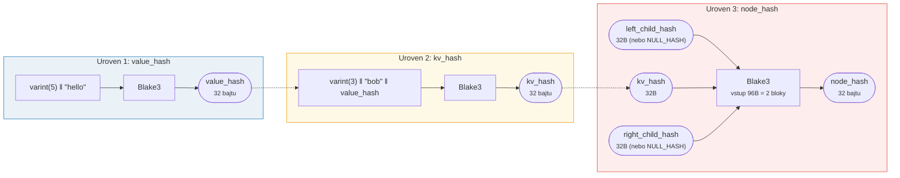
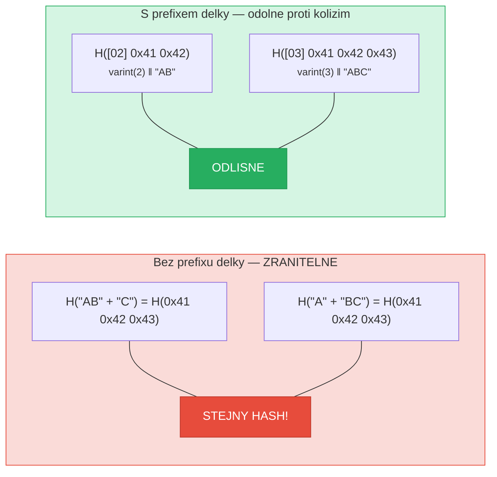
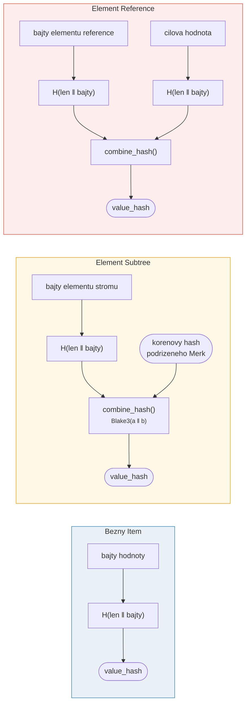

# Hashovani -- Kryptograficka integrita

Kazdy uzel ve stromu Merk je zahasovan, aby se vyprodukovalo **korenove hashe** (root hash)
-- jedina 32-bajtova hodnota, ktera autentizuje cely strom. Jakakoliv zmena
jakehokoli klice, hodnoty nebo strukturalniho vztahu vyprodukovuje odlisny
korenovy hash.

## Triurovnova hierarchie hashu

Merk pouziva triurovnove hashovaci schema, od nejvnitrnejsiho k nejvnejsimu:

Priklad: klic = `"bob"` (3 bajty), hodnota = `"hello"` (5 bajtu):



> KOREN stromu = `node_hash` korenoveho uzlu -- autentizuje **kazdy** klic, hodnotu a strukturalni vztah. Chybejici potomci pouzivaji `NULL_HASH = [0x00; 32]`.

### Uroven 1: value_hash

```rust
// merk/src/tree/hash.rs
pub fn value_hash(value: &[u8]) -> CostContext<CryptoHash> {
    let mut hasher = blake3::Hasher::new();
    let val_length = value.len().encode_var_vec();  // Kodovani varint
    hasher.update(val_length.as_slice());
    hasher.update(value);
    // ...
}
```

Delka hodnoty je **kodovana jako varint** a predrazena. To je klicove pro
odolnost proti kolizim -- bez toho by `H("AB" || "C")` bylo rovno `H("A" || "BC")`.

### Uroven 2: kv_hash

```rust
pub fn kv_hash(key: &[u8], value: &[u8]) -> CostContext<CryptoHash> {
    let mut hasher = blake3::Hasher::new();
    let key_length = key.len().encode_var_vec();
    hasher.update(key_length.as_slice());
    hasher.update(key);
    let vh = value_hash(value);
    hasher.update(vh.as_slice());  // Vnoreny hash
    // ...
}
```

To vaze klic k hodnote. Pro overovani dukazu existuje take varianta,
ktera prijima predvypocteny value_hash:

```rust
pub fn kv_digest_to_kv_hash(key: &[u8], value_hash: &CryptoHash) -> CostContext<CryptoHash>
```

To se pouziva, kdyz overovatel jiz ma value_hash (napr. pro podstromy,
kde je value_hash kombinovany hash).

### Uroven 3: node_hash

```rust
pub fn node_hash(
    kv: &CryptoHash,
    left: &CryptoHash,
    right: &CryptoHash,
) -> CostContext<CryptoHash> {
    let mut hasher = blake3::Hasher::new();
    hasher.update(kv);       // 32 bajtu
    hasher.update(left);     // 32 bajtu
    hasher.update(right);    // 32 bajtu — celkem 96 bajtu
    // Vzdy presne 2 hashovaci operace (96 bajtu / 64-bajtovy blok = 2)
}
```

Pokud potomek chybi, jeho hash je **NULL_HASH** -- 32 nulovych bajtu:

```rust
pub const NULL_HASH: CryptoHash = [0; HASH_LENGTH];  // [0u8; 32]
```

## Blake3 jako hashovaci funkce

GroveDB pouziva **Blake3** pro veskere hashovani. Klicove vlastnosti:

- **256-bitovy vystup** (32 bajtu)
- **Velikost bloku**: 64 bajtu
- **Rychlost**: priblizne 3x rychlejsi nez SHA-256 na modernim hardwaru
- **Streamovani**: Muze inkrementalne prijimat data

Naklady hashovaci operace se vypocitaji na zaklade poctu zpracovanych
64-bajtovych bloku:

```rust
let hashes = 1 + (hasher.count() - 1) / 64;  // Pocet hashovacich operaci
```

## Kodovani predpon delky pro odolnost proti kolizim

Kazdy vstup s promenlivou delkou je opatren prefixem jeho delky pomoci
**kodovani varint**:



> **Vstup value_hash**: `[varint(value.len)] [bajty hodnoty]`
> **Vstup kv_hash**: `[varint(key.len)] [bajty klice] [value_hash: 32 bajtu]`

Bez prefixu delky by utocnik mohl vytvorit ruzne pary klicu a hodnot, ktere
se zahasuji na stejny digest. Prefix delky to cini kryptograficky
neproveditelnym.

## Kombinovane hashovani pro specialni elementy

Pro **podstromy** a **reference** neni `value_hash` jednodusse `H(value)`.
Misto toho je to **kombinovany hash**, ktery vaze element k jeho cili:



> **Podstrom:** vaze korenovy hash podrizeneho Merk do rodice. **Reference:** vaze jak cestu reference, TAK i cilovou hodnotu. Zmena kterehokoliv zmeni korenovy hash.

Funkce `combine_hash`:

```rust
pub fn combine_hash(hash_one: &CryptoHash, hash_two: &CryptoHash) -> CostContext<CryptoHash> {
    let mut hasher = blake3::Hasher::new();
    hasher.update(hash_one);   // 32 bajtu
    hasher.update(hash_two);   // 32 bajtu — celkem 64 bajtu, presne 1 hashovaci operace
    // ...
}
```

Prave toto umoznuje GroveDB autentizovat celou hierarchii prostrednictvim
jedineho korenoveho hashe -- value_hash kazdeho rodicovskeho stromu pro element
podstromu zahrnuje korenovy hash podrizeneho stromu.

## Agregatni hashovani pro ProvableCountTree

Uzly `ProvableCountTree` zahrnovaji agregatni pocet do hashe uzlu:

```rust
pub fn node_hash_with_count(
    kv: &CryptoHash,
    left: &CryptoHash,
    right: &CryptoHash,
    count: u64,
) -> CostContext<CryptoHash> {
    let mut hasher = blake3::Hasher::new();
    hasher.update(kv);                        // 32 bajtu
    hasher.update(left);                      // 32 bajtu
    hasher.update(right);                     // 32 bajtu
    hasher.update(&count.to_be_bytes());      // 8 bajtu — celkem 104 bajtu
    // Stale presne 2 hashovaci operace (104 < 128 = 2 * 64)
}
```

To znamena, ze dukaz poctu nevyzaduje odhaleni skutecnych dat -- pocet je
zapecen do kryptografickeho zavazku.

---
