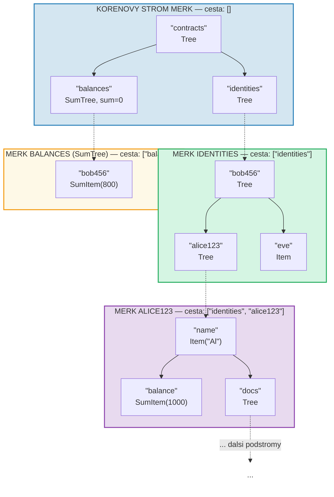
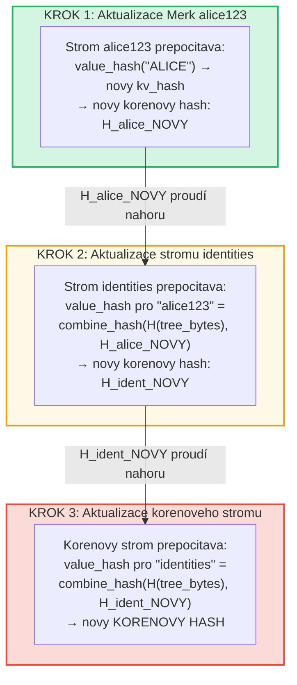
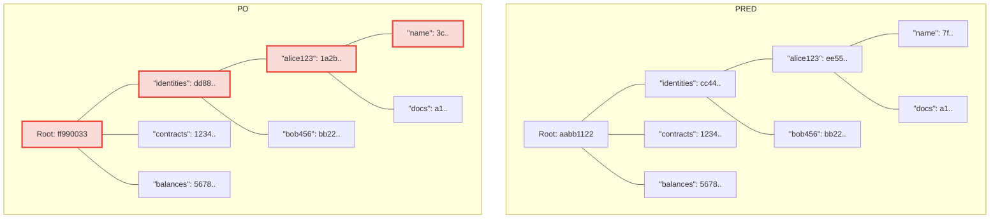
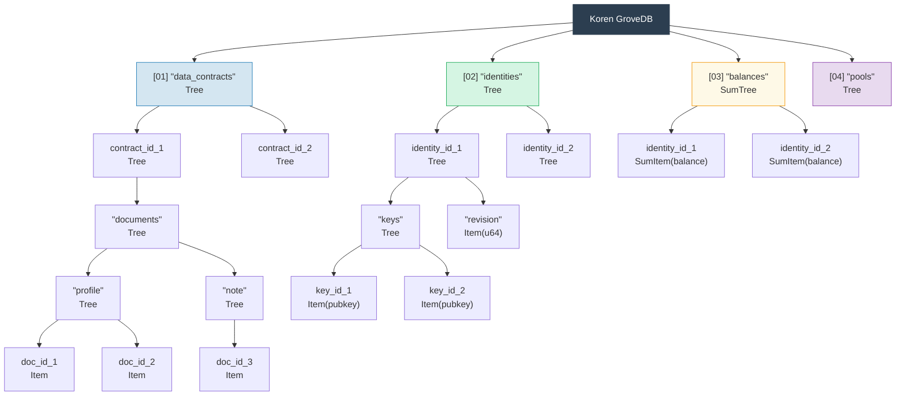

# Hierarchicky haj -- Strom stromu

## Jak se podstromy vnoreji do rodicovskych stromu

Definujici vlastnosti GroveDB je, ze strom Merk muze obsahovat elementy, ktere
jsou samy o sobe stromy Merk. Toto vytvari **hierarchicky jmenny prostor**:



> Kazdy barevny ramecek je samostatny strom Merk. Prerusovane sipky predstavuji portalove odkazy z elementu Tree do jejich podrizenych stromu Merk. Cesta ke kazdemu Merk je zobrazena v jeho popisku.

## System adresovani cestou

Kazdy element v GroveDB je adresovan **cestou** -- sekvenci retezcu bajtu,
ktera naviguje od korene pres podstromy k cilovemu klici:

```text
    Cesta: ["identities", "alice123", "name"]

    Krok 1: V korenovem stromu vyhledejte "identities" → element Tree
    Krok 2: Otevrete podstrom identities, vyhledejte "alice123" → element Tree
    Krok 3: Otevrete podstrom alice123, vyhledejte "name" → Item("Alice")
```

Cesty jsou reprezentovany jako `Vec<Vec<u8>>` nebo pomoci typu `SubtreePath`
pro efektivni manipulaci bez alokace:

```rust
// Cesta k elementu (vsechny segmenty krome posledniho)
let path: &[&[u8]] = &[b"identities", b"alice123"];
// Klic v koncovem podstromu
let key: &[u8] = b"name";
```

## Generovani prefixu Blake3 pro izolaci uloziste

Kazdy podstrom v GroveDB dostava svuj vlastni **izolovany jmenny prostor uloziste**
v RocksDB. Jmenny prostor je urcen hashovanim cesty pomoci Blake3:

```rust
pub type SubtreePrefix = [u8; 32];

// Prefix je vypocten hashovanim segmentu cesty
// storage/src/rocksdb_storage/storage.rs
```

Napriklad:

```text
    Cesta: ["identities", "alice123"]
    Prefix: Blake3(["identities", "alice123"]) = [0xab, 0x3f, ...]  (32 bajtu)

    V RocksDB jsou klice pro tento podstrom ulozeny jako:
    [prefix: 32 bajtu][puvodni_klic]

    Takze "name" v tomto podstromu se stava:
    [0xab, 0x3f, ...][0x6e, 0x61, 0x6d, 0x65]  ("name")
```

Toto zajistuje:
- Zadne kolize klicu mezi podstromy (32-bajtovy prefix = 256-bitova izolace)
- Efektivni vypocet prefixu (jediny hash Blake3 pres bajty cesty)
- Data podstromu jsou umistena spolecne v RocksDB pro efektivitu cache

## Propagace korenoveho hashe skrze hierarchii

Kdyz se hodnota zmeni hluboko v haji, zmena se musi **propagovat nahoru** pro
aktualizaci korenoveho hashe:

```text
    Zmena: Aktualizace "name" na "ALICE" v identities/alice123/

    Krok 1: Aktualizace hodnoty ve stromu Merk alice123
            → strom alice123 dostava novy korenovy hash: H_alice_novy

    Krok 2: Aktualizace elementu "alice123" ve stromu identities
            → value_hash stromu identities pro "alice123" =
              combine_hash(H(tree_element_bytes), H_alice_novy)
            → strom identities dostava novy korenovy hash: H_ident_novy

    Krok 3: Aktualizace elementu "identities" v korenovem stromu
            → value_hash korenoveho stromu pro "identities" =
              combine_hash(H(tree_element_bytes), H_ident_novy)
            → KORENOVY HASH se meni
```



**Pred vs. po** -- zmenene uzly oznaceny cervenou:



> Pouze uzly na ceste od zmenene hodnoty nahoru ke koreni jsou prepocitany. Sourozenci a ostatni vetve zustavaji nezmeneni.

Propagace je implementovana funkci `propagate_changes_with_transaction`, ktera
prochazi cestu od zmeneneho podstromu ke koreni a aktualizuje hash elementu
kazdeho rodice na ceste.

## Priklad viceurovnove struktury haje

Zde je uplny priklad ukazujici, jak Dash Platform strukturuje svuj stav:



Kazdy ramecek je samostatny strom Merk, autentizovany az po jediny korenovy hash,
na kterem se validatori shoduji.

---
