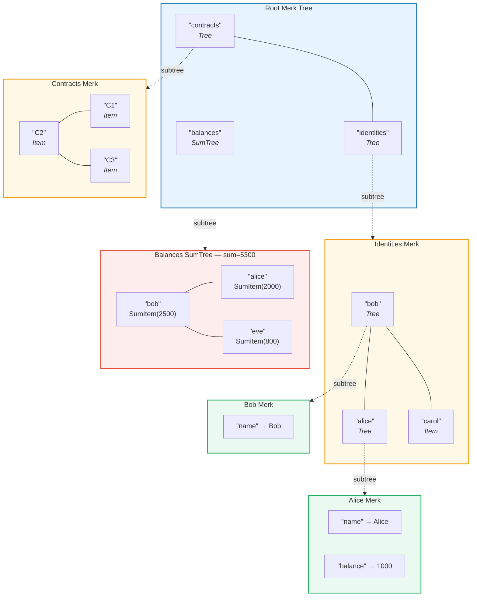
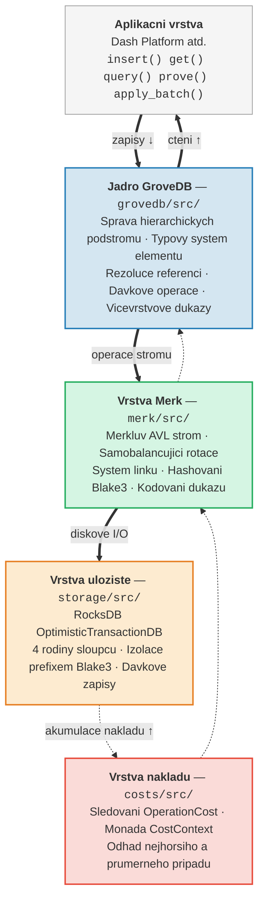

# Uvod -- Co je GroveDB?

## Zakladni myslenka

GroveDB je **hierarchicka autentizovana datova struktura** -- v podstate *haj*
(strom stromu) postaveny na Merklovych AVL stromech. Kazdy uzel v databazi je
soucasti kryptograficky autentizovaneho stromu a kazdy strom muze obsahovat
dalsi stromy jako potomky, cimz se vytvari hluboka hierarchie overitelneho stavu.

> Kazdy barevny ramecek je **samostatny strom Merk**. Prerusovane sipky znazornuji vztah podstromu -- element Tree v rodicovskem stromu obsahuje korenovy klic podrizeneho stromu Merk.

V tradicni databazi byste data ulozili do ploche uloziste klicu a hodnot
s jednim Merklovym stromem navrchu pro autentizaci. GroveDB pouziva jiny pristup:
vnoruje Merklovy stromy do Merklovych stromu. To vam dava:

1. **Efektivni sekundarni indexy** -- dotaz podle libovolne cesty, nejen primarniho klice
2. **Kompaktni kryptograficke dukazy (proof)** -- prokazani existence (nebo neexistence) jakychkoli dat
3. **Agregovana data** -- stromy mohou automaticky scitat, pocitat nebo jinak agregovat sve potomky
4. **Atomicke operace napric stromy** -- davkove operace zahrnuji vice podstromu

## Proc GroveDB existuje

GroveDB bylo navrzeno pro **Dash Platform**, decentralizovanou aplikacni platformu,
kde kazdy kousek stavu musi byt:

- **Autentizovany**: Libovolny uzel muze prokazat libovolny udaj lehkemu klientovi
- **Deterministicky**: Kazdy uzel vypocita presne stejny korenovy hash (root hash)
- **Efektivni**: Operace musi byt dokonceny v ramci casovych omezeni bloku
- **Dotazovatelny**: Aplikace potrebuji bohate dotazy, nejen vyhledavani podle klicu

Tradicni pristupy nestaci:

| Pristup | Problem |
|----------|---------|
| Prosty Merkluv strom | Podporuje pouze vyhledavani klicu, zadne rozsahove dotazy |
| Ethereum MPT | Drahe prevazovani, velke dukazy |
| Ploche klice-hodnoty + jeden strom | Zadne hierarchicke dotazy, jeden dukaz pokryva vse |
| B-strom | Neni prirozene merkleizovany, slozita autentizace |

GroveDB tyto problemy resi kombinaci **osvedcenych zaruk vyvazovani AVL stromu**
s **hierarchickym vnorenim** a **bohatym typovym systemem elementu**.

## Prehled architektury

GroveDB je organizovano do odlisnych vrstev, kazda s jasnou odpovednosti:

Data prochazi temito vrstvami **smerem dolu** pri zapisech a **smerem nahoru** pri
ctenich. Kazda operace akumuluje naklady pri pruchodu zasobnikem, coz umoznuje
presne uctovani zdroju.

---
