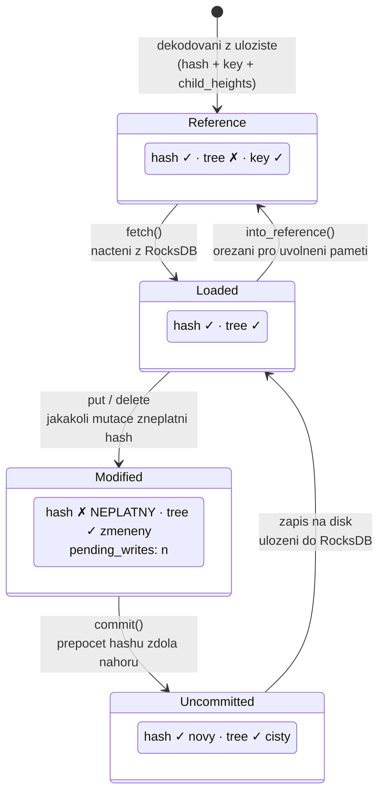
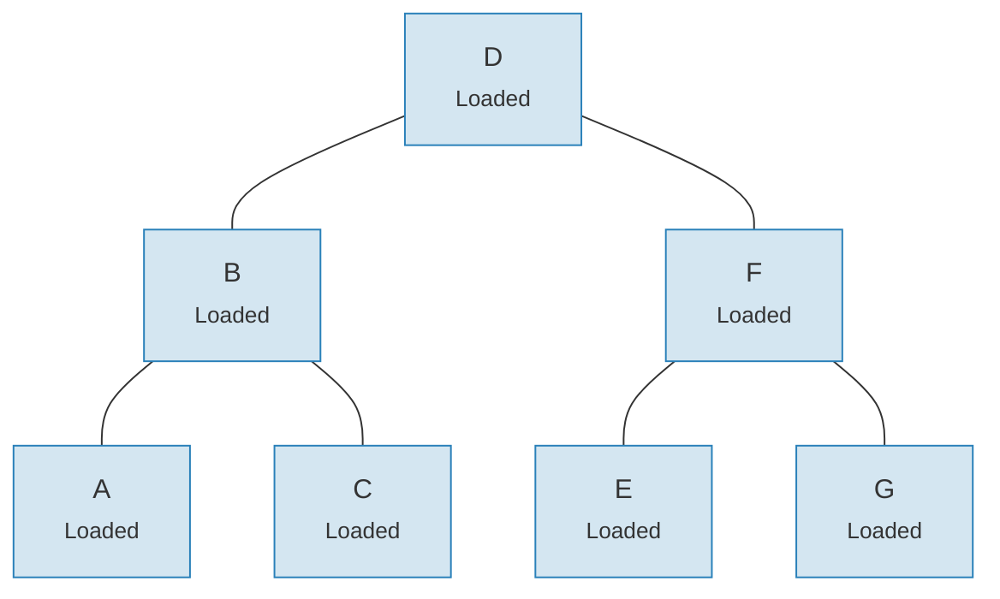
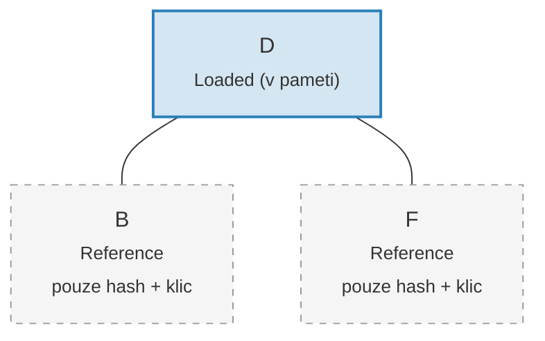

# System linku -- Architektura lineho nacitani

Nahrani celeho stromu Merk do pameti by bylo neprimerane nakladne pro velke
stromy. System linku (Link) to resi tim, ze reprezentuje pripojeni potomku
ve ctyrech moznych stavech, coz umoznuje **line nacitani** (lazy loading) --
potomci jsou nacteni z uloziste az kdyz jsou skutecne potreba.

## Ctyri stavy linku

```rust
// merk/src/tree/link.rs
pub enum Link {
    Reference {                    // Orezan: pouze metadata, zadny strom v pameti
        hash: CryptoHash,
        child_heights: (u8, u8),
        key: Vec<u8>,
        aggregate_data: AggregateData,
    },
    Modified {                     // Nedavno zmenen, hash jeste neni vypocten
        pending_writes: usize,
        child_heights: (u8, u8),
        tree: TreeNode,
    },
    Uncommitted {                  // Zahasovan, ale jeste neulozeny do uloziste
        hash: CryptoHash,
        child_heights: (u8, u8),
        tree: TreeNode,
        aggregate_data: AggregateData,
    },
    Loaded {                       // Plne nacteny z uloziste
        hash: CryptoHash,
        child_heights: (u8, u8),
        tree: TreeNode,
        aggregate_data: AggregateData,
    },
}
```

## Diagram prechodu stavu



## Co kazdy stav uklada

| Stav | Hash? | Strom v pameti? | Ucel |
|------|-------|-----------------|------|
| **Reference** | Ano | Ne | Kompaktni reprezentace na disku. Uklada pouze klic, hash, vysky potomku a agregovana data. |
| **Modified** | Ne | Ano | Po jakekoli mutaci. Sleduje pocet `pending_writes` pro optimalizaci davek. |
| **Uncommitted** | Ano | Ano | Po vypoctu hashe, ale pred zapisem do uloziste. Mezistav behem commitu. |
| **Loaded** | Ano | Ano | Plne materializovany. Pripraven pro cteni nebo dalsi modifikace. |

Pole `pending_writes` v `Modified` je pozoruhodne:

```rust
// Vypocitano jako: 1 + pending_writes_leveho_potomka + pending_writes_praveho_potomka
pending_writes: 1 + tree.child_pending_writes(true)
                  + tree.child_pending_writes(false),
```

Tento pocet pomaha fazi commitu rozhodnout, jak usporadat zapisy pro
optimalni vykon.

## Vzor zpetneho volani Fetch

System linku pouziva **trait Fetch** pro abstrakci nad zpusobem nacitani potomku:

```rust
pub trait Fetch {
    fn fetch(
        &self,
        link: &Link,
        value_defined_cost_fn: Option<&impl Fn(&[u8], &GroveVersion) -> Option<ValueDefinedCostType>>,
        grove_version: &GroveVersion,
    ) -> CostResult<TreeNode, Error>;
}
```

Ruzne implementace Fetch slouzi ruznym ucelum:

- **StorageFetch**: Nacitani z RocksDB (normalni cesta)
- **PanicSource**: Pouzivano v testech, kde by nacitani nemelo nikdy nastat
- **MockSource**: Vraci kontrolovana testovaci data

Tento vzor umoznuje operacim na stromu byt **nezavisle na ulozisti** -- stejna
logika vyvazovani a mutaci funguje bez ohledu na to, odkud data pochazeji.

## Vzor Walker

`Walker` obaluje `TreeNode` zdrojem `Fetch` a poskytuje bezpecny pruchod
stromem s automatickym linym nacitanim (`merk/src/tree/walk/mod.rs`):

```rust
pub struct Walker<S: Fetch + Sized + Clone> {
    tree: Owner<TreeNode>,
    source: S,
}
```

Walker poskytuje tri klicove operace:

**walk()** -- Odpojeni potomka, transformace a opetovne pripojeni:

```rust
pub fn walk<F, T>(self, left: bool, f: F, ...) -> CostResult<Self, Error>
where
    F: FnOnce(Option<Self>) -> CostResult<Option<T>, Error>,
    T: Into<TreeNode>,
```

**detach()** -- Odstraneni potomka, v pripade potreby s nactenim z uloziste:

```rust
pub fn detach(self, left: bool, ...) -> CostResult<(Self, Option<Self>), Error>
```

Pokud je potomek `Link::Reference` (orezany), detach zavola `fetch()` pro jeho
nacteni. Pokud je potomek jiz v pameti (`Modified`, `Uncommitted`, `Loaded`),
jednodusse prevezme vlastnictvi.

**attach()** -- Pripojeni potomka k rodici:

```rust
pub fn attach(self, left: bool, maybe_child: Option<Self>) -> Self
```

Pripojeni vzdy vytvori `Link::Modified`, protoze vztah rodic-potomek
se zmenil.

## Pametova efektivita prostrednictvim orezavani

Po commitnuti zmen muze strom **orezat** nactene podstromy zpet na
`Link::Reference`, cimz se uvolni pamet pri zachovani hashe potrebneho pro
generovani dukazu:

**Pred orezanim** -- vsech 7 uzlu v pameti:



**Po orezani** -- pouze koren v pameti, potomci jsou `Link::Reference` (pouze hash + klic):



> **Link::Loaded** drzi `hash + child_heights + tree (TreeNode)`. **Link::Reference** drzi pouze `hash + child_heights + key` -- TreeNode je uvolnen z pameti.

Transformace je jednoducha:

```rust
pub fn into_reference(self) -> Link {
    Link::Reference {
        hash: self.hash(),
        child_heights: self.child_heights(),
        key: self.key().to_vec(),
        aggregate_data: self.aggregate_data(),
    }
}
```

To je klicove pro udrzeni ohraniceneho vyuziti pameti ve velkych stromech --
pouze uzly, ke kterym se aktivne pristupuje, musi byt v pameti.

---
