# Strom Merk -- Merkluv AVL strom

Strom Merk je zakladnim stavebnim kamenem GroveDB. Kazdy podstrom v haji
je strom Merk -- samobalancujici binarni vyhledavaci strom, kde je kazdy uzel
kryptograficky zahasovan, coz produkuje jediny korenovy hash (root hash),
ktery autentizuje veskery obsah stromu.

## Co je uzel Merk?

Na rozdil od mnoha implementaci Merklovych stromu, kde data ziji pouze v listech,
ve stromu Merk **kazdy uzel uklada par klic-hodnota**. To znamena, ze neexistuji
"prazdne" vnitrni uzly -- strom je zaroven vyhledavaci strukturou i ulozstem dat.

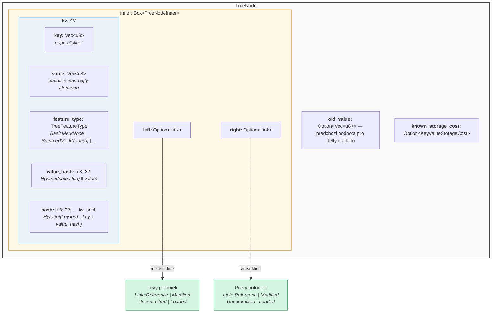

V kodu (`merk/src/tree/mod.rs`):

```rust
pub struct TreeNode {
    pub(crate) inner: Box<TreeNodeInner>,
    pub(crate) old_value: Option<Vec<u8>>,        // Predchozi hodnota pro sledovani nakladu
    pub(crate) known_storage_cost: Option<KeyValueStorageCost>,
}

pub struct TreeNodeInner {
    pub(crate) left: Option<Link>,    // Levy potomek (mensi klice)
    pub(crate) right: Option<Link>,   // Pravy potomek (vetsi klice)
    pub(crate) kv: KV,               // Datovy obsah klice a hodnoty
}
```

`Box<TreeNodeInner>` drzi uzel na halde, coz je nezbytne, protoze odkazy na potomky
mohou rekurzivne obsahovat cele instance `TreeNode`.

## Struktura KV

Struktura `KV` drzi surova data i jejich kryptograficke otiske
(`merk/src/tree/kv.rs`):

```rust
pub struct KV {
    pub(super) key: Vec<u8>,                        // Vyhledavaci klic
    pub(super) value: Vec<u8>,                      // Ulozena hodnota
    pub(super) feature_type: TreeFeatureType,       // Agregacni chovani
    pub(crate) value_defined_cost: Option<ValueDefinedCostType>,
    pub(super) hash: CryptoHash,                    // kv_hash
    pub(super) value_hash: CryptoHash,              // H(value)
}
```

Dva dulezite body:

1. **Klice se neukladaji na disk jako soucast zakodovaneho uzlu.** Ukladaji se
   jako klic v RocksDB. Kdyz je uzel dekodovan z uloziste, klic je vlozen
   zvenku. Timto se zabranuje duplicite bajtu klice.

2. **Udrzuji se dve hashovaci pole.** `value_hash` je `H(value)` a
   `hash` (kv_hash) je `H(key, value_hash)`. Udrzovani obou umoznuje systemu
   dukazu zvolit, kolik informaci odhalit.

## Polobalancovana povaha -- Jak AVL "kymaci"

Strom Merk je **strom AVL** -- klasicky samobalancujici binarni vyhledavaci strom
vynalezeny Adelsonem-Velskym a Landisem. Klicovy invariant je:

> Pro kazdy uzel je rozdil vysek mezi jeho levym a pravym podstromem
> nejvyse 1.

To se vyjadruje jako **faktor rovnovahy** (balance factor):

```text
balance_factor = prava_vyska - leva_vyska
```

Platne hodnoty: **{-1, 0, 1}**

```rust
// merk/src/tree/mod.rs
pub const fn balance_factor(&self) -> i8 {
    let left_height = self.child_height(true) as i8;
    let right_height = self.child_height(false) as i8;
    right_height - left_height
}
```

Ale zde je subtilni bod: zatimco kazdy jednotlivy uzel se muze naklonit pouze
o jednu uroven, tyto naklony se mohou **kumulovat** skrze strom. Proto ho nazyvame
"polobalancovany" -- strom neni dokonale vyvazeny jako uplny binarni strom.

Uvazujme strom s 10 uzly. Dokonale vyvazeny strom by mel vysku 4
(ceil(log2(10+1))). Ale AVL strom muze mit vysku 5:

**Dokonale vyvazeny (vyska 4)** -- kazda uroven je plne obsazena:

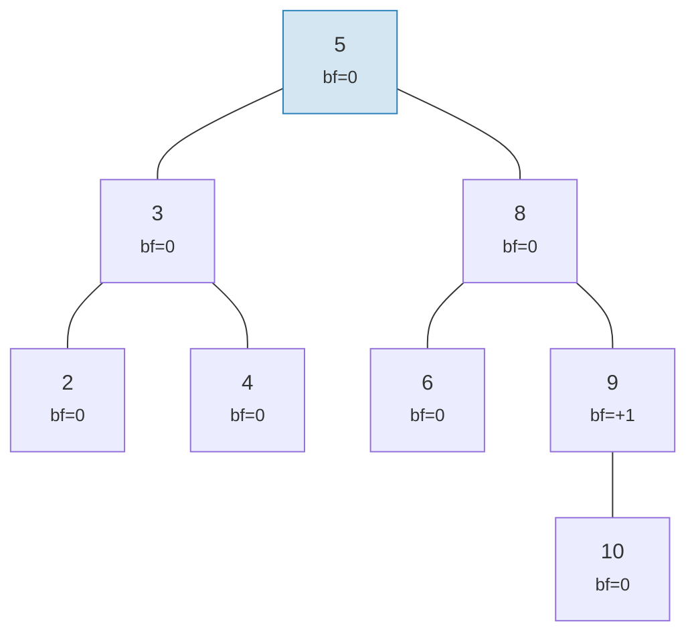

**Platne AVL "kymitnuti" (vyska 5)** -- kazdy uzel se naklani maximalne o 1, ale kumuluje se to:

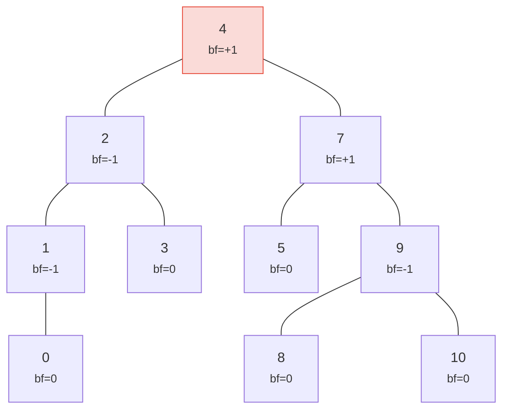

> Vyska 5 oproti dokonalym 4 -- to je to "kymitnuti". Nejhorsi pripad: h <= 1,44 * log2(n+2).

Oba stromy jsou platne stromy AVL! Nejhorsi pripad vysky stromu AVL je:

```text
h <= 1,4404 * log2(n + 2) - 0,3277
```

Takze pro **n = 1 000 000** uzlu:
- Dokonale vyvazeni: vyska 20
- Nejhorsi pripad AVL: vyska priblizne 29

Tato priblizne 44% rezie je cenou za jednoducha rotacni pravidla AVL. V praxi
nahodne vlozeni produkuji stromy mnohem blize dokonalemu vyvazeni.

Takto vypadaji platne a neplatne stromy:

**PLATNY** -- vsechny faktory rovnovahy v {-1, 0, +1}:

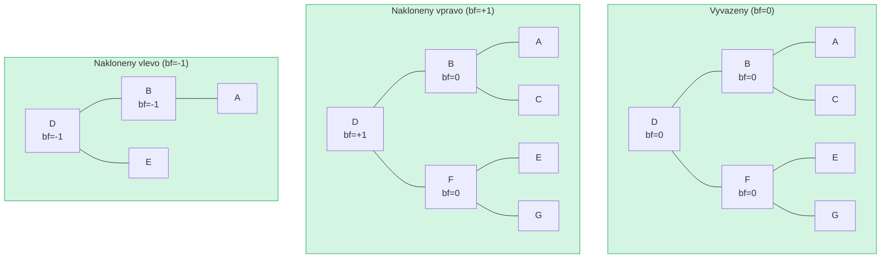

**NEPLATNY** -- faktor rovnovahy = +2 (potrebuje rotaci!):

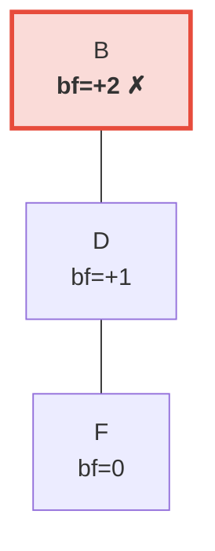

> Pravy podstrom je o 2 urovne vyssi nez levy (ktery je prazdny). To spousti **levou rotaci** pro obnoveni invariantu AVL.

## Rotace -- Obnoveni rovnovahy

Kdyz vlozeni nebo smazani zpusobi, ze faktor rovnovahy dosahne +/-2, strom se
musi **rotovat** pro obnoveni invariantu AVL. Existuji ctyri pripady, redukovatelne
na dve zakladni operace.

### Jednoducha leva rotace

Pouziva se, kdyz je uzel **tezky vpravo** (bf = +2) a jeho pravy potomek je
**tezky vpravo nebo vyvazeny** (bf >= 0):

**Pred** (bf=+2):

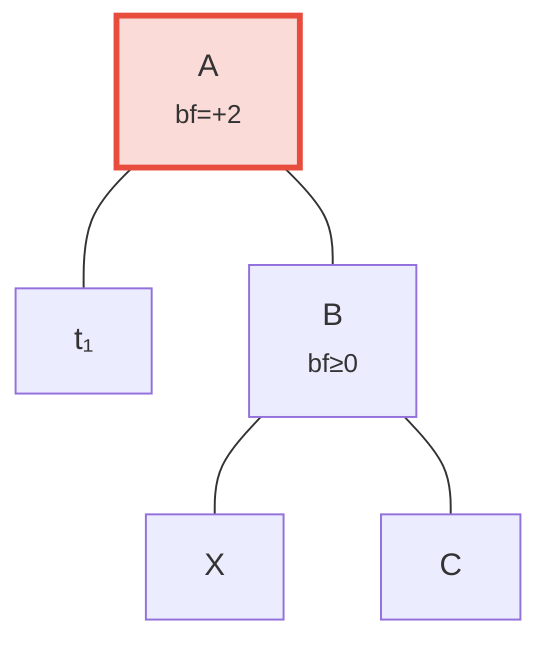

**Po** leve rotaci -- B povyseno na koren:

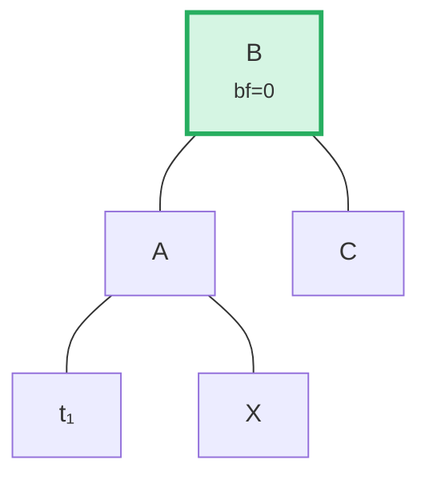

> **Kroky:** (1) Odpojit B od A. (2) Odpojit X (levy potomek B). (3) Pripojit X jako praveho potomka A. (4) Pripojit A jako leveho potomka B. Podstrom zakoreneny v B je nyni vyvazeny.

V kodu (`merk/src/tree/ops.rs`):

```rust
fn rotate<V>(self, left: bool, ...) -> CostResult<Self, Error> {
    // Odpojit potomka na tezke strane
    let (tree, child) = self.detach_expect(left, ...);
    // Odpojit vnuka z opacne strany potomka
    let (child, maybe_grandchild) = child.detach(!left, ...);

    // Pripojit vnuka k puvodnimu koreni
    tree.attach(left, maybe_grandchild)
        .maybe_balance(...)
        .flat_map_ok(|tree| {
            // Pripojit puvodni koren jako potomka povyseneho uzlu
            child.attach(!left, Some(tree))
                .maybe_balance(...)
        })
}
```

Vsimnete si, ze `maybe_balance` je volano rekurzivne -- samotna rotace muze
vytvorit nove nevyvazenosti, ktere vyzaduji dalsi korekci.

### Dvojita rotace (levo-prava)

Pouziva se, kdyz je uzel **tezky vlevo** (bf = -2), ale jeho levy potomek je
**tezky vpravo** (bf > 0). Jednoducha rotace by to nevyresila:

**Krok 0: Pred** -- C je tezky vlevo (bf=-2), ale jeho levy potomek A se naklani vpravo (bf=+1). Jednoducha rotace to nevyresi:

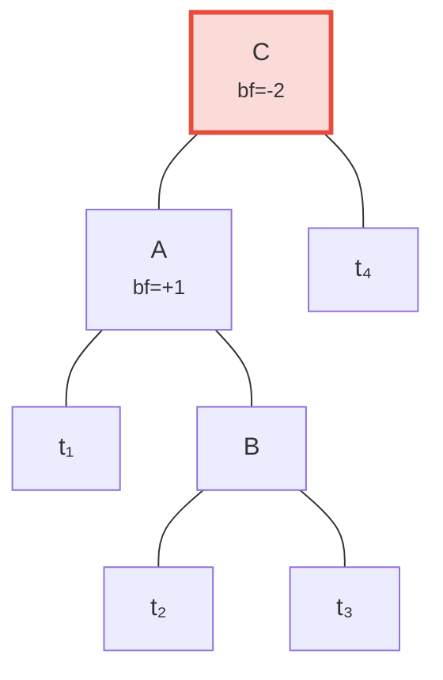

**Krok 1: Leva rotace potomka A** -- nyni se C i B naklaneji vlevo, opravitelne jednoduchou rotaci:

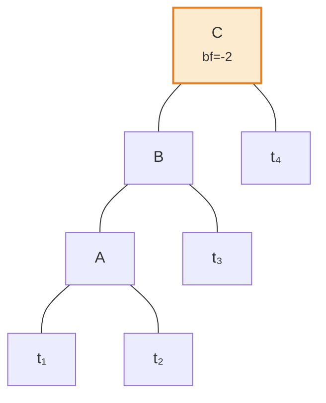

**Krok 2: Prava rotace korene C** -- vyvazeno!

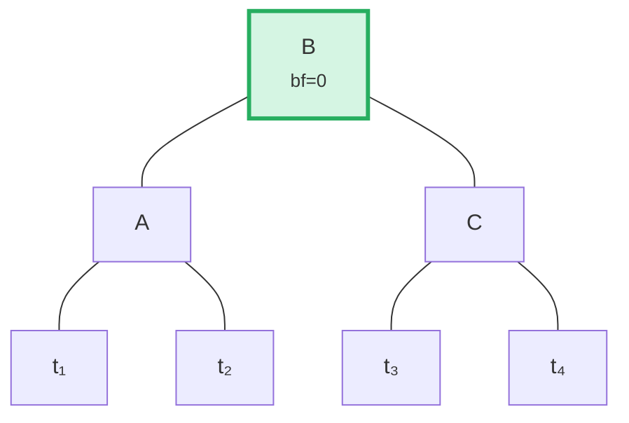

Algoritmus detekuje tento pripad porovnanim smeru naklonu rodice s faktorem
rovnovahy potomka:

```rust
fn maybe_balance<V>(self, ...) -> CostResult<Self, Error> {
    let balance_factor = self.balance_factor();
    if balance_factor.abs() <= 1 {
        return Ok(self);  // Jiz vyvazeno
    }

    let left = balance_factor < 0;  // true pokud tezky vlevo

    // Dvojita rotace je potreba, kdyz se potomek naklani opacne nez rodic
    let tree = if left == (self.tree().link(left).unwrap().balance_factor() > 0) {
        // Prvni rotace: rotace potomka v opacnem smeru
        self.walk_expect(left, |child|
            child.rotate(!left, ...).map_ok(Some), ...
        )
    } else {
        self
    };

    // Druha (nebo jedina) rotace
    tree.rotate(left, ...)
}
```

## Davkove operace -- Sestaveni a aplikace

Namisto vkladani elementu po jednom, Merk podporuje davkove operace, ktere
aplikuji vice zmen v jednom pruchodu. To je klicove pro efektivitu: davka
N operaci na stromu M elementu zabere **O((M + N) log(M + N))** casu
oproti O(N log M) pro sekvencni vlozeni.

### Typ MerkBatch

```rust
type MerkBatch<K> = [(K, Op)];

enum Op {
    Put(Vec<u8>, TreeFeatureType),  // Vlozeni nebo aktualizace s hodnotou a typem vlastnosti
    PutWithSpecializedCost(...),     // Vlozeni s preddefinovanymi naklady
    PutCombinedReference(...),       // Vlozeni reference s kombinovanym hashem
    Replace(Vec<u8>, TreeFeatureType),
    Patch { .. },                    // Castecna aktualizace hodnoty
    Delete,                          // Smazani klice
    DeleteLayered,                   // Smazani s vrstvovanymi naklady
    DeleteMaybeSpecialized,          // Smazani s volitelnymi specializovanymi naklady
}
```

### Strategie 1: build() -- Sestaveni od nuly

Kdyz je strom prazdny, `build()` konstruuje vyvazeny strom primo ze
serazene davky pomoci algoritmu **rozdeleni medianem**:

Vstupni davka (serazena): `[A, B, C, D, E, F, G]` -- vyberte prostredni (D) jako koren, rekurzivne na kazdou polovinu:

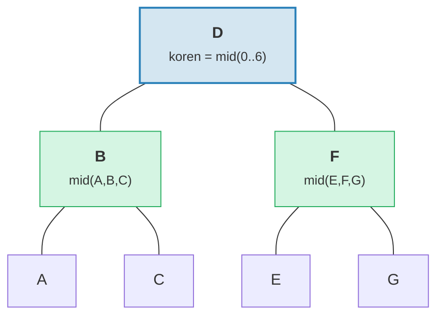

> Vysledek: dokonale vyvazeny strom s vyskou = 3 = ceil(log2(7)).

```rust
fn build(batch: &MerkBatch<K>, ...) -> CostResult<Option<TreeNode>, Error> {
    let mid_index = batch.len() / 2;
    let (mid_key, mid_op) = &batch[mid_index];

    // Vytvoreni korenoveho uzlu z prostredniho elementu
    let mid_tree = TreeNode::new(mid_key.clone(), value.clone(), None, feature_type)?;

    // Rekurzivni sestaveni leveho a praveho podstromu
    let left = Self::build(&batch[..mid_index], ...);
    let right = Self::build(&batch[mid_index + 1..], ...);

    // Pripojeni potomku
    mid_tree.attach(true, left).attach(false, right)
}
```

To produkuje strom s vyskou ceil(log2(n)) -- dokonale vyvazeny.

### Strategie 2: apply_sorted() -- Slouceni do existujiciho stromu

Kdyz strom jiz obsahuje data, `apply_sorted()` pouziva **binarni vyhledavani**
pro nalezeni mista, kam kazda operace davky patri, a pote rekurzivne aplikuje
operace na levy a pravy podstrom:

Existujici strom s davkou `[(B, Put), (F, Delete)]`:

Binarni vyhledavani: B < D (jdi vlevo), F > D (jdi vpravo).

**Pred:**
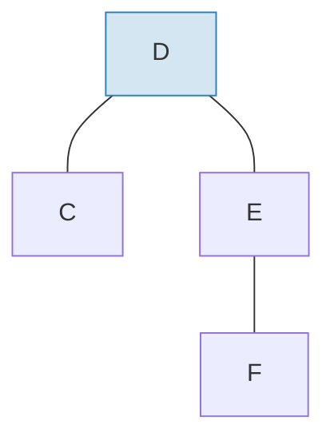

**Po** aplikaci davky a prevyvazeni:
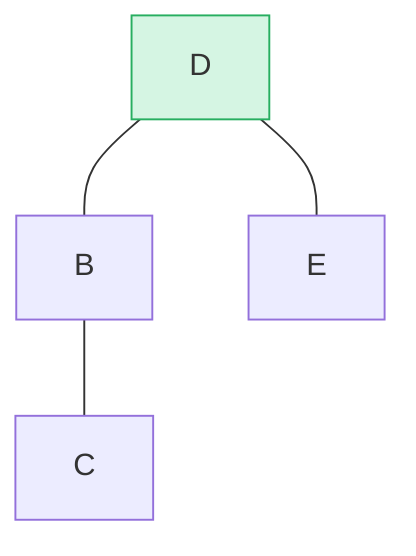

> B vlozeno jako levy podstrom, F smazano z praveho podstromu. `maybe_balance()` potvrzuje bf(D) = 0.

```rust
fn apply_sorted(self, batch: &MerkBatch<K>, ...) -> CostResult<...> {
    let search = batch.binary_search_by(|(key, _)| key.cmp(self.tree().key()));

    match search {
        Ok(index) => {
            // Klic odpovida tomuto uzlu — aplikovat operaci primo
            // (Put nahradi hodnotu, Delete smaze uzel)
        }
        Err(mid) => {
            // Klic nenalezen — mid je bod rozdeleni
            // Rekurze na left_batch[..mid] a right_batch[mid..]
        }
    }

    self.recurse(batch, mid, exclusive, ...)
}
```

Metoda `recurse` rozdeli davku a projde vlevo a vpravo:

```rust
fn recurse(self, batch: &MerkBatch<K>, mid: usize, ...) {
    let left_batch = &batch[..mid];
    let right_batch = &batch[mid..];  // nebo mid+1 pokud exkluzivni

    // Aplikovat levou davku na levy podstrom
    let tree = self.walk(true, |maybe_left| {
        Self::apply_to(maybe_left, left_batch, ...)
    });

    // Aplikovat pravou davku na pravy podstrom
    let tree = tree.walk(false, |maybe_right| {
        Self::apply_to(maybe_right, right_batch, ...)
    });

    // Prevyvazit po modifikacich
    tree.maybe_balance(...)
}
```

### Odstraneni uzlu

Pri mazani uzlu se dvema potomky Merk povysi **krajni uzel** z vyssiho podstromu.
To minimalizuje pravdepodobnost dalsich rotaci:

**Pred** -- mazani D (ma dva potomky, vyska praveho podstromu >= leveho):

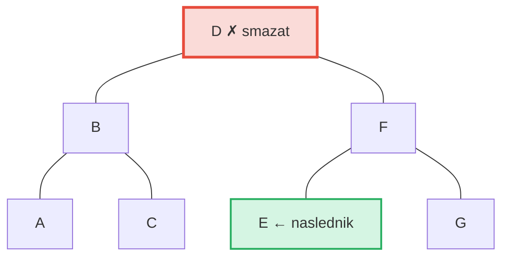

**Po** -- E (nejlevejsi v pravem podstromu = naslednik v poradi) povysen na pozici D:

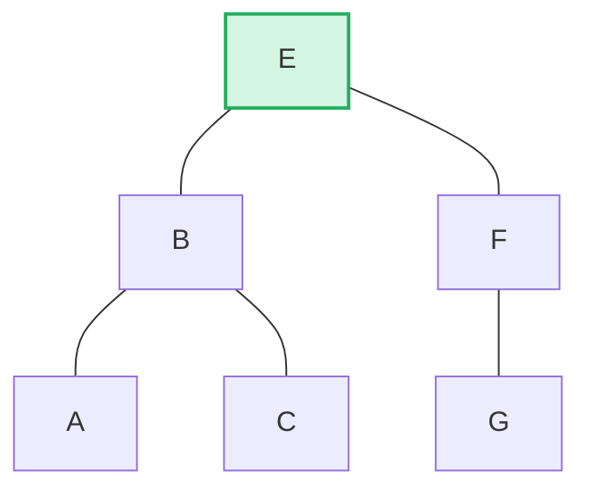

> **Pravidlo:** Pokud leva vyska > prava -> povysit pravou hranu leveho podstromu. Pokud prava vyska >= leva -> povysit levou hranu praveho podstromu. To minimalizuje prevyvazovani po smazani.

```rust
pub fn remove(self, ...) -> CostResult<Option<Self>, Error> {
    let has_left = tree.link(true).is_some();
    let has_right = tree.link(false).is_some();
    let left = tree.child_height(true) > tree.child_height(false);

    if has_left && has_right {
        // Dva potomci: povysit hranu vyssiho potomka
        let (tree, tall_child) = self.detach_expect(left, ...);
        let (_, short_child) = tree.detach_expect(!left, ...);
        tall_child.promote_edge(!left, short_child, ...)
    } else if has_left || has_right {
        // Jeden potomek: povysit primo
        self.detach_expect(left, ...).1
    } else {
        // Listovy uzel: pouze smazat
        None
    }
}
```

---
