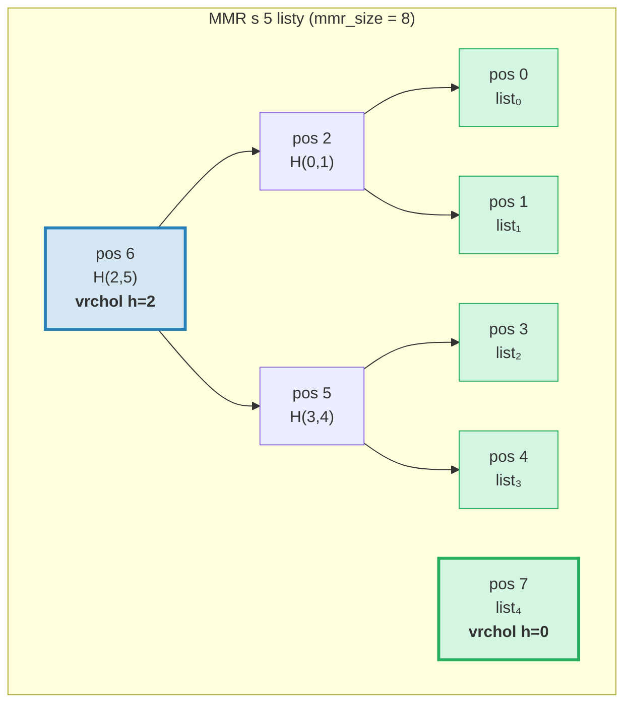
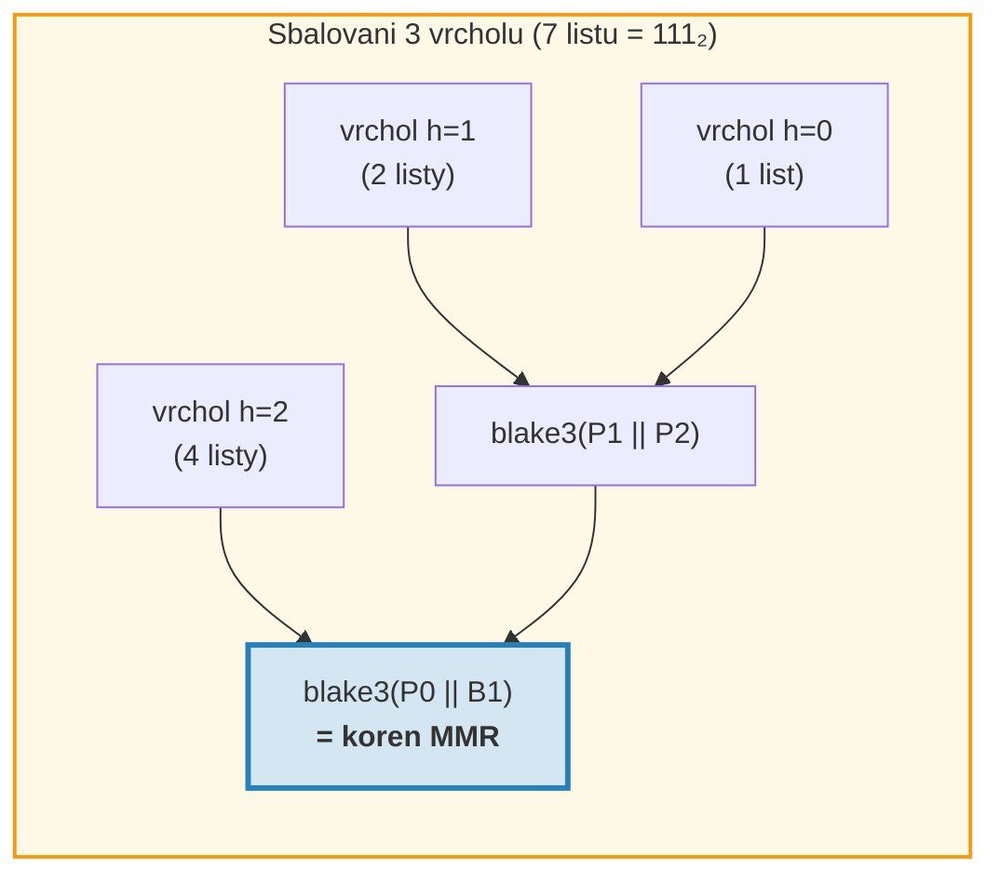
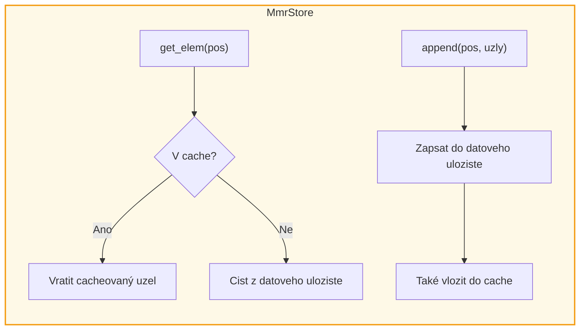
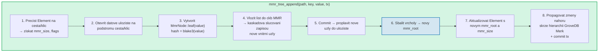
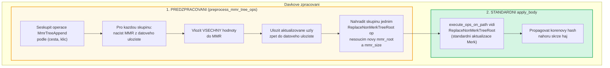
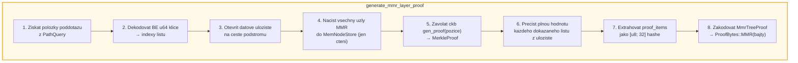
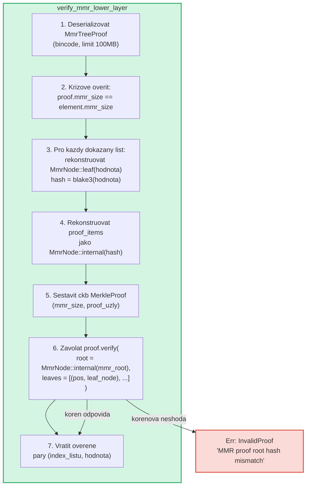

# Strom MMR -- Prikladove autentizovane logy

**MmrTree** je prikladova (append-only) autentizovana datova struktura GroveDB
postavena na Merkle Mountain Range (MMR) s hashovanim Blake3. Zatimco AVL stromy
Merk (kapitola 2) excelují pri nahodnych operacich s pary klicu a hodnot
s aktualizacemi O(log N), MMR jsou ucelove navrzeny pro prikladovy pripad:
nabizeji nulove rotace, amortizovane naklady hashe O(1) na pridani a sekvencni
I/O vzory.

Tato kapitola pokryva datovou strukturu MMR do hloubky -- jak roste, jak se
uzly ukladaji, jak pridavani kaskaduje a jak system dukazu umoznuje libovolne
treti strane overit, ze konkretni hodnota byla pridana na konkretni pozici.

## Proc samostatny typ stromu?

Standardni stromy Merk GroveDB dobre zpracovavaji razena data klicu a hodnot, ale
prikladove logy maji odlisne pozadavky:

| Vlastnost | AVL strom Merk | MMR |
|----------|----------------|-----|
| Operace | Vlozeni, aktualizace, smazani | Pouze pridavani |
| Prevyvazovani | O(log N) rotaci na zapis | Zadne |
| I/O vzor | Nahodny (prevyvazeni zasahuje mnoho uzlu) | Sekvencni (nove uzly vzdy na konci) |
| Celkove hashe pro N vlozeni | O(N log N) | O(N) |
| Struktura | Urcena poradim vlozeni | Urcena pouze poctem listu |
| Dukazy | Cesta od korene k listu | Sourozenecke + vrcholove hashe |

Pro pripady pouziti jako transakcni logy, proudy udalosti nebo jakakoliv
monotonne rostouci data je MMR striktne lepsi: jednodussi, rychlejsi a
predvidatelnejsi.

## Datova struktura MMR

MMR je **les perfektnich binarnich stromu** (nazyvanych "vrcholy" ci "peaks"),
ktery roste zleva doprava. Kazdy vrchol je uplny binarni strom nejake vysky *h*
obsahujici presne 2^h listu.

Klicovy poznatek: **binarni reprezentace poctu listu urcuje strukturu
vrcholu**. Kazdy 1-bit v binarni forme odpovida jednomu vrcholu:

```text
Pocet listu   Binarni   Vrcholy
───────────   ──────    ───────
1             1         jeden vrchol h=0
2             10        jeden vrchol h=1
3             11        vrcholy h=1, h=0
4             100       jeden vrchol h=2
5             101       vrcholy h=2, h=0
6             110       vrcholy h=2, h=1
7             111       vrcholy h=2, h=1, h=0
8             1000      jeden vrchol h=3
```

To znamena, ze struktura MMR je plne urcena jedinym cislem -- poctem listu.
Dva MMR se stejnym poctem listu maji vzdy stejny tvar, bez ohledu na to,
jake hodnoty byly pridany.

## Jak se MMR plni

Kazdy uzel v MMR ma **pozici** (indexovanou od 0). Listy a vnitrni uzly
se proplétaji v specifickem vzoru. Zde je postup rustu krok za krokem:

**Po 1 listu (mmr_size = 1):**
```text
pos:  0
      list₀        ← jeden vrchol na vysce 0
```

**Po 2 listech (mmr_size = 3):**
```text
pos:     2          ← vnitrni: blake3(list₀.hash || list₁.hash)
        / \
       0   1        ← listy

Jeden vrchol na vysce 1. Pozice 0 a 1 jsou listy, pozice 2 je vnitrni.
```
Kdyz byl pridan list₁, vytvoril vrchol vysky 0. Ale uz existoval vrchol
vysky 0 (list₀), takze se **sloucily** do vrcholu vysky 1.

**Po 3 listech (mmr_size = 4):**
```text
pos:     2     3    ← vrchol h=1, vrchol h=0
        / \
       0   1

Dva vrcholy. Zadne slouceni -- vysky 1 a 0 jsou odlisne.
(Binarni: 3 = 11₂ → jeden vrchol na kazdy 1-bit)
```

**Po 4 listech (mmr_size = 7):**
```text
pos:         6              ← vnitrni: slouceni uzlu 2 a 5
           /   \
         2       5          ← vnitrni uzly
        / \     / \
       0   1   3   4        ← listy

Jeden vrchol na vysce 2.
```
Zde to zacina byt zajimave. Pridani listu₃ (pozice 4) vytvori uzel₅
(sloucenim pozic 3 a 4). Ale nyni jsou uzel₅ (vyska 1) a uzel₂ (vyska 1)
sousedni vrcholy stejne vysky, takze se slouci do uzlu₆. **Kaskada dvou
slouceni z jedineho pridani.**

**Po 5 listech (mmr_size = 8):**
```text
pos:         6         7    ← vrchol h=2, vrchol h=0
           /   \
         2       5
        / \     / \
       0   1   3   4

Dva vrcholy. (Binarni: 5 = 101₂)
```

**Po 7 listech (mmr_size = 11):**
```text
pos:         6         10    ← vrchol h=2, vrchol h=1, vrchol h=0
           /   \      / \
         2       5   8   9    7
        / \     / \
       0   1   3   4

Tri vrcholy. (Binarni: 7 = 111₂)
```

**Po 8 listech (mmr_size = 15):**
```text
pos:              14                     ← jediny vrchol h=3
               /      \
            6            13
          /   \        /    \
        2       5    9       12
       / \     / \  / \     / \
      0   1   3  4 7   8  10  11

Jeden vrchol na vysce 3. Tri kaskadova slouceni z pridani listu₇.
```



> **Modra** = vrcholy (koreny perfektnich binarnich podstromu). **Zelena** = listove uzly.

## Kaskada slucovani

Kdyz je pridan novy list, muze to spustit retez slucovani. Pocet
slucovani se rovna poctu **koncovych 1-bitu** v binarni reprezentaci
aktualniho poctu listu:

| Pocet listu (pred push) | Binarni | koncove 1 | Slucovani | Celkove hashe |
|--------------------------|---------|-----------|-----------|---------------|
| 0 | `0` | 0 | 0 | 1 (pouze list) |
| 1 | `1` | 1 | 1 | 2 |
| 2 | `10` | 0 | 0 | 1 |
| 3 | `11` | 2 | 2 | 3 |
| 4 | `100` | 0 | 0 | 1 |
| 5 | `101` | 1 | 1 | 2 |
| 6 | `110` | 0 | 0 | 1 |
| 7 | `111` | 3 | 3 | 4 |

**Celkove hashe na push** = `1 + trailing_ones(pocet_listu)`:
- 1 hash pro samotny list: `blake3(hodnota)`
- N hashu pro kaskadu slucovani: `blake3(levy.hash || pravy.hash)` pro kazde
  slouceni

Takto GroveDB sleduje naklady hashu pro kazde pridani. Implementace:
```rust
pub fn hash_count_for_push(leaf_count: u64) -> u32 {
    1 + leaf_count.trailing_ones()
}
```

## Velikost MMR vs. pocet listu

MMR uklada jak listy, tak vnitrni uzly v ploskem prostoru pozic, takze
`mmr_size` je vzdy vetsi nez pocet listu. Presny vztah je:

```text
mmr_size = 2 * pocet_listu - popcount(pocet_listu)
```

kde `popcount` je pocet 1-bitu (tj. pocet vrcholu). Kazdy vnitrni
uzel slucuje dva podstromy a snizuje pocet uzlu o jeden na slouceni.

Zpetny vypocet -- pocet listu z mmr_size -- pouziva pozice vrcholu:

```rust
fn mmr_size_to_leaf_count(mmr_size: u64) -> u64 {
    // Kazdy vrchol na vysce h obsahuje 2^h listu
    get_peaks(mmr_size).iter()
        .map(|&peak_pos| 1u64 << pos_height_in_tree(peak_pos))
        .sum()
}
```

| mmr_size | pocet_listu | vrcholy |
|----------|------------|---------|
| 0 | 0 | (prazdny) |
| 1 | 1 | h=0 |
| 3 | 2 | h=1 |
| 4 | 3 | h=1, h=0 |
| 7 | 4 | h=2 |
| 8 | 5 | h=2, h=0 |
| 10 | 6 | h=2, h=1 |
| 11 | 7 | h=2, h=1, h=0 |
| 15 | 8 | h=3 |

GroveDB uklada `mmr_size` v elementu (nikoli pocet listu), protoze knihovna
ckb MMR pouziva pozice interně. Operace `mmr_tree_leaf_count` odvozuje
pocet listu za behu.

## Korenovy hash MMR -- Sbaleni vrcholu

MMR ma vice vrcholu (jeden na 1-bit v poctu listu). Pro vytvoreni
jedineho 32-bajtoveho korenoveho hashe se vrcholy **"sbali"** zprava doleva:

```text
root = bag_rhs_peaks(vrcholy):
    zacit s nejpravejsim vrcholem
    skladat smerem vlevo: blake3(levy_vrchol || akumulovany_pravy)
```

S 1 vrcholem je koren jen hash toho vrcholu. Se 3 vrcholy:



> Korenovy hash se meni s **kazdym** pridanim, i kdyz nedojde k zadnemu slucovani,
> protoze se meni nejpravejsi vrchol a sbaleni musi byt prepocitano.

## Struktura uzlu a serializace

Kazdy uzel MMR je `MmrNode`:

```rust
struct MmrNode {
    hash: [u8; 32],           // Hash Blake3
    value: Option<Vec<u8>>,   // Some pro listy, None pro vnitrni uzly
}
```

**Listovy uzel:** `hash = blake3(bajty_hodnoty)`, `value = Some(bajty_hodnoty)`
**Vnitrni uzel:** `hash = blake3(levy.hash || pravy.hash)`, `value = None`

Funkce slucovani je primocare -- konkatenace dvou 32-bajtovych hashu a
Blake3 vysledku:

```rust
fn blake3_merge(left: &[u8; 32], right: &[u8; 32]) -> [u8; 32] {
    let mut input = [0u8; 64];
    input[..32].copy_from_slice(left);
    input[32..].copy_from_slice(right);
    *blake3::hash(&input).as_bytes()
}
```

> **Poznamka k PartialEq:** `MmrNode` implementuje `PartialEq` porovnanim **pouze
> pole hash**, nikoli hodnoty. To je klicove pro overovani dukazu: overovatel ckb
> porovnava rekonstruovany koren (value = None) s ocekavanym korenem. Pokud by
> PartialEq porovnaval pole hodnoty, dukazy MMR s jednim listem by vzdy selhaly,
> protoze list ma `value: Some(...)`, ale rekonstrukce korene produkuje `value: None`.

**Format serializace:**
```text
Vnitrni: [0x00] [hash: 32 bajtu]                                = 33 bajtu
List:    [0x01] [hash: 32 bajtu] [delka_hodnoty: 4 BE] [hodnota...]   = 37 + delka bajtu
```

Priznak bajtu rozlisuje vnitrni uzly od listu. Deserializace validuje
presnou delku -- zadne koncove bajty povoleny.

## Architektura uloziste

MmrTree uklada sve uzly ve sloupci **data** (stejna rodina sloupcu jako
uzly Merk), nikoli v podstromu Merk. Element nema pole `root_key`
-- korenovy hash MMR prochazi jako Merk **child hash** prostrednictvim
`insert_subtree(subtree_root_hash)`, autentizujici stav MMR.

**Klice uloziste** jsou zalozeny na pozicich:
```text
klic = 'm' || pozice_jako_be_u64    (9 bajtu: prefix + u64 BE)
```

Takze pozice 42 je ulozena na klici `[0x6D, 0x00, 0x00, 0x00, 0x00, 0x00, 0x00,
0x00, 0x2A]`.

Vyhledani listu *i* vyzaduje nejprve vypocet MMR pozice:
`pos = leaf_index_to_pos(i)`, pote cteni datoveho klice `m{pos}`.

**Procitaci cache:** Behem pridavani musi byt nove zapsane uzly
okamzite citelne pro nasledna slucovani v temze pridani. Protoze transakci
uloziste GroveDB odklada zapisy do davky (nejsou viditelne pro cteni
pred commitem), adapter `MmrStore` obaluje kontext uloziste
pameti `HashMap` cache:



To zajistuje, ze kdyz pridani listu₃ spusti kaskadu slucovani (vytvorenim
vnitrnich uzlu na pozicich 5 a 6), uzel₅ je okamzite dostupny pri
vypoctu uzlu₆, i kdyz uzel₅ jeste nebyl commitnut do RocksDB.

**Propagace korenoveho hashe ke korenovemu hashi stavu GroveDB:**

```text
combined_value_hash = blake3(
    blake3(varint(len) || element_bytes),   ← value_hash ze serializovaneho elementu
    mmr_root_hash                           ← child_hash = typove specificky koren
)
```

Korenovy hash MMR prochazi jako Merk child hash pres `insert_subtree`. Jakakoliv
zmena stavu MMR produkuje odlisny `combined_value_hash`, ktery se propaguje
skrze hierarchii rodicovskeho Merk az ke korenovemu hashi stavu GroveDB.

## Operace GroveDB

MmrTree poskytuje ctyri operace:

```rust
// Pridat hodnotu — vraci (novy_mmr_koren, index_listu)
db.mmr_tree_append(path, key, value, tx, version)

// Precist aktualni korenovy hash (z elementu, zadny pristup k ulozisti)
db.mmr_tree_root_hash(path, key, tx, version)

// Ziskat hodnotu listu podle 0-zalozeneho indexu
db.mmr_tree_get_value(path, key, leaf_index, tx, version)

// Ziskat pocet pridanych listu
db.mmr_tree_leaf_count(path, key, tx, version)
```

### Prubeh pridani

Operace pridani je nejslozitejsi a provadi 8 kroku:



Krok 4 muze zapsat 1 uzel (pouze list) nebo 1 + N uzlu (list + N vnitrnich
uzlu slucovani). Krok 5 vola `mmr.commit()`, ktery proplavuje ckb MemStore
do MmrStore. Krok 7 vola `insert_subtree` s novym korenem MMR jako child hash
(pres `subtree_root_hash`), protoze MmrTree nema podrizeny Merk.

### Operace cteni

`mmr_tree_root_hash` pocita koren z dat MMR v ulozisti.
`mmr_tree_leaf_count` odvozuje pocet listu z `mmr_size` v elementu.
Zadny pristup k datovemu ulozisti neni potreba.

`mmr_tree_get_value` vypocte `pos = leaf_index_to_pos(leaf_index)`, precte
jediny zaznam datoveho uloziste na `m{pos}`, deserializuje `MmrNode` a
vrati `node.value`.

## Davkove operace

Vice pridani MMR muze byt davkovano pomoci `GroveOp::MmrTreeAppend { value }`.
Protoze standardni davkova funkce `execute_ops_on_path` ma pristup pouze
k Merk (nikoli ke kontextu uloziste MMR), pridani MMR pouzivaji **fazi predzpracovani**:



Priklad: Davka se 3 pridanimi do stejneho MMR:
```rust
vec![
    QualifiedGroveDbOp { path: p, key: k, op: MmrTreeAppend { value: v1 } },
    QualifiedGroveDbOp { path: p, key: k, op: MmrTreeAppend { value: v2 } },
    QualifiedGroveDbOp { path: p, key: k, op: MmrTreeAppend { value: v3 } },
]
```

Predzpracovani nacte MMR jednou, vlozi v1, v2, v3 (vytvorenim vsech mezilehlych
uzlu), ulozi vse do datoveho uloziste, pote emituje jediny `ReplaceNonMerkTreeRoot`
s konecnym `mmr_root` a `mmr_size`. Standardni davkove strojove zpracovani zvladne
zbytek.

## Generovani dukazu

Dukazy MMR jsou **dukazy V1** -- pouzivaji variantu `ProofBytes::MMR` ve
vrstvene strukture dukazu (viz kap. 9.6). Dukaz demonstruje, ze specificke
hodnoty listu existuji na specifickych pozicich uvnitr MMR a ze jejich hashe
jsou konzistentni s `mmr_root` ulozenym v rodicovskem elementu.

### Kodovani dotazu

Klice dotazu koduji pozice jako **big-endian u64 bajty**. To zachovava
lexikograficke poradi razeni (protoze BE kodovani je monotonne), coz umoznuje
vsem standardnim variantam `QueryItem` fungovat:

```text
QueryItem::Key([0,0,0,0,0,0,0,5])            → index listu 5
QueryItem::RangeInclusive([..2]..=[..7])      → indexy listu [2, 3, 4, 5, 6, 7]
QueryItem::RangeFrom([..10]..)                → indexy listu [10, 11, ..., N-1]
QueryItem::RangeFull                          → vsechny listy [0..pocet_listu)
```

Bezpecnostni strop **10 000 000 indexu** zabranuje vycerpani pameti z
neomezených rozsahovych dotazu. Prazdny MMR (nulove listy) vraci prazdny dukaz.

### Struktura MmrTreeProof

```rust
struct MmrTreeProof {
    mmr_size: u64,                 // Velikost MMR v dobe dukazu
    leaves: Vec<(u64, Vec<u8>)>,   // (index_listu, hodnota) pro kazdy dokazany list
    proof_items: Vec<[u8; 32]>,    // Sourozenecke/vrcholove hashe pro overeni
}
```

`proof_items` obsahuji minimalni sadu hashu potrebnych pro rekonstrukci
cest od dokazanych listu az ke koreni MMR. To jsou sourozenecke uzly
na kazde urovni a nezucastnene vrcholove hashe.

### Prubeh generovani



Krok 4 pouziva `MemNodeStore` -- BTreeMap jen pro cteni, ktery prednacte vsechny
uzly MMR z datoveho uloziste. Generator dukazu ckb potrebuje nahodny pristup,
takze vsechny uzly musi byt v pameti.

Krok 5 je, kde knihovna ckb provadi tezkou praci: pro danou velikost MMR a
pozice k dokazani urci, ktere sourozenecke a vrcholove hashe jsou potreba.

### Prakticky priklad

**Dokazovani listu 2 v MMR s 5 listy (mmr_size = 8):**

```text
Struktura MMR:
pos:         6         7
           /   \
         2       5
        / \     / \
       0   1   3   4

Index listu 2 → MMR pozice 3

Pro overeni listu na pozici 3:
  1. Zahashovat tvrzenou hodnotu: leaf_hash = blake3(hodnota)
  2. Sourozenec na pozici 4:  uzel₅ = blake3(leaf_hash || proof[pos 4])
  3. Sourozenec na pozici 2:  uzel₆ = blake3(proof[pos 2] || uzel₅)
  4. Vrchol na pozici 7:      root  = bag(uzel₆, proof[pos 7])
  5. Porovnat: root == ocekavany mmr_root ✓

proof_items = [hash(pos 4), hash(pos 2), hash(pos 7)]
leaves = [(2, puvodni_bajty_hodnoty)]
```

Velikost dukazu pro tento priklad je: 3 hashe (96 bajtu) + 1 hodnota listu +
metadata. Obecne, dokazovani K listu z N-listoveho MMR vyzaduje
O(K * log N) sourozeneckych hashu.

## Overovani dukazu

Overovani je **ciste** -- nevyzaduje zadny pristup k databazi. Overovatel
potrebuje pouze bajty dukazu a ocekavany korenovy hash MMR (ktery extrahuje
z rodicovskeho elementu dokazaneho ve vrstve Merk nad nim).

### Kroky overeni



Funkce ckb `MerkleProof::verify` rekonstruuje koren z listu a polozek
dukazu, pote ho porovnava (pomoci `PartialEq`, ktere kontroluje pouze hash)
s ocekavanym korenem.

### Retez duvery

Uplny retez od korenoveho hashe stavu GroveDB k overene hodnote listu:

```text
korenovy_hash_stavu GroveDB (znamy/duvereny)
│
├─ Dukaz Merk V0 vrstva 0: dokazuje existenci podstromu v koreni
│   └─ root_hash odpovida korenoveho_hashe_stavu ✓
│
├─ Dukaz Merk V0 vrstva 1: dokazuje element MmrTree na ceste/klici
│   └─ Uzel KVValueHash: bajty elementu obsahuji mmr_root
│   └─ combined_hash = combine_hash(H(bajty_elementu), mmr_root)
│   └─ root_hash odpovida rodicovske vrstve ✓
│
└─ Dukaz V1 MMR: dokazuje hodnoty listu v MMR
    └─ Rekonstrukce cest od listu pres sourozence k vrcholum
    └─ Sbalit vrcholy → rekonstruovany koren
    └─ rekonstruovany koren == mmr_root z bajtu elementu ✓
    └─ Vysledek: list₂ = [overene bajty hodnoty]
```

### Bezpecnostni vlastnosti

- **Krizova validace mmr_size:** `mmr_size` dukazu musi odpovidat
  `mmr_size` elementu. Neshoda indikuje, ze dukaz byl vygenerovan vuci
  jinemu stavu a je odmitnut.
- **Limit velikosti bincode:** Deserializace pouziva limit 100MB pro zabraneni
  vytvorenym hlavickam delky zpusobujicim velke alokace.
- **Uctovani limitu:** Kazdy dokazany list snizuje celkovy limit dotazu o 1
  pomoci `saturating_sub` pro zabraneni podteceni.
- **Navrat child hash:** Overovatel vraci vypocteny koren MMR jako child hash
  pro vypocet combine_hash v rodicovske vrstve.
- **Odmitnuti V0:** Pokus o poddotaz do MmrTree s dukazy V0 vraci
  `Error::NotSupported`. Pouze dukazy V1 mohou sestoupit do ne-Merk stromu.

## Sledovani nakladu

Operace MMR sledují naklady s presnosti:

| Operace | Volani hashu | Operace uloziste |
|---------|-------------|------------------|
| Pridani 1 listu | `1 + trailing_ones(pocet_listu)` | 1 zapis listu + N zapisu vnitrnich uzlu |
| Korenovy hash | 0 (cacheovano v elementu) | 1 cteni elementu |
| Ziskani hodnoty | 0 | 1 cteni elementu + 1 cteni dat |
| Pocet listu | 0 | 1 cteni elementu |

Vzorec poctu hashu `1 + trailing_ones(N)` dava presny pocet volani Blake3:
1 pro hash listu, plus jeden hash slucovani na uroven kaskady.

**Amortizovana analyza:** Pres N pridani je celkovy pocet hashu:

```text
Σ (1 + trailing_ones(i)) pro i = 0..N-1
= N + Σ trailing_ones(i) pro i = 0..N-1
= N + (N - popcount(N))
≈ 2N
```

Takze amortizovane naklady na pridani jsou priblizne **2 volani hashu Blake3** --
konstantni a nezavisle na velikosti stromu. Porovnejte s AVL stromy Merk, kde
kazde vlozeni vyzaduje O(log N) hashu pro cestu plus potencialni hashe rotaci.

**Naklady uloziste:** Kazde pridani zapisuje 1 listovy uzel (37 + delka_hodnoty bajtu)
plus 0 az log₂(N) vnitrnich uzlu (33 bajtu kazdy). Amortizovany zapis
uloziste na pridani je priblizne 33 + 37 + delka_hodnoty bajtu ≈ 70 + delka_hodnoty bajtu.

## Implementacni soubory

| Soubor | Ucel |
|--------|------|
| `grovedb-mmr/src/node.rs` | Struktura `MmrNode`, slucovani Blake3, serializace |
| `grovedb-mmr/src/grove_mmr.rs` | Obaleni `GroveMmr` kolem ckb MMR |
| `grovedb-mmr/src/util.rs` | `mmr_node_key`, `hash_count_for_push`, `mmr_size_to_leaf_count` |
| `grovedb-mmr/src/proof.rs` | Generovani a overovani `MmrTreeProof` |
| `grovedb-mmr/src/dense_merkle.rs` | Huste Merklovy koreny (pouzivano BulkAppendTree) |
| `grovedb/src/operations/mmr_tree.rs` | Operace GroveDB + adapter `MmrStore` + predzpracovani davek |
| `grovedb/src/operations/proof/generate.rs` | Generovani dukazu V1: `generate_mmr_layer_proof`, `query_items_to_leaf_indices` |
| `grovedb/src/operations/proof/verify.rs` | Overovani dukazu V1: `verify_mmr_lower_layer` |
| `grovedb/src/tests/mmr_tree_tests.rs` | 28 integracnich testu |

## Porovnani s ostatnimi autentizovanymi strukturami

| | MMR (MmrTree) | Merk AVL (Tree) | Sinsemilla (CommitmentTree) |
|---|---|---|---|
| **Pripad pouziti** | Prikladove logy | Uloziste klicu-hodnot | ZK-kompatibilni zavazky |
| **Hashovaci funkce** | Blake3 | Blake3 | Sinsemilla (krivka Pallas) |
| **Operace** | Pridani, cteni podle indexu | Vlozeni, aktualizace, smazani, dotaz | Pridani, svedek |
| **Amortizovane hashe/zapis** | ~2 | O(log N) | ~33 (32 urovni + ommery) |
| **Typ dukazu** | V1 (sourozenecke hashe MMR) | V0 (dukaz cesty Merk) | Svedek (Merkluv auth cesta) |
| **ZK-kompatibilni** | Ne | Ne | Ano (Halo 2 obvody) |
| **Prevyvazovani** | Zadne | AVL rotace | Zadne |
| **Podpora mazani** | Ne | Ano | Ne |

---
