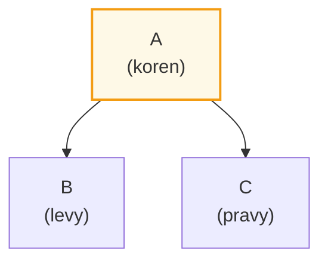
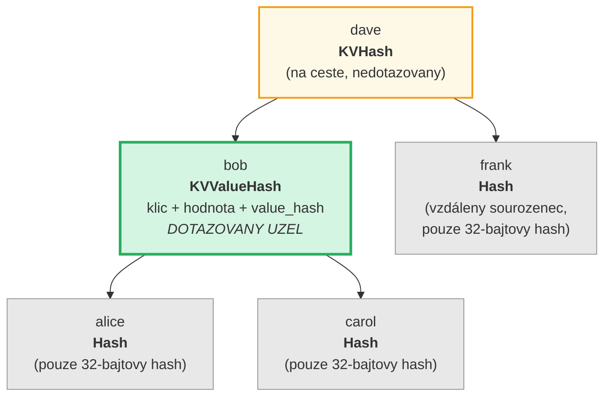
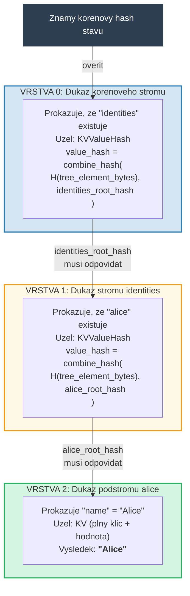
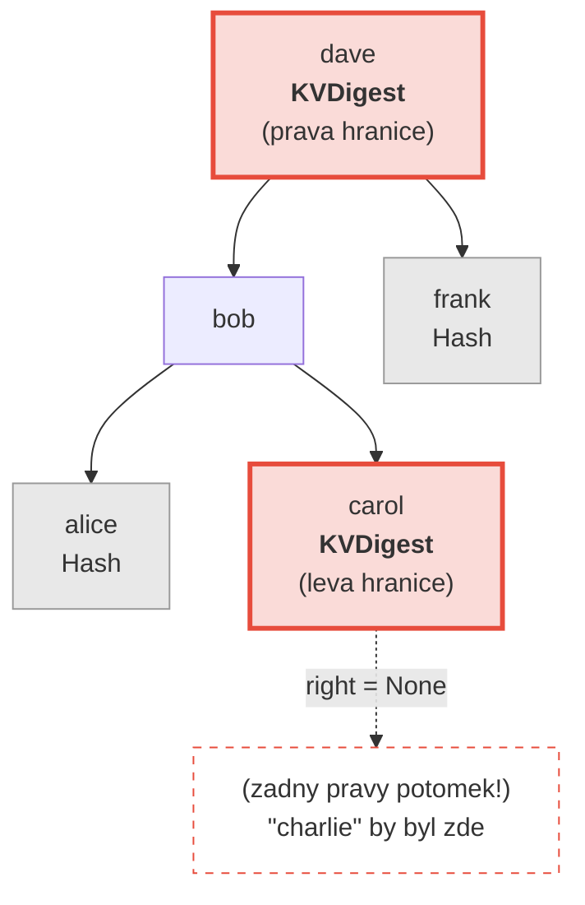
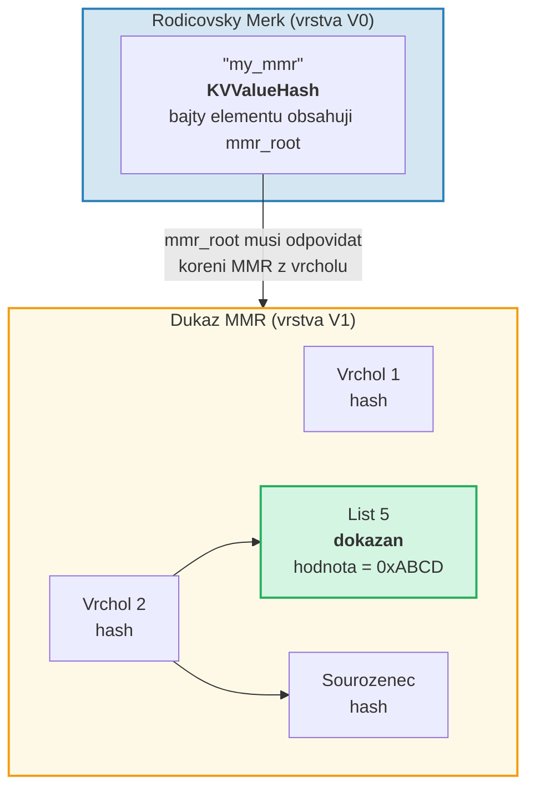
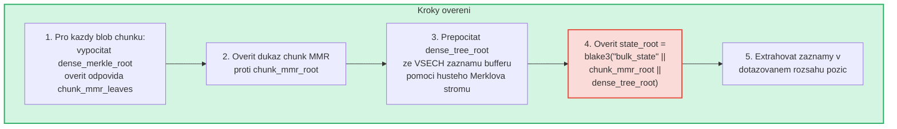
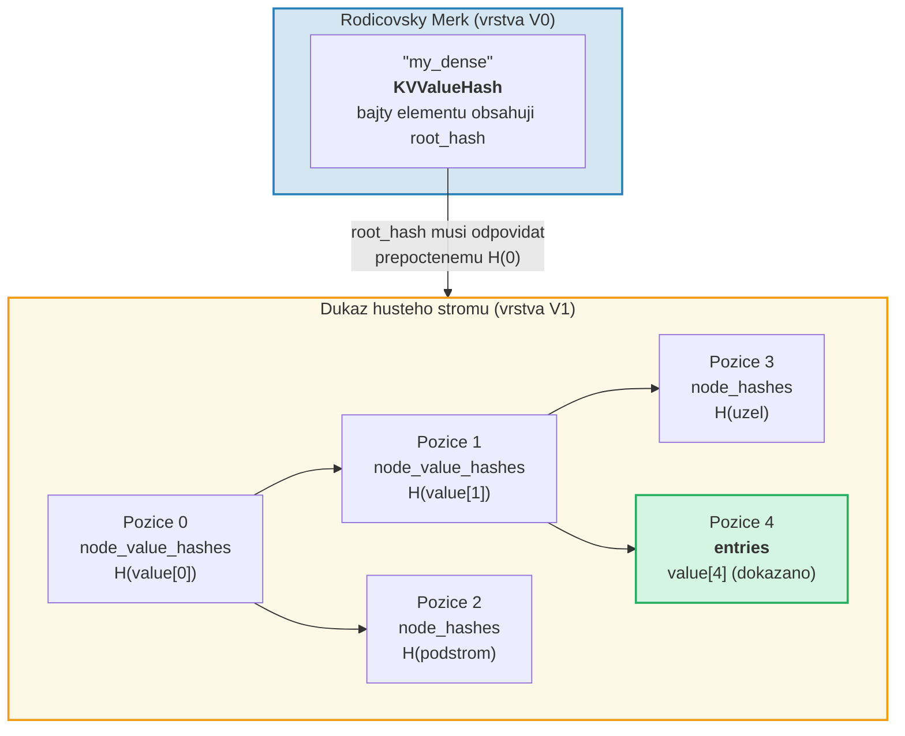

# System dukazu

System dukazu (proof) GroveDB umoznuje jakekoli strane overit spravnost vysledku
dotazu bez nutnosti mit celou databazi. Dukaz je kompaktni reprezentace
relevantni stromove struktury, ktera umoznuje rekonstrukci korenoveho hashe.

## Zasobnikove operace dukazu

Dukazy jsou zakodovany jako sekvence **operaci**, ktere rekonstruuji castecny
strom pomoci zasobnikoveho stroje (stack machine):

```rust
// merk/src/proofs/mod.rs
pub enum Op {
    Push(Node),        // Vlozit uzel na zasobnik (vzestupne poradi klicu)
    PushInverted(Node),// Vlozit uzel (sestupne poradi klicu)
    Parent,            // Odebrat rodice, odebrat potomka → pripojit potomka jako LEVEHO rodice
    Child,             // Odebrat potomka, odebrat rodice → pripojit potomka jako PRAVEHO rodice
    ParentInverted,    // Odebrat rodice, odebrat potomka → pripojit potomka jako PRAVEHO rodice
    ChildInverted,     // Odebrat potomka, odebrat rodice → pripojit potomka jako LEVEHO rodice
}
```

Provedeni pouziva zasobnik:

Operace dukazu: `Push(B), Push(A), Parent, Push(C), Child`

| Krok | Operace | Zasobnik (vrch→vpravo) | Akce |
|------|---------|------------------------|------|
| 1 | Push(B) | [ B ] | Vlozit B na zasobnik |
| 2 | Push(A) | [ B , A ] | Vlozit A na zasobnik |
| 3 | Parent | [ A{left:B} ] | Odebrat A (rodic), odebrat B (potomek), B → LEVY potomek A |
| 4 | Push(C) | [ A{left:B} , C ] | Vlozit C na zasobnik |
| 5 | Child | [ A{left:B, right:C} ] | Odebrat C (potomek), odebrat A (rodic), C → PRAVY potomek A |

Konecny vysledek -- jeden strom na zasobniku:



> Overovatel vypocte `node_hash(A) = Blake3(kv_hash_A || node_hash_B || node_hash_C)` a overi, ze odpovida ocekavandemu korenovemu hashi.

Toto je funkce `execute` (`merk/src/proofs/tree.rs`):

```rust
pub fn execute<I, F>(ops: I, collapse: bool, mut visit_node: F) -> CostResult<Tree, Error>
where
    I: IntoIterator<Item = Result<Op, Error>>,
    F: FnMut(&Node) -> Result<(), Error>,
{
    let mut stack: Vec<Tree> = Vec::with_capacity(32);

    for op in ops {
        match op? {
            Op::Parent => {
                let (mut parent, child) = (try_pop(&mut stack), try_pop(&mut stack));
                parent.left = Some(Child { tree: Box::new(child), hash: child.hash() });
                stack.push(parent);
            }
            Op::Child => {
                let (child, mut parent) = (try_pop(&mut stack), try_pop(&mut stack));
                parent.right = Some(Child { tree: Box::new(child), hash: child.hash() });
                stack.push(parent);
            }
            Op::Push(node) => {
                visit_node(&node)?;
                stack.push(Tree::from(node));
            }
            // ... Invertovane varianty prohazuji levy/pravy
        }
    }
    // Konecna polozka na zasobniku je koren
}
```

## Typy uzlu v dukazech

Kazdy `Push` nese `Node`, ktery obsahuje presne tolik informaci, kolik je
potreba pro overeni:

```rust
pub enum Node {
    // Minimum informaci — pouze hash. Pouzivano pro vzdálene sourozence.
    Hash(CryptoHash),

    // KV hash pro uzly na ceste, ale nedotazovane.
    KVHash(CryptoHash),

    // Plny klic-hodnota pro dotazovane polozky.
    KV(Vec<u8>, Vec<u8>),

    // Klic, hodnota a predvypocteny value_hash.
    // Pouzivano pro podstromy kde value_hash = combine_hash(...)
    KVValueHash(Vec<u8>, Vec<u8>, CryptoHash),

    // KV s typem vlastnosti — pro ProvableCountTree nebo obnovu chunku.
    KVValueHashFeatureType(Vec<u8>, Vec<u8>, CryptoHash, TreeFeatureType),

    // Reference: klic, dereferencovana hodnota, hash elementu reference.
    KVRefValueHash(Vec<u8>, Vec<u8>, CryptoHash),

    // Pro polozky v ProvableCountTree.
    KVCount(Vec<u8>, Vec<u8>, u64),

    // KV hash + pocet pro nedotazovane uzly ProvableCountTree.
    KVHashCount(CryptoHash, u64),

    // Reference v ProvableCountTree.
    KVRefValueHashCount(Vec<u8>, Vec<u8>, CryptoHash, u64),

    // Pro dukazy hranice/neexistence v ProvableCountTree.
    KVDigestCount(Vec<u8>, CryptoHash, u64),

    // Klic + value_hash pro dukazy neexistence (bezne stromy).
    KVDigest(Vec<u8>, CryptoHash),
}
```

Vyber typu Node urcuje, jake informace overovatel potrebuje:

**Dotaz: "Ziskej hodnotu pro klic 'bob'"**



> Zelena = dotazovany uzel (plna data odhalena). Zluta = na ceste (pouze kv_hash). Seda = sourozenci (pouze 32-bajtove hashe uzlu).

Zakodovano jako operace dukazu:

| # | Operace | Efekt |
|---|---------|-------|
| 1 | Push(Hash(alice_node_hash)) | Vlozit hash alice |
| 2 | Push(KVValueHash("bob", hodnota, value_hash)) | Vlozit bob s uplnymi daty |
| 3 | Parent | alice se stane levym potomkem bob |
| 4 | Push(Hash(carol_node_hash)) | Vlozit hash carol |
| 5 | Child | carol se stane pravym potomkem bob |
| 6 | Push(KVHash(dave_kv_hash)) | Vlozit kv_hash dave |
| 7 | Parent | podstrom bob se stane levym potomkem dave |
| 8 | Push(Hash(frank_node_hash)) | Vlozit hash frank |
| 9 | Child | frank se stane pravym potomkem dave |

## Vicevrstvove generovani dukazu

Protoze GroveDB je strom stromu, dukazy zahrnuji vice vrstev. Kazda vrstva
prokazuje relevantni cast jednoho stromu Merk a vrstvy jsou propojeny
mechanismem kombinovaneho value_hash:

**Dotaz:** `Ziskej ["identities", "alice", "name"]`



> **Retez duvery:** `znamy_korenovy_hash_stavu → overit vrstvu 0 → overit vrstvu 1 → overit vrstvu 2 → "Alice"`. Rekonstruovany korenovy hash kazde vrstvy musi odpovidat value_hash z nadrazene vrstvy.

Overovatel kontroluje kazdou vrstvu a potvrzuje, ze:
1. Dukaz vrstvy se rekonstruuje na ocekavany korenovy hash
2. Korenovy hash odpovida value_hash z rodicovske vrstvy
3. Korenovy hash nejvyssi urovne odpovida znamemu korenovemu hashi stavu

## Overovani dukazu

Overovani sleduje vrstvy dukazu zdola nahoru nebo shora dolu, pouzivajici funkci
`execute` pro rekonstrukci stromu kazde vrstvy. Metoda `Tree::hash()` ve stromu
dukazu vypocte hash na zaklade typu uzlu:

```rust
impl Tree {
    pub fn hash(&self) -> CostContext<CryptoHash> {
        match &self.node {
            Node::Hash(hash) => *hash,  // Jiz hash, vratit primo

            Node::KVHash(kv_hash) =>
                node_hash(kv_hash, &self.child_hash(true), &self.child_hash(false)),

            Node::KV(key, value) =>
                kv_hash(key, value)
                    .flat_map(|kv_hash| node_hash(&kv_hash, &left, &right)),

            Node::KVValueHash(key, _, value_hash) =>
                kv_digest_to_kv_hash(key, value_hash)
                    .flat_map(|kv_hash| node_hash(&kv_hash, &left, &right)),

            Node::KVValueHashFeatureType(key, _, value_hash, feature_type) => {
                let kv = kv_digest_to_kv_hash(key, value_hash);
                match feature_type {
                    ProvableCountedMerkNode(count) =>
                        node_hash_with_count(&kv, &left, &right, *count),
                    _ => node_hash(&kv, &left, &right),
                }
            }

            Node::KVRefValueHash(key, referenced_value, ref_element_hash) => {
                let ref_value_hash = value_hash(referenced_value);
                let combined = combine_hash(ref_element_hash, &ref_value_hash);
                let kv = kv_digest_to_kv_hash(key, &combined);
                node_hash(&kv, &left, &right)
            }
            // ... dalsi varianty
        }
    }
}
```

## Dukazy neexistence

GroveDB muze dokazat, ze klic **neexistuje**. To pouziva hranicni uzly --
uzly, ktere by sousedily s chybejicim klicem, pokud by existoval:

**Dokazat:** "charlie" NEEXISTUJE



> **Binarni vyhledavani:** alice < bob < carol < **"charlie"** < dave < frank. "charlie" by byl mezi carol a dave. Pravy potomek carol je `None`, coz dokazuje, ze mezi carol a dave nic neexistuje. Proto "charlie" nemuze v tomto stromu existovat.

Pro rozsahove dotazy dukazy neexistence ukazuji, ze v dotazovanem
rozsahu nejsou zadne klice, ktere nebyly zahrnuty do sady vysledku.

## Dukazy V1 -- Ne-Merk stromy

System dukazu V0 funguje vyhradne s podstromy Merk a sestupuje vrstvu po
vrstve skrze hierarchii haje. Nicmene elementy **CommitmentTree**, **MmrTree**,
**BulkAppendTree** a **DenseAppendOnlyFixedSizeTree** ukladaji svá data
mimo podrizeny strom Merk. Nemaji podrizeny Merk, do ktereho by sestoupily --
jejich typove specificky korenovy hash prochazi jako Merk child hash misto toho.

**Format dukazu V1** rozsiruje V0 o zpracovani techto ne-Merk stromu
s typove specifickymi strukturami dukazu:

```rust
/// Ktery format dukazu vrstva pouziva.
pub enum ProofBytes {
    Merk(Vec<u8>),            // Standardni operace dukazu Merk
    MMR(Vec<u8>),             // Dukaz clenstvi MMR
    BulkAppendTree(Vec<u8>),  // Rozsahovy dukaz BulkAppendTree
    DenseTree(Vec<u8>),       // Inkluzni dukaz husteho stromu
    CommitmentTree(Vec<u8>),  // Koren sinsemilla (32 bajtu) + bajty dukazu BulkAppendTree
}

/// Jedna vrstva dukazu V1.
pub struct LayerProof {
    pub merk_proof: ProofBytes,
    pub lower_layers: BTreeMap<Vec<u8>, LayerProof>,
}
```

**Pravidlo vyberu V0/V1:** Pokud je kazda vrstva v dukazu standardni strom Merk,
`prove_query` produkuje `GroveDBProof::V0` (zpetne kompatibilni). Pokud jakakoliv
vrstva zahrnuje MmrTree, BulkAppendTree nebo DenseAppendOnlyFixedSizeTree,
produkuje `GroveDBProof::V1`.

### Jak se dukazy ne-Merk stromu vazou ke korenovemu hashi

Rodicovsky strom Merk prokazuje serializovane bajty elementu prostrednictvim
standardniho uzlu dukazu Merk (`KVValueHash`). Typove specificky koren (napr.
`mmr_root` nebo `state_root`) prochazi jako Merk **child hash** -- NENI vlozeny
do bajtu elementu:

```text
combined_value_hash = combine_hash(
    Blake3(varint(len) || element_bytes),   ← obsahuje pocet, vysku atd.
    type_specific_root                      ← mmr_root / state_root / dense_root
)
```

Typove specificky dukaz pote dokazuje, ze dotazovana data jsou konzistentni
s typove specifickym korenem, ktery byl pouzit jako child hash.

### Dukazy MMR stromu

Dukaz MMR dokazuje, ze specificke listy existuji na znamych pozicich uvnitr
MMR a ze korenovy hash MMR odpovida child hash ulozenemu
v rodicovskem uzlu Merk:

```rust
pub struct MmrProof {
    pub mmr_size: u64,
    pub proof: MerkleProof,  // ckb_merkle_mountain_range::MerkleProof
    pub leaves: Vec<MmrProofLeaf>,
}

pub struct MmrProofLeaf {
    pub position: u64,       // Pozice MMR
    pub leaf_index: u64,     // Logicky index listu
    pub hash: [u8; 32],      // Hash listu
    pub value: Vec<u8>,      // Bajty hodnoty listu
}
```



**Klice dotazu jsou pozice:** Polozky dotazu koduji pozice jako big-endian u64
bajty (coz zachovava poradi razeni). `QueryItem::RangeInclusive` s BE-zakodovanymi
pocatecni/koncovou pozici vybira souvisly rozsah listu MMR.

**Overeni:**
1. Rekonstruovat listy `MmrNode` z dukazu
2. Overit ckb `MerkleProof` proti ocekavanem koreni MMR z rodicovskeho Merk child hash
3. Krizove overit, ze `proof.mmr_size` odpovida ulozene velikosti elementu
4. Vratit dokazane hodnoty listu

### Dukazy BulkAppendTree

Dukazy BulkAppendTree jsou slozitejsi, protoze data ziji na dvou mistech: uzavrene
bloby chunku a rozpracovany buffer. Rozsahovy dukaz musi vratit:

- **Plne bloby chunku** pro kazdy dokonceny chunk prekryvajici se s rozsahem dotazu
- **Jednotlive zaznamy bufferu** pro pozice stale v bufferu

```rust
pub struct BulkAppendTreeProof {
    pub chunk_power: u8,
    pub total_count: u64,
    pub chunk_blobs: Vec<(u64, Vec<u8>)>,       // (index_chunku, bajty_blobu)
    pub chunk_mmr_size: u64,
    pub chunk_mmr_proof_items: Vec<[u8; 32]>,    // Hashe sourozencu MMR
    pub chunk_mmr_leaves: Vec<(u64, [u8; 32])>,  // (mmr_pozice, husty_merkluv_koren)
    pub buffer_entries: Vec<Vec<u8>>,             // VSECHNY aktualni zaznamy bufferu (husteho stromu)
    pub chunk_mmr_root: [u8; 32],
}
```



> **Proc zahrnovat VSECHNY zaznamy bufferu?** Buffer je husty Merkluv strom, jehoz
> korenovy hash se zavazuje ke kazdemu zaznamu. Pro overeni `dense_tree_root` musi
> overovatel prestavet strom ze vsech zaznamu. Protoze je buffer omezen na `capacity`
> zaznamu (maximalne 65 535), je to prijatelne.

**Uctovani limitu:** Kazda jednotliva hodnota (v chunku nebo bufferu) se
pocita k limitu dotazu, nikoli kazdy blob chunku jako celek. Pokud ma dotaz
`limit: 100` a chunk obsahuje 1024 zaznamu s 500 prekryvajicimi se s rozsahem,
vsech 500 zaznamu se pocita k limitu.

### Dukazy DenseAppendOnlyFixedSizeTree

Dukaz husteho stromu dokazuje, ze specificke pozice drzi specificke hodnoty,
autentizovane vuci korenovemu hashi stromu (ktery prochazi jako Merk child hash).
Vsechny uzly pouzivaji `blake3(H(hodnota) || H(levy) || H(pravy))`, takze uzly
predku na overovaci ceste potrebuji pouze svuj 32-bajtovy **hash hodnoty** -- nikoli
plnou hodnotu.

```rust
pub struct DenseTreeProof {
    pub entries: Vec<(u16, Vec<u8>)>,            // dokazane (pozice, hodnota)
    pub node_value_hashes: Vec<(u16, [u8; 32])>, // hashe hodnot predku na overovaci ceste
    pub node_hashes: Vec<(u16, [u8; 32])>,       // predvypoctene hashe sourozeneckych podstromu
}
```

> `height` a `count` pochazeji z rodicovskeho elementu (autentizovaneho hierarchii Merk), nikoli z dukazu.



**Overeni** je cista funkce nevyzadujici uloziste:
1. Sestavit vyhledavaci mapy z `entries`, `node_value_hashes` a `node_hashes`
2. Rekurzivne prepocitat korenovy hash z pozice 0:
   - Pozice ma predvypocteny hash v `node_hashes` → pouzit primo
   - Pozice s hodnotou v `entries` → `blake3(blake3(hodnota) || H(levy) || H(pravy))`
   - Pozice s hashem v `node_value_hashes` → `blake3(hash || H(levy) || H(pravy))`
   - Pozice `>= count` nebo `>= capacity` → `[0u8; 32]`
3. Porovnat vypocteny koren s ocekavanym korenovym hashem z rodicovskeho elementu
4. Vratit dokazane zaznamy pri uspechu

**Dukazy vice pozic** sluci prekryvajici se overovaci cesty: sdileni predci a
jejich hodnoty se objevi pouze jednou, coz je cini kompaktnejsimi nez nezavisle dukazy.

---
