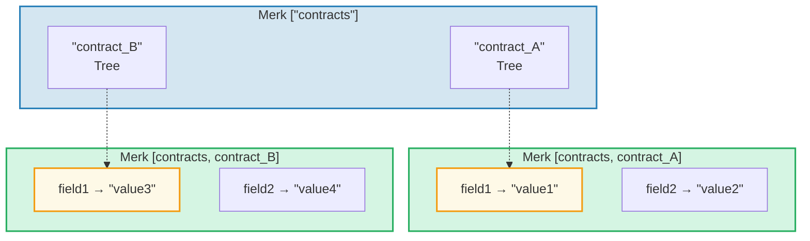
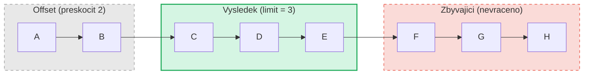

# System dotazu

## Struktura PathQuery

Dotazy GroveDB pouzivaji typ `PathQuery`, ktery kombinuje cestu (kde hledat)
s dotazem (co vybrat):

```rust
pub struct PathQuery {
    pub path: Vec<Vec<u8>>,         // Vychozi cesta v haji
    pub query: SizedQuery,          // Co vybrat
}

pub struct SizedQuery {
    pub query: Query,               // Kriteria vyberu
    pub limit: Option<u16>,         // Maximalni pocet vysledku
    pub offset: Option<u16>,        // Preskocit prvnich N vysledku
}
```

## Typ Query

```rust
pub struct Query {
    pub items: Vec<QueryItem>,              // Co ma odpovidat
    pub default_subquery_branch: SubqueryBranch,
    pub conditional_subquery_branches: Option<IndexMap<QueryItem, SubqueryBranch>>,
    pub left_to_right: bool,                // Smer iterace
    pub add_parent_tree_on_subquery: bool,  // Zahrnout rodicovsky element stromu ve vysledcich (v2)
}
```

> **`add_parent_tree_on_subquery`** (v2): Kdyz je `true`, rodicovsky element stromu (napr.
> CountTree nebo SumTree) je zahrnut ve vysledcich dotazu spolu s hodnotami jeho potomku.
> To umoznuje ziskat jak agregatni hodnoty, tak jednotlive elementy v jednom dotazu.

## QueryItems -- Co vybrat

Kazdy `QueryItem` specifikuje klic nebo rozsah, ktery ma odpovidat:

```rust
pub enum QueryItem {
    Key(Vec<u8>),                           // Presna shoda klice
    Range(Range<Vec<u8>>),                  // Exkluzivni rozsah [zacatek..konec)
    RangeInclusive(RangeInclusive<Vec<u8>>),// Inkluzivni rozsah [zacatek..=konec]
    RangeFull(RangeFull),                   // Vsechny klice
    RangeFrom(RangeFrom<Vec<u8>>),          // [zacatek..)
    RangeTo(RangeTo<Vec<u8>>),              // [..konec)
    RangeToInclusive(RangeToInclusive<Vec<u8>>), // [..=konec]
    RangeAfter(RangeFrom<Vec<u8>>),         // (zacatek..) exkluzivni zacatek
    RangeAfterTo(Range<Vec<u8>>),           // (zacatek..konec) exkluzivni oba
    RangeAfterToInclusive(RangeInclusive<Vec<u8>>), // (zacatek..=konec]
}
```

Priklady dotazu:

Strom Merk (serazeny): `alice  bob  carol  dave  eve  frank`

| Dotaz | Vyber | Vysledek |
|-------|-------|----------|
| `Key("bob")` | alice **[bob]** carol dave eve frank | bob |
| `RangeInclusive("bob"..="dave")` | alice **[bob carol dave]** eve frank | bob, carol, dave |
| `RangeAfter("carol"..)` | alice bob carol **[dave eve frank]** | dave, eve, frank |
| `RangeFull`, limit=2 | **[alice bob]** carol dave eve frank *(zastaveno limitem)* | alice, bob |
| `RangeFull`, limit=2, zprava doleva | alice bob carol dave **[eve frank]** *(zastaveno limitem)* | frank, eve |

## Poddotazy a podminene vetve

Skutecna sila dotazu GroveDB spociva v **poddotazech** -- kdyz dotaz najde element
Tree, dotaz muze automaticky sestoupit do tohoto podstromu:



> **PathQuery:** `path: ["contracts"], query: RangeFull` s `default_subquery: Key("field1")`
>
> **Provedeni:**
> 1. `RangeFull` na ["contracts"] → najde contract_A, contract_B
> 2. Oba jsou elementy Tree → sestup s poddotazem `Key("field1")`
> 3. contract_A → "value1", contract_B → "value3"
>
> **Vysledek:** `["value1", "value3"]`

**Podminene poddotazy** umoznuji aplikovat ruzne poddotazy na zaklade toho,
ktery klic byl nalezen:

```rust
conditional_subquery_branches: Some(indexmap! {
    QueryItem::Key(b"contract_A".to_vec()) => SubqueryBranch {
        subquery: Some(Query { items: vec![Key(b"field1".to_vec())] }),
        ..
    },
    QueryItem::Key(b"contract_B".to_vec()) => SubqueryBranch {
        subquery: Some(Query { items: vec![Key(b"field2".to_vec())] }),
        ..
    },
})
```

To by ziskalo `field1` z `contract_A`, ale `field2` z `contract_B`.

## Velikostni dotazy -- Limit a offset

Obalovac `SizedQuery` pridava strankovani (pagination):



> `SizedQuery { query: RangeFull, limit: Some(3), offset: Some(2) }` → Vysledek: **[C, D, E]**

Pri kombinaci s `left_to_right: false` je iterace obrácena:

```text
    SizedQuery {
        query: Query { items: [RangeFull], left_to_right: false, .. },
        limit: Some(3),
        offset: None
    }

    Vysledek: [H, G, F]
```

## Slucovani dotazu

Vice PathQuery muze byt slouceno do jednoho dotazu pro efektivitu. Algoritmus
slucovani najde spolecne prefixy cest a zkombinuje polozky dotazu:

```text
    Dotaz A: cesta=["users"], dotaz=Key("alice")
    Dotaz B: cesta=["users"], dotaz=Key("bob")

    Slouceno: cesta=["users"], dotaz=items=[Key("alice"), Key("bob")]
```

---
